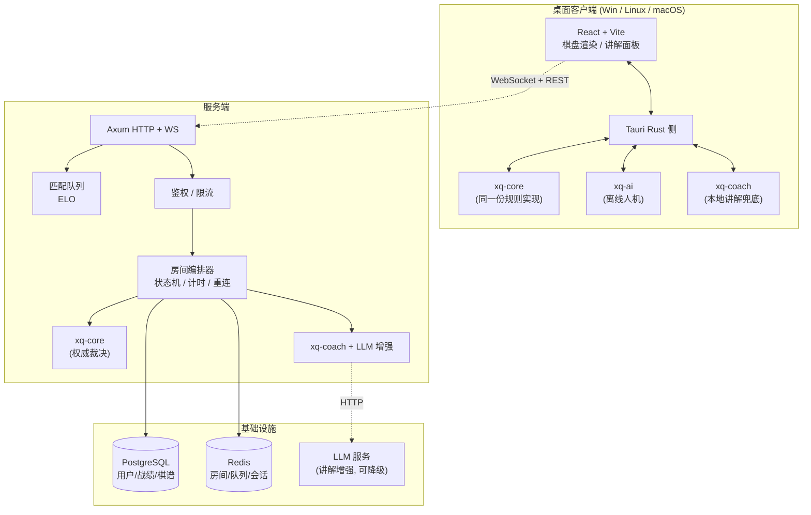

# 弈道 · chinese-chess-rs

> 一款用 Rust 全栈实现的中国象棋对战平台：跨平台原生客户端（Windows / Linux / macOS）+ 联网对战服务端 + 本地 AI 引擎 + 战法讲解系统。

---

## 1. 项目简介

**弈道** 是一个对标 JJ 象棋体验的中国象棋产品，核心差异点是**"会讲课的象棋"**——不只让你下棋，还在每一步旁边告诉你这步好在哪、差在哪、符合什么战法。

产品由三个可独立部署的部分组成：

| 部分 | 说明 | 技术 |
|---|---|---|
| **客户端** | 桌面原生应用，支持 Windows / Linux / macOS；含离线人机、在线对战、观战、复盘 | Tauri 2 + React + Vite + TS（Rust 侧负责引擎与通信） |
| **服务端** | 房间管理、实时对战同步、匹配队列、排行榜、战绩持久化 | Axum + Tokio + WebSocket + SeaORM + PostgreSQL + Redis |
| **引擎库** | 规则裁决、AI 搜索、战法讲解，跨端复用同一份 Rust 代码 | 纯 Rust workspace crate，零 unsafe |

> **设计原则**：规则与引擎只有一份实现。客户端离线模式、服务端权威裁决、AI 训练工具、复盘分析器全部复用同一个 `xq-core`，从根本上消除"客户端判赢、服务端判输"的规则分歧。

---

## 2. 特性矩阵

| 能力 | 优先级 | 说明 |
|---|---|---|
| 完整规则裁决 | P0 | 走法生成、将军/将死/困毙、长将长捉、60 回合自然限着、白脸将 |
| 走棋提示 | P0 | 选中棋子高亮全部合法落点；危险提示（被吃/被将）；推荐着法箭头 |
| 战法讲解 | P0 | 每步旁标注战法名称 + 意图 + 评价（本地模板兜底 → LLM 增强） |
| 人机对战 | P0 | 3~5 档难度、悔棋、提示、让子、残局挑战 |
| 联网对战 | P0 | 房间创建/加入、观战、断线重连、走棋计时、悔棋/求和/认输 |
| 服务端权威 | P0 | 所有着法服务端校验，客户端不可信 |
| 天梯匹配 | P1 | ELO 匹配队列、积分排行榜、赛季 |
| 复盘分析 | P1 | 全盘逐着评估、失误标注（优/良/疑/劣）、导出棋谱 |
| 聊天与举报 | P2 | 房间内文字聊天、敏感词过滤、举报工单 |
| 残局/题库模式 | P2 | 内置残局库、每日一题 |
| AI 托管/代打 | P2 | 掉线时代打（可配置，天梯禁用） |

> **实现进度**：规则内核（`xq-core`）已随 M0 完成 —— 走法生成、将军/将死/困毙、
> 白脸将、60 回合限着、长将裁决、FEN 与中文记谱双向转换均已落地并通过 perft 全深度校验。
> 长捉 / 长兑的判定与 AI、讲解、联网部分同属后续里程碑，详见
> [docs/03 §14.3](docs/03-规则引擎与领域模型.md#143-明确尚未实现的部分)。

---

## 3. 技术选型

**所有版本号均于 2026-09-23 通过 `cargo search` / crates.io API 实测确认，非估算。**

### 3.1 工具链

| 项 | 版本 | 备注 |
|---|---|---|
| Rust | **1.98.1** (2026-09-01) | 使用 `edition = "2024"` |
| Cargo | 1.98.1 | workspace resolver 3 |
| Node.js | 22.x LTS 或 24.x | 前端构建（沿用现有环境） |
| pnpm | 10.x | 前端包管理 |
| PostgreSQL | 16+ | 主数据存储 |
| Redis | 7.x | 房间状态、匹配队列、会话、限流 |

### 3.2 Rust 依赖（实测版本）

| Crate | 版本 | 用途 |
|---|---|---|
| `axum` | 0.8.9 | HTTP 路由 / REST API |
| `axum-extra` | 0.12.6 | 提取器扩展、TypedHeader |
| `tokio` | 1.53.1 | 异步运行时（features: full） |
| `tokio-tungstenite` | 0.30.0 | WebSocket 底层（axum `ws` 亦基于 tungstenite） |
| `tower-http` | 0.7.1 | CORS / Trace / Compression / Timeout 中间件 |
| `serde` / `serde_json` | 1.0.229 | 序列化 |
| `sea-orm` | 2.0.3 | ORM + 迁移 |
| `sqlx` | 0.9.0 | SeaORM 底层驱动（PostgreSQL） |
| `jsonwebtoken` | 11.1.0 | JWT 鉴权 |
| `uuid` | 1.26.1 | ID 生成（v7 时间有序） |
| `tracing` / `tracing-subscriber` | 0.1.44 | 结构化日志与追踪 |
| `rand` | 0.10.3 | 引擎随机化、匹配扰动、洗牌 |
| `thiserror` | 2.0.20 | 库层错误类型 |
| `anyhow` | 1.0.104 | 应用层错误传播 |
| `dashmap` | **6.2.1** | 并发房间表（注意：7.0 尚为 rc，勿用） |
| `validator` | 0.21.0 | 请求参数校验 |
| `config` | 0.15.26 | 分层配置（默认 + 环境 + 本地覆盖） |
| `once_cell` | 1.21.4 | 静态初始化 |
| `parking_lot` | 0.12.5 | 低开销锁 |

**开发依赖**：`criterion` 0.8.2（基准测试）、`proptest` 1.11.0（属性测试）、`insta` 1.48.0（快照测试）。

### 3.3 客户端依赖

| Crate / 包 | 版本 | 用途 |
|---|---|---|
| `tauri` | **2.11.6** | 桌面壳（注意：3.0.0 仍为 alpha，**不要使用**） |
| `tauri-build` | 2.6.3 | 构建脚本 |
| React | 19.x | UI 框架 |
| Vite | 7.x | 构建工具 |
| TypeScript | 5.9+ | 类型系统 |
| Zustand | 5.x | 全局状态（棋盘/对局/房间） |
| TanStack Router | 1.x | 路由 |

### 3.4 为什么不用现成的象棋 crate

调研结论（2026-09-23）：

- `xiangqi_tui` 0.1.0 —— 仅 TUI 客户端，非规则库，社区极小；
- `xq` 0.5.0 —— 是 `jq` 的 Rust 重写，与象棋无关；
- `shogi` 0.12.2 / `shakmaty` 0.30.1 / `chess` 3.2.0 —— 分别面向将棋与国际象棋，**规则体系完全不同**（无炮架、无九宫、无蹩马腿、无河界概念）。

**结论：中国象棋规则引擎必须自研**，这也是本项目 `xq-core` 存在的意义。自研带来的可控性同时服务于两个目标——服务端权威裁决与"战法讲解"所需的着法性质分类（捉/将/兑/弃的判定只有自研才能拿到内部语义）。

---

## 4. 架构总览



**关键数据流（联网对战）**：

1. 客户端本地预校验着法（用 `xq-core`），立即渲染，**乐观更新**（体感零延迟）；
2. 同帧发送 `MoveRequest` 给服务端；
3. 服务端用**同一个 `xq-core`** 重新裁决，非法则回滚并推送 `MoveRejected`；
4. 裁决通过 → 落库、广播 `MoveApplied` 给对局双方与观战者；
5. `xq-coach` 生成讲解，作为独立的 `CoachNote` 帧异步推送（**讲解永阻塞走棋**）。

---

## 5. 目录结构规划

```
chinese-chess-rs/
├── Cargo.toml                      # workspace 根
├── rust-toolchain.toml             # 锁定 1.98.1
├── crates/
│   ├── xq-core/                    # 【纯逻辑】棋盘、坐标、走法生成、规则、记谱、FEN
│   │   ├── src/board.rs            #   棋盘表示与 Zobrist
│   │   ├── src/movegen.rs          #   伪合法 / 合法着法生成
│   │   ├── src/rules.rs            #   将军、将死、困毙、禁手、自然限着
│   │   ├── src/notation.rs         #   中文记谱 / ICCS / FEN
│   │   └── tests/                  #   规则一致性测试（对拍题库）
│   ├── xq-ai/                      # 【纯逻辑】搜索引擎
│   │   ├── src/search.rs           #   迭代加深 + Alpha-Beta + PVS
│   │   ├── src/eval.rs             #   评估函数（子力 + 位置表 + 结构）
│   │   ├── src/tt.rs               #   置换表
│   │   └── src/book.rs             #   开局库查询
│   ├── xq-coach/                   # 【纯逻辑】战法讲解
│   │   ├── src/tactics.rs          #   战术模式识别（捉双/闷宫/抽将…）
│   │   ├── src/explain.rs          #   模板渲染
│   │   └── src/llm.rs              #   LLM 增强（feature 开关，可降级）
│   ├── xq-protocol/                # 【共享】DTO / WS 帧 / 错误码（前后端唯一契约）
│   ├── xq-server/                  # 【服务端】Axum
│   │   ├── src/routes/             #   REST 路由
│   │   ├── src/ws/                 #   WS 会话与帧分发
│   │   ├── src/room/               #   房间状态机
│   │   ├── src/matchmaking/        #   ELO 匹配
│   │   └── src/store/              #   SeaORM 实体与仓储
│   └── xq-client/                  # 【客户端】Tauri Rust 侧
│       └── src/commands.rs         #   #[tauri::command] 暴露给前端
├── crates/                         # Rust workspace
│   ├── xq-core/                    #   规则内核（零 IO）
│   ├── xq-ai/                      #   搜索引擎（零 IO）：迭代加深 / PVS / 静态搜索 / 置换表 / 五档难度
│   ├── xq-coach/                   #   战法讲解（零 IO）：战术识别 / 评价定级 / 模板渲染 / LLM 接口
│   ├── xq-session/                 #   会话层：对局状态机 + 引擎/讲解门面 + **对前端的 JSON 契约**
│   ├── xq-client/                  #   桌面客户端（Tauri 2 外壳）
│   └── xq-bridge/                  #   本地开发桥接服务（**非产品组件**）
├── frontend/                       # React + Vite + TS 前端（M1）
│   ├── src/
│   │   ├── coords.ts               #   棋理坐标 ↔ 视图像素 ↔ 百分比（含 90 格自检）
│   │   ├── bridge.ts               #   引擎桥接层（换 Tauri 只改这一个文件）
│   │   ├── store.ts                #   Zustand 对局状态
│   │   └── components/
│   │       ├── Board.tsx           #   可点击棋盘 + 标记层
│   │       └── SidePanel.tsx       #   状态 / 战法讲解 / 模式 / 走棋提示 / 记谱 / 图例
│   ├── pnpm-workspace.yaml         #   放行 esbuild 与 @swc/core 的构建脚本
│   └── dist/                       #   构建产物（由 xq-bridge 托管）
├── assets/
│   ├── board/                      #   棋盘 SVG 素材
│   ├── pieces/                     #   14 种棋子 SVG（红黑双方）
│   ├── tokens/                     #   设计令牌（配色/间距/字号）
│   └── knowledge/                  #   战术模式库 / 讲解模板 / 开局定式
├── migrations/                     # SeaORM 数据库迁移
├── prototype/                      # 设计阶段的交互原型（静态演示，非可玩）
│   ├── _template.html              #   模板（含 @BOARD_SVG@ 等 5 个占位符）
│   └── index.html                  #   产物：自包含单文件
├── scripts/                        # 工具脚本
│   ├── ci/
│   │   └── assert_no_io_deps.sh    #   ADR-005 零 IO 依赖断言（CI 阻塞阶段）
│   ├── dev/
│   │   └── ui_probe.mjs            #   前端交互冒烟测试（CDP 驱动无头 Chrome 真点棋盘）
│   ├── gen_assets.py               #   生成棋盘 / 棋子 SVG 与设计令牌
│   ├── build_prototype.py          #   由素材生成交互原型（含几何断言）
│   ├── validate_knowledge.py       #   知识库 schema 与引用完整性校验
│   └── validate_docs.py            #   文档链接与关键数字一致性校验
└── docs/                           # 设计文档（见下）
```

### workspace 根 `Cargo.toml` 规划

```toml
[workspace]
resolver = "3"
members = [
    "crates/xq-core",
    "crates/xq-ai",
    "crates/xq-coach",
    "crates/xq-protocol",
    "crates/xq-server",
    "crates/xq-client",
]

[workspace.package]
edition = "2024"
rust-version = "1.98"
license = "MIT OR Apache-2.0"

[workspace.dependencies]
# 共享依赖统一在此声明，成员用 { workspace = true } 引用，避免版本漂移
axum = "0.8.9"
tokio = { version = "1.53.1", features = ["full"] }
serde = { version = "1.0.229", features = ["derive"] }
sea-orm = { version = "2.0.3", features = ["sqlx-postgres", "runtime-tokio-rustls", "macros"] }
# ... 其余见 docs/02-系统架构设计.md

[profile.release]
lto = "thin"
codegen-units = 1
panic = "abort"

# AI 搜索是纯计算热点，单独开高优化档
[profile.bench]
inherits = "release"
debug = true
```

---

## 6. 文档索引

| 文档 | 内容 |
|---|---|
| [docs/01-需求规格说明书.md](docs/01-需求规格说明书.md) | 角色、功能/非功能需求、用例、验收标准、追踪矩阵 |
| [docs/02-系统架构设计.md](docs/02-系统架构设计.md) | 分层架构、crate 依赖图、部署拓扑、并发模型 |
| [docs/03-规则引擎与领域模型.md](docs/03-规则引擎与领域模型.md) | 棋盘表示、ICCS 坐标、走法生成、禁手、记谱法 |
| [docs/04-AI引擎设计.md](docs/04-AI引擎设计.md) | 搜索算法、评估函数、难度分级标定、开局库 |
| [docs/05-战法讲解引擎设计.md](docs/05-战法讲解引擎设计.md) | 战术识别、模板体系、LLM 增强与降级 |
| [docs/06-联网对战与实时通信协议.md](docs/06-联网对战与实时通信协议.md) | WS 帧定义、房间状态机、断线重连、时钟 |
| [docs/07-匹配排行榜与反作弊.md](docs/07-匹配排行榜与反作弊.md) | ELO 算法、匹配队列、反作弊策略 |
| [docs/08-客户端设计.md](docs/08-客户端设计.md) | Tauri + React 架构、渲染、打包分发 |
| [docs/09-数据模型与存储设计.md](docs/09-数据模型与存储设计.md) | 表结构、索引、Redis 键设计、数据生命周期 |
| [docs/10-API接口规范.md](docs/10-API接口规范.md) | REST 端点、错误码、鉴权 |
| [docs/11-工程规范与CI-CD.md](docs/11-工程规范与CI-CD.md) | 代码规范、lint、CI 流水线、发布流程 |
| [docs/12-测试策略与质量保障.md](docs/12-测试策略与质量保障.md) | 测试金字塔、规则对拍、引擎基准、压测 |
| [docs/13-路线图与里程碑.md](docs/13-路线图与里程碑.md) | 分阶段计划、验收门槛、风险 |
| [docs/14-决策记录ADR.md](docs/14-决策记录ADR.md) | 关键技术决策与其权衡 |

---

## 7. 素材清单

| 路径 | 内容 | 规模 |
|---|---|---|
| `assets/board/board-classic.svg` | 标准 9×10 棋盘（楚河汉界、九宫斜线、兵炮位标记） | 13 KB |
| `assets/board/board-coords.svg` | 带 ICCS 坐标标注的调试棋盘 | 17 KB |
| `assets/pieces/*.svg` | 14 种棋子矢量（红 7 + 黑 7），含投影与三层同心圆装饰 | 14 个文件 |
| `assets/tokens/design-tokens.json` | 配色、圆角、阴影、字号、动效时长 | — |
| `assets/tokens/colors.md` | 配色规范 + **31 组 WCAG 对比度实算** | 10 KB |
| `assets/knowledge/tactics.json` | 战术模式库（L1 结构 / L2 关系 / L3 棋形 + 开局） | 45 条 |
| `assets/knowledge/predicates.json` | 棋形约束谓词定义 | 29 个 |
| `assets/knowledge/coach-templates.json` | 战法讲解模板（战术 × 三档语体） | 54 条 |
| `assets/knowledge/openings.json` | 开局定式库（序列经人工逐着核对） | 10 条 |
| `prototype/index.html` | 可交互原型（5 个页面，棋盘与棋子内联真实素材） | 85 KB |

> **素材可信度**：棋盘几何由 `gen_assets.py` 以 **26 条断言**校验（横线 10 条、竖线 16 段、九宫斜线 4 条、兵炮位折角 48 个）；原型由 `build_prototype.py` 追加校验高亮层与棋子坐标是否对齐。`colors.md` 的对比度数值为**实际计算值**而非估算。

---

## 8. 里程碑概览

| 阶段 | 目标 | 关键交付 | 状态 |
|---|---|---|---|
| **M0** | 规则内核可信 | `xq-core` 走法生成 100% 通过对拍题库，FEN/记谱往返无损 | ✅ **已完成** |
| **M1** | 离线可下 | 客户端跑通人机对战 + 走棋提示 + 本地战法讲解 | ✅ **功能已完成**：人机对战 / 走棋提示 / 战法讲解 / 桌面客户端全部就绪；剩参数标定 |
| **M2** | 联网可下 | 房间对战、观战、断线重连、服务端权威裁决 | — |
| **M3** | 有粘性 | 天梯匹配、排行榜、复盘分析、LLM 讲解增强 | — |
| **M4** | 可运营 | 反作弊、举报、赛季、监控告警、灰度发布 | — |

**M0 达成证据**（2026-09-23）：

| 验收项 | 结果 |
|---|---|
| `perft(1)` | **44** ✅ 与手工逐子推导表一致 |
| `perft(2)` | **1,920** ✅ |
| `perft(3)` | **79,666** ✅ |
| `perft(4)` | **3,290,240** ✅ 用时 221 ms（门禁 < 1 s） |
| `perft(5)` | **133,312,995** ✅ 用时 9.91 s |
| FEN 往返 | ✅ 随机对局逐步无损（约 1.5 万次） |
| 中文记谱往返 | ✅ 随机对局逐步无损（约 1.5 万次） |
| 自对弈压测 | ✅ 1000 局 / 334,324 步，无 panic、无非法着法 |
| 测试总数 | **73 passed / 0 failed / 2 ignored**（另有 2 个文档测试通过） |
| clippy `-D warnings` | ✅ 零警告 |
| ADR-005 零 IO 断言 | ✅ `xq-core` 生产依赖 **0 个** |

详见 [docs/13-路线图与里程碑.md](docs/13-路线图与里程碑.md) 与
[docs/03 §14 实现回写](docs/03-规则引擎与领域模型.md#14-实现回写2026-09-23--m0-完成)。

---

## 9. 快速开始

### 9.1 桌面客户端（推荐）

```bash
# 第一步：构建前端（只需一次；改了前端代码要重跑）
pnpm -C frontend install
pnpm -C frontend build

# 第二步：跑桌面端
cargo run --release -p xq-client
```

> ⚠️ **一定要加 `--release`**。debug 构建下引擎只有约 32K 节点/秒（3 秒搜 5 层），
> release 下是 **702K 节点/秒（3 秒搜 8 层）** —— 差了 20 倍以上，体感完全不同。

桌面端**不经过 HTTP**：前端直接调用 Rust 命令（见 [ADR-002](docs/14-决策记录ADR.md#adr-002)）。
`xq-bridge` 那层 HTTP 只是开发期的临时通道。

### 9.1b 用浏览器下棋（开发时更方便）

```bash
cargo run --release -p xq-bridge -- --open
```

前端会根据运行环境**自动选择宿主**：在 Tauri 窗口里直接调 Rust，在浏览器里打 HTTP。
切换不需要改任何组件 —— 都收在 `frontend/src/bridge.ts` 一个接口后面。

> ⚠️ **一定要加 `--release`**。debug 构建下引擎只有约 32K 节点/秒（3 秒搜 5 层），
> release 下是 **702K 节点/秒（3 秒搜 8 层）** —— 差了 20 倍以上，体感完全不同。

终端会打印出 `http://127.0.0.1:8848/`，`--open` 会直接打开浏览器。

**当前能做什么**：

- **人机对战** —— 五档难度（入门 / 初级 / 中级 / 高级 / 大师），可选执红或执黑；
  界面上实时显示引擎的搜索深度、评分、节点数与耗时；
- **双人同机** —— 两人在同一块棋盘上轮流走；
- **走棋提示** —— 点棋子看合法落点；或点「求引擎推荐」让大师档给出三个候选着法及评分；
- 悔棋（人机模式自动退两步，回到你自己的回合）、重开、翻转视角、复制 FEN、
  按中文记谱或 ICCS 坐标走棋、实时中文记谱记录。

**还不能做什么**：联网对战与观战（M2，含断线重连、天梯匹配、排行榜）。

> ⚠️ **不要直接双击 `frontend/dist/index.html`** —— 页面需要后端做走法合法性判定与 AI，
> 直接打开文件会停在「连不上规则引擎」的引导页。

前端热更新开发（改代码即时生效）：

```bash
cargo run --release -p xq-bridge -- --dev   # 一个终端：只提供 API
pnpm -C frontend dev                        # 另一个终端：Vite 在 5173，已配好 /api 代理
```

### 9.2 规则内核

```bash
# 全量测试（单元 + 集成 + 文档测试）
cargo test --workspace

# 只跑引擎的搜索行为测试
cargo test -p xq-ai

# perft 基线（浅层，debug 可跑）
cargo test -p xq-core --test perft

# perft 深层（需 release；约 10 秒）
cargo test -p xq-core --release --test perft -- --ignored --nocapture

# 自对弈压力测试（1000 局，需 release）
cargo test -p xq-core --release --test properties -- --ignored --nocapture

# ADR-005 零 IO 依赖断言（领域层生产依赖里不得出现 tokio / axum / sqlx / rand …）
bash scripts/ci/assert_no_io_deps.sh
```

命令行下手棋（开发工具，便于调试具体局面）：

```bash
cargo run --example xq            # 交互式演练场
cargo run --example xq -- --ascii # 终端显示中文乱码时用字母字形
```

### 9.3 设计与素材

```bash
python scripts/gen_assets.py          # 重新生成棋盘 / 棋子 SVG 与设计令牌（幂等）
python scripts/build_prototype.py     # 由素材重建交互动效原型（含几何断言）
python scripts/validate_knowledge.py  # 知识库校验
python scripts/validate_docs.py       # 文档链接与关键数字校验
```

### 9.4 前端交互冒烟测试

```bash
# 需要一个带调试端口的无头 Chrome（脚本会自己开标签页、用完关掉）
chrome --headless=new --remote-debugging-port=9222 --user-data-dir=<临时目录> about:blank
node scripts/dev/ui_probe.mjs
```

它真的去点棋盘，验证「选中 → 高亮 → 落子 → 记谱 → 悔棋」整条链路。
截图渲染对不对肉眼能看，但点击链路对不对只能靠点。

### 9.5 桌面端（Tauri）冒烟测试

§9.4 走的是 HTTP 桥，**碰不到 Tauri 外壳这一层**：命令有没有注册、参数名
`camelCase` 映射对不对、`async fn` 有没有真的丢到线程池上，只有在真的 WebView2 里调一次才知道。

```bash
# 带调试端口启动桌面端（PowerShell）
$env:WEBVIEW2_ADDITIONAL_BROWSER_ARGUMENTS = "--remote-debugging-port=9223"
cargo run -p xq-client

# 另一个终端
node scripts/dev/desktop_probe.mjs
```

它先绕开前端封装逐个直调 8 个 command，再走一遍真实 UI 流程（切「人机对战」→ 选边 →
等引擎应招），最后留一张截图。**注意 `engine_move` 一类用例必须在「已经走过一步」的局面上调** ——
本项目真的漏过这个输入：会话层曾在搜索结束后错误地断言层数为 0，导致走完第一步再让引擎应招时
线程 panic，前端只表现为「响应中途断掉」；而 release 版因为 `debug_assert!` 被编译掉，
反而一直"看起来是好的"。回归测试见 `xq-session` 的 `engine_and_coach_work_after_a_move`。

---

## 10. 当前状态

**M0 已完成（规则内核可信）**，**M1 功能已全部交付** —— 桌面端与浏览器都能人机对战 + 战法讲解；
M1 剩下的工作是**参数标定**（见下）。

### 已交付

| 类别 | 内容 | 规模 |
|---|---|---|
| 设计文档 | `docs/01` ~ `docs/14` | 14 份，19,000+ 行 |
| 规则内核 | `crates/xq-core` | **13 个模块 · 4,046 行 src** · **零运行时依赖** |
| **搜索引擎** | `crates/xq-ai` | 迭代加深 / PVS / 静态搜索 / 置换表 / 着法排序 / 五档难度 · **零运行时依赖（连 `rand` 都没引）** |
| **战法讲解** | `crates/xq-coach` | 三层识别（L1 结构 / L2 关系 / L3 棋形）+ 29 谓词 + 4 级降级链 + LLM 三道防线 |
| **会话层** | `crates/xq-session` | 对局状态机 + DTO + 引擎/讲解门面 · **桌面端与 HTTP 桥共用同一份** |
| 前端 | `frontend/` React + Vite + TS + Zustand | 人机对战、走棋提示、战法讲解、即时中文记谱、悔棋、翻转视角 |
| **桌面客户端** | `crates/xq-client`（Tauri 2） | 8 个 command，前端**直接调 Rust 不经 HTTP**；按环境自动选宿主 |
| 桥接服务 | `crates/xq-bridge` | 把规则内核与引擎暴露成 JSON API 并托管前端（开发工具，非产品组件） |
| 测试 | 单元 + 集成 + 属性 + 压测 | **177 通过 / 0 失败**（另 2 个深层用例标 `#[ignore]`） |
| 矢量素材 | 棋盘 2 个 + 棋子 14 个 + 设计令牌 2 份 | 26 条几何断言通过 |
| 知识库 | 战术 45 / 谓词 29 / 模板 54 / 开局 10 | 138 条，校验全绿 |
| 设计原型 | `prototype/index.html` 5 个页面 | 85 KB 自包含（静态演示） |
| 工具脚本 | 素材 / 原型 / 知识库 / 文档 / CI 依赖断言 / 前端与桌面端冒烟测试 | 7 个 |

### 质量基线

| 门禁 | 结果 |
|---|---|
| `cargo fmt --check` | ✅ |
| `cargo clippy --all-targets -- -D warnings` | ✅ 零警告 |
| `cargo test --workspace` | ✅ 177 通过 / 0 失败 |
| `bash scripts/ci/assert_no_io_deps.sh` | ✅ 通过（xq-core 生产依赖 0 个，xq-ai 仅依赖 xq-core） |
| `python scripts/validate_docs.py` | ✅ 链接与关键数字全通过 |
| `python scripts/validate_knowledge.py` | ✅ 138 条全通过 |
| `node scripts/dev/ui_probe.mjs` | ✅ 34 项交互检查全通过（浏览器 + HTTP 桥） |
| `node scripts/dev/desktop_probe.mjs` | ✅ Tauri 外壳 8 个 command + 真实 UI 流程全通过 |
| `perft(1..5)` | ✅ 44 / 1,920 / 79,666 / 3,290,240 / 133,312,995 |
| 引擎性能（release） | **702K 节点/秒**，大师档 3 秒搜 8 层 |

### 下一步：参数标定（M1 收尾）

M1 的**功能**已全部交付：人机对战 / 走棋提示 / 战法讲解 / 桌面客户端。

真正欠的债是**参数标定** —— 下面这些都是「设计初始值」，必须实测后回写：

| 待校准项 | 方法 | 出处 |
|---|---|---|
| 讲解评价阈值（10/50/150/400 厘兵） | 200 局自对弈的分差分布 + 人工抽检 | docs/05 §9.2 |
| 13 条棋形的坐标约束 | 用带标注的真实棋谱验证命中率与误报率 | docs/05 §3.4 |
| 全阶段讲解覆盖率（兜底率 ≤ 5%） | 统计 1000 局棋谱 | docs/05 §9.3 |
| 难度随机化容差、子力价值与 PST | 相邻档位自对弈胜率落在 60~75% | docs/04 §8.2 |

**工程上可做的增强**（按性价比）：引擎的增量评估 / 空着剪枝 / SEE，目标把 NPS 从 702K 提到 1M+；
讲解的炮类牵制判定（需要炮架不变性分析）。

> ⚠️ 文档中所有标注为「设计初始值 / 待校准」的数值（AI 搜索参数、ELO 阈值、讲解评价分档等）**必须在实现后实测校准并回写文档**，不得直接用于对外宣传。
>
> 已完成校准：perft 全深度基线（见 §8）、引擎 NPS 与各档实际耗时（见 [docs/04 §11.1](docs/04-AI引擎设计.md#111-实测性能)）。仍未校准：难度随机化容差、子力价值与 PST 各分量、讲解评价分档阈值、ELO 的 K 值与段位分界线。
