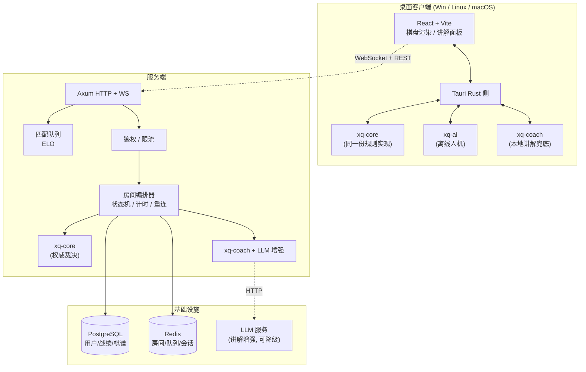

# 弈道 · chinese-chess-rs

> 一款用 Rust 全栈实现的中国象棋对战平台：跨平台原生客户端（Windows / Linux / macOS）+ 联网对战服务端 + 本地 AI 引擎 + 战法讲解系统。

---

## 1. 项目简介

**弈道** 是一个对标 JJ 象棋体验的中国象棋产品，核心差异点是**"会讲课的象棋"**——不只让你下棋，还在每一步旁边告诉你这步好在哪、差在哪、符合什么战法。

产品由三个可独立部署的部分组成：

| 部分 | 说明 | 技术 |
|---|---|---|
| **客户端** | 桌面原生应用，支持 Windows / Linux / macOS；含离线人机、在线对战、观战、复盘 | Tauri 2 + React + Vite + TS（Rust 侧负责引擎与通信） |
| **服务端** | 房间管理、实时对战同步、匹配队列、排行榜、战绩持久化 | Axum + Tokio + WebSocket + SeaORM + PostgreSQL + Redis |
| **引擎库** | 规则裁决、AI 搜索、战法讲解，跨端复用同一份 Rust 代码 | 纯 Rust workspace crate，零 unsafe |

> **设计原则**：规则与引擎只有一份实现。客户端离线模式、服务端权威裁决、AI 训练工具、复盘分析器全部复用同一个 `xq-core`，从根本上消除"客户端判赢、服务端判输"的规则分歧。

---

## 2. 特性矩阵

| 能力 | 优先级 | 说明 |
|---|---|---|
| 完整规则裁决 | P0 | 走法生成、将军/将死/困毙、长将长捉、60 回合自然限着、白脸将 |
| 走棋提示 | P0 | 选中棋子高亮全部合法落点；危险提示（被吃/被将）；推荐着法箭头 |
| 战法讲解 | P0 | 每步旁标注战法名称 + 意图 + 评价（本地模板兜底 → LLM 增强） |
| 人机对战 | P0 | 3~5 档难度、悔棋、提示、让子、残局挑战 |
| 联网对战 | P0 | 房间创建/加入、观战、断线重连、走棋计时、悔棋/求和/认输 |
| 服务端权威 | P0 | 所有着法服务端校验，客户端不可信 |
| 天梯匹配 | P1 | ELO 匹配队列、积分排行榜、赛季 |
| 复盘分析 | P1 | 全盘逐着评估、失误标注（优/良/疑/劣）、导出棋谱 |
| 聊天与举报 | P2 | 房间内文字聊天、敏感词过滤、举报工单 |
| 残局/题库模式 | P2 | 内置残局库、每日一题 |
| AI 托管/代打 | P2 | 掉线时代打（可配置，天梯禁用） |

> **实现进度**：规则内核（`xq-core`）已随 M0 完成 —— 走法生成、将军/将死/困毙、
> 白脸将、60 回合限着、长将裁决、FEN 与中文记谱双向转换均已落地并通过 perft 全深度校验。
> 长捉 / 长兑的判定与 AI、讲解、联网部分同属后续里程碑，详见
> [docs/03 §14.3](docs/03-规则引擎与领域模型.md#143-明确尚未实现的部分)。

---

## 3. 技术选型

**所有版本号均于 2026-09-23 通过 `cargo search` / crates.io API 实测确认，非估算。**

### 3.1 工具链

| 项 | 版本 | 备注 |
|---|---|---|
| Rust | **1.98.1** (2026-09-01) | 使用 `edition = "2024"` |
| Cargo | 1.98.1 | workspace resolver 3 |
| Node.js | 22.x LTS 或 24.x | 前端构建（沿用现有环境） |
| pnpm | 10.x | 前端包管理 |
| PostgreSQL | 16+ | 主数据存储 |
| Redis | 7.x | 房间状态、匹配队列、会话、限流 |

### 3.2 Rust 依赖（实测版本）

| Crate | 版本 | 用途 |
|---|---|---|
| `axum` | 0.8.9 | HTTP 路由 / REST API |
| `axum-extra` | 0.12.6 | 提取器扩展、TypedHeader |
| `tokio` | 1.53.1 | 异步运行时（features: full） |
| `tokio-tungstenite` | 0.30.0 | WebSocket 底层（axum `ws` 亦基于 tungstenite） |
| `tower-http` | 0.7.1 | CORS / Trace / Compression / Timeout 中间件 |
| `serde` / `serde_json` | 1.0.229 | 序列化 |
| `sea-orm` | 2.0.3 | ORM + 迁移 |
| `sqlx` | 0.9.0 | SeaORM 底层驱动（PostgreSQL） |
| `jsonwebtoken` | 11.1.0 | JWT 鉴权 |
| `uuid` | 1.26.1 | ID 生成（v7 时间有序） |
| `tracing` / `tracing-subscriber` | 0.1.44 | 结构化日志与追踪 |
| `rand` | 0.10.3 | 引擎随机化、匹配扰动、洗牌 |
| `thiserror` | 2.0.20 | 库层错误类型 |
| `anyhow` | 1.0.104 | 应用层错误传播 |
| `dashmap` | **6.2.1** | 并发房间表（注意：7.0 尚为 rc，勿用） |
| `validator` | 0.21.0 | 请求参数校验 |
| `config` | 0.15.26 | 分层配置（默认 + 环境 + 本地覆盖） |
| `once_cell` | 1.21.4 | 静态初始化 |
| `parking_lot` | 0.12.5 | 低开销锁 |

**开发依赖**：`criterion` 0.8.2（基准测试）、`proptest` 1.11.0（属性测试）、`insta` 1.48.0（快照测试）。

### 3.3 客户端依赖

| Crate / 包 | 版本 | 用途 |
|---|---|---|
| `tauri` | **2.11.6** | 桌面壳（注意：3.0.0 仍为 alpha，**不要使用**） |
| `tauri-build` | 2.6.3 | 构建脚本 |
| React | 19.x | UI 框架 |
| Vite | 7.x | 构建工具 |
| TypeScript | 5.9+ | 类型系统 |
| Zustand | 5.x | 全局状态（棋盘/对局/房间） |
| TanStack Router | 1.x | 路由 |

### 3.4 为什么不用现成的象棋 crate

调研结论（2026-09-23）：

- `xiangqi_tui` 0.1.0 —— 仅 TUI 客户端，非规则库，社区极小；
- `xq` 0.5.0 —— 是 `jq` 的 Rust 重写，与象棋无关；
- `shogi` 0.12.2 / `shakmaty` 0.30.1 / `chess` 3.2.0 —— 分别面向将棋与国际象棋，**规则体系完全不同**（无炮架、无九宫、无蹩马腿、无河界概念）。

**结论：中国象棋规则引擎必须自研**，这也是本项目 `xq-core` 存在的意义。自研带来的可控性同时服务于两个目标——服务端权威裁决与"战法讲解"所需的着法性质分类（捉/将/兑/弃的判定只有自研才能拿到内部语义）。

---

## 4. 架构总览



**关键数据流（联网对战）**：

1. 客户端本地预校验着法（用 `xq-core`），立即渲染，**乐观更新**（体感零延迟）；
2. 同帧发送 `MoveRequest` 给服务端；
3. 服务端用**同一个 `xq-core`** 重新裁决，非法则回滚并推送 `MoveRejected`；
4. 裁决通过 → 落库、广播 `MoveApplied` 给对局双方与观战者；
5. `xq-coach` 生成讲解，作为独立的 `CoachNote` 帧异步推送（**讲解永阻塞走棋**）。

---

## 5. 目录结构规划

```
chinese-chess-rs/
├── Cargo.toml                      # workspace 根
├── rust-toolchain.toml             # 锁定 1.98.1
├── crates/
│   ├── xq-core/                    # 【纯逻辑】棋盘、坐标、走法生成、规则、记谱、FEN
│   │   ├── src/board.rs            #   棋盘表示与 Zobrist
│   │   ├── src/movegen.rs          #   伪合法 / 合法着法生成
│   │   ├── src/rules.rs            #   将军、将死、困毙、禁手、自然限着
│   │   ├── src/notation.rs         #   中文记谱 / ICCS / FEN
│   │   └── tests/                  #   规则一致性测试（对拍题库）
│   ├── xq-ai/                      # 【纯逻辑】搜索引擎
│   │   ├── src/search.rs           #   迭代加深 + Alpha-Beta + PVS
│   │   ├── src/eval.rs             #   评估函数（子力 + 位置表 + 结构）
│   │   ├── src/tt.rs               #   置换表
│   │   └── src/book.rs             #   开局库查询
│   ├── xq-coach/                   # 【纯逻辑】战法讲解
│   │   ├── src/tactics.rs          #   战术模式识别（捉双/闷宫/抽将…）
│   │   ├── src/explain.rs          #   模板渲染
│   │   └── src/llm.rs              #   LLM 增强（feature 开关，可降级）
│   ├── xq-protocol/                # 【共享】DTO / WS 帧 / 错误码（前后端唯一契约）
│   ├── xq-server/                  # 【服务端】Axum
│   │   ├── src/routes/             #   REST 路由
│   │   ├── src/ws/                 #   WS 会话与帧分发
│   │   ├── src/room/               #   房间状态机
│   │   ├── src/matchmaking/        #   ELO 匹配
│   │   └── src/store/              #   SeaORM 实体与仓储
│   └── xq-client/                  # 【客户端】Tauri Rust 侧
│       └── src/commands.rs         #   #[tauri::command] 暴露给前端
├── crates/                         # Rust workspace
│   ├── xq-core/                    #   规则内核（零 IO）
│   ├── xq-ai/                      #   搜索引擎（零 IO）：迭代加深 / PVS / 静态搜索 / 置换表 / 五档难度
│   ├── xq-coach/                   #   战法讲解（零 IO）：战术识别 / 评价定级 / 模板渲染 / LLM 接口
│   ├── xq-session/                 #   会话层：对局状态机 + 引擎/讲解门面 + **对前端的 JSON 契约**
│   ├── xq-client/                  #   桌面客户端（Tauri 2 外壳）
│   └── xq-bridge/                  #   本地开发桥接服务（**非产品组件**）
├── frontend/                       # React + Vite + TS 前端（M1）
│   ├── src/
│   │   ├── coords.ts               #   棋理坐标 ↔ 视图像素 ↔ 百分比（含 90 格自检）
│   │   ├── bridge.ts               #   引擎桥接层（换 Tauri 只改这一个文件）
│   │   ├── router.ts               #   三个页面的 hash 路由（零依赖，见下）
│   │   ├── store.ts                #   Zustand 对局状态 + 整局讲解 + 复盘游标
│   │   ├── pages/
│   │   │   ├── SetupPage.tsx       #   ① 开局设置：模式 / 执子 / 棋力 / 限时 / 速度 / 图例
│   │   │   ├── PlayPage.tsx        #   ② 对局：棋盘 + 两条钟 + 一行按钮（**锁死一屏**）
│   │   │   └── AnalysisPage.tsx    #   ③ 终局分析：结果 / 统计 / 逐手讲解 / 深度分析
│   │   └── components/
│   │       ├── Board.tsx           #   可点击棋盘 + 标记层 + 飞行棋子
│   │       ├── ClockBar.tsx        #   计时条：头像圆盘 + 步时环 + 局时
│   │       ├── NoteCard.tsx        #   一条战法讲解（对局页与分析页共用）
│   │       └── TacticReveal.tsx    #   战法名出场特效
│   ├── pnpm-workspace.yaml         #   放行 esbuild 与 @swc/core 的构建脚本
│   └── dist/                       #   构建产物（由 xq-bridge 托管）
├── assets/
│   ├── board/                      #   棋盘 SVG 素材
│   ├── pieces/                     #   14 种棋子 SVG（红黑双方）
│   ├── tokens/                     #   设计令牌（配色/间距/字号）
│   └── knowledge/                  #   战术模式库 / 讲解模板 / 开局定式
├── migrations/                     # SeaORM 数据库迁移
├── prototype/                      # 设计阶段的交互原型（静态演示，非可玩）
│   ├── _template.html              #   模板（含 @BOARD_SVG@ 等 5 个占位符）
│   └── index.html                  #   产物：自包含单文件
├── scripts/                        # 工具脚本
│   ├── ci/
│   │   └── assert_no_io_deps.sh    #   ADR-005 零 IO 依赖断言（CI 阻塞阶段）
│   ├── dev/
│   │   └── ui_probe.mjs            #   前端交互冒烟测试（CDP 驱动无头 Chrome 真点棋盘）
│   ├── gen_assets.py               #   生成棋盘 / 棋子 SVG 与设计令牌
│   ├── build_prototype.py          #   由素材生成交互原型（含几何断言）
│   ├── validate_knowledge.py       #   知识库 schema 与引用完整性校验
│   └── validate_docs.py            #   文档链接与关键数字一致性校验
└── docs/                           # 设计文档（见下）
```

### workspace 根 `Cargo.toml` 规划

```toml
[workspace]
resolver = "3"
members = [
    "crates/xq-core",
    "crates/xq-ai",
    "crates/xq-coach",
    "crates/xq-protocol",
    "crates/xq-server",
    "crates/xq-client",
]

[workspace.package]
edition = "2024"
rust-version = "1.98"
license = "MIT OR Apache-2.0"

[workspace.dependencies]
# 共享依赖统一在此声明，成员用 { workspace = true } 引用，避免版本漂移
axum = "0.8.9"
tokio = { version = "1.53.1", features = ["full"] }
serde = { version = "1.0.229", features = ["derive"] }
sea-orm = { version = "2.0.3", features = ["sqlx-postgres", "runtime-tokio-rustls", "macros"] }
# ... 其余见 docs/02-系统架构设计.md

[profile.release]
lto = "thin"
codegen-units = 1
panic = "abort"

# AI 搜索是纯计算热点，单独开高优化档
[profile.bench]
inherits = "release"
debug = true
```

---

## 6. 文档索引

| 文档 | 内容 |
|---|---|
| [docs/01-需求规格说明书.md](docs/01-需求规格说明书.md) | 角色、功能/非功能需求、用例、验收标准、追踪矩阵 |
| [docs/02-系统架构设计.md](docs/02-系统架构设计.md) | 分层架构、crate 依赖图、部署拓扑、并发模型 |
| [docs/03-规则引擎与领域模型.md](docs/03-规则引擎与领域模型.md) | 棋盘表示、ICCS 坐标、走法生成、禁手、记谱法 |
| [docs/04-AI引擎设计.md](docs/04-AI引擎设计.md) | 搜索算法、评估函数、难度分级标定、开局库 |
| [docs/05-战法讲解引擎设计.md](docs/05-战法讲解引擎设计.md) | 战术识别、模板体系、LLM 增强与降级 |
| [docs/06-联网对战与实时通信协议.md](docs/06-联网对战与实时通信协议.md) | WS 帧定义、房间状态机、断线重连、时钟 |
| [docs/07-匹配排行榜与反作弊.md](docs/07-匹配排行榜与反作弊.md) | ELO 算法、匹配队列、反作弊策略 |
| [docs/08-客户端设计.md](docs/08-客户端设计.md) | Tauri + React 架构、渲染、打包分发 |
| [docs/09-数据模型与存储设计.md](docs/09-数据模型与存储设计.md) | 表结构、索引、Redis 键设计、数据生命周期 |
| [docs/10-API接口规范.md](docs/10-API接口规范.md) | REST 端点、错误码、鉴权 |
| [docs/11-工程规范与CI-CD.md](docs/11-工程规范与CI-CD.md) | 代码规范、lint、CI 流水线、发布流程 |
| [docs/12-测试策略与质量保障.md](docs/12-测试策略与质量保障.md) | 测试金字塔、规则对拍、引擎基准、压测 |
| [docs/13-路线图与里程碑.md](docs/13-路线图与里程碑.md) | 分阶段计划、验收门槛、风险 |
| [docs/14-决策记录ADR.md](docs/14-决策记录ADR.md) | 关键技术决策与其权衡 |

---

## 7. 素材清单

| 路径 | 内容 | 规模 |
|---|---|---|
| `assets/board/board-classic.svg` | 石绿石板棋盘：盘面浮雕光照 + 凸起厚石框 + 刻线（几何仍是标准 9×10） | 14 KB |
| `assets/board/board-coords.svg` | 同上，另加 ICCS 坐标标注的调试版 | 19 KB |
| `assets/pieces/*.svg` | 14 种棋子矢量（红 7 + 黑 7）：暖金木牌，含厚度侧壁、弧面高光与凹刻字 | 14 个文件 |
| `assets/effects/*.svg` | 光效：选中金环 / 可走绿环 / 可吃红环 / 落点白点 / 上一着白弧 + 战法名牌匾与光束 | 7 个文件 |
| `assets/hud/*.svg` | HUD 底板：倒计时环（进度弧由应用画）、操作按钮 | 2 个文件 |
| `assets/tokens/design-tokens.json` | 棋盘 / 棋子材质、配色、圆角、阴影、字号、动效时长 | — |
| `assets/tokens/colors.md` | 配色规范 + **31 组 WCAG 对比度实算** | 11 KB |
| `assets/knowledge/tactics.json` | 战术模式库（L1 结构 / L2 关系 / L3 棋形 + 开局） | 45 条 |
| `assets/knowledge/predicates.json` | 棋形约束谓词定义 | 29 个 |
| `assets/knowledge/coach-templates.json` | 战法讲解模板（战术 × 三档语体） | 54 条 |
| `assets/knowledge/openings.json` | 开局定式库（序列经人工逐着核对） | 10 条 |
| `assets/voice/*.mp3` | 语音播报素材：吃子 / 将军 / 45 个战法名 / 终局词 / 走法播报片段 | **209 个文件 · 2.2 MB** |
| `assets/voice/manifest.json` | 素材清单：id → 文件 / 显示词 / 合成词 | 274 个 id |
| `prototype/index.html` | 可交互原型（5 个页面，棋盘与棋子内联真实素材） | 94 KB |

> **素材可信度**：棋盘几何由 `gen_assets.py` 以 **26 条断言**校验（横线 10 条、竖线 16 段、九宫斜线 4 条、兵炮位折角 48 个）；原型由 `build_prototype.py` 追加校验高亮层与棋子坐标是否对齐。`colors.md` 的对比度数值为**实际计算值**而非估算。
>
> ⚠️ `assets/effects/` 与 `assets/hud/` **不是 `gen_assets.py` 生成的** —— 它们来自
> 独立的素材包，是手工/外部生成的静态文件。改这几个 SVG 不用重跑脚本，
> 但也**不受那 26 条几何断言保护**。

---

## 8. 里程碑概览

| 阶段 | 目标 | 关键交付 | 状态 |
|---|---|---|---|
| **M0** | 规则内核可信 | `xq-core` 走法生成 100% 通过对拍题库，FEN/记谱往返无损 | ✅ **已完成** |
| **M1** | 离线可下 | 客户端跑通人机对战 + 走棋提示 + 本地战法讲解 | ✅ **功能已完成**：人机对战 / 走棋提示 / 战法讲解 / 桌面客户端全部就绪；剩参数标定 |
| **M2** | 联网可下 | 房间对战、观战、断线重连、服务端权威裁决 | — |
| **M3** | 有粘性 | 天梯匹配、排行榜、复盘分析、LLM 讲解增强 | — |
| **M4** | 可运营 | 反作弊、举报、赛季、监控告警、灰度发布 | — |

**M0 达成证据**（2026-09-23）：

| 验收项 | 结果 |
|---|---|
| `perft(1)` | **44** ✅ 与手工逐子推导表一致 |
| `perft(2)` | **1,920** ✅ |
| `perft(3)` | **79,666** ✅ |
| `perft(4)` | **3,290,240** ✅ 用时 221 ms（门禁 < 1 s） |
| `perft(5)` | **133,312,995** ✅ 用时 9.91 s |
| FEN 往返 | ✅ 随机对局逐步无损（约 1.5 万次） |
| 中文记谱往返 | ✅ 随机对局逐步无损（约 1.5 万次） |
| 自对弈压测 | ✅ 1000 局 / 334,324 步，无 panic、无非法着法 |
| 测试总数 | **73 passed / 0 failed / 2 ignored**（另有 2 个文档测试通过） |
| clippy `-D warnings` | ✅ 零警告 |
| ADR-005 零 IO 断言 | ✅ `xq-core` 生产依赖 **0 个** |

详见 [docs/13-路线图与里程碑.md](docs/13-路线图与里程碑.md) 与
[docs/03 §14 实现回写](docs/03-规则引擎与领域模型.md#14-实现回写2026-09-23--m0-完成)。

---

## 9. 快速开始

### 9.1a 下载安装包（Windows，普通用户先看这个）

到 [Releases](https://github.com/gemiman/chinese-chess-rs/releases) 下载 `Yidao_0.1.0_x64-setup.exe`，
双击安装即可 —— **不需要 Rust、Node 或任何开发环境**。装完就是个能离线下的完整象棋程序，
不连任何服务端。

| 事项 | 说明 |
|---|---|
| 装到哪 | 当前用户目录（`%LOCALAPPDATA%\Yidao`），**不弹管理员提权** |
| 快捷方式 | 开始菜单 + 桌面各一个（都叫「Yidao」） |
| 卸载 | 设置 → 应用 → 已安装的应用 → 弈道 → 卸载（开始菜单里也放了卸载入口） |
| 系统要求 | Windows 10 1809+ / 11（64 位） |
| 依赖 | 微软 WebView2 运行时。Win11 与多数 Win10 自带；缺失时安装包会引导补装 |

> ⚠️ **会弹「Windows 已保护你的电脑 / 未知发布者」。** 这是**没买代码签名证书**的软件
> 必然遇到的提示，不是文件有问题 —— 点「更多信息」→「仍要运行」即可。
> 想消掉它得买代码签名证书（个人版一年数百元，EV 版数千元），属于产品化阶段的事。
> 顺带一提，安装包**没签名，也就不该期待它被当成可信软件**：拿到安装包请核对它来自本仓库。

**自己重新打包**（改了代码要出新包时）：

```bash
pnpm -C frontend build
cd crates/xq-client && npx @tauri-apps/cli build
```

产物在 `target/release/bundle/nsis/Yidao_<版本>_x64-setup.exe`。打包参数见
[`crates/xq-client/tauri.conf.json`](crates/xq-client/tauri.conf.json) 的 `bundle` 段：
只出 NSIS、安装界面简体中文、装到当前用户、WebView2 引导程序打进包内。

### 9.1 桌面客户端（推荐）

```bash
# 第一步：构建前端（只需一次；改了前端代码要重跑）
pnpm -C frontend install
pnpm -C frontend build

# 第二步：跑桌面端
cargo run --release -p xq-client
```

> ⚠️ **一定要加 `--release`**。debug 构建下引擎只有约 32K 节点/秒（3 秒搜 5 层），
> release 下是 **702K 节点/秒（3 秒搜 8 层）** —— 差了 20 倍以上，体感完全不同。

桌面端**不经过 HTTP**：前端直接调用 Rust 命令（见 [ADR-002](docs/14-决策记录ADR.md#adr-002)）。
`xq-bridge` 那层 HTTP 只是开发期的临时通道。

### 9.1b 用浏览器下棋（开发时更方便）

```bash
cargo run --release -p xq-bridge -- --open
```

前端会根据运行环境**自动选择宿主**：在 Tauri 窗口里直接调 Rust，在浏览器里打 HTTP。
切换不需要改任何组件 —— 都收在 `frontend/src/bridge.ts` 一个接口后面。

> ⚠️ **一定要加 `--release`**。debug 构建下引擎只有约 32K 节点/秒（3 秒搜 5 层），
> release 下是 **702K 节点/秒（3 秒搜 8 层）** —— 差了 20 倍以上，体感完全不同。

终端会打印出 `http://127.0.0.1:8848/`，`--open` 会直接打开浏览器。

**当前能做什么**：

界面分成**三页**，用网址里的 `#` 区分（`#/setup`、`#/play`、`#/analysis`），
浏览器的「后退」键因此是可用的，刷新也不会被打回第一页：

1. **开局设置页** —— 选**对局模式**、执红还是执黑、引擎棋力、限时档位、走子速度。
   这些都在按「开始游戏」时一次性下发给 Rust —— **开局后不能改**，想换就重开一局。
2. **对局页** —— 只有棋盘、上下两条计时条和一行按钮。
   这一页**锁死一屏、绝不滚动**：下棋时还要滚屏才看得见自己的时间，是没法用的。
   线下的几个工具（提示候选着法、按记谱走棋、认输确认）都做成浮层，
   浮在棋盘上方，不会把棋盘挤小。
3. **终局分析页** —— 棋局一结束就自动跳过来。结果横幅、统计（总手数 / 吃子 /
   已讲解手数 / 失误数 / 开局名）、**逐手讲解列表**（点任意一手直接跳到那一步的盘面）。
   页面上还能点「**深度分析**」让引擎从第一手重算全局讲解（慢，但完整、评价标准统一）。

### 三种对局模式

| 模式 | 谁在下 | 对局页的按钮 |
|---|---|---|
| **双人同机** | 两个人共用一块棋盘 | 悔棋 / 提示 / 记谱 / 翻转 / 认输 |
| **人机对战** | 你 vs 引擎（五档：入门 / 初级 / 中级 / 高级 / 大师） | 同上 |
| **机机对战** | **两个 AI 互相对下，你在旁边看** | 暂停 / 单步 / 翻转（终局后「单步」换成「看分析」） |

**机机对战**是专门用来看棋的，**一局接一局自动往下打**：

- **不会自己停。** 一局下完原地记一笔战绩，倒计时 20 秒后自动开下一局 ——
  不跳分析页（跳走就等于停下来）。想停只有两条路：按「**暂停**」，
  或按「**看分析**」（看分析会先把连播停掉，否则下一局会把你正在看的那盘换掉）。
- **两边各选各的档位**，也可以留「**随机**」：没手动选过的一方**每局重摇**，
  所以连着看几十局会碰到各种对阵（大师打入门、中级打高级……）。
  设置页会写清「本局：红方 大师（随机） · 黑方 初级（已固定）」，两条钟上也各标一档。
- **每步至少隔 3 秒**。见下面那条注意事项 —— 这件事只能靠节奏下限做。
- 两条钟上记着**各自的胜场**，看谁赢得多久了一目了然。
- 棋盘是**只读**的 —— 人是观众，两边都不归他管。

三个容易误以为是 bug 的行为：

- ⚠️ **暂停不会打断已经在算的那一步**：引擎已经算起来了，拦不住，它落地之后才真正停下来。
- ⚠️ **「每步至少 3 秒」是走子节奏的下限，不是「让引擎多想一会儿」。**
  实测入门档只想 2 层，给它 3000 毫秒预算它 **0 毫秒**就返回了 —— 弱档位的设计就是
  「算完即走」，时间预算对它没有约束力（中级 169 毫秒，只有大师真用满）。
  所以想让棋别从眼前飞过去，只能在两次落子之间加下限，档位的含义因此一点没变。
- ⚠️ 每走一步都会生成讲解（跟人机对战一致），而讲解和走棋**抢同一个引擎**，
  所以每步实际耗时 = 3 秒下限 + 这一档引擎的思考时间。入门/初级约 3 秒一步，
  大师档约 6 秒一步。嫌慢就得放弃即时讲解（结束后仍可以用「深度分析」一次性补全）。

**复盘**：在分析页点「复盘」回到对局页，盘面停在那一手上，下方那条钟换成「复盘条」——
前后翻手数、看每一步的讲解。复盘时两条钟都不再显示读秒（它们停在终局的残余时间上，
拿它配第 10 手的局面是错的），棋盘也只读：不能落子、不能悔棋，否则会把这一局的记录
截断在半路上。

**还能做什么**：

- **走棋提示** —— 点棋子看合法落点；或点「提示」让大师档给出三个候选着法及评分；
- 悔棋（一边是引擎时自动退两步，回到同一方该走的状态）、翻转视角、
  按中文记谱或 ICCS 坐标走棋；
- **认输** —— 两步确认。人机对战认输的是你，双人同机认输的是当前该走的那一方；
- **超时判负** —— 局时 + 步时 + 读秒。**步时一走完就当场判**，不用谁再去点一下棋盘，
  判完自动跳到分析页；终局（将死 / 困毙 / 和棋）也会立刻停表。
- **自然限着** —— 双方各走 60 次都没吃子就判和（这是标准规则）。
  钟条那行参数里实时写着进度，如「限着 12/60 回合」；**吃了子计数归零**。
  还有个细节：正被将军时判和会延后，免得出现「把对方将到最后一步反而算和棋」。

**还不能做什么**：联网对战与观战（M2，含断线重连、天梯匹配、排行榜）。
复盘也还**不能试走变化**（不能在那个老局面上换一步棋看看）—— 那需要把「跳到第 N 手」
升级成可以分叉的棋盘，留给后面。

> ⚠️ **不要直接双击 `frontend/dist/index.html`** —— 页面需要后端做走法合法性判定与 AI，
> 直接打开文件会停在「连不上规则引擎」的引导页。

前端热更新开发（改代码即时生效）：

```bash
cargo run --release -p xq-bridge -- --dev   # 一个终端：只提供 API
pnpm -C frontend dev                        # 另一个终端：Vite 在 5173，已配好 /api 代理
```

### 9.2 规则内核

```bash
# 全量测试（单元 + 集成 + 文档测试）
cargo test --workspace

# 只跑引擎的搜索行为测试
cargo test -p xq-ai

# perft 基线（浅层，debug 可跑）
cargo test -p xq-core --test perft

# perft 深层（需 release；约 10 秒）
cargo test -p xq-core --release --test perft -- --ignored --nocapture

# 自对弈压力测试（1000 局，需 release）
cargo test -p xq-core --release --test properties -- --ignored --nocapture

# ADR-005 零 IO 依赖断言（领域层生产依赖里不得出现 tokio / axum / sqlx / rand …）
bash scripts/ci/assert_no_io_deps.sh
```

命令行下手棋（开发工具，便于调试具体局面）：

```bash
cargo run --example xq            # 交互式演练场
cargo run --example xq -- --ascii # 终端显示中文乱码时用字母字形
```

### 9.3 设计与素材

```bash
python scripts/gen_assets.py          # 重新生成棋盘 / 棋子 SVG 与设计令牌（幂等）
python scripts/build_prototype.py     # 由素材重建交互动效原型（含几何断言）
python scripts/validate_knowledge.py  # 知识库校验
python scripts/validate_docs.py       # 文档链接与关键数字校验
```

### 9.4 前端交互冒烟测试

```bash
# 需要一个带调试端口的无头 Chrome（脚本会自己开标签页、用完关掉）
chrome --headless=new --remote-debugging-port=9222 --user-data-dir=<临时目录> about:blank
node scripts/dev/ui_probe.mjs
```

它真的去点棋盘，把**三页的整条链路**走一遍：设置页开局 → 选中 → 高亮 → 落子 →
悔棋 → 记谱浮层 → 认输 → 终局分析页 → 深度分析 → 复盘翻手数 → 人机对战 →
机机对战（随机档位、走子节奏、连续对局）。

它连的是**用户真看得见的东西**（按钮上的文字、`.fx` 光效、按钮行的位置），
所以选择器变了就该跟着改脚本 —— 不要为了好写而给产品加测试专用的 class 或 id，
那样它测的就不再是用户看到的界面了。

> ⏱ **要跑几分钟。** 有两段是硬等：超时判负那段要等 20 秒，
> 「连续对局」那段要**等一局 AI 对局真下完**（一两分钟起，且长度没法预测）。
> 其余部分都是亚秒级的。

### 9.5 桌面端（Tauri）冒烟测试

§9.4 走的是 HTTP 桥，**碰不到 Tauri 外壳这一层**：命令有没有注册、参数名
`camelCase` 映射对不对、`async fn` 有没有真的丢到线程池上，只有在真的 WebView2 里调一次才知道。

```bash
# 带调试端口启动桌面端（PowerShell）
$env:WEBVIEW2_ADDITIONAL_BROWSER_ARGUMENTS = "--remote-debugging-port=9223"
cargo run -p xq-client

# 另一个终端
node scripts/dev/desktop_probe.mjs
```

它先绕开前端封装逐个直调 8 个 command，再走一遍真实 UI 流程（切「人机对战」→ 选边 →
等引擎应招），最后留一张截图。**注意 `engine_move` 一类用例必须在「已经走过一步」的局面上调** ——
本项目真的漏过这个输入：会话层曾在搜索结束后错误地断言层数为 0，导致走完第一步再让引擎应招时
线程 panic，前端只表现为「响应中途断掉」；而 release 版因为 `debug_assert!` 被编译掉，
反而一直"看起来是好的"。回归测试见 `xq-session` 的 `engine_and_coach_work_after_a_move`。

---

## 10. 当前状态

**M0 已完成（规则内核可信）**，**M1 功能已全部交付** —— 桌面端与浏览器都能人机对战 + 战法讲解；
M1 剩下的工作是**参数标定**（见下）。

### 已交付

| 类别 | 内容 | 规模 |
|---|---|---|
| 设计文档 | `docs/01` ~ `docs/14` | 14 份，19,000+ 行 |
| 规则内核 | `crates/xq-core` | **13 个模块 · 4,046 行 src** · **零运行时依赖** |
| **搜索引擎** | `crates/xq-ai` | 迭代加深 / PVS / 静态搜索 / 置换表 / 着法排序 / 五档难度 · **零运行时依赖（连 `rand` 都没引）** |
| **战法讲解** | `crates/xq-coach` | 三层识别（L1 结构 / L2 关系 / L3 棋形）+ 29 谓词 + 4 级降级链 + LLM 三道防线 |
| **会话层** | `crates/xq-session` | 对局状态机 + DTO + 引擎/讲解门面 · **桌面端与 HTTP 桥共用同一份** |
| 前端 | `frontend/` React + Vite + TS + Zustand | **三页结构**（设置 / 对局 / 分析）+ hash 路由、复盘、逐手讲解、深度分析 |
| **桌面客户端** | `crates/xq-client`（Tauri 2） | 12 个 command，前端**直接调 Rust 不经 HTTP**；按环境自动选宿主 |
| 桥接服务 | `crates/xq-bridge` | 把规则内核与引擎暴露成 JSON API 并托管前端（开发工具，非产品组件） |
| 测试 | 单元 + 集成 + 属性 + 压测 | **204 通过 / 0 失败**（另 2 个深层用例标 `#[ignore]`） |
| 矢量素材 | 棋盘 2 个 + 棋子 14 个 + 设计令牌 2 份 | 26 条几何断言通过 |
| 知识库 | 战术 45 / 谓词 29 / 模板 54 / 开局 10 | 138 条，校验全绿 |
| **语音播报** | `assets/voice/` 预生成音频 + `frontend/src/speech.ts` 播放队列 | **214 个 mp3 · 2.3 MB**，276 个 id，词表可重跑 |
| 设计原型 | `prototype/index.html` 5 个页面 | 85 KB 自包含（静态演示） |
| 工具脚本 | 素材 / 原型 / 知识库 / 文档 / CI 依赖断言 / 前端与桌面端冒烟测试 / **语音生成与播报** | 10 个 |

### 质量基线

| 门禁 | 结果 |
|---|---|
| `cargo fmt --check` | ✅ |
| `cargo clippy --all-targets -- -D warnings` | ✅ 零警告 |
| `cargo test --workspace` | ✅ 204 通过 / 0 失败 |
| `bash scripts/ci/assert_no_io_deps.sh` | ✅ 通过（xq-core 生产依赖 0 个，xq-ai 仅依赖 xq-core） |
| `python scripts/validate_docs.py` | ✅ 链接与关键数字全通过 |
| `python scripts/validate_knowledge.py` | ✅ 138 条全通过 |
| `node scripts/dev/ui_probe.mjs` | ✅ **118 项**交互检查全通过（浏览器 + HTTP 桥，走完三页；跑几分钟） |
| `node scripts/dev/voice_probe.mjs` | ✅ **22 项**播报检查全通过（假 Audio 记录点了哪些素材、按什么顺序） |
| `node scripts/dev/desktop_probe.mjs` | ✅ Tauri 外壳 **12 个 command** + **32 项**真实 UI 检查全通过 |
| `perft(1..5)` | ✅ 44 / 1,920 / 79,666 / 3,290,240 / 133,312,995 |
| 引擎性能（release） | **702K 节点/秒**，大师档 3 秒搜 8 层 |

### 下一步：参数标定（M1 收尾）

M1 的**功能**已全部交付：人机对战 / 走棋提示 / 战法讲解 / 桌面客户端。

真正欠的债是**参数标定** —— 下面这些都是「设计初始值」，必须实测后回写：

| 待校准项 | 方法 | 出处 |
|---|---|---|
| 讲解评价阈值（10/50/150/400 厘兵） | 200 局自对弈的分差分布 + 人工抽检 | docs/05 §9.2 |
| 13 条棋形的坐标约束 | 用带标注的真实棋谱验证命中率与误报率 | docs/05 §3.4 |
| 全阶段讲解覆盖率（兜底率 ≤ 5%） | 统计 1000 局棋谱 | docs/05 §9.3 |
| 难度随机化容差、子力价值与 PST | 相邻档位自对弈胜率落在 60~75% | docs/04 §8.2 |

**工程上可做的增强**（按性价比）：引擎的增量评估 / 空着剪枝 / SEE，目标把 NPS 从 702K 提到 1M+；
讲解的炮类牵制判定（需要炮架不变性分析）。

> ⚠️ 文档中所有标注为「设计初始值 / 待校准」的数值（AI 搜索参数、ELO 阈值、讲解评价分档等）**必须在实现后实测校准并回写文档**，不得直接用于对外宣传。
>
> 已完成校准：perft 全深度基线（见 §8）、引擎 NPS 与各档实际耗时（见 [docs/04 §11.1](docs/04-AI引擎设计.md#111-实测性能)）。仍未校准：难度随机化容差、子力价值与 PST 各分量、讲解评价分档阈值、ELO 的 K 值与段位分界线。

---

## 11. 更新日志

### 2026-09-25 · 发布 v0.1.0：首个 Windows 安装包

[Releases 页](https://github.com/gemiman/chinese-chess-rs/releases/tag/v0.1.0) 可下载
`Yidao_0.1.0_x64-setup.exe`（**6.0 MB**）。装完是个完整的离线象棋程序，不依赖任何服务端。

**打包配置**（`tauri.conf.json` 的 `bundle` 段）定了四件事：

| 项 | 取值 | 理由 |
|---|---|---|
| `targets` | `["nsis"]` | `"all"` 在 Windows 上会连带尝试打 MSI，而 MSI 需要联网下 WiX 工具链 |
| `publisher` | 弈道 | 留空则默认取标识符里的第二段 —— 也就是 `daoyi`，装出来会显示成它 |
| `nsis.languages` | `SimpChinese` | 安装向导界面上中文 |
| `windows.webviewInstallMode` | `embedBootstrapper` | 默认行为是安装时联网下载引导程序；改成就地嵌进包内，少一个联网环节 |

**测试里抓到一个真缺陷：静默卸载会留下快捷方式。**
`uninstall.exe /S` 会把安装目录删干净、卸载器返回 0，但**开始菜单与桌面那两个 `.lnk`
留在原地** —— 用户要是从「设置 → 应用」卸载后发现图标还在，会以为没卸干净。
按文档加了 `bundle.windows.nsis.installerHooks` 钩子（[`windows/hooks.nsh`](crates/xq-client/windows/hooks.nsh)），
在 `NSIS_HOOK_POSTUNINSTALL` 里显式删一次。删不存在的文件在 NSIS 里是空操作，
所以就算模板自己删过也没有副作用 —— 要的是**两种卸载方式都干净**，而不是去猜模板怎么实现的。

**验证**（不是只产出个文件就完事）：

| 步骤 | 结果 |
|---|---|
| 静默安装 | 退出码 0，装到 `%LOCALAPPDATA%\Yidao` |
| 开始菜单 / 桌面快捷方式 | 各一个，都叫「Yidao」✓ |
| 「设置 → 应用」入口 | DisplayName `Yidao` · 版本 `0.1.0` · 发布者 **弈道** ✓ |
| **启动确认** | 窗口正常打开、响应正常 ✓ |
| 静默卸载 | 安装目录、开始菜单、桌面**三处全干净** ✓ |

安装包**没有代码签名**，首次安装会看到「未知发布者」提示 —— 这是没买签名证书的必然结果，
不是文件有问题（下载页里写清了怎么处理，并附了 SHA256 供核对）。

> 顺带记一个 Git Bash 的坑：`./setup.exe /S` 里的 `/S` 会被 MSYS 当成路径替换掉
> （变成 `C:/Program Files/Git/S`），安装器于是**不进静默模式、弹出图形向导**。
> 要么加 `MSYS_NO_PATHCONV=1`，要么写 `//S` —— 但**两个一起用会把 `/S` 变成 `//S`**，
> NSIS 同样不认。我自己在这上面来回踩了两次。

### 2026-09-25 · 三处对局体验修正（终局特效 / 机机音效 / 叫停）

**① 终局不再立刻跳分析页。** 「绝杀」那块牌匾是在**讲解到达之后**才开始播的，
而讲解要跑一次搜索、比走子晚一两秒 —— 原来的「终局立刻跳」等于把整段特效吞掉，
而那正是这一局最该看的一下。现在分两段等：先等讲解到（认输/超时没有讲解，
所以这段有上限、不会死等），等到了再**等牌匾播完 + 停 2 秒**才跳。

实测时间线（一步将死的局面）：

```
105ms   特效「绝杀」出现，仍在 #/play
2623ms  特效播完
4540ms  跳到 #/analysis
```

顺带把出场特效的显示条件从「还没终局」改成「**讲解的手数对得上当前手数**」——
终局那一手因此也能出场（原来 `ended` 一到就把特效层卸掉了），而复盘翻到别的手时
手里那份讲解属于另一个局面，不会乱放。

**② 机机对战也要音效。** 之前只念终局，是怕每步只隔 3 秒会变成噪音机。用户要，
就放开：每步只隔 3 秒，**念不完的那句会被下一手顶掉**（队列里那条作废规则），
这是故意的 —— 欠着一堆没念完的话比漏掉一句更糟。嫌吵用设置页的开关。

**③ 机机对战能叫停了。** 原来只有「暂停」，而暂停只是把 20 秒倒计时按住，
继续一按又是下一局 —— 看够了几十局想收手，没有出口。现在按钮行的「暂停」旁边
多了**「返回设置」**：停掉连播、清掉待开的下一局，回到开局前的设置页。

### 2026-09-25 · 记谱解析：走错方的字形不再报「无法识别的字」

起因是「按记谱走棋」输入框里输入界面**刚输出**的记谱却报错。查下来的结论有两层：

**第一层：往返不变量是成立的。** `roundtrip_from_startpos`（开局 44 步逐个往返）与
集成测试 `chinese_notation_roundtrip_is_lossless` 本来就通过。我最初那几条「失败」
全是**假警报**：

| 我当时报的 | 实际情况 |
|---|---|
| `馬8进7` 报错 | 当时轮到**红方**走，拒绝它是对的 |
| `俥一平二` / `车一平二` 报错 | 红车被自己的马挡着，**这步本来就非法** |

**第二层：真正的问题在报错文案。** 字形**认识**、只是不属于当前走子方时，报的也是
「无法识别的棋子字: 馬」—— 而「馬」正是界面自己刚输出的那个字。照着输却被告知
「不认识这个字」，只会把人往「我是不是打错字了」的方向引。现在分成两个错误码：

| 情况 | 提示 |
|---|---|
| 字真不认识（如「龍」） | 无法识别的棋子字: 龍 |
| 字认识，但不属于当前走子方 | 「馬」是黑方的字形，现在轮到红方走 |

**顺带补上一条真缺的测试。** 往返测试原先只覆盖**开局局面**，而「前 / 中 / 后 / 序数」
那条渲染分支要「同一条竖线上有两个以上同种同色棋子」才走得到 —— 开局一个都没有，
于是它**从来没被往返验证过**。而它恰恰是唯一会输出非路数前缀的地方，渲染错也看不出来。
现在补了同线两车 / 三车 / 五兵三个局面逐个合法着法往返，并断言用例**确实走到了**
消歧分支（不然这条测试等于空转）。

### 2026-09-25 · 语音播报：吃子 / 将军 / 战法名 / 终局 / 走法

对局中会有声音念出来。素材是**预先生成的音频**（不是运行时合成），
生成脚本与词表都在仓库里，可重跑。

**念法**（不是每样都念，否则一步棋要念三句）：

| 场合 | 念什么 |
|---|---|
| 将死 / 困毙 / 和棋 / 超时 / 认输 | 只念终局词，其余全免 |
| 将军 | 「将军」 |
| 吃子 | 「吃车」「吃将」…… |
| 有战法名 | 单独一条，排在当场那几句后面（它要等讲解算完才到） |
| 上面都没有 | 才报走法：「炮二」+「平五」两段拼一句 |

走法**不报「红方 / 黑方」**：两步连起来听的时候，那个词占了一半时长却不带信息 ——
轮到谁看棋盘和钟条就知道。省掉它，一句能短一半。

**终局不马上跳分析页**：要等「绝杀」那块牌匾播完，**再停 2 秒**才跳。牌匾是在讲解
到达之后才开始播的（讲解要跑一次搜索，比走子晚一两秒），立刻跳等于把整段特效吞掉 ——
而那正是这一局最该看的一下。认输、超时没有讲解也没有特效，所以那条路只等一个有上限的
短时间，不会白停 2 秒。

**最容易做砸的是抢话**，所以有三条硬规矩（都在 `frontend/src/speech.ts` 里）：

- **插队**：只有终局和将军能打断正在念的内容。走法播报被战法名打断会变成
  「红方炮二…卧槽马」，听着像卡带。
- **作废**：新的一手一到，上一手还没念完的排队项全部丢掉 —— 欠着的账比漏报更糟。
- **去重**：终局词带手数记一遍，避免每次快照刷新都重喊；跨局要清，否则
  「第 7 手被将死」在第二局会被当成已念过。

**「车」要读 jū，不是 chē。** 这是多音字问题，靠**同音代理字**解决：
送去合成的文本换成一个**只有一个读法**的同音字，界面显示的永远是棋盘上的真词。
换成「驹」之后合成器没有可猜的余地。

| 真词 | 读法 | 合成时换成 | 为什么 |
|---|---|---|---|
| 车 | jū | **驹** | 两个验证器都确认「车」被读成 chē |
| 重炮 | chóng pào | **虫炮** | 「重」被读成 zhòng |
| 卒 | zú | **足** | 卒有 cù 的读法，足只有一个 |
| 闷宫 | mèn gōng | **焖宫** | 焖只有一个读法 |
| 炮（后接数字时） | pào | **疱** | 受控对比里「炮二」被读成 páo，「疱二」才是 pào |
| 相 | xiàng | **象** | 象只有一个读法 |
| 黑将 | jiàng | **匠** | 匠只有一个读法 |

本来就念对的**不动**：将军 / 双将 / 闪将（jiāng）、吃相（xiàng）、
屏风马（píng）、挂角马与士角炮（jiǎo）、马、兵、仕、士、帅。

**素材怎么生成**（词表是数据文件，改一行重跑就行）：

```bash
PYTHONIOENCODING=utf-8 python scripts/dev/voice/generate.py --list
```

```bash
PYTHONIOENCODING=utf-8 python scripts/dev/voice/generate.py
```

- 词表与读法替换表：`scripts/dev/voice/vocabulary.json`
- 生成脚本：`scripts/dev/voice/generate.py`（可反复跑、可续跑，末尾有总数校验）
- **战术名不抄进词表**，直接从 `assets/knowledge/tactics.json` 读 ——
  以后加战法，重跑一次生成就有声音了
- 同一个音只存一份文件（红车与黑车的合成文本一样），276 个 id 落到 214 个文件

**走法播报靠拼接**：[方] + [棋子+起点] + [动作+数]。棋子 9 种 × 路数 9 种，
加动作 3 × 9，一百来个片段能覆盖任意一步棋的记谱。同一个竖线上有多个同种棋子时，
记谱改用序数（前车、中炮、二卒），这些是**前缀**，所以片段与路数形式分开生成。

**机机对战也念**（每步只隔 3 秒）。念不完的那句会被下一手顶掉 —— 这是故意的：
欠着一堆没念完的话比漏掉一句更糟。嫌吵就用设置页的开关。

**开关 / 音量 / 语速**在设置页（`localStorage` 持久化）：

- 音量默认 0.8：片段本身录得比较冲，满音量会吓人一跳。
- 语速默认 **1.3×**。这是**播放端倍速**（`playbackRate` + `preservesPitch`，变快不变调），
  不是重新合成素材 —— 素材按 +8% 合成，实测听着仍然慢；做成可调之后用户自己拨到
  合适为止，不用每次让开发重录一遍。范围 1.0~2.0。

**预热要限流**：开机时把素材烘进浏览器缓存，但如果一次发两百个请求会把本地桥接
服务打满，出现一批 `ERR_EMPTY_RESPONSE` —— 表现正是「第一句没声音」，而且只在
开机后第一次播报时出现。所以分批取（每次 6 个），并按文件去重。

新增 `scripts/dev/voice_probe.mjs`（**22 项**）：在 Node 里用假 Audio 跑产品那份
`speech.ts`，断言「这一步点了哪些素材、按什么顺序」。这一层最要命的 bug 是**拼错 id**
（`capture-black-chariot` 写成 `capture-chariot`）—— 不报错、不崩，只是静默少一段，
在浏览器里根本听不出来。探针还校验**清单覆盖**：播报逻辑可能拼出的 231 个 id 全都要有素材。

### 2026-09-25 · 钟条上显示「自然限着」的进度

起因是「再加一项规则，90 步没吃子判平局」。**查了一下，这条规则本来就有** ——
标准写法是「双方各走 **60 回合**（120 个半步）没吃子判和」，`xq-core` 里早就实现了，
`SIXTY_MOVE_HALF_MOVES = 120`。

所以「90 步」的歧义必须先问清楚，因为两种算法后果相反：

| 算法 | 等于 | 相对现有规则 |
|---|---|---|
| 一方走一次算一步 | 双方各走 **45** 次 | 更早判和（棋变短） |
| 双方各走一次算一回合 | 双方各走 **90** 次 | 更晚判和（棋变长） |

用户选择**沿用现有规则**，但要看得到进度 —— 于是这一版只加显示，不动规则。

- 钟条左端那行参数里多一项：`局时 5:00 · 步时 20s · 读秒 20s · 限着 1/60 回合`。
- **按回合显示**而不是半步：规则本来的说法就是「60 回合」，而且 60 比 120 好读。
- ⚠️ 阈值**由 Rust 下发**（`StateDto.natural_limit_half_moves`），前端不写死 120。
  写死的话规则一改两边就对不上，而且**不会报错**，只是数字默默地对不上。
- 并进**同一行**、不单开一行：对局页是锁死一屏的，两条钟各高一截就得从棋盘里扣。
  实测钟条高度仍是 127px（那行文字本来就已在换行，且没超过圆盘的 84px），
  1280×800 与更小的窗口下都不会出现滚动条。
- 复盘时不显示 —— 那时盘面停在过去，拿终局的计数配第 10 手的局面是错的。

冒烟测试补了第 16 段：开局 0/60、走两个半步变 1/60、**吃子后归零**。

### 2026-09-25 · 修棋形识别两个误报（重炮 / 马后炮），并补上该模块的测试

用户报的：「俩炮都不是一个颜色的，就弹出重炮」。查下去发现是**两个**独立的缺陷，
它们叠在一起让「重炮」几乎变成了「只要有一门炮将军」就成立。

**① `has_own_piece_as_screen` 只判棋子种类、漏判颜色。**

名字里的 `own`（自己的子）是这个谓词的**全部意义** —— 马后炮、重炮讲的就是
「拿自己的子当炮架」。漏判颜色之后，**对方**的炮/马正好挡在中间也算成立。
这正是用户看到的那一幕。

**② `own_piece_count_on_line` 把「过攻击者的横线」和「竖线」加起来数。**

两个后果，每一个单独都足以让这个谓词失效：

- 攻击者自己同时在横线和竖线上，**被数了两遍** —— 一门炮就凑够 `min=2`；
- 与棋形毫无关系的**那条垂直线**上的棋子也被算了进来。

现在改成只数**攻击者与将帅共处的那一条线**，每个子只数一次。

**为什么这两个 bug 能活这么久：`tactic.rs` 是 `xq-coach` 里唯一没有测试的文件。**
其余七个文件都有。补了 4 个用例，并且**逐个验证过「把修复撤掉它就会失败」** ——
不然测试只是装饰：

| 用例 | 撤掉修复后的表现 |
|---|---|
| 重炮不能拿对方的炮当炮架 | 失败：`["check", "double_cannon_stack", …]` |
| 马后炮不能拿对方的马当炮架 | 失败：`["check", "horse_rear_cannon", …]` |
| 自家双炮叠线**仍然**要判重炮（正例） | 通过 —— 这条是防「把谓词删掉也能过」的 |
| `own_piece_count_on_line` 只数一条线 | 失败：横线上的炮被算进了同一条线 |

顺手把整个棋形层审了一遍（知识库里用到 29 个谓词）：**只判种类不判颜色的
只有这一处**；L1/L2 两层的 `kind_of` 调用前面都有颜色过滤。另外发现
`double_chariot_alternate`（双车错）第三条约束在当前的保守近似下**等价于第一条**，
使该棋形比设计意图宽 —— 那不是实现错误而是近似的副作用，留给参数标定一起处理。

### 2026-09-24 · 机机对战改成「连播」：一局接一局、每步至少 3 秒、档位随机

三条要求，其中第二条**逼出了一个反直觉的结论**。

**① 一局接一局，不会自己停。** 终局后不再跳分析页，原地记一笔战绩，
倒计时 20 秒自动开下一局。只有两种操作能停下来：按「暂停」，或按「看分析」
（看分析会先把连播停掉 —— 不停的话下一局会按倒计时开起来，把用户正在看的那盘棋
换掉，而分析页读的就是 store 里那个局面）。两条钟上记着各自的胜场。

- 倒计时存的是**时刻**（`nextGameAt`）而不是「还剩几秒」：秒数要有人每秒去改它，
  时刻是死的，谁要谁自己减一下。暂停期间它不动，继续时按剩下的时间接着算，
  语义天然正确，不必为暂停/继续另写一套逻辑。
- ⚠️ **暂停不会打断已经在算的那一步**。冒烟测试第一版就把「这一手正常落子」
  误判成了「暂停没生效」，所以测试里专门写了一轮「等局面稳定下来再取基准」。

**② 每步至少 3 秒 —— 但这件事不能靠「让引擎多想一会儿」。**

第一反应是「把引擎的最短思考时间提到 3 秒」。实测直接否掉了这条路：

| 档位 | 给它 3000 毫秒预算，实际用了 |
|---|---|
| 入门 | **0 毫秒**（只想 2 层，算完即返回） |
| 中级 | 169 毫秒 |
| 大师 | 3000 毫秒（真用满） |

弱档位对时间预算**免疫** —— 它们的设计就是「算完即走」。所以「每步至少 3 秒」
只能在**走子节奏**上加下限：引擎算得再快，也等满 3 秒再走下一步。
好处是档位的含义一点没变，入门还是入门。

实测（入门 vs 入门，50 毫秒采样）：相邻两手间隔 `3.06 / 2.99 / 3.01` 秒 ——
下限精确生效。大师档则是 6 秒一步（3 秒下限 + 3 秒思考）。

**③ 没手动选的档位，每方各自随机。** 随机是**按方**的：只手动定了一边时，
另一边照样每局换人。「随机」本身也是选择器里的一个选项 —— 点它就把这一方交还给随机。
设置页会写清「本局：红方 大师（随机） · 黑方 初级（已固定）」，避免「显示一套、
开局用另一套」这种最容易被当成 bug 的不一致。

冒烟测试补了三段（共 12 项）：随机档位的默认值与交还、走子节奏 ≥3 秒、
以及**连续对局的完整一轮**（等一局真下完 → 验证不跳分析页 + 倒计时 + 战绩 +1 +
自动开下一局）。最后这段是全脚本最慢的（一两分钟起），因为 AI 对局多长没法预测 ——
六回合自然限着能保证它一定会结束，但那个上限是 120 手。

### 2026-09-24 · 新增「机机对战」：两个 AI 互相对下，你在旁边看

第三种对局模式。**Rust 侧一行都没改** —— 引擎接口本来就接受任意档位，
这是纯前端的事：`GameMode` 加一个 `'auto'`，自动应招的副作用改成两边都触发。

- **两边可以选不同档位**（红方「大师」、黑方「入门」都行），看高手怎么赢。
  档位按**当前该走的那一方**取，两条钟上会标出各自是哪一档。
- **默认连播**，想停下来琢磨就按「暂停」，之后按「单步」一手一手看。
  对局页那一行按钮换成 暂停 / 单步 / 翻转 —— 机机对战里没有人需要悔棋、认输或求提示。
- 棋盘**只读**：人是观众。store 的 `clickSquare` / `playMove` / `playText` 三处都拦了一道。

两个值得记下来的行为：

- **暂停不会打断已经在算的那一步**。引擎已经算起来了，拦不住 —— 它会落地之后才停。
  这不是卡住。冒烟测试第一版就把「这一手正常落子」误判成了「暂停没生效」，
  所以测试里专门写了一轮「等局面稳定下来再取基准」。
- **讲解和走棋抢同一个引擎**。机机对战每走一步都会生成讲解（跟人机一致），
  而讲解自己要跑一次 2 秒的搜索 —— 引擎同一时刻只能干一件事。实测一步约
  1.8 秒（入门 vs 初级）到 5 秒（大师 vs 大师）。这个取舍是选过的：
  想要即时讲评，就得接受慢一点；不想要的话，结束后用「深度分析」一次性补全也一样。

冒烟测试补了第 12 段（切换模式、两边各选档位、验证确实走了各自的档位、暂停停住、
单步恰好一手、之后不溜回连播）。

### 2026-09-24 · 修三个用户报上来的问题（棋盘变黑 / 超时不生效 / 钟不停）

**① 棋盘整块变黑，再也回不来。**

现象：走一步好棋、对方随手一应，棋盘就黑了。三页改版之后才出现的。

根因在 `TacticReveal.tsx`：战法名出场那一层**自己带着一块不透明的深色底**，
而它的**退场计时器写在了「讲解变化」的 effect 里**。讲解一变（下一步的讲解到了），
cleanup 就把计时器 `clearTimeout` 掉；偏偏「下一步没有值得出场的战法」是最常见的
情况（妙手之后往往跟一步闲着），那条分支直接 `return`，**不会重设计时器** ——
于是这一层永远卸不掉。遮罩早就淡回透明，剩下那块深色底把棋盘盖得严严实实。

修法是把两个 effect 拆开：**什么时候出场**看讲解，**什么时候退场**只看
`shown` 自己。顺带在 CSS 上加了一道兜底 —— 舞台自己在最后一帧淡到全透明，
以后就算卸载再出问题，最坏也只是「特效放完了」，不会是一块黑屏。

这个 bug **极难在测试里复现**（要让下一步的讲解恰好落在那 2.5 秒之内，
而且那一步恰好没有战法可讲），所以两处都留了注释写明条件。

**② 步时归零之后什么都不会发生。**

现象：钟走到 0，游戏没结束，得再点一下棋盘才被判负 —— 而那一刻玩家很可能
已经走开了。

根因是设计上就漏了这一环：超时原本**只在落子那一刻**被发现（`settle_move`），
没有任何「不落子也能发现超时」的入口。现在补了一条：

- `Clock::timed_out()` —— **只查不改**。这一点很关键：如果图省事复用
  `settle_move`，查一次就把这一步结掉了（`since` 变 `None`），第二次起永远查不出超时，
  而且每次查都会扣一遍局时，钟会随着「查得越勤」跑得越快。
- `Game::settle_timeout()` / `POST /api/settle` / Tauri `settle`
- 前端棋钟在步时归零时调它，超时**当场生效**，然后照常跳到分析页。

**③ 终局之后棋钟还在走。**

将死 / 困毙 / 和棋时没有任何地方停表，那条钟会一直往下跳；更糟的是之后任何一次
结算都可能把一个**已经结束**的对局判成超时，把结果翻过来。现在落子之后局面一旦
终局就停表。

冒烟测试跟着补了回归：`ui_probe` 新增一段「一步不走，等它自己判超时」（约 20 秒，
是全脚本唯一的长等待，但这是全项目唯一端到端覆盖「超时自动生效」的地方）；
`desktop_probe` 新增 `settle` 命令的三项检查。两者都全绿。

### 2026-09-23 · 拆成三页：开局设置 / 对局 / 终局分析

原来所有东西挤在一页里：棋盘、侧栏、讲解卡、棋谱、图例、FEN……一屏装不下，
既滚屏又找不到东西。这次按「用的时候在干什么」拆成三页，用网址的 `#` 切换
（`#/setup`、`#/play`、`#/analysis`）。

- **设置页**：模式 / 执子 / 引擎棋力 / 限时 / 走子速度 / 标记说明，
  唯一出口是「开始游戏」—— 这些选项都是开局时一次性下发给 Rust 的，
  做成唯一出口，用户就不会有「我选了怎么没生效」的困惑。
- **对局页**：只有棋盘、上下两条钟、一行按钮（悔棋 / 提示 / 记谱 / 翻转 / 认输）。
  这一页**锁死一屏、绝不滚动**。提示候选着法与按记谱走棋做成**浮层**：
  任何「长出来」的内容都会把棋盘挤小或把按钮顶出视口，浮层则是浮的，布局一动不动。
- **分析页**：终局自动跳过来。结果横幅、统计、逐手讲解列表（点任意一手跳到那一步）、
  深度分析、复盘。

**复盘**（新功能，需要后端支持）：

- Rust 侧 `Game` 加了 `seek(ply)`：把盘面挪到第 N 手之后。**`log` 不截断** ——
  它是这一局的完整记录，`pos` 只是它的一段视图；截断了就只能往前翻、翻不回来。
  实现是「从开局重放」而不是「退 N 步」：撤销记录是顺序结构，退错层数是个会
  **静默跑偏**的缺陷（盘面看着正常，只是停在错误的位置），重放只有一条代码路径。
- 复盘期间**停表**，回到最新一手再续上 —— 绝不能因为用户在翻棋谱就判谁超时。
- 复盘期间**不能落子、不能悔棋**，否则会把这一局的记录截断在半路上。
- 两条钟在复盘时都不再显示读秒：它们停在终局的残余时间上，拿它配第 10 手的局面
  是**错的**。宁可说不知道，也不说错的。

**深度分析**（新功能）：逐手重算讲解。下棋时每走一步引擎本来就会生成一条讲解，
以前被下一步覆盖掉了，现在按手数存下来 —— 进分析页立刻就有内容（零等待），
再点「深度分析」让引擎从第一手重算一遍（慢，但完整、评价标准统一）。
采用「高级」档每手 800 毫秒：评价定级依赖 `root_moves` 的准确度，弱档位本身就不准；
但整局要算几十手，每手 2 秒会等到不耐烦。

**认输**（新功能）：两步确认。与超时判负一样，它是**会话层**给出的终局 ——
棋盘上没有任何痕迹能证明「谁认输了」，所以 `xq-core::GameStatus` 里没有也不该有它。

修掉的缺陷（都是这次改动里暴露出来的）：

- **超时判负前端压根看不到**。Rust 是在落子那一刻才发现表走完了，把这一步拒掉并
  记下终局，但**拒绝的响应里没有局面**。前端于是停在一个「看着还能走、其实已经结束」
  的盘面上。现在操作失败后会重新拉一次权威局面（只在出错时，正常路径零开销）。
  这条端到端路径此前只有单元测试，从未在真实界面里跑通过。
- **棋盘宽度被算成 0、整个消失**（不报任何错）。`min(100%, …)` 的百分比需要一个
  确定的参照物；父级一旦按内容收缩，就成了循环依赖。现在容器的宽度**显式写死**，
  不再指望上面。
- **覆盖 `--board-reserve` 不起作用**。自定义属性里的 `var()` 是在**声明它的元素**上
  解析的，在 `:root` 声明 `--board-width` 就等于把 120px 提前代入完了。
  改成 reserve 与 board-width 成对声明，并在注释里写明原因。
- **引擎在设置页上抢先走棋**：选完「人机对战 + 执黑」时，自动应招的三个条件也全都
  成立，于是引擎在一局**还没开始**的棋里走了一步，接着「开始游戏」把局面重置掉。
  现在自动应招只在**对局页**上跑。这个是桌面端冒烟测试抓出来的 ——
  它表现为「开局之后引擎一动不动」。
- **兜底跳转会锁死后退键**：深链到 `#/play` 而没有对局时会被送回设置页，
  用 push 的话会再压一条记录 —— 后退 → 再压 → 再后退……永远退不出去。改用 replace。
- **对局结束的错误提示答非所问**：一局已经认输的棋里随便点一下，报的是
  「a0 → a1 不是合法着法」。现在终局/复盘检查排在合法性检查**前面**，
  而且三个入口共用同一段判断，消息一致。
- **复盘中途分析会挪动用户的浏览位置**：`analyze_ply` 现在无论成败都把游标还回去。
- **讲解会「预知未来」**：复盘到第 2 手时，`last_move_context` 原本把整局的手数
  都交了出去 —— 开局定式识别与重复局面判断会得出当时不可能得出的结论。

冒烟测试一并重写：`ui_probe.mjs` 34 → **76 项**（走完三页），
`desktop_probe.mjs` 8 → **11 个 command** + **29 项** UI 检查。
两个脚本都改成**可以反复运行**（跑之前先归零），并且只按用户看得见的文字找按钮。

### 2026-09-23 · 棋盘棋子立体化 + 棋子改用异形字

**视觉**

- **棋盘**改为石绿石板：盘面用 `feDiffuseLighting` + `feSpecularLighting` 从 turbulence
  噪声推出浮雕与抛光高光（而非平面渐变），外圈一圈凸起的厚石框，板身带厚度与投影；
  棋格线与「楚河汉界」改成刻进石头的凹槽（双 `feDropShadow` 做出「上暗下亮」）。
- **棋子**改为暖金木牌：侧壁撑出真实厚度，顶面径向渐变做出左上光源的弧面高光，
  字改为凹刻（浅色描边垫在字底）。红黑材质相同，只靠字色区分。
- 「上一着」标记由蓝色**方角标**改为蓝色**柔光圆环**，与参考图一致；
  与其它圆形标记靠「柔光晕 vs 硬边环」保持形状区分，不退回仅靠颜色区分。
- 渲染上**只加了 `<rect>` 与渐变 / 滤镜**，没有新增任何 `<line>` / `<polyline>` / `<text>`，
  每枚棋子仍是 4 个 `<circle>` —— 26 条几何断言**一条未改**，全部原样通过。

**规则内核**

- 棋子中文名改用**传统异形字**：红 `帥仕相傌俥炮兵`，黑 `將士象馬車砲卒`
  （此前红黑共用 `车马炮`）。改动落在 `xq-core` 的 `name_zh()` / `from_name_zh()`，
  **中文记谱的输出字形随之变化**（红马记作「傌二进三」、黑炮记作「砲8平5」）。
- `from_name_zh()` 仍接受通用简体 `车` `马`，颜色交由走子方决定，输入容错不变；
  `is_color_agnostic_glyph()` 随之删除 —— 字形已能自证颜色，不再需要这个特例。
- `xq-coach` 的 LLM 字形白名单同步补齐异形字，避免讲解里出现异形字被误判为幻觉。

**兼容性**

- 中文记谱**输入**同时接受新旧两种写法；**输出**统一为异形字。
- perft 全深度基线（含 `perft(5) = 133,312,995`）与 1000 局自对弈压测结果
  与改动前**完全一致**，走法生成未受影响。

**已知取舍**

- 棋盘的石板质感来自 SVG 滤镜模拟的伪 3D，达不到 3D 渲染的照片级材质；
  参考图中的插画背景（草地、帐篷、火把）与 UI 皮肤（头像、按钮、徽章）
  属于位图美术资源，不在本次范围内。
- 棋盘的石纹噪点**在 1:1 尺寸下比缩略图明显**，参数是按 560px 实览调定的，
  改这几个参数时请以实览为准（见 `scripts/gen_assets.py` 的 `BOARD_STONE_*`）。

### 2026-09-23 · 走子动画

**新增**

- 走子不再是瞬移：棋子从起点**直线滑到终点**（`ease-out`），滑到位后交还给真实棋子。
- 侧栏「操作」区加**走子速度**档位：快 180ms / 正常 400ms / **慢动作 1000ms**，
  选择记在 localStorage，下次打开还在。
- **悔棋、重开、首次载入都不播动画** —— 只有步数刚好 +1 才播，所以退棋时不会
  看到棋子倒着飞回去；同时尊重系统的 `prefers-reduced-motion`（开了就直接跳到位）。
- 「选中棋子」由原来的单纯放大改为**抬起**：放大 + 上移 4px + 投影拉远变淡
  （投影是判读「离盘面多高」的主要线索），抬起的棋子压住相邻棋子不被切角；
  悬停另有一档更轻的抬起。

**实现**

- 纯前端，**不动规则内核**：靠一个临时的「飞行棋子」元素做位移。
  外层容器做成与棋盘同尺寸，于是 keyframes 里 `translate` 的百分比恰好等于
  棋盘百分比，位移能直接用同一套坐标算出来。
- 动画期间，终点的真实棋子用 `visibility: hidden` 藏起来，避免同一枚棋子画两遍。
- 动画的收尾用定时器而不是 `onAnimationEnd` —— 元素中途被替换时那个事件不会触发，
  会让落点的棋子一直藏着。

### 2026-09-23 · 布局改为竖排单列，棋盘随窗口放大

- 棋盘与分析面板由「左右两栏」改为**上下竖排**，棋盘不再被侧栏挤在 560px 里。
- 棋盘宽度取**「容器宽度」与「按一屏高度反推的宽度」中的小者**，上限由 560px 提到 1100px：
  窗口变大棋盘就跟着变大，但**永远高不过一屏** —— 高过一屏就得滚动看棋，反而更难用。
  棋盘宽高比固定为 560:620，所以限高就等于限宽。页头、内边距与**上下两条计时条**
  合计按 320px 预留，
  想再大或再小就调这个数（见 `frontend/src/styles.css` 的 `.board`）。
- 面板落到下方后拿到整幅宽度，卡片改为**多列自适应**
  （`repeat(auto-fit, minmax(300px, 1fr))`）。否则宽屏下每张卡会被拉成通栏，
  正文行长过长反而不好读。

### 2026-09-23 · 限时对局（局时 + 步时 + 读秒）

- 开局可选四档限时：**不限时 / 快棋 5分+20秒 / 标准 10分+30秒 / 慢棋 20分+60秒**，
  选择记在 localStorage，下一局开局时生效。
- 计时模型是**分段式**：局时未尽时每步受步时限制；局时耗尽后进入读秒，
  读秒**每步重置、不累积**。本步超过上限即判负。
- **Rust 是时间的唯一权威**（与 ADR-014 的服务端权威同向）：`xq-session` 新增
  [`Clock`](crates/xq-session/src/clock.rs)，按 `Instant` 之差**惰性结算** ——
  不起线程、不设定时器；前端只在两次响应之间做本地插值把秒数走出来，
  **不判定超时**。这样「谁输」只有一个真相源。
- 刻意沿用 `docs/06` 的 `RoomConfig` / `ClockSnapshot` 命名与语义，
  将来接 M2 只剩「谁来记账」的差别，**前端显示逻辑一行都不用改**。
- 超时**不是棋盘上的事实**（局面看上去可能完全正常），所以没有进
  `xq-core::GameStatus`，而是由会话层单独给出终局原因（`kind: "timeout"`）。
- 引擎的思考时间算在引擎那一方头上，并按本方剩余时间封顶 ——
  否则引擎会「想太久」把自己走成超时判负。
- 悔棋会连同棋钟一起回退（每步落子前存一份快照），否则悔棋就成了「白送回时间」。

### 2026-09-23 · 接入素材包的光效与 HUD

- 棋盘上的标记从 CSS 画的圈换成素材包的光效 SVG（`assets/effects/`）：
  选中金环 / 可走绿环 / 可吃红环 / 落点白点 / 上一着白弧，带呼吸动画、白弧自转。
- 光效在 `Board` 里**压在棋子之上** —— 素材的光环半径贴着棋子外沿（27.6/60），
  放到棋子下面会被整个盖住，等于没画。
- 时钟的倒计时改用 `assets/hud/timer-ring.svg` 底板 + `conic-gradient` 进度弧。
  进度弧**刻意不烤进素材**：它是运行时数据，烤进去应用就驱动不了。
- 新增**战法名出场**：讲解识别出命名棋形（卧槽马、马后炮…）或绝杀时，
  在棋盘上放一次「压场 → 辉光 → 光束 → 牌匾 → 金字」的出场动画。
  名字是 CSS 文字不是图，换词不用新素材；出场层只盖棋盘**不盖时钟** ——
  那 2.5 秒里钟还在走，挡住会让人错过读秒。
- **已知取舍**：光效是为素材包自己的浅石面调的，铺在项目这块石绿板上有两处
  对比度偏弱 —— 上一着的**白弧**与落点的**白点**。金/绿/红三环清晰。

### 2026-09-23 · 修掉棋子底部的直边

- 棋子 SVG 的 `viewBox` 只有 64×64，而圆盘半径 29、还要向下让出厚度，底部本就
  逼近 64；原来画在 SVG 里的 `feDropShadow` 必然越过 viewBox，被视口**裁成一条
  直边** —— 放大看像棋子被削平了一刀。
- 改法：**投影从 SVG 挪到 CSS**（`.piece img` 的 `filter: drop-shadow()`）。
  CSS 滤镜是对渲染结果施加的，可以画到元素外面，不受 viewBox 约束；
  顺带的好处是投影参数不必烤进素材，不同场景可以各调各的。
- 同时把侧壁的下移量收到 `2.6`（`32 + 2.6 + 29 = 63.6 < 64`），
  让侧壁本身也完整落在框内。
- 选中态与将军态的滤镜链都补上了**常驻投影那一层** —— 否则一选中影子就「掉」一层。

### 2026-09-23 · 时钟分置棋盘上下，改用「头像圆盘」

- 原来两条钟挤在棋盘上方一条横条里，现在改成**上条显示对手、下条显示自己**，
  与参考图同构：眼睛不用在同一个地方找两个人的时间。
- 每方一个**圆盘**（直径 54px）**居中摆放** —— 与参考图同构（头像在正中间、
  时间挂在下面）。计时条用**三列网格**（`1fr auto 1fr`）而不是 flex：
  左右两列等宽，中间那列才真正落在正中，不会被两侧长短不一的文字顶偏。
- 圆盘内容**跟着轮次切换**：**轮到这一方**时显示步时倒计时，
  **没轮到**时显示头像。头像现在是占位图形（`assets/hud/avatar-placeholder.svg`），
  将来换成真实头像与会员角标，位置已经留好。
- **步时倒计时环**套在圆盘外面，**步时秒数**压在圆盘上，**局时**挂在圆盘下面。
- ⚠️ 环刻意**不用** `timer-ring.svg` 那张底板：它里面有一块深色实心圆（r=45/70），
  是给「环里只有数字」准备的；这里环里要放头像，套上去会把头像整块盖住。
  所以只画进度弧本身（`conic-gradient` + 径向遮罩）。
- 棋盘的高度预算随圆盘一起涨：占位从 320px 提到 **395px**（实测值）。
  少留了这一截，下方那条钟就会掉出视口 —— 玩家看不见自己的时间，改动就白做了。
  **代价是棋盘又小一圈**（1071×1186 → 823×911）。屏幕高度就那么多，
  圆盘比原来的小环占地方，这部分只能从棋盘里扣。
