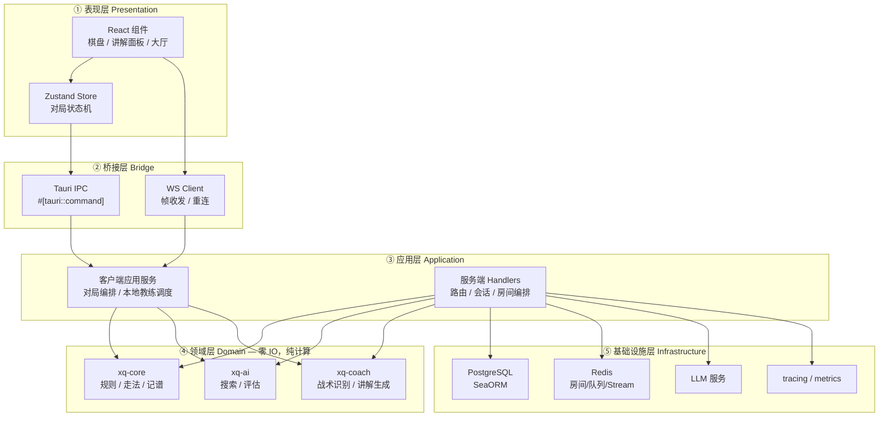
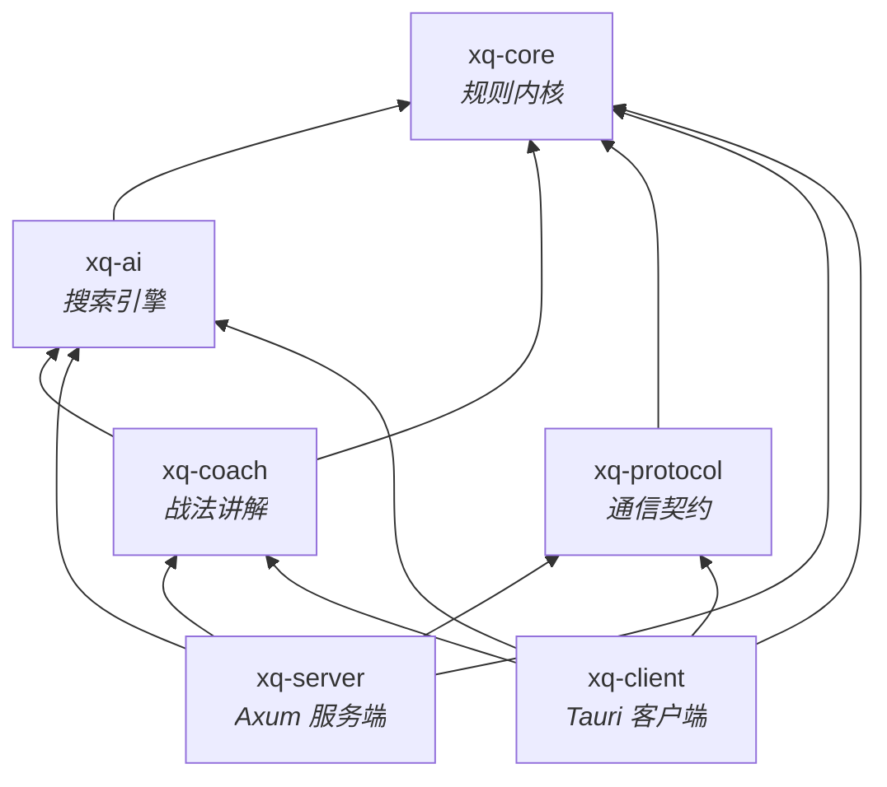
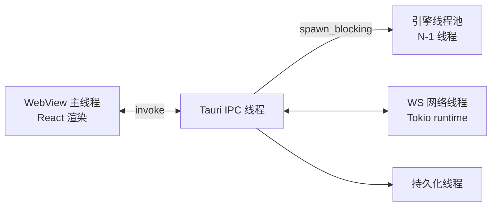
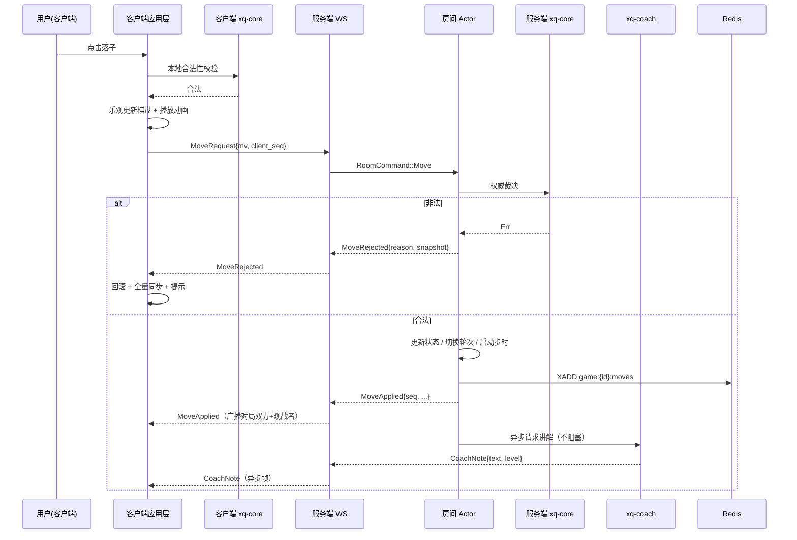
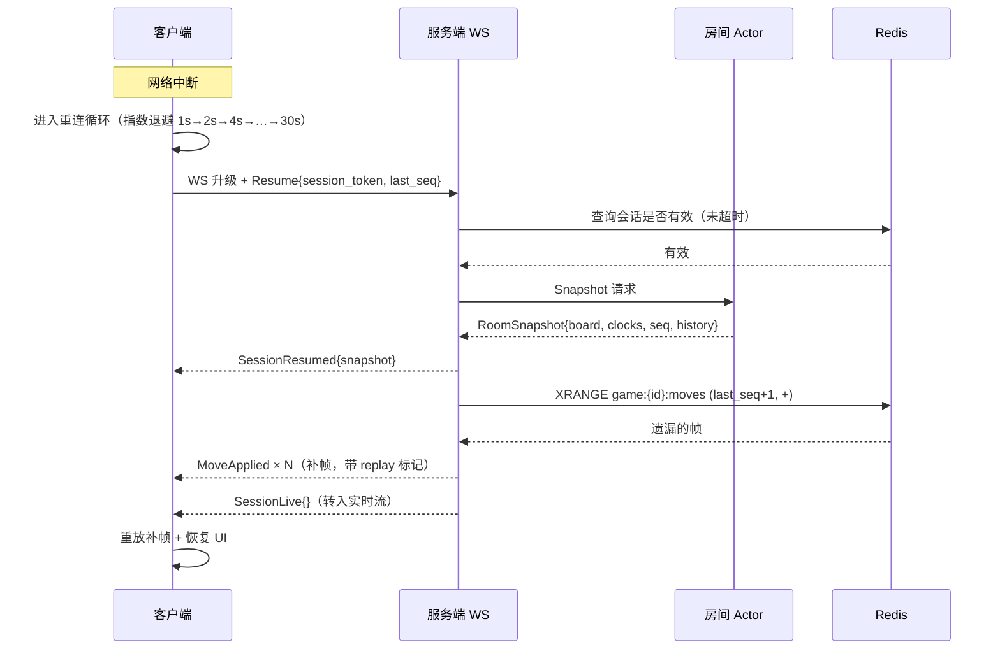
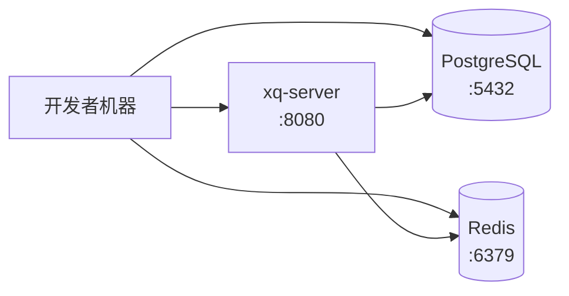
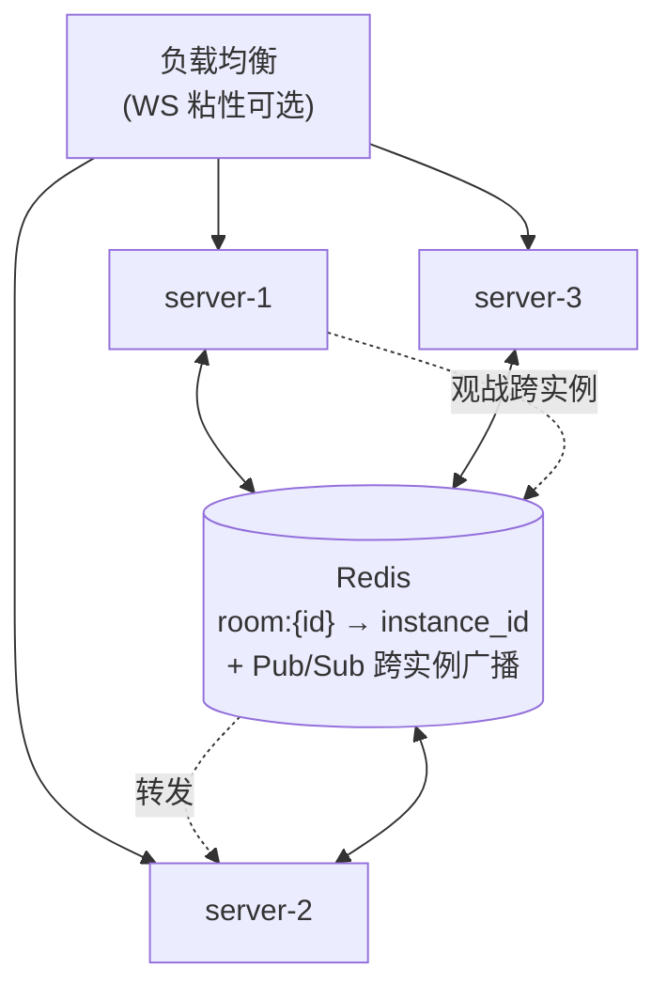

# 02 · 系统架构设计

| 项 | 值 |
|---|---|
| 文档版本 | v1.0 |
| 状态 | 设计基线 |
| 编制日期 | 2026-09-23 |
| 关联文档 | [01-需求规格](01-需求规格说明书.md) · [03-规则引擎](03-规则引擎与领域模型.md) · [06-联网协议](06-联网对战与实时通信协议.md) · [14-ADR](14-决策记录ADR.md) |

---

## 1. 架构目标

| 目标 | 达成手段 |
|---|---|
| **规则绝对一致** | 客户端与服务端复用同一个 `xq-core`，物理上只有一份规则实现 |
| **离线可用** | 规则 / AI / 本地讲解三个 crate 零 IO 依赖，可直接跑在客户端本地 |
| **可测试** | 核心逻辑不依赖运行时、不依赖网络、不依赖时钟 → 可确定性重放与属性测试 |
| **可扩展** | 服务端实例无状态化 + 房间归属注册表，可水平扩容 |
| **低耦合** | crate 依赖严格单向、无环；表现层与领域层之间只通过 `xq-protocol` 契约通信 |
| **性能** | IO 与计算分离；AI 搜索可下放客户端；着法持久化走异步 Stream 不阻塞对局路径 |

---

## 2. 分层架构



### 2.1 架构的核心不变量

> **不变量 I-1：领域层零 IO。**
> `xq-core` / `xq-ai` / `xq-coach` 三个 crate **禁止**依赖 `tokio`、`axum`、`sqlx`、`reqwest`、`std::fs`、`std::net`、`std::time::SystemTime`。
> 这条约束由 CI 中的 `cargo tree` 依赖断言强制检查（见 [docs/11](11-工程规范与CI-CD.md)）。

这条不变量的收益是复合的：

| 收益 | 说明 |
|---|---|
| 可确定性测试 | 无时钟依赖 → AI 搜索可完全复现；无网络 → 规则测试不需要 mock |
| 可 WASM 化 | 零 IO 的 crate 编译 WASM 几乎无痛，未来 Web 版直接复用 |
| 可并行 | 无共享可变状态 → 天然 `Send + Sync`，AI 搜索可跑满多核 |
| 可移植 | 从服务端搬到客户端，或反过来，零改动 |

> **不变量 I-2：协议是唯一契约。**
> 客户端与服务端之间只通过 `xq-protocol` 定义的类型通信。任何一端改动协议类型，另一端编译期即可发现（Rust 类型系统 + serde 校验）。

> **不变量 I-3：服务端是权威，客户端是预测者。**
> 客户端本地校验只为交互体验，**不构成任何权威**。任何状态分歧以服务端快照为准。

---

## 3. Crate 划分与依赖关系

### 3.1 依赖图（严格单向无环）



**依赖规则**：

| 规则 | 说明 |
|---|---|
| R1 | `xq-core` 不依赖任何内部 crate，仅依赖 `serde`（可选 feature）与 `bitflags` 类零成本工具 |
| R2 | `xq-ai` 只依赖 `xq-core`，**不得**依赖 `xq-coach`（避免循环） |
| R3 | `xq-coach` 可依赖 `xq-ai`（需要引擎评分做评价基准） |
| R4 | `xq-protocol` 只依赖 `xq-core`，**不得**依赖 `xq-ai` / `xq-coach`（协议层不携带引擎内部类型） |
| R5 | `xq-server` / `xq-client` 是叶子节点，禁止被其他 crate 依赖 |

### 3.2 各 crate 职责与公开边界

#### `xq-core` —— 规则内核

| 项 | 内容 |
|---|---|
| 职责 | 棋盘表示、坐标系统、走法生成、合法性校验、终局判定、重复局面与禁手、FEN、中文记谱 |
| 公开 API（概览） | `Board` / `Position` / `Move` / `MoveGen` / `Rules` / `GameStatus` / `Fen` / `Notation` |
| 依赖 | `serde`（feature `serde`，默认开）、`thiserror` |
| 测试 | 对拍题库 ≥ 3000 局面；属性测试（走法往返、FEN 往返） |
| 关键约束 | 单局内存占用目标 < 1 KB（棋盘 + 状态） |

#### `xq-ai` —— 搜索引擎

| 项 | 内容 |
|---|---|
| 职责 | 迭代加深、Alpha-Beta / PVS、置换表、着法排序、静态搜索、评估函数、难度分级、开局库查询 |
| 公开 API（概览） | `Engine` / `SearchLimits` / `Searcher` / `Evaluator` / `TranspositionTable` / `OpeningBook` |
| 依赖 | `xq-core`、`rand` |
| 并发 | `Searcher` 为不可共享的独占对象；可 `spawn_blocking` 到独立线程池 |
| 关键约束 | 单次搜索可中断（`AtomicBool` 停止标志）；无全局可变状态 |

#### `xq-coach` —— 战法讲解

| 项 | 内容 |
|---|---|
| 职责 | 战术模式识别、着法性质分类（将/捉/兑/弃/守）、评价等级计算、模板渲染、LLM 提示词构造与响应解析 |
| 公开 API（概览） | `Coach` / `TacticDetector` / `MoveAssessment` / `ExplainTemplate` / `LlmAdapter` |
| 依赖 | `xq-core`、`xq-ai`（评分基准）；LLM 调用**通过 trait 抽象**，本地实现不引入 HTTP 依赖 |
| 关键约束 | **本地模板路径必须零网络依赖**，保证离线可用（FR-03.06） |

> LLM 抽象方式：`xq-coach` 定义 `trait LlmClient { fn complete(&self, req: LlmRequest) -> Result<LlmResponse> }`，实际的 HTTP 实现放在 `xq-server`（服务端）与 `xq-client`（客户端），`xq-coach` 本体保持零 IO。这样既满足不变量 I-1，又能让两端各自决定接入方式。

#### `xq-protocol` —— 通信契约

| 项 | 内容 |
|---|---|
| 职责 | REST 请求/响应 DTO、WebSocket 帧枚举、错误码、协议版本协商 |
| 公开 API（概览） | `ClientFrame` / `ServerFrame` / `ApiError` / `PROTOCOL_VERSION` |
| 关键约束 | 所有帧类型必须 `#[serde(tag = "type")]` 可判别；未知帧必须可优雅忽略（前向兼容） |

#### `xq-server` —— 服务端

| 模块 | 职责 |
|---|---|
| `routes/` | REST 端点（账号、资料、战绩、大厅、棋谱） |
| `ws/` | WS 升级、会话生命周期、帧分发、心跳、重连补帧 |
| `room/` | 房间 Actor、状态机、计时器、观战广播 |
| `matchmaking/` | ELO 队列、匹配 worker |
| `coach_svc/` | 讲解调度、LLM 适配实现、缓存 |
| `store/` | SeaORM 实体与仓储；Redis 客户端封装 |
| `observability/` | 日志、指标、健康检查 |

#### `xq-client` —— 客户端（Tauri Rust 侧）

| 模块 | 职责 |
|---|---|
| `commands.rs` | 暴露给前端的命令：走子校验、提示生成、AI 思考、本地讲解 |
| `engine_pool.rs` | 本地 AI 线程池，避免阻塞 Tauri 主线程 |
| `net.rs` | WS 客户端、自动重连、帧编解码 |
| `persist.rs` | 本地棋谱与配置持久化 |

---

## 4. 并发模型

### 4.1 服务端：房间 Actor

**决策**：每个房间对应一个独占的 Tokio task，通过 `mpsc` 通道接收命令（Actor 模式），而非 `DashMap<RoomId, Arc<Mutex<Room>>>` 共享锁模型。

```rust
// 概念示意（非最终代码）
enum RoomCommand {
    Join { player: PlayerId, responder: oneshot::Sender<JoinResult> },
    Leave { player: PlayerId },
    Move { player: PlayerId, mv: Move, client_seq: u64 },
    Resign { player: PlayerId },
    OfferDraw { player: PlayerId },
    Chat { player: PlayerId, text: String },
    Tick,                     // 计时器驱动
    Snapshot { responder: oneshot::Sender<RoomSnapshot> },
}

struct RoomActor {
    state: RoomState,
    rx: mpsc::Receiver<RoomCommand>,
}
```

**为什么不用共享锁**：

| 维度 | Actor 模式 | 共享 Mutex |
|---|---|---|
| 状态一致性 | 天然串行化，无需关心锁顺序 | 需谨慎设计锁粒度，易死锁 |
| 计时器 | 房间自身持有 `tokio::time::interval`，无锁实现 | 需额外的全局计时任务扫描 |
| 崩溃隔离 | 单房间 panic 不影响其他房间 | 锁污染风险 |
| 观战广播 | 房间持有订阅者列表，直接广播 | 需额外同步结构 |
| 代价 | 每房间一个 task ≈ 数 KB 内存 | — |

**容量核算**：2500 房间 × ~8 KB task 开销 ≈ **20 MB**，可忽略。Tokio 单运行时支撑十万级 task 无压力，故 Actor 模式无容量风险。

### 4.2 阻塞计算的隔离

AI 搜索是 **CPU 密集型阻塞任务**，绝不能跑在 Tokio 的异步工作线程上（会饿死 IO 任务）。

| 端 | 方案 |
|---|---|
| 服务端 | `tokio::task::spawn_blocking` + 独立的搜索线程池；单房间同时最多 1 个搜索任务 |
| 客户端 | 专用 `rayon` 或标准线程池（`num_cpus - 1` 个线程，留一核给 UI 与 IO） |

**注意**：服务端**不在对局流程中调用 AI**。服务端的 AI 只用于：
1. 服务端侧讲解生成（需要评分基准）；
2. AI 托管模式（P2）；
3. 反作弊的引擎着法指纹比对。

这三者都在对局关键路径之外，异步执行、可限流、可降级。

### 4.3 客户端线程模型



**关键约束**：`#[tauri::command]` 中任何耗时 > 16 ms 的计算必须 `async` 并投递到引擎线程池，否则阻塞 WebView 主线程导致界面卡死（违反 NFR-P.01）。

---

## 5. 通信架构

### 5.1 双通道设计

| 通道 | 用途 | 特点 |
|---|---|---|
| **REST (HTTPS)** | 账号、资料、战绩、大厅列表、棋谱读写 | 无状态、可缓存、幂等、易限流 |
| **WebSocket** | 对局实时帧、观战、匹配队列、在线状态 | 全双工、低延迟、有状态会话 |

**为什么不用纯 WS**：账号类操作天然适合 REST（缓存、重试、幂等），全部塞进 WS 会让会话状态机臃肿且难以调试。

**为什么不用 SSE**：需要双向（走子、心跳、匹配指令），SSE 单向不够。

### 5.2 序列化格式

**决策**：JSON（serde_json），预留二进制扩展位。

依据（带宽实算）：一帧 `MoveApplied` 的 JSON 约 180~260 字节。一局 80 回合 = 160 步 ≈ 42 KB；加讲解帧每步约 400 字节 ≈ 64 KB。合计约 **106 KB / 局**。

单机 2500 并发对局，假设平均每 10 秒产生 1 步：
- 帧速率 ≈ 2500 / 10 = **250 帧/秒**
- 带宽 ≈ 250 × 300 B ≈ **75 KB/s**（出站，含广播给观战者后仍 < 1 MB/s）

结论：JSON 的带宽与 CPU 开销在此量级下完全不是瓶颈，而它的可读性与调试效率（抓包直接看懂）价值更高。协议头预留 `"v"` 版本字段与可选 `"bin"` 编码模式，未来若需优化可平滑切换。

---

## 6. 关键数据流

### 6.1 联网走棋（乐观更新 + 权威裁决）



**要点**：讲解帧 `CoachNote` 与走棋帧 `MoveApplied` 是**两条独立的帧**。讲解的生成延迟不进入走棋的关键路径（满足 FR-03.07 且不违反 NFR-P.05）。

### 6.2 断线重连（全量快照 + 增量补帧）



**退避参数**：1s / 2s / 4s / 8s / 16s / 30s（上限），带 ±20% 抖动（jitter）避免惊群。
**席位保留**：默认 120 秒（可配置），超时判负但保留对局记录可复盘。
**幂等保证**：每个帧带单调递增 `seq`，客户端丢弃 `seq ≤ last_seq` 的重复帧。

---

## 7. 部署拓扑

### 7.1 开发环境（单机）



### 7.2 生产环境（单实例）

| 组件 | 规格建议 | 说明 |
|---|---|---|
| xq-server | 8 核 / 16 GB | 目标 2500 并发对局 |
| PostgreSQL | 4 核 / 8 GB / SSD | 主从可选 |
| Redis | 2 核 / 4 GB | 开启 AOF 持久化 |
| 反向代理 | Nginx / Caddy | TLS 终止、WS 升级透传 |

### 7.3 生产环境（多实例扩展）

多实例的关键问题是**房间归属**：对局双方必须连到同一个实例，否则房间内状态分裂。

**方案：房间归属注册表**



| 机制 | 实现 |
|---|---|
| 房间创建 | `SETNX room:{id}:owner {instance_id} EX 7200`，冲突则重新生成房间号 |
| 加入房间 | 若 `owner != self` → 返回 `Redirect{instance}`，客户端重连到目标实例 |
| 跨实例观战 | 订阅 Redis Pub/Sub 频道 `room:{id}:frames` |
| 实例崩溃 | 归属键 TTL 到期后房间可被重新接管；未完成对局按断线超时处理 |
| 匹配队列 | 全局队列放 Redis Sorted Set，各实例注册 worker 抢占匹配任务 |

> 观战跨实例转发会引入额外一跳延迟（约 1~5 ms），但观战本身有 3 秒延迟要求，影响可忽略。

---

## 8. 配置管理

采用 `config` crate 的分层覆盖：**默认值 → 配置文件 → 环境变量 → 命令行**。

```toml
# config/default.toml（节选）
[server]
host = "0.0.0.0"
port = 8080
max_connections = 10000

[game]
room_idle_timeout_secs = 900
disconnect_forfeit_secs = 120
spectator_delay_ms = 3000
spectator_limit = 50
max_undo_per_game = 3

[ai]
enabled = true
default_depth = 6
search_timeout_ms = 5000

[coach]
llm_enabled = true
llm_timeout_ms = 3000
llm_daily_budget = 100000

[database]
url = "postgres://..."
max_connections = 20

[redis]
url = "redis://127.0.0.1:6379"
```

**环境变量覆盖**示例：`XQ__SERVER__PORT=9090`、`XQ__DATABASE__URL=...`（双下划线分隔层级）。

**敏感项**：数据库密码、JWT 密钥、LLM API Key 一律只从环境变量读取，**禁止写入配置文件与仓库**。

---

## 9. 可观测性

| 维度 | 手段 |
|---|---|
| **日志** | `tracing` + `tracing-subscriber`；JSON 输出；分级（ERROR/WARN/INFO/DEBUG） |
| **上下文** | 全链路携带 `request_id` / `room_id` / `game_id` / `player_id`（`tracing::Span` 传递） |
| **指标** | 连接数、房间数、对局数、帧延迟、搜索耗时、讲解生成耗时、LLM 调用次数与失败率 |
| **健康检查** | `GET /healthz`（存活）、`GET /readyz`（依赖就绪：DB + Redis） |
| **审计** | 关键动作（登录、建房、封禁）写审计日志 |

**关键 SLO 埋点**：

- `ws.frame.latency` —— 帧端到端延迟直方图
- `game.move.validate_duration` —— 服务端裁决耗时
- `coach.generate.duration` —— 讲解生成耗时（分本地/LLM 两条路径）
- `ai.search.nodes` / `ai.search.duration` —— 引擎性能基线漂移监控

---

## 10. 错误处理策略

采用「**库层 thiserror / 应用层 anyhow**」的分工：

| 层 | 类型 | 理由 |
|---|---|---|
| 领域层（core/ai/coach） | `thiserror` 定义具名错误枚举 | 调用方需要**匹配**错误类型做分支处理 |
| 应用层（server/client handlers） | `anyhow::Error` + 上下文 | 只需向上传播并记录，不需分支 |
| 对外边界（HTTP/WS） | 统一映射为 `ApiError` / `ErrorFrame` | 客户端需要稳定的错误码契约 |

**错误码规范**：`{域}{三位序号}`，例如：

| 错误码 | 含义 |
|---|---|
| `AUTH001` | 未认证 |
| `AUTH002` | token 过期 |
| `AUTH003` | 密码强度不足 |
| `GAME001` | 非法着法 |
| `GAME002` | 未轮到该方走子 |
| `GAME003` | 对局已结束 |
| `ROOM001` | 房间不存在 |
| `ROOM002` | 房间已满 |
| `ROOM003` | 房间已开局 |
| `RATE001` | 请求过于频繁 |

**原则**：
1. 对外错误信息**永不包含**内部堆栈、SQL 语句、文件路径；
2. 服务端错误**必须**在日志中保留完整上下文（含 request_id），便于用户报障后定位；
3. 客户端遇到未知错误码时优雅降级为通用提示，不崩溃。

---

## 11. 完整 workspace 配置

### `rust-toolchain.toml`

```toml
[toolchain]
channel = "1.98.1"
components = ["rustfmt", "clippy"]
targets = [
    "x86_64-pc-windows-msvc",
    "x86_64-unknown-linux-gnu",
    "x86_64-apple-darwin",
    "aarch64-apple-darwin",
]
profile = "minimal"
```

### 根 `Cargo.toml`

```toml
[workspace]
resolver = "3"
members = [
    "crates/xq-core",
    "crates/xq-ai",
    "crates/xq-coach",
    "crates/xq-protocol",
    "crates/xq-server",
    "crates/xq-client",
]

[workspace.package]
version = "0.1.0"
edition = "2024"
rust-version = "1.98"
license = "MIT OR Apache-2.0"
repository = ""

[workspace.dependencies]
# ---- 领域层（零 IO）----
xq-core     = { path = "crates/xq-core" }
xq-ai       = { path = "crates/xq-ai" }
xq-coach    = { path = "crates/xq-coach" }
xq-protocol = { path = "crates/xq-protocol" }

# ---- 序列化 ----
serde      = { version = "1.0.229", features = ["derive"] }
serde_json = "1.0"

# ---- 异步运行时 ----
tokio = { version = "1.53.1", features = ["full"] }

# ---- Web ----
axum        = "0.8.9"
axum-extra  = { version = "0.12.6", features = ["typed-header"] }
tower       = "0.5"
tower-http  = { version = "0.7.1", features = ["cors", "trace", "compression-gzip", "timeout"] }
tokio-tungstenite = "0.30.0"
futures-util = "0.3"

# ---- 存储 ----
sea-orm = { version = "2.0.3", features = ["sqlx-postgres", "runtime-tokio-rustls", "macros", "with-uuid"] }
sea-orm-migration = { version = "2.0.3", features = ["runtime-tokio-rustls"] }
redis = { version = "1.0", features = ["tokio-comp", "streams", "connection-manager"] }
deadpool-redis = "0.22"

# ---- 鉴权 ----
jsonwebtoken = "11.1.0"
argon2 = "0.6"

# ---- 工具 ----
uuid        = { version = "1.26.1", features = ["v4", "v7", "serde"] }
rand        = "0.10.3"
thiserror   = "2.0.20"
anyhow      = "1.0.104"
dashmap     = "6.2.1"          # 注意：7.x 仍为 rc
parking_lot = "0.12.5"
once_cell   = "1.21.4"
validator   = { version = "0.21.0", features = ["derive"] }
config      = "0.15.26"
chrono      = { version = "0.4", features = ["serde"] }

# ---- 可观测 ----
tracing            = "0.1.44"
tracing-subscriber = { version = "0.3", features = ["env-filter", "json"] }

# ---- 客户端 ----
tauri       = { version = "2.11.6", features = [] }   # 3.x 仍为 alpha，勿升
tauri-build = "2.6.3"

# ---- 测试 ----
criterion = { version = "0.8.2", features = ["html_reports"] }
proptest  = "1.11.0"
insta     = "1.48.0"

[profile.release]
lto           = "thin"
codegen-units = 1
panic         = "abort"
strip         = true

# 引擎基准需要高优化 + 调试符号
[profile.bench]
inherits = "release"
debug    = true
panic    = "unwind"    # benchmark 需要 unwind
```

> ⚠️ `redis` / `deadpool-redis` / `argon2` / `tower` 的版本号请在 `cargo add` 时再确认一次（本表未逐一实测），其余版本均已核实。

---

## 12. 架构风险与缓解

| 风险 | 影响 | 缓解措施 |
|---|---|---|
| 规则实现细节偏差（长捉裁决） | 判罚争议 | 明确定义**可实现的简化判定表**并在 UI 展示裁决依据；保留申诉入口 |
| AI 搜索阻塞事件循环 | 全局卡顿 | 强制 `spawn_blocking` + 独立线程池；CI 加入"主线程阻塞检测" |
| 客户端与服务端状态分歧 | 体验割裂 | 悲观校验兜底 + 全量快照重同步；定期一致性自检 |
| 多实例房间归属脑裂 | 对局数据损坏 | Redis 归属键 + TTL + 单写者原则 |
| LLM 成本失控 | 费用超支 | 日预算熔断 + 结果缓存（同局面复用）+ 降级到本地模板 |
| 观战延迟被绕过 | 作弊 | 服务端统一延迟队列，不依赖客户端 |
| 前端渲染掉帧 | 体验差 | DOM+CSS Transform 方案（GPU 合成）+ 60 FPS 性能门禁测试 |

---

## 13. 与需求的对应

| 需求 | 架构支撑 |
|---|---|
| FR-01 对局核心 | `xq-core` 单一实现，双端复用 |
| FR-02 走棋提示 | `xq-core::MoveGen` 直接驱动 UI 高亮 |
| FR-03 战法讲解 | `xq-coach` + LLM trait 抽象 + 异步帧 |
| FR-04 人机对战 | `xq-ai` 下沉客户端，离线可用 |
| FR-05 联网对战 | 房间 Actor + 服务端权威 + 快照补帧 |
| FR-06 观战 | 房间订阅者广播 + 3 秒延迟队列 |
| FR-07 匹配排行 | Redis Sorted Set 队列 + ELO |
| NFR-P 性能 | IO/计算分离 + 乐观更新 + 异步持久化 |
| NFR-R 可靠 | 快照重连 + Redis 状态外置 |
| NFR-S 安全 | 服务端权威 + 限流 + 哈希 |
| NFR-M 可维护 | 零 IO 领域层 + 单一契约 + CI 断言 |
