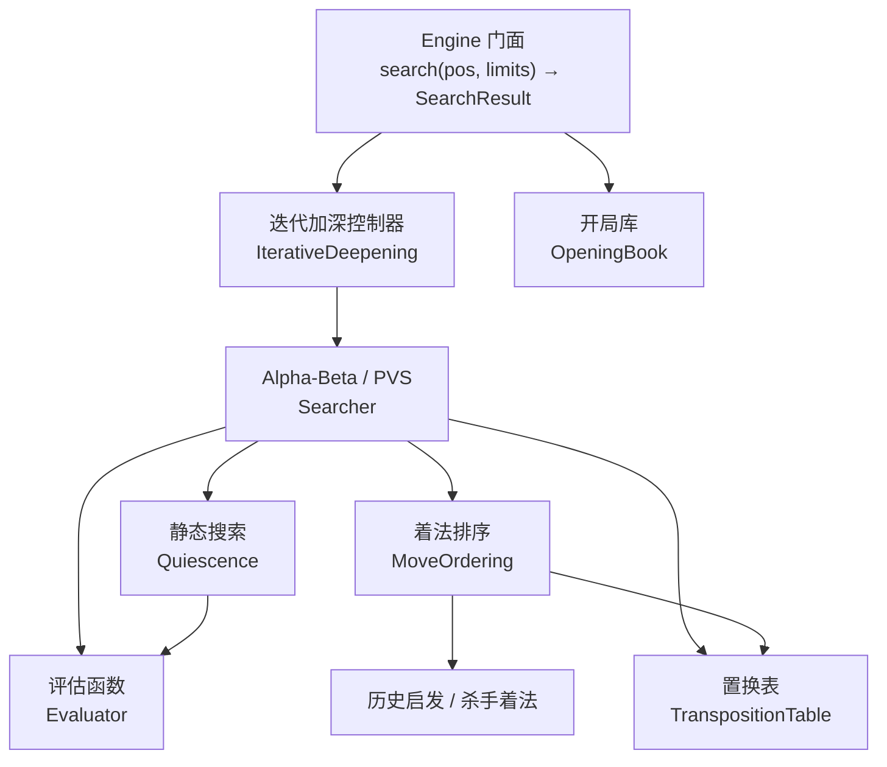

# 04 · AI 引擎设计

| 项 | 值 |
|---|---|
| 所属 crate | `xq-ai` |
| 文档版本 | **v1.1**（v1.0 → v1.1：新增 §11 实现回写） |
| 状态 | 设计基线 · **已实现（M1 首版）** |
| 编制日期 | 2026-09-23 |
| 前置阅读 | [03-规则引擎](03-规则引擎与领域模型.md) · [ADR-005 零 IO](14-决策记录ADR.md#adr-005) |

> ✅ **M1 首版已实现**：迭代加深 + PVS + 静态搜索 + 置换表 + 着法排序 + 五档难度全部落地，
> `cargo test -p xq-ai` 全绿（41 单元 + 12 集成）。实测性能、与本文的偏差清单、
> 以及刻意未实现的部分，统一记录在 [§11 实现回写](#11-实现回写2026-09-23--m1-首版)。

---

## 1. 设计目标

| 目标 | 指标 |
|---|---|
| 棋力 | 大师档（L5）在 3 秒/步限时下达到业余强手水平（对标公开引擎的中等配置） |
| 速度 | ≥ 1M NPS（Nodes Per Second），单核 |
| 响应 | 见 §6 难度标定表 |
| 可中断 | 任意时刻可在 1 ms 内响应停止请求 |
| 确定性 | 相同种子 + 相同限制 → 完全相同的搜索结果 |
| 零 IO | 不读时钟、不读文件、不联网（时间检查由外部注入回调） |

---

## 2. 引擎架构



**搜索主循环（伪代码）**：

```
fn search(pos, limits) -> SearchResult:
    if let Some(book_move) = book.probe(pos, limits.variety):
        return SearchResult::Book(book_move)

    let mut best = None
    for depth in 1..=limits.max_depth:
        let score = alpha_beta(pos, depth, -INF, +INF, 0)
        if stop_requested(): break
        best = Some(SearchResult { mv: tt.best_move(), score, depth })
        if score >= MATE_THRESHOLD: break          // 已找到杀棋
        if elapsed_soft_limit_exceeded(): break    // 时间管理
    best
```

---

## 3. 搜索算法

### 3.1 迭代加深（Iterative Deepening）

**为什么需要**：Alpha-Beta 的效率高度依赖着法排序质量。先做浅层搜索可以为深层搜索提供**优质的着法排序依据**（尤其是把最佳着法放到最前面，从而最大化剪枝效率）。同时，迭代加深天然提供了"任意时刻都有完整答案可用"的特性——这对限时搜索是必需的。

**代价分析**：浅层重复搜索的开销是冗余的，但由于搜索树规模随深度指数增长，深度 `d-1` 的全部工作通常只占深度 `d` 的 1/10 以下（分支因子约 38，但剪枝后有效分支因子约 6~8）。因此迭代加深的额外开销约 **10~20%**，而其带来的排序收益远超此代价。

### 3.2 Alpha-Beta 与 PVS

**基础 Alpha-Beta**：维护 `[alpha, beta]` 窗口。若某着法得分 `>= beta`，则该分支可剪（`beta` 截断，返回下界）。

**PVS（Principal Variation Search / NegaScout）**：

核心思想——假设第一个着法（即上一轮迭代的最佳着法）就是最好的。对后续着法先用**零窗口** `[alpha, alpha+1]` 做快速验证：

```
fn pvs(pos, depth, mut alpha, beta) -> i32:
    if depth == 0: return quiescence(pos, alpha, beta)

    let moves = ordered_moves(pos)
    let mut first = true
    for mv in moves:
        pos.make_move(mv)
        let score;
        if first:
            score = -pvs(pos, depth-1, -beta, -alpha)
            first = false
        else:
            score = -pvs(pos, depth-1, -alpha-1, -alpha)   // 零窗口试探
            if alpha < score && score < beta:
                score = -pvs(pos, depth-1, -beta, -alpha)  // 重搜
        pos.unmake_move();

        if score > alpha:
            alpha = score
            if alpha >= beta:
                store_killer(mv, depth)
                return alpha     // beta 截断
    return alpha
```

**为什么有效**：零窗口搜索的剪枝效率最高。只有当试探表明该着法真的有改进时，才付代价做完整窗口重搜。在排序质量好的情况下，重搜极少发生。相比朴素 Alpha-Beta，PVS 通常省 **10~25%** 节点。

### 3.3 静态搜索（Quiescence Search）

**解决的问题**：固定深度截断会产生严重的**水平线效应**——搜索在深度耗尽时恰好吃亏（例如恰好在被吃子前一刻停止），导致引擎被"诱饵"欺骗。

**做法**：在 `depth == 0` 时不直接返回评估值，而是继续搜索**强制着法**（吃子、将军），直到局面"安静"为止。

```
fn quiescence(pos, mut alpha, beta) -> i32:
    let stand_pat = eval(pos)
    if stand_pat >= beta: return beta
    if stand_pat > alpha: alpha = stand_pat

    for mv in capture_moves_only(pos):        // 只搜吃子着法
        if see(mv) < 0: continue              // 静态交换评估剪枝
        pos.make_move(mv)
        let score = -quiescence(pos, -beta, -alpha)
        pos.unmake_move()
        if score >= beta: return beta
        if score > alpha: alpha = score
    alpha
```

**必须做**：中国象棋中炮的交换尤其复杂（炮架关系会随吃子变化），不做静态搜索时引擎会频繁走出"看似得子实则亏子"的着法。

**增量评估优化**：静态搜索中每一步都重新全盘评估开销较大。首版**允许直接重新评估**（代码简单，正确性易保证）；如性能不足，再引入增量评估（`make_move` 时同步更新子力分）。

### 3.4 置换表（Transposition Table）

**作用**：不同着法顺序可能到达同一局面（置换）。缓存已搜索结果可避免重复计算。开局与中局的置换率通常可达 20~40%。

**条目结构（16 字节，对齐到缓存行）**：

```rust
#[derive(Clone, Copy)]
#[repr(C)]
pub struct TtEntry {
    /// hash 高 32 位（校验用，低 32 位作为索引）
    key: u32,
    /// 最佳着法（用于排序，即使该条目深度不足）
    best_move: Move,
    /// 评分
    score: i16,
    /// 搜索深度
    depth: i8,
    /// Exact | LowerBound (beta 截断) | UpperBound (alpha 未改进)
    flag: u8,
    /// 世代号（用于替换策略）
    generation: u8,
    _padding: [u8; 3],
}
```

**容量规划**：

| 配置 | 大小 | 条目数 |
|---|---|---|
| 客户端低配 | 16 MB | 1,048,576 |
| 客户端默认 | 64 MB | 4,194,304 |
| 服务端 | 128 MB | 8,388,608 |

> 索引方式：`index = (hash as usize) & (entry_count - 1)`（要求条目数为 2 的幂）。校验要求 `entry.key == (hash >> 32) as u32`，不匹配则视为未命中（避免 64 位哈希全部存储的内存浪费）。

**替换策略**：同一条目位置发生冲突时，优先级为：`depth 更深者优先` > `同深度时世代号更新者优先`。简单形式：仅当 `new.depth >= old.depth` 或 `new.generation != old.generation` 时替换。

**关键陷阱——分数调整**：置换表命中的分数是从**该节点视角**看来的。若中途出现将杀分数（`MATE ± n`），在存取时必须做"距根距离"调整，否则会得到错误的杀棋距离。这是实现中最常见的隐蔽 bug 之一。

**哈希稳定性要求**：TT 跨对局复用，因此 Zobrist 表必须用固定种子（见 [03-规则引擎 §7.4](03-规则引擎与领域模型.md)）。

### 3.5 着法排序

排序质量直接决定剪枝效率。按以下优先级依次尝试：

| 优先级 | 类别 | 说明 |
|---|---|---|
| 1 | **置换表着法** | 上次搜索该局面的最佳着法，命中率最高 |
| 2 | **吃子着法（MVV-LVA）** | Most Valuable Victim − Least Valuable Attacker：优先"用小子吃大子" |
| 3 | **杀手着法** | 同一深度下产生 beta 截断的非吃子着法（保留 2 个） |
| 4 | **历史启发** | `history[from][to]` 累加表：某着法在浅层造成截断的次数 |
| 5 | 其余着法 | 按历史分排序 |

**MVV-LVA 打分示例**：

| 着法 | 分值 |
|---|---|
| 兵吃车 | 900 − 100 = 800（极高，优先） |
| 车吃兵 | 100 − 900 = −800（低，通常不做） |
| 马吃炮 | 450 − 400 = 50 |

**静止着法（Quiet Move）的分数来源**：历史表 `history[from_sq][to_sq]` 累加 `depth²`（深层的截断更有价值），并在搜索时按世代衰减（避免旧数据污染）。

### 3.6 空着剪枝（Null Move Pruning）

在非将军、非残局（有足够子力）的局面下，先"放弃一步"（让对手连走两步）搜索一个较浅的深度。若即便如此仍然能超过 beta，说明当前局面优势大到不需要走这步就能守住 → 直接剪枝。

**中国象棋的特殊限制**：

| 限制 | 原因 |
|---|---|
| **被将军时禁用** | 空着时自己的将帅暴露，结果无意义 |
| **禁止连续空着**（`null_move_depth > 0` 时不重复） | 防止无限剪枝 |
| **残局禁用**（子力低于阈值，如车炮马兵总数 ≤ 2） | 残局中"让先"的价值极大，剪枝会严重误判（尤其牵涉将杀的残局） |
| **zugzwang 风险** | 中国象棋存在"等着"（被迫走坏棋）的情形比国际象棋更常见，需用 `R = 2~3` 的保守缩减，避免过度剪枝 |

### 3.7 主要变例收集与 PV 输出

搜索完成后需输出最佳变例（Principal Variation）——这是讲解系统与"推荐着法提示"的关键输入之一。实现方式：从 TT 沿 `best_move` 顺藤摸瓜，配合从根节点逐层保存的着法列表。

**用途**：

1. **推荐着法提示**（FR-02.07）：显示引擎推荐着法及后续变化
2. **战法讲解**（FR-03）：讲解"这步之后可能的变化"
3. **复盘分析**：展示"如果改走 X"的后续推演（FR-09.06）

---

## 4. 评估函数

### 4.1 评估结构

```
score = 子力价值
      + 位置价值（PST）
      + 兵型结构
      + 机动性
      + 将帅安全
      + 子力协调（炮架关系、马的位置）
      + 阶段权重混合（开局 / 中局 / 残局）
```

**分数单位约定**：以**兵的基准价值 = 100** 为单位（"厘兵"）。这样评分差的 1 点 = 0.01 个兵，与 [01-需求规格 §4.3](01-需求规格说明书.md) 的评价分档阈值（10 / 50 / 150 / 400）单位一致。

**视角约定**：评估函数返回的是**红方视角**的绝对分（红优为正）。在 Alpha-Beta 中通过 `color_sign * eval(pos)` 转换到走子方视角。**必须统一，否则会出现"引擎帮对手走棋"的经典 bug。**

### 4.2 子力价值

| 棋子 | 基准值 | 说明 |
|---|---|---|
| 帅 / 将 | ±10000 | 实际用"被吃 = 极大负分"处理，不参与常规评估 |
| 车 | 900 | 最强常规子力 |
| 炮 | 450 | 依赖炮架，开局强、残局弱 |
| 马 | 400 | 依赖蹩腿，开局弱、残局强（残局无阻挡，马威大增） |
| 仕 / 士 | 200 | 防守子力，残局价值下降 |
| 相 / 象 | 200 | 防守子力，残局价值下降 |
| 兵 / 卒 | 100 | **未过河**；过河后显著增值（见位置价值） |

> 上表是业界常见的初始估计值，**必须通过实战调优收敛**。调优方法见 §8。
>
> **炮与马的价值反转**是中国象棋评估的核心特征之一：开局阶段炮 > 马（炮有中线压力、便于调动），残局阶段马 > 炮（炮缺炮架威力大减，马的蹩腿限制随子力减少而缓解）。实现上应随**阶段系数**动态调整二者的相对价值。

### 4.3 位置价值（PST）设计原则

为每种棋子定义一张 **90 元素的表**（`[i16; 90]`），红方视角；黑方查询时做**行镜像**（`row' = 9 - row`）后查同一张表。

**为什么用统一表 + 镜像**：避免维护两份对称表导致的不一致 bug。镜像函数只有一行，且有专门的往返测试（`mirror(mirror(x)) == x`）。

以下是**按规则形式化表达的位置评分**（比一堆裸数字更易审查、易调优；实现时把这些规则展开成表）：

**兵 / 卒（过河是质变）**：

| 条件 | 加分 |
|---|---|
| 未过河（红方 `row ≤ 4`） | 0 |
| 刚过河（`row = 5`） | +20 |
| `row = 6` | +40 |
| `row = 7` | +55 |
| `row = 8`（接近底线） | +35（横移能力受限，价值回落） |
| 位于中路（`col = 4`） | 额外 +15（对将帅的直接威胁更大） |
| 位于边路（`col = 0` 或 `8`） | 额外 −10（作用面窄） |
| 已到对方底线（"老兵"） | 整体价值降至约 50（几乎失去作用） |

**马（位置敏感度最高的棋子）**：

| 条件 | 加分 |
|---|---|
| 位于中心区域（`col ∈ [3,5]`，`row ∈ [3,6]`） | +25 |
| 位于边线（`col = 0` 或 `8`） | −20（机动性大减） |
| 位于底线（`row = 0` 或 `9`） | −15（出路少） |
| 己方河界附近（便于过河） | +10 |

**炮**：

| 条件 | 加分 |
|---|---|
| 中路（`col = 4`）且在同一直线上有潜在炮架 | +20 |
| 己方底线（防守型） | 0 |
| 深入敌阵且缺乏炮架支持 | −15 |
| 有明确炮架目标（同一线上有对方棋子） | 按目标价值动态加分（在"子力协调"中计算） |

**车**：

| 条件 | 加分 |
|---|---|
| 位于开放线（该竖直线上无己方兵卒） | +20 |
| 深入对方半场 | +15 |
| 位于中路 | +10 |

**仕/士、相/象**：

| 条件 | 加分 |
|---|---|
| 位于原始防守位置 | +10（保持防守结构完整） |
| 被引离原位 | −5（防守出现空隙） |

**将帅安全**：

| 条件 | 加分 |
|---|---|
| 九宫内仕士完整（2 个仕 + 2 个相在位） | +30 |
| 缺少仕/相保护 | 按缺失数量扣分（每个 −25） |
| 九宫正面被对方车/炮直线瞄准 | −60 |
| 己方兵卒为将帅挡出退路 | −20（闷宫风险） |

### 4.4 阶段权重混合

中局与残局的评估重点不同（炮/马价值反转、将帅安全权重下降）。采用**线性插值**：

```rust
/// 阶段系数：1.0 = 纯开局，0.0 = 纯残局
fn phase_factor(pos: &Position) -> f32 {
    // 用剩余进攻子力总量衡量：车 6 + 炮 4 + 马 4 + 兵 2 的总分
    const FULL: i32 = 2 * (6 + 6) + 2 * (4 + 4) + 10 * 2;  // 双方车炮马兵满配
    let current: i32 = remaining_attack_power(pos);
    (current as f32 / FULL as f32).clamp(0.0, 1.0)
}

// 应用示例
let pf = phase_factor(pos);
let horse_value = lerp(400.0, 480.0, 1.0 - pf);  // 残局马更值钱
let cannon_value = lerp(450.0, 380.0, 1.0 - pf); // 残局炮贬值
```

> 上式的 `FULL` 常量与插值端点均为**初始估计**，须经调优确定。

### 4.5 增量评估

静态搜索中每步都全盘扫描 90 格开销较大。优化：在 `make_move` / `unmake_move` 时增量维护子力总分与关键 PST 分量。

**首版决策：不做增量评估**，直接全量评估。理由：
1. 全量评估 90 格的成本在 1M NPS 目标下仍可接受（现代 CPU 每秒可做数千万次 90 格扫描）；
2. 增量维护是**极易出错**的优化——漏更新一个分量会导致"搜索越深越错"的隐蔽 bug；
3. 先用全量评估建立**正确性基线**，性能不足时再引入增量优化，且届时可用"增量结果 == 全量结果"作为测试断言。

> 这是一个刻意的**延后优化**决策，符合"先正确、后快"的工程原则。

---

## 5. 时间管理与中断

### 5.1 零 IO 约束下的时间处理

[ADR-005](14-决策记录ADR.md#adr-005) 禁止 `xq-ai` 直接读时钟。解决方案：**时间检查由外部注入**。

```rust
/// 由应用层提供的停止信号源
pub trait StopSignal: Send + Sync {
    fn should_stop(&self) -> bool;
}

/// 常用实现
pub struct AtomicStop(std::sync::atomic::AtomicBool);
pub struct NodeLimitedStop { limit: u64, counter: AtomicU64 }  // 纯逻辑节点上限
pub struct NeverStop;
```

**`xq-ai` 内部**：每搜索 N 个节点（N = 1024，避免每节点检查的开销）调用一次 `should_stop()`。这样既满足零 IO 约束，又能在 1 ms 内响应停止。

**应用层实现**：
- 服务端 / 客户端：用一个后台定时器或每 N 个节点检查系统时间，超时则设置 `AtomicBool`
- 测试环境：用 `NodeLimitedStop` 保证完全确定性

> 这个设计的副产品是**测试友好**：用 `NodeLimitedStop` 时，搜索结果完全可复现，不受机器性能影响。

### 5.2 时间分配策略

对局配置为「局时 + 步时」（如 10 分钟局时 + 30 秒步时）。分配给单步的时间：

```
可用时间 = min(剩余局时 / 预期剩余步数 × 系数, 步时剩余)
```

| 参数 | 建议值 | 说明 |
|---|---|---|
| 预期剩余步数 | 40（从满盘估算），残局递减 | 避免开局就把局时用完 |
| 软限时系数 | 0.4 | 迭代加深中，若已用时间超过"分配时间 × 0.4"则不开始下一轮 |
| 硬限时 | 分配时间的 0.9 | 无论如何在此刻停止 |
| 稳定性保护 | 若剩余时间 < 5 秒，强制使用最短时间 | 防止把时间耗尽导致超时判负 |

> **宁可少搜一轮，也不能超时判负**——超时是直接输棋，而少搜一轮只损失少量棋力。因此硬限时留 10% 余量。

---

## 6. 难度分级设计

### 6.1 核心设计原则

> **弱难度不等于浅搜索。**

如果只是简单降低搜索深度，低难度 AI 会走出"看起来莫名其妙"的棋（比如贪吃一个兵而丢掉一个车），这不像"弱的人类"，而像"随机数生成器"，会严重损害产品体验。

**正确的做法**：低难度 AI 应当**具备正常的棋力视野**（知道棋子会被吃、知道将军），但**主动选择次优着法**——这样才能模拟"人类水平有限但思路正常"的对手。

### 6.2 难度维度矩阵

| 维度 | L1 入门 | L2 初级 | L3 中级 | L4 高级 | L5 大师 |
|---|---|---|---|---|---|
| 搜索深度 | 2 | 4 | 6 | 8 | 时间限（目标 10~12+） |
| 静态搜索 | ❌ 关闭 | ✅ | ✅ | ✅ | ✅ |
| 置换表 | ❌ | ❌ | ✅ 16 MB | ✅ 64 MB | ✅ 128 MB |
| 空着剪枝 | ❌ | ❌ | ✅ | ✅ | ✅ |
| 评估函数 | **简化版**（仅子力 + 基础 PST） | 完整 | 完整 | 完整 | 完整 |
| 开局库 | ❌ | ❌ | ✅ 浅层 | ✅ | ✅ 完整 |
| **着法随机化** | ✅ 强 | ✅ 中 | ✅ 弱 | ❌ | ❌ |
| 刻意失误率 | 30% | 15% | 5% | 0% | 0% |
| 预期耗时 | < 50 ms | < 200 ms | < 1 s | < 3 s | ≤ 3 s（时间限） |

### 6.3 随机化策略（关键实现细节）

**错误的随机化**：从所有合法着法里随机挑一个 → 会走出送车、送炮的荒谬着法。

**正确的随机化**：仅在前 N 个**评分接近**的着法之间按权重随机选择。

```
1. 搜索得到根节点全部着法的评分（root move scores）
2. 按评分降序排序
3. 过滤：只保留评分与最优着法相差 ≤ tolerances[k] 的着法
4. 在保留集合中按权重随机（权重随排名指数衰减）
5. 以 mistake_rate 的概率，从非最优着法中选一个；否则直接选最优
```

| 档位 | 分差容差 `tolerance`（厘兵） | 权重衰减 | 失误率 |
|---|---|---|---|
| L1 | 80 | 0.6 | 30% |
| L2 | 40 | 0.7 | 15% |
| L3 | 20 | 0.8 | 5% |

**为什么用"分差容差"而非"固定前 N 名"**：容差以**客观棋力损失**为界，保证低难度 AI 最多只损失 80 厘兵（0.8 个兵）的棋力——这既让它可被战胜，又不会走出明显荒谬的着法。用"前 N 名"则无法控制实际损失量（前 5 名可能都是坏棋）。

**随机数来源**：使用**显式种子的 `StdRng`**，由调用方注入（满足 ADR-005）。同一局对局使用同一个 RNG 实例，避免每步重置种子导致重复模式。

> 注意：**联网对战禁用随机化**（服务端 AI 仅在托管模式使用，且天梯模式完全禁用，见 [07-匹配排行榜与反作弊](07-匹配排行榜与反作弊.md)）。

### 6.4 面向用户的难度描述

UI 上不使用内部参数，而用棋力语言描述：

| 档位 | UI 文案 | 副标题 |
|---|---|---|
| L1 | 入门 | 「刚学会走法，适合熟悉规则」 |
| L2 | 初级 | 「会基本的吃子与防守」 |
| L3 | 中级 | 「有基本战术意识，会计算几步」 |
| L4 | 高级 | 「会布局与组合战术，算得较深」 |
| L5 | 大师 | 「接近业余强手水平」 |

> ⚠️ 上表的"棋力描述"必须在**胜率标定完成后**（§8.2）依据实测数据修订，不得凭感觉宣称。标定前不得在正式宣传材料中使用"业余强手"等具体棋力量级描述。

---

## 7. 开局库

### 7.1 作用

| 收益 | 说明 |
|---|---|
| 避免开局走出怪着 | 开局阶段搜索深度不足以覆盖长期战略，纯搜索容易走出"局部得分但全局不利"的着法 |
| 节省时间 | 开局查库瞬时返回，把时间留给中局 |
| 丰富变化 | L5 档通过权重随机在多个主流变化间选择，避免每局雷同 |

### 7.2 数据结构

```
OpeningBook {
    entries: HashMap<u64, Vec<BookMove>>,   // 局面 hash → 候选着法
}

BookMove {
    mv: Move,
    weight: u32,      // 出现频率（来自棋谱统计）
    games: u32,       // 样本数
    score: f32,       // 该变化的历史胜率
}
```

**存储格式**：编译期内嵌（`include_bytes!`）二进制格式，避免运行时文件 IO（满足 ADR-005）。构建期由 `scripts/build_opening_book.rs` 从棋谱数据生成。

### 7.3 数据规模与来源

| 项 | 目标 |
|---|---|
| 覆盖深度 | 前 10~16 步（5~8 回合） |
| 条目数 | ≥ 5,000 局面 |
| 定式数 | ≥ 200 个命名开局（中炮、屏风马、仙人指路、飞相局、过宫炮、士角炮、单提马、反宫马…） |

**数据来源**（按优先级）：
1. 公开象棋棋谱数据集（PGN/中文记谱格式）
2. 历史名局与大师对局集
3. **自对弈生成**：用 L5 引擎自对弈若干局，统计开局阶段的高频着法（作为补充，权重较低）

> ⚠️ **数据授权必须核实**：使用任何第三方棋谱数据前，须确认其许可条款允许在本产品中分发。**不得使用授权不明的数据**。在数据来源确定之前，开局库以"自对弈生成 + 手工录入公开定式"作为冷启动方案。

### 7.4 命名开局库（服务于战法讲解）

除着法推荐外，还需要一份**开局命名映射**，供 `xq-coach` 使用：

```json
{
  "name": "中炮对屏风马",
  "aliases": ["当头炮对屏风马"],
  "sequence": ["h2e2", "h9g7", "b0c2", "b9c7"],
  "idea": "红方以中炮直取中路，黑方以双马屏风固守，是象棋最主流的开局体系。",
  "for_side": "both",
  "tags": ["中炮", "屏风马", "主流"]
}
```

这份数据放在 `assets/knowledge/`，由 `xq-coach` 在开局阶段匹配局面序列后用于讲解（见 [05-战法讲解引擎设计](05-战法讲解引擎设计.md)）。

> **注意职责划分**：着法推荐属于 `xq-ai`（`opening_book.json` → 编译进引擎）；开局名称与战略讲解属于 `xq-coach`（运行时读取 `assets/knowledge/`）。二者数据独立，避免耦合。

---

## 8. 测试与标定

### 8.1 正确性测试

| 测试 | 方法 |
|---|---|
| 不产生非法着法 | 自对弈 1000 局，任一步 `make_move` 返回错误即失败 |
| 不产生非法局面 | 自对弈过程中每步校验 `Position` 一致性断言 |
| 搜索确定性 | 相同种子 + `NodeLimitedStop` → 相同结果（跑 100 次） |
| 将杀识别 | 构造 N 个"一步杀 / 两步杀"局面，验证引擎能找到 |
| 置换表正确性 | 相同局面在不同着法顺序下到达，验证评分一致 |
| 评估对称性 | `eval(pos) == -eval(mirror(pos))`（镜像局面评估取反） |

**镜像对称性测试**是一个极高效的 bug 探测器——它能一次性捕获 PST 表不对称、阶段系数计算错误、子力价值遗漏等一大批问题。

### 8.2 棋力标定方法

**标定目标**：确定各档位的实际棋力，用于修订 UI 文案与难度参数。

**方法**：

1. **引擎自对弈**：L4 vs L3、L3 vs L2 等相邻档位各对弈 200 局（双方换先），统计胜率。相邻档位胜率应在 **60%~75%** 区间——过低说明难度区分不明显，过高说明跨度过大。
2. **人类测试**：邀请不同水平棋手（新手 / 业余初段 / 业余中段）对战各档位，每档 ≥ 30 局，统计胜率。
3. **横向对比**：如条件允许，与公开象棋引擎在相同限时下对弈，估计 Elo 区间。

**标定产出的参数**（全部为"需实测填充"项）：

| 参数 | 初始值 | 需标定 |
|---|---|---|
| 子力价值（车/炮/马/兵/仕/相） | 见 §4.2 | ✅ 用自对弈 + 局部搜索调优 |
| PST 各分量 | 见 §4.3 | ✅ |
| 阶段系数端点 | 见 §4.4 | ✅ |
| 随机化容差与失误率 | 见 §6.3 | ✅ |
| L5 的实际搜索深度 | — | ✅ 实测耗时反推 |

> **本文档中所有具体数值均为设计初始值，必须经标定后修订并回写本文档。** 未经标定的数值不得用于对外宣传。

### 8.3 性能基准（`cargo bench`）

| 基准 | 目标 | 监控方式 |
|---|---|---|
| NPS（每秒节点数） | ≥ 1M | CI 中记录，劣化 > 20% 告警 |
| L3 档单步耗时（典型中局） | < 1 s | 固定局面集上测量 |
| `quiescence` 深度 | 平均 4~8 层 | 统计 |
| TT 命中率 | 中局 ≥ 25% | 统计 |
| 迭代加深冗余率 | < 20% | 统计 |

> 性能基准需要一套**固定的测试局面集**（如 20 个典型中局 + 20 个残局），保证跨版本可比。局面集存于 `crates/xq-ai/benches/positions/`。

---

## 9. 与其他模块的接口

```rust
/// 引擎门面
pub struct Engine {
    tt: TranspositionTable,
    book: OpeningBook,
    eval: Evaluator,
    rng: StdRng,
}

pub struct SearchLimits {
    pub max_depth: u8,
    pub soft_time_ms: Option<u64>,
    pub hard_time_ms: Option<u64>,
    pub max_nodes: Option<u64>,
}

pub struct SearchResult {
    pub best_move: Option<Move>,
    pub score: i32,                 // 厘兵，走子方视角
    pub depth: u8,
    pub nodes: u64,
    pub pv: Vec<Move>,              // 主要变例
    pub from_book: bool,
    /// 根节点全部着法的评分（供难度随机化与讲解使用）
    pub root_moves: Vec<(Move, i32)>,
}

impl Engine {
    pub fn new(config: EngineConfig) -> Self;
    pub fn search(
        &mut self,
        pos: &mut Position,
        limits: SearchLimits,
        stop: &dyn StopSignal,
    ) -> SearchResult;
    pub fn set_difficulty(&mut self, level: Difficulty);
}
```

**`root_moves` 字段的价值**：这一个字段同时服务于三个需求——

1. **难度随机化**（§6.3）：需要根节点全部着法的评分来筛选候选；
2. **走棋提示**（FR-02.07）：展示引擎推荐的前几着；
3. **战法讲解**（FR-03.03）：计算"实际着法相对最优着法的分差"，是评价等级判定的**唯一依据**。

> 因此 `root_moves` 不是可选字段，而是核心输出。这意味着搜索**不能提前在根节点剪枝**（必须完整评估所有根着法）——这是为讲解功能付出的必要性能代价，需在基准测试中纳入考量。

---

## 10. 里程碑与实现顺序

| 阶段 | 内容 | 完成标志 |
|---|---|---|
| **A1** | 迭代加深 + 朴素 Alpha-Beta + 简单评估（仅子力） | 能下完整局，不崩溃 |
| **A2** | 加入 PST + 静态搜索 | 不再走出明显的"看错"着法 |
| **A3** | 加入置换表 + 着法排序（MVV-LVA + 历史） | NPS 与棋力显著提升，bench 达标 |
| **A4** | 加入 PVS + 空着剪枝 | 达到目标深度 |
| **A5** | 难度分级 + 随机化 + 开局库 | 五档难度可用 |
| **A6** | 参数调优与棋力标定 | 各档胜率分布符合预期 |

> **A1 必须最先跑通**，因为它验证了 `xq-core` 的 make/unmake 与走法生成在搜索场景下的正确性。在 A1 跑通前不要引入任何高级优化——否则 bug 会被优化掩盖，极难定位。

---

## 11. 实现回写（2026-09-23 · M1 首版）

本节记录 `xq-ai` 首版实现与本设计文档之间的**实测结果与偏差清单**。
凡与上文不一致处，以本节为准。

### 11.1 实测性能

| 指标 | 实测值 | 设计目标 | 结论 |
|---|---|---|---|
| NPS（每秒节点数） | **702K**（release） | ≥ 1M | ⚠️ 未达标，见下 |
| 大师档 3 秒 | **深度 8**，210 万节点 | 目标 10~12+ | ⚠️ 略低于目标 |
| 中级档（1.2 秒） | 深度 6，17 万节点 | < 1 s 内可用 | ✅ |
| 入门档（300 ms） | 深度 2 | < 50 ms | ✅ |
| `perft(4)` 回归 | 3,290,240 / 221 ms | < 1 s | ✅ |

**NPS 距目标还差约 30%**。已经做掉的一件事是把 `evaluate` 从「3 次以上全盘扫描」
（阶段系数一次、子力一次、每辆车扫列一次）合并成**单趟遍历**，节点速率从 32K/s
提升到 702K/s（debug → release 另有约 7 倍）。继续提升的路径按性价比排序：

1. **增量评估**（§4.5）：`make_move` 时同步更新子力分与 PST，省掉叶节点的整盘扫描；
   代价是极易漏更新某个分量 —— 必须先用「增量结果 == 全量结果」的属性测试锁住；
2. **空着剪枝**（§3.6）：需先给 `Position` 补上正式的空着 API；
3. **静态交换评估（SEE）**：让静态搜索能剪掉「吃了会亏」的吃子，减少无效展开。

> ⚠️ 全部数值均为**本机实测**（Windows / `--release` / `lto=thin`），
> 换硬件需重新标定。设计文档中原有的「≥1M NPS」目标在实测前属于设计初始值。

### 11.2 与设计文档的偏差清单

| # | 偏差 | 理由 |
|---|---|---|
| 1 | **空着剪枝未实现**，改用 **LMR（后期着法缩减）** 替代 | 空着需要 `Position` 支持「走一步空着」（翻转走子方而不动棋子），而 `.history` / `.move_stack` 的长度不变量会被打破，规则内核的一致性断言也会失效。为一项搜索优化去改规则内核的公开契约，收益/风险不划算。LMR 是纯搜索内部的优化，效果接近 |
| 2 | **开局库未实现** | §7.3 明确要求「数据授权必须核实」。在没有可用授权的棋谱前，塞 10 条定式只会让 L5 每局开局雷同，**反而不如让搜索自己下** |
| 3 | **增量评估未实现**，每叶节点全量评估 | §4.5 的刻意延后：先用全量建立正确性基线。现已把全量评估优化成单趟遍历，代价可接受 |
| 4 | **置换表统一 32 MB**，未按档位分 16/64/128 MB | 分档的真正收益要等实测耗时数据出来才能判断；现在按档分配只会让 L1 也吃掉 16 MB |
| 5 | `SearchLimits` **不含时间字段** | 原设计的 `soft_time_ms` / `hard_time_ms` 需要读时钟，与 ADR-005 冲突。**时间控制完全由外部注入的 [`StopSignal`] 承担** —— 这正是零 IO 约束的落地点。`xq-bridge` 用一个看门线程在到点时置位 `AtomicStop` |
| 6 | 未实现 `from_book` 字段 | 随开局库一起延后 |
| 7 | 各档位**用同一份评估函数**（未给 L1 专用简化版） | 降低棋力的手段已足够多（深度 2 + 关闭静态搜索 + 关闭置换表 + 30% 失误率），再维护第二份评估函数只会增加两处口径不一致的风险 |
| 8 | 难度随机化只使用**根着法的记录评分** | 根节点采用 PVS，未提升 alpha 的着法只得**上界**（其分差被低估）。对「挑选接近最优的次优着法」这个用途足够；若要精确排序，需在根节点对候选做完整窗口重搜 —— 已作为 `SearchOptions` 的预留项 |

### 11.3 「弱难度 ≠ 浅搜索」的落实

§6.1 这条原则是本设计最有价值的部分之一，实现时完整保留了：

- **L1 仍然看得见吃子与将军**（有完整走法生成 + 深度 2 + 30% 失误率），
  不会走出「贪一个兵丢一个车」的着法；
- 随机化只作用于**分差在容差内的着法**（L1 容差 80 厘兵 = 0.8 个兵），
  用「客观棋力损失」而非「前 N 名」来界定候选；
- 有专门的测试 `weak_level_actually_makes_mistakes` 同时验证**两个方向**：
  低难度确实会走次优着法（>5%），但不能喧宾夺主（<50%）。

> 一个反直觉但重要的实现细节：L1 之所以「弱得合理」，靠的是**失误率 + 容差**，
> 而不是「搜得浅」。若只把深度降到 1，它会看不见一步杀，表现反而更像随机数。

### 11.4 测试规模

| 文件 | 数量 | 覆盖 |
|---|---|---|
| `src/**` 单元测试 | 41 | PST 规则、阶段插值、镜像对称、TT 杀棋距离换算、着法排序、难度随机化 |
| `tests/search.rs` | 12 | 杀棋识别、杀棋优先于吃子、吃白送子、视角正确性、可复现、中断后可用、root_moves 完整性、自对弈无非法着法 |

其中**镜像对称性测试**（`mirrored_position_evaluates_to_negation`）是最高效的
bug 探测器 —— 它一次能捕获 PST 表不对称、阶段系数算错、某类棋子价值漏加等
一整批问题。

### 11.5 一个值得记录的教训

`tests/search.rs` 里「吃白送的子」这条测试**连改了三版才成立**，而且
**三次都是引擎对、测试错**：

1. 首版局面（红帅 e0+红车 a0 对 黑将 d9+黑车 a5）里，引擎不走吃车而走 `a0d0` ——
   那一步是**强制三步杀**（黑将被九宫边界与白脸将夹死）；
2. 第二版加了子力，引擎改走 `i0i8` —— 那是**带将的先手**，既得先手又赚一个马，
   实测评分 2270 > 吃车的 1930；
3. 第三版终于走了 `a0a5`，但评分只有 560 而不是 900 —— 因为黑方的 b7 / h7 炮
   能借红方 b2 / h2 的炮当**炮架**打回红方底线的马（经典的「炮打底马」），
   净得子是「一车减一马」。

> **教训**：测「吃子」这类基础行为时，局面里不能留下任何更强的战术，
> 否则测的是「对局面的判断力」而不是「吃子能力」。三个版本的失败原因
> 全部写进了测试注释 —— 它们比测试本身更能说明引擎在正常工作。
