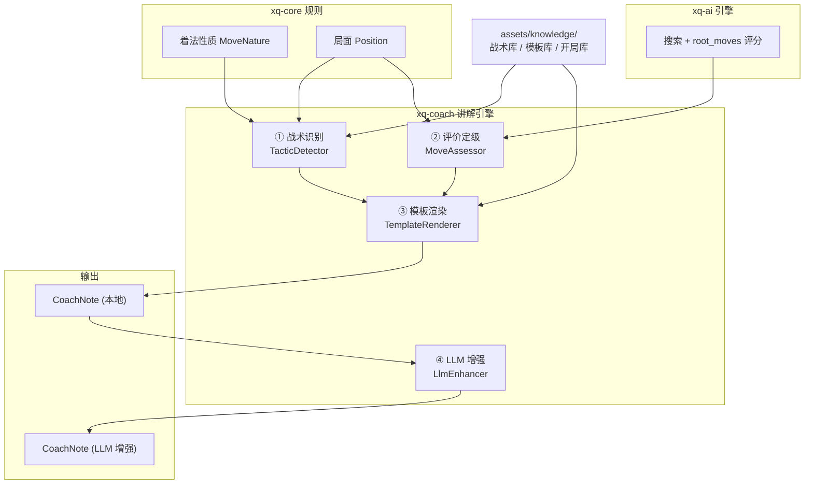
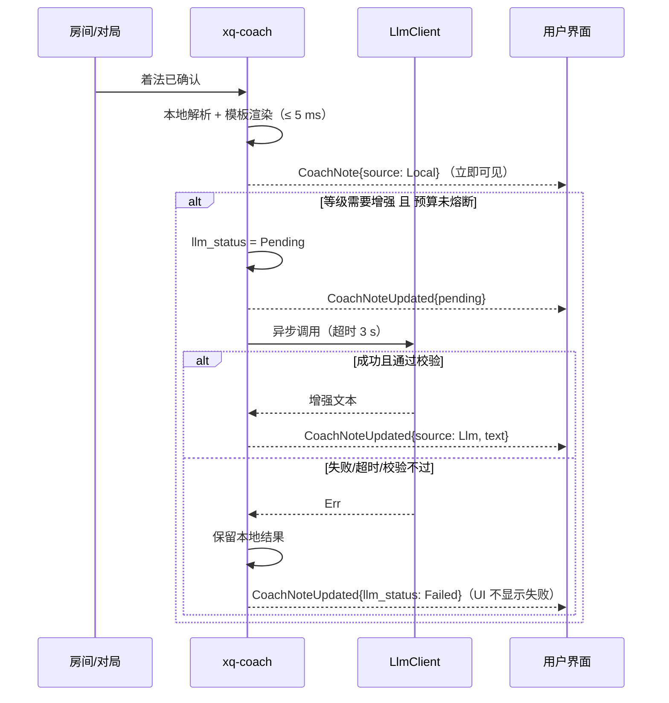

# 05 · 战法讲解引擎设计

| 项 | 值 |
|---|---|
| 所属 crate | `xq-coach` |
| 文档版本 | v1.0 |
| 状态 | 设计基线 |
| 编制日期 | 2026-09-23 |
| 前置阅读 | [ADR-004 讲解双层架构](14-决策记录ADR.md#adr-004) · [03-规则引擎](03-规则引擎与领域模型.md) · [04-AI引擎](04-AI引擎设计.md) |

> **这是产品的核心差异化模块。** 竞品的差距不在"能不能下棋"，而在"能不能教人下棋"。本模块的质量直接决定产品的定位是否成立。

---

## 1. 设计目标

| 目标 | 指标 |
|---|---|
| 覆盖率 | ≥ 95% 的着法能生成非空讲解（含开局、中局、残局全阶段） |
| 准确率 | 人工抽检 200 条，≥ 90% 无事实性错误 |
| 本地延迟 | ≤ 5 ms（不阻塞走棋路径） |
| 降级可用性 | LLM 完全不可用时功能不缺失，100% 降级到本地模板 |
| 幻觉率 | LLM 增强输出的事实错误率 ≤ 1%（经事实校验后应为 0） |
| 零 IO | 本体不依赖任何 IO crate，LLM 通过 trait 注入 |

---

## 2. 双层架构



**流程说明**：

1. **战术识别**：基于 `xq-core` 的局面语义，识别这一步构成了什么战术（将军、捉双、闷宫…）
2. **评价定级**：用 `xq-ai` 的 `root_moves` 评分，计算实际着法相对最优着法的分差，映射为等级
3. **模板渲染**：把战术标签 + 评分 + 局面上下文填充进模板，生成结构化讲解（**这条路径零延迟、离线可用**）
4. **LLM 增强**：把上面的结构化结果作为**事实锚点**交给 LLM 润色成自然语言（**异步、可失败、可降级**）

---

## 3. 战术模式识别

### 3.1 分类框架

按**可判定性**把战术分为三层，这是本模块最重要的设计取舍：

| 层 | 类型 | 判定方式 | 可靠性 |
|---|---|---|---|
| **L1 结构层** | 将军、吃子、兑子、弃子、解将、垫将、逃将、将死、困毙 | 由 `xq-core` 的局面语义**精确判定** | 100% 确定 |
| **L2 关系层** | 捉双、牵制、闪击、封锁、威胁 | 基于攻击关系与交换价值计算 | 高（可测试） |
| **L3 棋形层** | 卧槽马、马后炮、重炮、天地炮、铁门栓… | **声明式棋形库匹配**（外部 JSON 配置） | 取决于棋形定义质量 |

> **为什么要把 L3 做成外部配置而非硬编码**：这些命名杀法的坐标定义在不同资料中表述不一，且需要依据真实棋谱校准。做成 JSON 配置后，可以**在不改代码、不重新编译的前提下**修正棋形定义。同时这也让棋形库可以被测试单独覆盖。

### 3.2 L1 结构层模式（由 `xq-core` 直接提供）

| 模式 ID | 名称 | 判定条件 |
|---|---|---|
| `check` | 将军 | 走子后对方处于被将军状态 |
| `double_check` | 双将 | 走子后对方同时被两个及以上棋子将军 |
| `discovered_check` | 闪将 | 走子后，因该子移开而使另一子（原被阻挡）形成将军 |
| `capture` | 吃子 | 目标格有对方棋子 |
| `mate` | 绝杀 | 走子后对方被将死 |
| `stalemate_win` | 困毙 | 走子后对方无着可走（未被将军） |
| `resolve_check` | 解将 | 上一步己方被将军，本步解除 |
| `interpose` | 垫将 | 解将方式是把自己棋子放到将帅与攻击者之间 |
| `king_escape` | 避将 | 解将方式是将帅移动 |
| `capture_attacker` | 吃将子 | 解将方式是吃掉将军的棋子 |

### 3.3 L2 关系层模式

| 模式 ID | 名称 | 判定条件 |
|---|---|---|
| `fork` | 捉双 | 走子后，该子**同时威胁**对方 ≥ 2 个棋子（不含将帅），且这些棋子无法被一次性保全 |
| `pin` | 牵制 | 对方某棋子被攻击，且该棋子移动后会暴露更大的目标（车/将帅） |
| `discovered_attack` | 闪击 | 走子后，因该子移开使另一子形成**对非将帅棋子**的攻击 |
| `skewer` | 串打 | 攻击线上的前方棋子被迫移动，后方棋子随后被吃（与牵制相反） |
| `threat` | 威胁 | 走子后形成对对方棋子或关键点的**下一步威胁**（非即时攻击） |
| `blockade` | 封锁 | 走子后，使对方某棋子的机动性显著下降（可选着法数减少） |
| `exchange_offer` | 邀兑 | 主动提出等价交换的着法 |
| `sacrifice` | 弃子 | 主动送吃棋子，但换取实质补偿（杀势、攻势、位置） |
| `win_material` | 得子 | 该着法导致后续必然净赚子力（分差显著为正） |
| `lose_material` | 失子 | 该着法导致后续净损子力（分差显著为负） |
| `open_file` | 通线 | 走子后为车/炮打通了纵线 |
| `central_control` | 中路控制 | 走子后对中路关键点（特别是将帅前方）形成控制 |

**「捉双」的精确判定（实现基准）**：

```
1. 走子后，枚举该棋子（以及因它移开而活跃的棋子）能攻击到的对方棋子集合 T
2. 从 T 中排除将帅（那是"将"不是"捉"）
3. 对 T 中每个棋子 t，计算"吃掉 t 的交换损益" loss(t)
4. 若存在 ≥ 2 个不同的 t 使得 loss(t) > 0（即吃它有利），则判定为捉双
5. 置信度 = min(在 T 中损失最大的两个棋子之和 / 400, 1.0)
```

**交换损益的计算**（简化版 SEE）：

```
loss(t) = 被吃子价值(t) − 获得该格后己方子的预期损失
```

> 完整 SEE（静态交换评估）需要考虑连续吃子序列。首版采用**一层近似**（只考虑"吃它之后对方能否吃回来"），并用测试用例逐步收敛。宁可保守（少判"捉双"）也不要误判——误报会直接损害讲解的可信度。

### 3.4 L3 棋形层（声明式配置）

棋形库以**相对坐标 + 约束条件**的形式描述命名杀法。存放于 `assets/knowledge/tactics.json`。

**模式描述格式**：

```json
{
  "id": "horse_corner_check",
  "name": "挂角马",
  "category": "mate_pattern",
  "description": "马跳到对方九宫角上将军，配合其他子力形成杀势。",
  "pattern": {
    "attacker": { "kind": "horse", "relative_to": "enemy_palace" },
    "constraints": [
      { "type": "attacker_in_enemy_half" },
      { "type": "attacker_checks_king" },
      { "type": "attacker_adjacent_to_palace_corner", "distance": 1 }
    ]
  },
  "confidence_base": 0.75,
  "explanation_template": "horse_corner_check"
}
```

**约束类型（约束谓词库）**：

| 约束 | 参数 | 含义 |
|---|---|---|
| `attacker_checks_king` | — | 攻击者正在将军 |
| `attacker_in_enemy_half` | — | 攻击者位于对方半场 |
| `attacker_adjacent_to_palace_corner` | `distance` | 攻击者距对方九宫的某个角 ≤ N 格 |
| `same_file_as_king` | — | 与对方将帅同列 |
| `on_palace_rank` | `rank_offset` | 位于对方九宫的某条横线上 |
| `has_own_piece_as_screen` | `kind` | 存在己方某类棋子作为炮架 |
| `own_piece_count_on_file` | `kind`, `min` | 某一列上己方某类棋子数量 ≥ N |
| `enemy_king_escape_blocked` | `min` | 将帅至少 N 个逃路被堵（含被己方子堵） |
| `combined_with` | other tactic id | 与另一战术同时成立 |

> ⚠️ **待校准声明**：`assets/knowledge/tactics.json` 中的棋形坐标约束为**初始定义**，必须用真实棋谱样本校准后回写。校准方法：取含"挂角马""马后炮"等标注的棋谱，验证识别器命中率与误报率。**在校准完成前，这些棋形标签在 UI 上以较低优先级展示**（不与"将军""吃子"这类确定结论同等呈现）。

### 3.5 已知棋形库（初始条目集）

| 名称 | 类别 | 简述 |
|---|---|---|
| 马后炮 | 杀法 | 炮以马为炮架，马在炮前方将军 |
| 卧槽马 | 杀法 | 马深入对方底线侧翼将军 |
| 挂角马 | 杀法 | 马在对方九宫角将军 |
| 重炮 | 杀法 | 双炮在同一条线上叠置 |
| 天地炮 | 杀法 | 一炮中路、一炮底线协同 |
| 空头炮 | 杀法 | 中炮无阻挡直对将帅 |
| 铁门栓 | 杀法 | 中炮配车控制将门 |
| 二鬼拍门 | 杀法 | 双兵（或双车）逼近九宫 |
| 双车错 | 杀法 | 双车交替将军 |
| 海底捞月 | 杀法 | 车在将帅后方成杀 |
| 大刀剜心 | 杀法 | 弃车破士撕开防线 |
| 闷宫 | 杀法 | 将帅被己方棋子堵死退路 |
| 侧面虎 | 杀法 | 车马配合从侧翼成杀 |
| 三进兵 | 杀法 | 三兵协同推进 |
| 送佛归殿 | 杀法 | 以子力逼迫将帅上顶后成杀 |
| 中炮 | 开局 | 炮二平五类，直取中路 |
| 屏风马 | 开局 | 双马并立中路两侧，稳固防守 |
| 仙人指路 | 开局 | 兵七进一或兵三进一，试探性开局 |
| 飞相局 | 开局 | 相三进五，稳固型开局 |
| 过宫炮 | 开局 | 炮从一侧过宫到另一侧 |
| 士角炮 | 开局 | 炮至仕角 |
| 单提马 | 开局 | 一马正起、一马横起 |
| 反宫马 | 开局 | 对中炮的防守体系 |
| 顺炮 / 列炮 | 开局 | 双方同侧/异侧中炮对攻 |

> 上表共 **24 条**，其中杀法 15 条、开局 9 条，满足 [01-需求规格 FR-03.04](01-需求规格说明书.md) 要求的"模式库 ≥ 20 类"。开局类条目的战略意图文案见 §5。

---

## 4. 评价定级

### 4.1 定级依据

评价等级**完全基于客观的评分损失**，不引入主观判断：

```
score_loss = score_best − score_played
```

- `score_best`：`root_moves` 中最高分（引擎最优着法的评分），走子方视角
- `score_played`：实际着法的评分，走子方视角
- 二者均以厘兵为单位（1 兵 = 100）

> **为什么用 `root_moves` 而非重新搜索**：引擎在根节点已经评估了全部合法着法（见 [04-AI引擎 §9](04-AI引擎设计.md)），直接复用即可，无需额外搜索。这是把"评分全部根着法"作为引擎核心输出的直接收益。

### 4.2 等级映射

| 等级 | 枚举值 | 分差区间（厘兵） | UI 文案 | 色阶令牌 |
|---|---|---|---|---|
| 优 | `Best` | ≤ 10 | 「最佳着法」 | `coach.best` |
| 良 | `Good` | 10 < x ≤ 50 | 「不错」 | `coach.good` |
| 疑 | `Dubious` | 50 < x ≤ 150 | 「稍有问题」 | `coach.dubious` |
| 劣 | `Blunder` | 150 < x ≤ 400 | 「明显失误」 | `coach.blunder` |
| 漏 | `Missed` | > 400 或错失必胜 | 「严重漏着」 | `coach.missed` |

**特殊规则覆盖**：

| 情形 | 强制等级 | 理由 |
|---|---|---|
| 该着法造成将死 | `Best` | 无论分差如何 |
| 错失一步杀（最优着法是将死，实际未走） | `Missed` | 错失必胜 |
| 该着法直接送将（走完后自己被将军且无法解） | `Blunder` | — |
| 分差计算依赖的评分接近 0（均势局面） | 等级上限为 `Dubious` | 均势局面中 150 厘兵的"分差"实际影响有限，不应标为"明显失误" |

> ⚠️ **阈值必须回测校准**（FR-03.03 已声明）。校准方法见 §9.2。

### 4.3 色阶使用约束（来自素材校验结论）

`assets/tokens/colors.md` 的 WCAG 实算结论表明：`coach.best`(#27AE60) 在浅色底上对比度仅 **2.87:1**，`coach.dubious`(#F39C12) 仅 **2.19:1**，**均不满足文本对比度要求**。

**因此强制约束**：

1. 评价等级**不得仅用颜色传达**——必须同时有文字标签（「最佳着法」「稍有问题」）或图标；
2. 等级色仅用于**徽标底色/边框/左侧色条**，不作为正文文字颜色；
3. 徽标内的文字用**白色或深色**（依背景亮度选择），保证 ≥ 4.5:1；
4. 适配色觉障碍：五档等级配以**不同的图标形状**（如 ★ / ✓ / ? / ✕ / ‼），而非仅颜色差异。

---

## 5. 模板体系

### 5.1 模板结构

模板是**带占位符的文本片段**，按「战术类别 × 语体详细度」组织。

```json
{
  "check": {
    "headline": "{side}方{notation}，将军。",
    "detail": {
      "concise": "直接威胁将帅，逼迫对方应对。",
      "standard": "{piece_name}从中路发起攻势，对方必须立即解将，暂时失去主动权。",
      "verbose": "这一步将军打乱了对方的部署节奏。对方目前有三种应对方式：移将、垫子或吃掉进攻棋子。从局面看，{best_reply_hint}是最自然的应法。"
    }
  }
}
```

**语体详细度**（对应 FR-03.10，P2 功能）：

| 档位 | 篇幅 | 目标用户 |
|---|---|---|
| `concise` | 一句话 | 熟悉象棋的玩家 |
| `standard` | 2~3 句（**默认**） | 一般用户 |
| `verbose` | 含变化推演与教学说明 | 学习者 |

### 5.2 可用占位符

| 占位符 | 来源 | 示例值 |
|---|---|---|
| `{side}` | 走子方 | 红 / 黑 |
| `{notation}` | `xq-core::notation` | 炮二平五 |
| `{piece_name}` | 棋子类型 | 炮 / 马 / 车 |
| `{captured_piece}` | 被吃子 | 卒 |
| `{best_move_notation}` | 引擎最优着法 | 马八进七 |
| `{score_loss}` | 分差 | 180 |
| `{level_text}` | 等级文案 | 稍有问题 |
| `{opening_name}` | 开局库匹配 | 中炮对屏风马 |
| `{tactic_names}` | 战术标签 | 捉双、闪击 |
| `{best_reply_hint}` | 最优应法描述 | 起马保卒 |

> **占位符必须全部有值**。渲染前做**严格校验**：若任一必需占位符缺失，则放弃该模板并回退到更简单的通用模板。**绝不允许出现 `{xxx}` 原样输出到用户眼前**——这是必须由测试锁定的红线。

### 5.3 模板降级链

```
专用模板（精确战术 + 详细语体）
    ↓ 缺失
通用战术模板（战术类别级）
    ↓ 缺失
通用着法模板（按等级：最佳/不错/有问题/失误）
    ↓ 缺失
兜底模板（"红方炮二平五。"）
```

**覆盖率计算口径**：使用兜底模板的着法**不计入**覆盖率。因此"覆盖率 ≥ 95%"意味着 95% 的着法能命中前三级模板——这要求模板库足够丰富，是明确的工作量要求。

### 5.4 开局讲解

开局阶段（前 8 回合内）优先匹配**开局定式库**，讲解命名为开局并给出战略意图：

```json
{
  "name": "中炮对屏风马",
  "sequence_iccs": ["h2e2", "h9g7", "b0c2", "b9c7"],
  "max_ply": 16,
  "headline": "布局进入「中炮对屏风马」。",
  "idea_red": "中炮直取中路，配合双马快速出动，争取中路主动权。",
  "idea_black": "双马屏风固守中路，两翼均衡，后发制人。",
  "key_points": ["注意红方中炮的火力控制", "黑方需防红方车过河"],
  "tags": ["中炮", "屏风马", "主流布局"]
}
```

匹配方式：按 `sequence_iccs` 前缀匹配当前对局的着法序列，取**最长匹配**。

---

## 6. LLM 增强

### 6.1 抽象接口

`xq-coach` 本体不含 IO，LLM 通过 trait 注入（满足 [ADR-005](14-决策记录ADR.md#adr-005)）：

```rust
pub trait LlmClient: Send + Sync {
    fn complete(&self, req: LlmRequest) -> Result<LlmResponse, LlmError>;
}

pub struct LlmRequest {
    pub system_prompt: String,
    pub user_prompt: String,
    pub max_tokens: u32,
    pub temperature: f32,
    /// 硬超时（由实现方保证）
    pub timeout_ms: u64,
}

pub struct LlmResponse {
    pub text: String,
    /// 可选的 token 用量（用于预算统计）
    pub usage: Option<TokenUsage>,
}
```

**实现位置**：

| 端 | 实现 | 说明 |
|---|---|---|
| 服务端 | `xq-server::coach_svc::HttpLlmClient` | 带超时、重试、日预算熔断 |
| 客户端 | `xq-client::llm::HttpLlmClient` | 可选功能；若客户端不持有 API Key，则改为向**自己的服务端**请求增强 |

> **安全约束**：客户端**不得**内置 LLM 服务商的 API Key（违反 NFR-S.09）。客户端如需 LLM 增强，必须通过自己的服务端代理。

### 6.2 提示词设计（事实锚定）

**核心原则：LLM 只做语言润色，不做事实推理。**

```
System:
你是一位中国象棋教练。你的任务是把给定的局面分析结果改写成自然、易懂的中文点评。

严格约束：
1. 只能使用【分析结果】中提供的事实，不得添加任何未提供的棋子位置、着法或战法名称。
2. 不得改变评价等级与评分结论。
3. 不得编造变化推演。若【分析结果】中未给出后续变化，就不要推演后续。
4. 输出 2~3 句中文，不要使用列表、标题、Markdown 标记。
5. 不要重复"这步棋"等无信息量的开头。

User:
【局面】红方走子
【着法】炮二平五（红炮从 h2 至 e2）
【评价】最佳着法（分差 0 厘兵）
【战术】中炮（开局定式）
【开局】中炮对屏风马
【引擎分析】此着为当前最优。次优着法为马八进七（评分低 35 厘兵）。
【补充事实】该着法使红方在中路形成持续压力。

请改写为教练点评。
```

### 6.3 幻觉抑制的三道防线

| 防线 | 手段 | 处理 |
|---|---|---|
| **① 输入约束** | 只喂结构化事实，不喂原始棋盘 | 从源头杜绝"看错棋"的可能 |
| **② 输出事实校验** | 解析 LLM 输出，检查是否出现**未在输入中出现**的棋子坐标、着法名称、战法名称 | 校验不通过 → 丢弃输出 |
| **③ 长度与格式校验** | 字数区间、无 Markdown 标记、无异常字符 | 不通过 → 丢弃 |

**输出事实校验的具体实现**：

```
1. 从输入提取允许出现的实体集合 A = {着法名称, 棋子位置, 战法名, 开局名, 评分}
2. 用正则从输出中提取所有"疑似实体"（如记谱格式的字符串、坐标、战法名候选）
3. 对每个疑似实体 e：若 e ∉ A 且 e 不是通用词汇 → 判定为幻觉
4. 幻觉数量 > 0 → 丢弃
```

**丢弃后行为**：保留本地模板生成的讲解，`llm_status` 标记为 `Failed`，并记录日志用于优化提示词。**用户看到的仍是完整、正确的讲解**。

### 6.4 缓存与预算控制

| 机制 | 实现 |
|---|---|
| **局面级缓存** | 缓存键 = `(position_hash, move, level)` 的哈希；Redis（服务端）/ 内存 LRU（客户端）。相同局面复用讲解，命中率在中残局复盘中很高 |
| **日预算熔断** | 计数器（Redis `INCR` + 每日过期）；达到 `coach.llm_daily_budget` 后**全局关闭 LLM 路径**，仅用本地模板 |
| **单局限额** | 每局最多 N 次 LLM 调用（默认 20），避免单局耗尽预算 |
| **触发条件收窄** | **默认只对 `Dubious` / `Blunder` / `Missed` 三档调用 LLM**（这些才是用户最需要解读的），`Best` / `Good` 直接用本地模板。这能把 LLM 调用量降低到总步数的约 30~40% |
| **按需调用** | 用户可点击「详细讲解」主动请求 LLM 增强（P2） |

> 「只对失误调用 LLM」是一个**同时降低成本与提升价值**的设计：用户对"我走对了"不需要长篇解释，但对"我这步走坏了"极度需要说明。

### 6.5 异步时序



**UI 表现**：讲解卡片先出现本地版本（含等级徽标），若正在增强则显示一个轻微的打字机/加载指示；增强到达后**原地替换文本**，不重排布局，不打断用户。

---

## 7. 输出数据结构

```rust
/// 一条讲解记录 —— 对客户端与前端的主要契约
#[derive(Serialize, Deserialize, Clone, Debug)]
pub struct CoachNote {
    /// 第几着（从 1 开始，红先为 1）
    pub ply: u16,
    /// 走子方
    pub side: Color,
    /// ICCS 着法串，如 "h2e2"
    pub mv_iccs: String,
    /// 中文记谱，如 "炮二平五"
    pub notation: String,

    /// 评价等级
    pub level: MoveLevel,
    /// 分差（厘兵）
    pub score_loss: i32,
    /// 走子前评分（走子方视角）
    pub score_before: i32,
    /// 走子后评分（走子方视角）
    pub score_after: i32,

    /// 命中的战术标签
    pub tactics: Vec<TacticTag>,

    /// 一句话结论
    pub headline: String,
    /// 详细说明
    pub detail: String,
    /// 更优着法建议（当 level 不是 Best 时给出）
    pub suggestion: Option<String>,

    /// 生成来源
    pub source: NoteSource,
    /// LLM 增强状态
    pub llm_status: LlmStatus,

    /// 引擎推荐的主要变例（用于"推荐着法提示"）
    pub pv: Vec<String>,
}

#[derive(Serialize, Deserialize, Clone, Copy, Debug, PartialEq)]
pub enum MoveLevel { Best, Good, Dubious, Blunder, Missed }

#[derive(Serialize, Deserialize, Clone, Copy, Debug, PartialEq)]
pub enum NoteSource { Local, Llm }

#[derive(Serialize, Deserialize, Clone, Copy, Debug, PartialEq)]
pub enum LlmStatus { None, Pending, Enhanced, Failed }

#[derive(Serialize, Deserialize, Clone, Debug)]
pub struct TacticTag {
    /// 稳定标识，如 "fork"
    pub id: String,
    /// 中文名，如 "捉双"
    pub name: String,
    pub category: TacticCategory,
    /// 置信度 0.0~1.0
    pub confidence: f32,
}

#[derive(Serialize, Deserialize, Clone, Copy, Debug, PartialEq)]
pub enum TacticCategory {
    Structure,   // 结构层（确定）
    Relation,    // 关系层（高可信）
    Formation,   // 棋形层（需校准）
    Opening,     // 开局
}
```

> **`confidence` 字段的用途**：UI 按置信度分级展示——`Structure` 类正常展示；`Formation` 类置信度 < 0.7 时以较弱样式（灰色标签）展示，避免误导。这是对 §3.4 待校准声明的具体落实。

### 7.1 主入口 API

```rust
pub struct Coach {
    detector: TacticDetector,
    assessor: MoveAssessor,
    renderer: TemplateRenderer,
    knowledge: KnowledgeBase,   // 从 assets/knowledge/ 加载（构建期内嵌）
    llm: Option<Box<dyn LlmClient>>,
}

impl Coach {
    /// 生成讲解（同步，本地路径）
    pub fn analyze(
        &self,
        pos_before: &Position,
        mv: Move,
        search: &SearchResult,   // 来自 xq-ai，含 root_moves
        game_ctx: &GameContext,  // 着法历史、开局匹配、语体档位
    ) -> CoachNote;

    /// 请求 LLM 增强（异步，可失败）
    pub fn enhance(&self, note: &CoachNote, ctx: &GameContext)
        -> Result<CoachNote, CoachError>;
}
```

**调用契约**：`analyze` 必须**永不失败**（返回兜底讲解而非 `Result`）。这是为了保证对局流程不会因为讲解失败而中断——讲解是增强功能，绝不能成为单点故障。

---

## 8. 触发时机与调度

| 场景 | 触发 | LLM 增强 |
|---|---|---|
| 联网对局（本人走子） | 服务端裁决通过后立即 | ✅（按等级条件） |
| 联网对局（对方走子） | 收到 `MoveApplied` 后 | ✅（按等级条件） |
| 观战 | 收到延迟后的 `MoveApplied` 后 | ⚠️ 默认关闭（节省预算），用户可主动请求 |
| 人机对战 | 每次走子后（含 AI 走子） | ✅（本地/服务端代理） |
| 复盘分析 | 加载棋谱时**批量**生成 | ✅ 批量，可延迟、可取消 |

**性能约定**：

- 本地路径目标 ≤ 5 ms。战术识别与模板渲染都是纯计算，实测应远低于此值；主要成本在 `TacticDetector` 的攻击关系枚举上。
- 若某局面的战术识别超过 20 ms（异常），**跳过棋形层识别**，只输出结构层与关系层结论，保证不阻塞。

---

## 9. 测试与质量保障

### 9.1 单元测试

| 测试 | 方法 |
|---|---|
| 占位符完整性 | 遍历模板库所有模板，断言渲染后**不含 `{` 或 `}` 残留** |
| 降级链正确性 | 构造缺失模板的场景，验证正确回退 |
| 评价定级边界 | 对分差 9/10/11、49/50/51、149/150/151、399/400/401 逐一验证 |
| 战术识别 | 每个战术模式 ≥ 3 个正例 + 3 个反例 |
| 不失败保证 | 用随机局面 + 随机着法调用 `analyze` 10000 次，断言**永不 panic** |
| 输出校验 | 构造含幻觉的模拟 LLM 响应，验证被正确拦截 |

> 「`analyze` 永不失败」是必须被测试锁定的契约。实现中任何 `unwrap()` 都是潜在的对局中断风险。

### 9.2 评价阈值回测校准

[01-需求规格 §4.3](01-需求规格说明书.md) 声明阈值需要回测校准，方法如下：

1. **构建样本集**：用 L4 引擎自对弈生成 200 局棋谱（约 32,000 着），全部记录 `root_moves` 评分。
2. **统计分差分布**：绘制分差的分布直方图。
3. **确定分位点**：按"符合人类直觉的比例"设定阈值——行业内经验值是 `Best` 约占 60~70%、`Good` 约 15~20%、`Dubious` 约 8~12%、`Blunder` 约 3~6%、`Missed` < 1%。
4. **人工抽检验证**：从每档随机抽 50 条，人工判断"这个等级标注是否合理"，标注一致率需 ≥ 85%。
5. **迭代修订**：调整阈值直至人工一致率达标，把最终阈值回写本文档与 `01-需求规格说明书.md`。

> 上述"行业经验值"为**待验证的假设**，必须用第 2~4 步的实际统计替换，不得直接作为设计依据。

### 9.3 人工质量评估

| 维度 | 评估方法 | 达标线 |
|---|---|---|
| 事实准确性 | 抽检 200 条讲解，标注事实错误 | ≥ 90% 无错误 |
| 语言自然度 | 5 分制主观评分 | 平均 ≥ 3.5 |
| 有用性 | 用户调研："这个讲解对你有帮助吗" | ≥ 70% 正面 |
| 覆盖率 | 统计 1000 局棋谱的兜底模板占比 | 兜底率 ≤ 5% |
| 战术准确率 | 对有明确战术的着法，验证识别结果 | ≥ 85% |

### 9.4 素材校验

`assets/knowledge/` 下的 JSON 文件在**构建期**做 schema 校验（CI 中执行）：

- 所有 `id` 唯一
- 所有模板的占位符都在允许列表中
- 所有 `explanation_template` 引用的模板都存在
- 所有棋形约束用到的谓词都在谓词库中

**构建期校验的意义**：把"配置错误"从运行时的静默降级，提前到编译期的硬失败。这比事后在日志里找问题高效得多。

---

## 10. 素材清单（`assets/knowledge/`）

| 文件 | 内容 | 规模目标 |
|---|---|---|
| `tactics.json` | 战术模式库（L2 关系层 + L3 棋形层） | ≥ 24 条 |
| `coach-templates.json` | 讲解模板（战术 × 语体） | ≥ 120 条模板 |
| `openings.json` | 开局定式（含战略意图文案） | ≥ 200 条 |
| `predicates.json` | 棋形约束谓词定义（供校验与文档生成） | ≥ 15 个 |

> 素材文件在首次编码前先建立**结构完整的样例集**（每类若干条），并在实现过程中持续扩充。

---

## 11. 实现顺序

| 阶段 | 内容 | 完成标志 |
|---|---|---|
| **C1** | 结构层（L1）识别 + 基础模板 + 评价定级 | 每步能输出"炮二平五，最佳着法"级别的讲解 |
| **C2** | 关系层（L2）识别（捉双、牵制、闪击） | 能识别基本战术 |
| **C3** | 棋形层（L3）+ 棋形库 | 能识别命名杀法 |
| **C4** | 模板库扩充 + 降级链 + 覆盖率达标 | 覆盖率 ≥ 95% |
| **C5** | LLM 增强 + 校验 + 缓存 + 预算 | 增强可用且可降级 |
| **C6** | 阈值回测校准 + 人工质量评估 | 通过 §9.3 全部达标线 |

> **C1 即可交付可用的讲解功能**。这是刻意的排序——先让核心价值成立，再做锦上添花。

---

## 12. 实现回写（2026-09-23 · M1 首版）

本节记录 `xq-coach` 首版实现与本设计文档之间的**实测结果与偏差清单**。
凡与上文不一致处，以本节为准。

### 12.1 已实现范围

| 阶段 | 内容 | 状态 |
|---|---|---|
| C1 | L1 结构层（10 条）+ 基础模板 + 评价定级 | ✅ |
| C2 | L2 关系层（12 条中 11 条可用） | ✅ 见 §12.3 |
| C3 | L3 棋形层（13 条）+ 29 个谓词 | ✅ 坐标约束按素材原样执行 |
| C4 | 模板库 + 降级链（4 级） | ✅ 兜底链完整，有红线测试锁定 |
| C5 | LLM 接口 + 三道校验 | ✅ 只做**接口与校验**，实际 HTTP 实现属 `xq-server`/`xq-client` |
| C6 | 阈值回测校准 | ⬜ 未做，见 §12.5 |

开场白的开局识别分两条路：

1. **单步识别**（本步的几何特征）：中炮 / 过宫炮 / 士角炮 / 仙人指路 / 飞相局 ——
   用户走第一步就能看到反馈；
2. **序列匹配**（`openings.json` 前缀最长匹配）：屏风马 / 反宫马 / 单提马 / 顺炮 / 列炮
   这类**需要同时知道双方着法**的定式。

开局名会**反向映射**到知识库里的开局战术 id（如「中炮对屏风马」→ `opening_central_cannon`），
这样能命中它的专用模板，而不是落到「按等级」的通用模板。

### 12.2 实测结果

| 指标 | 实测 | 设计目标 | 结论 |
|---|---|---|---|
| 「第一步 炮二平五」的讲解 | 命中 `tpl.opening_central_cannon`，**非兜底** | — | ✅ |
| 初始局面 44 步的讲解 | 全部非空、无占位符残留 | 覆盖率 ≥ 95% | ✅ |
| 300 步随机对局 | `analyze` 无 panic、无占位符残留 | 永不失败 | ✅ |
| 单元测试 | 47 + 1 doctest | — | ✅ |

> 上面「44 步全覆盖」是**初始局面**这一批的覆盖率，不等于全阶段覆盖率。
> 全阶段覆盖率需要用 1000 局棋谱统计兜底模板占比（§9.3），尚未做。

### 12.3 与设计文档的偏差清单

| # | 偏差 | 理由 |
|---|---|---|
| 1 | **炮的「牵制」不判定**，只对车判 | 炮吃子依赖炮架：前方棋子移开后炮架可能同时消失，「被牵制」的结论根本不成立。见 §12.4 的实测误报 |
| 2 | `blockade`（封锁）未实现 | 需要比较走子前后对方**全部**棋子的机动性，代价高而收益低 |
| 3 | `attacker_checks_king_within_n_plies` 只判 1 步 | 多步推演需要再搜一层，与「≤ 5 ms」的本地延迟目标冲突。**宁可少判也不误判** |
| 4 | 完整 SEE 用一层近似 | 这是 §3.3 自己声明的首版策略，已按该声明执行 |
| 5 | 棋形结果**不直接采信**为确定结论 | 素材仍是 `initial` 状态。实现里通过 `TacticTag::is_low_confidence()`（棋形层且置信度 < 0.7）让 UI 走弱样式；`KnowledgeBase::is_initial` 也把这一状态暴露给调用方 |
| 6 | LLM 只实现接口与校验，不含 HTTP 实现 | 按 §6.1 的分工，`HttpLlmClient` 属于 `xq-server` / `xq-client`。本 crate 保持零 IO |

### 12.4 一次真实的误报治理（值得记录）

首版实现跑通后，第一步「炮二平五」的讲解里出现了 5 个战术标签：

```
中炮(opening, 0.95) · 闪击(relation, 0.66) · 牵制(relation, 0.64) · 威胁(relation, 0.59) · 中路控制(relation, 0.50)
```

其中**「闪击」与「牵制」是误报**，而且成因很典型：

**「闪击」误报**：实现只比较「走子前后是否有新出现的攻击」。任何新攻击都被算成闪击 ——
但闪击的严格定义是「本步棋子**原本挡在**某条线上，移开后才让另一枚棋子的攻击成立」。
修法是额外要求**走子前的位置必须落在那条线上、且位于攻击者与目标之间**。

**「牵制」误报**：炮的牵制判定漏了一个前提 —— 炮吃子依赖炮架。e2 炮确实攻击 e6 卒
（炮架是 e3 红兵），e6 后面也确实是黑将，但**那个卒随时可以走**：它一走，炮架关系
就断了，根本不存在「被牵制」。修法是**只对车判定牵制**。

> 教训：**L2 关系层的每个模式都要先把「成立的充分条件」想清楚，再写代码。**
> 用「结果看起来像」反推条件是误报的温床。而误报的代价比漏报高得多 ——
> 漏报只是少一条讲解，误报会让用户对整个讲解能力失去信任。

另外两个标签经核查**是真的**：e2 炮确实攻击 e6 卒（炮架 e3），且该卒无保护 ——
所以「威胁」成立；中路控制也成立。它们没有误报，只是置信度低、在排序上让位于「中炮」，
而模板取的是最高置信度那条，所以用户看到的界面不受影响。

### 12.5 尚未完成（明确声明）

| 项 | 说明 |
|---|---|
| 评价阈值回测校准（§9.2） | 当前 10 / 50 / 150 / 400 是**设计初始值**。需要 200 局自对弈的分差分布统计 + 人工抽检，尚未做 |
| 棋形坐标约束校准（§3.4） | `tactics.json` 的 13 条棋形仍是初始定义，必须用真实棋谱验证命中率与误报率 |
| 全阶段覆盖率统计（§9.3） | 需要用 1000 局棋谱统计兜底模板占比 |
| 人工质量评估（§9.3） | 需要人工抽检 200 条 |
| `xq-coach` 与前端联调后的真实延迟 | 本地路径含「摘子重查攻击关系」，实测需在真实对局里采样。当前设计上远低于 5 ms 目标，但**未实测** |

### 12.6 首次标定的实测结果（2026-09-23）

标定工具：`cargo run --release -p xq-coach --example calibrate -- <局数> <engine|random|mixed>`

做法：弱档引擎或随机策略扮演「玩家」，深度 6 的完整搜索扮演「裁判」，
逐着记录 `分差 = 裁判最优分 − 实际着法分`。

**采样量**：6 局 / 360 个样本（`engine` 玩家）+ 4 局 / 240 个样本（`random` 玩家）。

| 等级 | 实测（engine 玩家） | 实测（random 玩家） | §9.2 的预期区间 |
|---|---|---|---|
| 最佳 Best | **90.0%** | **89.6%** | 60~70% |
| 不错 Good | 3.3% | 3.3% | 15~20% |
| 稍有问题 Dubious | 3.3% | 4.6% | 8~12% |
| 明显失误 Blunder | 1.7% | 0.8% | 3~6% |
| 严重漏着 Missed | 1.7% | 1.7% | 0~1% |

**结论：现行阈值错了，而且不是「调一调数字」能解决的。**

关键数据是分差分布的**形状**：

```
= 0（与最优并列）   86.7%   ████████████████████████████████████████
1 ~ 10             3.3%   █
11 ~ 50            3.3%   █
51 ~ 150           3.3%   █
151 ~ 400          1.7%
> 400              1.7%
```

**根因（已实测确认）**：初始局面下，引擎给出的 **44 个着法里前 10 名的评分完全相同**（都是 +10）。
也就是说 —— **「分差」这个信号在开局几乎没有分辨率**：绝大多数着法本来就并列最优，
所以无论玩家水平如何，`分差 ≤ 10` 这个桶都会吃掉约 90% 的样本。

换玩家模型（`engine` → `random`）几乎不改变这个比例，正好证明了这一点：
问题不在玩家，在**评分信号本身**。

> ⚠️ 这也说明 §9.2 提出的标定方法本身有一个假设不成立：
> 它假设「分差」能区分着法质量，从而可以按分位点定阈值。
> 但如果九成样本的分差都是 0，分位点就退化成「全是 0」——
> **任何非零阈值都会把 90% 的着法判成「最佳」**。

**下一步要试的三条路**（按可行性排序）：

1. **改用引擎的着法排名而非分差**：把「最佳」定义为「引擎排序里的第一选择」，
   而不是「分差 ≤ 10」。这能立刻恢复分辨率，但会牺牲「同样好的棋」的容错；
2. **提高裁判深度**：当前用深度 6 评判，开局阶段的差异可能还没显现。
   需要实测「深度 6 / 10 / 14 下同一局面的评分分散度」，看分辨率随深度是否回升；
3. **改成分布相对定级**：不设固定阈值，而是按当局分差的中位数/分位点定级。
   代价是可解释性下降（同一个分差在不同局面可能得到不同等级）。

> **本次标定最大的价值不是得到一组新阈值，而是发现「阈值」这个形式本身可能不适用。**
> 这正是标定的意义 —— 它把设计文档里「看起来合理」的假设，变成能被数据推翻的命题。
> 在选定新方案并完成足够样本量的标定（§9.2 要求 200 局 / 约 32000 着）之前，
> **UI 上不应宣称评价等级「准确」**。
