# 06 · 联网对战与实时通信协议

| 项 | 值 |
|---|---|
| 所属模块 | `xq-protocol`（契约）· `xq-server::ws/`（服务端实现）· `xq-server::room/`（房间状态机）· `xq-client::net.rs`（客户端实现） |
| 文档版本 | v1.0 |
| 状态 | 设计基线 |
| 编制日期 | 2026-09-23 |
| 关联文档 | [01-需求规格](01-需求规格说明书.md) · [02-系统架构](02-系统架构设计.md) · [03-规则引擎](03-规则引擎与领域模型.md) · [05-战法讲解](05-战法讲解引擎设计.md) · [07-匹配排行榜](07-匹配排行榜与反作弊.md) · [14-ADR](14-决策记录ADR.md) |

> **本文是联网对战的唯一契约。** `ClientFrame` / `ServerFrame` 定义在 `xq-protocol`，服务端与客户端各引用同一份 crate，任何一端改动协议类型，另一端在**编译期**即可发现（[02-系统架构](02-系统架构设计.md) 不变量 I-2）。
>
> **阅读约定**：文中所有秒数/次数/阈值若标注「设计初始值，待实测/校准」，表示该数字为架构阶段的合理推测，**尚未经真实流量或对局数据验证**，实现阶段必须按标注的校准方式替换为实测值。

---

## 1. 协议总览

### 1.1 设计目标

| 目标 | 达成手段 |
|---|---|
| 单一契约 | 帧类型只定义一次（`xq-protocol`），双端编译期校验 |
| 手感优先 | 客户端乐观更新 + 服务端权威裁决（[ADR-003](14-决策记录ADR.md#adr-003)），走棋不等确认 |
| 可调试 | JSON 明文帧，抓包直接可读（[ADR-007](14-决策记录ADR.md#adr-007)） |
| 可靠恢复 | 全量快照 + 增量补帧，断线 30 秒内重连成功率 ≥ 99.9%（NFR-R.02） |
| 前向兼容 | 未知帧类型与未知字段必须被优雅忽略，服务端可先行上线 |
| 权威唯一 | 着法、时钟、观战延迟三处均由服务端裁决，客户端不参与判定 |

### 1.2 传输层

| 项 | 取值 | 说明 |
|---|---|---|
| 协议 | WebSocket（RFC 6455），`wss://` | 生产环境强制 TLS，禁止明文 `ws://` |
| 升级路径 | `GET /ws`（HTTP/1.1 Upgrade） | 与 REST 同域同端口，便于 Nginx / Caddy 透传 |
| 底层实现 | 服务端：`axum 0.8.9`（`ws` feature，基于 tungstenite）；客户端：`tokio-tungstenite 0.30.0` | 版本见 [README §3.2](../README.md) |
| 子协议 | 不使用 `Sec-WebSocket-Protocol` | 版本协商走应用层帧（见 §1.5），避免中间设备干扰 |
| 单连接会话数 | 1 连接 = 1 会话 = 1 玩家 | 同一账号新连接建立时，旧连接收到 `SESS005` 并被关闭（见 §2.5） |
| 最大帧体积 | 64 KiB（入站） | 超出则回 `SESS006` 并关闭；`ServerFrame` 中最大的是 `SessionResumed` 的全量快照，按 300 步/局 + 300 条讲解估算 ≈ 180 KiB → **快照分段下发**（见 §6.4） |

> **最大帧体积的依据**：单步 `MoveApplied` ≈ 180~260 B（[ADR-007](14-决策记录ADR.md#adr-007) 实算），但 `SessionResumed` 需携带完整着法历史与讲解历史。300 步 × 220 B ≈ 66 KB，300 条讲解 × 400 B ≈ 120 KB，合计约 186 KB，**超过 64 KiB 上限**。因此快照帧必须分段（`SessionResumed` → `SnapshotChunk × N` → `SnapshotComplete`），这是协议层面必须预留的设计，而不是事后补救。

### 1.3 编码格式

| 项 | 取值 | 依据 |
|---|---|---|
| 编码 | JSON UTF-8（`serde_json`） | [ADR-007](14-决策记录ADR.md#adr-007)：带宽 75 KB/s 量级，JSON 开销非瓶颈，可调试性收益更大 |
| 默认压缩 | 关闭 | 帧体积小，`permessage-deflate` 的 CPU 成本高于收益 |
| 预留扩展 | 信封含 `enc` 字段，取值 `"json"`（当前唯一值） | 未来切换 MessagePack/Protobuf 时无需改帧定义，仅改编解码层与 `enc` |
| 大整数 | 所有 ID 用字符串（UUID v7 的 `to_string()`） | 规避 JS `Number` 53 位精度问题（[ADR-007](14-决策记录ADR.md#adr-007) 权衡项） |
| 时间戳 | `u64`，Unix 毫秒 | 与 `ClockSync` 统一单位 |
| 枚举值 | `snake_case` 字符串 | 可读性优先 |

### 1.4 版本号与协商

协议携带**两个独立版本号**，二者含义不同、升级节奏不同：

| 版本号 | 字段 | 语义 | 不匹配的后果 |
|---|---|---|---|
| 协议版本 | `protocol_version: u16` | 帧结构、字段语义、错误码集合 | 不兼容则拒绝提供服务（`SESS003`） |
| 规则版本 | `rules_version: String` | `xq-core` 的规则实现版本（含记谱、禁手判定表） | 不匹配则**拒绝**该客户端创建/加入**计分对局**（`SESS004`），但仍允许观战与不计分房间 |

> **为什么规则版本要单独协商**：两端共享同一份 `xq-core`（[ADR-005](14-决策记录ADR.md#adr-005)），但客户端可能停留在旧版本未更新。若规则版本不一致，"客户端判合法、服务端判非法"会频繁触发回滚（[ADR-003](14-决策记录ADR.md#adr-003) 权衡项），手感急剧恶化。因此必须在开局前拒绝，而不是靠运行期回滚兜底。

**协商时序**（必须在任何业务帧之前完成）：

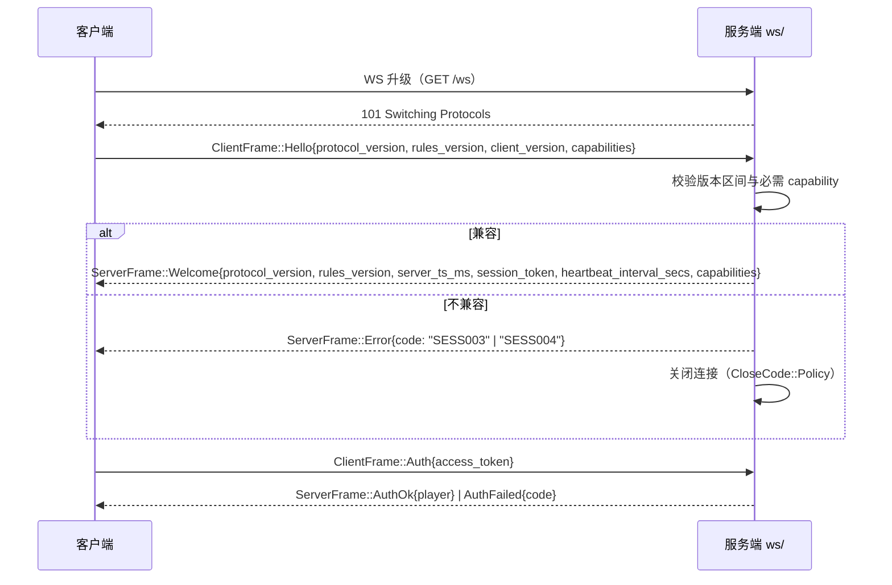

**兼容判定规则**：

| 情形 | 判定 | 理由 |
|---|---|---|
| `client.protocol_version == server.protocol_version` | 接受 | 完全一致 |
| `client.protocol_version` 与 `server` 仅在**次版本位**不同且落在服务端支持区间 | 接受 | 服务端维护 `SUPPORTED_PROTOCOL_RANGE: RangeInclusive<u16>` |
| 客户端版本 > 服务端版本 | 拒绝 `SESS003` | 服务端无法理解未来帧语义，不能假装兼容 |
| 客户端版本 < 服务端支持的**最小**版本 | 拒绝 `SESS003` | 客户端缺少服务端依赖的新字段语义 |

> **版本号编码约定（设计初始值，待实测/校准）**：`protocol_version = MAJOR * 100 + MINOR`，例如 `100` 表示 v1.0。仅当发生**破坏性变更**时递增 `MAJOR`；新增帧类型、新增可选字段属于**向后兼容变更**，只递增 `MINOR`，服务端 `SUPPORTED_PROTOCOL_RANGE` 同步放宽下界。这样绝大多数迭代不需要拒绝旧客户端。

```rust
// crates/xq-protocol/src/version.rs
/// 当前协议的完全版本（MAJOR * 100 + MINOR）。
pub const PROTOCOL_VERSION: u16 = 100;

/// 服务端可接受的最低协议版本。每次向后兼容演进后按需放宽。
pub const MIN_SUPPORTED_PROTOCOL_VERSION: u16 = 100;

/// 规则版本随 xq-core 的裁决语义变更而递增（记谱、禁手表、终局判定等）。
pub const RULES_VERSION: &str = "xq-core-2026.09.1";
```

### 1.5 帧信封

所有帧共用一层信封。信封字段与帧负载**平铺在同一 JSON 对象**中（`#[serde(flatten)]`），保证抓包可读性与帧定义的紧凑性。

```rust
// crates/xq-protocol/src/envelope.rs
use serde::{Deserialize, Serialize};

use crate::{ClientFrame, ServerFrame};

/// 客户端 → 服务端信封。
#[derive(Debug, Clone, Serialize, Deserialize)]
pub struct ClientEnvelope {
    /// 协议版本。冗余于 Hello，便于在无状态代理处直接路由/统计。
    pub v: u16,
    /// 可选编码模式，当前仅 "json"。
    #[serde(default = "default_encoding", skip_serializing_if = "is_default_encoding")]
    pub enc: String,
    /// 请求序号，仅用于「请求-应答」型帧的关联（如悔棋应答）。
    /// 通知型帧（走子、聊天）留空。
    #[serde(default, skip_serializing_if = "Option::is_none")]
    pub rid: Option<String>,
    #[serde(flatten)]
    pub frame: ClientFrame,
}

/// 服务端 → 客户端信封。
#[derive(Debug, Clone, Serialize, Deserialize)]
pub struct ServerEnvelope {
    pub v: u16,
    #[serde(default = "default_encoding", skip_serializing_if = "is_default_encoding")]
    pub enc: String,
    /// 服务端应答关联到的客户端 rid（有则回填）。
    #[serde(default, skip_serializing_if = "Option::is_none")]
    pub rid: Option<String>,
    #[serde(flatten)]
    pub frame: ServerFrame,
}

pub fn default_encoding() -> String {
    "json".to_owned()
}

pub fn is_default_encoding(s: &str) -> bool {
    s == "json"
}
```

| 字段 | 类型 | 必填 | 说明 |
|---|---|---|---|
| `v` | `u16` | 是 | 协议版本，取值见 §1.4 |
| `enc` | `string` | 否 | 编码模式，缺省 `"json"`；未知值必须回退到 `"json"` 而非报错 |
| `rid` | `string` | 否 | 请求关联 ID（客户端生成，建议 UUID v7 字符串）；仅请求-应答型帧使用 |
| `type` | `string` | 是 | 帧判别标签，由 `#[serde(tag = "type")]` 注入，见 §3 |
| 其余字段 | — | — | 各帧自身的负载字段 |

**JSON 示例（信封 + 走子帧平铺）**：

```json
{
  "v": 100,
  "type": "move_request",
  "client_move_no": 42,
  "mv": { "from": "h2", "to": "e2" },
  "client_ts_ms": 1784678400123,
  "expected_side": "red"
}
```

> **注意**：信封的 `#[serde(flatten)]` 与枚举的 `#[serde(tag = "type")]` 组合使用，会禁用 `deny_unknown_fields`——这正是我们期望的行为（见 §13 前向兼容），**不要**为了"严格校验"而改为不透明结构，那会牺牲兼容性。

---

## 2. 连接生命周期

### 2.1 生命周期状态机

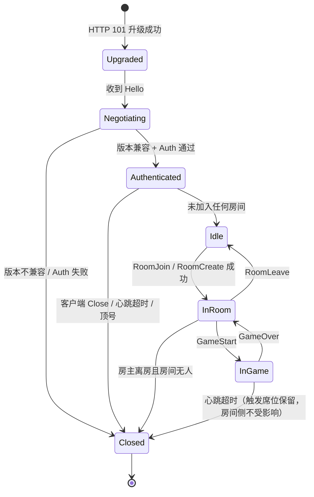

| 状态 | 允许的入站帧 | 禁止时的错误码 |
|---|---|---|
| `Upgraded` | 仅 `Hello` | `SESS007`（帧格式非法）或 `SESS003` |
| `Negotiating` | 仅 `Auth` | `AUTH001` |
| `Authenticated` | `Heartbeat`、`RoomCreate`、`RoomJoin`、`MatchEnqueue`、`SpectateSubscribe`、`ProfileGet` | `ROOM005`（已在其他房间）/ 其余按帧定义 |
| `InRoom` | 上述 + `RoomReady`、`RoomLeave`、`Chat` | `GAME006`（对局尚未开始）等 |
| `InGame` | 上述 + `MoveRequest`、`UndoRequest`、`DrawOffer`、`Resign`、`ClockPing` | `GAME006` / `ROOM003` |

> **状态与房间状态机是两层**：本节是**连接**（会话）层的生命周期，管理的是 WS 连接与鉴权；[§4](#4-房间状态机)是**房间**（对局）层的生命周期。一个连接可以在多个房间之间迁移，而房间不关心连接的身份细节——只认 `player_id`。两层严格分离，避免"连接断了"与"玩家走了"被混为一谈。

### 2.2 心跳与保活参数

采用**双层心跳**：传输层原生控制帧负责探测链路存活，应用层帧负责估计 RTT 与时钟偏移。两者的分工不可混淆。

| 参数 | 取值 | 层 | 依据 |
|---|---|---|---|
| 原生化 `Ping` 间隔 | **15 s** | 传输层 | 必须远小于常见中间设备空闲断连阈值（Nginx `proxy_read_timeout` 默认 60 s，云 LB 常见 60~300 s）。15 s 保证 60 s 阈值内至少有 3 次心跳存活证据 |
| 原生 `Pong` 应答 | 收到即回，无延迟 | 传输层 | tungstenite 在读循环中自动排队回复；**实现时必须写测试锁定**该行为，不得假设 |
| 失联判定超时 | **45 s** | 传输层 | `3 × Ping 间隔`。容忍连续 2 个周期完全丢包（RTT 尖峰、瞬时拥塞、进程调度卡顿），第 3 个周期未收到**任何**入站帧或控制帧即判失联 |
| 应用层 `Heartbeat` 间隔 | **30 s** | 应用层 | 仅用于 RTT 与时钟偏移估计，频率要求低；30 s 的估计精度已足够支撑 §7 的插值显示 |
| `HeartbeatAck` 超时（客户端侧） | **10 s** | 应用层 | 客户端据此判定"应用层无响应"，触发主动重连；不影响服务端的失联判定 |
| 心跳帧体积 | < 80 B | — | 5000 连接 × 2 帧 / 15 s ≈ 667 帧/s ≈ 53 KB/s，与走棋流量同量级但绝对量极小，可接受（实算见下） |

> **为什么心跳开销不能忽略（诚实说明）**：5000 连接在 15 s 间隔下产生的帧速率约 667 帧/s，**高于**走棋帧速率（2500 局 / 10 s = 250 帧/s）。这是选择 15 s 而非 5 s 的直接原因——5 s 间隔会带来 2000 帧/s 的心跳开销，是业务帧的 8 倍。心跳帧虽然极轻（无业务处理、无锁竞争），但不应让纯保活流量主导帧计数指标。
>
> **待校准项**：45 s 失联阈值、15 s 间隔均属**设计初始值，待实测/校准**——需在真实弱网（移动热点、跨境链路）样本上统计"连续丢包周期数分布"后定档。若线上误判率偏高，优先调大失联阈值而非调小心跳间隔。

### 2.3 心跳帧流程

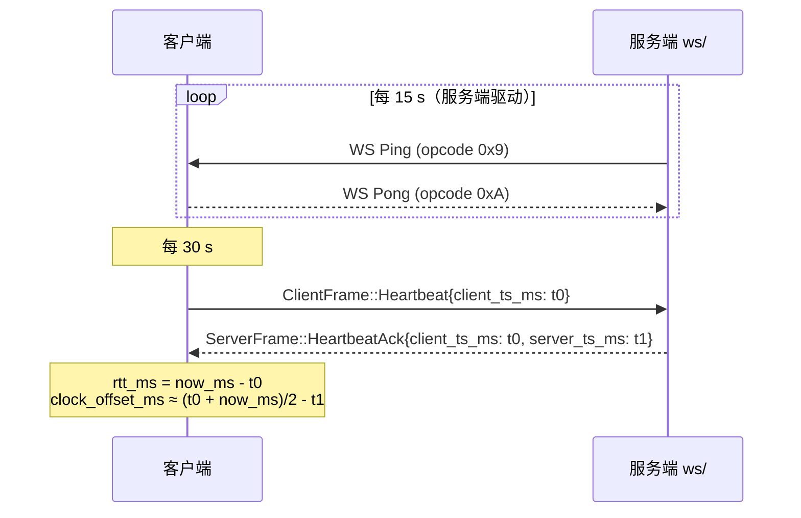

**幂等性**：心跳帧**无副作用、无序号**，允许乱序、允许重复、允许丢失（丢失由下一个周期自然补偿）。这是刻意的——保活机制不该引入状态机复杂度。

### 2.4 优雅关闭

| 触发方 | 帧/动作 | 服务端行为 |
|---|---|---|
| 客户端主动 | `Close` 控制帧 + `CloseCode::Normal` | 立即释放会话；若在房间内，视为 `RoomLeave`（对局中则走席位保留，见 §6） |
| 服务端主动（业务） | `ServerFrame::Error` → `Close` + `CloseCode::Policy` | 先下发错误帧并 `flush`，再关闭 |
| 服务端主动（顶号） | `Error{code: "SESS005"}` → `Close` + `CloseCode::Policy` | 旧连接先收到 `SESS005`，客户端应提示"账号在其他设备登录" |
| 服务端主动（心跳超时） | 无提示帧，直接 `Close` + `CloseCode::GoingAway` | 房间侧进入 `Paused`，启动 120 s 席位保留 |
| 服务端停机 | `Close` + `CloseCode::Restart` | 客户端应立即（而非按退避）重连，见 §6.2 退避表脚注 |

| 关闭码 | 取值 | 含义 |
|---|---|---|
| `Code::Normal` | 1000 | 正常关闭 |
| `Code::GoingAway` | 1001 | 心跳超时 / 服务重启 |
| `Code::Policy` | 1008 | 鉴权失败、版本不兼容、顶号、越权操作 |
| `Code::MessageTooBig` | 1009 | 入站帧 > 64 KiB |
| `Code::InternalError` | 1011 | 服务端内部异常 |

### 2.5 会话令牌与顶号

| 项 | 设计 |
|---|---|
| `session_token` 颁发 | `Welcome` 帧下发，绑定当前连接与 `player_id`，**与 REST 的 access token 不同**（后者是 JWT，无状态；前者是会话态，存 Redis） |
| 存储 | Redis `xq:sess:{session_token}` → `{player_id, conn_id, room_id?, issued_at_ms}`，TTL = 席位保留时长 + 60 s 余量 |
| 用途 | ① `Resume` 重连时验证身份；② 顶号判定（同一 `player_id` 已有活跃 `conn_id` 时，新连接取胜并踢旧连接） |
| 顶号判定 | `SET xq:sess:active:{player_id} {conn_id} NX EX <ttl>` —— 采用 `EX` 覆盖式写入并比较 `conn_id`，不采用"拒绝新连接"策略 |
| 为什么允许顶号 | 用户换设备/客户端崩溃后残留连接是常态，拒绝新连接会把用户锁在坏状态里。旧连接收到 `SESS005` 后由客户端提示，是更好的产品行为 |

---
## 3. 帧定义

### 3.1 公共 DTO 与坐标约定

所有帧的坐标字段一律使用 **ICCS 字符串**（[ADR-013](14-决策记录ADR.md#adr-013)），不用 `xq-core` 的 16 位 `Move` 编码——后者是人类不可读的整数，会让抓包与日志失去意义。

```rust
// crates/xq-protocol/src/convert.rs
/// ICCS 列字母表：col 0..8 ↔ 'a'..'i'。
const FILES: [char; 9] = ['a', 'b', 'c', 'd', 'e', 'f', 'g', 'h', 'i'];

/// 格子索引（row * 9 + col，见 03 文档 §3.1）→ ICCS 字符串，如 7 → "h0"。
pub fn square_to_iccs(sq: u8) -> String {
    let col = (sq as usize) % 9;
    let row = (sq as usize) / 9;
    format!("{}{}", FILES[col], row)
}

/// ICCS 字符串 → 格子索引。非法输入返回 None，由调用方映射为 GAME004。
pub fn iccs_to_square(s: &str) -> Option<u8> {
    let mut chars = s.chars();
    let col = FILES.iter().position(|c| *c == chars.next()?)?;
    let row = chars.next()?.to_digit(10)? as usize;
    if chars.next().is_some() {
        return None; // 多于两个字符
    }
    u8::try_from(row * 9 + col).ok().filter(|_| row <= 9)
}
```

```rust
// crates/xq-protocol/src/dto.rs
use serde::{Deserialize, Serialize};

use crate::convert::square_to_iccs;

/// 一步着法（ICCS 坐标）。
#[derive(Debug, Clone, PartialEq, Eq, Serialize, Deserialize)]
pub struct MoveDto {
    /// 起点，如 "h2"。
    pub from: String,
    /// 终点，如 "e2"。
    pub to: String,
}

impl MoveDto {
    /// 由 xq-core 的 16 位着法编码构造（`Move::from()` / `Move::to()` 返回格子索引）。
    pub fn from_core(mv: xq_core::Move) -> Self {
        Self {
            from: square_to_iccs(mv.from()),
            to: square_to_iccs(mv.to()),
        }
    }
}

/// 执子方。与 `xq_core::Color` 一一对应，单独定义以隔离协议与领域层。
#[derive(Debug, Clone, Copy, PartialEq, Eq, Serialize, Deserialize)]
#[serde(rename_all = "snake_case")]
pub enum ColorDto {
    Red,
    Black,
}

/// 终局/进行中状态的协议镜像。
///
/// 前五个变体与 `xq_core::GameStatus` 语义一致（由规则引擎裁决）；
/// 后三个变体是**服务端**产生的终局原因（认输、超时、断线判负），规则引擎不产出。
#[derive(Debug, Clone, PartialEq, Eq, Serialize, Deserialize)]
#[serde(tag = "kind", rename_all = "snake_case")]
pub enum GameStatusDto {
    Ongoing,
    Check { side: ColorDto },
    Checkmate { loser: ColorDto },
    Stalemate { loser: ColorDto },
    Draw { reason: DrawReasonDto },
    Resigned { loser: ColorDto },
    Timeout { loser: ColorDto },
    DisconnectForfeit { loser: ColorDto },
}

#[derive(Debug, Clone, Copy, PartialEq, Eq, Serialize, Deserialize)]
#[serde(rename_all = "snake_case")]
pub enum DrawReasonDto {
    SixtyMoveRule,
    InsufficientMaterial,
    ThreefoldRepetition,
    MutualAgreement,
}

/// 房间配置。全部字段有缺省值，客户端只需提交要覆盖的项。
#[derive(Debug, Clone, PartialEq, Eq, Serialize, Deserialize)]
pub struct RoomConfig {
    /// 局时（每方总时长，秒）。
    pub base_time_secs: u32,
    /// 步时（每步上限，秒）。
    pub step_time_secs: u32,
    pub allow_spectators: bool,
    pub allow_undo: bool,
    /// 断线席位保留时长（秒）。
    pub disconnect_forfeit_secs: u32,
    /// 是否计入天梯积分。
    pub rated: bool,
}

impl Default for RoomConfig {
    fn default() -> Self {
        Self {
            base_time_secs: 600,
            step_time_secs: 60,
            allow_spectators: true,
            allow_undo: true,
            disconnect_forfeit_secs: 120,
            rated: false,
        }
    }
}

/// 玩家公开信息。昵称与头像 URL 属公开数据，其余敏感字段不进入协议。
#[derive(Debug, Clone, PartialEq, Eq, Serialize, Deserialize)]
pub struct PlayerDto {
    pub player_id: String,
    pub nickname: String,
    pub avatar_url: Option<String>,
    pub rating: Option<i32>,
    pub rank_title: Option<String>,
}

/// 计时快照。所有时间量为毫秒，语义见 §7。
#[derive(Debug, Clone, PartialEq, Eq, Serialize, Deserialize)]
pub struct ClockSnapshot {
    /// 局时剩余（毫秒，已扣除正在进行的这一步的耗时）。
    pub red_ms: u64,
    pub black_ms: u64,
    /// 当前步的剩余毫秒（步时）。
    pub step_ms: u64,
    /// 当前步时的归属方。
    pub step_owner: ColorDto,
    /// 服务端生成该快照的毫秒时间戳；客户端据此做插值。
    pub server_ts_ms: u64,
}

/// 房间概要快照。
#[derive(Debug, Clone, PartialEq, Eq, Serialize, Deserialize)]
pub struct RoomSnapshot {
    pub room_id: String,
    pub config: RoomConfig,
    /// 发起方（房主）。房主离房且房间空置时房间关闭。
    pub host_id: String,
    pub red: Option<PlayerDto>,
    pub black: Option<PlayerDto>,
    pub red_ready: bool,
    pub black_ready: bool,
    pub spectator_count: u32,
    pub spectator_limit: u32,
    pub game_id: Option<String>,
}

/// 一条着法记录（用于快照重放）。
#[derive(Debug, Clone, PartialEq, Eq, Serialize, Deserialize)]
pub struct MoveRecordDto {
    /// 着法序号，从 1 开始，单调递增，全局唯一标识一次裁决（见 §5）。
    pub seq: u64,
    /// 第几着（1 = 第一步）。
    pub move_no: u32,
    pub side: ColorDto,
    pub mv: MoveDto,
    /// 中文记谱，如 "炮二平五"；由服务端生成，客户端不得自行覆盖。
    pub notation: String,
    /// 该着法执行后的时钟快照。
    pub clock: ClockSnapshot,
    /// 该着法执行后的局面状态。
    pub status: GameStatusDto,
    /// 该着法执行后的 FEN（用于客户端校验自身重放结果）。
    pub fen: String,
}

/// 讲解卡片（结构定义与 xq-coach 的输出对齐，见 05 文档 §4）。
#[derive(Debug, Clone, PartialEq, Eq, Serialize, Deserialize)]
pub struct CoachNoteDto {
    pub move_no: u32,
    /// 战术标签列表，如 ["check", "fork"]。
    pub tactics: Vec<String>,
    /// 评价等级：best / good / dubious / blunder / missed。
    pub level: String,
    /// 讲解正文（本地模板或 LLM 增强后）。
    pub text: String,
    /// 是否已由 LLM 增强；false 表示本地模板路径的结果。
    pub enhanced: bool,
}

/// 对局全量快照。断线恢复的唯一权威来源（见 §6.4）。
#[derive(Debug, Clone, PartialEq, Eq, Serialize, Deserialize)]
pub struct GameSnapshot {
    pub game_id: String,
    pub room_id: String,
    /// 当前局面 FEN。
    pub fen: String,
    /// 完整着法历史（从头开始，用于客户端重放）。
    pub moves: Vec<MoveRecordDto>,
    pub clock: ClockSnapshot,
    pub side_to_move: ColorDto,
    pub status: GameStatusDto,
    /// 服务端已产生的最新 seq。客户端以此为准丢弃重复帧。
    pub seq: u64,
    /// 已生成的讲解历史。
    pub coach_notes: Vec<CoachNoteDto>,
    pub red: Option<PlayerDto>,
    pub black: Option<PlayerDto>,
    pub red_undo_left: u32,
    pub black_undo_left: u32,
    pub red_draw_offer_left: u32,
    pub black_draw_offer_left: u32,
    pub spectator_count: u32,
    /// 待决请求（悔棋/求和），用于恢复 UI 的弹窗状态。
    pub pending: Vec<PendingRequestDto>,
}

#[derive(Debug, Clone, PartialEq, Eq, Serialize, Deserialize)]
#[serde(tag = "kind", rename_all = "snake_case")]
pub enum PendingRequestDto {
    Undo {
        request_id: String,
        by: ColorDto,
        target_move_no: u32,
        expires_at_ms: u64,
    },
    Draw {
        request_id: String,
        by: ColorDto,
        expires_at_ms: u64,
    },
}
```

### 3.2 帧枚举定义

```rust
// crates/xq-protocol/src/frames.rs
use serde::{Deserialize, Serialize};

use crate::dto::*;

/// 客户端 → 服务端帧。
///
/// 判别标签为 `type`，取值为变体名的 snake_case 形式。
#[derive(Debug, Clone, Serialize, Deserialize)]
#[serde(tag = "type", rename_all = "snake_case")]
pub enum ClientFrame {
    // ── 握手与鉴权 ──────────────────────────────────────────
    /// 连接建立后的第一帧，声明版本与能力。
    Hello {
        protocol_version: u16,
        rules_version: String,
        client_version: String,
        /// 客户端支持的可选能力，如 ["coach_llm", "binary_frames"]。
        #[serde(default)]
        capabilities: Vec<String>,
    },
    /// 鉴权。token 为 REST 登录获得的 access token。
    Auth { access_token: String },

    // ── 保活与时钟 ──────────────────────────────────────────
    Heartbeat { client_ts_ms: u64 },
    /// 主动时钟探测（客户端进入对局时发一次，用于尽快校正显示）。
    ClockPing { client_ts_ms: u64 },

    // ── 房间 ────────────────────────────────────────────────
    RoomCreate { config: RoomConfig },
    RoomJoin { room_id: String },
    RoomLeave {},
    /// 准备/取消准备。
    RoomReady { ready: bool },

    // ── 对局操作 ────────────────────────────────────────────
    /// 走子请求。客户端已做乐观更新，此处请服务端权威裁决。
    MoveRequest {
        /// 客户端视角的第几着（从 1 开始）。服务端用它做幂等去重与乐观校验。
        client_move_no: u32,
        mv: MoveDto,
        client_ts_ms: u64,
        /// 客户端认为自己执子的一方，服务端用于交叉校验。
        expected_side: ColorDto,
    },
    /// 悔棋请求。
    UndoRequest { target_move_no: u32 },
    /// 对悔棋请求的应答。
    UndoRespond { request_id: String, accept: bool },
    /// 求和请求。
    DrawOffer {},
    /// 对求和请求的应答。
    DrawRespond { request_id: String, accept: bool },
    /// 认输。
    Resign {},

    // ── 社交 ────────────────────────────────────────────────
    Chat { text: String },

    // ── 观战 ────────────────────────────────────────────────
    SpectateSubscribe { room_id: String },
    SpectateUnsubscribe { room_id: String },

    // ── 断线恢复 ────────────────────────────────────────────
    Resume {
        session_token: String,
        /// 客户端已连续收到的最大 seq。服务端从 last_seq + 1 开始补帧。
        last_seq: u64,
    },

    // ── 天梯（详见 07 文档）─────────────────────────────────
    MatchEnqueue { pool: String },
    MatchCancel {},

    /// 前向兼容入口：未知帧类型一律落入此分支。
    /// **调用方必须忽略它**（记一条 DEBUG 日志即可），不得回错误帧、不得断连。
    #[serde(other)]
    Unknown,
}

/// 服务端 → 客户端帧。
#[derive(Debug, Clone, Serialize, Deserialize)]
#[serde(tag = "type", rename_all = "snake_case")]
pub enum ServerFrame {
    // ── 握手与鉴权 ──────────────────────────────────────────
    /// 协商结果。这是服务端下发的第一帧。
    Welcome {
        protocol_version: u16,
        rules_version: String,
        server_ts_ms: u64,
        session_token: String,
        heartbeat_interval_secs: u32,
        /// 服务端建议的失联判定阈值，仅作客户端 UI 提示用途。
        heartbeat_timeout_secs: u32,
        capabilities: Vec<String>,
    },
    AuthOk { player: PlayerDto, session_token: String },
    AuthFailed { code: String, message: String },

    // ── 保活与时钟 ──────────────────────────────────────────
    HeartbeatAck { client_ts_ms: u64, server_ts_ms: u64 },
    ClockSync {
        server_ts_ms: u64,
        red_ms: u64,
        black_ms: u64,
        step_ms: u64,
        step_owner: ColorDto,
        /// 该 ClockSync 生效的 seq，客户端据此丢弃过期同步。
        seq: u64,
    },

    // ── 房间 ────────────────────────────────────────────────
    RoomCreated { room: RoomSnapshot },
    RoomJoined { room: RoomSnapshot },
    RoomLeft { room_id: String },
    /// 房间成员/准备状态变化的广播（不下发着法，仅状态）。
    RoomState { room: RoomSnapshot },
    /// 双方已就位，开局倒计时。
    Countdown { starts_in_ms: u32 },
    /// 对局开始。
    GameStart {
        game_id: String,
        red: PlayerDto,
        black: PlayerDto,
        config: RoomConfig,
        /// 先手方（中国象棋固定红先，此字段为显式化，避免客户端硬编码）。
        side_to_move: ColorDto,
        clock: ClockSnapshot,
    },

    // ── 对局操作 ────────────────────────────────────────────
    /// 着法已通过权威裁决并生效。
    MoveApplied {
        seq: u64,
        move_no: u32,
        side: ColorDto,
        mv: MoveDto,
        notation: String,
        clock: ClockSnapshot,
        status: GameStatusDto,
        fen: String,
        /// true 表示这是断线恢复时的补帧，客户端应快速重放而非播放动画。
        #[serde(default)]
        replay: bool,
    },
    /// 着法被裁决拒绝。客户端必须回滚乐观更新并按需全量重同步。
    MoveRejected {
        client_move_no: u32,
        code: String,
        message: String,
        /// 仅在客户端状态与服务端分歧时携带（如 GAME007）。
        #[serde(default, skip_serializing_if = "Option::is_none")]
        snapshot: Option<GameSnapshot>,
    },
    UndoRequested {
        request_id: String,
        by: ColorDto,
        target_move_no: u32,
        expires_at_ms: u64,
    },
    /// 悔棋结果。接受时服务端已回滚状态，并重放受影响着法为新的 seq。
    UndoResolved {
        request_id: String,
        accepted: bool,
        /// 拒绝原因，如 GAME010（次数用尽）。
        #[serde(default, skip_serializing_if = "Option::is_none")]
        code: Option<String>,
        /// 回滚后的局面快照（接受时必填）。
        #[serde(default, skip_serializing_if = "Option::is_none")]
        snapshot: Option<GameSnapshot>,
    },
    DrawOffered {
        request_id: String,
        by: ColorDto,
        expires_at_ms: u64,
    },
    DrawResolved {
        request_id: String,
        accepted: bool,
        #[serde(default, skip_serializing_if = "Option::is_none")]
        code: Option<String>,
    },
    /// 对局结束。
    GameOver {
        status: GameStatusDto,
        /// 结算结果，不计分房间为 None。
        #[serde(default, skip_serializing_if = "Option::is_none")]
        rating: Option<RatingDeltaDto>,
        /// 终局棋谱（完整着法历史）。
        record: Vec<MoveRecordDto>,
    },

    // ── 社交 ────────────────────────────────────────────────
    ChatMessage {
        from: PlayerDto,
        text: String,
        server_ts_ms: u64,
    },

    // ── 观战 ────────────────────────────────────────────────
    SpectateSubscribed {
        room_id: String,
        snapshot: GameSnapshot,
        /// 统一延迟，固定 3000 ms（ADR-012）。
        delay_ms: u32,
        spectator_count: u32,
    },
    SpectateUnsubscribed { room_id: String },
    /// 观战人数变化；满员时给订阅失败方使用 Error 帧。
    SpectatorCount { room_id: String, count: u32, limit: u32 },
    /// 讲解推送（异步，不阻塞走棋路径）。
    CoachNote {
        game_id: String,
        move_no: u32,
        note: CoachNoteDto,
    },

    // ── 断线恢复 ────────────────────────────────────────────
    /// 恢复会话成功，携带是否还有后续快照分片。
    SessionResumed {
        session_token: String,
        room_id: String,
        /// 全量快照分片总数（见 §6.4）。
        chunk_total: u32,
        /// 转为实时流后，客户端应从此 seq 之后继续接收。
        live_from_seq: u64,
    },
    /// 快照分片。
    SnapshotChunk {
        index: u32,
        total: u32,
        /// 分片负载：着法片段或讲解片段。
        moves: Vec<MoveRecordDto>,
        coach_notes: Vec<CoachNoteDto>,
    },
    /// 快照下发完毕，含最终权威局面与时钟。
    SnapshotComplete {
        snapshot: GameSnapshot,
        /// 服务端已发送到的 seq，其后为增量补帧。
        seq: u64,
    },
    /// 增量补帧结束，此后进入实时流。
    SessionLive { last_seq: u64 },

    // ── 天梯 ────────────────────────────────────────────────
    MatchStatus { pool: String, queued_secs: u32, window: u32 },
    MatchFound {
        room_id: String,
        opponent: PlayerDto,
        side: ColorDto,
    },
    MatchCancelled {},
    MatchTimeout { suggestion: String },

    // ── 错误 ────────────────────────────────────────────────
    /// 通用错误帧（错误码全表见 §11）。
    Error {
        code: String,
        message: String,
        #[serde(default, skip_serializing_if = "Option::is_none")]
        rid: Option<String>,
    },

    /// 前向兼容入口：未知帧类型一律落入此分支。客户端**必须**忽略。
    #[serde(other)]
    Unknown,
}

/// 积分变动。不计分对局不下发此结构（详见 07 文档 §1）。
#[derive(Debug, Clone, PartialEq, Eq, Serialize, Deserialize)]
pub struct RatingDeltaDto {
    pub before: i32,
    pub after: i32,
    pub delta: i32,
    pub k_factor: u32,
}
```

> **`#[serde(other)]` 的作用**：它让"未知帧类型"在**类型层面**变成 `Unknown` 变体，而不是反序列化错误。这样即使服务端先上线了客户端不认识的新帧，客户端也不会因为解析失败而断线（[ADR-007](14-决策记录ADR.md#adr-007) 后果项、[02-系统架构](02-系统架构设计.md) §3.2 关键约束）。反之亦然：服务端解析到未知客户端帧时回 `SESS007` 而不断连，便于灰度期排查旧客户端。

---
### 3.3 帧逐条说明

以下每个帧给出 **JSON 示例 + 字段说明表**。所有示例均省略信封的 `v` 字段（除首个示例外），实际线上帧**必须**包含 `v`。

#### 3.3.1 握手：`Hello` → `Welcome`

**`Hello`（客户端 → 服务端）**

```json
{
  "v": 100,
  "type": "hello",
  "protocol_version": 100,
  "rules_version": "xq-core-2026.09.1",
  "client_version": "0.1.0+win-x64",
  "capabilities": ["coach_llm", "undo", "spectate"]
}
```

| 字段 | 类型 | 必填 | 说明 |
|---|---|---|---|
| `protocol_version` | `u16` | 是 | 客户端协议版本，校验规则见 §1.4 |
| `rules_version` | `string` | 是 | 客户端内置 `xq-core` 的规则版本 |
| `client_version` | `string` | 是 | 仅用于日志与灰度分组，**不参与判定** |
| `capabilities` | `string[]` | 否 | 能力声明。服务端只在双方都声明时才启用对应可选特性 |

**`Welcome`（服务端 → 客户端）**

```json
{
  "v": 100,
  "type": "welcome",
  "protocol_version": 100,
  "rules_version": "xq-core-2026.09.1",
  "server_ts_ms": 1784678400000,
  "session_token": "01J8Z9K2M4P6Q8R0S2T4V6W8X0",
  "heartbeat_interval_secs": 15,
  "heartbeat_timeout_secs": 45,
  "capabilities": ["coach_llm", "undo", "spectate", "matchmaking"]
}
```

| 字段 | 类型 | 必填 | 说明 |
|---|---|---|---|
| `protocol_version` | `u16` | 是 | 服务端版本。与客户端不一致但落在支持区间时也下发本字段，客户端据此判断是否降级功能 |
| `rules_version` | `string` | 是 | 服务端规则版本。与客户端不一致时，客户端**必须**禁用计分对局入口 |
| `server_ts_ms` | `u64` | 是 | 首次时钟基准，客户端可据此估算 `clock_offset_ms` |
| `session_token` | `string` | 是 | 本连接的会话令牌，重连时用于 `Resume` |
| `heartbeat_interval_secs` | `u32` | 是 | 服务端驱动的心跳周期，客户端不应自行假设 |
| `heartbeat_timeout_secs` | `u32` | 是 | 失联判定阈值，仅供 UI 提示 |
| `capabilities` | `string[]` | 是 | 服务端启用的能力集合 |

#### 3.3.2 鉴权：`Auth` / `AuthOk` / `AuthFailed`

```json
{ "type": "auth", "access_token": "eyJhbGciOiJFZERTQSJ9..." }
```

| 字段 | 类型 | 必填 | 说明 |
|---|---|---|---|
| `access_token` | `string` | 是 | REST 登录颁发的 JWT（[01-需求规格](01-需求规格说明书.md) FR-08.03）。**绝不允许**放在查询串或日志中 |

```json
{
  "type": "auth_ok",
  "session_token": "01J8Z9K2M4P6Q8R0S2T4V6W8X0",
  "player": {
    "player_id": "01J8Z9K2M4P6Q8R0S2T4V6W8X1",
    "nickname": "楚河客",
    "avatar_url": "https://cdn.example.com/a/xxx.png",
    "rating": 1528,
    "rank_title": "棋师"
  }
}
```

| 字段 | 类型 | 必填 | 说明 |
|---|---|---|---|
| `player` | `PlayerDto` | 是 | 玩家公开信息；`rating` / `rank_title` 可能为 `null`（未定级玩家，见 [07-匹配排行榜](07-匹配排行榜与反作弊.md) §4） |

```json
{ "type": "auth_failed", "code": "AUTH002", "message": "登录状态已过期，请重新登录" }
```

| 字段 | 类型 | 必填 | 说明 |
|---|---|---|---|
| `code` | `string` | 是 | 见 §11。常见：`AUTH001` / `AUTH002` / `AUTH005` |
| `message` | `string` | 是 | 面向用户的文案，**不得**暴露内部细节（[02-系统架构](02-系统架构设计.md) §10） |

> 使用独立的 `AuthFailed` 而非通用 `Error`，是为了让客户端能用一种帧类型清晰区分"鉴权失败 → 跳登录页"与"业务错误 → 弹提示"。**这是刻意的冗余**，不要为了精简帧类型而合并。

#### 3.3.3 保活与时钟：`Heartbeat` / `HeartbeatAck` / `ClockPing` / `ClockSync`

```json
{ "type": "heartbeat", "client_ts_ms": 1784678430000 }
{ "type": "heartbeat_ack", "client_ts_ms": 1784678430000, "server_ts_ms": 1784678430028 }
```

| 字段 | 类型 | 必填 | 说明 |
|---|---|---|---|
| `client_ts_ms` | `u64` | 是 | 客户端发送时刻（本地钟）。服务端**原样回填**，不做校验 |
| `server_ts_ms` | `u64` | 是 | 服务端应答时刻（服务端钟） |

> **为什么不校验客户端时间**：客户端钟可被篡改（[ADR-014](14-决策记录ADR.md#adr-014)），任何基于它的判定都是安全漏洞。这里的字段只用于客户端**自身**估计 RTT 与偏移，不影响任何服务端裁决。

```json
{
  "type": "clock_sync",
  "server_ts_ms": 1784678435000,
  "red_ms": 483250,
  "black_ms": 519874,
  "step_ms": 42130,
  "step_owner": "red",
  "seq": 87
}
```

| 字段 | 类型 | 必填 | 说明 |
|---|---|---|---|
| `server_ts_ms` | `u64` | 是 | 服务端权威时刻，客户端插值的基准 |
| `red_ms` / `black_ms` | `u64` | 是 | 双方剩余局时（毫秒），**已按 `server_ts_ms` 结算到此刻** |
| `step_ms` | `u64` | 是 | 当前步的剩余步时（毫秒） |
| `step_owner` | `ColorDto` | 是 | 步时归属方 |
| `seq` | `u64` | 是 | 该同步对应的着法序号。客户端丢弃 `seq` 小于本地已应用值的同步帧 |

#### 3.3.4 房间：`RoomCreate` / `RoomCreated` / `RoomJoin` / `RoomJoined` / `RoomState`

```json
{
  "type": "room_create",
  "config": {
    "base_time_secs": 600,
    "step_time_secs": 60,
    "allow_spectators": true,
    "allow_undo": true,
    "disconnect_forfeit_secs": 120,
    "rated": false
  }
}
```

| 字段 | 类型 | 必填 | 说明 |
|---|---|---|---|
| `config.base_time_secs` | `u32` | 否 | 局时，缺省 600 s。服务端校验范围 60~3600 s，越界回 `ROOM008` |
| `config.step_time_secs` | `u32` | 否 | 步时，缺省 60 s。范围 10~600 s |
| `config.allow_spectators` | `bool` | 否 | 缺省 `true`；`false` 时观战订阅回 `ROOM010` |
| `config.allow_undo` | `bool` | 否 | 缺省 `true`；`false` 时 `UndoRequest` 回 `GAME012` |
| `config.disconnect_forfeit_secs` | `u32` | 否 | 席位保留时长，缺省 120 s（[01-需求规格](01-需求规格说明书.md) FR-05.07 默认 120 s） |
| `config.rated` | `bool` | 否 | 计分对局。**服务端强制覆盖**：天梯匹配创建的房间恒为 `true`，且要求双方 `rules_version` 一致 |

```json
{
  "type": "room_created",
  "room": {
    "room_id": "738291",
    "config": { "base_time_secs": 600, "step_time_secs": 60, "allow_spectators": true, "allow_undo": true, "disconnect_forfeit_secs": 120, "rated": false },
    "host_id": "01J8Z9K2M4P6Q8R0S2T4V6W8X1",
    "red": null,
    "black": null,
    "red_ready": false,
    "black_ready": false,
    "spectator_count": 0,
    "spectator_limit": 50,
    "game_id": null
  }
}
```

| 字段 | 类型 | 必填 | 说明 |
|---|---|---|---|
| `room.room_id` | `string` | 是 | 6 位数字房间号（FR-05.01）。以字符串传递，保留前导零的可能性 |
| `room.host_id` | `string` | 是 | 房主 `player_id` |
| `room.red` / `room.black` | `PlayerDto?` | 是 | 座位占用情况；`null` 表示空座。**颜色由服务端在开局时分配**，创建者不自动获得红方 |
| `room.red_ready` / `room.black_ready` | `bool` | 是 | 准备状态 |
| `room.spectator_limit` | `u32` | 是 | 观战上限，缺省 50（[01-需求规格](01-需求规格说明书.md) FR-06.05），来自配置 `game.spectator_limit` |
| `room.game_id` | `string?` | 是 | 开局后非空 |

```json
{ "type": "room_join", "room_id": "738291" }
```

```json
{ "type": "room_left", "room_id": "738291" }
{ "type": "room_ready", "ready": true }
{ "type": "countdown", "starts_in_ms": 3000 }
```

| 字段 | 类型 | 必填 | 说明 |
|---|---|---|---|
| `starts_in_ms` | `u32` | 是 | 开局倒计时，固定 **3000 ms**（**设计初始值，待实测/校准**：需依据真实用户的"准备→专注"切换时间校准） |

#### 3.3.5 开局：`GameStart`

```json
{
  "type": "game_start",
  "game_id": "01J8Z9K2M4P6Q8R0S2T4V6W9Y2",
  "red": { "player_id": "01J8...X1", "nickname": "楚河客", "avatar_url": null, "rating": 1528, "rank_title": "棋师" },
  "black": { "player_id": "01J8...X2", "nickname": "汉界兵", "avatar_url": null, "rating": 1650, "rank_title": "棋杰" },
  "config": { "base_time_secs": 600, "step_time_secs": 60, "allow_spectators": true, "allow_undo": true, "disconnect_forfeit_secs": 120, "rated": true },
  "side_to_move": "red",
  "clock": { "red_ms": 600000, "black_ms": 600000, "step_ms": 60000, "step_owner": "red", "server_ts_ms": 1784678403000 }
}
```

| 字段 | 类型 | 必填 | 说明 |
|---|---|---|---|
| `game_id` | `string` | 是 | 对局 ID（UUID v7），全局唯一，是对局持久化的主键 |
| `red` / `black` | `PlayerDto` | 是 | 双方信息。**谁是红方由服务端分配**（房间创建者不必然执红） |
| `side_to_move` | `ColorDto` | 是 | 恒为 `red`（中国象棋红先）。显式给出以避免客户端硬编码 |
| `clock.red_ms` / `black_ms` | `u64` | 是 | 开局剩余局时 = `base_time_secs × 1000` |
| `clock.step_ms` | `u64` | 是 | 首步步时 = `step_time_secs × 1000` |

> **颜色分配策略**：房间模式下由服务端在 `GameStart` 前随机分配；天梯匹配模式下优先给双方一个"红黑均衡"的历史补偿（长期让胜率高的玩家多执黑），该策略的细节与校准方法见 [07-匹配排行榜](07-匹配排行榜与反作弊.md) §1.6。**当前实现取随机分配**，补偿策略为后续迭代。

---
#### 3.3.6 走子：`MoveRequest` / `MoveApplied` / `MoveRejected`

```json
{
  "type": "move_request",
  "client_move_no": 2,
  "mv": { "from": "h2", "to": "e2" },
  "client_ts_ms": 1784678451234,
  "expected_side": "red"
}
```

| 字段 | 类型 | 必填 | 说明 |
|---|---|---|---|
| `client_move_no` | `u32` | 是 | 客户端视角的第几着，从 1 开始。服务端用它做**幂等去重**：若该 `client_move_no` 已裁决过，视为重传，不改变局面（见 §5.2） |
| `mv` | `MoveDto` | 是 | 着法，ICCS 坐标。服务端按 ICCS 解析（[03-规则引擎](03-规则引擎与领域模型.md) §2） |
| `client_ts_ms` | `u64` | 是 | 客户端本地时刻，**仅用于反作弊的思考时长统计**（见 [07-匹配排行榜](07-匹配排行榜与反作弊.md) §7.1），不参与计时裁决 |
| `expected_side` | `ColorDto` | 是 | 客户端认为该谁走。与服务端不一致时回 `GAME002`，用于及早发现客户端状态漂移 |

```json
{
  "type": "move_applied",
  "seq": 88,
  "move_no": 2,
  "side": "red",
  "mv": { "from": "h2", "to": "e2" },
  "notation": "炮二平五",
  "clock": { "red_ms": 598766, "black_ms": 600000, "step_ms": 60000, "step_owner": "black", "server_ts_ms": 1784678451240 },
  "status": { "kind": "ongoing" },
  "fen": "rnbakabnr/9/1c5c1/p1p1p1p1p/9/9/P1P1P1P1P/1C2C4/9/RNBAKABNR b - - 1 1",
  "replay": false
}
```

| 字段 | 类型 | 必填 | 说明 |
|---|---|---|---|
| `seq` | `u64` | 是 | **服务端权威的单调递增序号**，是幂等与补帧的核心（见 §5）。对局内唯一、严格递增、不允许跳号 |
| `move_no` | `u32` | 是 | 第几着（与 `client_move_no` 含义相同，但由服务端定义）。正常路径下二者相等；不等说明此前发生过悔棋 |
| `side` | `ColorDto` | 是 | 走子方（服务端判定，非客户端声明） |
| `notation` | `string` | 是 | 中文记谱，由服务端生成（[ADR-013](14-决策记录ADR.md#adr-013)：记谱属展示层，但服务端是唯一文本来源，避免两端消歧算法不一致） |
| `clock` | `ClockSnapshot` | 是 | 该着法**结算后**的时钟：走子方已扣除本步耗时，`step_owner` 已切换 |
| `status` | `GameStatusDto` | 是 | 该着法后的局面状态。**判断是否终局只看这个字段**，客户端不做二次推理 |
| `fen` | `string` | 是 | 该着法后的 FEN。客户端可用它校验自身重放结果，发现不一致应立即全量重同步（NFR-R.01） |
| `replay` | `bool` | 否 | 缺省 `false`。`true` 表示补帧，客户端应跳过动画直接落子 |

```json
{
  "type": "move_rejected",
  "client_move_no": 2,
  "code": "GAME001",
  "message": "该着法不符合走子规则"
}
```

| 字段 | 类型 | 必填 | 说明 |
|---|---|---|---|
| `client_move_no` | `u32` | 是 | 被拒绝的那一着，客户端据此定位要回滚的乐观更新 |
| `code` | `string` | 是 | 见 §11。着法类拒绝主要为 `GAME001`~`GAME003`、`GAME005` |
| `message` | `string` | 是 | 用户可读文案。**不得**包含内部 FEN、堆栈或规则引擎的调试信息 |
| `snapshot` | `GameSnapshot?` | 否 | 仅在服务端判定存在状态分歧时携带（`GAME007`）。客户端收到后应**整盘替换**本地状态 |

> **`MoveRejected` 是极小概率事件**（[ADR-003](14-决策记录ADR.md#adr-003) 理由 2）：两端共享同一份 `xq-core`，合法着法判定必然一致。真正会触发它的只有三种情况：① 客户端版本落后；② 恶意篡改；③ 客户端在状态漂移后仍继续发送着法。前两种走 `rules_version` 协商与服务端裁决，第三种走 `snapshot` 全量重同步。**因此 `MoveRejected` 必须携带足够信息让客户端自愈**，而不是单纯报错——这是它比一般错误帧字段更重的原因。

#### 3.3.7 悔棋：`UndoRequest` / `UndoRequested` / `UndoRespond` / `UndoResolved`

```json
{ "type": "undo_request", "target_move_no": 2 }
```

| 字段 | 类型 | 必填 | 说明 |
|---|---|---|---|
| `target_move_no` | `u32` | 是 | 请求悔到的着法序号，即**回滚到该着法之前**。语义：若对局已走到第 5 着，`target_move_no = 4` 表示撤销第 4、5 着（回到 3 着之后） |

```json
{
  "type": "undo_requested",
  "request_id": "01J8Z9K2M4P6Q8R0S2T4V6W9Z3",
  "by": "red",
  "target_move_no": 4,
  "expires_at_ms": 1784678485000
}
```

| 字段 | 类型 | 必填 | 说明 |
|---|---|---|---|
| `request_id` | `string` | 是 | 请求 ID，`UndoRespond` 必须回填，防止应答错配 |
| `by` | `ColorDto` | 是 | 请求方。**只有对方能应答**，请求方自己应答回 `GAME015` |
| `expires_at_ms` | `u64` | 是 | 超时时刻（服务器时间）。默认 **30 秒**（**设计初始值，待实测/校准**） |

```json
{ "type": "undo_respond", "request_id": "01J8Z9K2M4P6Q8R0S2T4V6W9Z3", "accept": true }
```

```json
{
  "type": "undo_resolved",
  "request_id": "01J8Z9K2M4P6Q8R0S2T4V6W9Z3",
  "accepted": true,
  "snapshot": { "game_id": "01J8Z9K2M4P6Q8R0S2T4V6W9Y2", "room_id": "738291", "fen": "rnbakabnr/9/1c5c1/p1p1p1p1p/9/9/P1P1P1P1P/1C5C1/9/RNBAKABNR w - - 0 1", "moves": [], "clock": { "red_ms": 598766, "black_ms": 600000, "step_ms": 60000, "step_owner": "red", "server_ts_ms": 1784678470000 }, "side_to_move": "red", "status": { "kind": "ongoing" }, "seq": 89, "coach_notes": [], "red": null, "black": null, "red_undo_left": 2, "black_undo_left": 3, "red_draw_offer_left": 3, "black_draw_offer_left": 3, "spectator_count": 0, "pending": [] }
}
```

| 字段 | 类型 | 必填 | 说明 |
|---|---|---|---|
| `accepted` | `bool` | 是 | 是否同意 |
| `code` | `string?` | 否 | 拒绝原因：`GAME010`（悔棋次数用尽）、`GAME011`（请求已超时被撤销）、`GAME012`（本房间未开启悔棋） |
| `snapshot` | `GameSnapshot?` | 否 | 同意时**必须**携带。悔棋会同时改变局面、时钟、`seq`、讲解历史，用全量快照而非增量子帧是最不容易出错的做法（悔棋是低频操作，代价可接受） |

> **悔棋后 `seq` 的行为**：服务端不回收已发放的 `seq`，而是在快照中以 `seq = 当前最大值 + 1` 继续递增。这样"`seq` 单调递增"这条不变量**永不破坏**，客户端只需比较大小即可去重（见 §5.3）。

#### 3.3.8 求和：`DrawOffer` / `DrawOffered` / `DrawRespond` / `DrawResolved`

```json
{ "type": "draw_offer" }
{ "type": "draw_offered", "request_id": "01J8Z9K2M4P6Q8R0S2T4V6W9Z4", "by": "black", "expires_at_ms": 1784678485000 }
{ "type": "draw_respond", "request_id": "01J8Z9K2M4P6Q8R0S2T4V6W9Z4", "accept": false }
{ "type": "draw_resolved", "request_id": "01J8Z9K2M4P6Q8R0S2T4V6W9Z4", "accepted": false, "code": "GAME011" }
```

| 字段 | 类型 | 必填 | 说明 |
|---|---|---|---|
| `request_id` | `string` | 是 | 同悔棋，用于应答关联 |
| `by` | `ColorDto` | 是 | 提和方。每方每局限 **3 次**（[01-需求规格](01-需求规格说明书.md) FR-01.10），用尽回 `GAME013` |
| `expires_at_ms` | `u64` | 是 | 超时时刻，默认 **30 秒**（**设计初始值，待实测/校准**） |
| `accepted` | `bool` | 是 | 拒绝时为 `false`。**拒绝不消耗次数**，仅"提出"消耗 |

> **次数扣减时机**：在服务端接收 `DrawOffer` 并成功下发 `DrawOffered` 的瞬间扣减（而非等应答）。这样"反复提和骚扰对手"的行为会被次数限制直接封顶。悔棋同理，在**发起**时扣减己方配额。
>
> **超时未响应的处理**：`expires_at_ms` 到期后，房间 Actor 的计时器自动撤销该请求，并向双方广播 `UndoResolved{accepted:false, code:"GAME011"}` / `DrawResolved{accepted:false, code:"GAME011"}`。**不做"视为同意"或"视为拒绝并处罚"的推断**——静默超时只是撤销，避免用户因短暂离开键鼠而被判和或扣分。

#### 3.3.9 认输：`Resign` / 终局：`GameOver`

```json
{ "type": "resign" }
```

```json
{
  "type": "game_over",
  "status": { "kind": "resigned", "loser": "black" },
  "rating": { "before": 1650, "after": 1633, "delta": -17, "k_factor": 24 },
  "record": [ { "seq": 1, "move_no": 1, "side": "red", "mv": { "from": "h2", "to": "e2" }, "notation": "炮二平五", "clock": { "red_ms": 598766, "black_ms": 600000, "step_ms": 60000, "step_owner": "black", "server_ts_ms": 1784678451240 }, "status": { "kind": "ongoing" }, "fen": "rnbakabnr/9/1c5c1/p1p1p1p1p/9/9/P1P1P1P1P/1C2C4/9/RNBAKABNR b - - 1 1" } ]
}
```

| 字段 | 类型 | 必填 | 说明 |
|---|---|---|---|
| `status` | `GameStatusDto` | 是 | 终局原因。`resigned` / `timeout` / `disconnect_forfeit` 由服务端产生，其余由规则引擎产生 |
| `rating` | `RatingDeltaDto?` | 否 | 积分变动，仅在 `config.rated == true` 且对局被判定为**有效计分对局**时下发（有效性的判定见 [07-匹配排行榜](07-匹配排行榜与反作弊.md) §1.5） |
| `record` | `MoveRecordDto[]` | 是 | 完整棋谱，用于复盘与本地保存（FR-05.10） |

> **`record` 直接内联而非让客户端拉 REST**：终局是唯一一次"必须拿到完整棋谱"的时刻，内联可省一次往返，且保证客户端在断网前台也不丢失棋谱。体积按 300 着 × 220 B ≈ 66 KB，接近但未超 §1.2 的 64 KiB 上限——**因此 `GameOver` 也纳入分段下发机制**（与快照共用 `SnapshotChunk` 逻辑，`record` 超过 40 KB 时自动分段）。

#### 3.3.10 聊天：`Chat` / `ChatMessage`

```json
{ "type": "chat", "text": "好棋！" }
```

```json
{
  "type": "chat_message",
  "from": { "player_id": "01J8...X1", "nickname": "楚河客", "avatar_url": null, "rating": 1528, "rank_title": "棋师" },
  "text": "好棋！",
  "server_ts_ms": 1784678470000
}
```

| 字段 | 类型 | 必填 | 说明 |
|---|---|---|---|
| `text` | `string` | 是 | 长度限制见 §10；服务端在**落库与广播之前**做敏感词过滤与规范化 |
| `from` | `PlayerDto` | 是 | 服务端从会话中解析出的发送者，**不信任客户端自报身份** |
| `server_ts_ms` | `u64` | 是 | 服务端时间，客户端不得使用本地时间展示以确保顺序一致 |

#### 3.3.11 观战：`SpectateSubscribe` / `SpectateSubscribed` / `SpectateUnsubscribe` / `SpectateUnsubscribed` / `SpectatorCount` / `CoachNote`

```json
{ "type": "spectate_subscribe", "room_id": "738291" }
{ "type": "spectate_unsubscribe", "room_id": "738291" }
```

```json
{
  "type": "spectate_subscribed",
  "room_id": "738291",
  "delay_ms": 3000,
  "spectator_count": 4,
  "snapshot": { "game_id": "01J8...9Y2", "room_id": "738291", "fen": "rnbakabnr/9/1c5c1/p1p1p1p1p/9/9/P1P1P1P1P/1C2C4/9/RNBAKABNR b - - 1 1", "moves": [], "clock": { "red_ms": 598766, "black_ms": 600000, "step_ms": 60000, "step_owner": "black", "server_ts_ms": 1784678451300 }, "side_to_move": "black", "status": { "kind": "ongoing" }, "seq": 88, "coach_notes": [], "red": null, "black": null, "red_undo_left": 3, "black_undo_left": 3, "red_draw_offer_left": 3, "black_draw_offer_left": 3, "spectator_count": 4, "pending": [] }
}
```

| 字段 | 类型 | 必填 | 说明 |
|---|---|---|---|
| `delay_ms` | `u32` | 是 | 固定 **3000**（[ADR-012](14-决策记录ADR.md#adr-012)）。客户端必须据此在 UI 上标注"观战延迟 3 秒" |
| `snapshot` | `GameSnapshot` | 是 | 订阅时刻的**实时**快照（不受延迟队列影响），作为观战视图的起点。之后收到的帧才进入 3 秒延迟流 |
| `spectator_count` | `u32` | 是 | 当前观战人数 |

```json
{ "type": "spectator_count", "room_id": "738291", "count": 50, "limit": 50 }
```

```json
{
  "type": "coach_note",
  "game_id": "01J8...9Y2",
  "move_no": 2,
  "note": {
    "move_no": 2,
    "tactics": ["check"],
    "level": "best",
    "text": "炮二平五，占据中路，为后续车马打开通路，是当前局面评分最高的着法。",
    "enhanced": false
  }
}
```

| 字段 | 类型 | 必填 | 说明 |
|---|---|---|---|
| `move_no` | `u32` | 是 | 讲解对应第几着。**讲解帧与走棋帧是两条独立流**（[02-系统架构](02-系统架构设计.md) §6.1），讲解可能晚于对应的 `MoveApplied` 到达 |
| `note.enhanced` | `bool` | 是 | `false` = 本地模板结果；`true` = LLM 增强结果。客户端据此渲染"增强中 / 已增强"状态（[ADR-004](14-决策记录ADR.md#adr-004)） |

> **讲解帧不参与 `seq` 序列**：讲解是幂等的、可丢的、可后到的。若把讲解并入 `seq`，一条 LLM 超时就会阻塞后续补帧，`seq` 的"严格连续"假设就会被破坏。因此：**`seq` 只覆盖改变对局状态的帧**（`MoveApplied`、悔棋快照等），讲解走独立的 `move_no` 关联。客户端实现时若 `note.move_no` 对应的走棋帧尚未到达，应**缓存讲解、待帧到达后回填**。

#### 3.3.12 错误：`Error`

```json
{ "type": "error", "code": "ROOM002", "message": "房间人数已满", "rid": "01J8Z9K2M4P6Q8R0S2T4V6W9Z9" }
```

| 字段 | 类型 | 必填 | 说明 |
|---|---|---|---|
| `code` | `string` | 是 | 错误码，全表见 §11 |
| `message` | `string` | 是 | 面向用户的文案，走 i18n 键值而非拼接（便于后续多语言） |
| `rid` | `string?` | 否 | 关联的客户端请求 ID（信封 `rid` 的回填） |

#### 3.3.13 天梯：`MatchEnqueue` / `MatchStatus` / `MatchFound` / `MatchCancel` / `MatchCancelled` / `MatchTimeout`

```json
{ "type": "match_enqueue", "pool": "standard" }
{ "type": "match_cancel" }
```

```json
{ "type": "match_status", "pool": "standard", "queued_secs": 12, "window": 200 }
{ "type": "match_cancelled" }
{ "type": "match_timeout", "suggestion": "已等待 60 秒，可尝试转人机对战或放宽匹配范围" }
{ "type": "match_found", "room_id": "920417", "opponent": { "player_id": "01J8...X2", "nickname": "汉界兵", "avatar_url": null, "rating": 1650, "rank_title": "棋杰" }, "side": "black" }
```

| 字段 | 类型 | 必填 | 说明 |
|---|---|---|---|
| `pool` | `string` | 是 | 匹配池名称，`standard`（标准）或 `blitz`（快棋）。池划分见 [07-匹配排行榜](07-匹配排行榜与反作弊.md) §2 |
| `queued_secs` | `u32` | 是 | 已等待秒数，服务端**每 2 秒**推送一次（**设计初始值，待实测/校准**） |
| `window` | `u32` | 是 | 当前已扩张到的分数窗口宽度 ±Δ，让玩家知道"还在等什么" |
| `side` | `ColorDto` | 是 | 本局执子颜色，由匹配器分配 |
| `suggestion` | `string` | 是 | 超时提示文案，满足 FR-07.08（60 秒未匹配给出提示，可转人机） |

> **天梯帧的算法语义**（窗口扩张公式、K 值、段位、反作弊）不在本文展开，见 [07-匹配排行榜与反作弊](07-匹配排行榜与反作弊.md)。

---
## 4. 房间状态机

房间是 `xq-server::room/` 中的一个独占 Actor（[ADR-006](14-决策记录ADR.md#adr-006)），其生命周期由以下状态机承载。**连接层的状态（§2）与房间层的状态互不耦合**：连接断开不改变房间状态，而是通过"席位保留"这一显式机制体现。

### 4.1 状态定义

| 状态 | 语义 | 允许的行为 |
|---|---|---|
| `Waiting` | 房间已创建，至少一个座位为空 | 加入 / 离开 / 改配置（仅房主） / 观战订阅 |
| `Ready` | 两座已满，双方均已 `RoomReady{ready:true}` | 开局倒计时 / 取消准备 / 离开（取消准备可回退到 `Waiting` 语义下的就座） |
| `Playing` | 对局进行中 | 走子 / 悔棋 / 求和 / 认输 / 聊天 / 观战 |
| `Paused` | 对局进行中，但至少一方已断线且在席位保留期内 | 重连 / 对方可选择继续等待 / 超时判负 |
| `Finished` | 已产生终局判定 | 查看棋谱 / 聊天 / 观战 / 返回房间列表（不可再走子） |
| `Closed` | 房间已销毁 | 无 |

> **`Paused` 不是"暂停计时"**：进入 `Paused` 后，**断线方的局时继续流逝**（这是防"断线拖延"的必要设计），但**步时不计入**（避免因断线被步时秒杀）。席位保留到期即按 `DisconnectForfeit` 判负（FR-05.07）。
>
> **待校准项**：「断线时步时暂停、局时继续」是**设计初始值，待实测/校准**——需评估两类滥用：① 主动拔网线规避步时压力；② 弱网用户被误伤。备选方案（实施前需数据支撑）是"每局断线时暂停步时的累计上限 60 秒"。

### 4.2 状态转移图

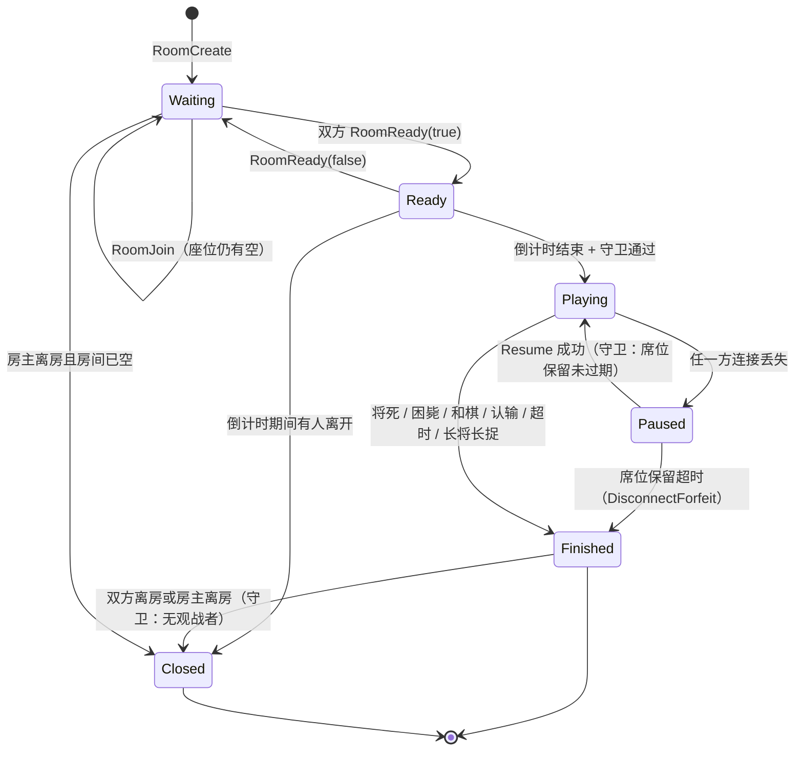

### 4.3 转移明细表

| # | 转移 | 触发条件 | 守卫条件 | 副作用 |
|---|---|---|---|---|
| T1 | `[*] → Waiting` | `RoomCreate` | ① 连接已鉴权；② 玩家不在其他房间（否则 `ROOM005`）；③ 配置合法（`ROOM008`）；④ 未达建房限流（`RATE001`） | 生成 6 位 `room_id`（`SETNX` 到 Redis，冲突则重试至多 5 次）；创建房间 Actor task；房主就座（**不指定颜色**）；`SET room:{id}:owner {instance} EX 7200`（[02-系统架构](02-系统架构设计.md) §7.3）；回 `RoomCreated` |
| T2 | `Waiting → Waiting` | `RoomJoin` | ① 房间存在（`ROOM001`）；② 有空座（`ROOM002`）；③ 未开局（`ROOM003`）；④ 玩家自身不在其他房间（`ROOM005`） | 分配空座；更新房间快照；向房间内所有连接广播 `RoomState`；写大厅索引 |
| T3 | `Waiting → Ready` | 最后一方 `RoomReady{ready:true}` | 两个座位均已占用且 `red_ready && black_ready` | 启动 3 秒倒计时 task；广播 `Countdown{starts_in_ms: 3000}` |
| T4 | `Ready → Waiting` | `RoomReady{ready:false}` | 处于倒计时阶段（倒计时未结束） | 取消倒计时 task；广播 `RoomState`（`GameStart` 未发生，`room_id` 与座位保持） |
| T5 | `Ready → Playing` | 倒计时到期 | ① 两座仍满；② 双方 `rules_version` 一致（否则 `SESS004` 并回退 `Waiting`）；③ 双方连接均在线 | 分配颜色；生成 `game_id`（UUID v7）；初始化 `Position::startpos()` 与双时钟；`seq = 0`；广播 `GameStart`；创建对局记录（PG 侧 `status = IN_PROGRESS`）；登记 Redis Stream `game:{id}:moves` |
| T6 | `Ready → Closed` | 倒计时期间任一方 `RoomLeave` / 断连且未在保留期内 | 倒计时尚未到期 | 取消倒计时；销毁房间；通知另一方 `Error{code:"ROOM004"}`；释放归属键 |
| T7 | `Playing → Paused` | 任一方连接丢失（心跳超时 / 服务端收到 `Close` / 进程崩溃） | 对局未终局 | 记录 `paused_at_ms` 与断线方；启动 `disconnect_forfeit_secs` 计时；向对局另一方与观战者广播 `Error{code:"SESS001"}` 与状态提示；**释放该玩家的对局内输入通道，其余通道继续** |
| T8 | `Paused → Playing` | `Resume` | ① `session_token` 有效且未过期（`SESS002`）；② 断线方身份与原席位一致；③ 席位保留未超时 | 取消判负计时；下发 `SessionResumed` → `SnapshotChunk × N` → `SnapshotComplete` → 增量补帧 → `SessionLive`（见 §6.4）；恢复输入通道 |
| T9 | `Paused → Finished` | 席位保留计时到期 | 断线方未能在 `disconnect_forfeit_secs`（默认 120 s）内恢复 | 判断线方负（`GameStatusDto::DisconnectForfeit`）；结算积分（若计分）；广播 `GameOver`；棋谱落库（含断线标记，便于反作弊观察） |
| T10 | `Playing → Finished` | ① 走子后 `status` 非 `Ongoing`；② `Resign`；③ 时钟耗尽（服务端判定）；④ `DrawRespond{accept:true}` | 对局处于 `Playing`（`Paused` 下不检查步时超时，仅检查席位保留） | 停止时钟；生成终局 `GameStatusDto`；**在单个 PG 事务内**写战绩 + 更新等级分 + 写等级分流水（见 [07-匹配排行榜](07-匹配排行榜与反作弊.md) §9）；广播 `GameOver`（含完整棋谱）；更新排行榜 ZSet；释放 `game_id` 上的活跃标记 |
| T11 | `Finished → Closed` | ① 房主 `RoomLeave`；② 或所有对局方 `RoomLeave` | 无观战者，或房主显式关闭 | 通知所有观战者 `Error{code:"ROOM004"}`；删除 Redis 快照键；释放 `room:{id}:owner`；终止 Actor task |
| T12 | `Waiting → Closed` | 房主 `RoomLeave` | 房间无其他玩家与观战者 | 同上（无对局记录需处理） |
| T13 | 任意 → `Closed` | 空闲超时（`room_idle_timeout_secs`，默认 **900 s**，来自 [02-系统架构](02-系统架构设计.md) §8 配置） | 房间无任何活跃连接且未在对局中 | 释放归属键与快照键 |

> **T13 的 900 秒依据**：房间空闲超时的目的只是回收"创建后无人加入"的僵尸房间。900 s = 15 分钟，覆盖"用户创建房间后去泡茶"的正常行为，同时避免 Redis 键长期占用。**该值为设计初始值，配置项来自 [02-系统架构](02-系统架构设计.md) §8 的 `game.room_idle_timeout_secs`**，无需另设。

### 4.4 观战者与房间状态的关系

| 关系 | 说明 |
|---|---|
| 观战者**不**影响状态转移 | 观战订阅/退订仅改变 `spectator_count`，不构成任何转移的触发或守卫（除了 T11 的守卫"无观战者"） |
| 观战者在 `Finished` 后仍可观看 | 观战不因终局中断——复盘场景需要（FR-06.03），且可继续接收终局讲解 |
| 观战者在 `Waiting`/`Ready` 阶段 | 允许订阅（可看"开局前"的双方信息），但不产生对局帧 |
| 观战者满员 | 回 `Error{code:"ROOM009"}`；对局继续进行，不因为观战满员而拒绝**玩家**入座（`ROOM002` 仅指玩家座位） |
| 观战者断线 | 与房间状态无关，直接摘除订阅并递减 `spectator_count`，房间**不**进入 `Paused`（`Paused` 只由对局方触发） |

---

## 5. 走棋流程与序列号

### 5.1 `seq` 的定义与作用

`seq` 是**服务端维护的、对局内单调递增的 `u64`**，每次改变对局状态的裁决成功后 `+1`（从 1 开始，初始值 0 表示"尚未走子"）。

| 作用 | 说明 |
|---|---|
| **幂等去重** | 客户端只应用 `seq > local_last_seq` 的帧，重复帧直接丢弃 |
| **乱序修复** | 收到 `seq == local_last_seq + 2` 时知道丢了 `+1`，立即发起 `Resume{last_seq}` 补帧 |
| **补帧边界** | 断线恢复的补帧起点 = `last_seq + 1`（对应 Redis `XRANGE game:{id}:moves (last_seq +`），见 §6.3 |
| **多帧一致性** | `ClockSync`、`UndoResolved` 等帧都携带 `seq`，客户端据此判断该帧是否已过期（防止补帧期间收到旧的时钟同步覆盖新状态） |

**`seq` 不覆盖的帧**（刻意设计）：

| 帧 | 原因 |
|---|---|
| `CoachNote` | 讲解可后到、可丢失、可增强替换，不改变对局状态（见 §3.3.11） |
| `ChatMessage` | 不改变对局状态 |
| `HeartbeatAck` / `ClockSync` | 时钟同步携带 `seq` 但**不消耗** `seq`，只标注"同步到的状态点" |
| `SpectatorCount` | 观战人数与对局状态无关 |

> **不变量**：`seq` 序列中**每一个值都恰好对应一次状态变更**，不允许跳号，不允许回退。悔棋会改变状态，因此**也必须消耗一个 `seq`**（回滚后的快照以新 `seq` 下发，见 §3.3.7）。

### 5.2 幂等去重规则

| 情形 | 处理 |
|---|---|
| `client_move_no` 等于服务端**已裁决过**的着法号，且着法内容相同 | 判定为重传（客户端因网络抖动重发）。**不改变局面**，仅重发一次对应的 `MoveApplied`（幂等返回） |
| `client_move_no` 等于已裁决过的着法号，但**着法内容不同** | 回 `MoveRejected{code:"GAME008"}`。这是明确的异常：同一着法号不可能有两种内容，说明客户端状态被篡改或存在严重 bug。服务端**同时**记录一次反作弊事件（见 [07-匹配排行榜](07-匹配排行榜与反作弊.md) §7.5） |
| `client_move_no` 小于服务端当前已裁决的着法号 | 同上，按内容是否一致分派 |
| `client_move_no` 大于 `当前着法号 + 1` | 回 `MoveRejected{code:"GAME007", snapshot: Some(快照)}`。客户端存在状态漂移，强制全量重同步 |

> **为什么用 `client_move_no` 而不是客户端自造的 `seq`**：若让客户端生成 `seq`，恶意客户端可以发送 `seq = u64::MAX` 来"抢占"序号空间。用**着法序号**（小整数、有语义边界）作为幂等键，服务端可以毫不费力地校验其合理性，且它天然可以被服务端独立推导——服务端只需比对"我已裁决的着法数"。

### 5.3 乐观更新与服务端裁决的配合

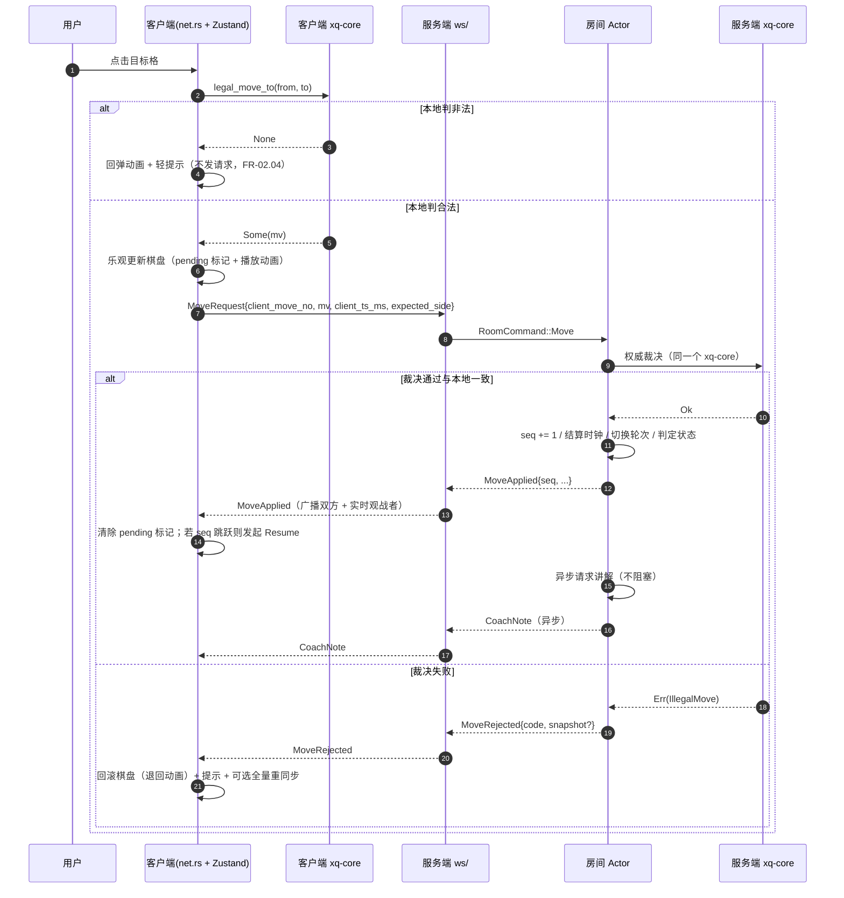

**配合要点（对应 [ADR-003](14-决策记录ADR.md#adr-003)）**：

| 要点 | 设计 |
|---|---|
| 客户端本地校验**只为手感** | 绝不作为权威依据（[02-系统架构](02-系统架构设计.md) 不变量 I-3） |
| 回滚是极小概率事件 | 两端同一份 `xq-core`，合法着法判定必然一致；不一致只可能来自版本差异或篡改 |
| 回滚必须可自愈 | `MoveRejected` 携带 `snapshot` 时客户端**整盘替换**本地状态，而不是逐项修补 |
| 客户端必须有"待确认"状态 | 乐观更新的着法在收到对应 `MoveApplied` 前标记为 `pending`；`pending` 期间禁止再次走子（服务端也会因 `GAME002` 拒绝） |
| `pending` 超时 | **10 秒**未收到任何与 `client_move_no` 相关的裁决帧（**设计初始值，待实测/校准**）→ 发起 `Resume` 而不是重发 `MoveRequest`（重发会污染幂等判断） |
| 版本前置防护 | `rules_version` 不一致时**禁止进入计分对局**（§1.4），把最可能的回滚来源挡在开局前 |

### 5.4 走棋路径的时序约束

| 环节 | 目标 | 依据 |
|---|---|---|
| 本地校验 + 渲染 | ≤ 16 ms（P95） | NFR-P.02 |
| 服务端裁决 | ≤ 1 ms（`xq-core` 的 `is_attacked` < 100 ns，合法着法生成 < 1 µs，见 [03-规则引擎](03-规则引擎与领域模型.md) §12） | NFR-P.07 |
| 端到端（客户端点击 → 收到 `MoveApplied`） | ≤ 150 ms（P95，同区域） | NFR-P.05 |
| 落库 | **不进入关键路径**：仅 `XADD` 到 Redis Stream（[ADR-011](14-决策记录ADR.md#adr-011)） | NFR-R.04 |
| 讲解 | **不进入关键路径**：独立帧异步推送（[ADR-004](14-决策记录ADR.md#adr-004)） | FR-03.07 |

---
## 6. 断线重连协议

### 6.1 恢复时序（全量快照 + 增量补帧）

采用 [01-需求规格](01-需求规格说明书.md) FR-05.06 与 [02-系统架构](02-系统架构设计.md) §6.2 确立的"**全量快照 + 增量补帧**"策略。

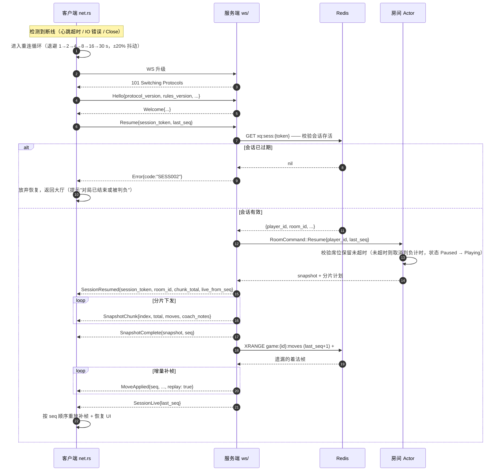

### 6.2 指数退避参数

| 尝试次数 | 退避基值 | 抖动后区间（±20%） |
|---|---|---|
| 1 | 1 s | 0.8 ~ 1.2 s |
| 2 | 2 s | 1.6 ~ 2.4 s |
| 3 | 4 s | 3.2 ~ 4.8 s |
| 4 | 8 s | 6.4 ~ 9.6 s |
| 5 | 16 s | 12.8 ~ 19.2 s |
| 6 及以后 | **30 s**（上限） | 24 ~ 36 s |

| 参数 | 取值 | 依据 |
|---|---|---|
| 首次重连延迟 | **1 s** | 首次失败多为瞬时抖动（Wi-Fi 切换、NAT 超时），快速重试可让用户在无感知的情况下恢复 |
| 上限 | **30 s** | 必须**小于**席位保留时长（120 s），否则第 5 次尝试时对局已被判负。30 s 上限保证 120 s 内至少完成 5 次尝试（1+2+4+8+16 = 31 s，第 6 次在 61 s，第 7 次在 91 s，第 8 次在 121 s） |
| 抖动比例 | **±20%** | 避免同机房大量客户端在同一毫秒集体重连造成惊群（thundering herd）。20% 是不引入额外延迟感知的前提下足以打散群体的比例 |
| 抖动分布 | 均匀分布 | 均匀分布足以打散惊群；正态分布在尾部仍可能聚集 |
| 重置条件 | 连接**稳定 60 s** 后重置尝试计数 | 避免"连上 2 秒又断"导致计数永远停留在 1 |
| 特殊加速 | 服务端以 `CloseCode::Restart` 关闭时，**立即**重连（不等退避） | 服务端主动重启意味着"不是网络的错"，等待无意义；此时服务端通常有多个实例在轮流重启 |

```rust
// crates/xq-client/src/net.rs
/// 重连退避基值（秒）。末位为上限，超出则重复使用末位。
const BACKOFF_SECS: [u64; 6] = [1, 2, 4, 8, 16, 30];

/// 抖动比例 ±20%。
const JITTER_RATIO: f64 = 0.2;

/// 计算第 `attempt` 次重连的等待时长（毫秒）。`attempt` 从 1 开始。
///
/// 随机数由调用方注入（`rand::rngs::StdRng`，显式种子，
/// 遵循 ADR-005 对"不使用隐式随机源"的要求）。
pub fn reconnect_delay_ms<R: rand::Rng>(attempt: usize, rng: &mut R) -> u64 {
    let idx = attempt.saturating_sub(1).min(BACKOFF_SECS.len() - 1);
    let base_ms = BACKOFF_SECS[idx] as f64 * 1000.0;
    // rng.random::<f64>() 取值区间 [0, 1)，映射到 [-1, 1) 后按比例缩放。
    let factor = 1.0 + (rng.random::<f64>() * 2.0 - 1.0) * JITTER_RATIO;
    (base_ms * factor).round().max(0.0) as u64
}

#[cfg(test)]
mod tests {
    use super::*;
    use rand::SeedableRng;

    #[test]
    fn backoff_stays_within_jitter_band() {
        let mut rng = rand::rngs::StdRng::seed_from_u64(0x9E37_79B9_7F4A_7C15);
        for attempt in 1..=10usize {
            let idx = attempt.saturating_sub(1).min(BACKOFF_SECS.len() - 1);
            let base_ms = BACKOFF_SECS[idx] * 1000;
            for _ in 0..1000 {
                let d = reconnect_delay_ms(attempt, &mut rng);
                assert!(d >= base_ms * 80 / 100, "attempt={attempt} d={d}");
                assert!(d <= base_ms * 120 / 100, "attempt={attempt} d={d}");
            }
        }
    }
}
```

### 6.3 增量补帧

| 项 | 设计 |
|---|---|
| 权威来源 | Redis Stream `game:{game_id}:moves`（[ADR-011](14-决策记录ADR.md#adr-011)）。每条着法在裁决通过后立即 `XADD`，`seq` 作为 Stream 字段 |
| 补帧查询 | `XRANGE game:{game_id}:moves (last_seq+1) +`，注意起始为**开区间**，避免重复下发 `last_seq` 那一帧 |
| 上界 | `XRANGE` 返回条数上限设为 **1000**（**设计初始值，待实测/校准**）。超过则说明客户端离线过久，**直接降级为只下发全量快照**并令客户端以 `SnapshotComplete.seq` 为 `last_seq` 起点，不再补帧 |
| 补帧标记 | 每个补帧的 `MoveApplied` 带 `replay: true`，客户端据此跳过动画与音效（避免恢复时连续闪出几十步动画） |
| 结束标记 | 补帧结束后发 `SessionLive{last_seq}`，客户端从此转入实时流处理 |
| 竞态处理 | 房间 Actor 在收到 `Resume` 后**先暂停向该连接的实时推送**，完成补帧并发出 `SessionLive` 后再恢复。这样"补帧"与"实时流"之间不会出现交叉，客户端不需要处理两路并发帧 |
| 幂等 | 客户端仍以 `seq > local_last_seq` 为准丢弃重复帧——即使服务端因边界错误重复下发，也不会造成状态错乱（双重保险） |

### 6.4 全量快照的分段下发

| 项 | 设计 |
|---|---|
| 触发条件 | `SessionResumed` 之后，快照按 `SnapshotChunk` 分段下发 |
| 分片粒度 | 每片最多 **100 条着法** 或 **100 条讲解**（**设计初始值，待实测/校准**），以先达到者为准；每片 JSON 约 22 KB，安全低于 64 KiB 上限 |
| 分片顺序 | `index` 从 0 到 `total - 1`，**必须顺序下发**（同一连接的发送队列保证 FIFO）；客户端不做乱序重排 |
| 最终权威 | 无论分片是否完整，`SnapshotComplete.snapshot` 才是权威局面。客户端应**先重放分片中的着法**，再用 `snapshot.fen` 校验；不一致则直接用 `snapshot` 覆盖 |
| 分片失败 | 任一分片下发失败（连接再次断开）→ 客户端重新走完整 `Resume` 流程，不做"续传分片"。快照恢复必须原子化，续传会引入难以穷举的中间态 |
| 无快照的情况 | 若对局尚未开始（房间处于 `Waiting`/`Ready`），`chunk_total = 0`，直接发 `SnapshotComplete` 与 `SessionLive` |

### 6.5 席位保留与超时判负

| 参数 | 取值 | 依据 |
|---|---|---|
| 席位保留时长 | **120 s**（可配置，`config.disconnect_forfeit_secs`） | [01-需求规格](01-需求规格说明书.md) FR-05.07 明确"可配置，默认 120 秒"；[02-系统架构](02-系统架构设计.md) §8 配置项 `game.disconnect_forfeit_secs = 120` |
| 保留期内对局状态 | `Paused` | 见 §4.1 |
| 计时行为 | **局时继续流逝，步时暂停** | 见 §4.1 说明（**设计初始值，待实测/校准**） |
| 到期后果 | 断线方判负（`GameStatusDto::DisconnectForfeit`） | FR-05.07、T9 |
| 双方同时断线 | 各自开始独立计时；**先到期的判负**；若同时到期（同一 `Tick` 内），按"**红方优先**"确定性处理（避免引入不可复现的结果） | 需要确定性规则，否则同一输入可能产生两种结果，破坏可重放性 |
| 断线期间对局可否被"保存" | 可以。`Finished` 后棋谱照常落库，终局原因标记为 `disconnect_forfeit`，便于反作弊观察（[07-匹配排行榜](07-匹配排行榜与反作弊.md) §7.6） | FR-05.07 与 NFR-R.03 |

### 6.6 恢复的边界情况

| 情况 | 处理 |
|---|---|
| `Resume` 时对局已 `Finished`（席位保留期内对方已取胜，例如对方提出了"立即判负"或对局因其他原因终止） | 回 `SessionResumed` + 快照（含终局状态），客户端直接展示终局界面与棋谱。**不报错**——用户需要看到"我掉线期间发生了什么" |
| `Resume` 时房间已被 `Closed` 且 `game_id` 已持久化 | 回 `Error{code:"ROOM004"}`；客户端改用 REST 拉取棋谱（`GET /games/{id}/record`）进入复盘 |
| `Resume` 时房间 `Closed` 且棋谱未落库（服务端崩溃且 Redis 丢失） | 回 `Error{code:"SESS002"}`；客户端提示"对局记录不可恢复"。这是可接受的极端降级（Redis 键有 TTL，PG 侧的 `game` 行在 T5 时已创建，故实际上极难发生） |
| 同一连接重复发 `Resume` | 幂等处理：重发一次 `SessionResumed` 与完整分片（客户端本就会整盘替换，无副作用） |
| 客户端在 `Playing` 状态下误发 `Resume`（未断线） | 视为一次主动全量重同步：同样走快照 + 补帧流程，但**不改变**房间状态，且**不重置**时钟 |
| 重连到不同实例（多实例部署） | 服务端发现 `room:{id}:owner != self` 时，在 `Welcome`/`Resume` 响应中回 `Error{code:"SESS008"}`（携带目标实例提示）。客户端的处理是**由负载均衡层完成粘性重定向**（[02-系统架构](02-系统架构设计.md) §7.3），客户端侧只重新发起连接，不解析实例地址（避免客户端被引导到任意后端，产生 SSRF 面） |
| 天梯对局掉线 | 席位保留与普通对局一致。**掉线判负计入等级分**（与超时判负同等对待），但若反作弊判定为"利用掉线规避"则该局不计分（[07-匹配排行榜](07-匹配排行榜与反作弊.md) §7.6） |

---

## 7. 计时与 ClockSync

### 7.1 权威原则

**服务端是唯一计时权威**（[ADR-014](14-决策记录ADR.md#adr-014)）。客户端时间**不参与任何判定**，只用于本地插值显示。

| 项 | 权威方 |
|---|---|
| 剩余局时 / 步时 | 服务端（以服务端单调时钟 + 收到合法着法帧的时刻结算） |
| 超时判定 | 服务端 |
| 断线席位保留计时 | 服务端 |
| 观战 3 秒延迟 | 服务端（§8.3） |
| 客户端显示的倒计时 | 客户端插值，**允许 ±100 ms 量级偏差**（见 §7.4 的可接受偏差） |

### 7.2 ClockSync 帧

| 参数 | 取值 | 依据 |
|---|---|---|
| 下发周期 | **5 s** | [ADR-014](14-决策记录ADR.md#adr-014) 明确"同步周期 5 秒，偏差 ≤ 数十字节级"；5 s 也满足"无需每秒请求服务端"的设计意图 |
| 触发时机 | ① 每 5 s 周期触发；② 每次 `MoveApplied` 之后立即补发一次（走子是最需要精确显示的时刻）；③ 进入 `Paused`/`Playing` 迁移时 | 走子后立即同步的额外开销为 0（该帧本就是广播的一部分），但能让玩家在每步都看到准确的剩余时间 |
| 额外开销 | 2500 局 / 5 s × 2 玩家 ≈ 1000 帧/s，`ClockSync` 帧约 120 B ≈ 120 KB/s | 与走棋帧同量级，可接受。**若实测成为负担，可降为"仅走子后同步"**（**待实测/校准**） |
| 时钟源 | 服务端使用单调时钟（`tokio::time::Instant`）累计对局时间，**不使用** `SystemTime` 做差值（NTP 调整会导致时间跳变） | 保证"时间只会单调减少" |

### 7.3 客户端插值策略

客户端维护一个**锚点 + 本地递推**的显示模型，每收到一次 `ClockSync` 就重锚定一次。

```rust
// crates/xq-client/src/net.rs
use xq_protocol::dto::ColorDto;

/// 一次时钟同步样本。
#[derive(Debug, Clone, Copy)]
pub struct ClockSample {
    pub server_ts_ms: u64,
    pub red_ms: u64,
    pub black_ms: u64,
    pub step_ms: u64,
    pub step_owner: ColorDto,
}

/// 客户端时钟模型：只做显示，不参与任何判定。
#[derive(Debug, Clone, Copy)]
pub struct DisplayClock {
    /// 服务端时间 - 本地时间 的估计偏移（毫秒）。
    pub offset_ms: i64,
    /// 锚定时刻的双方剩余局时。
    pub red_ms: u64,
    pub black_ms: u64,
    /// 锚定时刻的步时与归属方；`None` 表示未在对局中。
    pub step: Option<(u64, ColorDto)>,
    /// 锚定时的本地单调时钟读数（毫秒）。
    pub anchor_local_ms: u64,
}

/// EMA 平滑系数。0.3 意味着约 3 次同步后新样本占据主导，兼顾收敛速度与抗抖动。
const OFFSET_EMA_ALPHA: f64 = 0.3;

impl DisplayClock {
    /// 应用一次 ClockSync。`local_now_ms` 为本地单调时钟读数，
    /// `rtt_ms` 为最近一次心跳测得的往返时延。
    pub fn apply(&mut self, sample: ClockSample, local_now_ms: u64, rtt_ms: u64) {
        // 单向延迟取 RTT 的一半（与 NTP 的对称假设一致）。
        let one_way_ms = (rtt_ms / 2) as i64;
        let raw_offset = sample.server_ts_ms as i64 - local_now_ms as i64 + one_way_ms;
        self.offset_ms = (self.offset_ms as f64 * (1.0 - OFFSET_EMA_ALPHA)
            + raw_offset as f64 * OFFSET_EMA_ALPHA) as i64;
        self.red_ms = sample.red_ms;
        self.black_ms = sample.black_ms;
        self.step = Some((sample.step_ms, sample.step_owner));
        self.anchor_local_ms = local_now_ms;
    }

    /// 当前时刻应显示的双方剩余局时（毫秒）。
    pub fn now_ms(&self, local_now_ms: u64) -> (u64, u64) {
        let elapsed = local_now_ms.saturating_sub(self.anchor_local_ms);
        (
            self.red_ms.saturating_sub(elapsed),
            self.black_ms.saturating_sub(elapsed),
        )
    }

    /// 当前时刻应显示的步时剩余（毫秒）。
    pub fn step_now_ms(&self, local_now_ms: u64) -> Option<(u64, ColorDto)> {
        let (step_ms, owner) = self.step?;
        let elapsed = local_now_ms.saturating_sub(self.anchor_local_ms);
        Some((step_ms.saturating_sub(elapsed), owner))
    }
}
```

| 策略项 | 设计 | 理由 |
|---|---|---|
| 递推频率 | 每帧（浏览器 `requestAnimationFrame`，或 Rust 侧 100 ms 定时） | 100 ms 粒度对手感足够，且避免每帧计算 |
| 显示格式 | 秒（向上取整），剩余 < 10 s 时显示到 0.1 s | 低剩余时间需要更细粒度以提示紧迫感 |
| 平滑 | 偏移用 EMA（α = 0.3） | 单次同步受 RTT 抖动影响，直接替换会导致显示跳变 |
| 归零处理 | 服务端已判超时后客户端显示 `0`，**不**显示负数；终局后冻结显示 | 避免出现 `-3 s` 这类荒谬显示 |
| 时钟回拨防护 | 客户端使用**单调时钟**（`Instant`）算 elapsed，不使用墙上时钟 | 用户改系统时间不影响插值 |
| 显示与服务端不一致时 | 以服务端为准；若差 > 1 s（说明同步机制异常），客户端应发起 `ClockPing` 主动重新同步 | 自愈机制 |

### 7.4 宽限窗口

| 参数 | 取值 | 依据 |
|---|---|---|
| 宽限窗口 | **500 ms** | [ADR-014](14-决策记录ADR.md#adr-014) 明确"引入宽限窗口（如 500 ms）"。语义：服务端在判定超时时，允许"实际收到时刻 ≤ 超时时刻 + 500 ms"的着法仍然生效 |
| 为什么需要 | 网络抖动、GC/调度暂停、丢包重传都可能让一个"在客户端看来及时"的着法晚到服务端。棋类的步时是秒级，500 ms 的宽限不会破坏竞技公平 |  |
| 与作弊的关系 | 500 ms 只对**到达服务端**的时刻生效，客户端无法借此延长思考时间（它无法提前发送自己还没想好的着法） |  |
| 宽限窗口是否累计 | **不累计**。每次超时判定独立使用 500 ms 宽限，不会因为上一步晚到而放宽下一步 | 防止通过反复晚到"积攒"宽限 |
| 显示提示 | 宽限期内到达的着法若被接受，服务端在 `MoveApplied.clock` 中反映真实余额（可能为 0），并在 `Error{code:"GAME016"}`（**警告级**）中提示"本步已超过步时但被接受" | 让玩家知道自己在边界上，避免误以为计时异常 |
| 待校准项 | 500 ms 是**设计初始值，待实测/校准**——需统计真实网络下"合法着法到达延迟"的 P99.9，若该值超过 500 ms 则应放宽（例如 800 ms），否则会误判。**注意：宽限窗口的目的是容忍网络，不是容忍作弊，因此不应设得过大** |

### 7.5 超时判定流程

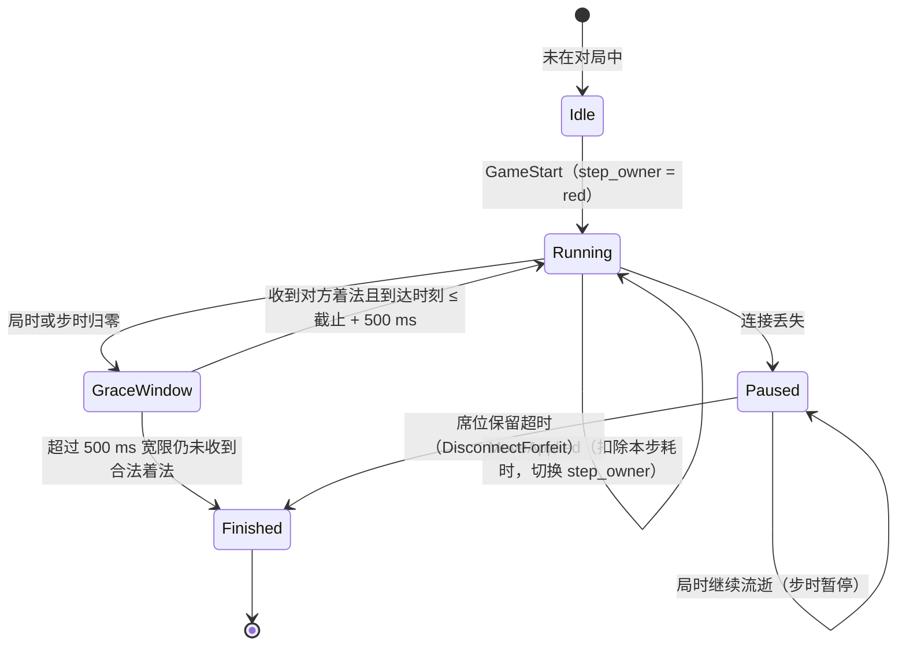

| 判定类型 | 触发条件 | 结果 |
|---|---|---|
| 步时超时 | 当前步方在本步内未完成走子，`step_ms` 耗尽 + 500 ms 宽限 | 该方判负（`GameStatusDto::Timeout`） |
| 局时超时 | 一方累计局时耗尽（步时未耗尽的情况下也会先耗尽局时） | 同上 |
| 两者同时耗尽 | 局时归零时步时必然已归零（步时是局时的子集视角） | 统一按 `Timeout` 处理，终局原因不细分（避免用户困惑） |
| `Paused` 期间 | 仅局时继续流逝；**步时暂停** | 局时耗尽仍判负（防止以断线拖延） |
| 宽限期内到达非法着法 | 收到着法但裁决失败 | **不**消耗宽限，仍按超时判负；先回 `MoveRejected` 再回 `GameOver` |

### 7.6 超时判定的测试要点

| # | 场景 | 期望 |
|---|---|---|
| 1 | 服务端时钟推进到 `step_ms` 恰好为 0，无着法到达 | 判负，`status.kind == "timeout"` |
| 2 | 着法在 `截止 + 499 ms` 到达 | **接受**，对局继续，`MoveApplied.clock.step_ms == 0` |
| 3 | 着法在 `截止 + 501 ms` 到达 | **拒绝**（判负），并回 `MoveRejected{code:"GAME003"}` |
| 4 | 连续 100 次在 `截止 + 400 ms` 到达的着法 | 全部接受，且**不累计**宽限（第 101 次仍需在 `截止 + 500 ms` 内） |
| 5 | 注入 ±300 ms 的高斯抖动到 10000 次合法着法的到达时刻 | 误判超时率应为 **0**（若不为 0，说明宽限窗口偏小，需按 §7.4 校准） |
| 6 | 对局进行中切断连接 119 s 后恢复 | 恢复成功，不判负，状态回到 `Playing` |
| 7 | 对局进行中切断连接 121 s 后恢复 | 判负（`disconnect_forfeit`），恢复时收到 `SessionResumed` + 终局快照 |
| 8 | 双方同时断线，一方在 100 s 恢复、另一方未恢复 | 未恢复方在 120 s 判负（不因"另一方先恢复"而改变） |
| 9 | 双方同时到期（同一 Tick） | 结果为**确定性**的（红方优先判负），重复 100 次结果一致 |
| 10 | 客户端人为把本地系统时间改快 1 小时 | 对局计时**不受影响**，服务端判定结果与未修改时一致 |
| 11 | `Paused` 期间局时耗尽 | 判负（`disconnect_forfeit` 或 `timeout` 按先到者），而非永久暂停 |
| 12 | 服务端使用单调时钟累计，期间系统 NTP 回拨 | 计时不受影响，无时间跳变 |

---

## 8. 观战

### 8.1 订阅与退订流程

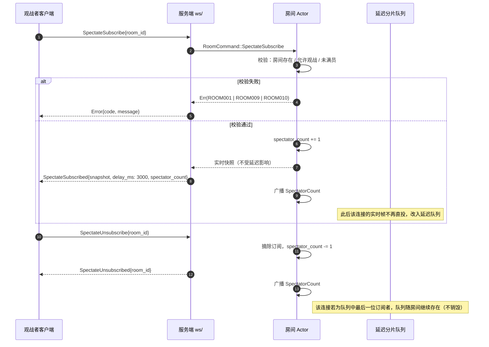

| 环节 | 设计 |
|---|---|
| 订阅起点 | 下发**实时**快照作为起点，之后的帧进入 3 秒延迟流。**这与"延迟快照"不同**：若快照也延迟，观战者会先看到 3 秒前的局面，再看到"3 秒前→现在"的帧序列，体验上等价，但实现上快照延迟毫无必要且增加复杂度 |
| 位置连续性 | 快照的 `seq` 即延迟流的起点；延迟流中的帧从 `seq + 1` 连续下发，观战者不会看到跳号 |
| 退订语义 | 幂等。对未订阅的房间发退订不报错（回 `SpectateUnsubscribed`） |
| 同一账号观战自己的对局 | **禁止**（回 `Error{code:"ROOM011"}`）。理由见 §8.5 |
| 观战者也能收到讲解 | 是。`CoachNote` 属于房间广播，观战者同样经过 3 秒延迟队列（这样观战者的讲解与棋盘进度一致） |

### 8.2 统一 3 秒延迟

| 项 | 取值 | 依据 |
|---|---|---|
| 延迟时长 | **3000 ms**，服务端强制 | [ADR-012](14-决策记录ADR.md#adr-012) 与 [01-需求规格](01-需求规格说明书.md) FR-06.04、NFR-S.03 |
| 适用范围 | 所有观战连接，**无例外** | "统一"是 ADR-012 的核心：一旦存在低延迟旁路，延迟即失效 |
| 对局双方 | **不经过**延迟队列 | 双方需要实时对局，延迟只施加于观战者 |
| UI 标注 | 客户端必须显式展示"观战延迟 3 秒" | [ADR-012](14-决策记录ADR.md#adr-012) 权衡项：避免用户困惑 |
| 跨实例观战 | 通过 Redis Pub/Sub 转发，额外 1~5 ms，可忽略 | [02-系统架构](02-系统架构设计.md) §7.3 |

### 8.3 延迟队列的分片定时推送实现

**先说结论：绝不为每条消息各起一个 `sleep` task。**

| 方案 | 任务数（2500 房间 × 50 观战者） | 定时器条目 | 每秒唤醒次数 | 顺序保证 |
|---|---|---|---|---|
| **A. 每条消息一个 `sleep` task** | 峰值 ≈ 12.5 万（每观战连接每 3 秒至少 1 个 task） | 12.5 万 | ≈ **4.2 万 / 秒** | ❌ 无——多个 task 同时到期时由运行时调度决定顺序，观战者可能先收到后发的帧 |
| **B. 每观战者一个队列 + 一个 1 s tick** | 2500（每房间 1 个 tick 即可驱动全部观战者） | 2500 | **2500 / 秒** | ✅ 分片内部 FIFO，且 3 秒隔离保证跨分片有序 |
| **C. 每房间一个 3 分片环形队列 + 复用房间 Actor 的 tick** | **0 额外 task**（复用房间 Actor 的 `interval`） | 2500（房间 Actor 本来就有） | 2500 / 秒 | ✅ 同上 |

采用方案 **C**。理由：房间 Actor 已经持有 `tokio::time::interval` 用于计时（[ADR-006](14-决策记录ADR.md#adr-006) 理由 2），观测延迟推送只是复用它多做一个动作，**新增任务数为零**。

```rust
// crates/xq-server/src/room/spectate.rs
use std::collections::VecDeque;
use std::sync::Arc;

use xq_protocol::ServerFrame;

/// 分片数 = 延迟秒数。延迟 3 秒 → 3 个分片。
const DELAY_SECS: usize = 3;

/// 观战延迟队列：3 个分片的环形缓冲。
///
/// # 调用约定（顺序不可颠倒）
/// 每个自然秒内必须严格按 `drain_due()` → `push()` → `advance()` 的顺序调用：
/// 1. 先取走「3 秒前入队」的分片（它与本秒的 `cursor` 相同，因为 3 ≡ 0 mod 3）；
/// 2. 本秒产生的帧写入**同一个已清空的分片**，它们将在 3 秒后被取走；
/// 3. 秒末推进 `cursor`。
pub struct DelayShards {
    shards: [VecDeque<Arc<ServerFrame>>; DELAY_SECS],
    cursor: usize,
}

impl Default for DelayShards {
    fn default() -> Self {
        Self::new()
    }
}

impl DelayShards {
    pub fn new() -> Self {
        Self {
            shards: std::array::from_fn(|_| VecDeque::new()),
            cursor: 0,
        }
    }

    /// 取走本秒应推送的帧（即 `DELAY_SECS` 秒前入队的那一批）。
    /// 调用后当前分片为空，同一秒内新入队的帧将占据它。
    pub fn drain_due(&mut self) -> VecDeque<Arc<ServerFrame>> {
        std::mem::take(&mut self.shards[self.cursor])
    }

    /// 入队一条待延迟下发的帧。必须在 `drain_due` 之后、`advance` 之前调用。
    pub fn push(&mut self, frame: Arc<ServerFrame>) {
        self.shards[self.cursor].push_back(frame);
    }

    /// 秒末推进游标。
    pub fn advance(&mut self) {
        self.cursor = (self.cursor + 1) % DELAY_SECS;
    }

    /// 当前各分片积压的帧数，用于指标暴露与容量告警。
    pub fn pending(&self) -> [usize; DELAY_SECS] {
        std::array::from_fn(|i| self.shards[i].len())
    }
}

#[cfg(test)]
mod tests {
    use super::*;
    use xq_protocol::ServerFrame;

    fn frame(seq: u64) -> Arc<ServerFrame> {
        Arc::new(ServerFrame::SessionLive { last_seq: seq })
    }

    /// 第 0 秒入队的帧必须恰好在第 3 秒被取出。
    #[test]
    fn delay_is_exactly_three_seconds() {
        let mut q = DelayShards::new();
        q.drain_due(); // 第 0 秒：先 drain
        q.push(frame(1)); // 第 0 秒：入队
        q.advance();

        for _ in 0..2 {
            let due = q.drain_due();
            assert!(due.is_empty(), "第 1、2 秒不应有任何帧到期");
            q.advance();
        }

        let due = q.drain_due();
        assert_eq!(due.len(), 1, "第 3 秒应恰好取出 1 帧");
    }

    /// 分片内保持 FIFO 顺序。
    #[test]
    fn order_is_preserved_within_shard() {
        let mut q = DelayShards::new();
        q.drain_due();
        q.push(frame(1));
        q.push(frame(2));
        q.push(frame(3));
        q.advance();
        q.drain_due();
        q.advance();
        q.drain_due();
        q.advance();

        let due = q.drain_due();
        assert_eq!(due.len(), 3);
        let seqs: Vec<u64> = due
            .iter()
            .map(|f| match f.as_ref() {
                ServerFrame::SessionLive { last_seq } => *last_seq,
                _ => unreachable!(),
            })
            .collect();
        assert_eq!(seqs, vec![1, 2, 3]);
    }
}
```

**为什么这个方案是正确的**：`DELAY_SECS = 3` 时，第 `S` 秒入队的帧写入分片 `S % 3`；下一次游标回到 `S % 3` 是在第 `S + 3` 秒（因为游标每 tick 前进 1，模 3 循环）。因此延迟恒为 3 秒（误差 < 1 个 tick，即 < 1 s 的量化误差——**这是分片方案的固有代价：延迟粒度为 1 秒**）。3 秒 ± 1 秒的抖动对观战体验无影响，且延迟**只可能偏大不可能偏小**（偏大安全，偏小会削弱防作弊）。

> **量化误差是否可接受**：需要。若产品要求延迟严格 ≥ 3000 ms 且抖动更小，可以把分片粒度改为 250 ms（`DELAY_SECS` 改为 12），代价是 tick 频率提升 4 倍（2500 房间 → 10000 tick/s）。**当前选择 1 秒粒度（设计初始值，待实测/校准）**，因为观战体验对 1 秒抖动不敏感。

> **与 ADR-012 的表述差异（诚实说明）**：ADR-012 的实现要点描述为"服务端为每个观战连接维护一个延迟队列"，本文实现为"每房间一个共享分片队列，drain 后扇出给本房间全部观战者"。**决策未变**（仍是统一 3 秒延迟），改变的是数据结构：当所有观战者延迟相同时，两种实现的下发结果逐帧等价，而共享队列把内存从 `观战者数 × 队列` 降为 `房间数 × 队列`。若未来引入"付费观战者可看 1 秒延迟"这类差异化策略，再退化为每连接独立队列。

### 8.4 观战上限与满员处理

| 项 | 取值 | 依据 |
|---|---|---|
| 观战上限 | **50 人 / 房间**，来自配置 `game.spectator_limit` | [01-需求规格](01-需求规格说明书.md) FR-06.05；[02-系统架构](02-系统架构设计.md) §8 配置项 |
| 判定时机 | 在**订阅时**检查并递增 `spectator_count`，采用房间 Actor 内串行化，不存在竞态 | ADR-006 的天然优势 |
| 满员响应 | `Error{code:"ROOM009", message:"该房间观战人数已满"}` | §11 |
| 满员是否有队列 | **无**。不做"观战排队"，因为观战的实时性决定了排队等待没有意义 | — |
| 观战人数广播 | `SpectatorCount` 在人数变化时广播给房间内**所有**连接（含双方玩家），便于 UI 展示人气 | — |
| 退订释放 | 观战者断线时由连接层的清理逻辑自动退订，**不能依赖客户端主动退订**（否则断线用户会永久占用名额，房间很快被"幽灵观战者"占满） | 这是必须的防御性设计 |
| 订阅限流 | 同一 `player_id` 对同一房间的订阅/退订频率限制：**10 次 / 分钟**，超出回 `RATE001` | 防止通过高频进出观战"探测房间状态"或缩小延迟影响（§8.5） |
| 容量核算 | 50 人 × 2500 房间 = 12.5 万观战连接。按每连接 ~8 KB 会话开销 ≈ **1 GB** 额外内存，需要在容量规划中计入（**设计初始值，待压测校准**） | 这是观战方案最大的成本项，必须在 M2 压测中验证 |

### 8.5 观战相关的边界情况

| 情况 | 处理 | 理由 |
|---|---|---|
| 同一账号观战自己的对局 | 拒绝（`ROOM011`） | 观战视图虽延迟 3 秒，但它是"另一个连接"，会带来"双份**自己**视角数据"的复杂性；且天梯局禁止用第二个客户端旁路（见 [07-匹配排行榜](07-匹配排行榜与反作弊.md) §7.4） |
| 对局双方互为好友并通过语音通报局面 | **技术上无法阻止**。3 秒延迟只能防"实时局面转发"，防不住"我知道了，我告诉你" | 只能依赖反作弊的行为统计（异常思考时间、着法质量跃变），见 [07-匹配排行榜](07-匹配排行榜与反作弊.md) §7.1 |
| 观战者通过高频退订/订阅缩小延迟感知 | 退订后重新订阅会拿到**实时快照**（起点总是实时），看似可以"刷新到最新"。但这只让观战者看到**更早**的帧序列（快照是实时点，之后仍延迟 3 秒），**不能**获得未来信息。配合 §8.4 的订阅限流，风险可控 | 这一点容易被误判为漏洞，需要明确：延迟的语义是"帧的下发时刻被推迟"，而不是"内容被隐藏" |
| 房间在观战者订阅后立即 `Closed` | 回 `Error{code:"ROOM004"}`，客户端退出观战视图 | — |
| 观战者在对局结束后仍订阅 | 允许。终局后的 `GameOver` 与棋谱照常下发（终局后延迟队列可**立即清空**，因为对局已结束、无泄密风险），客户端展示完整棋谱 | 复盘学习是观战的重要价值（FR-06.03） |
| 观战者订阅一个 `Waiting` 状态的房间 | 允许；`SpectateSubscribed.snapshot` 的 `moves` 为空、`status` 为 `ongoing`（无对局），客户端展示"等待开局" | — |
| 观战连接的心跳 | 与普通连接一致（§2.2），无特殊处理 | — |

---
## 9. 悔棋 / 求和 / 认输

三者共享同一套"**请求-应答**"模型，差异仅在次数限制与终局后果。

### 9.1 统一的请求-应答模型

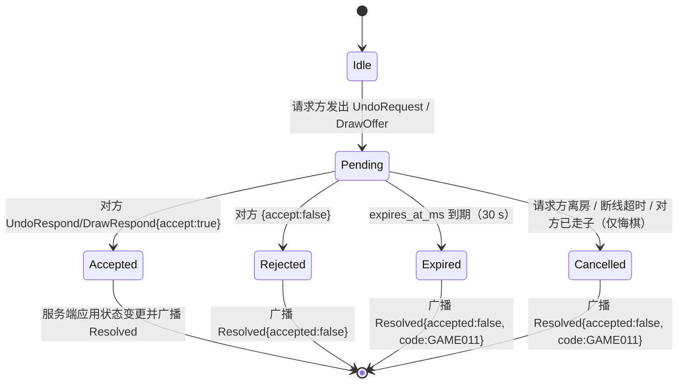

| 环节 | 设计 |
|---|---|
| 唯一入口 | 请求一律经房间 Actor（`RoomCommand::UndoRequest` / `OfferDraw` / `Resign`），由 Actor 串行化处理，无并发竞态（[ADR-006](14-决策记录ADR.md#adr-006)） |
| 请求 ID | 服务端生成（UUID v7 字符串），客户端不能自造，避免应答错配 |
| 同一时刻的待决请求 | **每类最多 1 个**。已有待决悔棋时再发悔棋回 `GAME011`；已有待决求和时再发求和回 `GAME014`（冷却中） |
| 悔棋与求和可并存 | 允许（一个待决悔棋 + 一个待决求和）。但两者都需对方应答，UI 应合并展示，避免弹窗叠加 |
| 应答权限 | **仅对方**可应答。请求方应答回 `GAME015` |
| 未知 `request_id` | 回 `Error{code:"GAME011"}`（服务端无此待决请求，可能已超时撤销） |
| 幂等 | 同一 `request_id` 重复应答：第一次生效，后续应答视为幂等重复，仅重发对应的 `Resolved` 帧 |

### 9.2 次数限制

| 项 | 限制 | 扣减时机 | 超限错误码 | 依据 |
|---|---|---|---|---|
| 悔棋 | **3 次 / 局 / 方** | 发出 `UndoRequest` 时立即扣减 | `GAME010` | [01-需求规格](01-需求规格说明书.md) FR-05.11「双方同意的悔棋（每局限 3 次）」；[02-系统架构](02-系统架构设计.md) §8 配置项 `game.max_undo_per_game = 3` |
| 求和 | **3 次 / 局 / 方** | 发出 `DrawOffer` 时立即扣减 | `GAME013` | [01-需求规格](01-需求规格说明书.md) FR-01.10「同一方每局最多 3 次」 |
| 认输 | 无限制 | — | — | 认输是"终止权"，限制它毫无意义 |
| 被悔棋方（应答方） | 不受限制 | — | — | 只有**发起方**消耗配额，避免"对方一直请求、我被扣分"的荒谬设计 |
| 悔棋范围 | 只能悔**己方刚走过的着法之后**的对局进度 | — | `GAME012` | 不可悔对方的着法——否则等于"我要求对方重下"。实战中双方同意悔棋的语义就是"撤销到某一步之前" |
| 计分对局中的悔棋 | **允许**（若 `config.allow_undo`）。但若对局最终以"悔棋后局面"结束，棋谱中会记录悔棋事件，反作弊在评估时会识别 | — | — | 悔棋本身是合法功能；但**频繁悔棋**是一种作弊信号（用于试探引擎推荐的着法），见 [07-匹配排行榜](07-匹配排行榜与反作弊.md) §7.1 |

> **待确认项**：是否允许在**天梯计分对局**中悔棋，是一个产品决策而非技术决策。当前设计为"允许但记录"，若运营数据显示悔棋被用于试探引擎，应改为"计分局禁用悔棋"，此时 `config.allow_undo` 由匹配器强制置为 `false`（该规则尚未确定，标注为**待产品决策**）。

### 9.3 超时未响应的处理

| 情况 | 处理 |
|---|---|
| 对方在 `expires_at_ms`（默认 30 s，**设计初始值，待实测/校准**）内未应答 | 房间 Actor 的计时器自动撤销；广播 `Resolved{accepted:false, code:"GAME011"}`；**配额不返还** |
| 请求方在等待期间断线 | 待决请求保留（席位保留期内有效）；请求方恢复后仍可被应答。若席位保留超时判负，请求随对局结束作废 |
| 应答方在等待期间断线 | 与上者对称处理 |
| 悔棋请求待决期间，对方**先行棋了** | 视为隐式拒绝（对局已推进，悔棋目标失效）；广播 `Resolved{accepted:false, code:"GAME011"}`，并**返还**配额（因为这是"来不及应答"而非"拒绝"） |
| 请求方在待决期间**再发** `UndoRequest` | 回 `GAME011`（已有待决请求），不消耗额外配额 |
| 超时时刻与应答到达时刻竞争 | 由房间 Actor 串行化决定：谁先被 Actor 处理谁生效。**这是确定性的**，因为 Actor 的命令队列是 FIFO |

**为什么"超时不返还配额"**：若超时返还，反复提和骚扰的成本为零，次数限制形同虚设。**为什么"对方行棋"要返还**：这不是骚扰，而是请求时机已过，公平性要求返还。

### 9.4 悔棋的状态回滚语义

悔棋不是"删除一条记录"，而是**重建局面**：

| 步骤 | 说明 |
|---|---|
| 1 | 校验目标 `target_move_no` 合法（在 `[1, 当前着法数]` 范围内），否则 `GAME012` |
| 2 | 从 Redis Stream 的着法序列重放 `target_move_no - 1` 步（或从房间内存的快照栈直接回退——房间 Actor 内存中保留完整 `Position` 历史，性能更好） |
| 3 | 重置双方时钟：**恢复为悔棋前那一刻的双方剩余时间**（从着法记录中的 `clock` 字段回溯）。这是最符合直觉的语义：悔棋相当于"时间也一起回去了" |
| 4 | 重置终局状态（若已终局则不允许悔棋，见 `GAME003`） |
| 5 | `seq += 1`，把回滚后的完整状态作为 `snapshot` 下发 |
| 6 | 讲解历史同步回退（`snapshot.coach_notes` 只保留到 `target_move_no - 1`） |

> **为什么用全量快照而非"反向 z 帧"**：悔棋改变的是**多个维度**（局面、时钟、轮次、讲解历史、悔棋配额计数不改）。用 z 帧需要一个"unapply"语义，这是错误的高发区（[03-规则引擎](03-规则引擎与领域模型.md) 的 `unmake_move` 是给 AI 搜索用的内部机制，不适合暴露到协议层）。悔棋是低频操作（每局 ≤ 6 次），全量快照的代价完全可接受。

---

## 10. 聊天

### 10.1 消息格式与长度限制

```json
{ "type": "chat", "text": "好棋！" }
```

| 项 | 取值 | 依据 |
|---|---|---|
| 长度上限 | **200 个 Unicode 标量值**（≈ 200 个汉字或 200 个拉丁字母） | 中国象棋对局中一句话通常 < 30 字；200 字上限留足余量，同时防止"刷屏长文"。按 `char` 计数而非字节，避免中文被腰斩（**设计初始值，待实测/校准**：需观察真实消息长度分布后确定，若 P99 远小于 200，可下调至 100） |
| 长度下限 | 1（空消息或纯空白回 `CHAT001`） | — |
| 允许字符 | 全部 Unicode；但需做**字符类别过滤**（见 10.3） | — |
| 换行 | 不允许（`\n` / `\r` 被替换为空格） | 单行列表式 UI 渲染，换行会破坏布局 |
| 长度例外 | 服务端对长度校验**先做 Unicode 规范化**（NFKC），避免用组合字符绕过长度限制 | 防绕过 |
| 消息类型 | 当前仅 `text`（纯文本）。**不支持富文本与 Markdown**——这是刻意的安全设计：任何富文本都需要转义规则，是 XSS 的高发面。前端一律以文本节点渲染 | — |

### 10.2 频率限制

| 项 | 取值 | 依据 |
|---|---|---|
| 令牌桶容量 | **5 条** | 允许"手速快"的玩家连发几句 |
| 令牌补充速率 | **1 条 / 2 秒** | 相当于稳定 0.5 条/秒。棋类对局中这个速率绰绰有余，但不允许刷屏（**设计初始值，待实测/校准**） |
| 超限响应 | `Error{code:"CHAT003"}`，**不断连、不封号** | 聊天限流不该惩罚到断连级别 |
| 实现 | Redis 令牌桶（`xq:chat:rl:{player_id}`），用 Lua 原子执行 | 多实例下必须用 Redis 而非进程内存 |
| 独立于 HTTP 限流 | 聊天限流与 `RATE001` 的通用接口限流**是两套**：前者按消息条数，后者按请求次数 | 避免聊天把通用配额吃光导致无法走子 |

### 10.3 敏感词过滤

**过滤时机：在服务端，且在"落库之前、广播之前"。**

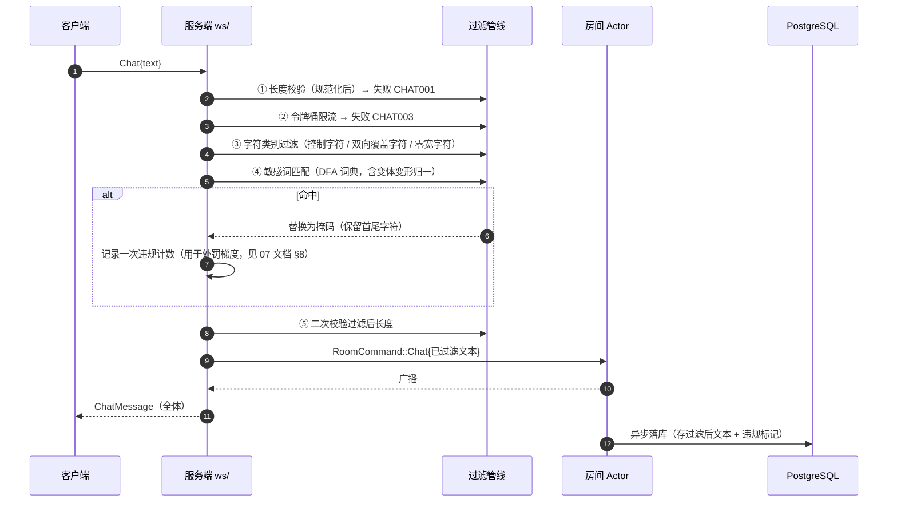

| 设计点 | 说明 |
|---|---|
| **为什么必须在服务端** | 客户端过滤只是 UX 优化（提前提示用户），**不构成任何防护**——改客户端即可绕过。这是与"服务端权威"一致的原则（NFR-S.01） |
| 过滤实现 | DFA（Aho-Corasick 风格）前缀树匹配，词典从 `assets/knowledge/` 加载并支持热更新。**不使用正则**——正则回溯是可被构造出性能陷阱的攻击面 |
| 变形对抗 | 词典匹配前对文本做：① 全角转半角；② 去除零宽字符（U+200B~U+200D、U+FEFF）；③ 常见形近字归一（如 `0`/`O`、`1`/`l`）；④ 简体归一（不做繁简转换，避免误伤） |
| 命中处理 | **掩码替换**（保留首尾各 1 字，中间替换为 `*`），而非整条丢弃。理由：整条丢弃会让发送者以为"消息丢了"而反复重发；掩码能让双方都看到"这里被过滤了"，起到即时反馈作用 |
| 是否提示发送者 | 提示（回 `Error{code:"CHAT002"}` 仅给发送者），让合规用户知道原因 |
| 误判风险与缓解 | ① 词典必须避免"正常词包含敏感词"的过度匹配（例如包含常见姓氏、棋类术语）；② **对局场景专属白名单**：`将`、`杀`、`炮`、`死` 等棋类术语必须白名单化——这是一个高频误判点；③ 上线前必须用真实聊天样本回测误判率（**目标：误判率 ≤ 0.5%，该目标为设计初始值，待实测/校准**） |
| 消息落库 | 存**过滤后**的文本 + 违规标记。**不存原始文本**（降低合规风险），但保留违规计数用于处罚梯度 |
| 日志脱敏 | 聊天内容不进 `INFO` 日志（[01-需求规格](01-需求规格说明书.md) NFR-S.10 精神） |

> **棋类术语白名单是必须项，不是可选项**：中国象棋的聊天高频词天然包含攻击性词汇（"吃掉你的马"、"一步杀"、"困死你"）。通用敏感词库直接套用会造成大量误判，必须维护一份**领域白名单 + 上下文豁免规则**，并把它纳入测试用例集（见 §14 测试清单）。

---

## 11. 错误码全表

编码规范沿用 [02-系统架构](02-系统架构设计.md) §10：`{域}{三位序号}`，域为大写字母短码，序号从 `001` 起单调分配、**永不复用**（即使某码废弃，其编号不再分配给新含义，避免旧客户端误解码）。

### 11.1 已确立的错误码（来自 [02-系统架构](02-系统架构设计.md) §10，含义不变）

| 错误码 | 含义 | 典型触发 |
|---|---|---|
| `AUTH001` | 未认证 | 未发 `Auth` 就发业务帧；token 缺失 |
| `AUTH002` | token 过期 | access token 超过有效期 |
| `AUTH003` | 密码强度不足 | 注册/改密时的密码校验（REST 侧） |
| `GAME001` | 非法着法 | 违反走子规则（蹩马腿、炮架不对等） |
| `GAME002` | 未轮到该方走子 | `expected_side` 与服务端不一致 |
| `GAME003` | 对局已结束 | 终局后仍发 `MoveRequest` |
| `ROOM001` | 房间不存在 | `RoomJoin` 的 `room_id` 无效或已回收 |
| `ROOM002` | 房间已满 | 两个座位均已占用 |
| `ROOM003` | 房间已开局 | 对局进行中尝试入座 |
| `RATE001` | 请求过于频繁 | 通用接口限流（建房、走子、登录） |

### 11.2 认证与账号（`AUTH`）

| 错误码 | 含义 | 触发条件 | 客户端处置 |
|---|---|---|---|
| `AUTH004` | refresh token 无效或已被撤销 | 刷新时 token 不在白名单；已被登出 | 跳登录页 |
| `AUTH005` | 账号已被封禁 | 封禁期内尝试登录/连接 | 展示封禁原因与申诉入口（[07-匹配排行榜](07-匹配排行榜与反作弊.md) §8） |
| `AUTH006` | 凭据格式非法 | JWT 结构错误、签名算法不符、缺少必需声明 | 跳登录页（并上报，可能是客户端版本问题） |
| `AUTH007` | 认证超时 | 连接建立后 **30 秒**内未发送 `Auth`（**设计初始值，待实测/校准**） | 重新连接 |

### 11.3 会话与连接（`SESS`）

| 错误码 | 含义 | 触发条件 | 客户端处置 |
|---|---|---|---|
| `SESS001` | 心跳超时 | 连续 3 个 Ping 周期（45 s）无任何入站帧 | 触发重连（§6.2） |
| `SESS002` | 会话不存在或已过期 | `Resume` 的 `session_token` 已过 TTL | 放弃恢复，返回大厅 |
| `SESS003` | 协议版本不兼容 | 见 §1.4 | 提示升级客户端（不重连） |
| `SESS004` | 规则版本不兼容 | 双方或客户端与服务端 `rules_version` 不一致 | 禁用计分对局入口，提示升级 |
| `SESS005` | 会话已被新连接接管（顶号） | 同一 `player_id` 在新连接上鉴权成功 | 提示"账号在其他设备登录"，不自动重连 |
| `SESS006` | 帧体积超限 | 入站帧 > 64 KiB | 上报异常；客户端自身实现缺陷 |
| `SESS007` | 帧格式非法 | JSON 解析失败、缺少必需字段、枚举值非法（且非未知类型的兼容情形） | **不重连**，上报异常（可能是协议实现 bug） |
| `SESS008` | 房间归属在其他实例 | 多实例部署且本实例不持有该房间 | 客户端按负载均衡重定向策略重新建连（§6.6） |
| `SESS009` | 连接数超过上限 | 单 `player_id` 并发连接超过 **3**（**设计初始值，待实测/校准**） | 提示关闭其他客户端 |

### 11.4 对局与规则（`GAME`）

| 错误码 | 含义 | 触发条件 | 客户端处置 |
|---|---|---|---|
| `GAME004` | 着法坐标格式非法 | `MoveDto.from/to` 无法解析为 ICCS，或超出棋盘范围 | 上报异常 + 回滚 |
| `GAME005` | 着法不属于当前局面 | 起点无子、起点是对方棋子、目标与起点相同 | 回滚 + 提示 |
| `GAME006` | 对局尚未开始 | 在 `Waiting`/`Ready` 状态发 `MoveRequest` | 忽略（通常是自己 UI 状态错误） |
| `GAME007` | 客户端局面与服务端不一致 | `client_move_no` 跳跃，或 FEN 校验失败 | **整盘替换**为 `snapshot` |
| `GAME008` | 着法序号冲突 | 同一 `client_move_no` 出现两种不同着法内容 | 整盘重同步 + 上报（可能被篡改） |
| `GAME009` | 服务端裁决异常（兜底） | 规则引擎返回内部错误 | 整盘重同步；服务端侧记 ERROR 日志 |
| `GAME010` | 悔棋次数已用尽 | 该方 3 次悔棋已用完 | 提示，禁用悔棋按钮 |
| `GAME011` | 无待决的请求 / 请求已超时撤销 | 应答一个不存在或已过期的 `request_id` | 关闭对应弹窗 |
| `GAME012` | 当前不允许该操作 | 房间关闭悔棋；悔棋目标超出范围；非 `Playing` 状态 | 提示，禁用入口 |
| `GAME013` | 提和次数已用尽 | 该方 3 次提和已用完 | 提示，禁用求和按钮 |
| `GAME014` | 操作过于频繁（对局内） | 待决求和未解决时再提和；同类请求冷却未结束 | 提示稍后重试 |
| `GAME015` | 不能对自己发起的请求作答 | 请求方发送 `UndoRespond` / `DrawRespond` | 忽略（UI 状态错误） |
| `GAME016` | 本步已超过时限但被宽限接受（**警告级**） | 见 §7.4 | **仅提示，不阻断**；UI 用警告色而非错误色 |

### 11.5 房间（`ROOM`）

| 错误码 | 含义 | 触发条件 | 客户端处置 |
|---|---|---|---|
| `ROOM004` | 房间已关闭 | 房间已销毁或对局记录不可恢复 | 退出到大厅 |
| `ROOM005` | 已在其他房间中 | 同一玩家同时只能在一个房间 | 提示并跳转到所在房间 |
| `ROOM006` | 房间号格式非法 | 非 6 位数字 | 输入框即时提示（客户端可先行校验） |
| `ROOM007` | 无权操作该房间 | 非房主尝试改配置/关闭房间 | 提示，隐藏对应按钮 |
| `ROOM008` | 房间配置非法 | 局时/步时/席位保留时长越界 | 提示并回退到缺省配置 |
| `ROOM009` | 观战席位已满 | `spectator_count >= spectator_limit` | 提示，禁用观战入口 |
| `ROOM010` | 该房间不支持观战 | `config.allow_spectators == false` | 提示 |
| `ROOM011` | 不允许观战自己的对局 | 见 §8.5 | 提示 |

### 11.6 聊天（`CHAT`）

| 错误码 | 含义 | 触发条件 | 客户端处置 |
|---|---|---|---|
| `CHAT001` | 消息为空或超长 | 空/纯空白；规范化后 > 200 字符 | 输入框即时提示 |
| `CHAT002` | 消息包含被禁止内容 | 敏感词命中 | 提示（消息已掩码广播，不重复发送） |
| `CHAT003` | 发送过于频繁 | 令牌桶耗尽 | 提示并进入本地冷却显示 |
| `CHAT004` | 聊天不可用 | 不在房间内；对局已结束且房间即将关闭 | 禁用输入框 |

### 11.7 限流与配额（`RATE`）

| 错误码 | 含义 | 触发条件 | 客户端处置 |
|---|---|---|---|
| `RATE001` | 请求过于频繁 | 通用接口限流（[02-系统架构](02-系统架构设计.md) §10 定义） | 退避后重试，提示"操作太快" |
| `RATE002` | 并发连接数超限 | 见 `SESS009` 的补充场景（IP 维度限制） | 提示 |
| `RATE003` | 每日资源配额已用尽 | 讲解 LLM 日预算熔断（[ADR-004](14-决策记录ADR.md#adr-004)）；提示次数配额 | 提示并自动降级到本地模板 |

### 11.8 匹配（`MATCH`）

| 错误码 | 含义 | 触发条件 | 客户端处置 |
|---|---|---|---|
| `MATCH001` | 已在匹配队列中 | 重复 `MatchEnqueue` | 忽略（幂等） |
| `MATCH002` | 当前不可匹配 | 在对局中；被临时禁赛；`rules_version` 不一致 | 提示原因 |
| `MATCH003` | 不在匹配队列中 | `MatchCancel` 时本就不在队列 | 忽略（幂等） |
| `MATCH004` | 匹配已取消 | 客户端收到 `MatchFound` 前已取消 | 关闭匹配界面 |

### 11.9 系统（`SYS`）

| 错误码 | 含义 | 触发条件 | 客户端处置 |
|---|---|---|---|
| `SYS001` | 服务内部错误（兜底） | 未归类的内部异常 | 提示"服务异常"，可重试 |
| `SYS002` | 依赖不可用 | PostgreSQL / Redis 不可达 | 提示"服务维护中"，**退避重连** |
| `SYS003` | 服务过载，拒绝新连接 | 连接数达上限或正在发布 | 退避重连（指数退避上限可缩短到 10 s，因为这是短暂状态） |

### 11.10 错误码使用原则

| 原则 | 说明 |
|---|---|
| 一个错误码只表达一种含义 | 不复用。宁可多分配编号，也不要让客户端需要靠 `message` 区分语义 |
| 客户端必须处理"未知错误码" | 遇到未知码时**按通用错误提示**，不崩溃、不断连（[02-系统架构](02-系统架构设计.md) §10 原则 3） |
| 码与文案分离 | 服务端下发 `code` 与 `message`，客户端**优先用本地 i18n 映射**渲染文案，`message` 仅作兜底（避免服务端文案变更导致客户端 UI 不一致） |
| 面向用户的文案不含内部细节 | 永不包含堆栈、SQL、文件路径、内部 FEN（NFR-S.07 与 [02-系统架构](02-系统架构设计.md) §10 原则 1） |
| 服务端日志保留完整上下文 | 含 `request_id` / `player_id` / `room_id` / `game_id`，便于用户报障后定位（NFR-M.04） |
| 反向映射必须穷尽 | `#[non_exhaustive]` 的协议枚举配套 `fn from_code(s: &str) -> Self`，实现必须包含"未知 → 通用错误"分支并有单元测试 |

---
## 12. 顺序与幂等保证

### 12.1 分层保证表

| 层次 | 保证 | 手段 |
|---|---|---|
| **传输层（TCP）** | 单连接内**字节流有序、不丢、不重** | TCP 本身。WS 建立在 TCP 上，因此**单连接内不会出现帧乱序或帧丢失** |
| **应用层（业务）** | 跨连接的状态有序 | `seq` 单调递增 + 客户端丢弃 `seq ≤ local_last_seq` |
| **应用层（幂等）** | 同一请求重复到达不产生重复副作用 | `client_move_no` 幂等键；`request_id` 幂等键 |
| **断线恢复** | 跨连接的状态连续 | 全量快照 + `XRANGE (last_seq + 1)` 增量补帧 |

> **一个重要推论**：既然单连接内 TCP 已保证有序不丢，为什么还需要 `seq`？
>
> 因为**断线重连意味着换了一条 TCP 连接**。`seq` 解决的是**跨连接**的顺序与缺失问题，而不是单连接内部的问题。这一点必须清晰，否则会写出"为了防乱序而加序列号"的冗余逻辑（单连接内做乱序重组是纯粹的浪费）。

### 12.2 乱序、重复、丢失的处理矩阵

| 事件 | 是否可能发生 | 检测方式 | 处理 |
|---|---|---|---|
| 单连接内帧乱序 | ❌ 不可能（TCP 保证） | — | 无需处理。客户端仍按到达顺序处理即可 |
| 单连接内帧重复 | ❌ 不可能（TCP 保证） | — | 无需处理 |
| 单连接内帧丢失 | ❌ 不可能（TCP 重传保证） | — | 无需处理 |
| **跨连接的帧重复**（重连后补帧与实时流重叠） | ✅ 可能 | `seq <= local_last_seq` | 丢弃，不产生副作用。**这是 `seq` 最核心的用途** |
| **跨连接的帧缺失**（断线期间的着法） | ✅ 必然发生 | `seq > local_last_seq + 1` | 立即发起 `Resume{last_seq: local_last_seq}` 补帧 |
| 连接彻底断开，`MoveRequest` 未被服务端收到 | ✅ 可能 | `pending` 超时（10 s）无对应裁决帧 | 发起 `Resume`；**不重发 `MoveRequest`**（若服务端实际收到了，重发会触发 `GAME008`） |
| 连接彻底断开，`MoveRequest` 已被服务端收到并裁决 | ✅ 可能 | 恢复后补帧中出现对应的 `MoveApplied` | 客户端清除 `pending` 标记，正常接受该帧 |
| 客户端先做了乐观更新，但服务端裁决为其他着法 | ✅ 极小概率 | 补帧中的 `MoveApplied` 与该着法不符 | 以服务端为准整体重放（客户端不应"打补丁"，而应重放整条链） |
| 服务端发出的帧客户端未收到（连接恰在此刻断） | ✅ 可能 | 重连后 `seq` 跳跃 | 补帧（同"帧缺失"） |
| `CoachNote` 丢失或乱序 | ✅ 可能 | — | **不处理**。讲解是可丢的（§3.3.11），`move_no` 关联保证了"最多没有讲解"，不会导致状态错误 |
| `ChatMessage` 乱序 | ✅ 可能 | 客户端可按 `server_ts_ms` 排序 | 轻量排序即可，不要求强一致（聊天无状态影响） |
| `ClockSync` 过期 | ✅ 可能（补帧期间到达旧的同步） | `sync.seq < local_last_seq` | 丢弃，避免用旧时钟覆盖新状态（§3.3.3） |

### 12.3 客户端状态机的幂等实现要点

| 要点 | 说明 |
|---|---|
| **单一入口** | 所有服务端帧必须经过一个 `apply_frame(&mut self, frame: ServerFrame)` 函数，在其中统一做 `seq` 门禁。**禁止**在 UI 层各处分派帧并各自去重 |
| **状态推进是幂等的** | `apply_frame` 必须满足：对同一帧调用 N 次与调用 1 次结果相同。这是可测试的性质（用 `proptest` 对随机帧序列做"重复调用不改变状态"的检查） |
| **拒绝"打补丁"式修复** | 发现 FEN 不一致时，**整盘替换**而非逐项修补。打补丁是隐藏 bug 的温床——它把"为什么会不一致"这个问题掩盖了 |
| **乐观更新的可见性** | 乐观更新只影响**渲染层**，不进入"权威状态"。即本地维护两份状态：`authoritative`（只由 `apply_frame` 修改）与 `display`（= `authoritative` + 待确认的乐观着法）。这是实现 `MoveRejected` 回滚的关键——回滚 = 丢弃 `display` 的乐观部分，不需要"反向操作" |

```rust
// crates/xq-client/src/game_state.rs（结构示意）
use xq_protocol::ServerFrame;

/// 客户端对局状态：权威层与展示层分离。
pub struct LocalGame {
    /// 只由 `apply_frame` 修改，与服务端严格对齐。
    authoritative: GameState,
    /// 最近一次乐观更新（尚未被服务端确认）。`None` 表示无待确认着法。
    pending_optimistic: Option<PendingMove>,
    /// 本地已连续应用的最大 seq。
    last_seq: u64,
}

pub struct GameState {
    pub fen: String,
    pub side_to_move: xq_core::Color,
    pub moves: Vec<xq_protocol::dto::MoveRecordDto>,
    pub seq: u64,
}

pub struct PendingMove {
    pub client_move_no: u32,
    pub mv: xq_protocol::dto::MoveDto,
    pub sent_at_ms: u64,
}

/// 帧应用的唯一入口。返回值表示该帧是否实际改变了权威状态。
#[must_use]
pub fn apply_frame(local: &mut LocalGame, frame: &ServerFrame) -> bool {
    match frame {
        ServerFrame::MoveApplied { seq, .. } | ServerFrame::SnapshotComplete { seq, .. } => {
            // 门禁：只有严格更大的 seq 才允许改变权威状态。重复调用因此天然幂等。
            if *seq <= local.last_seq {
                return false;
            }
        }
        _ => {}
    }
    // 此处按帧类型更新 local.authoritative / local.last_seq / 清除 pending_optimistic ...
    true
}
```

> 上面是**结构示意**，未包含全部字段与分支；其价值在于明确三条不变量：①`apply_frame` 是唯一入口；②`seq` 门禁在任何状态变更之前；③`pending` 与 `authoritative` 分离。

---

## 13. 协议演进

### 13.1 向后兼容的要求

> **硬要求：客户端必须优雅忽略未知帧类型与未知字段，服务端的同一要求同样成立。**

| 变更类型 | 是否兼容 | 处理方式 |
|---|---|---|
| **新增帧类型** | ✅ 向后兼容 | 服务端可先行上线。旧客户端反序列化得到 `Unknown` 变体，**忽略即可**（§3.2 的 `#[serde(other)]` 提供了类型层面的强制保障）；旧服务端收到新客户端的新帧则回 `SESS007`（可观测，便于灰度统计） |
| **新增可选字段** | ✅ 向后兼容 | 新字段必须带 `#[serde(default)]`，否则旧客户端反序列化失败。**这是最容易被违反的规则**，必须在 code review 清单中明确 |
| **为已有字段增加枚举取值** | ✅ 向后兼容（有条件） | 客户端遇到未知枚举值必须按"未知"处理，**不得 panic / 不得拒绝整帧**。实现要求：客户端的枚举反序列化统一使用"未知 → 兜底变体"模式，而非 `serde` 的严格模式 |
| **删除字段** | ⚠️ 需谨慎 | 服务端停止下发该字段 → 旧客户端的 `Option<T>` 变成 `None`，必须已处理该情形。**禁止**直接删除客户端仍在读取的必需字段 |
| **重命名字段 / 改变字段类型 / 改变字段语义** | ❌ 破坏性 | 必须递增 `PROTOCOL_VERSION` 的 MAJOR 位，并在服务端声明新的版本区间 |
| **删除帧类型** | ❌ 破坏性 | 同上传 MAJOR。且需先经过"废弃期"（服务端仍可接收但记 WARN 日志），再在下一个 MAJOR 版本移除 |
| **改变错误码含义** | ❌ 破坏性 | 错误码编号**永不复用**（§11 开头），新增含义用新编号 |

### 13.2 演进流程

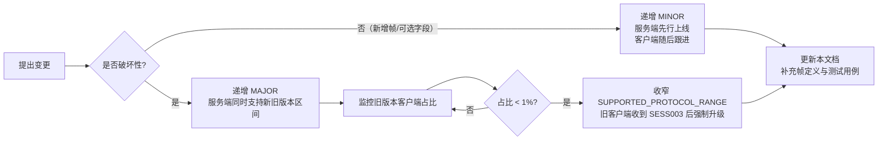

| 阶段要求 | 说明 |
|---|---|
| 服务端先行 | 因为客户端更新无法强制（用户可能长期不升级），服务端必须能同时处理新旧请求。这正是"未知帧必须被忽略"的意义所在 |
| 客户端跟进 | 客户端可以在新版本中开始使用新帧，但**必须**处理"服务端尚未支持"的情形（收到 `SESS007` 或帧被忽略时降级功能） |
| 强制升级的最后手段 | 仅当旧版本存在**安全漏洞或计分公平问题**时才收窄版本区间。普通功能迭代不应强制升级 |
| 灰度分组 | 服务端按 `client_version` 打标，新功能可先对内部账号开放（`capabilities` 协商提供了机制支撑） |
| 文档同步 | 每个协议变更必须同时更新本文与 `xq-protocol` 的 rustdoc，并在 §14 的测试清单中补充对应用例 |

### 13.3 兼容性测试要求

| 测试 | 方法 |
|---|---|
| **前向兼容**（新服务端 + 旧客户端） | 用一份"冻结的旧版本帧快照"（`insta` 快照测试）验证新服务端仍能下发旧客户端可解析的帧 |
| **后向兼容**（旧服务端 + 新客户端） | 构造含未知帧类型与未知字段的 JSON，验证客户端反序列化为 `Unknown` 且不 panic |
| **未知字段容忍** | 在每一个既有帧的 JSON 示例中注入 `"__future_field": 1`，断言解析成功且字段被忽略 |
| **未知枚举值容忍** | 将 `status.kind` 改为 `"some_future_terminal"`，断言客户端展示"未知状态"而非崩溃 |
| **缺失可选字段** | 从 JSON 中删除所有 `#[serde(default)]` 字段，断言解析成功 |

---

## 14. 协议测试要点

以下清单是 M2 里程碑（联网可下）的验收依据，每条都必须有自动化测试覆盖。

### 14.1 帧编解码（单元测试 + 快照测试）

| # | 用例 | 断言 |
|---|---|---|
| 1 | 每个 `ClientFrame` / `ServerFrame` 变体的 JSON 往返 | 序列化 → 反序列化 → 与原值相等 |
| 2 | 每个帧的 JSON 示例（本文档中的示例）用 `insta` 做快照 | 示例与实现输出逐字节一致（防止文档漂移） |
| 3 | 未知帧类型 `{"type":"__future_frame"}` | 解析为 `Unknown`，不报错 |
| 4 | 未知字段注入 | 解析成功且字段被忽略 |
| 5 | 缺少所有可选字段 | 解析成功，取缺省值 |
| 6 | `MoveDto` 坐标越界（`"z9"`、`"a10"`、`""`） | 解析或校验失败 → `GAME004` |
| 7 | `iccs_to_square` 与 `square_to_iccs` 往返 | 对全部 90 格往返无损（`proptest`） |
| 8 | 超大帧（> 64 KiB） | 服务端回 `SESS006` 并关闭 |
| 9 | 非 UTF-8 字节序列 / 非法 JSON | 回 `SESS007`，不断连 |
| 10 | 信封 `rid` 回填 | 响应帧的 `rid` 与请求一致 |

### 14.2 连接生命周期

| # | 用例 | 断言 |
|---|---|---|
| 11 | 未发 `Hello` 直接发 `Auth` | 回 `SESS003` 并关闭 |
| 12 | `protocol_version` 高于服务端 | 回 `SESS003` |
| 13 | `protocol_version` 在支持区间内 | 握手成功 |
| 14 | `rules_version` 不一致时尝试 `RoomCreate{rated:true}` | 回 `SESS004` |
| 15 | `Auth` 超时（30 s 内未发） | 回 `AUTH007` 并关闭 |
| 16 | 同一账号第二次连接建连 | 旧连接收 `SESS005` 被关闭，新连接正常 |
| 17 | 心跳：服务端 Ping 每 15 s，客户端回 Pong | 45 s 内连接保持 |
| 18 | 心跳：客户端不回 Pong 也不发任何帧 | 45 s 后服务端关闭连接（`SESS001` 场景） |
| 19 | 心跳：客户端只发 Ping 不回应用层 `Heartbeat` | 连接**不**被关闭（原生化 Pong 已足够） |
| 20 | 优雅关闭：客户端发 `Close` | 服务端立即释放会话与席位的对应关系 |
| 21 | 服务端重启发 `CloseCode::Restart` | 客户端**立即**重连（不等退避） |

### 14.3 房间状态机

| # | 用例 | 断言 |
|---|---|---|
| 22 | T1 建房 → `Waiting` | `RoomCreated` 下发，房间号 6 位，Redis 归属键存在且 TTL = 7200 |
| 23 | T2 加入满员房间 | 回 `ROOM002` |
| 24 | T2 加入已开局房间 | 回 `ROOM003` |
| 25 | T3 双方准备 → `Ready` | 收到 `Countdown{starts_in_ms: 3000}` |
| 26 | T4 倒计时内取消准备 | 回到 `Waiting`，倒计时被取消（3 s 后**不**出现 `GameStart`） |
| 27 | T5 倒计时结束 → `Playing` | `GameStart` 下发，双方颜色已分配，`seq == 0` |
| 28 | T6 倒计时内一方离房 | 另一方收 `ROOM004`，房间被销毁 |
| 29 | T7 对局中断线 → `Paused` | 另一方收到断线提示；`game` 记录未被标记结束 |
| 30 | T8 120 s 内重连 → `Playing` | 快照 + 补帧成功，时钟与连接前连续 |
| 31 | T9 超过 120 s | 断线方判负（`disconnect_forfeit`），双方收 `GameOver` |
| 32 | T10 走子后终局 | `MoveApplied.status` 非 `ongoing`，随后收到 `GameOver` |
| 33 | T10 认输 | `GameStatusDto::Resigned`，输方为认输者 |
| 34 | T10 求和被接受 | `DrawResolved{accepted:true}`，随后 `GameOver{Draw{MutualAgreement}}` |
| 35 | T13 空闲 900 s | 房间被回收，Redis 键消失 |
| 36 | 状态机非法转移（如 `Finished` 后发 `MoveRequest`） | 回 `GAME003`，不改变状态 |
| 37 | 房主离房但房间有他人 | 房间不关闭，房主身份转移（或按产品定义处理）——**需在实现前明确规则** |

### 14.4 走子、`seq` 与幂等

| # | 用例 | 断言 |
|---|---|---|
| 38 | 正常走子 | `MoveApplied.seq == 1`，`notation` 正确，时钟已扣除 |
| 39 | 重复发送同一 `MoveRequest`（相同 `client_move_no` + 相同内容） | 局面**不**改变，服务端重发同一 `MoveApplied` |
| 40 | 同一 `client_move_no` + **不同**内容 | 回 `GAME008` |
| 41 | `client_move_no` 跳跃（如从 1 直接发 3） | 回 `GAME007` 且携带 `snapshot` |
| 42 | 非法着法（蹩马腿） | 回 `GAME001` |
| 43 | 走对方棋子 | 回 `GAME005` |
| 44 | 非本方回合走子 | 回 `GAME002` |
| 45 | 客户端篡改：发送"一步吃对面将"的非法着法 | 被 `GAME001` 拒绝，对局状态不变（NFR-S.01 的验证用例） |
| 46 | 构造 100 步随机合法对局（`proptest` + `xq-ai` 自对弈） | 全程无 `MoveRejected`，`seq` 连续无跳号（覆盖率最强的回归） |
| 47 | 客户端本地 FEN 与服务端不一致时继续走子 | 收到 `GAME007` + `snapshot`，整盘替换后恢复正常 |
| 48 | 客户端收到乱序 `seq`（构造 `seq+2`） | 触发 `Resume`，补帧后状态连续 |
| 49 | 客户端重复收到同一 `seq` 帧（构造重复下发） | 第二次被丢弃，状态不变（`apply_frame` 幂等性测试） |

### 14.5 断线重连

| # | 用例 | 断言 |
|---|---|---|
| 50 | 随机杀客户端进程 50 次（对局中） | 恢复成功率 **100%**（[01-需求规格](01-需求规格说明书.md) §8.2 准入项） |
| 51 | 断线期间对方走了 10 步后恢复 | 补帧 10 条，全部 `replay: true`，最终 FEN 一致 |
| 52 | 断线期间对局已终局 | 收到 `SessionResumed` + 终局快照，展示终局界面 |
| 53 | 断线期间超过 120 s | 恢复失败，`SESS002`（会话过期），提示对局已判负 |
| 54 | `Resume` 的 `last_seq` 大于服务端当前值（客户端伪造） | 服务端以自身值为准，不补帧，直接 `SessionLive`；客户端状态与快照校验后自我纠正 |
| 55 | `Resume` 的 `last_seq` 为 0（客户端首次恢复） | 下发完整快照 + 全部补帧（上界 1000，超过则仅快照） |
| 56 | 补帧数量超过 1000 | 降级为仅全量快照，`SessionLive.last_seq` 为快照点 |
| 57 | 重复 `Resume` | 幂等，重发完整恢复序列，服务端状态不变 |
| 58 | 退避参数校验 | `reconnect_delay_ms` 在 1~10 次尝试下均落在 ±20% 区间内（§6.2 的单元测试） |
| 59 | 网络抖动注入（丢包 30%、延迟 200 ms ± 100 ms）下重连 100 次 | 成功率 ≥ 99%，恢复耗时 P95 ≤ 5 s |
| 60 | 多实例部署下重连到非归属实例 | 回 `SESS008`，客户端重新建连后成功 |

### 14.6 计时与时钟

§7.6 已列出 12 条核心用例（编号 1~12），此处补充协议层相关：

| # | 用例 | 断言 |
|---|---|---|
| 61 | `ClockSync` 每 5 s 到达 | 到达间隔在 4.5~5.5 s 之间（允许调度抖动） |
| 62 | 走子后立即收到 `ClockSync` | 无需等下一个 5 s 周期 |
| 63 | 补帧期间收到过期 `ClockSync`（`seq` 更小） | 被客户端丢弃，显示不倒退 |
| 64 | 客户端时钟偏移估计 | 注入固定 300 ms 单向延迟后，偏移估计误差 ≤ 50 ms（EMA 收敛后） |
| 65 | 客户端改系统时间 | 显示不受影响（使用单调时钟） |
| 66 | 服务端 `XRANGE` 补帧区间边界 | 起始为开区间，不重复下发 `last_seq` 那一帧 |

### 14.7 观战

| # | 用例 | 断言 |
|---|---|---|
| 67 | 订阅允许观战的房间 | 收到 `SpectateSubscribed{delay_ms: 3000}` 与实时快照 |
| 68 | 观战帧延迟实测 | 从对局方走子到观战者收到帧的时间差 ∈ [3000, 4000) ms（§8.3 的 1 秒量化误差上界） |
| 69 | 第 50 人订阅成功、第 51 人失败 | 第 51 人收 `ROOM009`；`spectator_count` 恒 ≤ 50 |
| 70 | 观战者直接杀进程（不退订） | 服务端自动摘除订阅，`spectator_count` 递减（**幽灵观战者**防护） |
| 71 | 观战者尝试发送 `MoveRequest` | 回 `GAME012` 或忽略；对局状态**不受任何影响**（FR-06.06） |
| 72 | 观战者高频订阅/退订（每分钟 11 次） | 第 11 次收 `RATE001` |
| 73 | 延迟分片队列的边界（§8.3 的两个单元测试） | 延迟恰为 3 秒；分片内 FIFO |
| 74 | 3 秒延迟的**不可绕过性**：所有可下发路径逐一审计 | 断言"不存在任何绕过延迟队列直接向观战连接写帧的代码路径"（建议用 `#![deny]` 级别的模块可见性约束 + code review 清单保证） |
| 75 | 跨实例观战（多实例） | 帧通过 Redis Pub/Sub 转发，延迟仍 ≥ 3 s |
| 76 | 观战者订阅不允许观战的房间 | 回 `ROOM010` |
| 77 | 同一账号观战自己的对局 | 回 `ROOM011` |

### 14.8 悔棋 / 求和 / 认输 / 聊天

| # | 用例 | 断言 |
|---|---|---|
| 78 | 悔棋流程（双方同意） | 局面回滚到目标着法前，时钟回滚，教练历史回滚，`seq` 递增 |
| 79 | 悔棋被拒绝 | 局面不变，请求方配额已扣（不返还） |
| 80 | 悔棋第 4 次 | 回 `GAME010` |
| 81 | 悔棋超时 30 s | 双方收 `Resolved{accepted:false, code:"GAME011"}`，配额不返还 |
| 82 | 悔棋待决期间对方走子 | 请求自动取消，**配额返还** |
| 83 | 请求方自己应答 | 回 `GAME015` |
| 84 | 求和第 4 次 | 回 `GAME013` |
| 85 | 求和被拒绝后立即再提 | 允许（拒绝不消耗对方配额），但受 `GAME014` 冷却约束 |
| 86 | 认输 | 立即终局，无二次确认（客户端侧做确认弹窗） |
| 87 | 聊天长度边界（200 / 201 字符，含中文与 emoji） | 200 通过，201 回 `CHAT001`（按 Unicode 标量值计数） |
| 88 | 聊天含控制字符 / 零宽字符 | 被过滤后广播，不破坏客户端渲染 |
| 89 | 聊天敏感词 | 掩码替换 + 提示发送者 `CHAT002` + 违规计数 +1 |
| 90 | 聊天令牌桶（连发 6 条） | 第 6 条回 `CHAT003` |
| 91 | 聊天术语白名单（如"这步杀掉你的马"） | **不**被误判（领域白名单回归用例） |
| 92 | 全角/形近字变体绕过 | 归一化后仍被命中 |

### 14.9 协议演进与兼容

| # | 用例 | 断言 |
|---|---|---|
| 93 | 注入未知帧类型（双向） | 双方均忽略，不断连、不回错误 |
| 94 | 注入未知字段 | 解析成功 |
| 95 | 未知枚举取值（`status.kind`） | 客户端展示"未知状态"，不 panic |
| 96 | 旧版本帧快照回归（`insta`） | 新服务端仍能产出旧客户端可解析的帧 |
| 97 | 删除任一 `#[serde(default)]` 属性的检测 | CI 静态检查：所有新增字段必须带 `default`（可用自定义 lint 或 review 清单强制） |

### 14.10 压测与容量（性能类，非功能正确性）

| # | 场景 | 目标 |
|---|---|---|
| 98 | 5000 并发 WS 连接 / 2500 并发对局 | P99 房间操作 ≤ 100 ms（[01-需求规格](01-需求规格说明书.md) NFR-P.07） |
| 99 | 同上 + 50 观战者/房间（12.5 万观战连接） | 服务不崩溃；内存占用在容量规划内（§8.4 的 1 GB 估算**必须**被实测验证） |
| 100 | 走棋端到端延迟 | P95 ≤ 150 ms（NFR-P.05） |
| 101 | 心跳开销实测 | 帧速率、带宽占用与 §2.2 的推算吻合（若不吻合，说明推算有误，需修正文档） |
| 102 | 观战延迟队列的内存与 tick 开销 | `pending()` 各分片积压深度稳定（不无界增长） |

---

## 附录 A：文档内参数速查

标注 ★ 的为「设计初始值，待实测/校准」。

| 参数 | 值 | 出处 |
|---|---|---|
| 原生化 Ping 间隔 | 15 s ★ | §2.2 |
| 失联判定超时 | 45 s ★ | §2.2 |
| 应用层 Heartbeat 间隔 | 30 s | §2.2 |
| `Auth` 超时 | 30 s ★ | §11.3 |
| 最大入站帧 | 64 KiB | §1.2 |
| 快照分片粒度 | 100 条/片 ★ | §6.4 |
| 补帧上界 | 1000 条 ★ | §6.3 |
| 开局倒计时 | 3000 ms ★ | §3.3.4 |
| 悔棋次数 | 3 次/局/方 | §9.2 |
| 提和次数 | 3 次/局/方 | §9.2 |
| 悔棋/求和应答超时 | 30 s ★ | §9.3 |
| `pending` 超时 | 10 s ★ | §5.3 |
| ClockSync 周期 | 5 s | §7.2 |
| 超时宽限窗口 | 500 ms ★ | §7.4 |
| 观战延迟 | 3000 ms | §8.2 |
| 观战上限 | 50 / 房间 | §8.4 |
| 观战订阅限流 | 10 次/分钟 ★ | §8.4 |
| 席位保留时长 | 120 s | §6.5 |
| 重连退避 | 1/2/4/8/16/30 s，±20% | §6.2 |
| 重连计数重置 | 稳定 60 s 后 ★ | §6.2 |
| 聊天长度上限 | 200 字符 ★ | §10.1 |
| 聊天令牌桶 | 5 条 / 补齐 1 条每 2 s ★ | §10.2 |
| 房间空闲超时 | 900 s | §4.3 T13 |
| 单账号并发连接 | 3 ★ | §11.3 |

---

## 附录 B：与其他模块的接口

| 消费方 | 使用的协议能力 |
|---|---|
| `xq-server::ws/` | `ClientEnvelope` / `ServerEnvelope` / 版本协商 / 心跳 / 错误码 |
| `xq-server::room/` | `RoomCommand` 与帧的映射（§4）、`DelayShards`（§8.3） |
| `xq-server::matchmaking/` | `MatchEnqueue` / `MatchFound` 等帧（详见 [07-匹配排行榜](07-匹配排行榜与反作弊.md)） |
| `xq-client::net.rs` | `reconnect_delay_ms`、`DisplayClock`、`apply_frame` |
| 前端（React + Zustand） | 仅通过 Tauri command 间接使用，不直接接触 Rust 类型（[03-规则引擎](03-规则引擎与领域模型.md) §13） |
| [07-匹配排行榜与反作弊](07-匹配排行榜与反作弊.md) | 复用 `MoveRequest.client_ts_ms` 做思考时长统计；复用 `MatchXxx` 帧 |
| [05-战法讲解](05-战法讲解引擎设计.md) | `CoachNote` 帧的 `note` 字段即 `CoachNoteDto`，与 `xq-coach` 输出对齐 |

