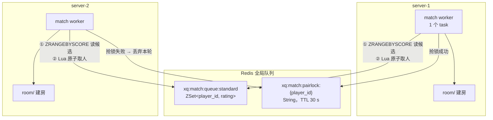
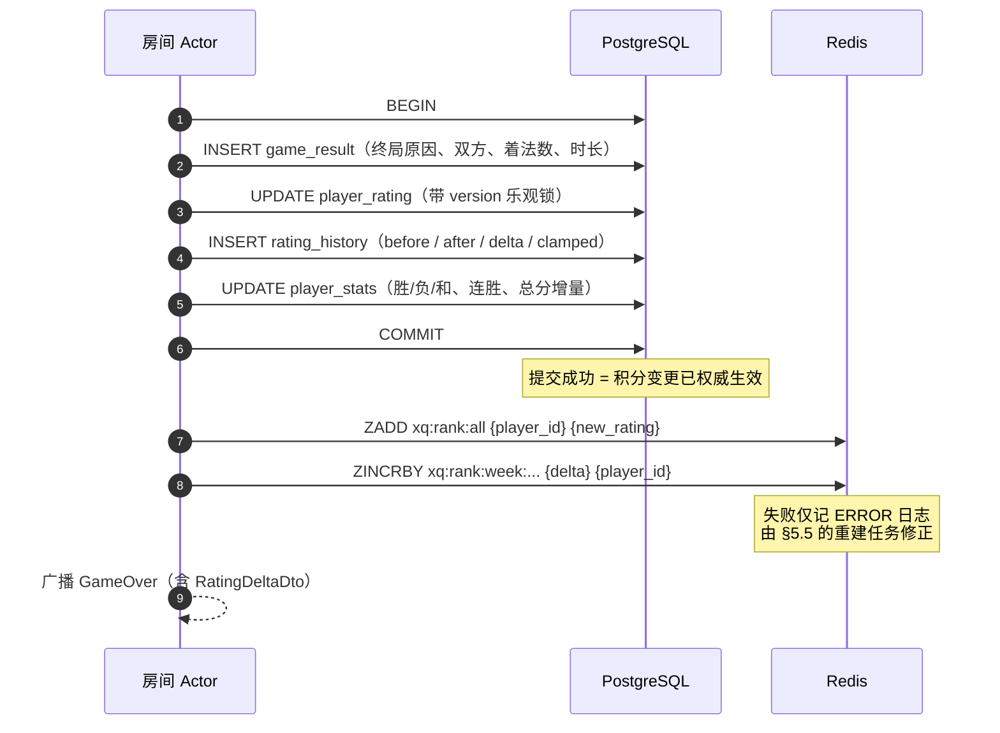
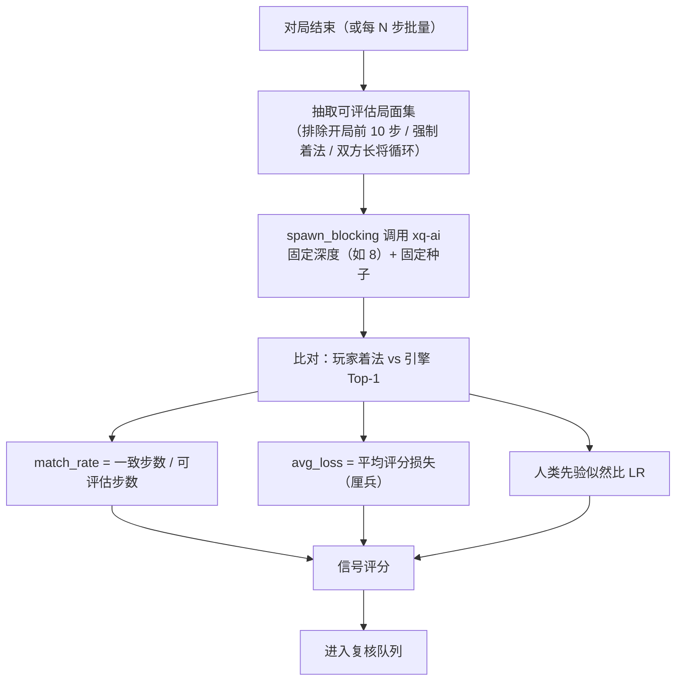
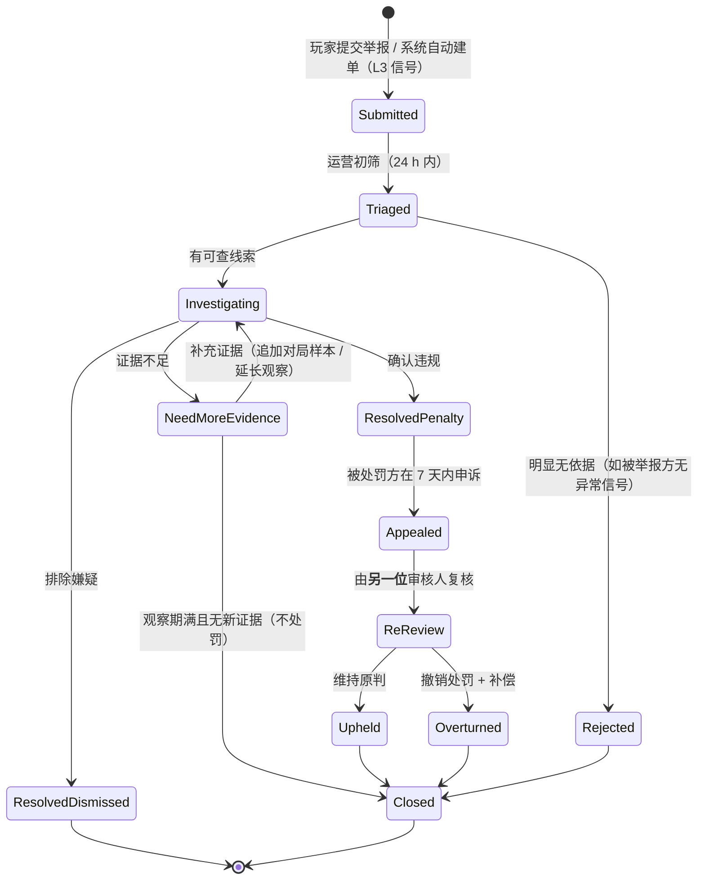
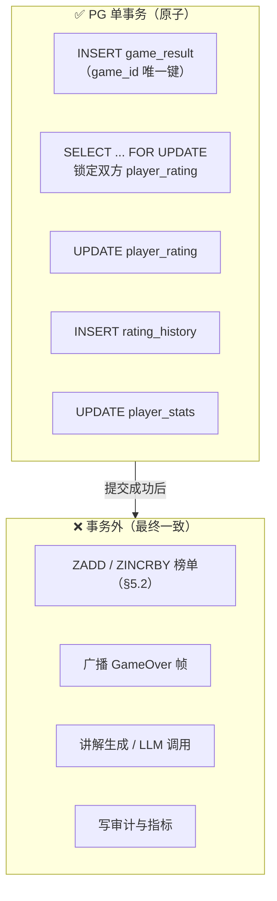

# 07 · 匹配排行榜与反作弊

| 项 | 值 |
|---|---|
| 所属模块 | `xq-server::matchmaking/`（匹配与评分）· `xq-server::store/`（持久化与 Redis）· `xq-server::room/`（对局结束钩子）· `xq-server::observability/`（反作弊指标） |
| 文档版本 | v1.0 |
| 状态 | 设计基线 |
| 编制日期 | 2026-09-23 |
| 关联文档 | [01-需求规格](01-需求规格说明书.md) · [02-系统架构](02-系统架构设计.md) · [03-规则引擎](03-规则引擎与领域模型.md) · [06-联网协议](06-联网对战与实时通信协议.md) · [09-数据模型](09-数据模型与存储设计.md) · [14-ADR](14-决策记录ADR.md) |

> **本文的所有数值参数都必须在有真实对局数据后重新校准。** 目标函数是"匹配成功率 + 分数收敛速度 + 作弊检出率"三者的平衡，这三者都只能靠数据拟合，不能靠直觉设定。凡在本文中标注「设计初始值，待实测/校准」的数字，**一律不得**在面向用户的产品文案、宣传材料或对外承诺中作为既定事实引用。
>
> 本文的 ELO 部分（§1）是**纯数学定义**，其中的公式与演算结果是**确定性正确**的；而 K 值、段位分界、窗口扩张、阈值等**策略参数**才是需要校准的部分。请严格区分这两类内容。

---

## 1. ELO 算法

### 1.1 公式定义

采用经典 Elo 评分体系（Arpad Elo，1960 年代的国际象棋评分标准），初始分 **1500**（[01-需求规格](01-需求规格说明书.md) FR-07.01）。

**期望得分**（Expected Score）：

```
E_A = 1 / (1 + 10^((R_B - R_A) / 400))
E_B = 1 - E_A
```

**得分更新**：

```
R_A' = R_A + K_A × (S_A - E_A)
R_B' = R_B + K_B × (S_B - E_B)
```

| 符号 | 含义 |
|---|---|
| `R_A` / `R_B` | 双方赛前等级分 |
| `E_A` / `E_B` | 期望得分，取值区间 `(0, 1)`，表示"在该分差下的理论胜率" |
| `S_A` / `S_B` | 实际得分：胜 = 1.0，和 = 0.5，负 = 0.0 |
| `K_A` / `K_B` | 敏感度系数，见 §1.3 |

**400 这个常数的含义**：它决定了分差与胜率的映射尺度。取 400 意味着**分差 400 分对应约 90.9% 的理论胜率**（`E = 1 / (1 + 10^-1) = 0.9091`）。这是国际通行的取值，本项目的中国象棋对局**和棋率显著高于国际象棋**，这一差异会影响收敛速度（见 §1.4），但**不影响公式形式**——是否需要在分母上调整常数，必须在校准阶段用真实胜率-分差曲线拟合后才能决定，当前**沿用 400**（**设计初始值，待实测/校准**）。

### 1.2 演算实例（1500 分 vs 1650 分，红方胜）

> 本节的每一个数字都可手工复核，实现后必须与 `elo.rs` 的输出逐位一致（见 §10.1 的单元测试要求）。

**设定**：

| 项 | 值 |
|---|---|
| 玩家 A（红方） | `R_A = 1500`，有效计分对局数 = 12（**新手期**） |
| 玩家 B（黑方） | `R_B = 1650`，有效计分对局数 = 210（**成长期**） |
| 结果 | 红方胜，故 `S_A = 1.0`，`S_B = 0.0` |

**第 1 步：计算期望得分**

```
R_B - R_A = 1650 - 1500 = 150
(R_B - R_A) / 400 = 150 / 400 = 0.375
10^0.375 = 2.371374...（= (10^3)^(1/8) = 1000^(1/8)）
E_A = 1 / (1 + 2.371374) = 1 / 3.371374 = 0.296615...
E_B = 1 - 0.296615 = 0.703385...
```

**第 2 步：确定 K 值**（按 §1.3 的分段策略）

| 玩家 | 有效对局数 | 等级分 | 命中分段 | K |
|---|---|---|---|---|
| A | 12 | 1500 | 对局数 < 30 → **新手期** | **40** |
| B | 210 | 1650 | 对局数 ≥ 30，`1650 < 1800` → **成长期** | **24** |

**第 3 步：计算得分变化**

```
ΔA = K_A × (S_A - E_A) = 40 × (1.0 - 0.296615) = 40 × 0.703385 = 28.13540  → 28
ΔB = K_B × (S_B - E_B) = 24 × (0.0 - 0.703385) = 24 × (-0.703385) = -16.88124 → -17
```

**第 4 步：更新等级分**

```
R_A' = 1500 + 28 = 1528
R_B' = 1650 - 17 = 1633
```

**结果校验**：

| 项 | 计算前 | 计算后 |
|---|---|---|
| A | 1500 | **1528**（+28） |
| B | 1650 | **1633**（−17） |
| 双方总分 | 3150 | **3161**（+11） |

> **⚠️ 刻意保留的"非零和"现象**：双方总分增加了 11 分。原因很简单——**K 值不同时 ELO 不是零和系统**。低 K 值的一方扣分少于高 K 值一方的加分。这不是 bug，而是刻意的取舍：
>
> - **支持"各自 K 值"**：新手能快速脱离 1500 附近，避免长期与其他新手互相消耗（收敛速度优先）。
> - **代价**：系统总分会缓慢通胀。由于分数只用于**相对排序**与**段位展示**，温和通胀不影响公平性；且赛季软重置（§6）会周期性回收。
> - **若需要严格零和**（例如做数学仿真验证，见 §10.2），采用**对称 K 模式**：取双方 K 值中的较小者（或平均值）同时应用于双方。以上例为例，取平均 `K = (40 + 24) / 2 = 32`：
>   ```
>   ΔA = 32 × 0.703384 = 22.508 → +23
>   ΔB = 32 × (-0.703384) = -22.508 → -23
>   ```
>   此时 `1523 + 1627 = 3150`，**严格零和**。实现上把该行为做成 `RatingMode::{Individual, Symmetric}` 两个策略，生产用 `Individual`，仿真与单测用 `Symmetric`。
>
> **实现注意**：`+23` 与 `-23` 来自 `f64::round()` 的"远离零舍入"语义（`22.5_f64.round() == 23.0`）。若改用"截断"，`22.508` 会变成 `22`，双方和就不为 0 了。**舍入规则必须显式测试**（§10.1 用例 6）。

### 1.3 K 值的分段策略

| 分段 | 判定条件（按优先级自上而下匹配） | K 值 | 设计意图 |
|---|---|---|---|
| **新手期** | 有效计分对局数 **< 30** | **40** | 快速把新玩家送到其真实水平附近。前 30 局是"定级期"，K 值高才可能从 1500 移动 300 分以上 |
| **成长期** | 对局数 ≥ 30 且 `R < 1800` | **24** | 主体玩家群。24 是国际棋联对"30 岁以下且 2400 分以下"选手的常用值，兼顾收敛与稳定 |
| **稳定期** | 对局数 ≥ 30 且 `1800 ≤ R < 2200` | **16** | 高水平玩家分数已接近真实水平，降低波动以维持榜单单调性 |
| **高分段** | 对局数 ≥ 30 且 `R ≥ 2200` | **12** | 高分段人数少、对局次数少，小波动会导致排名剧烈变化。国际棋联对 2400+ 选手改用 10，本项目取 12（**设计初始值，待实测/校准**） |

**边界情形处理**：

| 情形 | 处理 |
|---|---|
| 对局数恰为 30 | 走"对局数 ≥ 30"分支（即从第 31 局开始用新 K 值）。**边界必须用测试锁定**（§10.1 用例 5） |
| 等级分恰为 1800 / 2200 | 走**较高**的区间（`1800` 用稳定期 K=16，`2200` 用高分段 K=12）。避免出现"两次对局 K 值反复切换"的振荡 |
| 玩家等级分在缓冲带内振荡（如 1795↔1805） | **允许** K 值随之切换。不做"滞回"设计——K 值差异（24 vs 16）对单局分数的影响不超过 8 分，不足以造成可感知的体验问题，而滞回会引入额外的持久化状态与测试复杂度 |
| 赛季重置后 | 有效对局数为**累计值**（不随赛季重置），K 值分段基于**生涯累计对局数**。理由：赛季重置不该让老玩家重新享受"新手期高 K 值"（否则老玩家会在每个赛季初快速上下浮动，破坏榜单单调性） |
| 对局被反作弊撤销 | **不增加**有效对局数（不消耗定级期配额），避免"通过刷被撤销的对局来延长新手期" |

### 1.4 和棋的处理

和棋取 `S = 0.5`，公式不变。**沿用上例设定**（A = 1500，K = 40；B = 1650，K = 24），结果是**和棋**：

```
E_A = 0.296615（与胜负无关，只取决于赛前分数）
ΔA = 40 × (0.5 - 0.296615) = 40 × 0.203385 = 8.13540  → +8
ΔB = 24 × (0.5 - 0.703385) = 24 × (-0.203385) = -4.88124 → -5
```

更新后：**A = 1508（+8），B = 1645（−5）**。

| 观察 | 说明 |
|---|---|
| 和棋时低分方仍能涨分 | 因为 `S_A = 0.5 > E_A = 0.2966`。这是 ELO 的自洽性：低分方逼和高分方是超出预期的表现 |
| 分差越大，和棋对低分方越有利 | 当 `E_A → 0` 时，和棋给低分方的收益趋近 `0.5 × K` |
| **中国象棋的和棋率问题** | 中国象棋的和棋率明显高于国际象棋（尤其是高手对局，开局体系成熟、攻杀难度大）。这会影响 ELO 的**分数区分度**：和棋越多，同一分差下的信息量越少，收敛越慢 |
| 可能的应对（**尚未决定，需数据支撑**） | ① 提高和棋的分数权重（如 `S = 0.5` 改为 `0.45`，让和棋略微惩罚高分方）——**这会破坏零和性质**；② 对和棋单独使用较小的 K 值（和棋的"信息量"低于胜负）——**更保守，推荐在校准阶段优先评估**；③ 维持现状。**在校准数据出来之前，一律维持 `S = 0.5`**（当前实现选择 ③） |
| 特殊和棋（自然限着、双方长将、子力不足） | 与"双方同意和棋"在评分上**完全等同**，`S = 0.5`，不做区分。理由：规则已经裁定它是和棋，评分系统不该二次解释规则 |
| 因超时判负 / 认输 / 断线判负 | `S` 按胜负计算（胜 = 1，负 = 0）。**不**因为"没有真的被将死"而打折——否则"认输"会成为一种避免扣分的手段 |

### 1.5 分数上下限保护

| 项 | 取值 | 依据 |
|---|---|---|
| 下限 | **800** | 低于此分数已无法与任何对手形成有意义的匹配（也低于段位体系的最低档，见 §4），继续下探无意义 |
| 上限 | **3000** | 为高分留足空间，同时避免数值无界增长导致段位表与排行榜出现空档（**设计初始值，待实测/校准**：需在真实高端对局分布确定后收紧，若实测活跃玩家最高分仅 2400 左右，应下调至 2600） |
| 处理方式 | `R' = clamp(R + Δ, 800, 3000)` | 标准 clamp |
| 溢出部分的处理 | **不转移给对手** | 即"被 clamp 吃掉的分"凭空消失。若转移给对手，会引入"故意垫分从而给对手送分"的刷分路径——这是一个真实存在的作弊手法（见 §7.3 的多账号作弊） |
| 下限保护的附加规则 | 当 `R + Δ < 800` 时，实际扣分 = `R - 800`。**不返还**未扣部分给对手 | 同上 |
| 分数为负的极端情况 | 由下限保证不会出现 |
| 溢出与亏损的记账 | 每次评分变更都写 `rating_history` 表（含 `before` / `after` / `delta` / `clamped` 标记）。`clamped = true` 的记录用于监控"有多少局被 clamp"——若比例过高说明上下限设定不合理 | 可观测性要求 |
| **连败保护** | 连续 5 局失利后，后续每局失利扣分上限为 **−8**（**设计初始值，待实测/校准**） | 目的：缓解"心态崩了连跪"的体验伤害。**风险**：会引入分数通胀，且可能被"故意连败以降低扣分"利用（该手法收益极低但存在）。**上线前必须用仿真评估其对分数分布的影响**（§10.2） |
| **定级期显示** | 前 10 局不算"已定级"，段位显示为「定级中（N/10）」。**积分照常按公式计算**，只是不展示段位 | 纯 UI 层处理，不引入额外评分逻辑。避免"定级期不扣分"这类会破坏分数分布的设计 |

> **上下限保护的分层取舍**：§1.5 的"下限 800"与 §4 的段位表最低档起点都取 800，是为了保持"分数区间 ↔ 段位"的一致映射（段位表覆盖 `[800, 3000]` 全域，无空档）。**这两个数字必须同步维护**，改动其一时必须同时更新段位表与本文档的实施。

### 1.6 有效计分对局与颜色分配

**有效计分对局（rated game）的判定链**（任一条不满足即不计分）：

| # | 条件 | 不满足时的行为 |
|---|---|---|
| 1 | 房间 `config.rated == true` | 不计分（房间对战默认不计分，[06-联网协议](06-联网对战与实时通信协议.md) §3.3.4） |
| 2 | 双方的 `rules_version` 一致 | 不计分（在 T5 已然拒绝开局，见 [06-联网协议](06-联网对战与实时通信协议.md) §4.3） |
| 3 | 双方账号均未被封禁 | 若对局中一方被封禁，该局不计分 |
| 4 | 对局已产生终局判定（非"服务端异常中断"） | 不计分 |
| 5 | 对局未被反作弊判定为无效 | 不计分，且**撤销已发生的积分变动**（§7、§8） |

**低可信标记**（不撤销积分，但降低排行榜权重并进入人工复核队列）：

| 标记条件 | 取值 | 理由 |
|---|---|---|
| 总着法数 < 10 | 10 着 | 正常对局极少在 10 着内结束（除非一方故意送杀） |
| 对局总时长 < 30 秒 | 30 s | 与"毫秒级着法"的反作弊信号重叠 |
| 双方设备指纹相同 | — | 见 §7.3 |
| 双方在同一 IP / 同一 /24 子网 | — | 见 §7.3 |

> **颜色分配**：当前实现为**每次匹配随机分配**（`rand` 显式种子，[ADR-005](14-决策记录ADR.md#adr-005)）。
>
> **已知的公平性问题**：中国象棋先手（红方）优势明显（公开研究普遍认为先手胜率占优，具体数值需用本项目自己的对局数据统计）。若长期纯随机分配，某些玩家会因偶然连续执红而虚高。
>
> **计划的补偿策略**（**尚未实现，标注为待产品与数据决策**）：维护每玩家的 `red_games` / `black_games`，匹配成功时优先把红方分给"执红比例较低"的一方。该策略的**风险**是：① 引入可观测的"颜色分配规律"，可能被人利用（如"知道这局必执黑"从而调整开局库权重）；② 会让本局的红黑优势通过匹配器被"平均化"，但无法通过评分补偿。**在校准"红先胜率"的实测值之前不引入补偿**——先测数据，再决定是否需要补偿，以及补偿的力度。

---

## 2. 匹配队列设计

### 2.1 数据结构与键设计

采用 Redis Sorted Set（[ADR-010](14-决策记录ADR.md#adr-010) 明确"匹配队列 = Sorted Set，score = 等级分"）。

| 键 | 类型 | 成员 | score | TTL |
|---|---|---|---|---|
| `xq:match:queue:{pool}` | ZSet | `player_id` | 等级分 | 无（由成员自身的过期清理保证） |
| `xq:match:meta:{player_id}` | Hash | —（字段式） | — | **300 s** |
| `xq:match:pairlock:{player_id}` | String | `instance_id` | — | **30 s** |

`xq:match:meta:{player_id}` 的字段：

| 字段 | 类型 | 说明 |
|---|---|---|
| `pool` | string | 匹配池，用于取消时定位到正确的 ZSet |
| `rating` | int | 入队时的等级分快照（**用于计算窗口，必须冻结**，见下） |
| `enqueued_at_ms` | int | 入队时刻（服务端时钟），窗口扩张的依据 |
| `room_id` | string? | 若已被匹配，填入目标房间号（取消时用于回滚） |
| `conn_id` | string | 连接标识，用于把匹配结果推回正确的连接 |

| 项 | 设计 | 理由 |
|---|---|---|
| 为什么 score 用**入队时冻结的等级分**而非实时分数 | 队列内的分数不可变 | 若用实时分数，一次对局结束后的分数变动会改变队列中所有相关玩家的检索位置，逻辑将不可推理。**入队即在队**，队列里的分数就是入队时刻的分数 |
| 为什么不用 `zset` 的成员过期（Redis 无此能力） | 用 `xq:match:meta` 的 TTL + 定时清理任务 | Redis ZSet 无逐成员 TTL。`meta` 的 TTL 保证玩家崩溃后不会永久滞留；清理任务每 **10 s** 扫描一次（**设计初始值，待实测/校准**），把"`meta` 已消失但仍在 ZSet"的成员 `ZREM` 掉 |
| `pool` 划分 | `standard`（标准，局时 600 s / 步时 60 s）与 `blitz`（快棋，局时 180 s / 步时 15 s） | 时限差异过大不应互相匹配（**设计初始值，待实测/校准**：需依据两个池的实际人口决定是否合并，若某池长时间无法匹配，应合并而非让玩家干等） |
| 队列人口指标 | 每个池的 `ZCARD` 暴露为指标 `match.queue.size{pool}` | 用于容量告警（队列过小 → 匹配失败率高） |

### 2.2 匹配窗口的时间扩张策略

玩家 `P`（入队分数 `R`，已等待 `t` 秒）的可接受对手分数区间为 `[R - W(t), R + W(t)]`。`W(t)` 随时间扩张：

| 已等待时长 `t` | 窗口 `W(t)` | 阶段说明 |
|---|---|---|
| `0 ≤ t < 5` | **±50** | 优先精确匹配。50 分约对应 57% vs 43% 的期望胜率（见下方验算），是最有竞技意义的对手 |
| `5 ≤ t < 10` | **±100** | 100 分差距对应约 64% vs 36% |
| `10 ≤ t < 20` | **±200** | 200 分差距对应约 76% vs 24%。到此为止仍属"合理对局" |
| `20 ≤ t < 30` | **±300** | 300 分差距对应约 85% vs 15%。开始出现明显的强弱悬殊 |
| `30 ≤ t < 45` | **±450** | 450 分差距约 93% vs 7%。体验已较差，但优于长时间排不到 |
| `45 ≤ t < 60` | **±600** | 600 分差距约 97% vs 3% |
| `t ≥ 60` | **±800**（相当于无限制） | 同时下发 `MatchTimeout{suggestion}`，提示"可转人机或稍后重试"（FR-07.08）。**配对仍继续**，不自动放弃——玩家可以继续等待，队列不会把他踢出 |

**窗口与胜率的对应关系（用 §1.1 公式验算，可直接复核）**：

| 分差 Δ | 高者的期望胜率 `E` | 计算 |
|---|---|---|
| 50 | 0.5715 | `1 / (1 + 10^(-50/400))` = `1 / (1 + 0.749894)` = `1 / 1.749894` |
| 100 | 0.6401 | `1 / (1 + 10^(-0.25))` = `1 / (1 + 0.562341)` |
| 200 | 0.7597 | `1 / (1 + 10^(-0.5))` = `1 / (1 + 0.316228)` |
| 300 | 0.8490 | `1 / (1 + 10^(-0.75))` = `1 / (1 + 0.177828)` |
| 450 | 0.9302 | `1 / (1 + 10^(-1.125))` = `1 / (1 + 0.074989)` |
| 600 | 0.9694 | `1 / (1 + 10^(-1.5))` = `1 / (1 + 0.031623)` |

> **上表的数学依据**：这一列数字**不是**"目标胜率"的设计意图，而是**公式的直接推论**。它们的作用是让产品与运营清楚地知道"放开的每一步窗口意味着什么体验"。若产品认为"±300 的对局体验不可接受"，那就必须接受"高峰时段匹配失败率上升"的代价——这两者是同一枚硬币的两面，不存在两全的方案。
>
> **扩张策略的整体形态是"线性分段"而非指数**：分档是手写的、可解释的表格，而不是 `W = 50 × 1.5^k` 这样的公式。理由：**可解释性优先**。运营看到"某个玩家等了 25 秒"就能立刻说出他的窗口是 ±300，不需要算幂运算；出问题时能在 10 秒内定位到具体档位。这不是性能敏感路径（每玩家每 tick 一次），没有用公式压缩的必要。
>
> **⚠️ 全表为「设计初始值，待实测/校准」**：真正的窗口策略必须用**队列人口分布**反向推导。校准方法见 §2.5。

### 2.3 匹配成功的判定条件

双方 `P1`（分数 `R1`，等待 `t1`）、`P2`（分数 `R2`，等待 `t2`）配对成功，当且仅当**全部**条件成立：

| # | 条件 | 说明 |
|---|---|---|
| 1 | `\|R1 - R2\| ≤ min(W(t1), W(t2))` | **双方窗口都覆盖对方**。取 `min` 而非 `max` —— 若取得快的一方主动放宽而另一方还没到期，等于单方面决定了对局质量，不符合"越等越将就"的语义 |
| 2 | 双方不在同一对局的进行中状态 | 对局中的玩家不应存在于队列（`MATCH002` 拦截） |
| 3 | 双方 `player_id` 不同 | — |
| 4 | 双方不在"近期对手排除名单"内 | 见下 |
| 5 | 双方设备指纹不同 | 见 §7.3（阻止同设备自匹配刷分） |
| 6 | 同一 Redis 实例上的抢锁成功 | 见 §3 |

**近期对手排除名单**：

| 项 | 取值 | 理由 |
|---|---|---|
| 排除范围 | 最近 **3 局**已匹配过的对手 | 避免"同一个对手连打 10 局"的枯燥感与"配合刷分"的便利性 |
| 存储 | `xq:match:recent:{player_id}`：List，`LPUSH` + `LTRIM 0 2`（保留 3 个），TTL **24 h** | 少量结构化数据 |
| 冲突时的处理 | 若唯一候选对手在名单内，**跳过并继续等**（窗口继续扩张），不降低其他条件成立要求 | 宁可继续等，也不要制造无聊对局 |
| **长时间无法匹配时是否豁免** | 当 `t ≥ 60 s`（窗口已 ±800）且队列中唯一候选在排除名单内时，**豁免该条**并配对 | 避免"高峰期只有这一个人在等，结果永远匹配不上"。此时下发 `MatchFound` 并附注"重复对手"提示（**需产品确认是否提示**） |
| 伪代码（排除名单豁免） | ```text\nif candidates.is_empty() && t >= 60 && !recent.is_empty() {\n    candidate = recent.pop_last();  // 取最久远的那个\n}\n``` | 该分支必须显式测试 |

### 2.4 取消匹配

| 步骤 | 操作 | 说明 |
|---|---|---|
| 1 | 客户端发 `MatchCancel` | 见 [06-联网协议](06-联网对战与实时通信协议.md) §3.3.13 |
| 2 | 服务端 `ZREM xq:match:queue:{pool} {player_id}` | 若返回 0（本就不在队列）→ 幂等成功，回 `MatchCancelled`，**不**回 `MATCH003`（避免用户看到莫名其妙的错误） |
| 3 | `DEL xq:match:meta:{player_id}` | 清理元数据 |
| 4 | 检查是否已被配对 | 若 `meta.room_id` 非空（说明匹配 worker 已锁定该玩家），则取消**失败**，回 `Error{code:"MATCH004"}` 并附上 `MatchFound` 的相同信息——玩家最终还是要进入那个房间 |
| 5 | 回 `MatchCancelled` | — |
| 竞态 | 步骤 2 与 worker 的抢锁（§3）可能并发。二者的原子性由 §3.2 的 Lua 脚本保证：**只有抢锁成功的 worker 才能把玩家从队列移出**，因此 `ZREM` 返回 0 就代表"worker 已经拿走了这个玩家" | 见 §3.3 的对抗分析 |

**主动取消的边界**：

| 情况 | 处理 |
|---|---|
| 玩家在对局中被踢出队列（不应发生） | 由 `MATCH002` 在入队时拦截，不会发生 |
| 玩家断线 | 连接层的清理逻辑自动发起取消（不能依赖客户端主动取消）。`meta.conn_id` 与当前连接不符时也触发取消 |
| 玩家取消后立即重新入队 | 允许，但 `enqueued_at_ms` **重置**（窗口重新从 ±50 开始）。避免"取消再入队"来规避等待时间——虽然这样做对自己不利，但需要明确语义 |

### 2.5 窗口参数的校准方法（必须执行，不得跳过）

本节的每一档窗口都是**设计初始值**。校准必须在有真实数据后进行：

| 步骤 | 方法 | 产出 |
|---|---|---|
| 1 | 上线后采集 **≥ 10000 局**有效计分对局的 `(双方赛前分, 结果)` 数据 | 原始数据集 |
| 2 | 对每个分差区间（50 分一档），统计实际胜率，与 §1.1 的理论期望比对 | **胜率-分差曲线**。若实际曲线比理论"更平"（说明 400 常数偏大）或"更陡"，需要调整常数（这是比调窗口更根本的问题） |
| 3 | 统计不同"已等待时长"下的匹配成功率与"接受率"（玩家看到对手后是否拒绝） | 等待时长 → 可接受分差的真实曲线 |
| 4 | 以"队列平均等待时间 ≤ 20 s 且 P95 分差 ≤ 200"为目标，反解窗口表 | 修正后的窗口表 |
| 5 | 按 `pool` 与**时段**分别校准 | 高峰与低谷的队列人口差异极大（可能相差一个数量级），同一张表未必适用两个时段。**若差异显著，应引入时段自适应窗口**（这属于后续迭代，不在本期范围） |

> **不要在没有数据的时候"优化"这张表。** 凭直觉微调窗口是典型的有害优化：它让原本可解释的策略变成一组来历不明的魔数，且无法判断改动是否有效。

---
## 3. 匹配 worker 与并发控制

### 3.1 worker 架构

多实例部署下（[02-系统架构](02-系统架构设计.md) §7.3），**所有实例共享同一个全局匹配队列**（Redis ZSet），各自运行匹配 worker。因此"避免同一玩家被多个实例同时匹配"是必须显式解决的问题——这不是理论风险，而是多实例下的必然竞态。



| 项 | 设计 | 说明 |
|---|---|---|
| worker 数量 | 每实例 **1** 个匹配 task | 匹配是低频操作（2500 并发对局 ≈ 每 10 秒产生 250 个新对局需求 ÷ 各实例），单个 task 足以处理。**不**做多 worker 并行——并行只会增加抢占冲突，不会提升吞吐（**设计初始值，待实测/校准**：若压测显示单 worker 成为瓶颈，再按"队列分片"扩展，而不是简单加 worker） |
| 扫描周期 | **500 ms** | 入队后最坏 500 ms 内进入匹配。相对 20 s 的目标等待时间，500 ms 的粒度完全够用（**设计初始值，待实测/校准**） |
| 单轮候选数 | `ZRANGEBYSCORE ... LIMIT 0 200` | 每轮最多处理 200 个玩家，避免单轮耗时过长导致 tick 堆积。若队列 > 200，下一轮继续处理，由于 ZSet 按分数有序，遍历是稳定的（**设计初始值，待实测/校准**：应依据队列规模分位数设定，保证"一轮耗时 < 扫描周期"） |
| 选对手策略 | 在窗口内选 **分差最小** 的候选（而非"第一个找到的"） | 匹配质量优先。候选数 ≤ 200 时，暴力 O(n²) 与排序取最优的成本都可忽略（200² = 4 万次比较，微秒级） |
| 忙等防护 | 全部候选都因排除条件无法配对时，立即结束本轮 | 不要在同一 tick 内反复尝试 |

### 3.2 并发控制：用 Redis 原子操作抢占

**核心思路：用"从队列移除"这一操作本身的返回值作为抢占判据，而不是用额外的分布式锁。**

```lua
-- crates/xq-server/src/matchmaking/pick_pair.lua
-- 双边原子取人：只有在一个实例成功把两个玩家都从队列移除时，它才"赢得"这次匹配。
--
-- KEYS[1] = xq:match:queue:{pool}
-- KEYS[2] = xq:match:pairlock:{p1}
-- KEYS[3] = xq:match:pairlock:{p2}
-- ARGV[1] = p1        ARGV[2] = rating1
-- ARGV[3] = p2        ARGV[4] = rating2
-- ARGV[5] = instance_id
-- ARGV[6] = lock_ttl_secs
--
-- 返回：1 = 抢锁成功；0 = 抢锁失败（调用方必须丢弃本轮结果，不做任何副作用）

local picked1 = redis.call('ZREM', KEYS[1], ARGV[1])
if picked1 == 0 then
    -- p1 已被其他实例（或取消匹配）取走。
    return 0
end

local picked2 = redis.call('ZREM', KEYS[1], ARGV[3])
if picked2 == 0 then
    -- p2 已被取走：必须把 p1 放回，否则会"吃掉"一个无辜玩家。
    -- 分数用入队时的快照（ARGV[2]），保证窗口计算基准不变。
    redis.call('ZADD', KEYS[1], ARGV[2], ARGV[1])
    return 0
end

-- 双边都取到：登记配对锁，供取消匹配与清理任务识别"该玩家已被配对"。
redis.call('SET', KEYS[2], ARGV[5], 'EX', ARGV[6])
redis.call('SET', KEYS[3], ARGV[5], 'EX', ARGV[6])
return 1
```

```rust
// crates/xq-server/src/matchmaking/worker.rs
use redis::{AsyncCommands, Script};

/// 抢锁 TTL（秒）。必须显著大于"建房耗时"，又必须短于玩家可感知的异常时长。
const PAIR_LOCK_TTL_SECS: u64 = 30;

const PICK_PAIR_LUA: &str = include_str!("pick_pair.lua");

/// 尝试原子地占用一对玩家。
///
/// 返回 `Ok(true)` 表示**本实例赢得了这次匹配**，必须继续建房；
/// 返回 `Ok(false)` 表示其他实例或取消流程已抢先，调用方必须静默丢弃本轮的匹配结果。
pub async fn try_pick_pair(
    conn: &mut redis::aio::ConnectionManager,
    pool: &str,
    p1: &str,
    rating1: f64,
    p2: &str,
    rating2: f64,
    instance_id: &str,
) -> redis::RedisResult<bool> {
    let script = Script::new(PICK_PAIR_LUA);
    let picked: i64 = script
        .key(format!("xq:match:queue:{pool}"))
        .key(format!("xq:match:pairlock:{p1}"))
        .key(format!("xq:match:pairlock:{p2}"))
        .arg(p1)
        .arg(rating1)
        .arg(p2)
        .arg(rating2)
        .arg(instance_id)
        .arg(PAIR_LOCK_TTL_SECS)
        .invoke_async(conn)
        .await?;
    Ok(picked == 1)
}

/// 建房失败时的补偿：把玩家放回队列，并保留其已累计的等待时间。
pub async fn requeue_after_failure(
    conn: &mut redis::aio::ConnectionManager,
    pool: &str,
    player_id: &str,
    rating: f64,
    enqueued_at_ms: u64,
) -> redis::RedisResult<()> {
    let queue = format!("xq:match:queue:{pool}");
    let meta = format!("xq:match:meta:{player_id}");
    let _: () = conn.zadd(&queue, player_id, rating).await?;
    // 关键：恢复原始的 enqueued_at_ms，避免玩家因"服务端失败"而损失等待时间。
    let _: () = conn.hset(&meta, "enqueued_at_ms", enqueued_at_ms).await?;
    let _: () = conn.expire(&meta, 300).await?;
    let _: () = conn.del(format!("xq:match:pairlock:{player_id}")).await?;
    Ok(())
}
```

> **`invoke_async` / `zadd` / `hset` / `expire` / `del` 的具体签名随 `redis` crate 版本变化**（[02-系统架构](02-系统架构设计.md) §11 已提示 `redis` 版本需在 `cargo add` 时确认）。上面的调用形式对应 `redis = "1.0"` 的 `AsyncCommands` 接口；实现时以实际版本的类型签名为准。

### 3.3 为什么这样能避免重复匹配（对抗分析）

| 竞态场景 | 凭直觉的写法（错误） | 本方案（正确） |
|---|---|---|
| 两实例同时发现"p1 与 p2 可以配对" | 各自 `ZRANGEBYSCORE` 查到候选 → 各自 `ZADD room` 建房 → **产生两个重复对局** | 各自调 Lua 脚本；Redis 单线程执行，**两种可能的执行顺序**：<br/>① I1 先执行 → `ZREM p1` 得 1，`ZREM p2` 得 1 → 返回 1；I2 后执行 → `ZREM p1` 得 0 → 返回 0（I2 丢弃）<br/>② I2 先执行 → 与①对称<br/>**无论哪种顺序，恰好一个实例返回 1** |
| 一个实例取到 p1，另一个实例只看中了 p1（p2 已被取走） | — | 脚本在 `ZREM p2` 失败时**把 p1 放回队列**并返回 0。**放回是必须的**，否则 p1 会凭空消失（"被吃掉的玩家"） |
| 取消匹配与匹配抢占并发 | `ZREM` 检查"是否还在队列" → 若在则取消（存在 TOCTOU 窗口） | 取消流程也执行 `ZREM`：若返回 1 → 取消成功；若返回 0 → 说明 worker 已抢先取走，取消**失败**并回 `MATCH004`（附 `MatchFound` 信息）。两条路径争夺的是**同一个原子操作**，不可能同时成功 |
| 建房失败（DB 抖动 / 房间数达上限） | 玩家已被移除 → **永久丢失，卡在"匹配中"** | `requeue_after_failure` 补偿放回，且恢复原 `enqueued_at_ms` |
| worker 在 `ZREM` 成功后崩溃 | 玩家已移除但无人建房 → 永久丢失 | ① `pairlock` 的 TTL 30 s 到期后，清理任务识别"有锁但无房间"的玩家并放回；② `xq:match:meta` 的 TTL 300 s 兜底 |

**为什么不用其他方案**：

| 方案 | 为什么不用 |
|---|---|
| 仅用 `WATCH` + `MULTI`/`EXEC`（乐观锁） | 需要多轮往返（`WATCH` → 读 → 改 → `EXEC` 失败重试）。冲突概率与队列规模正相关，重试会让匹配延迟不稳定。Lua 脚本在服务端一次执行完毕，无重试 |
| 每个玩家一把 `SETNX` 锁 | 需要 **2 把**锁 + 一次队列操作，共 3 次往返与 3 个键；且锁的过期时间必须谨慎设定，否则会出现"锁过期但玩家还在队列里"的中间态。本方案用"移除即占用"消解了这个中间态 |
| 对**整个队列**加一把分布式锁 | 粒度太粗：所有实例的匹配被串行化，且锁的租约必须覆盖整轮扫描耗时，任一实例卡住会阻塞全局匹配 |
| 用 Redis Stream 让"匹配请求"成为消费事件（消费者组保证每条消息只被一个消费者处理） | **可行但更重**：需要把"两个玩家配对"表达为"一个消费者同时消费两条消息"，而消费者组只保证"每条消息被一个消费者消费"，跨消息的配对仍需应用层加锁。Stream 适合"入队即触发"的调度，不适合"双边配对"的仲裁。**可作为后续优化**：用 Stream 替代"定时扫描"来缩短入队到匹配的延迟，但仲裁仍由本 Lua 脚本完成 |

> **一句话总结**：**把"抢占"编码进业务操作的返回值里**，而不是引入额外的锁原语。这样没有锁的租约、过期、续期问题，也没有"锁与业务状态不一致"的窗口。

### 3.4 worker 主循环

```rust
// crates/xq-server/src/matchmaking/worker.rs（主循环结构示意）
use std::time::Duration;

use tokio::time::interval;

/// 扫描周期。
const SCAN_INTERVAL: Duration = Duration::from_millis(500);

/// 单轮最多处理的玩家数。
const SCAN_BATCH: isize = 200;

pub struct MatchWorker {
    pub pool: String,
    pub instance_id: String,
}

impl MatchWorker {
    /// 主循环：定时扫描 → 找最优配对 → 原子抢占 → 建房 → 推送 MatchFound。
    ///
    /// 每次迭代都必须能在 `SCAN_INTERVAL` 内完成；任一步失败只记录日志，
    /// **不得**让循环 panic（单 worker 崩溃会暂停整个池的匹配）。
    pub async fn run(mut self, ctx: WorkerCtx) {
        let mut ticker = interval(SCAN_INTERVAL);
        loop {
            ticker.tick().await;
            if let Err(err) = self.scan_once(&ctx).await {
                tracing::warn!(pool = %self.pool, error = %err, "匹配扫描失败，本轮丢弃");
            }
        }
    }

    async fn scan_once(&self, _ctx: &WorkerCtx) -> anyhow::Result<()> {
        // 1. 读候选：ZRANGEBYSCORE key -inf +inf WITHSCORES LIMIT 0 SCAN_BATCH
        // 2. 对每个未配对的候选，在自身窗口内寻找冲突图的最小分差伙伴
        //    （贪心 + visited 集合，保证每个玩家在一轮内只被配对一次）
        // 3. 对每一对候选调用 try_pick_pair：
        //      Ok(true)  → 建房；成功后向双方所在实例投递 MatchFound（跨实例走 Redis Pub/Sub）
        //      Ok(false) → 丢弃该对，继续处理下一对
        // 4. 对因排除名单 / 设备指纹等原因无解的候选，记录指标后跳过
        Ok(())
    }
}

/// worker 运行期依赖（Redis 连接、房间创建入口、Pub/Sub 投递器、指标句柄）。
pub struct WorkerCtx {
    // 具体字段略，实现时注入。
}
```

| 主循环的健壮性要求 | 说明 |
|---|---|
| 单轮不得 panic | 用 `Result` 包裹全部 IO；**匹配任务的崩溃等价于全局匹配停摆**，必须最保守地处理错误 |
| 单轮有时限 | 若单轮超过 `SCAN_INTERVAL`，`tokio::time::interval` 会"补 tick"（默认 `MissedTickBehavior::Burst`），可能导致轮次堆积。应改用 `MissedTickBehavior::Delay`，宁可推迟下一轮也不要突发 |
| 幂等 | 同一玩家在两轮之间被配对的情况不存在（已被 `ZREM` 移除）；但**同一对玩家被两个实例配对**是存在的，由 §3.2 处理 |
| 可观测 | 每轮上报 `match.scan.duration`、`match.scan.pairs_tried`、`match.pick.won`、`match.pick.lost`。`lost / tried` 的比率是**多实例抢占冲突率**的直接指标，稳态应远小于 10%；若偏高说明实例数相对队列规模过多 |
| 优雅停机 | 收到停机信号后**当前轮跑完**再退出，避免"已抢占但未建房"的窗口被拉长 |

---

## 4. 段位体系

### 4.1 映射表

| 档 | 段位名称 | 等级分区间 | 占总玩家比例（**目标值，非实测值**） |
|---|---|---|---|
| 1 | **棋童** | `[800, 1049]` | 目标 ~8% |
| 2 | **棋徒** | `[1050, 1249]` | 目标 ~15% |
| 3 | **棋士** | `[1250, 1449]` | 目标 ~22% |
| 4 | **棋师** | `[1450, 1649]` | 目标 ~25% |
| 5 | **棋杰** | `[1650, 1849]` | 目标 ~18% |
| 6 | **棋豪** | `[1850, 2049]` | 目标 ~8% |
| 7 | **棋圣** | `[2050, 2299]` | 目标 ~3% |
| 8 | **棋王** | `[2300, 3000]` | 目标 ~1% |

**分界线的设定依据（必须诚实地说明）**：

> ⚠️ **上表的分界线是「设计初始值，待真实对局分布校准」，当前尚未校准。**
>
> 上表的"目标占比"是**期望**，不是**已经实现的分布**。它们的来源是：① 让初始分 1500 落在**中位偏上**（棋师档中段），因为新玩家的分数会从 1500 开始，若 1500 落在最低档会造成"人人都是高段位"的错觉；② 让高档位足够稀缺（棋王目标占比 1%），使"上分"具有长期目标感；③ 分界线的**间距递增**（200 → 200 → 200 → 200 → 200 → 200 → 250 → 700），使低分段的分数变化更容易带来段位变化（正反馈），高分段的段位变化更困难（稀缺性）。
>
> **为什么现在就要把目标占写出来**：不是为了假装已校准，而是为了让校准有明确的**可检验假设**。校准完成后必须把"目标值"这一列替换为**实测值**，并修正分界线。

### 4.2 校准方法（上线后必须执行）

| 步骤 | 方法 |
|---|---|
| 1 | 采集**活跃玩家**（近 30 天有 ≥ 5 局有效计分对局）的当前等级分集合 |
| 2 | 绘制分数分布直方图，观察其形态（是否近似正态、峰在哪里、尾部多长） |
| 3 | **用分位数反推分界线**：按目标占比（8% / 15% / 22% / 25% / 18% / 8% / 3% / 1%）取分位点，得到新的分界线 |
| 4 | 检查新分界线是否与初始分 1500 冲突：**若新分界使 1500 落入"棋童"或"棋徒"，必须重新评估**——两种合法处置：① 调整目标占比（接受"多数新玩家起点较低"）；② 保留"定级期"设计（§1.5），让新玩家在 10 局后落到其真实段位，避免被初始分的段位误导 |
| 5 | 将最终分界线写入配置（**不硬编码**），并保留版本号，便于赛季间对比 |

| 分界线的工程约束 | 说明 |
|---|---|
| 必须来自配置 | `config/rank_tiers.toml`，有版本号。硬编码会让"每次调整都要发版" |
| 必须有全域覆盖 | 从 800 到 3000 无空档、无重叠（与 §1.5 的上下限一致）。**必须用属性测试**验证：对 `[800, 3000]` 的随机分数，`tier_of()` 恒返回恰好一个段位 |
| 单调性 | 分数越高段位越高，不允许非单调 |
| 段位名称唯一 | 8 个名称互不相同（避免"棋士/棋师"这类易混名同时出现——**当前表中"棋士"与"棋师"读音相近，需在 UI 上用图标与色阶强化区分**，或在校准阶段改名） |

### 4.3 段位的升降语义

| 项 | 设计 |
|---|---|
| 升降时机 | 每次有效计分对局的评分变更后立即重算（无缓冲） |
| 段位是否会掉 | **会**。段位是分数的纯函数，不做"只升不降"的保级机制 |
| 保级的替代方案 | 用**荣誉展示**替代保级：个人资料页展示"历史最高段位"与"历史最高分"（§6.3）。这样既保持了段位与分数的严格对应（易于解释与实现），又让玩家有"我的成就不会消失"的感受 |
| 升降提示 | 段位变化时在终局界面播放一次升降动画；跨大档（如棋杰 → 棋士）额外提示 |
| 新手期显示 | 前 10 局显示「定级中（N/10）」，不显示段位（§1.5） |
| 段位与匹配的关系 | **段位不参与匹配**。匹配只看等级分（§2.1）。段位是纯粹的用户可见概念，不引入第二套匹配维度——否则会产生"想按段位匹配但段位区间内无人口"的死锁 |
| 段位对局时的可见性 | 对局界面显示双方段位（由 `PlayerDto.rank_title` 携带，见 [06-联网协议](06-联网对战与实时通信协议.md) §3.1）。**必须在开局前可见**，否则玩家无法评估对局难度 |
| 段位是否可隐藏 | 允许玩家在设置中隐藏自己的段位（显示为"不公开"），但**不影响匹配与评分**。隐藏后对手看到的是"未知"，这可能被用于规避"被针对"——**该功能是否开放属产品决策，当前标注为待定** |

---
## 5. 排行榜

### 5.1 数据结构

| 榜单 | Redis 键 | 类型 | 成员 | score | TTL |
|---|---|---|---|---|---|
| 总榜 | `xq:rank:all` | ZSet | `player_id` | 当前等级分 | 无（常驻） |
| 周榜 | `xq:rank:week:{pool}:{iso_week}` | ZSet | `player_id` | 本周净积分增量（可为负） | **14 天** |
| 周榜索引 | `xq:rank:week:current` | Hash | — | `{pool → 周键名}` | 无 |
| 榜单页缓存 | `xq:rank:cache:{key}:{page}` | String（JSON） | — | — | **10 s** |

| 项 | 设计 | 理由 |
|---|---|---|
| 键名与 [ADR-010](14-决策记录ADR.md#adr-010) 一致 | 全部为"可重建"的数据，符合"丢了可以重建"的定位 | Redis 不作为榜单权威 |
| 总榜成员的准入门槛 | 有效计分对局数 **≥ 20** 才进入总榜（**设计初始值，待实测/校准**） | 排除"未定级"玩家（前 10 局段位显示为"定级中"），并让总榜的分数具备统计意义。门槛过低会让总榜前几名被"运气好的新账号"占据 |
| 周榜的 score 是**净增量**而非等级分 | 周榜回答的是"本周谁赢得最多"，而不是"谁分最高" | 否则周榜会退化成总榜的副本（高分玩家永远霸榜），丧失运营价值 |
| 周榜的 pool 分键 | `standard` 与 `blitz` 分开 | 快棋局的对局频率显著高于标准局，同池比较会让快棋玩家天然占优（**设计初始值，待实测/校准**） |
| 周榜 TTL 14 天 | 周结束后保留 1 周供玩家回看 | 满足"上周榜单"的展示需求，同时不留无界数据 |
| 相对名次是否需要 | 需要。`PlayerDto` 不含名次字段，但个人资料页需展示"我的排名"，用 `ZREVRANK` 实时查（O(log N)） | 不需要额外存储 |
| 好友榜 | **不在 Redis 中维护** | 好友关系是低基数数据（每人好友数 ≤ 数百），直接查 PostgreSQL 后再按分数排序即可。为每人的好友关系维护一个 ZSet 是纯粹的过度设计（FR-07.04 的好友榜由 `store/` 直接查询实现） |

### 5.2 更新时机

**顺序铁律：先 PostgreSQL，后 Redis。**



| 时机选择 | 理由 |
|---|---|
| **为什么 Redis 更新必须在 PG 提交之后** | 若先写 Redis 后写 PG，一旦 PG 事务回滚（乐观锁冲突、约束违反），Redis 就会出现"幽灵分数"，而排行榜是**用户可见**的，幽灵分数会立刻引发投诉。反过来（Redis 写失败）只是"榜单短暂滞后"，由重建任务修复，用户几乎无感。**错误的方向选择的代价是不对称的** |
| 为什么不在同一事务里写 Redis | Redis 不参与 PG 事务，也无法回滚。把跨存储的写入伪装成"原子"只会掩盖不一致 |
| 为什么不在 `GameOver` 广播之后才更新 | 广播先于持久化会让客户端展示的 `before/after` 与榜单可能不一致。`RatingDeltaDto` 中的数据必须来自**已提交**的 PG 结果。因此顺序是"PG 提交 → Redis → 广播" |
| 不计分对局 | 不更新任何榜单，也不写 `rating_history` |
| 反作弊事后撤销 | 撤销时写一条**补偿记录**到 `rating_history`（`delta` 为负的修正值），并重算受影响的榜单。**不允许**直接 `UPDATE` 覆盖历史记录（审计要求，见 §8.2） |

### 5.3 分页查询

| 操作 | 命令 | 复杂度 | 说明 |
|---|---|---|---|
| 取前 N 名（第 0 页） | `ZREVRANGE key 0 99 WITHSCORES` | `O(log N + M)` | 榜单首屏 |
| 取第 k 页（每页 `S` 条） | `ZREVRANGE key (k*S) ((k+1)*S - 1) WITHSCORES` | `O(log N + M)` | 偏移分页。Redis 的实现是 skiplist 定位 + 顺序遍历，**不存在 SQL `LIMIT OFFSET` 的"扫描前 k*S 行"问题** |
| 我的排名 | `ZREVRANK key {player_id}` | `O(log N)` | 返回 0 起的名次，加 1 即为第几名 |
| 我的分数 | `ZSCORE key {player_id}` | `O(1)` | — |
| 按分数区间 | `ZREVRANGEBYSCORE key max min WITHSCORES LIMIT 0 100` | `O(log N + M)` | 用于"同分附近的人"这类展示 |

| 分页策略 | 设计 |
|---|---|
| 最大可翻页深度 | **前 1000 名**（20 页 × 50 条）（**设计初始值，待实测/校准**） |
| 为什么限制深度 | ① 第 5000 名的榜单没有用户价值；② 深分页会放大"爬榜"行为（爬虫可以低成本抓取全量玩家列表，用于针对性作弊或数据贩卖）；③ 限制后可用"我的排名"满足绝大多数真实需求 |
| 超出深度时 | 客户端展示"你的排名：第 3821 名"而不展示完整列表（`ZREVRANK` 依然可用） |
| 名字解析（`player_id` → 昵称/段位） | **批量查 PostgreSQL**，并用 `xq:profile:cache:{player_id}`（String，TTL **300 s**）缓存昵称与段位。**不把昵称放进 ZSet 的成员里**——昵称可改，改一次就要重建整个榜单 |
| 分页与排名的错位 | 玩家名次可能在两次请求之间变化，导致翻页时同一玩家出现两次或漏掉。**接受这一现象**（榜单本质是弱一致视图），并靠 `player_id` 去重（客户端侧） |
| 空页 | 返回空列表而非错误 |

### 5.4 缓存策略

| 缓存对象 | 策略 | 理由 |
|---|---|---|
| 前 100 名的整页 JSON | `xq:rank:cache:{key}:0`，TTL **10 s**（**设计初始值，待实测/校准**） | 榜单首屏是最高频的读取（大厅入口）。10 s 的陈旧度对"排行榜"完全可接受，而它把每秒数百次的读取压到每 10 秒一次 |
| 第 1 页之后 | **不缓存**，直查 ZSet | 翻页请求占比低，缓存收益小于失效维护成本 |
| 个人名次 | **不缓存**（`ZREVRANK` 本身就是 O(log N)，微秒级） | 缓存反而会带来"我刚赢了但名次没变"的投诉 |
| 昵称/段位 | `xq:profile:cache:{player_id}`，TTL 300 s | 见 §5.3 |
| 缓存失效 | 不主动失效（等 TTL 到期）。因为"主动失效"需要在每次积分变更时定位所有受影响的页（第 0 页、以及分数交叉导致名次变动的页），复杂度远高于收益 | — |
| 缓存击穿防护 | 加"重建锁"：`SET xq:rank:cache:lock:{key} 1 NX EX 3`，只有拿到锁的请求者回源，其余等待或直接返回上一次的缓存（若还有） | 大厅高并发下避免同时回源打满 Redis |
| 榜单的最终一致性窗口 | ≤ 10 s（缓存 TTL）+ PG 事务耗时 | 这是产品可接受的量级。**不要**为此引入分布式一致性协议 |

### 5.5 一致性校验与重建

| 机制 | 频率 | 内容 |
|---|---|---|
| **抽样校验** | 每 **5 分钟**（**设计初始值，待实测/校准**） | 从 ZSet 随机抽 200 个成员（`ZRANDMEMBER`），批量查 PG 的当前等级分，逐一比对。不一致率 > 0 即告警 |
| **全量重建** | 每天 1 次 + 手动触发 | 从 PG 计算"有效对局数 ≥ 20 的玩家按等级分排序"，取前 **10000** 名与 ZSet 比对；不一致则以 PG 为准重建整个 ZSet（`DEL` + 批量 `ZADD`） |
| **重建的原子性** | 用临时键重建后 `RENAME` 覆盖 | `RENAME` 是原子的，避免"清空后重建期间读到空榜单" |
| **周榜重建** | 赛季/周切换时由定时任务创建 | 从 `rating_history` 按周聚合 `delta` 得到 score。周榜的**唯一真相源是 `rating_history`** |
| **谁的权威** | **PostgreSQL 永远是权威**（[ADR-009](14-决策记录ADR.md#adr-009)、[ADR-010](14-决策记录ADR.md#adr-010)）。Redis 榜单是可重建的物化视图 | 这一条必须写进代码注释与文档，否则迟早会有人在 Redis 失败时"修 Redis 数据"而不是"修 PG 数据" |
| 校验失败的处理 | ① 记录 `rank.inconsistency` 指标并告警；② 全量重建；③ 若重建后仍不一致，说明 PG 侧有脏数据，进入人工排查（**不要**自动修改 PG） | — |
| 是否允许长时间不一致 | 不允许超过 **1 小时**。若持续不一致说明重建任务本身有问题，必须修任务而非反复重建 | — |
| 重建的性能核算 | 10000 名 × 批量 `ZADD`（pipeline 每批 1000）≈ 10 次往返。玩家表 + 评分表的排序查询用覆盖索引，**必须在 `store/` 侧建索引**（见 [09-数据模型](09-数据模型与存储设计.md)） | — |

---

## 6. 赛季机制

### 6.1 赛季长度与时间边界

| 项 | 取值 | 依据 |
|---|---|---|
| 赛季长度 | **8 周（56 天）**（**设计初始值，待实测/校准**） | 太短（如 2 周）会让玩家的分数来不及收敛到真实水平，且赛季奖励的稀缺性被稀释；太长（如 6 个月）会让中段玩家失去"这赛季还有希望"的推动力。8 周是常见区间（**必须用真实玩家的活跃周期与对局频次校准**：若活跃玩家月均对局仅 15 局，8 周 ≈ 30 局，尚不足以完成定级期的 30 局，则赛季必须延长） |
| 赛季切分 | 按 **ISO 周**（周一 00:00 UTC 为界），赛季起止时间显式配置，不依赖"第几周"的推导 | 逐赛季对齐 UTC 会让本地时区的玩家体验不一致；显式配置允许按运营需要调整 |
| 赛季编号 | `season_id`（自增整数）+ 展示名（如「2026 秋季赛季」） | 展示名可随时改，编号永不变 |
| 结算冻结期 | 赛季结束前 **30 分钟**进入"结算冻结"：**禁止开新对局**，但允许已开局的对局打完 | 避免"结赛瞬间正在进行的对局"归属不清。**冻结期内结束的对局仍计入旧赛季** |
| 冻结期的反滥用 | 冻结期内不允许开新局，因此不存在"抢在结算前刷分"的窗口 | — |
| 赛季数据快照 | 结算时把所有玩家的最终分数、段位、排名写入 `season_result` 表 | 用于荣誉展示与申诉，**不用于后续计算** |

### 6.2 软重置公式

赛季结束后进行**软重置**（soft reset），把分数向初始分 1500 压缩：

```
new_rating = 1500 + (old_rating - 1500) × 0.5
new_rating = clamp(new_rating, 800, 3000)
```

**为什么是 0.5**：系数 `k` 的含义是"保留历史分数与初始分之偏差的比例"。`k = 0` 是硬重置（所有人回到 1500，抹掉历史水平信息）；`k = 1` 是不重置（无用）；`0.5` 意味着**保留一半的历史偏离**，高端玩家仍领先，但差距减半，赛季初的对局质量与新鲜感都得以恢复。**该系数为设计初始值，待实测/校准**：若观测到赛季初的匹配质量（分差分布）劣化明显，应上调（如 0.6~0.7）；若高端玩家抱怨"重新爬分太累"，也应上调。

**演算实例（可直接复核）**：

| 玩家 | 旧分 | 计算过程 | 新分 | 变化 |
|---|---|---|---|---|
| A | 1850 | `1500 + (1850 - 1500) × 0.5 = 1500 + 350 × 0.5 = 1500 + 175` | **1675** | −175 |
| B | 1500 | `1500 + (1500 - 1500) × 0.5 = 1500` | **1500** | 0 |
| C | 2350 | `1500 + (2350 - 1500) × 0.5 = 1500 + 850 × 0.5 = 1500 + 425` | **1925** | −425 |
| D | 1050 | `1500 + (1050 - 1500) × 0.5 = 1500 + (-450) × 0.5 = 1500 - 225` | **1275** | +225 |
| E | 830 | `1500 + (830 - 1500) × 0.5 = 1500 - 335` | **1165** | +335 |
| F | 3000（clamp 上限） | `1500 + 1500 × 0.5 = 2250` | **2250** | −750 |
| G | 800（clamp 下限） | `1500 - 350` | **1150** | +350 |

**关键观察**：

| 现象 | 解释 |
|---|---|
| 高端玩家分数下降、低端玩家分数上升 | 软重置把所有人的分数**拉向中位**。这正是它的目的：赛季初的分数分布更紧凑，匹配更容易，对局更有悬念 |
| 分数是"通胀回收"的机会 | §1.2 提到的非零和通胀、以及 §1.5 的 clamp 溢出，都会累积成系统总分的缓慢漂移。软重置把总分重新压回 1500 × 活跃玩家数附近 |
| 分差也减半 | A 与 C 的差距从 500 分变为 250 分。这意味着**赛季初的匹配分差普遍变小**（因为窗口是绝对分数区间）——短期会提升匹配成功率，随后随分数重新拉开而回落 |
| 段位随之下降 | 段位是分数的纯函数（§4.3），因此 C 从"棋王"降到"棋豪"。**这是必须接受的设计后果**，用「历史最高段位」的荣誉展示来缓解（§6.3） |
| 段位断崖的体验风险 | C 一次性掉两档（棋王 2300+ → 棋豪 1850-2049），体验上可能被感知为"惩罚老玩家"。**缓解手段**：① 赛季结算界面明确说明"段位按规则软重置，历史最高段位已保留"；② 探索"段位保护"——赛季初前 10 局不掉段（**属产品决策，当前未实现**） |

**与 K 值的交互**：软重置后 K 值按**累计有效对局数**决定（§1.3），因此老玩家的 K 值不会因赛季重置而变回 40。这保证了赛季初的分数变动幅度可控（不会出现"3000 分玩家一局掉 80 分"的情况）。

### 6.3 荣誉保留

| 荣誉项 | 存储 | 是否受重置影响 |
|---|---|---|
| **历史最高等级分** | `player_honor.best_rating`（取生涯最大值，跨赛季） | ❌ 不受影响 |
| **历史最高段位** | `player_honor.best_tier` | ❌ 不受影响 |
| **赛季称号** | 赛季结束时按最终排名/分数授予，如「2026 秋季 · 棋圣」 | ❌ 永久保留在个人资料页 |
| **赛季排名** | `season_result` 表（赛季、player_id、最终分、最终段位、排名） | ❌ 永久保留 |
| **赛季奖励徽章** | 展示用（前 100 名 / 前 10 名 / 第 1 名） | ❌ 永久保留 |
| **历史棋谱** | `rating_history` 与 `game` 表 | ❌ 不受影响（§6.4 明确） |
| **连胜记录** | `player_stats.best_win_streak` | ❌ 不受影响 |
| **当前连胜** | 是否跨赛季延续？ | ⚠️ **待产品决策**。技术上有两个选项：① 延续（连胜是玩家当下的状态，与评分系统无关）；② 重置（赛季是新开始）。**当前实现选择延续**，因为连胜不影响评分，重置它只是纯粹的体验损失 |
| **称号的过期** | 不通赛季的称号叠加展示（"2026 春季 · 棋杰" + "2026 秋季 · 棋豪"），按时间倒序 | — |
| **是否可删除历史荣誉** | 不可。玩家只能选择"是否公开显示" | 荣誉是平台对玩家历史成绩的客观记录（§8.2 的证据留存精神） |

### 6.4 赛季与数据的边界

| 问题 | 结论 | 理由 |
|---|---|---|
| 赛季重置是否删除对局记录？ | **不删除**。`game` / `rating_history` / 棋谱全部保留 | ① 复盘功能需要历史棋谱；② 反作弊需要长期行为数据（§7.1 的统计需要跨赛季的样本）；③ 用户预期"我的对局记录不会消失" |
| 赛季重置是否影响"有效计分对局数"？ | **不影响**（累计计数，不随赛季重置） | §1.3 明确：K 值分段基于生涯累计对局数 |
| 赛季重置是否影响排行榜？ | 总榜的 score 会随之下降（因为它是当前分数）；周榜自然分季（每周一个键） | — |
| 赛季重置是否影响进行中的对局？ | 不存在"进行中的对局跨越赛季边界"：§6.1 的 30 分钟冻结期保证所有对局在结算前结束或明确归属 | — |
| 赛季重置的时间点是否可回滚？ | **不可**。结算是一次性的、不可逆的操作。因此结算流程必须是**幂等 + 可重入**的：`season_result` 表以 `(season_id, player_id)` 为唯一键，重复执行不会产生重复扣分 | 这是最关键的一条：**结算脚本必须能在任意步骤崩溃后安全重跑** |
| 结算的幂等实现 | ① 先写 `season_settlement`（`season_id` 主键 + `status`）作为"结算已开始"的标记；② 分批处理玩家，每批一个 PG 事务（`season_result` upsert + `player_rating` 更新）；③ 全部完成后把 `status` 置为 `DONE`；④ 重启后可安全重跑（已处理的分批因 upsert 而不重复生效） |

```sql
-- 结算幂等的关键约束（示意，完整表结构见 09-数据模型与存储设计.md）
-- 1) 结算状态表：season_id 唯一
--    season_settlement(season_id PK, status, started_at, finished_at)
-- 2) 结算结果表：同一赛季同一玩家只允许一行
--    season_result(season_id, player_id, final_rating, final_tier, rank, PRIMARY KEY(season_id, player_id))
-- 3) 评级变更审计表：软重置也写入，便于审计与申诉
--    rating_history(game_id NULL, player_id, before, after, delta, reason='season_reset:<season_id>', clamped)
```

---
## 7. 反作弊

### 7.0 总原则

| 原则 | 说明 |
|---|---|
| **检测在服务端** | 客户端不可信（NFR-S.01）。所有计时、统计、指纹比对都在服务端完成；`MoveRequest.client_ts_ms` 只作为**交叉参考**，不作为判据 |
| **证据分层** | 强信号（确定性、可复现）→ 中信号（统计显著）→ 弱信号（启发式线索）。**只有强信号允许自动化处置**，中/弱信号只用于排队人工复核 |
| **误判成本高于漏判成本** | 误封一个正常玩家的代价（用户流失 + 口碑）远高于放过多打 10 局的一个作弊者。因此所有阈值取保守值，且**必须**提供申诉通道（§8.4） |
| **不依赖单一信号** | 任何处置都需要 ≥ 2 条独立信号，或 1 条强信号 + 人工确认。**禁止**"仅因为与引擎一致率高就封禁" |
| **证据留存** | 每次处置必须能回溯到原始证据（棋谱 + 服务端测得的时间序列）。见 §8.2 |
| **反作弊不得阻塞对局** | 引擎指纹比对是 CPU 密集型任务，必须走 `spawn_blocking` 与限流，**绝不在对局关键路径上**（[02-系统架构](02-系统架构设计.md) §4.2） |

**信号评分模型**（所有处置的输入）：

| 信号 | 权重 | 说明 |
|---|---|---|
| 恒定思考时间（CV < 0.05 且样本 ≥ 40 步） | **强** | 人类思考时间分布必为右偏重尾，恒定时间几乎不可能是人 |
| `client_move_no` 内容冲突（`GAME008`） | **强** | 明确的状态篡改，直接记证据 |
| 送分对局（双向净分差超阈值 + 同设备） | **强** | 明确的刷分行为 |
| 引擎 Top-1 一致率 ≥ 90%（样本 ≥ 30 步，且已排除开局与强制着法） | **中** | 需与 ≥ 1 条其他信号联合，或人工复核 |
| 毫秒级着法占比 > 50%（已排除强制着法） | **中** | 同上 |
| 同 IP / 同 /24 子网 | **弱** | 仅线索，永不作为唯一依据（网吧 / 校园网） |
| 托管期间棋力跃变 | **中** | 需与托管时长占比联合判断 |
| 被其他玩家举报 | **弱** | 触发复核的入口，不构成证据 |

**累计分 → 建议动作**（人工审核前的自动分级）：

| 累计等级 | 动作 |
|---|---|
| L0（无信号） | 无 |
| L1（仅弱信号） | 仅记录指标，不动作 |
| L2（1 条中信号） | 进入"观察名单"，后续对局全部留存详细时间序列（默认只存聚合值） |
| L3（≥ 2 条中信号，或 1 条强信号） | 自动创建**人工复核工单**（§8.1），并临时限制其参与计分对局（改为"不计分"，**不封禁**） |
| L4（≥ 2 条强信号，或人工确认） | 按下表梯度处罚（警告 / 扣分 / 禁赛 / 封禁） |

> **注意 L3 的"临时限制计分"**：这是一条重要的产品设计——在人工复核完成前，让可疑账号**只能打不计分对局**。它既不冤枉玩家（仍可正常玩），又能立即止血（刷分行为无法继续获益）。相比"先封禁再审"或"先放任再判"，这是最平衡的处置。

### 7.1 威胁一：异常着法速度

**威胁描述**：用引擎思考，因此着法时间呈现非人类特征——要么毫秒级响应（引擎瞬时出招），要么刻意恒定（脚本化"假装思考 5 秒"）。

**检测手段**

| 指标 | 定义 | 判据（**设计初始值，待实测/校准**） |
|---|---|---|
| 思考时长 | `t_i = 服务端收到 MoveRequest 的时刻 − 上一步 MoveApplied 的广播时刻`。**必须用服务端时间测量**，不得使用 `client_ts_ms` | — |
| 中位数 `median(t)` | 对局内所有有效着法的思考时长中位数 | `< 500 ms` 且样本 ≥ 20 步 → 中信号 |
| 变异系数 `CV = σ(t) / mean(t)` | 时间的离散程度 | `CV < 0.05` 且样本 ≥ 40 步 → **强信号**（人类不可能恒定） |
| 毫秒级占比 | `count(t_i < 200 ms) / N` | `> 0.5` 且 N ≥ 20 → 中信号 |
| 与局面复杂度的相关性 | 时间与"合法着法数 / 剩余子力"的相关系数 | 接近 0 或负相关 → 线索（引擎时间取决于搜索深度，与人类的时间-复杂度关系不同） |

**必须排除的干扰项（否则误判率极高）**

| 排除项 | 理由 |
|---|---|
| **强制着法**（合法着法数 = 1） | 只有一步可走，任何人都秒走。**必须在统计前剔除**，否则单子残局会被整体判为"毫秒级" |
| **将军应将**（合法着法数 ≤ 2 且被将军） | 同上的弱化情形 |
| 开局前 **5 步** | 背谱/开局库，人类也秒走 |
| 快棋池（`blitz`） | 时限本就是秒级，需要单独的阈值集，不能与标准池共用 |
| 首次进入对局的第 1 步 | 界面加载、焦点切换会引入额外延迟，反而使时间分布异常（**偏大**） |
| 断线恢复后的第 1 步 | 同上 |

**处置策略**

| 等级 | 处置 |
|---|---|
| L2 | 加入观察名单，开始留存完整时间序列 |
| L3 | 创建复核工单；临时限制计分 |
| L3 + 人工确认（且伴随 §7.2 的引擎指纹信号） | 扣分（§8.3 梯度） |

**误判风险与缓解**

| 风险 | 说明 | 缓解 |
|---|---|---|
| 高手对熟悉局面秒走 | 资深玩家对常见定式与简单杀法可以在 1 秒内走出正确着法 | 阈值不能太低；必须与"着法质量"联合判断——**又快又准才可疑，又快又错说明是乱点** |
| 同城低延迟 | 端到端 5 ms 的用户，思考 300 ms 就已足够完成一次操作 | 阈值按"思考时长"而非"端到端延迟"设定（见上方定义，已扣除网络时间） |
| 玩家开着引擎"辅助"而非"代打" | 时间分布正常（他在思考），但着法质量异常 | 这属于 §7.2 的检测范围，时间信号对此无效——**必须明确：单一维度检测一定有盲区** |
| 慢棋池中"恒定 5 秒"实为网络脚本 | 少数玩家使用自动点击工具（非引擎） | CV 恒定仍成立，但这不是"引擎作弊"而是"挂机工具"。处置梯度应区分（工具类从轻） |

### 7.2 威胁二：引擎着法指纹比对

**威胁描述**：玩家用引擎（可能是本项目的 `xq-ai`，也可能是外部引擎）分析局面并照搬最佳着法。

**检测手段**



| 指标 | 定义 | 判据（**设计初始值，待实测/校准**） |
|---|---|---|
| `match_rate` | 与引擎 Top-1 一致的步数 / 可评估步数 | `≥ 0.90` 且样本 ≥ 30 步 → 中信号。`≥ 0.95` 且样本 ≥ 50 步 → 接近强信号（仍需人工确认） |
| `avg_loss` | 平均评分损失（厘兵，定义见 [01-需求规格](01-需求规格说明书.md) FR-03.03 与 [05-战法讲解](05-战法讲解引擎设计.md)） | `avg_loss ≤ 10`（相当于全程"优"）且样本 ≥ 30 步 → 中信号。**这是比 `match_rate` 更稳健的指标**，因为它不依赖"引擎恰好只有一步最优"的特殊情形 |
| 人类先验似然比 `LR` | 用**大量真实人类对局**建立每个局面的着法分布 `P_human(move \| pos)`，则 `LR = Σ log( P_human(玩家着法) / P_human(引擎Top-1) )`。值越负表示玩家的选择越偏离人类习惯、越贴近引擎 | `LR` 显著低于同分段玩家的分位数（如低于 P1）→ 中信号。**这是最可靠的指标** |
| 与已知引擎指纹库的匹配 | 把玩家的开局序列与已知引擎的典型开局序列库比对（前 10~20 步的着法序列） | 命中率异常高 → 线索（**但不能单独作为证据**：开局定式本就是共享知识） |

**为什么 `LR`（人类先验）优于 `match_rate`（引擎一致率）**

| 维度 | `match_rate` | `LR` |
|---|---|---|
| 对"唯一好着"的鲁棒性 | ❌ 差。杀棋局面下人类与引擎都会走同一着，一致率虚高 | ✅ 好。这类局面的 `P_human` 本来就高，`LR` 接近 0，不产生信号 |
| 对"高手与引擎趋同"的鲁棒性 | ❌ 差。2800 分的人类高手与引擎高度一致 | ✅ 较好。高手的"次优选择"仍有其人类特征（偏好某种棋形），`LR` 不会极端 |
| 实现成本 | 低（只需引擎） | 高（需要大量人类对局数据建立先验分布） |
| 当前可用性 | ✅ 立即可用 | ⚠️ **需要先积累数据**：目标是用 **≥ 100000 局**真实对局建立先验（**设计目标，待达成**）。在此之前，`LR` 不可用，只能用 `match_rate` + 人工复核 |

> **诚实声明**：`LR` 是更优的指标，但它**依赖尚不存在的数据集**。因此当前版本的检测能力是有限的，必须以"人工复核 + 保守阈值"为主。文档不假装 `LR` 已经可用。

**处置策略**

| 等级 | 处置 |
|---|---|
| `match_rate ∈ [0.90, 0.95)` 或 `avg_loss ≤ 10` | L2：观察名单 |
| `match_rate ≥ 0.95` 且样本 ≥ 50，或有 `LR` 支持 | L3：人工复核工单 + 限制计分 |
| 人工确认 | 扣分 / 禁赛（§8.3） |

**误判风险与缓解**

| 风险 | 说明 | 缓解 |
|---|---|---|
| **高手与引擎趋同（最大风险）** | 高水平玩家的着法本就接近最优。若仅用 `match_rate`，会系统性地冤枉高分段玩家 | ① 阈值按**分段**设定：高分段要求更高的 `match_rate` 与更大的样本量；② 优先使用 `LR`；③ 高分段玩家的处置**必须**人工复核，禁止自动扣分 |
| 战术唯一解局面 | 抽将、绝杀等局面只有一步正确，任何玩家都会走 | 可评估局面集必须排除"最佳着法与次佳着法评分差 ≥ 200 厘兵"（即"唯一好着"）的局面 |
| 开局定式共享 | 前 10~20 步本就是公共知识 | 排除开局前 10 步；开局库命中不产生信号 |
| 长将 / 长捉循环 | 循环局面下双方都被迫重复着法，一致率虚高 | 排除循环局面（可用 [03-规则引擎](03-规则引擎与领域模型.md) §6 的重复局面检测识别） |
| 引擎深度选择 | 深度不足时引擎的"最佳"未必是真最佳，会低估 `match_rate`（漏判）；深度过高则计算成本大 | 固定深度（**如 8**，**设计初始值，待实测/校准**）+ 固定随机种子（[ADR-005](14-决策记录ADR.md#adr-005) 要求显式种子，保证结果可复现）+ 对"分歧局面"记录双方着法以便人工核对 |
| 离线批量分析的资源占用 | 每局 300 步 × 深度 8 的搜索是重量级任务 | ① 只对**触发了 L2 及以上的对局**做全量分析（默认只算聚合指标）；② `spawn_blocking` + 并发上限；③ 允许降级到深度 6（**该降级会影响检测灵敏度，需在文档中明确**） |

### 7.3 威胁三：多账号 / 同设备

**威胁描述**：同一人注册多个账号，通过互相送分把主号刷上天梯；或注册小号"垫分"。

**检测手段**

| 信号 | 采集方式 | 可靠性 |
|---|---|---|
| **设备指纹** | Tauri 侧生成随机安装 ID（首次启动生成 UUID，存本地持久化目录），叠加一组稳定的系统特征哈希（OS 版本、CPU 型号、屏幕参数等，**不采集文件路径、MAC、序列号等敏感项**） | 中。重装系统 / 清理数据会变，但能覆盖绝大多数刷分场景 |
| IP / 子网 | 连接来源 IP 与 `/24` 子网 | **弱**。NAT 环境下大量玩家共享，绝不能单独作为判据 |
| 对局关联 | 两个账号频繁互相匹配（`xq:match:recent` 的排除名单本应阻止，但窗口扩张后的豁免分支可能放行） | 中 |
| **分数流向** | 对 A↔B 的历史对局统计双向净结果：若 A 对 B 的胜率显著高于其总体胜率，且输的那几局存在"极短对局 / 极低质量着法"特征 | **强**（联合判断时） |
| 送分行为特征 | 输棋方的着法质量异常低（`avg_loss > 400` 的步数占比高）、对局时长异常短、认输时机可疑 | 强（作为"故意送分"的直接证据） |
| 登录/在线时序 | 两个账号的在线时间几乎不重叠（说明是一个人交替登录） | 弱 |
| 分数相关性 | 两账号的分数变化序列呈"你上我下"的镜像关系 | 中 |

**处置策略**

| 情形 | 处置 |
|---|---|
| 仅同 IP / 同设备，无送分证据 | **不处置**。仅记录，用于后续关联分析 |
| 确认送分（分数流向 + 送分行为特征） | ① 撤销受影响对局的积分（写补偿性 `rating_history` 记录）；② 把双方加入"互相匹配排除名单"（永久）；③ 主号扣分；④ 小号按情节封禁 |
| 大规模刷分（≥ 5 个关联账号） | 全部封禁（§8.3 最重档），并清理其产生的全部榜单数据（重算榜单） |
| 账号共享（一人一号但多人使用） | 不属于反作弊范围，但会破坏等级分的意义。**产品层面**通过"顶号"（[06-联网协议](06-联网对战与实时通信协议.md) §2.5）自然限制 |

**误判风险与缓解**

| 风险 | 说明 | 缓解 |
|---|---|---|
| **网吧 / 校园网 / 公司出口 NAT** | 成百上千玩家共享同一出口 IP 与相同网段 | **IP 只能作为线索**，处置必须基于设备指纹 + 送分行为。**永不因 IP 相同而处置** |
| 家庭多设备 | 同一人手机 + 电脑，或家人共用网络 | 设备指纹不同即视为不同用户；IP 相同不构成证据 |
| 重装系统导致指纹变化 | 同一玩家的指纹变了两份，可能被误认为"多账号" | 指纹只用于**关联**（找可疑账号组），不用于**判定**。判定靠送分行为 |
| VPN / 代理 | 部分玩家使用代理，IP 与所在地无关 | 同上，IP 权重更低 |
| 隐私合规 | 设备指纹的采集可能触及个人信息保护要求 | ① 只采集非敏感特征；② 在隐私政策中明确告知；③ 指纹哈希不可逆；④ 提供"清除本地数据"的注销路径。**该项必须经法务审查后才可实施**（当前标注为**待合规审查**，未实施前不应采集设备指纹） |

> **实施前置条件**：设备指纹方案在通过合规审查之前**不得上线**。本文中的"设备指纹"相关检测均为**设计预案**，M4 阶段之前不实现。

---
### 7.4 威胁四：观战泄密

**威胁描述**：对局者通过他人（或自己的第二个连接）观看自己所在的对局，或通过观战通道把实时局面传给对手，从而获得不公平的信息优势。

**已实现的基线防护**

| 防护 | 实现位置 | 说明 |
|---|---|---|
| **统一 3 秒延迟** | 服务端房间 Actor 的延迟分片队列（[ADR-012](14-决策记录ADR.md#adr-012)、[06-联网协议](06-联网对战与实时通信协议.md) §8.3） | 所有观战连接的帧统一延迟 3000 ms，**服务端强制、无旁路** |
| 延迟在服务端施加 | `xq-server::room/` | 客户端无法绕过（NFR-S.03）。若在客户端做延迟，改客户端即可移除 |
| 禁止观战自己的对局 | `ROOM011` | 阻断"用自己的第二个连接看自己"的路径 |
| 订阅/退订限流 | 10 次/分钟 | 阻断"高频进出以缩小延迟感知"的试探 |
| 观战者不能发任何影响对局的指令 | `GAME012` | FR-06.06 |

**需要额外防护的边界情况**

| 边界情况 | 风险评估 | 防护措施 | 是否已实现 |
|---|---|---|---|
| **客户端内置引擎**（这其实是最大的漏洞） | ⚠️ **高**。客户端为了离线人机必须内置 `xq-ai`，因此**任何玩家都可以用本地引擎分析实时局面**，完全不需要观战通道 | ① **技术手段无法阻止**——代码在用户机器上，任何"对局中禁用本地引擎"的标志都能被改客户端绕过；② **唯一可行路径是行为检测**：用 §7.1（时间特征）与 §7.2（着法指纹）识别"用了引擎的人"，与其如何获得引擎无关；③ 产品层面：天梯局明确公告"禁止使用引擎辅助"，为处罚提供规则依据 | ❌ 无技术防护（**这是必须承认的事实**） |
| 对手方的语音/文字通报 | ⚠️ 中。双方互为好友，通过外部通讯告知"你要被将死了" | 3 秒延迟对此**完全无效**（它防的是"实时局面数据流"，不是"人传话"）。靠 §7.1/§7.2 的行为统计发现异常 | ❌ 无法直接防护 |
| 直播 / 录屏 | 中。主播对自己对局直播，观众通过弹幕提示 | 技术不可解。产品层面：对局界面的"分享"仅允许分享已结束的对局；服务端不提供任何实时外链 | ⚠️ 部分（不提供实时外链） |
| 对局中打开复盘/分析面板 | 中。若分析面板实时计算当前局面的引擎推荐，等于给玩家配了引擎 | **必须禁止**：对局进行中禁用"分析/提示"面板的引擎深度计算（FR-02.07 的提示功能在天梯局每局限 3 次，见 [01-需求规格](01-需求规格说明书.md) FR-02.08）。该限制在客户端实现（可被绕过，归入上一条的行为检测） | ⚠️ 客户端限制 |
| 观战者的"实时快照"起点的信息量 | 低。订阅时拿到的是**实时**局面快照（[06-联网协议](06-联网对战与实时通信协议.md) §8.1）。但观战者拿到的本来就只是"已经发生"的局面——**对手自己也知道**，因此实时性只泄露"我还剩多少时间"这类信息 | 无额外风险。**关键区分**：观战泄露的是"对局者双方都知道的信息"，收益有限；真正危险的是"第三方引擎计算"，那是另一个威胁（§7.2） | ✅ 无需额外防护 |
| 观战人数统计的利用 | 低。通过观察"观战人数突然增加"推断"我这步走错了、有人来看热闹" | 弱信号。可将观战人数变化做**≥ 5 秒的抖动/批量更新**（**设计初始值，待实测/校准，当前未实现**） | ❌ 未实现 |

> **必须明确的核心结论**：**3 秒延迟防的是"信息传递"，防不了"本地计算"。**
>
> 这两类威胁的性质完全不同：
>
> - **信息传递**（观战者把局面传给对局者）：可以由服务端单方面切断——只要不给观战者实时数据即可。**3 秒延迟在这里是充分的**。
> - **本地计算**（客户端自己跑引擎）：**服务端无法切断**，因为计算发生在用户的机器上。唯一的出路是行为检测与事后处罚。
>
> 把这两者混为一谈会导致严重的产品误判——例如认为"有了 3 秒延迟就不需要引擎检测了"。文档在此明确区分，避免后续实现或运营时产生错误预期。

**处置策略**

| 情形 | 处置 |
|---|---|
| 仅有观战行为（含频繁订阅） | 不处置（除非触发限流，回 `RATE001`） |
| 举报"对方在作弊，疑似有外部提示" | 进入 §8.1 的工单流程，取证依赖 §7.1/§7.2 的服务端数据 |
| 确认使用引擎辅助（由 §7.1 + §7.2 联合判定） | 按 §8.3 梯度扣分/封禁 |

**误判风险与缓解**

| 风险 | 缓解 |
|---|---|
| 观战者只是好奇看棋，被当成"泄密嫌疑" | 观战行为**本身不构成信号**。只有对局者的异常表现才构成信号 |
| 举报被滥用（输了就举报） | 举报是**弱信号**，只触发复核，不产生任何自动处置（§7.0 信号表） |
| 延迟队列实现错误导致观战变成实时 | **这是严重的产品级缺陷**（会导致观战群体集体获得实时数据）。必须用 §14 的测试用例（[06-联网协议](06-联网对战与实时通信协议.md) §14.7 用例 68、74）在 CI 中强制验证，并做回归监控 |

### 7.5 威胁五：客户端篡改

**威胁描述**：修改客户端二进制或篡改内存/网络流量，试图改变对局结果、自己看到的局面、或对手看到的内容。

**为什么"服务端权威裁决"是根本防线**

> 这道防线不是"多层防护中的一层"，而是**唯一必要的那一层**。理由：客户端能做的所有事情，最终都必须转化为**发往服务端的帧**或**本地显示**；而前者被服务端裁决，后者不影响他人。

| 攻击尝试 | 为什么无效 | 依据 |
|---|---|---|
| 发送非法着法（吃对面的将、隔两子打炮、走对方的子） | 服务端用同一个 `xq-core` 重新裁决，一律 `GAME001` / `GAME005` | NFR-S.01、[ADR-003](14-决策记录ADR.md#adr-003) |
| 篡改本地棋盘，让对手的棋子消失 | 本地状态只影响自己看到的画面；下一次 `MoveRequest` 会因 `GAME007` 被纠正并强制全量重同步 | NFR-R.01 |
| 篡改本地计时，让自己"看起来没超时" | 时钟以服务端为唯一权威，超时判定完全由服务端作出 | [ADR-014](14-决策记录ADR.md#adr-014)、NFR-S.02 |
| 伪造"我赢了"的终局 | 终局由服务端根据 `GameStatusDto` 判定并广播 | 同上 |
| 伪造 `player_id` 冒充他人 | 服务端从**会话**解析 `player_id`，不信任帧中的任何身份字段（[06-联网协议](06-联网对战与实时通信协议.md) §3.3.10 明确"不信任客户端自报身份"） | NFR-S.01 |
| 篡改 `client_ts_ms` 伪装思考时长 | 反作弊的时间统计**只用服务端测得的时刻** | §7.1 |
| 重放他人请求 | 请求绑定在会话上（JWT + `session_token`），且 `session_token` 与 `conn_id` 绑定 | [06-联网协议](06-联网对战与实时通信协议.md) §2.5 |
| 中间人篡改帧 | 生产环境强制 `wss://`（TLS） | [06-联网协议](06-联网对战与实时通信协议.md) §1.2 |
| 从客户端提取服务端密钥 | 客户端**不得**内置任何服务端凭证（NFR-S.09）；LLM API Key 只在服务端持有（讲解增强走服务端代理） | NFR-S.09 |
| 篡改段位/分数显示 | 纯本地显示，服务端不读客户端数据 | — |

**客户端篡改真正能做到的事（必须承认）**

| 能做到 | 说明 | 归属威胁 |
|---|---|---|
| 用本地引擎分析局面 | 客户端有完整的 `xq-ai`（离线人机需要） | §7.2（行为检测） |
| 移除本地 UI 限制（提示次数、悔棋按钮禁用态） | 例如天梯局每局 3 次提示的限制可被绕过 | 服务端应对**关键限制**做二次校验（提示次数需服务端计数）；纯 UI 限制（如禁用按钮）无实际收益 |
| 自动化操作（脚本走棋） | 与"使用引擎"的检测方式相同（时间 + 指纹） | §7.1 |
| 篡改本地日志/上报数据 | 反作弊**不依赖**客户端上报的任何数据 | §7.0 原则 1 |

**处置策略**

| 情形 | 处置 |
|---|---|
| `GAME008`（序号冲突）触发的篡改事件 | 记录证据 + 强制全量重同步；同一账号**累计 3 次**（**设计初始值，待实测/校准**）即创建人工复核工单 |
| `GAME001`/`GAME005` 高频出现（非法着法比例异常） | 正常客户端因共享 `xq-core` 不应产生大量非法着法。比例 > 5% 触发观察名单 |
| 确认篡改 | 封禁（§8.3 最重档） |

**误判风险与缓解**

| 风险 | 缓解 |
|---|---|
| 客户端 bug 导致误报（例如版本不匹配时的批量 `GAME007`） | ① `rules_version` 在开局前就拦截不匹配（[06-联网协议](06-联网对战与实时通信协议.md) §1.4），把最常见的误报来源消灭在开局前；② 按 `client_version` 聚合分析——若某个版本的误报率显著高于其他版本，是版本 bug 而非作弊，应先发版修复 |
| 用户使用第三方客户端（非本项目客户端） | 明确禁止，且在协议层通过 `capabilities` 与 `client_version` 可识别。若识别到未知客户端，可选择拒绝计分对局（**产品决策，当前未强制**） |

### 7.6 威胁六：断线代打（AI 托管被滥用）

**威胁描述**：玩家在局势不利时主动断线，让 AI 托管接管走棋，避免因席位的"步时暂停"而损失时间，甚至获得比自己更强的棋力（托管 AI 的强度可能高于玩家自己）。

**背景约束**

| 约束 | 出处 |
|---|---|
| AI 托管是 **P2** 功能，天梯模式**禁用** AI 代打 | [README](../README.md) §2 特性矩阵；[01-需求规格](01-需求规格说明书.md) §10 假设条款 |
| 断线时**局时继续流逝、步时暂停** | [06-联网协议](06-联网对战与实时通信协议.md) §4.1 |

> **设计取向：把问题从"检测"降级为"禁止"。** 在天梯计分对局中**不提供托管**——断线即进入席位保留，超时判负。这是最可靠、误判率最低的方案：不需要判断"这步是不是 AI 走的"，因为没有 AI 可以走。检测手段（下表）用于处理**绕开禁止**的行为（即玩家在本地自己开引擎，等价于 §7.2）与**娱乐房间**的滥用。

**检测手段（面向娱乐房间与"绕开禁止"的场景）**

| 信号 | 定义 | 判据（**设计初始值，待实测/校准**） |
|---|---|---|
| 托管时长占比 | 托管期间的着法数 / 该玩家总着法数 | `> 0.5` 且对局 ≥ 20 步 → 线索 |
| 托管期间的棋力跃变 | 用 `avg_loss`（§7.2）的滑动均值做断点检测：托管前后 `avg_loss` 骤降（棋力上升） | 变化幅度 `> 200 厘兵` → 中信号 |
| 间歇性托管模式 | 多次"断线 → 托管 → 恢复"的循环，尤其集中在局势不利时 | 出现 ≥ 3 次且均发生在"己方处于劣势"时 → 中信号 |
| 主动断线的时间敏感度 | 统计"断线发生时的局面评估分"分布。若断线显著偏向"己方评估分 < -200 厘兵"的局面 | 偏度显著 → 线索 |
| 恢复后的着法风格突变 | 恢复后前 3 步的着法指纹与托管期间高度一致（说明玩家在模仿 AI，或托管未真正交接） | 中信号 |

**处置策略**

| 场景 | 处置 |
|---|---|
| **天梯计分对局** | **不提供托管**。断线 = 席位保留 → 超时判负（`DisconnectForfeit`），按 §1.4 记为负（`S = 0`） |
| 娱乐房间（不计分） | 允许托管，但：① 对局界面明确标注"AI 托管中"（让对手知情，这是最有效的公平保障）；② 托管对局不产生任何天梯收益；③ 若对局中包含托管，则不满足 §1.6 的有效计分对局条件（**即使配置为计分也不计分**） |
| 检测到"主动断线以规避步时"的模式 | ① 记录；② 累计后创建复核工单；③ 该项**不单独作为处罚依据**（因为弱网用户的模式与之相似） |
| 确认在计分局中绕开禁止使用引擎 | 按 §8.3 梯度扣分/封禁（处置依据来自 §7.2 的指纹证据，而非"托管"本身） |

**误判风险与缓解**

| 风险 | 缓解 |
|---|---|
| 弱网用户的正常断线被当成"故意规避" | **不单独处罚断线行为**。"故意规避"的判定需要联合信号（断线时的局面评估、断线频次、是否总是发生在劣势局面），且必须人工复核 |
| 玩家水平本身就是波动的 | 棋力跃变阈值不能设得太敏感；必须用"对局内滑动均值"而非单步对比；要求样本量足够（≥ 15 步） |
| 托管 AI 强度高于玩家，导致"托管 = 优势"本身就不公平 | 这是托管机制的固有问题。**因此天梯禁用托管是唯一干净的解法**，而不是试图"把托管 AI 调弱"（调整强度会让托管在落后时变成"额外的劣势"，同样不公平） |
| 娱乐房间中托管被用于"刷对局数" | 托管对局不计入天梯有效对局数（§1.3 的有效对局定义），因此刷不出收益 |

---
## 8. 举报与处罚

### 8.1 工单流转



| 环节 | 时限 | 责任方 | 产出 |
|---|---|---|---|
| `Submitted` | 即时 | 玩家 / 系统 | 工单（含被举报方 `player_id`、对局 `game_id`、举报理由分类） |
| `Triaged` | **24 小时**内（**设计初始值，待运营校准**） | 运营 | 初步判断：驳回 / 进入调查 |
| `Investigating` | **5 个工作日**内 | 运营 + 反作弊数据 | 调取证据包（§8.2） |
| `NeedMoreEvidence` | 延长 **7 天**观察期 | 系统自动 | 期间自动收集该玩家的详细数据 |
| `ResolvedPenalty` / `ResolvedDismissed` | — | 运营 | 处罚决定 / 嫌疑排除，双向通知（举报者也收到结果） |
| `Appealed` | 处罚送达后 **7 天**内 | 被处罚方 | 申诉材料 |
| `ReReview` | **5 个工作日**内 | **不同**审核人 | 维持 / 撤销 |
| `Closed` | — | 系统 | 归档；工单与证据保留 |

| 规则 | 说明 |
|---|---|
| 举报频次限制 | 同一玩家每天最多提交 **5** 个举报（**设计初始值，待实测/校准**），超出回 `RATE001`。防止举报被用作骚扰手段 |
| 举报去重 | 同一举报者对同一被举报者的同一 `game_id` 只允许 1 个工单；重复提交视为"附议"（增加权重，但不新建单） |
| 恶意举报的处理 | 若某举报者的举报中"驳回率 > 90% 且举报数 ≥ 20"，记一次警告；继续则限制举报功能。**不封禁**（避免吓退正常举报） |
| 审核人不得审核自己参与的对局 | 硬性规则 |
| 处罚不可由同一人批准与复核 | `ReReview` 必须由不同审核人执行（防止"自己推翻自己"的形式化申诉） |
| 工单不可删除 | 归档后可查询（审计要求） |

### 8.2 证据留存

| 证据类型 | 来源 | 存储 | 保留期 | 说明 |
|---|---|---|---|---|
| **对局棋谱** | `game` + 着法表（[ADR-011](14-决策记录ADR.md#adr-011) 的 Redis Stream → PG 落库路径） | PostgreSQL | **永久**（与对局记录同生命周期） | 最核心的证据。可完整重放整局 |
| **着法时间序列** | 服务端在每一步裁决时记录的 `(seq, side, server_recv_ts_ms)`，**使用服务端时间**而非 `client_ts_ms` | 默认仅存聚合值（中位数/σ/毫秒级占比）；触发 L2 及以上的对局存完整序列 | 聚合值永久；完整序列 **180 天**（**设计初始值，待合规确认**） | §7.1 的判定依据 |
| **引擎指纹比对结果** | 离线 `xq-ai` 分析（固定深度 + 固定种子） | 存比对结果（`match_rate` / `avg_loss` / 可评估局面数）与**分歧着法清单**，不存完整 PV | **180 天**（**设计初始值，待合规确认**） | 不必存全部分析过程（可由棋谱重算，只要引擎版本可复现） |
| **设备指纹** | 客户端上报（**仅在中立场景**，且需合规审查通过） | 哈希值 | 同账号生命周期 | 见 §7.3 的合规前置条件 |
| **网络层信息** | 连接来源 IP（脱敏为 `/24` 前缀后存储）、连接时序 | Redis（短期）+ PG（聚合） | IP 原文 **30 天**；`/24` 聚合永久 | 遵循最小必要原则 |
| **帧级日志** | `tracing` 的结构化日志（含 `game_id` / `player_id` / `seq`） | 日志系统 | **30 天**（**设计初始值，待实测/校准**） | **禁止**记录 token、密码、完整聊天原文（NFR-S.10） |
| **工单与处置记录** | 运营操作 | PostgreSQL | 永久 | 审计要求：谁在何时对谁做了什么 |
| **申诉材料** | 被处罚方提交 | 对象存储 | 永久（或在工单关闭后 2 年） | — |

| 证据使用原则 | 说明 |
|---|---|
| 证据必须**可复现** | 同一棋谱 + 同一引擎版本 + 同一深度与种子 → 必须得到同一的 `match_rate`。这是引擎指纹能被采信的前提（[ADR-005](14-决策记录ADR.md#adr-005) 的显式种子要求在此有直接价值） |
| 证据必须**可审计** | 每次处置都记录"依据了哪些证据"。运营不能凭印象处罚 |
| 对玩家**只披露结论与依据类型** | 不披露具体阈值与检测细节（防止针对性规避） |
| 数据最小化 | 只保留处罚与复核必需的数据；超过保留期自动清理（由定时任务执行，且清理动作本身要记日志） |
| 隐私保护 | 玩家有权查询自己被留存的数据（依合规要求实现，**具体机制待法务确定**） |

### 8.3 处罚梯度

| 档 | 处罚 | 适用情形 | 是否回滚积分 | 可申诉 |
|---|---|---|---|---|
| **0. 无处罚** | 仅记录 | L1~L2 信号，未确认违规 | ❌ | — |
| **1. 警告** | 站内通知 + 记录在案（**不扣分、不禁赛**） | 首次确认轻度过失：挂机、消极比赛、聊天违规（累计 ≤ 3 次） | ❌ | ✅ |
| **2. 扣分** | 扣 **50** 分（轻） / **100** 分（重）（**设计初始值，待实测/校准**） | 确认使用引擎辅助（首次）；确认刷分（涉及局数 ≤ 5） | ✅ 撤销受影响对局的积分变动 | ✅ |
| **3. 禁赛** | 禁止参与计分对局 **7 天**（轻） / **30 天**（重）；期间可打不计分房间 | 扣分后再犯；确认刷分（涉及局数 6~20） | ✅ | ✅ |
| **4. 封禁** | 账号封禁 **90 天**（轻） / **永久**（重） | 三次以上违规；大规模刷分（≥ 5 个关联账号）；篡改客户端；组织化作弊 | ✅ 全部相关对局 | ✅ |

| 梯度规则 | 说明 |
|---|---|
| **扣分与撤销的区别** | "撤销"是指把作弊对局按未发生处理（返回该局赛前的分数）；"扣分"是在当前分数上再减。处罚梯度中的"扣分"**包含**撤销，并额外扣减。避免只撤销而不惩罚（否则作弊的期望收益仍可能为正） |
| 累进原则 | 同一账号的违规历史**累计**（不因赛季重置而清空），处罚逐级加重 |
| 从轻情形 | 主动承认、情节轻微、初次（"首次确认"的档位已体现） |
| 从重情形 | 组织化作弊、批量小号、影响榜单（前 100 名）、对抗审查（伪造证据） |
| 处罚的**可见性** | 处罚结果通知本人；**不公开点名**（避免网络暴力与法律风险）。但**扣分/封禁会自然反映在榜单上**（分数下降、从榜单消失） |
| 未成年人保护 | **待产品与法务确定**：对未成年账号的处罚是否需要特别流程（如通知监护人）。当前未实现 |
| 团队/教练账号 | 当前无此概念（[01-需求规格](01-需求规格说明书.md) 用户角色中无"教练账号"）。若未来引入，需单独定义（教练使用引擎是职业需要，与作弊边界不同） |

### 8.4 申诉通道

| 项 | 设计 |
|---|---|
| 入口 | 个人中心 → 处罚记录 → 申诉。客户端展示处罚原因分类（不披露具体阈值） |
| 时限 | 处罚送达后 **7 天**内 |
| 次数 | 同一处罚**仅可申诉一次**，但对结果可继续申请"二次复核"，二次复核由**运营负责人**裁定（**设计初始值，待运营校准**） |
| 处理时限 | **5 个工作日** |
| 审核人约束 | 必须与初次审核人为不同个体（§8.1） |
| 申诉成功 | ① 撤销处罚；② 恢复被扣的分数（基于 `rating_history` 正向补偿记录）；③ 若已被封禁，立即解封；④ 通知本人并记录工单 |
| 申诉失败 | 通知本人，说明"维持原判"；在同一处罚上不再受理（但可申请二次复核） |
| 申诉的**举证责任** | 平台承担。因为被处罚方无法访问服务端的证据（帧日志、时间序列），所以必须由平台主动披露**可披露的部分证据**（如"本局第 23、27、41 步的思考时长分别为 187 ms / 191 ms / 189 ms"）。这是公平性的基本要求 |
| 申诉期间的处罚状态 | **维持执行**（不暂停）。理由：若暂停，作弊者可利用申诉期继续获利 |
| 申诉成功的补偿 | 除恢复分数外，是否提供额外补偿（如赛季称号）——**待产品决策，当前仅恢复分数与账号状态** |

---

## 9. 数据一致性

### 9.1 事务边界的划分

对局结束时的结算涉及多张表与外部系统，**必须明确哪些在一个事务内、哪些必须在事务外**。



| 必须在事务内 | 理由 |
|---|---|
| `game_result` | 对局结果是一切的起点，且它的唯一键是幂等的基石 |
| `player_rating`（**先锁后改**） | ELO 更新依赖"读取到的当前分数"，读与写之间不可以有并发写入 |
| `rating_history` | 审计要求：每一次分数变更必须有对应的记录。若与 `player_rating` 不在同一事务，可能出现"分变了但没有记录" |
| `player_stats` | 与分数同源（胜/负/和、连胜），不一致会导致战绩页与分数矛盾 |

| 必须在事务外 | 理由 |
|---|---|
| Redis 榜单更新 | 跨存储无法参与 PG 事务；且榜单可重建（见 §5.2 的"顺序铁律"） |
| `GameOver` 广播 | 网络 IO 不可回滚。若在事务内广播，事务回滚时会"已经告诉用户结果了"却又不作数 |
| 讲解生成 / LLM | 耗时且可失败，**绝不可**进入事务（会把 DB 锁持有数秒） |
| 指标与审计日志 | 失败不应影响结算 |

> **一个必须避免的反模式**：在事务内调用 LLM 或等待网络。这会把行锁持有时间从**毫秒**拉长到**秒级**，在并发结算场景下直接造成锁等待雪崩。**任何事务内的代码都必须是纯 DB 操作。**

### 9.2 并发控制：悲观锁 + 固定加锁顺序

**问题**：结算需要"读当前分 → 算 ELO → 写新分"。这是一次典型的"读-改-写"，且读取的值必须是**最新的**。

| 方案 | 评价 |
|---|---|
| 无锁（读到什么算什么） | ❌ 会丢失更新（lost update）：同一玩家的两局同时结算，两次都基于同一个旧分数计算，后者覆盖前者 |
| 乐观锁（`WHERE version = ?` + 重试） | ⚠️ 可用但不理想：失败需要重试整个"计算"过程。由于计算本身很快（微秒级），重试成本低，但**在持锁窗口极短**的场景下，悲观锁更简单直接 |
| **悲观锁（`SELECT ... FOR UPDATE`）** | ✅ **采纳**。锁窗口只有一个事务（毫秒级），等待概率极低，且无需重试逻辑，代码路径唯一 |
| 应用层互斥（进程内 `Mutex`） | ❌ 多实例部署下完全无效（[02-系统架构](02-系统架构设计.md) §7.3） |

**固定加锁顺序（避免死锁）**：

| 规则 | 说明 |
|---|---|
| 锁定双方评分行时，一律按 `player_id` 的**字典序**加锁 | 若 A 局按"红方 → 黑方"、B 局按"黑方 → 红方"加锁，两个事务会互相等待（经典死锁）。**按固定顺序（如 `player_id` 升序）**加锁可从根本上消除该循环 |
| 该顺序必须在**所有**需要同时修改多个玩家分数的代码路径中一致（结算、撤销、赛季重置、处罚扣分） | 一处不一致就可能死锁。**应封装为一个 `lock_players_in_order()` 工具函数，禁止各处手写** |
| 死锁的兜底 | PostgreSQL 检测到死锁会中止其中一个事务并返回错误码 `40P01`。应用层必须能识别该错误并**有界重试**（最多 3 次，间隔 50 / 100 / 200 ms，**设计初始值，待实测/校准**） |

```sql
-- 结算前的加锁（示意）。:id_a 与 :id_b 已由应用层按字典序排好。
BEGIN;

-- 1) 幂等闸门：先尝试写入结果行。game_id 为唯一键，冲突说明本局已结算过。
INSERT INTO game_result (game_id, room_id, winner, loser, termination, move_count, duration_ms)
VALUES ($1, $2, $3, $4, $5, $6, $7)
ON CONFLICT (game_id) DO NOTHING;
-- 若影响行数为 0：本局已结算，直接返回既有结果，不做任何后续写入。

-- 2) 按固定顺序锁定双方的评分行。
SELECT rating, version FROM player_rating WHERE player_id = $8  FOR UPDATE;
SELECT rating, version FROM player_rating WHERE player_id = $9  FOR UPDATE;

-- 3) 写入新分数（version 用于审计与并发自检，不是主要并发防线）。
UPDATE player_rating
   SET rating = $10, version = version + 1, updated_at = now()
 WHERE player_id = $8;

-- 4) 写审计记录。唯一索引 (game_id, player_id) 提供第二道幂等防线。
INSERT INTO rating_history (game_id, player_id, before, after, delta, k_factor, clamped, reason)
VALUES ($1, $8, $11, $10, $12, $13, $14, 'game_result');
INSERT INTO rating_history (game_id, player_id, before, after, delta, k_factor, clamped, reason)
VALUES ($1, $9, $15, $16, $17, $18, $19, 'game_result');

-- 5) 更新战绩。
UPDATE player_stats SET wins = wins + 1, win_streak = win_streak + 1, updated_at = now()
 WHERE player_id = $8;

COMMIT;
```

### 9.3 并发对局结束的竞态

| 竞态 | 是否可能发生 | 处理 |
|---|---|---|
| **同一玩家的两局同时结束** | ⚠️ 理论上不可能（一个玩家同时只能在一个房间，[06-联网协议](06-联网对战与实时通信协议.md) §4.3 的 `ROOM005` 拦截），但**在以下情形下可能**：① 多实例下的房间归属切换；② 玩家在一个房间被判负后立即进入新房间，而旧房间的结算因重试延迟到新房间结束后才执行；③ 运维手动重跑结算脚本 | ✅ 已由 §9.2 的 `FOR UPDATE` 正确串行化：两个事务依次执行，第二个读到的是第一个提交后的分数。**这正是选择悲观锁的直接原因** |
| 结算与"反作弊撤销"并发 | ✅ 会发生 | 撤销同样遵循 §9.2 的加锁顺序。撤销以**补偿记录**的形式追加（§5.2），而不是修改历史 |
| 结算与"赛季重置"并发 | ✅ 会发生（赛季冻结期附近） | §6.1 的 30 分钟冻结期从根本上排除了该窗口：冻结期内不开新局，所有对局在结算前已结束。**若仍有进行中的对局跨越结算点，由 `season_settlement` 的 `status` 状态机保证不在结算中处理新对局** |
| 同一局被重复结算（服务重启 / 重试） | ✅ 会 | 双重幂等：① `game_result` 的 `game_id` 唯一键（`ON CONFLICT DO NOTHING`）；② `rating_history` 的 `(game_id, player_id)` 唯一索引。二者任一命中即视为已结算 |
| 幂等闸门命中时的返回值 | — | 必须返回**首次结算的结果**（而非错误），这样调用方（广播逻辑）能拿到正确的 `RatingDeltaDto` |
| 结算过程中服务端崩溃 | ✅ 会 | 事务未提交 → 全部回滚，无副作用。重启后由补偿队列重试（§9.5） |
| 客户端在结算完成前断线 | — | 不影响结算（结算由服务端驱动）。客户端重连后从 `GameOver.rating` 或 REST 查询获得结果 |

### 9.4 幂等与重试

| 层 | 幂等机制 |
|---|---|
| HTTP / WS 请求层 | `client_move_no` / `request_id`（[06-联网协议](06-联网对战与实时通信协议.md) §5.2、§9.1） |
| 结算 | `game_result.game_id` 唯一键 + `rating_history(game_id, player_id)` 唯一索引 |
| 榜单更新 | `ZADD`（天然幂等，覆盖式）+ `ZINCRBY`（**不幂等**！见下） |
| 赛季重置 | `season_settlement.season_id` 唯一键 + `season_result(season_id, player_id)` 主键 + 每批事务（§6.4） |

> **⚠️ `ZINCRBY` 不幂等，这是一个必须显式处理的坑。**
>
> 周榜的 score 是"净积分增量"，`ZINCRBY key delta member` 若被重复执行会**累加两次**，导致周榜虚高。
>
> 处理方式（**必须实现**）：
>
> | 方案 | 说明 |
> |---|---|
> | **推荐：以 `rating_history` 为准重算周榜 score** | 不用 `ZINCRBY`，而是对每个玩家的本周增量做一次 `ZADD key {week_delta} member`（`ZADD` 是覆盖语义，天然幂等）。`week_delta` 从 PG 聚合得出。代价是每次更新多一次聚合查询（对单个玩家是一行聚合，成本可忽略） |
> | 不推荐：给 Redis 更新加"已处理"标记 | 需要额外的键与清理逻辑，且标记本身也会丢失（Redis 非权威） |
>
> **结论：周榜更新一律用 `ZADD` + PG 聚合出的周增量，禁用 `ZINCRBY`。** 这是本文档中唯一一处明确禁止使用某命令的地方，因为它的错误后果（周榜数据污染）不易被察觉。

### 9.5 失败处理与补偿

| 环节 | 失败后的行为 |
|---|---|
| PG 事务失败（`40P01` 死锁） | 有界重试 3 次（间隔 50 / 100 / 200 ms），仍失败则转入补偿队列 |
| PG 不可用（连接失败 / `SYS002`） | 转入补偿队列，退避重试（1 / 2 / 4 / 8 / 16 / 30 s，与 [06-联网协议](06-联网对战与实时通信协议.md) §6.2 一致的退避表） |
| 补偿队列 | Redis Stream `xq:settle:retry`（消费者组，与 [ADR-011](14-决策记录ADR.md#adr-011) 的着法落库路径同构：`XADD` → `XREADGROUP` → 成功后 `XACK`）。**注意**：Stream 是"可重建"数据（[ADR-010](14-决策记录ADR.md#adr-010)），因此补偿队列本身丢失会导致结算丢失——所以 **PG 侧必须先有一条"待结算"的对局记录**（T5 开局时已创建 `game` 行），补偿任务的输入可以是"`game` 表中 `status = FINISHED 且 game_result 不存在` 的对局"，**不依赖 Stream 的可靠性**。这是关键设计：**用 PG 自身作为补偿队列的权威来源** |
| Redis 榜单更新失败 | 记 ERROR 日志 + 指标告警；由 §5.5 的重建任务修正。**不重试**（重试的收益低于等重建任务，且重试可能加重 Redis 压力） |
| 客户端在结算失败期间看到什么 | `GameOver` 帧的 `rating` 字段**可能为 `null`**（表示"终局已确认，积分待结算"）。客户端必须能展示这个状态：**"对局已结束，积分结算中…"**，并在后续通过 REST（`GET /me/rating`）或重连后的快照刷新。**不允许**客户端自行估算积分变动（会与服务端不一致） |
| 监控指标 | `settlement.failure_rate`（目标 < 0.01%，**设计目标**）、`settlement.retry_count`、`settlement.clamped_ratio`（分数被上下限 clamp 的比例，用于评估 §1.5 的上下限是否合理）、`settlement.pending_backlog`（待结算积压数） |
| 人工介入阈值 | `settlement.pending_backlog > 100` 或 `failure_rate > 0.1%` 持续 5 分钟 → 告警 |

---
## 10. 测试与仿真

### 10.1 ELO 单元测试用例清单

以下是 `matchmaking/elo.rs` 的**必须**用例。产出数值必须与 §1 的演算逐位一致——这是"文档与实现不漂移"的最低保障。所有涉及随机数的用例一律使用 `rand::rngs::StdRng::seed_from_u64(...)` 的显式种子（[ADR-005](14-决策记录ADR.md#adr-005)）。

| # | 用例 | 输入 | 期望输出 |
|---|---|---|---|
| 1 | 期望得分对称性 | `(1500, 1650)` 与 `(1650, 1500)` | `E_A + E_B == 1.0`（浮点容差 `1e-9`） |
| 2 | 同分期望 | `(1500, 1500)` | `E_A == 0.5`（精确） |
| 3 | 200 分差的期望值 | `(1500, 1700)` | `E_low ≈ 0.240253`（`1/(1+10^0.5)`），容差 `1e-6` |
| 4 | **§1.2 主实例** | A = `(1500, 12 局, 胜)`，B = `(1650, 210 局, 负)` | `ΔA == 28`，`ΔB == -17`；`A.after == 1528`，`B.after == 1633` |
| 5 | **§1.4 和棋实例** | A = `(1500, 12 局, 和)`，B = `(1650, 210 局, 和)` | `ΔA == 8`，`ΔB == -5`；`A.after == 1508`，`B.after == 1645` |
| 6 | **舍入规则** | `Δ = 22.5` 的构造输入（对称 K 模式下 `K = 32`，`E_A = 0.296615`） | `round()` 远离零舍入 → `+23` / `-23`，**不**是 `22` / `-22` |
| 7 | K 值分段边界：对局数 29 / 30 | `games_played = 29 / 30`，`rating = 1500` | `K == 40` / `K == 24` |
| 8 | K 值分段边界：分数 1799 / 1800 / 2199 / 2200（对局数 200） | 四个输入 | `24 / 16 / 16 / 12` |
| 9 | 下限 clamp | `(800, 胜)` 对 `(2400)` | `after == 800`，`delta == 0`，`clamped == true` |
| 10 | 上限 clamp | `(3000, 胜)` 对 `(800)` | `after == 3000`，`clamped == true` |
| 11 | **对称 K 模式的零和性** | 随机 10000 组 `(R_A, R_B, S)`（`StdRng` 固定种子），`K = min(K_A, K_B)` | 每组 `ΔA + ΔB == 0`（**精确整数相等**） |
| 12 | 非对称 K 模式的总分漂移方向 | 随机 10000 组，双方 K 不同 | 记录总分变化；断言"漂移率"在预期区间（用于监控通胀，**不**断言严格为 0） |
| 13 | 极端分差不溢出 | `(800, 3000)` 与 `(3000, 800)` 的胜负 | 无 `NaN` / `inf`；`E` ∈ `[0, 1]` |
| 14 | 单调性 | 固定 `R_B`，`R_A` 递增 | `E_A` 单调递增（属性测试 `proptest`） |
| 15 | 平移不变性 | `(R_A, R_B)` 与 `(R_A + c, R_B + c)`，`c ∈ [-500, 500]` | `E_A` 相同（容差 `1e-9`）。这是 ELO 的核心数学性质，必须锁定 |
| 16 | 和棋对低分方非负收益 | `R_A < R_B`，`S = 0.5` | `ΔA ≥ 0`；`ΔB ≤ 0` |
| 17 | 连败保护的触发与解除 | 连续 5 负后第 6 负 | 扣分 `≥ -8`；胜一局后保护解除，第 7 负按正常规则计算 |
| 18 | 段位映射全域覆盖 | 对 `[800, 3000]` 的 2201 个整数分数（`proptest` 补随机分数） | `tier_of()` 恒返回恰好 1 个段位；分界线处无重叠、无空档 |
| 19 | 段位单调性 | 分数递增 | 段位序号单调不减 |

> **用例 11 与 6 的关联**：`+23` / `-23` 的零和性依赖"远离零舍入"。若实现改成截断，用例 6 与 11 会同时失败——这正是把二者都列入清单的原因（一个锁定舍入规则，一个锁定零和性）。

### 10.2 ELO 收敛的仿真验证

**目的**：在真实流量之前，用**可控的模拟玩家**验证 ELO 实现能把分数推进到真实棋力水平、且收敛速度符合预期。

**仿真模型**

```
1. 生成 N 个模拟玩家。每人有一个"真实棋力" s_i（在 true-rating 尺度上）。
2. 对局结果由 Bradley–Terry 模型生成：
       P(A 胜) = 1 / (1 + 10^((s_B - s_A) / 400))
   可选加入和棋概率 d（见下方"和棋率的影响"）。
3. 用被验证的 ELO 实现更新估计分 R_i（从 1500 开始）。
4. 记录 (真实分, 估计分) 的偏差随对局数的演化。
```

**数学预期（用于设定判据）**

ELO 更新的**不动点**条件是"实际胜率 = 期望胜率"。设 A 对 B 的长期胜率为 `q`，则不动点满足：

```
E_A(Δ*) = q  ⟺  1 / (1 + 10^(-Δ*/400)) = q  ⟺  Δ* = 400 · log₁₀( q / (1 - q) )
```

上面这个反解公式是**判断仿真结果是否合理的唯一标尺**。代入本项目的生成模型（分差 200 → `q = 0.759746`）：

```
Δ* = 400 · log₁₀(0.759746 / 0.240254)
   = 400 · log₁₀(3.162233)
   ≈ 400 · 0.499962
   ≈ 199.98
```

**≈ 200**。即：由 200 分差生成的胜率，其 ELO 不动点就是 200 —— 模型自洽。这是"仿真能验证 ELO 实现"的理论基础。

**收敛速度的理论估计（一阶线性化）**

设双方对称 K，令 `Δ = R_A - R_B`。每局有 `E[Δ_{t+1} - Δ_t] = K · (q - E_A(Δ_t))`。在 `Δ*` 附近线性化：

```
E_A'(Δ) = (ln 10 / 400) · E_A · (1 - E_A)
```

代入 `E_A = 0.759746`：

```
E_A'(200) = (2.302585 / 400) × 0.759746 × 0.240254 = 0.0010509  （每分）
```

每次对局的收缩因子为 `1 - K × E_A'(Δ*)`：

| K | 收缩因子 | 收敛到 63% 所需局数 | 收敛到"残差 ≤ 15%"（即 170~200 分区间）所需局数 |
|---|---|---|---|
| 40（新手期） | `1 - 40 × 0.0010509 = 0.95797` | `1 / 0.04203 ≈ 24` 局 | `ln(0.15) / ln(0.95797) ≈ 44` 局 |
| 24（成长期） | `1 - 24 × 0.0010509 = 0.97478` | `1 / 0.02522 ≈ 40` 局 | `ln(0.15) / ln(0.97478) ≈ 74` 局 |
| 16（稳定期） | `1 - 16 × 0.0010509 = 0.98319` | `1 / 0.01681 ≈ 59` 局 | `ln(0.15) / ln(0.98319) ≈ 112` 局 |

> 上表是**一阶线性化的近似**，其用途是**设定仿真的期望量级**（例如"200 局内必须收敛到 ±30"），而不是精确预测。仿真的实际值若与上表相差一个数量级，说明实现对某一个环节的理解有误（例如 K 值取错、或把 `S` 的取值搞反）。

**仿真实验设计**

| 实验 | 设置 | 期望结果 | 判据 |
|---|---|---|---|
| **E1 收敛性（分差）** | 两组各 100 个模拟玩家；组内真实棋力相同（组 A 为 1600，组 B 为 1400，即 `Δs = 200`）；**交叉对弈 500 局**（每局从两组中各随机取一人）；同时组内也自对弈以维持分数不漂移 | 组间估计分差收敛到 ≈ 200 | `\|Δ̂ − 200\| ≤ 30`；且 E1 结束后继续对弈 200 局，`Δ̂` 保持在 `200 ± 20` 内（**不动点稳定性**） |
| **E2 收敛速率** | 同 E1，但记录 `Δ̂(t)` 随 `t` 的曲线，重复 50 次取均值 | 曲线形态符合 §10.2 的指数收敛；`t` = 24 局时达到约 63% 的差距 | 在 `t = 24` 时，`Δ̂ / 200 ∈ [0.5, 0.75]`；在 `t = 44` 时，残差 ≤ 15% |
| **E3 全量排序（相关性）** | 200 个模拟玩家，真实棋力取自 `N(1500, 200²)`；随机配对，每人 200 局 | 估计分能恢复真实棋力的排序 | Pearson `r ≥ 0.95`；平均绝对误差 `MAE ≤ 100` 分（**设计目标，需实测确认**） |
| **E4 零和性（数学断言）** | 对称 K 模式，随机 100000 局 | 总分恒为 `1500 × N` | **精确断言**（整数运算，无容差） |
| **E5 通胀率（非对称 K）** | 生产模式的 `Individual` K 策略，100 万局 | 总分漂移可控 | 每局平均漂移 `< 0.5` 分（**设计目标**）；若超标，需评估是否在赛季重置中回收不足以覆盖 |
| **E6 定级速度** | 新玩家（真实棋力 2000，估计分从 1500 开始）与池中对弈 | 30 局内应接近真实水平 | 30 局后 `R̂ ∈ [1850, 2050]`。**若达不到，说明 K=40 + 30 局的定级期设定不合理，需调整** |
| **E7 匹配器的耦合效应（重要）** | 同上，但**加入真实的匹配器**（同分优先 + 窗口扩张），而非随机配对 | 收敛显著变慢（因为对局多为"同分对同分"，信息量低） | 记录收敛局数；**其值将显著大于 E2 的 24/44 局**。该实验的目的是**避免用随机配对的结论去承诺产品指标** |
| **E8 和棋率的影响** | 在生成模型中注入 `d = 0.1 / 0.2 / 0.3` 的和棋概率（和棋时按 `S = 0.5` 更新） | 和棋率越高，收敛越慢（和棋携带的信息量低于胜负） | 记录 `d` 与收敛局数的关系曲线。**该曲线的产出直接决定 §1.4 是否需要引入"和棋用更小 K"的策略** |

**仿真的实现要求**

| 要求 | 说明 |
|---|---|
| 纯离线、可复现 | 仿真代码依赖 `xq-core`/`xq-ai` 之外**不需要**服务端与 Redis。ELO 与匹配器的算法逻辑应被抽出为可独立测试的纯函数（**这也倒逼出更好的代码结构**） |
| 显式种子 | 全部随机源使用 `StdRng::seed_from_u64`（[ADR-005](14-决策记录ADR.md#adr-005)）；同一实验重复运行必须得到逐位相同的结果 |
| 可参数化 | `N`（玩家数）、局数、`K` 策略、和棋概率、是否启用真实匹配器，全部作为参数 |
| 报告产出 | 每次仿真产出一份包含曲线图与关键数值的 Markdown/HTML 报告（用 `criterion` 之外的自建报告脚本）。**报告是"是否可信"的证据**，不能只跑不断言 |
| 运行位置 | 作为 `xq-server` 的 `#[ignore]` 集成测试 + 一个独立的 bin（`cargo run --bin elo-sim`）。**不进 CI 主流程**（耗时），但进"发布前检查清单" |

> **⚠️ 仿真能验证什么、不能验证什么**
>
> | 能验证 | 不能验证 |
> |---|---|
> | ELO 实现是否符合公式（截断、舍入、边界） | 真实玩家的"棋力"是否真的满足 Bradley–Terry 模型 |
> | 收敛速度的量级与形态 | 真实的和棋率、真实的 K 值是否合适（必须用真实数据） |
> | 零和性、上下限保护、分段切换的正确性 | 段位分界线是否合理（§4.2 必须用真实分布校准） |
> | 匹配器加入后收敛会变慢这一事实 | "多慢"的精确值 |
>
> **不要把仿真结果当作已校准的参数。** 它的价值是"排除实现错误"与"暴露结构性问题"，不是"代替真实校准"。

### 10.3 匹配队列的测试

| # | 用例 | 断言 |
|---|---|---|
| 1 | 窗口扩张函数 `W(t)` 在各分档边界 | `t = 0 / 4.999 / 5 / 9.999 / 10 / …` 的返回值与 §2.2 表格逐条一致（含边界的开闭语义） |
| 2 | 窗口扩张的单调性 | `t` 递增 → `W(t)` 单调不减（属性测试） |
| 3 | 配对条件取 `min` 而非 `max` | 构造 `W(t1) = 50`、`W(t2) = 800`、分差 300 的一组 | **不**配对 |
| 4 | 排除名单（3 局） | 与最近 3 局对手不再配对；第 4 局之前的对手可再配 |
| 5 | 排除名单的豁免 | `t ≥ 60` 且唯一候选在名单内 | 配对成功，且带"重复对手"标记 |
| 6 | 取消与抢占的竞态 | 并发执行 `MatchCancel` 与 `try_pick_pair`（同一玩家） | 恰好一方成功；另一方得到"已被取走"的明确结果；**玩家不会既在队列里又在房间中** |
| 7 | `pairlock` TTL 兜底 | 构造"抢锁成功但未建房"的场景，等待 TTL 到期 | 清理任务把玩家放回队列；`enqueued_at_ms` 保持原值 |
| 8 | 补偿放回 | `requeue_after_failure` 后 | 玩家回到队列、分数为入队时快照、等待时间未丢失 |
| 9 | 僵尸成员清理 | 手工 `DEL` 掉 `xq:match:meta`，保留 ZSet 成员 | 清理任务在 **10 s** 内 `ZREM` 该成员 |
| 10 | 单轮批量上限 | 队列有 1000 人，单轮上限 200 | 单轮处理 ≤ 200 人；后续轮次继续（不永久饿死队尾玩家） |
| 11 | 最优选择 | 窗口内有分差 30 与 180 两个候选 | 选分差 30 的 |
| 12 | 贪心的去重 | 一轮内有 4 个两两可配的玩家 | 每个玩家在一轮内最多被配对一次（不出现"一配多"） |
| 13 | 多实例抢占（集成测试） | 启动 3 个 worker 实例，竞争 100 对玩家 | 恰好产生 100 个房间（无重复、无遗漏）；`pick.lost` 指标 > 0（确实发生了竞争） |
| 14 | 队列为空的扫描 | 空队列 | 单轮耗时接近 0，不产生错误日志 |
| 15 | Redis 不可用 | 断开 Redis | 单轮返回 `Err` 并被主循环记录；**循环不 panic**，恢复后继续工作 |

### 10.4 反作弊检测的测试

| # | 用例 | 断言 |
|---|---|---|
| 1 | **假阳性率（最关键）** | 用 **1000 局真实人类对局**（或人工构造的"人类风格"对局）跑全部检测器：**零处置**（可进入 L2 观察，但不得产生 L3 及以上）。若假阳性率 > 1%，必须放宽阈值 | 目标：假阳性率 ≤ 1%（**设计目标**） |
| 2 | 恒定思考时间检出 | 构造 CV = 0.01 的时间序列（40 步） | 判定为强信号 |
| 3 | 强制着法排除 | 构造"全部是强制着法、每步 50 ms"的对局 | **不**产生毫秒级信号（验证排除项生效） |
| 4 | 开局着法排除 | 构造"前 10 步 300 ms、之后正常"的对局 | 前 10 步不计入统计 |
| 5 | 引擎指纹：完美复制 | 用 `xq-ai` 的 Top-1 生成整局 | `match_rate ≈ 1.0`，触发中信号 |
| 6 | 引擎指纹：唯一好着排除 | 构造全是"最佳与次佳差 ≥ 200 厘兵"的对局，双方都走最佳 | **不**触发信号（验证排除项） |
| 7 | 引擎指纹：高手风格 | 构造"match_rate = 0.75 但 avg_loss = 12"的对局 | 不触发（高质量但并非引擎复制） |
| 8 | 指纹比对可复现 | 同一棋谱 + 同一深度 + 同一种子，运行两次 | 结果逐位相同（[ADR-005](14-决策记录ADR.md#adr-005) 的显式种子验证） |
| 9 | 送分检测 | 构造 A↔B 的 10 局，A 全部以"3 步内认输 + avg_loss > 500"告负 | 判定为强信号（送分） |
| 10 | 同 IP 不处置 | 构造 50 个仅在 IP 上相同、行为正常的账号 | **零处置**（验证 IP 仅为弱信号） |
| 11 | 观战延迟不可绕过（安全回归） | 遍历所有向观战连接写帧的代码路径 | 断言不存在绕过延迟队列的路径（[06-联网协议](06-联网对战与实时通信协议.md) §14.7 用例 74） |
| 12 | 篡改事件计数 | 构造 3 次 `GAME008` | 第 3 次触发人工复核工单 |
| 13 | 托管标记 | 含托管的对局 | 不计入有效计分对局（即使 `config.rated == true`） |
| 14 | 处罚撤销的补偿记录 | 撤销一局后 | `rating_history` 新增一条 `reason = 'cheat_revert'` 的补偿记录；**原记录不被修改** |
| 15 | 反作弊不阻塞对局 | 触发 100 局的引擎指纹分析 | 走 `spawn_blocking`；对局路径的 P99 延迟无可见劣化（对比基线的偏差 < 5%） |
| 16 | 检测器的阈值不可被枚举（信息保护） | 审计所有对外错误码与文案 | 不含任何阈值、样例或检测细节（§8.2 原则） |
| 17 | 观察名单的数据留存切换 | 玩家进入 L2 | 后续对局开始留存完整时间序列；之前的对局仅有聚合值 |

### 10.5 数据一致性测试

| # | 用例 | 断言 |
|---|---|---|
| 1 | 结算幂等（重复调用） | 同一 `game_id` 调用 `settle_game` 3 次 | 只产生一次分数变动；后两次返回**首次的结果**；`rating_history` 只有 2 条（双方各一） |
| 2 | 并发结算（同一玩家两局） | 并发触发两个不同 `game_id` 的结算，双方玩家有交集 | 两次都成功，且**顺序执行**（第二个读到第一个提交后的分数）；最终分数 = 依次应用两次变动的结果；无死锁 |
| 3 | **死锁规避** | 构造 A↔B 与 B↔A 两种加锁顺序的场景（故意打乱顺序的测试版本） | 固定顺序版本无死锁；乱序版本会死锁（**该用例的作用是证明"固定顺序"这一约束是必要的**，因此乱序版本应作为**反例**存在，断言其确实失败） |
| 4 | 死锁重试 | 注入 `40P01` 错误 | 应用层有界重试（≤ 3 次）后成功 |
| 5 | 事务回滚无残留 | 在步骤 4 注入失败 | 全部回滚：`game_result` / `player_rating` / `rating_history` / `player_stats` 均无变化 |
| 6 | 事务外的副作用不发生 | 事务回滚 | **未**更新 Redis 榜单、**未**广播 `GameOver`（验证副作用在提交之后） |
| 7 | 周榜的 `ZADD` 幂等性 | 同一玩家的周增量计算并写入 3 次 | 周榜 score 不变（验证用 `ZADD` 而非 `ZINCRBY`） |
| 8 | 榜单重建 | 清空 ZSet 后运行重建任务 | 重建结果与重建前一致（用 PG 计算的结果比对） |
| 9 | 榜单重建的原子性 | 重建期间并发读取 | 任何时刻读取到的榜单都是"完整的旧榜"或"完整的新榜"，不出现空榜 |
| 10 | 抽样校验 | 故意在 ZSet 中写入一个错误分数 | 校验任务在 5 分钟内发现并告警 |
| 11 | 赛季结算可重入 | 在结算的中途杀掉进程，重启后重跑 | 无重复扣分；`season_result` 无重复行；最终分数与一次跑完相同 |
| 12 | `clamped` 标记 | 构造触发上下限的对局 | `rating_history.clamped == true`；`settlement.clamped_ratio` 指标 +1 |
| 13 | Redis 更新失败不阻塞 | 模拟 Redis 不可用 | PG 事务正常提交；`GameOver` 正常广播（`rating` 字段有值）；错误被记录并告警 |
| 14 | 结算积压的补偿 | 构造 `game.status = FINISHED` 但无 `game_result` 的对局，清空补偿 Stream | 补偿任务**仍能从 PG 发现**该对局并完成结算（验证"PG 是补偿队列的权威来源"这一设计） |
| 15 | 分数一致性的端到端 | 一局完整走完：开局 → 走子 → 终局 → 结算 | `player_rating` = `player_stats` 推导值；排行榜 score = `player_rating`；`rating_history` 的 `after` 与最终分一致；`GameOver.rating.after` 与 DB 一致 |

---

## 附录 A：参数速查（全部标注校准状态）

> **校准状态说明**：`✅ 有依据` = 数字来自其他文档的既定决定或纯数学推论；`★ 待校准` = 设计初始值，必须用真实数据验证后替换。

| 参数 | 值 | 状态 | 出处 |
|---|---|---|---|
| 初始等级分 | 1500 | ✅ 有依据（FR-07.01） | §1.1 |
| 期望得分公式常数 | 400 | ✅ 有依据（国际通行）；是否适配中国象棋和棋率 ★ | §1.1 |
| 分差 400 → 期望胜率 | 0.9091 | ✅ 纯数学 | §1.1 |
| 200 分差 → 期望胜率 | 0.7597 | ✅ 纯数学 | §1.1、§2.2 |
| K：新手期（对局 < 30） | 40 | ★ 待校准 | §1.3 |
| K：成长期（≥ 30 局且 R < 1800） | 24 | ★ 待校准 | §1.3 |
| K：稳定期（1800 ≤ R < 2200） | 16 | ★ 待校准 | §1.3 |
| K：高分段（R ≥ 2200） | 12 | ★ 待校准 | §1.3 |
| 得分取值 | 胜 1.0 / 和 0.5 / 负 0.0 | ✅ 有依据（ELO 标准） | §1.1、§1.4 |
| 等级分下限 / 上限 | 800 / 3000 | ★ 待校准 | §1.5 |
| 连败保护阈值 | 连续 5 负后扣分上限 −8 | ★ 待校准 | §1.5 |
| 定级期显示长度 | 前 10 局 | ★ 待校准 | §1.5 |
| 总榜准入门槛 | 有效对局 ≥ 20 | ★ 待校准 | §5.1 |
| 周榜 TTL | 14 天 | ★ 待校准 | §5.1 |
| 榜单页缓存 TTL | 10 s | ★ 待校准 | §5.4 |
| 榜单抽样校验周期 | 5 分钟 / 200 人 | ★ 待校准 | §5.5 |
| 榜单全量重建 | 每天 1 次 + 手动 | ★ 待校准 | §5.5 |
| 榜单最大可翻页深度 | 前 1000 名 | ★ 待校准 | §5.3 |
| 匹配扫描周期 | 500 ms | ★ 待校准 | §3.1 |
| 匹配单轮批量 | 200 人 | ★ 待校准 | §3.1 |
| `pairlock` TTL | 30 s | ★ 待校准 | §3.2 |
| `match:meta` TTL | 300 s | ★ 待校准 | §2.1 |
| 僵尸成员清理周期 | 10 s | ★ 待校准 | §2.1 |
| 近期对手排除 | 最近 3 局 | ★ 待校准 | §2.3 |
| 近期对手缓存 TTL | 24 h | ★ 待校准 | §2.3 |
| 匹配超时提示 | 60 s | ✅ 有依据（FR-07.08） | §2.2 |
| 匹配窗口（t < 5 s） | ±50 | ★ 待校准 | §2.2 |
| 匹配窗口（5–10 s） | ±100 | ★ 待校准 | §2.2 |
| 匹配窗口（10–20 s） | ±200 | ★ 待校准 | §2.2 |
| 匹配窗口（20–30 s） | ±300 | ★ 待校准 | §2.2 |
| 匹配窗口（30–45 s） | ±450 | ★ 待校准 | §2.2 |
| 匹配窗口（45–60 s） | ±600 | ★ 待校准 | §2.2 |
| 匹配窗口（≥ 60 s） | ±800 | ★ 待校准 | §2.2 |
| 段位档数 | 8 档（棋童 → 棋王） | ★ 分界线待校准 | §4.1 |
| 段位分界线 | 1049/1249/1449/1649/1849/2049/2299 | ★ 待校准（**必须用真实分布按分位数重算**） | §4.1 |
| 赛季长度 | 8 周（56 天） | ★ 待校准 | §6.1 |
| 赛季结算冻结期 | 30 分钟 | ★ 待校准 | §6.1 |
| 软重置系数 | 0.5 | ★ 待校准 | §6.2 |
| 反作弊：CV 阈值 | < 0.05（样本 ≥ 40 步） | ★ 待校准 | §7.1 |
| 反作弊：毫秒级阈值 | < 200 ms 且占比 > 50% | ★ 待校准 | §7.1 |
| 反作弊：毫秒级样本下限 | ≥ 20 步 | ★ 待校准 | §7.1 |
| 反作弊：引擎 Top-1 一致率 | ≥ 0.90（中信号）/ ≥ 0.95（近强） | ★ 待校准 | §7.2 |
| 反作弊：`avg_loss` 阈值 | ≤ 10 厘兵 | ★ 待校准 | §7.2 |
| 反作弊：引擎分析固定深度 | 8 | ★ 待校准 | §7.2 |
| 反作弊：样本量下限 | 30 / 50 步 | ★ 待校准 | §7.2 |
| 反作弊：唯一好着排除阈值 | 最佳与次佳差 ≥ 200 厘兵 | ★ 待校准 | §7.2 |
| 反作弊：人类先验数据集目标 | ≥ 100000 局 | ★ **尚未具备** | §7.2 |
| 反作弊：篡改事件阈值 | 累计 3 次 | ★ 待校准 | §7.5 |
| 反作弊：托管时长占比阈值 | > 0.5 | ★ 待校准 | §7.6 |
| 反作弊：托管棋力跃变阈值 | > 200 厘兵 | ★ 待校准 | §7.6 |
| `GAME008` 比例阈值 | > 5% | ★ 待校准 | §7.5 |
| 处罚：扣分额度 | 50（轻）/ 100（重） | ★ 待校准 | §8.3 |
| 处罚：禁赛时长 | 7 天 / 30 天 | ★ 待校准 | §8.3 |
| 处罚：封禁时长 | 90 天 / 永久 | ★ 待校准 | §8.3 |
| 举报次数上限 | 5 次/天 | ★ 待校准 | §8.1 |
| 工单时限 | 初筛 24 h；调查 5 工作日 | ★ 待运营校准 | §8.1 |
| 申诉时限 | 7 天；处理 5 工作日 | ★ 待运营校准 | §8.4 |
| 证据保留期（完整时间序列） | 180 天 | ★ 待合规确认 | §8.2 |
| 证据保留期（帧日志） | 30 天 | ★ 待合规确认 | §8.2 |
| 证据保留期（IP 原文） | 30 天 | ★ 待合规确认 | §8.2 |
| 结算失败重试 | 3 次（50/100/200 ms） | ★ 待校准 | §9.2 |
| 结算死锁重试 | 3 次 | ★ 待校准 | §9.2 |
| 结算积压告警阈值 | > 100 或失败率 > 0.1% | ★ 待校准 | §9.5 |
| 收敛局数（K=40，对称） | 63% 用 ≈ 24 局；残差 ≤ 15% 用 ≈ 44 局 | ✅ 一阶线性化推论（**需仿真确认**） | §10.2 |
| 收敛局数（K=24，对称） | 63% 用 ≈ 40 局；残差 ≤ 15% 用 ≈ 74 局 | ✅ 同上 | §10.2 |
| 仿真 E1 判据 | `\|Δ̂ − 200\| ≤ 30` | ★ 待仿真确认 | §10.2 |
| 仿真 E3 判据 | `r ≥ 0.95`，`MAE ≤ 100` | ★ 待仿真确认 | §10.2 |
| 反作弊假阳性率目标 | ≤ 1% | ★ 待实测 | §10.4 |

---

## 附录 B：与其他模块的接口

| 消费方 / 提供方 | 接口内容 |
|---|---|
| `xq-server::matchmaking/` | 依赖 `store/` 的 Redis 封装与 `room/` 的房间创建入口；产出 `MatchFound` 帧（定义见 [06-联网协议](06-联网对战与实时通信协议.md) §3.3.13） |
| `xq-server::room/` | 对局结束时触发 `settle_game`（§9.1）；传递 `MoveRecordDto` 序列供反作弊使用（[06-联网协议](06-联网对战与实时通信协议.md) §3.3.9 的 `record`） |
| `xq-server::store/` | `player_rating` / `rating_history` / `player_stats` / `season_result` / `season_settlement` 实体与仓储（表结构见 [09-数据模型与存储设计](09-数据模型与存储设计.md)）；Redis 键的封装 |
| `xq-ai`（离线调用） | 反作弊的引擎指纹比对（§7.2）。**注意**：该调用必须在 `spawn_blocking` 中，且限流，**不得进入对局关键路径**（[02-系统架构](02-系统架构设计.md) §4.2、[ADR-005](14-决策记录ADR.md#adr-005)） |
| `xq-coach` | 复用 `avg_loss`（评分损失）的计算口径（[05-战法讲解](05-战法讲解引擎设计.md)），使"评价等级"与"反作弊的棋力评估"使用同一把尺子 |
| `xq-protocol` | `RatingDeltaDto` / `MatchXxx` 帧 / 错误码 `MATCH00x`（定义见 [06-联网协议](06-联网对战与实时通信协议.md) §3.2、§11.8） |
| `observability/` | 暴露 `match.*` / `rank.*` / `settlement.*` / `anticheat.*` 指标（[02-系统架构](02-系统架构设计.md) §9） |
| [01-需求规格](01-需求规格说明书.md) §9 追踪矩阵 | FR-07（匹配排行）→ 本文档；NFR-S（安全）→ 本文档 §7、§8 |
