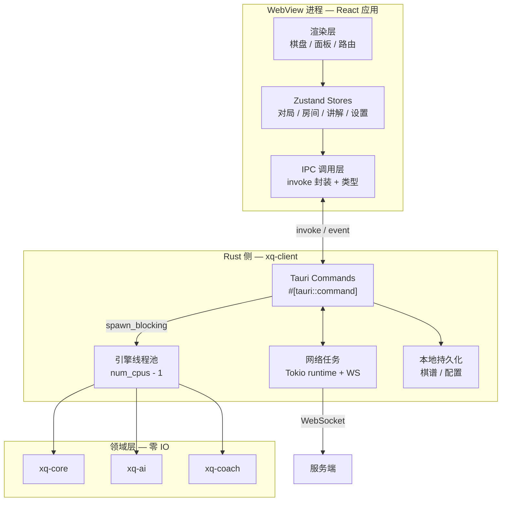
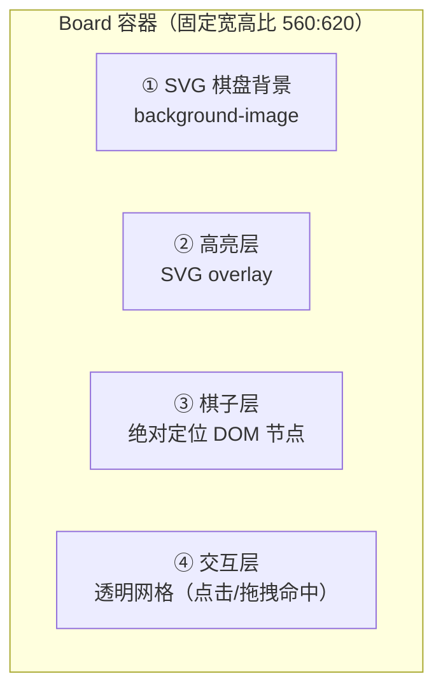
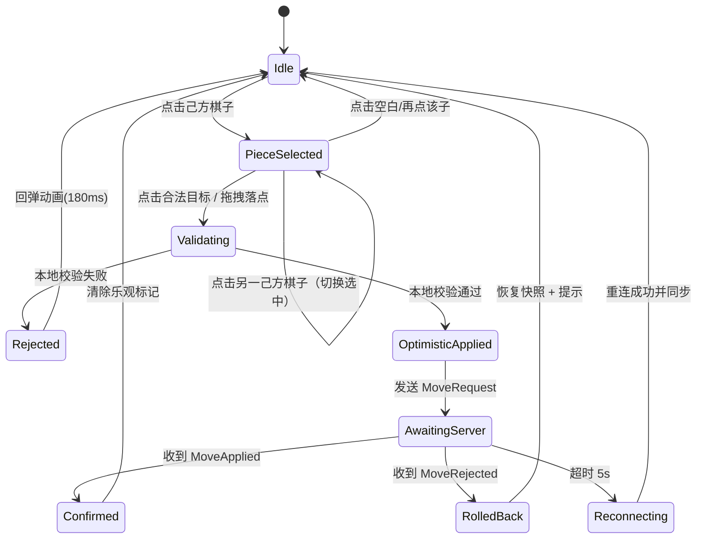
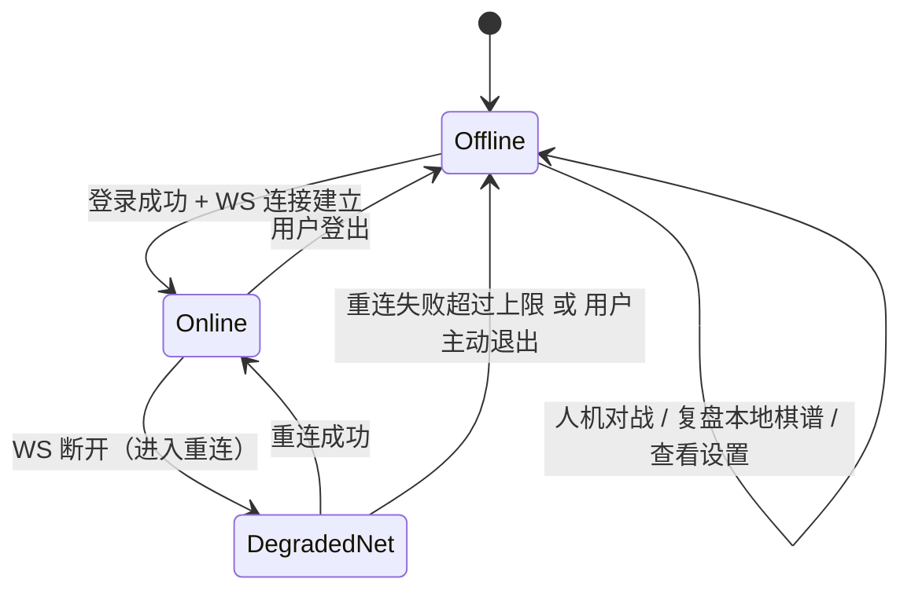
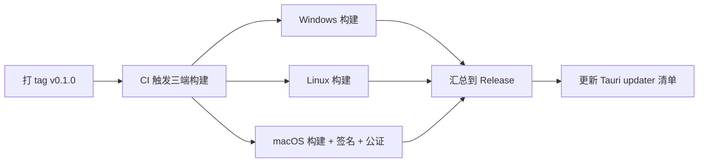

# 08 · 跨平台客户端设计

| 项 | 值 |
|---|---|
| 所属模块 | `crates/xq-client`（Rust 侧）+ `frontend/`（React 侧） |
| 文档版本 | v1.0 |
| 状态 | 设计基线 |
| 编制日期 | 2026-09-23 |
| 前置阅读 | [ADR-002 Tauri 选型](14-决策记录ADR.md#adr-002) · [ADR-008 渲染方案](14-决策记录ADR.md#adr-008) · [05-战法讲解](05-战法讲解引擎设计.md) |

---

## 1. 设计目标

| 目标 | 指标 | 依据 |
|---|---|---|
| 三端一致 | Windows / Linux / macOS 同一份代码，行为一致 | NFR-C.01~03 |
| 渲染流畅 | ≥ 60 FPS，走子动画不掉帧 | NFR-P.01 |
| 响应即时 | 走棋反馈 ≤ 16 ms | NFR-P.02 |
| 启动迅速 | 冷启动 ≤ 2 s 到可交互 | NFR-P.08 |
| 体积可控 | 安装包 ≤ 30 MB | NFR-P.09 |
| 内存可控 | 对局中 RRS ≤ 300 MB | NFR-P.10 |
| 完全离线 | 断网时人机对战 + 本地讲解完整可用 | NFR-R.06 |

---

## 2. 技术栈

| 层 | 技术 | 版本 | 说明 |
|---|---|---|---|
| 桌面壳 | Tauri | **2.11.6** | ⚠️ 3.0 仍为 alpha，**锁定 2.x** |
| 构建 | tauri-build | 2.6.3 | — |
| UI | React | 19.x | 组件化、生态成熟 |
| 构建工具 | Vite | 7.x | 极快的 HMR |
| 类型 | TypeScript | 5.9+ | 严格模式 |
| 状态 | Zustand | 5.x | 轻量、无 Provider 嵌套、适合高频更新 |
| 路由 | TanStack Router | 1.x | 类型安全路由 |
| 样式 | CSS Modules + CSS 变量 | — | 配合 design-tokens，避免运行时样式开销 |
| 包管理 | pnpm | 10.x | workspace |

**为什么状态管理选 Zustand 而非 Redux**：棋盘状态更新频率高（拖拽时每帧更新坐标），Redux 的 action/reducer 样板与不可变更新开销在此场景下是负担。Zustand 的选择器订阅机制（`useStore(s => s.x)`）能精确控制重渲染范围，对 60 FPS 目标更友好。

---

## 3. 进程、线程与职责边界



### 3.1 铁律：耗时计算不得阻塞主线程

Tauri 2 官方文档原文：

> Async commands are executed on a separate async task using `async_runtime::spawn`.
> Commands without the *async* keyword are executed on the **main thread**
> unless defined with `#[tauri::command(async)]`.

**注意：同步命令跑在主线程上** —— 而主线程同时负责窗口消息循环。
所以一个同步的重计算命令不是「占用一个后台线程」，而是**把整个窗口冻住**：
拖不动、缩不了、点不了关闭按钮。

> ⚠️ 本节原先写的是「`#[tauri::command]` 默认在异步任务上执行」，**与官方文档相反**。
> 2026-09-23 实现桌面端时按官方文档核对后修正。这个错误若照抄进代码，
> 会得到一个「每次引擎思考 3 秒窗口就假死 3 秒」的客户端。

**规则**：

| 命令类型 | 实现方式 | 示例 |
|---|---|---|
| 轻量查询（< 1 ms） | 同步 `fn`，留在主线程**反而更快** | `engine_state`、`undo` |
| 中等计算（1~50 ms） | `async fn` | `make_move`、`play_text` |
| 重度计算（> 50 ms） | `async fn` + `spawn_blocking`（可取消更佳） | `engine_move`、`hint`、`coach` |

**`async fn` 的两个实现约束**（都是 Tauri 的既定限制）：

1. `async fn` 里**不能直接带借用参数**（`&str`、`State<'_, T>` 都算）。
   官方给的解法是**把返回值包进 `Result`** —— 包了就允许。
2. `async fn` **不会自动让同步代码变成非阻塞**：函数体里没有 `.await` 的话，
   它只是从主线程换到了 Tokio 工作线程上同步跑完。
   因此重度计算还要再套一层 `spawn_blocking`，否则会占住一个 async worker。

**AI 搜索必须可取消**：用户点"重开"或"取消思考"时，通过 `AtomicBool` 停止信号让搜索在 1 ms 内退出（机制见 [04-AI引擎 §5.1](04-AI引擎设计.md)）。

> **当前实现状态**（2026-09-23）：三个重度命令已改为 `async fn`，
> 因此**不再冻结窗口**；但尚未套 `spawn_blocking`，也不支持取消。
> 单用户本地对局同时只有一次搜索，占住一个 worker 可以接受；
> 等 M2 联网（服务端要处理并发对局）时必须补上这一层。

### 3.2 引擎线程池

- 线程数 = `num_cpus::get() - 1`（留一核给 UI 与 IO）
- 单例池，跨命令复用（避免每次搜索都创建线程）
- 同时最多 1 个搜索任务在跑（棋类引擎搜索有内部状态，不宜并行同局搜索）

> 首版**不做并行搜索**（多线程共享置换表的分区方案复杂且易错）。如果实测 L5 档 3 秒内深度不足，再评估引入。这是一个明确的延后优化决策。

---

## 4. 目录结构

```
frontend/
├── package.json
├── vite.config.ts
├── tsconfig.json
├── index.html
└── src/
    ├── main.tsx
    ├── router.tsx
    ├── styles/
    │   ├── tokens.css           # 由 assets/tokens/design-tokens.json 生成
    │   └── global.css
    ├── components/
    │   ├── board/
    │   │   ├── Board.tsx            # 棋盘容器（坐标系统与缩放）
    │   │   ├── BoardGrid.tsx        # SVG 棋盘背景
    │   │   ├── PieceLayer.tsx       # 棋子层（DOM 节点）
    │   │   ├── HighlightLayer.tsx   # 合法落点 / 推荐箭头 / 上一着标记
    │   │   ├── Piece.tsx            # 单枚棋子
    │   │   └── useBoardCoords.ts    # ICCS ↔ 像素 换算（有单测）
    │   ├── coach/
    │   │   ├── CoachPanel.tsx       # 讲解面板
    │   │   ├── CoachNoteCard.tsx    # 单条讲解卡片
    │   │   ├── LevelBadge.tsx       # 等级徽标（色 + 图标 + 文字）
    │   │   └── TacticTagList.tsx    # 战术标签
    │   ├── game/
    │   │   ├── ClockPanel.tsx       # 双方计时
    │   │   ├── PlayerBar.tsx        # 玩家信息条
    │   │   ├── GameActions.tsx      # 悔棋 / 求和 / 认输
    │   │   └── MoveHistory.tsx      # 着法列表
    │   ├── lobby/
    │   ├── matchmaking/
    │   ├── review/
    │   └── common/
    ├── stores/
    │   ├── gameStore.ts
    │   ├── boardStore.ts
    │   ├── roomStore.ts
    │   ├── coachStore.ts
    │   ├── netStore.ts
    │   └── settingsStore.ts
    ├── ipc/
    │   ├── commands.ts          # Tauri command 的类型化封装
    │   └── events.ts            # Rust → 前端事件订阅
    └── net/
        ├── wsClient.ts
        └── frameHandlers.ts

crates/xq-client/src/
├── main.rs
├── commands.rs
├── engine_pool.rs
├── net.rs
├── persist.rs
└── state.rs
```

---

## 5. 页面与路由

| 路由 | 页面 | 说明 | 关联需求 |
|---|---|---|---|
| `/` | 主菜单 | 五个入口：人机对战 / 联网对战 / 残局挑战 / 复盘 / 设置 | — |
| `/play/ai` | 人机配置 | 选难度、执子、时限 | FR-04 |
| `/play/ai/game` | 人机对局 | 棋盘 + 讲解面板 + 控制区 | FR-02/03/04 |
| `/lobby` | 大厅 | 进行中对局列表、快速匹配入口 | FR-06.01, FR-07 |
| `/room/new` | 创建房间 | 时限、观战开关、悔棋开关 | FR-05.03 |
| `/room/:id` | 房间/对局 | 等待→对局→结束的完整生命周期 | FR-05 |
| `/match` | 匹配中 | 匹配进度、取消 | FR-07.02 |
| `/spectate/:gameId` | 观战 | 只读棋盘 + 讲解（可开关） | FR-06 |
| `/review/:gameId` | 复盘 | 逐着回放、评价统计、导出 | FR-09 |
| `/profile` | 个人资料 | 战绩、等级分、历史对局 | FR-08.04 |
| `/ranking` | 排行榜 | 总榜 / 周榜 | FR-07.04 |
| `/settings` | 设置 | 音效、主题、提示开关、讲解详细度 | FR-02.10, FR-03.10 |

---

## 6. 状态管理设计

### 6.1 Store 划分

| Store | 职责 | 更新频率 |
|---|---|---|
| `gameStore` | 对局核心状态：FEN、着法历史、轮次、状态、计时、对局元信息 | 中（每步一次） |
| `boardStore` | 棋盘交互：选中格、合法落点、拖拽位置、悬停格 | **高**（拖拽时每帧） |
| `coachStore` | 讲解记录列表、当前选中讲解、增强状态 | 中 |
| `roomStore` | 房间信息、双方准备状态、观战者数、待决请求 | 中 |
| `netStore` | 连接状态、重连进度、最后同步时间 | 低 |
| `settingsStore` | 用户偏好（持久化到本地） | 极低 |

**关键设计：`boardStore` 与 `gameStore` 分离**。拖拽过程中的坐标变化是高频的（每帧），若与对局状态混在一起，会导致整个棋盘组件树重渲染。分离后，拖拽只触发棋子层的局部更新。

### 6.2 状态一致性（乐观更新与回滚）

这是客户端最复杂的状态逻辑，必须严格实现：

```text
流程：
1. 用户落子
2. boardStore 清除选中态（立即，无需等待）
3. 本地 xq-core 校验：
   ├─ 非法 → 播放回弹动画 + 轻提示，结束（不发请求）
   └─ 合法 → 继续
4. gameStore 乐观更新：追加着法、翻转轮次、应用棋盘变化
   └─ 同时记录 { optimisticSeq, snapshotBefore }
5. 播放落子动画
6. 发送 MoveRequest{ mv, clientSeq }
7. 等待服务端响应：
   ├─ MoveApplied（seq 匹配）→ 清除乐观标记，正式确认
   ├─ MoveRejected → 执行回滚：
   │     a. 恢复 snapshotBefore
   │     b. 移除乐观追加的着法
   │     c. 若服务端下发了快照 → 用快照覆盖本地
   │     d. 播放"棋子退回"动画（不要瞬间跳变）
   │     e. 提示用户原因
   └─ 超时（5 秒无响应）→ 进入重连流程
```

**回滚动画的设计要点**：直接跳变会让用户感觉"界面出错了"。应播放一个 **180 ms 的退回动画**（棋子从落点移回起点，透明度略降），配合一条不打断操作的 toast 提示。

**防重复提交**：落子后立即锁定交互，直到收到确认或超时。锁定时长上限 5 秒（超时进重连），避免服务端无响应时界面永久卡死。

---

## 7. 棋盘渲染

### 7.1 渲染架构（依据 ADR-008）



**分层理由**：

| 层 | 实现 | 说明 |
|---|---|---|
| ① 棋盘背景 | `` | 静态，加载一次，浏览器缓存；用 `` 而非内联，保持 DOM 简洁 |
| ② 高亮层 | SVG overlay | 合法点、推荐箭头、上一着标记；SVG 画箭头比 CSS 方便 |
| ③ 棋子层 | 绝对定位 `` + CSS transform | 位置用 `transform: translate()`，动画走 GPU |
| ④ 交互层 | 透明热区网格（90 个格子） | 把点击/拖拽命中与视觉元素解耦，避免棋子 DOM 承担事件逻辑 |

### 7.2 坐标换算（核心模块，必须有单测）

棋盘素材几何（见 `assets/board/board-classic.svg`）：

| 参数 | 值 |
|---|---|
| viewBox | `0 0 560 620` |
| 边距 `margin` | 40 |
| 格距 `cell` | 60 |
| 交叉点 `(col, row)` 的像素坐标 | `x = 40 + col*60`，`y = 40 + row*60` |
| col 范围 | 0..8（9 列） |
| row 范围 | 0..9（10 行） |

**响应式换算策略**：容器使用 `aspect-ratio: 560 / 620`，内部所有位置以**百分比**表达，天然适配任意尺寸与 DPI。

```ts
// useBoardCoords.ts 的核心函数
const VIEW_W = 560, VIEW_H = 620, MARGIN = 40, CELL = 60;

/** ICCS 格子 → CSS 百分比位置（棋子中心） */
export function squareToPercent(col: number, row: number): { left: string; top: string } {
  const x = MARGIN + col * CELL;
  const y = MARGIN + row * CELL;
  return {
    left: `${(x / VIEW_W) * 100}%`,
    top:  `${(y / VIEW_H) * 100}%`,
  };
}

/** 棋子直径占容器宽度的百分比 */
export const PIECE_SIZE_PERCENT = `${((CELL * 0.87) / VIEW_W) * 100}%`;   // ≈ 9.32%

/** 像素点击坐标 → ICCS 格子（反向换算，用于点击落子） */
export function pointToSquare(px: number, py: number, rectW: number, rectH: number)
  : { col: number; row: number } | null {
  const vx = (px / rectW) * VIEW_W;
  const vy = (py / rectH) * VIEW_H;
  const col = Math.round((vx - MARGIN) / CELL);
  const row = Math.round((vy - MARGIN) / CELL);
  if (col < 0 || col > 8 || row < 0 || row > 9) return null;
  return { col, row };
}
```

**必须测试的往返性质**：`pointToSquare(squareToPercent(col,row) 对应的像素)` == `(col,row)`，对全部 90 格验证。这类坐标 bug 是 UI 开发中最常见的问题，且症状难定位（"点偏一格"）。

### 7.3 缩放与 DPI

- 容器宽度由布局决定，高度由 `aspect-ratio` 自动推导；
- 所有内部尺寸以 `%` 或 `em`（相对根字号）表达；
- 根字号由容器宽度计算：`--cell: calc(var(--board-width) / 9.33)`（560/60 = 9.333）；
- SVG 素材是矢量的，任意缩放清晰（满足 NFR-C.04）；
- 字体用 `rem`，随用户系统缩放设置变化。

**窗口缩放时的行为**：棋盘等比缩放，不出现拉伸或裁切。最小尺寸保护：当容器宽度 < 320 px 时，切换为"小屏布局"（隐藏讲解面板，改为底部抽屉）。

### 7.4 高亮层元素

| 元素 | 视觉 | 触发时机 |
|---|---|---|
| 选中棋子 | 外圈高亮描边 + 轻微放大（1.06×） | 点击/拖起棋子 |
| 合法落点（空位） | 半透明圆点（直径 ≈ 棋子的 32%） | 选中后 |
| 合法落点（可吃子） | 四角括号框 或 圆环 | 选中后 |
| 上一着起点 | 空心方框 | 每步之后 |
| 上一着终点 | 实心方框 | 每步之后 |
| 最后落子高亮 | 短暂脉冲（360 ms） | 落子瞬间 |
| 被将军的将帅 | 红色脉冲光环（循环 3 次） | 进入将军状态 |
| 推荐着法箭头 | 带箭头的曲线（紫色） | 点"提示"后 |
| 危险提示 | 悬停目标上的警示图标（⚠） | 悬停时若会导致失子 |

> **颜色使用约束**：依据 `assets/tokens/colors.md` 的 WCAG 实算，6 个状态色在木色棋盘底上的对比度仅 1.24~2.78:1，**不满足非文本 3:1 要求**。因此：
> 1. 高亮除了颜色，**必须有形状差异**（圆点 / 括号 / 方框 / 箭头形状不同）；
> 2. 高亮元素需叠加**白色描边或深色阴影**以在木色底上建立边界对比；
> 3. 不依赖颜色区分的可用性测试纳入验收（色觉障碍模拟）。

### 7.5 拖拽交互

| 阶段 | 行为 |
|---|---|
| `pointerdown` 在棋子 | 记录起点格子，进入拖拽态；棋子跟随指针（`transform: translate(px, py)`），提升 `z-index` |
| `pointermove` | 更新棋子位置；高亮当前悬停格子；若悬停格子会失子则显示危险提示 |
| `pointerup` | 命中格子合法 → 落子；非法 → 回弹动画 |
| `pointercancel` | 同"非法"处理 |

**同时支持点击落子**（无障碍与触屏友好）：点棋子 → 高亮合法点 → 点目标格子 → 落子。

**指针事件用 `pointerdown/move/up`** 而非 `mousedown/move/up`，因为前者统一了鼠标、触屏、触控笔，且支持指针捕获（`setPointerCapture`），避免指针移出窗口导致拖拽状态卡死。

---

## 8. 走棋交互流程



**非本人回合的交互**：禁用一切落子入口（`pointer-events: none` 于交互层 + 光标提示），而非依赖校验后再拒绝——避免用户误操作后看到"无效"反馈，体验更干净。

---

## 9. 走棋提示的 UI 设计

| 提示类型 | 呈现 | 触发 | 需求 |
|---|---|---|---|
| **合法落点** | 圆点 / 括号高亮 | 选中棋子 | FR-02.01/02 |
| **危险提示** | 悬停时目标格显示 ⚠ + tooltip「此子会被吃」 | 悬停于会导致失子的落点 | FR-02.06 |
| **将军警示** | 将帅红色脉冲 + 顶部横幅「将军！」 | 进入将军状态 | FR-01.05 |
| **推荐着法** | 紫色箭头 + 评分条 + 「推荐」标签 | 点「提示」按钮 | FR-02.07 |
| **评估条** | 顶部水平条，红黑两侧长度随评分变化 | 常驻（可关闭） | FR-02.09 |
| **提示次数** | 「提示（剩 2 次）」 | 联网模式 | FR-02.08 |

**新手 / 高手模式**（FR-02.10）：

| 模式 | 合法落点 | 危险提示 | 推荐箭头 | 评估条 |
|---|---|---|---|---|
| 新手（默认） | ✅ | ✅ | 手动触发 | ✅ |
| 高手 | ✅ | ❌ | ❌ | ❌ |

---

## 10. 战法讲解面板

### 10.1 布局

```text
┌──────────────────────────────────────────────────────┐
│  顶部：玩家条（黑方）  ·  计时  ·  评估条             │
├───────────────────────────┬──────────────────────────┤
│                           │  战法讲解                │
│                           │  ┌────────────────────┐  │
│                           │  │ [最佳着法] 炮二平五 │  │  ← 等级徽标 + 记谱
│         棋  盘            │  │ 中炮（开局）        │  │  ← 战术标签
│                           │  │ 布局进入「中炮对    │  │  ← headline
│                           │  │ 屏风马」。          │  │
│                           │  │ 中炮直取中路，配合  │  │  ← detail
│                           │  │ 双马快速出动...     │  │
│                           │  └────────────────────┘  │
│                           │  ┌────────────────────┐  │
│                           │  │ [稍有问题] 马八进七 │  │
│                           │  │ 建议改走 车九平八   │  │  ← suggestion
│                           │  └────────────────────┘  │
├───────────────────────────┴──────────────────────────┤
│  底部：玩家条（红方）  ·  计时  ·  操作按钮           │
└──────────────────────────────────────────────────────┘
```

**面板宽度**：固定 320~360 px（桌面）；窗口宽度 < 900 px 时改为**底部抽屉**（可上滑展开）。

### 10.2 讲解卡片结构

| 区域 | 内容 | 数据来源 |
|---|---|---|
| 等级徽标 | 图标 + 文字 + 色条 | `note.level` |
| 着法 | 中文记谱 | `note.notation` |
| 战术标签 | 若干标签（按置信度决定样式强弱） | `note.tactics[]` |
| 标题 | 一句话结论 | `note.headline` |
| 详情 | 2~3 句说明 | `note.detail` |
| 建议 | 「建议改走 车九平八」 | `note.suggestion` |
| 增强指示 | 打字机光标 / 淡入替换 | `note.llm_status` |

**等级徽标的强制规则**（依据 `colors.md` 的 WCAG 结论与 §4.3）：

| 等级 | 图标 | 徽标底色 | 文字 |
|---|---|---|---|
| 优 Best | ★ | `coach.best` 绿 | 白色 |
| 良 Good | ✓ | `coach.good` 蓝 | 白色 |
| 疑 Dubious | ? | `coach.dubious` 橙 | **深色**（橙色底上白字对比度不足） |
| 劣 Blunder | ✕ | `coach.blunder` 红 | 白色 |
| 漏 Missed | ‼ | `coach.missed` 紫 | 白色 |

> **五档必须有不同的图标形状**，颜色只是辅助——这同时满足 WCAG 1.4.1（不依赖颜色）与色觉障碍可用性要求。

### 10.3 交互行为

| 行为 | 效果 |
|---|---|
| 新讲解产生 | 卡片淡入（220 ms）+ 面板自动滚动到底部 |
| 点击历史卡片 | 棋盘跳转到该着之后的局面（进入"浏览历史"态） |
| 浏览历史时 | 顶部显示「正在查看历史 · 返回当前」按钮，点击回到最新 |
| 增强到达 | 原地替换文本（不重排布局），打字机淡入效果 |
| 增强失败 | **不显示任何失败提示**，静默保留本地版本（FR-03.08） |
| 面板折叠 | 保留一个窄条显示最近一条讲解的等级徽标 |

### 10.4 详细度切换（FR-03.10，P2）

设置在「简洁 / 标准 / 详细」间切换，映射到模板的 `concise` / `standard` / `verbose` 三套文案（见 [05-战法讲解 §5.1](05-战法讲解引擎设计.md)）。

---

## 11. 动效设计

动效是"手感"的主要来源。所有时长取自 `assets/tokens/design-tokens.json`。

| 动效 | 时长 | 缓动 | 说明 |
|---|---|---|---|
| 棋子移动 | 220 ms (`duration-base`) | `cubic-bezier(0.34, 1.1, 0.64, 1)` | 轻微过冲，落子有"稳"的感觉 |
| 吃子（被吃子消失） | 180 ms | `ease-in` | 缩放 1 → 0.6 + 透明度 1 → 0 |
| 棋子选中 | 120 ms (`duration-fast`) | `ease-out` | 放大 1.06 + 描边淡入 |
| 合法落点淡入 | 120 ms | `ease-out` | 逐点错开 30 ms（stagger），形成扩散感 |
| 落子回弹（非法） | 180 ms | `cubic-bezier(0.36, 0, 0.66, -0.56)` | 回退到原位 |
| 将军脉冲 | 360 ms × 3 次 | `ease-in-out` | 光环扩散 + 淡出 |
| 讲解卡片淡入 | 220 ms | `ease-out` | 上移 8px + 透明度 |
| 页面转场 | 200 ms | `ease-in-out` | 淡入淡出 |

**性能要求**：所有动效只使用 `transform` 与 `opacity`（可 GPU 合成），**绝不**动画 `left` / `top` / `width` / `height`（触发布局重排）。

**降级**：检测 `prefers-reduced-motion`，为用户关闭全部非必要动效（无障碍要求）。

---

## 12. 离线与在线模式的状态机



| 模式 | 可用功能 |
|---|---|
| **Offline** | 人机对战（全 5 档）、本地讲解（模板路径）、本地棋谱复盘、设置 |
| **Online** | 上述全部 + 联网对战、观战、匹配、排行榜、云端棋谱、LLM 讲解增强 |
| **DegradedNet** | 保持棋盘可交互（浏览历史），显示重连进度条，禁止发起新的联网操作 |

**关键原则**：网络状态**永不阻塞棋盘渲染**。即使服务器完全不可达，当前已加载的对局仍可浏览与复盘。

---

## 13. 网络层

### 13.1 WS 客户端设计

| 关注点 | 方案 |
|---|---|
| 连接管理 | 单一连接，多路复用（房间、观战、匹配共用一条 WS） |
| 帧分发 | 按 `type` 分发到 `frameHandlers.ts` 的处理器注册表 |
| 未知帧 | **必须优雅忽略**（协议兼容要求，见 [ADR-007](14-决策记录ADR.md#adr-007)） |
| 重连 | 指数退避 1/2/4/8/16/30 秒 + ±20% 抖动 |
| 心跳 | 服务端配置的间隔（见 [06-联网协议](06-联网对战与实时通信协议.md)）；客户端在 2 个周期无响应时判定失联 |
| 幂等 | 每个帧带 `seq`；`seq ≤ lastAppliedSeq` 的帧一律丢弃 |
| 路由归属 | 若服务端返回 `Redirect{instance}`，按指示重连目标实例（多实例拓扑，见 [02-架构 §7.3](02-系统架构设计.md)） |

### 13.2 Rust ↔ 前端 事件通道

Rust 侧主动推送用 Tauri event：

| 事件名 | 载荷 | 用途 |
|---|---|---|
| `ai://progress` | `{ nodes, depth, elapsedMs }` | AI 思考进度（显示"思考中 · 深度 6"） |
| `ai://result` | `SearchResult` | 搜索完成 |
| `net://frame` | `ServerFrame` | 服务端帧转发 |
| `net://status` | `{ state, retryIn? }` | 连接状态变化 |
| `coach://enhanced` | `CoachNote` | LLM 增强结果到达 |

**为什么网络与 AI 都放在 Rust 侧**：Rust 侧的 Tokio 运行时更适合管理长连接与取消语义；且让 Rust 持有 WS 连接可以避免 WebView 的休眠策略影响心跳（部分平台上后台 WebView 会节流定时器）。

---

## 14. Tauri Commands 清单

### 14.1 已实现（M1，`crates/xq-client/src/lib.rs`）

共 8 个，与 `xq-bridge` 的 HTTP 路由**一一对应**：

| 命令 | 签名（简化） | 实现方式 | HTTP 对应 |
|---|---|---|---|
| `engine_state` | `() → StateDto` | 同步 | `GET /api/state` |
| `new_game` | `(fen: Option<String>) → Result<StateResponse, String>` | 同步 | `POST /api/new` |
| `make_move` | `(from: String, to: String) → Result<MoveResponse, String>` | 同步 | `POST /api/move` |
| `play_text` | `(text: String) → Result<MoveResponse, String>` | 同步 | `POST /api/move` |
| `undo` | `() → StateResponse` | 同步 | `POST /api/undo` |
| `engine_move` | `(level: String, think_ms: u64) → Result<EngineMoveResponse, String>` | **`async fn`** | `POST /api/engine` |
| `hint` | `(level: String, think_ms: u64, count: usize) → Result<HintResponse, String>` | **`async fn`** | `POST /api/hint` |
| `coach` | `(level: String, think_ms: u64) → Result<CoachResponse, String>` | **`async fn`** | `POST /api/coach` |

三个 `async fn` 的理由见 §3.1 —— 它们会跑最长 3 秒搜索。

**参数命名**：Rust 侧 `snake_case`、JS 侧 `camelCase`，由 Tauri 自动映射
（`think_ms` ↔ `thinkMs`）。前端不需要做任何转换，但要**按 camelCase 传参**。

**类型契约**：**DTO 不在本 crate 定义**，而是全部来自 `xq-session` ——
与 HTTP 桥共用同一份。这是为了让「同一局棋，桌面端还是浏览器玩，
规则与讲解必然一致」成为**结构上的保证**，而不是靠两边小心维护。
前端侧的类型镜像在 `frontend/src/types.ts`。

> 方案设计阶段曾把 DTO 放在 `crates/xq-client/src/commands.rs`；
> 实现时改为下沉到 `xq-session`，因为 HTTP 桥也需要同一套 DTO。
> **P2 可引入 `ts-rs` 自动生成 TS 类型**，消除手工同步的漂移风险。

### 14.2 尚未实现（后续里程碑）

| 命令 | 用途 | 计划 |
|---|---|---|
| `cancel_ai_search` | 取消正在进行的搜索 | M1 收尾（配合 `StopSignal`） |
| `get_legal_moves` | 单独取合法着法（当前由 `engine_state` 一并下发） | 按需 |
| `export_game` / `import_game` | 棋谱导出与导入 | M2 |
| `save_local_game` / `list_local_games` | 本地棋谱管理 | M2 |
| `load_settings` / `save_settings` | 设置持久化 | M2 |
| `request_coach_enhance` | LLM 增强讲解（结果走事件） | M2 |
| `analyze_move` | 复盘单步分析 | M3 |

---

## 15. 打包与分发

### 15.1 三端目标

| 平台 | Target | 产物 | 说明 |
|---|---|---|---|
| Windows | `x86_64-pc-windows-msvc` | `.msi` + NSIS `.exe` | WebView2 运行时：Win10+ 一般已内置，否则引导安装 |
| Linux | `x86_64-unknown-linux-gnu` | `.AppImage` + `.deb` + `.rpm` | 声明 `webkit2gtk-4.1` 依赖 |
| macOS | `x86_64-apple-darwin` + `aarch64-apple-darwin` | `.dmg`（通用二进制） | 需代码签名与公证（`notarization`）才能免"已损坏"提示 |

### 15.2 Linux 系统依赖

Tauri 2 在 Linux 上依赖 WebKitGTK。各发行版安装命令（打包与文档中均需列出）：

| 发行版 | 安装命令 |
|---|---|
| Debian / Ubuntu | `sudo apt install libwebkit2gtk-4.1-dev libgtk-3-dev libayatana-appindicator3-dev librsvg2-dev build-essential curl wget file libssl-dev` |
| Fedora | `sudo dnf install webkit2gtk4.1-devel gtk3-devel libappindicator-gtk3-devel librsvg2-devel openssl-devel` |
| Arch 系（含 CachyOS） | `sudo pacman -S webkit2gtk-4.1 gtk3 libappindicator-gtk3 librsvg openssl` |

> AppImage 会把依赖打包进去，终端用户无需手动安装；`deb`/`rpm` 则在包元数据中声明依赖，由包管理器解析。

### 15.3 体积控制（目标 ≤ 30 MB）

| 手段 | 效果 |
|---|---|
| release 开启 `lto = "thin"`、`codegen-units = 1`、`strip = true`、`panic = "abort"` | 显著减小二进制 |
| 前端构建开启 gzip/brotli（Tauri 内嵌资源自动压缩） | 减小 WebView 资源体积 |
| SVG 素材而非位图 | 素材总量仅约 55 KB |
| 字体：使用系统字体栈，**不内嵌中文字体** | 中文字体动辄 5~10 MB，内嵌会撑爆体积 |
| 按需裁剪依赖 feature | — |

> ⚠️ **字体策略的权衡**：不内嵌字体意味着依赖系统字体。但 NFR-C.06 要求"字体缺失时不出现方块字"。解决方案：使用**字体栈回退**（`assets/tokens/design-tokens.json` 中的 `typography` 已定义），并保证棋子的汉字用**矢量路径**（棋子 SVG 内已含文字，渲染为路径）而非依赖字体——这样即使系统无中文楷体，**棋子文字依然正确显示**，只有 UI 文案可能回退到系统默认中文字体。

### 15.4 发布流程



---

## 16. 性能优化清单

| 目标 | 手段 |
|---|---|
| 60 FPS 拖拽 | `pointermove` 中用 `requestAnimationFrame` 节流，不在每帧更新 React state（直接用 ref 操作 DOM transform） |
| 减少重渲染 | Zustand 选择器精确订阅；棋盘棋子用 `React.memo` + 只传递 `col/row/piece` 三个原始值 |
| 动画流畅 | 只用 `transform` / `opacity`；关键动画元素提升为独立合成层（`will-change: transform`，注意用完移除避免层爆炸） |
| 讲解列表长 | 虚拟滚动（超过 100 条时启用） |
| 快速启动 | 棋盘 SVG 内联到首次渲染路径（避免额外请求）；引擎初始化延迟到进入对局时 |
| 内存 | 历史讲解列表上限（如保留最近 500 条），更早的落盘 |
| 首屏 | 路由级代码分割（`React.lazy`），主菜单只加载必要模块 |

---

## 17. 无障碍与键盘操作

| 要求 | 实现 |
|---|---|
| 键盘走子（NFR-U.04） | 方向键在棋盘上移动焦点；回车选中/落子；Esc 取消选中 |
| 焦点可见 | 焦点环样式（不依赖颜色，用 2 px 实线 + 偏移） |
| 屏幕阅读器 | 棋盘用 `role="grid"`，每格 `aria-label="七路 三行 红兵"` |
| 对比度 | ≥ 4.5:1（正文）；状态色不单独承载语义（见 §7.4、§10.2） |
| 减少动效 | 尊重 `prefers-reduced-motion` |
| 字号缩放 | 支持 100% / 125% / 150% 三档，棋盘尺寸相应变化 |

---

## 18. 测试策略

| 层次 | 内容 | 工具 |
|---|---|---|
| 单元测试 | 坐标换算往返（90 格全覆盖）、状态机转移、帧解析 | Vitest |
| 组件测试 | 棋盘渲染、讲解卡片渲染、等级徽标 | Vitest + Testing Library |
| **快照测试** | 棋盘渲染结果（防止意外的视觉回归） | Vitest snapshot |
| 视觉回归 | 三端截图对比 | Playwright + 截图比对 |
| 交互测试 | 点击落子、拖拽落子、非法回弹、历史浏览 | Playwright |
| 性能测试 | 拖拽帧率、启动耗时、内存 | Playwright trace + 手动基准 |
| 三端冒烟 | 每端完成一局人机对战 | 手动 + CI 自动化（Linux 可 headless） |

**性能门禁**：CI 中运行拖拽场景，采集 FPS，若 P95 < 55 FPS 则告警。

---

## 19. 与需求的对应

| 需求 | 客户端实现 |
|---|---|
| FR-02 走棋提示 | §7.4 高亮层 + §9 提示 UI |
| FR-03 战法讲解 | §10 讲解面板 + 渐进增强 |
| FR-04 人机对战 | §3.2 引擎线程池 + 离线模式 |
| FR-05 联网对战 | §13 网络层 + §6.2 乐观更新与回滚 |
| FR-06 观战 | `/spectate/:gameId` 只读棋盘 + 讲解开关 |
| FR-09 复盘 | `/review/:gameId` 逐着回放 |
| NFR-P 性能 | §16 优化清单 + 性能门禁 |
| NFR-C 兼容 | §15 三端打包 + §7.3 缩放与 DPI |
| NFR-U 可用性 | §17 无障碍 |
| NFR-R 可靠 | §12 离线模式 + §13 重连 |
