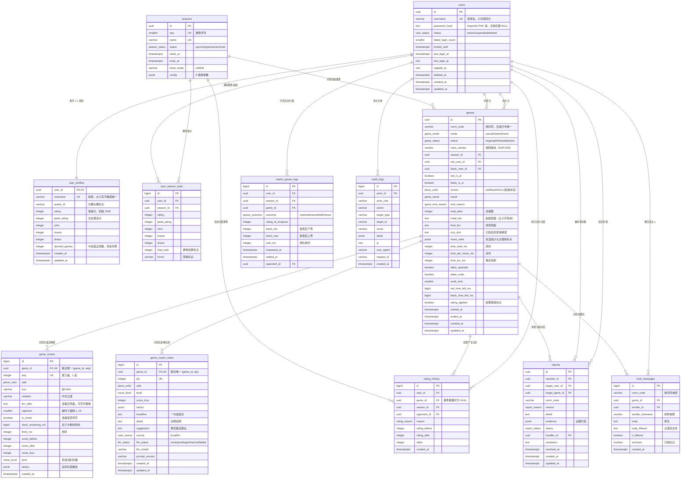
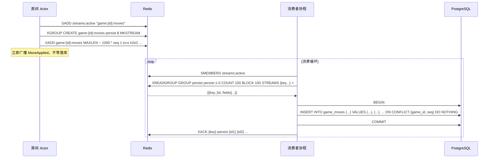
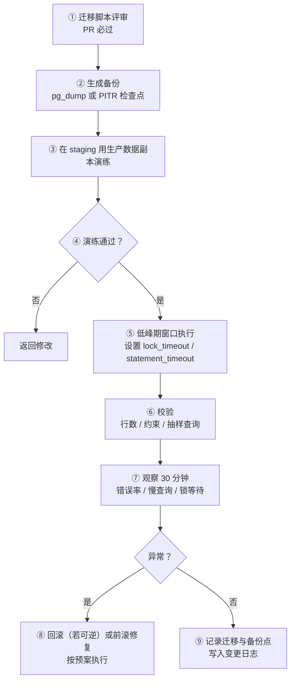

# 09 · 数据模型与存储设计

| 项 | 值 |
|---|---|
| 所属模块 | `xq-server::store`（SeaORM 实体与仓储、Redis 封装） |
| 文档版本 | v1.0 |
| 状态 | 设计基线（Design Baseline） |
| 编制日期 | 2026-09-23 |
| 关联文档 | [01-需求规格](01-需求规格说明书.md) · [02-系统架构](02-系统架构设计.md) · [03-规则引擎](03-规则引擎与领域模型.md) · [05-战法讲解](05-战法讲解引擎设计.md) · [06-联网协议](06-联网对战与实时通信协议.md) · [10-API接口规范](10-API接口规范.md) · [ADR-009](14-决策记录ADR.md#adr-009) · [ADR-010](14-决策记录ADR.md#adr-010) · [ADR-011](14-决策记录ADR.md#adr-011) · [ADR-014](14-决策记录ADR.md#adr-014) |

> **本文的定位**：把 [01-需求规格](01-需求规格说明书.md) 中列明的功能需求（断线重连、复盘、排行榜、赛季）翻译成**可落地的表结构与键结构**，并对每个索引、每个 Redis 键给出它**服务的具体查询**。凡无法追溯到某条需求或某个已知查询的表、字段、索引，本文一律不设。

> **数字口径声明**：本文所有容量、保留期、TTL、批次大小均为**设计初始值**，其中带 ⚠️ 标记的项**未经实测或校准**，不得作为验收结论或对外承诺使用。每项后均标注了推算依据或「待实测」字样。

---

## 1. 存储职责划分

### 1.1 唯一判据

> **丢了会不会出事？**
> 会 → PostgreSQL（权威数据）；不会，或能从事务数据重建 → Redis（临时数据）。

这条判据直接来自 [ADR-010](14-决策记录ADR.md#adr-010)：

| 维度 | PostgreSQL 16+ | Redis 7.x |
|---|---|---|
| 数据性质 | **权威**（Authoritative） | **可重建**（Derivable / Ephemeral） |
| 持久化保证 | WAL + 事务，提交即持久 | AOF（`everysec`）仍可能丢最后 1 秒 ⚠️ |
| 丢失后果 | 用户数据损坏，业务不可接受 | 性能或体验降级，业务正确性不受影响 |
| 访问特征 | 低频、复杂查询、需事务 | 高频、单键读写、微秒级 |
| ORM / 客户端 | SeaORM 2.0.3（`sea-orm` + `sqlx`） | `redis` 1.0（`tokio-comp` + `streams` + `connection-manager`） |

### 1.2 三类数据的归属

| 数据 | 存储 | 依据 |
|---|---|---|
| 账号、资料、等级分 | **PostgreSQL**（`users` / `user_profiles`） | 权威数据（[ADR-010](14-决策记录ADR.md#adr-010) 明确禁止放 Redis） |
| 对局主记录、棋谱终态 | **PostgreSQL**（`games`） | 同上 |
| 着法明细 | **PostgreSQL**（`game_moves`），过程缓冲走 **Redis Stream** | [ADR-011](14-决策记录ADR.md#adr-011)：`XADD` 异步落库 |
| 逐着讲解 | **PostgreSQL**（`game_coach_notes`） | 复盘（FR-09.02）需要持久化的逐着讲解 |
| 积分流水 | **PostgreSQL**（`rating_history`） | 排行榜（FR-07.04）需可审计的积分变动来源 |
| 赛季与赛季战绩 | **PostgreSQL**（`seasons` / `user_season_stats`） | FR-07.06 赛季重置与荣誉保留 |
| 进行中的房间状态（棋盘、计时、观战者） | **Redis**（`room:{room_code}:state`） | [ADR-010](14-决策记录ADR.md#adr-010) 第一类用途；服务重启后可恢复（NFR-R.03） |
| 房间归属（多实例路由） | **Redis**（`room:{room_code}:owner`） | [02-系统架构 §7.3](02-系统架构设计.md) |
| 匹配队列 | **Redis Sorted Set**（`match:queue`） | [ADR-010](14-决策记录ADR.md#adr-010) 第二类用途 |
| refresh token 白名单、access 黑名单 | **Redis** | [ADR-010](14-决策记录ADR.md#adr-010) 第四类用途；丢失仅需重新登录 |
| 接口限流计数 | **Redis** | 同上 |
| 讲解结果缓存、LLM 预算计数 | **Redis** | [05-战法讲解 §6.4](05-战法讲解引擎设计.md)；缓存丢失仅增加成本 |
| 大厅进行中列表、排行榜缓存 | **Redis**（派生索引） | [ADR-006](14-决策记录ADR.md#adr-006) 权衡栏："大厅列表维护在 Redis + 独立的轻量索引" |

### 1.3 明确不进入 Redis 的项

| 项 | 原因 |
|---|---|
| 用户资料、等级分 | 权威数据（[ADR-010](14-决策记录ADR.md#adr-010) 明文禁止） |
| 棋谱终态、对局结果 | 权威数据 |
| 积分流水 | 需要事务与审计（[ADR-009](14-决策记录ADR.md#adr-009)） |
| 举报工单 | 需要长期保留与合规审计 |
| 审计日志 | 同上 |

### 1.4 写入路径（联网走棋）

```mermaid
sequenceDiagram
    participant R as 房间 Actor
    participant RD as Redis
    participant C as 落库消费者
    participant PG as PostgreSQL

    R->>RD: HSET room:{code}:state（棋盘/计时/seq）
    R->>RD: XADD game:{id}:moves MAXLEN ~ 1000 * ...
    R-->>R: 广播 MoveApplied（不等落库）
    C->>RD: XREADGROUP GROUP persist ... COUNT 100 BLOCK 100
    C->>PG: BEGIN; INSERT ... ON CONFLICT (game_id, seq) DO NOTHING; COMMIT
    C->>RD: XACK
```

**关键点**：走棋关键路径上**没有任何 PostgreSQL 调用**（[ADR-011](14-决策记录ADR.md#adr-011)）。房间状态只写 Redis，着法只写 Redis Stream，DB 由独立消费者批量追平。

---

## 2. ER 图

### 2.1 实体关系



### 2.2 关系基数说明

| 关系 | 基数 | 说明 |
|---|---|---|
| `users` → `user_profiles` | 1 : 1 | 资料拆表：账号表只保留鉴权必需字段，高频读取的资料（昵称/等级分/战绩）独立成表，减小 `users` 行宽 |
| `users` → `games` | 1 : N（两次） | 一局有两个参与者，用 `red_user_id` / `black_user_id` 两列表达，避免引入 `game_players` 中间表（中国象棋恒为双方，无多方语义） |
| `games` → `game_moves` | 1 : N | 每着一行，`(game_id, seq)` 唯一（[ADR-011](14-决策记录ADR.md#adr-011) 幂等要求） |
| `games` → `game_coach_notes` | 1 : N | 每着一行讲解，与 `game_moves` 的 `seq` 对齐为 `ply` |
| `games` → `rating_history` | 1 : N（通常 2） | 结算时双方各一条流水，`(game_id, user_id)` 唯一保证不重复结算 |
| `seasons` → 各表 | 1 : N | 赛季维度用于周榜统计与赛季重置（FR-07.06） |
| `games` → `reports` | 1 : N | 举报可挂在对局上（证据更完整），也可只挂房间号 |
| `games` → `chat_messages` | 1 : N | 未开局房间的聊天 `game_id` 为 NULL，故为可空外键 |

---

## 3. 表结构详表

### 3.0 枚举类型

PostgreSQL 原生 ENUM（SeaORM 通过 `DeriveActiveEnum` + `ActiveEnum` 映射）：

```sql
CREATE TYPE user_status      AS ENUM ('active', 'suspended', 'deleted');
CREATE TYPE piece_color      AS ENUM ('red', 'black');
CREATE TYPE game_mode        AS ENUM ('casual', 'ranked', 'room');
CREATE TYPE game_status      AS ENUM ('ongoing', 'finished', 'aborted');
CREATE TYPE game_result      AS ENUM ('red_win', 'black_win', 'draw', 'aborted');
CREATE TYPE game_end_reason  AS ENUM (
    'checkmate',              -- 将死（FR-01.06）
    'stalemate',              -- 困毙（FR-01.06）
    'resign',                 -- 认输（FR-01.09）
    'timeout',                -- 超时（FR-01.11）
    'disconnect',             -- 断线超时（FR-05.07）
    'agreed_draw',            -- 协议和棋（FR-01.09）
    'sixty_move',             -- 自然限着 60 回合（FR-01.06）
    'insufficient_material',  -- 子力不足（FR-01.06）
    'repetition',             -- 长将/长捉裁决（FR-01.07）
    'abort'                   -- 未开局即终止
);
CREATE TYPE move_level       AS ENUM ('best', 'good', 'dubious', 'blunder', 'missed');
CREATE TYPE note_source      AS ENUM ('local', 'llm');
CREATE TYPE llm_status       AS ENUM ('none', 'pending', 'enhanced', 'failed');
CREATE TYPE rating_reason    AS ENUM ('game_win', 'game_loss', 'game_draw', 'season_reset', 'admin_adjust');
CREATE TYPE queue_outcome    AS ENUM ('matched', 'cancelled', 'timeout');
CREATE TYPE report_reason    AS ENUM ('cheating', 'abuse', 'flood', 'impersonation', 'other');
CREATE TYPE report_status    AS ENUM ('pending', 'reviewing', 'resolved', 'rejected');
CREATE TYPE season_status    AS ENUM ('upcoming', 'active', 'archived');
```

> 采用原生 ENUM 而非 `varchar + CHECK`：类型安全由数据库保证，SeaORM 可生成强类型枚举，避免"字符串拼错只在运行时发现"。代价是**新增枚举值需迁移**（`ALTER TYPE ... ADD VALUE`，PostgreSQL 16 支持在事务内执行 ⚠️ 需实测确认），这对本项目的取值集合（游戏结束原因等）是稳定集合，风险可接受。

---

### 3.1 `users` —— 账号

**服务于**：FR-08.02 注册/登录、FR-08.05 密码修改与登出、NFR-S.05 强哈希、NFR-S.10 日志脱敏。

| 字段 | 类型 | 约束 | 默认值 | 说明 |
|---|---|---|---|---|
| `id` | `uuid` | PK | — | UUID **v7**（时间有序，[ADR-007](14-决策记录ADR.md#adr-007) 以字符串对外） |
| `username` | `varchar(32)` | NOT NULL, UNIQUE, CHECK 格式 | — | 登录名。存储前统一转小写（CHECK 断言只允许 `[a-z0-9_]`），避免大小写歧义 |
| `password_hash` | `text` | 可空 | NULL | **Argon2id** PHC 字符串（约 97 字符）。注销账号置 NULL |
| `status` | `user_status` | NOT NULL | `'active'` | `suspended` = 封禁（FR-08/运营），`deleted` = 已注销 |
| `failed_login_count` | `smallint` | NOT NULL, CHECK ≥ 0 | `0` | 连续失败次数，配合 `locked_until` 做账号级限流（[10-API §6](10-API接口规范.md)） |
| `locked_until` | `timestamptz` | 可空 | NULL | 账号锁定截止时间 |
| `last_login_at` | `timestamptz` | 可空 | NULL | 最近登录时间 |
| `last_login_ip` | `inet` | 可空 | NULL | 最近登录 IP，供风控与审计 |
| `register_ip` | `inet` | 可空 | NULL | 注册 IP，供反小号（FR-08/反作弊） |
| `deleted_at` | `timestamptz` | 可空 | NULL | 软删标记，与 `status='deleted'` 双向一致（CHECK 锁定） |
| `created_at` | `timestamptz` | NOT NULL | `now()` | 注册时间 |
| `updated_at` | `timestamptz` | NOT NULL | `now()` | 由应用层在仓储 `update` 时赋值（不使用触发器，保持 ORM 可见性） |

```sql
CREATE TABLE users (
    id                 uuid         PRIMARY KEY,
    username           varchar(32)  NOT NULL,
    password_hash      text,
    status             user_status  NOT NULL DEFAULT 'active',
    failed_login_count smallint     NOT NULL DEFAULT 0,
    locked_until       timestamptz,
    last_login_at      timestamptz,
    last_login_ip      inet,
    register_ip        inet,
    deleted_at         timestamptz,
    created_at         timestamptz  NOT NULL DEFAULT now(),
    updated_at         timestamptz  NOT NULL DEFAULT now(),
    CONSTRAINT users_username_format_ck
        CHECK (username ~ '^[a-z0-9_]{3,32}$'),
    CONSTRAINT users_failed_login_nonneg_ck
        CHECK (failed_login_count >= 0),
    CONSTRAINT users_deleted_consistency_ck
        CHECK ((status = 'deleted') = (deleted_at IS NOT NULL)),
    CONSTRAINT users_password_present_ck
        CHECK (status = 'deleted' OR password_hash IS NOT NULL)
);
```

**索引**

| 索引 | 类型 | 服务的查询 |
|---|---|---|
| `users_username_key (username)` | UNIQUE B-tree | 登录：`SELECT ... FROM users WHERE username = $1`（FR-08.02）；注册查重 |
| `users_deleted_purge_idx (deleted_at)` WHERE `deleted_at IS NOT NULL` | 部分 B-tree | 注销清理任务扫描待硬删/待匿名化的账号（§7.3） |

> `username` 唯一索引同时承担"注册查重"与"登录定位"两个用途，不需要额外索引。

---

### 3.2 `user_profiles` —— 个人资料与战绩

**服务于**：FR-08.04 个人资料（昵称、头像、等级分、战绩）、FR-07.01 初始分 1500、FR-07.07 战绩页、FR-07.04 排行榜。

| 字段 | 类型 | 约束 | 默认值 | 说明 |
|---|---|---|---|---|
| `user_id` | `uuid` | PK, FK→`users.id` ON DELETE RESTRICT | — | 与 `users` 1:1 |
| `nickname` | `varchar(24)` | NOT NULL, 见索引 | — | 展示昵称，大小写不敏感唯一（FR-08.04） |
| `avatar_id` | `varchar(64)` | 可空 | NULL | **内置头像标识**（如 `preset_07`）。本设计不引入对象存储，自定义上传属后续迭代 |
| `rating` | `integer` | NOT NULL, CHECK 0..4000 | `1500` | 当前等级分（FR-07.01 初始 1500） |
| `peak_rating` | `integer` | NOT NULL | `1500` | 历史最高分，用于资料页与赛季荣誉 |
| `wins` | `integer` | NOT NULL, CHECK ≥ 0 | `0` | 胜场（FR-07.07） |
| `losses` | `integer` | NOT NULL, CHECK ≥ 0 | `0` | 负场 |
| `draws` | `integer` | NOT NULL, CHECK ≥ 0 | `0` | 和场 |
| `aborted_games` | `integer` | NOT NULL, CHECK ≥ 0 | `0` | 中途退出（断线判负）累计，供反作弊与匹配质量分析 |
| `created_at` / `updated_at` | `timestamptz` | NOT NULL | `now()` | — |

> **为什么计数器放在资料表而不实时 `COUNT(*)` `games`**：战绩页与排行榜是高频读路径。一局结束时用**同一事务**更新计数器（[ADR-009](14-决策记录ADR.md#adr-009) 的事务刚需），读取时零聚合。数据一致性由唯一索引 `rating_history(game_id, user_id)` 与 `games.rating_applied` 双重保证幂等（§3.6）。

```sql
CREATE TABLE user_profiles (
    user_id       uuid        PRIMARY KEY
                              REFERENCES users (id) ON DELETE RESTRICT,
    nickname      varchar(24) NOT NULL,
    avatar_id     varchar(64),
    rating        integer     NOT NULL DEFAULT 1500,
    peak_rating   integer     NOT NULL DEFAULT 1500,
    wins          integer     NOT NULL DEFAULT 0,
    losses        integer     NOT NULL DEFAULT 0,
    draws         integer     NOT NULL DEFAULT 0,
    aborted_games integer     NOT NULL DEFAULT 0,
    created_at    timestamptz NOT NULL DEFAULT now(),
    updated_at    timestamptz NOT NULL DEFAULT now(),
    CONSTRAINT user_profiles_rating_range_ck
        CHECK (rating BETWEEN 0 AND 4000 AND peak_rating BETWEEN 0 AND 4000),
    CONSTRAINT user_profiles_peak_ge_rating_ck
        CHECK (peak_rating >= rating),
    CONSTRAINT user_profiles_counters_nonneg_ck
        CHECK (wins >= 0 AND losses >= 0 AND draws >= 0 AND aborted_games >= 0)
);
```

> ⚠️ `CHECK (peak_rating >= rating)` 在赛季软重置时会与"重置后 rating 下降但 peak_rating 保留"冲突。**处理方式**：赛季软重置时同步把 `peak_rating` 置为重置后的 `rating`，历史最高分改由 `user_season_stats.peak_rating` 承载。此规则需在赛季模块实现时确认，属**待实现校验**项。

**索引**

| 索引 | 类型 | 服务的查询 |
|---|---|---|
| `user_profiles_nickname_key (lower(nickname))` | UNIQUE 表达式 B-tree | 昵称查重（FR-08.04 修改昵称时校验"昵称已被占用"）、按昵称搜索 |
| `user_profiles_rating_desc_idx (rating DESC, user_id)` | B-tree | 总榜分页（FR-07.04）：`ORDER BY rating DESC, user_id LIMIT ...`；`user_id` 作为并列时的稳定次序，避免翻页抖动 |
| `user_profiles_peak_rating_idx (peak_rating DESC)` | B-tree | 赛季荣誉结算时按历史最高分排序（FR-07.06，P2）⚠️ 未确认该查询是否真会执行，如无需求应删除此索引 |

---

### 3.3 `seasons` —— 赛季

**服务于**：FR-07.06 赛季机制（赛季重置与荣誉保留）。

| 字段 | 类型 | 约束 | 默认值 | 说明 |
|---|---|---|---|---|
| `id` | `uuid` | PK | — | UUID v7 |
| `seq` | `smallint` | NOT NULL, UNIQUE | — | 赛季序号（1、2、3…），用于展示"第 N 赛季" |
| `name` | `varchar(32)` | NOT NULL, UNIQUE | — | 赛季名（如 `2026-S4`） |
| `status` | `season_status` | NOT NULL | `'upcoming'` | 同一时刻**至多一个 `active`**（部分唯一索引保证） |
| `starts_at` | `timestamptz` | NOT NULL | — | 开赛时间（周榜按此切分自然周） |
| `ends_at` | `timestamptz` | NOT NULL, CHECK > `starts_at` | — | 结束时间 |
| `reset_mode` | `varchar(16)` | NOT NULL, CHECK IN ('soft','full') | `'soft'` | 软重置（向 1500 收缩）或完全重置 |
| `config` | `jsonb` | NOT NULL | `'{}'` | 赛季参数（ELO K 值、段位分界线等），避免为每个参数加列 |
| `created_at` / `updated_at` | `timestamptz` | NOT NULL | `now()` | — |

```sql
CREATE TABLE seasons (
    id         uuid          PRIMARY KEY,
    seq        smallint      NOT NULL,
    name       varchar(32)   NOT NULL,
    status     season_status NOT NULL DEFAULT 'upcoming',
    starts_at  timestamptz   NOT NULL,
    ends_at    timestamptz   NOT NULL,
    reset_mode varchar(16)   NOT NULL DEFAULT 'soft',
    config     jsonb         NOT NULL DEFAULT '{}'::jsonb,
    created_at timestamptz   NOT NULL DEFAULT now(),
    updated_at timestamptz   NOT NULL DEFAULT now(),
    CONSTRAINT seasons_range_ck CHECK (ends_at > starts_at),
    CONSTRAINT seasons_reset_mode_ck CHECK (reset_mode IN ('soft', 'full'))
);
```

**索引**

| 索引 | 类型 | 服务的查询 |
|---|---|---|
| `seasons_seq_key (seq)` | UNIQUE B-tree | 赛季序号查重；按序号取当前赛季 |
| `seasons_name_key (name)` | UNIQUE B-tree | 赛季名查重 |
| `seasons_one_active_idx (status)` WHERE `status = 'active'` | **部分** UNIQUE B-tree | 用数据库约束保证"至多一个进行中赛季"，避免靠应用层自觉。查询侧即"取当前赛季"（`GET /api/v1/seasons/current`） |

---

### 3.4 `games` —— 对局主记录

**服务于**：FR-05.03 房间配置（时限、观战、悔棋）、FR-05.06 断线重连（计时状态）、FR-05.10 棋谱保存、FR-06.01 大厅列表、FR-07.03 战绩、FR-09 复盘。

| 字段 | 类型 | 约束 | 默认值 | 说明 |
|---|---|---|---|---|
| `id` | `uuid` | PK | — | UUID v7 |
| `room_code` | `varchar(12)` | 可空 | NULL | 6 位房间号（FR-05.01）。长度留到 12 位为未来扩容预留；对局结束后允许复用，故仅"进行中"唯一（部分唯一索引） |
| `mode` | `game_mode` | NOT NULL | — | `ranked` 才参与积分与匹配；`room` 为好友房；`casual` 不计分 |
| `status` | `game_status` | NOT NULL | `'ongoing'` | — |
| `rules_version` | `varchar(16)` | NOT NULL | — | 规则版本（[ADR-003](14-决策记录ADR.md#adr-003) 要求携带 `rules_version`），用于事后追查规则差异导致的分歧 |
| `season_id` | `uuid` | FK→`seasons.id` ON DELETE SET NULL, 可空 | NULL | 非天梯对局为 NULL |
| `red_user_id` | `uuid` | FK→`users.id` ON DELETE RESTRICT, 可空 | NULL | 红方（FR-01 红先）。人机对局时为 NULL |
| `black_user_id` | `uuid` | 同上 | NULL | 黑方 |
| `red_is_ai` / `black_is_ai` | `boolean` | NOT NULL | `false` | AI 托管标记（FR-10 AI 代打，P2）。天梯模式禁止为 `true`（应用层校验） |
| `winner` | `piece_color` | 可空 | NULL | 胜方；和棋/未结束为 NULL |
| `result` | `game_result` | 可空 | NULL | 结果。与 `winner` 的一致性由 CHECK 锁定 |
| `end_reason` | `game_end_reason` | 可空 | NULL | 结束原因，覆盖 FR-01.06/07/09/11、FR-05.07 的全部裁决输出 |
| `total_plies` | `integer` | NOT NULL, CHECK ≥ 0 | `0` | 总着数（= 最后一条 `game_moves.seq`） |
| `initial_fen` | `text` | NOT NULL | — | 起始局面 FEN（[03 §8](03-规则引擎与领域模型.md)）。让子开局（FR-01.12）与残局挑战（FR-01.14）靠此字段表达，无需额外表 |
| `final_fen` | `text` | 可空 | NULL | 终局局面 FEN，复盘起点校验与分享卡片使用 |
| `iccs_text` | `text` | 可空 | NULL | **归档棋谱**：`h2e2 h9g7 …` 空格分隔的 ICCS 着法串（约 5 字符/着）。既是导出源，也是 `game_moves` 归档删除后的唯一棋谱保留 |
| `move_stats` | `jsonb` | 可空 | NULL | 复盘汇总：双方五档失误计数 + 关键转折点 ply 列表（FR-09.03 / FR-09.04）。归档后仍可展示 |
| `time_total_ms` | `integer` | NOT NULL, CHECK > 0 | — | 局时（毫秒），FR-05.03 房间配置 |
| `time_per_move_ms` | `integer` | NOT NULL, CHECK > 0 | — | 步时（毫秒），FR-01.11 |
| `time_inc_ms` | `integer` | NOT NULL, CHECK ≥ 0 | `0` | 每步加秒（Fischer 式），默认 0 表示纯"局时 + 步时" |
| `allow_spectate` | `boolean` | NOT NULL | `true` | FR-05.03 是否允许观战 |
| `allow_undo` | `boolean` | NOT NULL | `false` | FR-05.03 是否允许悔棋 |
| `undo_limit` | `smallint` | NOT NULL, CHECK ≥ 0 | `3` | 悔棋次数上限（FR-05.11 默认每局 3 次） |
| `red_time_left_ms` | `bigint` | 可空 | NULL | 终局时红方剩余局时。**断线重连期间的实时计时权威在 Redis**（[ADR-014](14-决策记录ADR.md#adr-014)），此列只记录终局快照 |
| `black_time_left_ms` | `bigint` | 可空 | NULL | 同上 |
| `rating_applied` | `boolean` | NOT NULL | `false` | 结算幂等标志。`true` 表示积分已写入 `rating_history` |
| `started_at` | `timestamptz` | 可空 | NULL | 开局时间（双方均准备后） |
| `ended_at` | `timestamptz` | 可空 | NULL | 结束时间 |
| `created_at` / `updated_at` | `timestamptz` | NOT NULL | `now()` | 创建时间用于列表排序与生命周期划分 |

```sql
CREATE TABLE games (
    id                 uuid             PRIMARY KEY,
    room_code          varchar(12),
    mode               game_mode        NOT NULL,
    status             game_status      NOT NULL DEFAULT 'ongoing',
    rules_version      varchar(16)      NOT NULL,
    season_id          uuid             REFERENCES seasons (id) ON DELETE SET NULL,
    red_user_id        uuid             REFERENCES users (id) ON DELETE RESTRICT,
    black_user_id      uuid             REFERENCES users (id) ON DELETE RESTRICT,
    red_is_ai          boolean          NOT NULL DEFAULT false,
    black_is_ai        boolean          NOT NULL DEFAULT false,
    winner             piece_color,
    result             game_result,
    end_reason         game_end_reason,
    total_plies        integer          NOT NULL DEFAULT 0,
    initial_fen        text             NOT NULL,
    final_fen          text,
    iccs_text          text,
    move_stats         jsonb,
    time_total_ms      integer          NOT NULL,
    time_per_move_ms   integer          NOT NULL,
    time_inc_ms        integer          NOT NULL DEFAULT 0,
    allow_spectate     boolean          NOT NULL DEFAULT true,
    allow_undo         boolean          NOT NULL DEFAULT false,
    undo_limit         smallint         NOT NULL DEFAULT 3,
    red_time_left_ms   bigint,
    black_time_left_ms bigint,
    rating_applied     boolean          NOT NULL DEFAULT false,
    started_at         timestamptz,
    ended_at           timestamptz,
    created_at         timestamptz      NOT NULL DEFAULT now(),
    updated_at         timestamptz      NOT NULL DEFAULT now(),

    CONSTRAINT games_time_config_ck
        CHECK (time_total_ms > 0 AND time_per_move_ms > 0 AND time_inc_ms >= 0),
    CONSTRAINT games_undo_limit_ck
        CHECK (undo_limit >= 0),
    CONSTRAINT games_total_plies_ck
        CHECK (total_plies >= 0),
    CONSTRAINT games_players_distinct_ck
        CHECK (red_user_id IS NULL
               OR black_user_id IS NULL
               OR red_user_id <> black_user_id),
    -- 未结束：结果字段必须为空；已结束：结果字段必须齐全
    CONSTRAINT games_result_presence_ck
        CHECK (
            (status = 'ongoing'
             AND result IS NULL AND winner IS NULL
             AND end_reason IS NULL AND ended_at IS NULL)
            OR
            (status <> 'ongoing'
             AND result IS NOT NULL AND end_reason IS NOT NULL AND ended_at IS NOT NULL)
        ),
    -- winner 与 result 必须自洽
    CONSTRAINT games_winner_consistency_ck
        CHECK (
            result IS NULL
            OR (result = 'red_win'   AND winner = 'red')
            OR (result = 'black_win' AND winner = 'black')
            OR (result IN ('draw', 'aborted') AND winner IS NULL)
        ),
    -- aborted 状态必须配 aborted 结果
    CONSTRAINT games_aborted_consistency_ck
        CHECK (COALESCE(status = 'aborted', false) = COALESCE(result = 'aborted', false))
);
```

**索引**

| 索引 | 类型 | 服务的查询 |
|---|---|---|
| `games_red_user_time_idx (red_user_id, created_at DESC, id DESC)` | B-tree | **我的对局列表（红方视角）**：`WHERE red_user_id = $1 AND (created_at, id) < ($cur_ts, $cur_id) ORDER BY created_at DESC, id DESC LIMIT $n`。`id` 参与排序键是为了给游标分页提供**全序**（同秒创建的对局不产生重复/漏项），详见 [10-API §5](10-API接口规范.md) |
| `games_black_user_time_idx (black_user_id, created_at DESC, id DESC)` | B-tree | 同上的黑方视角 |
| `games_ongoing_idx (created_at DESC, id DESC)` WHERE `status = 'ongoing'` | **部分** B-tree | **大厅进行中对局列表**（FR-06.01）。部分索引只含进行中对局（通常 < 3000 行），比全表索引小一个数量级，扫描代价恒定 |
| `games_room_code_ongoing_key (room_code)` WHERE `status = 'ongoing'` | **部分** UNIQUE B-tree | `GET /api/v1/rooms/{room_code}` 定位对局，同时保证房间号在进行中不冲突（FR-05.01"号段不冲突"） |
| `games_season_mode_idx (season_id, mode, status)` | B-tree | 赛季结算扫描：`WHERE season_id = $1 AND mode = 'ranked' AND status = 'finished'` |
| `games_unsettled_idx (ended_at)` WHERE `status <> 'ongoing' AND rating_applied = false` | **部分** B-tree | **结算补偿 worker**：扫描"已结束但未结算"的对局（服务崩溃/消费者中断后的自愈）。行数通常为 0，索引极小 |
| `games_export_archive_idx (ended_at)` WHERE `game_moves` 已归档 —— | — | **不设**。归档任务用 `ended_at < $cutoff` 全表顺序扫描一次/月，代价可接受，不值得为此维护常驻索引 |

---

### 3.5 `game_moves` —— 着法明细

**服务于**：FR-05.06 断线重连（重放棋盘）、FR-01.13 棋谱导出、FR-03.03 逐着评价、FR-09.01/09.02 复盘逐着回放。

| 字段 | 类型 | 约束 | 默认值 | 说明 |
|---|---|---|---|---|
| `id` | `bigint` IDENTITY | PK | 自增 | **内部主键，不对外暴露**（见 [10-API §1.4](10-API接口规范.md) ID 精度问题） |
| `game_id` | `uuid` | NOT NULL, FK→`games.id` ON DELETE CASCADE | — | 所属对局 |
| `seq` | `integer` | NOT NULL, CHECK ≥ 1 | — | 第几着（**1 起**，红先为 1）。与 [06-联网协议](06-联网对战与实时通信协议.md) 的帧 `seq` 一致 |
| `side` | `piece_color` | NOT NULL | — | 走子方 |
| `iccs` | `varchar(8)` | NOT NULL, CHECK 格式 | — | ICCS 着法串（[ADR-013](14-决策记录ADR.md#adr-013) 内部唯一表示），如 `h2e2` |
| `notation` | `varchar(32)` | NOT NULL | — | 中文记谱（展示层），如 `炮二平五`（[03 §9](03-规则引擎与领域模型.md)） |
| `fen_after` | `text` | 可空 | NULL | 该着后的局面 FEN。**可空**：由消费者用 `xq-core` 计算后写入；为 NULL 时可由 `games.initial_fen` + 逐着重放重建，因此**不阻塞落库** |
| `captured` | `smallint` | 可空, CHECK 1..15 | NULL | 被吃子编码（[03 §3.1](03-规则引擎与领域模型.md)：`kind \| color<<3`，1..15）。NULL = 未吃子 |
| `is_check` | `boolean` | NOT NULL | `false` | 该着是否造成将军，用于复盘高亮与长将判定复核 |
| `clock_remaining_ms` | `bigint` | NOT NULL, CHECK ≥ 0 | — | 走子方走完该着后的**剩余局时**。[ADR-014](14-决策记录ADR.md#adr-014) 的服务端权威时钟快照，断线重连校验用 |
| `think_ms` | `integer` | 可空 | NULL | 该着思考耗时 = 上一着时间戳差。用于反作弊的"着法速度异常"检测（NFR-S.08） |
| `score_before` | `integer` | 可空 | NULL | 该着前评分（厘兵，走子方视角，[04 §4.1](04-AI引擎设计.md)） |
| `score_after` | `integer` | 可空 | NULL | 该着后评分 |
| `score_loss` | `integer` | 可空 | NULL | 评分损失（= `score_best − score_played`），评价等级的唯一依据 |
| `level` | `move_level` | 可空 | NULL | 评价等级：优 / 良 / 疑 / 劣 / 漏（FR-03.03）。可空因为讲解是异步生成的，落库时可能尚未算出 |
| `tactics` | `jsonb` | 可空 | NULL | 命中的战术标签数组（`[{id,name,category,confidence}]`，[05 §7](05-战法讲解引擎设计.md)） |
| `created_at` | `timestamptz` | NOT NULL | `now()` | 落库时间（**非**走子时间，走子时间在 Stream 消息体中） |

```sql
CREATE TABLE game_moves (
    id                 bigint         GENERATED ALWAYS AS IDENTITY PRIMARY KEY,
    game_id            uuid           NOT NULL
                                      REFERENCES games (id) ON DELETE CASCADE,
    seq                integer        NOT NULL,
    side               piece_color    NOT NULL,
    iccs               varchar(8)     NOT NULL,
    notation           varchar(32)    NOT NULL,
    fen_after          text,
    captured           smallint,
    is_check           boolean        NOT NULL DEFAULT false,
    clock_remaining_ms bigint         NOT NULL,
    think_ms           integer,
    score_before       integer,
    score_after        integer,
    score_loss         integer,
    level              move_level,
    tactics            jsonb,
    created_at         timestamptz    NOT NULL DEFAULT now(),

    CONSTRAINT game_moves_seq_positive_ck   CHECK (seq >= 1),
    CONSTRAINT game_moves_clock_nonneg_ck   CHECK (clock_remaining_ms >= 0),
    CONSTRAINT game_moves_think_nonneg_ck   CHECK (think_ms IS NULL OR think_ms >= 0),
    CONSTRAINT game_moves_iccs_format_ck
        CHECK (iccs ~ '^[a-i][0-9][a-i][0-9]$'),
    CONSTRAINT game_moves_captured_encoding_ck
        CHECK (captured IS NULL OR captured BETWEEN 1 AND 15)
);
```

**索引**

| 索引 | 类型 | 服务的查询 |
|---|---|---|
| `game_moves_game_seq_key (game_id, seq)` | **UNIQUE** B-tree | ① **幂等落库**：`INSERT ... ON CONFLICT (game_id, seq) DO NOTHING`（[ADR-011](14-决策记录ADR.md#adr-011) 硬要求）；② 复盘逐着读取：`WHERE game_id = $1 ORDER BY seq`；③ 断线重连重放棋盘时按 `seq > $last_seq` 取增量 |
| `game_moves_game_side_idx (game_id, side, seq)` | B-tree | 复盘时按走子方筛选（"只看红方着法"）与双方统计；**该查询尚未在需求中出现**，如最终无对应 UI 应删除此索引 —— 标注为 ⚠️ 待确认 |

> **为什么只有两个索引**：`game_moves` 是写入量最大的表（占年增量的 26%，见 §10），每个多余索引都会成倍放大写入代价。因此只保留唯一索引（幂等 + 主读取路径）与一个待确认的辅助索引。

---

### 3.6 `game_coach_notes` —— 讲解记录

**服务于**：FR-03.01 每步讲解卡片、FR-03.09 讲解历史回看、FR-03.07/08 LLM 增强与降级、FR-09.02 复盘逐着讲解。

| 字段 | 类型 | 约束 | 默认值 | 说明 |
|---|---|---|---|---|
| `id` | `bigint` IDENTITY | PK | 自增 | 内部主键 |
| `game_id` | `uuid` | NOT NULL, FK→`games.id` ON DELETE CASCADE | — | 所属对局 |
| `ply` | `integer` | NOT NULL, CHECK ≥ 1 | — | 对应 `game_moves.seq` |
| `side` | `piece_color` | NOT NULL | — | 该着走子方 |
| `level` | `move_level` | NOT NULL | — | 评价等级（必填：讲解必须带等级，FR-03.02 字段完整性） |
| `score_loss` | `integer` | NOT NULL | `0` | 评分损失（厘兵） |
| `tactics` | `jsonb` | NOT NULL | `'[]'` | 战术标签数组 |
| `headline` | `text` | NOT NULL | — | 一句话结论（对应 [05 §7](05-战法讲解引擎设计.md) 的 `headline`） |
| `detail` | `text` | NOT NULL | — | 详细说明。**需求中的「讲解正文 `text`」在本设计中拆为 `headline` / `detail` / `suggestion` 三列**，以满足 FR-03.02"字段完整"与 FR-03.03"更优着法建议" |
| `suggestion` | `text` | 可空 | NULL | 更优着法建议（`level ≠ best` 时给出） |
| `source` | `note_source` | NOT NULL | `'local'` | `local` = 本地模板；`llm` = 已增强 |
| `llm_status` | `llm_status` | NOT NULL | `'none'` | LLM 增强状态机（[05 §6.5](05-战法讲解引擎设计.md)）：`none` / `pending` / `enhanced` / `failed` |
| `llm_model` | `varchar(64)` | 可空 | NULL | 使用的模型标识，用于效果回归分析 |
| `prompt_version` | `varchar(16)` | 可空 | NULL | 提示词版本，用于"提示词改动前后质量对比" |
| `created_at` / `updated_at` | `timestamptz` | NOT NULL | `now()` | `updated_at` 在 LLM 增强原地替换时更新 |

```sql
CREATE TABLE game_coach_notes (
    id             bigint         GENERATED ALWAYS AS IDENTITY PRIMARY KEY,
    game_id        uuid           NOT NULL
                                  REFERENCES games (id) ON DELETE CASCADE,
    ply            integer        NOT NULL,
    side           piece_color    NOT NULL,
    level          move_level     NOT NULL,
    score_loss     integer        NOT NULL DEFAULT 0,
    tactics        jsonb          NOT NULL DEFAULT '[]'::jsonb,
    headline       text           NOT NULL,
    detail         text           NOT NULL,
    suggestion     text,
    source         note_source    NOT NULL DEFAULT 'local',
    llm_status     llm_status     NOT NULL DEFAULT 'none',
    llm_model      varchar(64),
    prompt_version varchar(16),
    created_at     timestamptz    NOT NULL DEFAULT now(),
    updated_at     timestamptz    NOT NULL DEFAULT now(),

    CONSTRAINT game_coach_notes_ply_positive_ck CHECK (ply >= 1),
    CONSTRAINT game_coach_notes_headline_len_ck CHECK (char_length(headline) BETWEEN 1 AND 200),
    CONSTRAINT game_coach_notes_detail_len_ck   CHECK (char_length(detail)   BETWEEN 1 AND 2000),
    CONSTRAINT game_coach_notes_llm_fields_ck
        CHECK (source = 'local'
               OR (llm_model IS NOT NULL AND llm_status IN ('enhanced', 'pending', 'failed')))
);
```

**索引**

| 索引 | 类型 | 服务的查询 |
|---|---|---|
| `game_coach_notes_game_ply_key (game_id, ply)` | **UNIQUE** B-tree | ① **同着讲解只存一行**：LLM 增强到达时 `UPDATE` 同一行（[05 §6.5](05-战法讲解引擎设计.md) 的"原地替换"语义），唯一索引是这条不变量的载体；② 复盘与讲解历史读取：`WHERE game_id = $1 ORDER BY ply`；③ 增量拉取：`WHERE game_id = $1 AND ply > $from_ply` |
| `game_coach_notes_llm_idx (llm_status, created_at)` WHERE `llm_status = 'failed'` | **部分** B-tree | 提示词质量回归：抽样查看 `failed` 的讲解以定位幻觉拦截原因。⚠️ 这是**运维分析查询**而非线上读路径，如无对应工具应删除 |

---

### 3.7 `rating_history` —— 积分流水

**服务于**：FR-07.01 ELO 积分、FR-07.04 排行榜、FR-07.06 赛季重置、FR-07.07 战绩页、反作弊审计。

| 字段 | 类型 | 约束 | 默认值 | 说明 |
|---|---|---|---|---|
| `id` | `bigint` IDENTITY | PK | 自增 | 内部主键 |
| `user_id` | `uuid` | NOT NULL, FK→`users.id` ON DELETE RESTRICT | — | 积分变动的用户 |
| `game_id` | `uuid` | FK→`games.id` ON DELETE SET NULL, 可空 | NULL | 关联对局。**赛季重置等非对局变动为 NULL** |
| `season_id` | `uuid` | FK→`seasons.id` ON DELETE SET NULL, 可空 | NULL | 所属赛季 |
| `opponent_id` | `uuid` | FK→`users.id` ON DELETE SET NULL, 可空 | NULL | 对手（冗余存储，避免历史查询必须 JOIN `games` 反查对手） |
| `reason` | `rating_reason` | NOT NULL | — | `game_win` / `game_loss` / `game_draw` / `season_reset` / `admin_adjust` |
| `rating_before` | `integer` | NOT NULL | — | 变动前 |
| `rating_after` | `integer` | NOT NULL | — | 变动后 |
| `delta` | `integer` | NOT NULL | — | 变动量。CHECK 锁定 `after = before + delta` |
| `created_at` | `timestamptz` | NOT NULL | `now()` | 变动时间，周榜按此列过滤 |

```sql
CREATE TABLE rating_history (
    id            bigint        GENERATED ALWAYS AS IDENTITY PRIMARY KEY,
    user_id       uuid          NOT NULL REFERENCES users (id)   ON DELETE RESTRICT,
    game_id       uuid          REFERENCES games (id)           ON DELETE SET NULL,
    season_id     uuid          REFERENCES seasons (id)         ON DELETE SET NULL,
    opponent_id   uuid          REFERENCES users (id)           ON DELETE SET NULL,
    reason        rating_reason NOT NULL,
    rating_before integer       NOT NULL,
    rating_after  integer       NOT NULL,
    delta         integer       NOT NULL,
    created_at    timestamptz   NOT NULL DEFAULT now(),

    CONSTRAINT rating_history_delta_ck
        CHECK (rating_after = rating_before + delta),
    CONSTRAINT rating_history_range_ck
        CHECK (rating_before BETWEEN 0 AND 4000 AND rating_after BETWEEN 0 AND 4000)
);
```

**索引**

| 索引 | 类型 | 服务的查询 |
|---|---|---|
| `rating_history_game_user_key (game_id, user_id)` WHERE `game_id IS NOT NULL` | **部分 UNIQUE** B-tree | **结算幂等的最后一道防线**：同一局同一用户只能有一条流水。结算事务并发或重放时，第二次 `INSERT` 直接失败，配合 `games.rating_applied` 形成双保险 |
| `rating_history_user_time_idx (user_id, created_at DESC, id DESC)` | B-tree | **积分变动明细页**（"+12 → 1512"）：`WHERE user_id = $1 ORDER BY created_at DESC, id DESC LIMIT 50` |
| `rating_history_weekly_idx (created_at DESC, user_id)` WHERE `reason IN ('game_win','game_loss','game_draw')` | **部分** B-tree | **周榜统计**（FR-07.04）：`WHERE created_at >= $week_start AND reason IN (...) GROUP BY user_id`。部分索引排除赛季重置/管理员调整，避免污染榜单 |

> **排行榜为什么不用实时 `SUM(delta)`**：周榜按"本周净增分"排序需要全表聚合，代价随表增长线性上升。实际做法是**定时任务聚合写 Redis Sorted Set**（`leaderboard:weekly:*`），PG 侧只保留这条部分索引供重建使用（§5、§10）。Redis 侧丢失可随时从此索引重建。

---

### 3.8 `match_queue_logs` —— 匹配日志

**服务于**：FR-07.02 匹配队列与放宽范围、FR-07.08 匹配超时保护；**设计目的**是分析匹配质量（等待时长分布、放宽区间命中率），为 ELO 与队列参数校准提供数据（[07-匹配排行榜与反作弊](07-匹配排行榜与反作弊.md)）。

| 字段 | 类型 | 约束 | 默认值 | 说明 |
|---|---|---|---|---|
| `id` | `bigint` IDENTITY | PK | 自增 | 内部主键 |
| `user_id` | `uuid` | NOT NULL, FK→`users.id` | — | 排队用户 |
| `season_id` | `uuid` | FK, 可空 | NULL | 天梯赛季 |
| `game_id` | `uuid` | FK→`games.id` ON DELETE SET NULL, 可空 | NULL | `matched` 时的对局 |
| `opponent_id` | `uuid` | FK→`users.id`, 可空 | NULL | 匹配到的对手 |
| `outcome` | `queue_outcome` | NOT NULL | — | `matched` / `cancelled`（用户取消）/ `timeout`（超时转人机，FR-07.08） |
| `rating_at_enqueue` | `integer` | NOT NULL | — | 入队时的等级分 |
| `band_min` / `band_max` | `integer` | NOT NULL, CHECK `band_min ≤ band_max` | — | **最终生效**的可接受分差区间（含随等待时间放宽后的结果），用于分析放宽策略是否有效 |
| `wait_ms` | `integer` | NOT NULL, CHECK ≥ 0 | — | 排队耗时 |
| `enqueued_at` | `timestamptz` | NOT NULL | — | 入队时刻 |
| `settled_at` | `timestamptz` | NOT NULL | `now()` | 出队时刻（匹配成功/取消/超时） |
| `created_at` | `timestamptz` | NOT NULL | `now()` | — |

```sql
CREATE TABLE match_queue_logs (
    id                bigint        GENERATED ALWAYS AS IDENTITY PRIMARY KEY,
    user_id           uuid          NOT NULL REFERENCES users (id) ON DELETE RESTRICT,
    season_id         uuid          REFERENCES seasons (id)       ON DELETE SET NULL,
    game_id           uuid          REFERENCES games (id)         ON DELETE SET NULL,
    opponent_id       uuid          REFERENCES users (id)         ON DELETE SET NULL,
    outcome           queue_outcome NOT NULL,
    rating_at_enqueue integer       NOT NULL,
    band_min          integer       NOT NULL,
    band_max          integer       NOT NULL,
    wait_ms           integer       NOT NULL,
    enqueued_at       timestamptz   NOT NULL,
    settled_at        timestamptz   NOT NULL DEFAULT now(),
    created_at        timestamptz   NOT NULL DEFAULT now(),

    CONSTRAINT match_queue_logs_wait_nonneg_ck CHECK (wait_ms >= 0),
    CONSTRAINT match_queue_logs_band_ck        CHECK (band_min <= band_max),
    CONSTRAINT match_queue_logs_matched_ck
        CHECK (outcome <> 'matched' OR game_id IS NOT NULL)
);
```

> **为什么不在入队时写一条、出队时再更新**：入队写库会给"开始匹配"这个高频轻量操作引入 DB 延迟。**设计选择**：入队只写 Redis（`match:queue` + `match:queue:member:{user_id}`），**出队时才落一条完整记录**（此时已确定 `settled_at` 与最终区间）。代价是"取消前就断线的僵尸排队"没有日志，属可接受的信息损失（对匹配质量分析无影响，因为未真正参与匹配）。

**索引**

| 索引 | 类型 | 服务的查询 |
|---|---|---|
| `match_queue_logs_settled_idx (settled_at DESC)` | B-tree | **清理任务**按时间删除超期日志（保留 90 天，§7.2）；同时支持"最近 N 天匹配质量概览" |
| `match_queue_logs_user_time_idx (user_id, settled_at DESC)` | B-tree | 用户侧匹配历史排查（客服"我为什么一直匹配不到"） |
| `match_queue_logs_quality_idx (outcome, wait_ms)` | B-tree | **匹配质量分析主查询**：`SELECT outcome, avg(wait_ms), percentile_cont(0.95) WITHIN GROUP (ORDER BY wait_ms) FROM match_queue_logs WHERE settled_at >= $since GROUP BY outcome`——用于校准分差放宽曲线 |

---

### 3.9 `reports` —— 举报工单

**服务于**：FR-10 举报（P2）、NFR-S.08 反作弊处置闭环、运营后台。

| 字段 | 类型 | 约束 | 默认值 | 说明 |
|---|---|---|---|---|
| `id` | `uuid` | PK | — | UUID v7（工单号，需对外展示且不可枚举） |
| `reporter_id` | `uuid` | NOT NULL, FK→`users.id` | — | 举报人 |
| `target_user_id` | `uuid` | FK→`users.id`, 可空 | NULL | 被举报人 |
| `target_game_id` | `uuid` | FK→`games.id` ON DELETE SET NULL, 可空 | NULL | 关联对局（证据来源） |
| `room_code` | `varchar(12)` | 可空 | NULL | 关联房间号（未开局场景） |
| `reason` | `report_reason` | NOT NULL | — | `cheating`（使用引擎）/ `abuse`（辱骂）/ `flood`（刷屏）/ `impersonation`（冒充）/ `other` |
| `detail` | `text` | NOT NULL, CHECK 1..1000 | — | 举报描述 |
| `evidence` | `jsonb` | NOT NULL | `'{}'` | 结构化证据：着法速度序列、聊天片段、时间戳区间。**不复制完整棋谱**（用 `target_game_id` 引用即可，避免证据与源数据不一致） |
| `status` | `report_status` | NOT NULL | `'pending'` | 工单状态机 |
| `handler_id` | `uuid` | FK→`users.id`, 可空 | NULL | 处理人（运营管理员） |
| `resolution` | `text` | 可空 | NULL | 处理结论 |
| `resolved_at` | `timestamptz` | 可空 | NULL | 处理时间 |
| `created_at` / `updated_at` | `timestamptz` | NOT NULL | `now()` | — |

```sql
CREATE TABLE reports (
    id             uuid          PRIMARY KEY,
    reporter_id    uuid          NOT NULL REFERENCES users (id) ON DELETE RESTRICT,
    target_user_id uuid          REFERENCES users (id) ON DELETE RESTRICT,
    target_game_id uuid          REFERENCES games (id) ON DELETE SET NULL,
    room_code      varchar(12),
    reason         report_reason NOT NULL,
    detail         text          NOT NULL,
    evidence       jsonb         NOT NULL DEFAULT '{}'::jsonb,
    status         report_status NOT NULL DEFAULT 'pending',
    handler_id     uuid          REFERENCES users (id) ON DELETE SET NULL,
    resolution     text,
    resolved_at    timestamptz,
    created_at     timestamptz   NOT NULL DEFAULT now(),
    updated_at     timestamptz   NOT NULL DEFAULT now(),

    CONSTRAINT reports_target_present_ck
        CHECK (target_user_id IS NOT NULL
               OR target_game_id IS NOT NULL
               OR room_code IS NOT NULL),
    CONSTRAINT reports_detail_len_ck
        CHECK (char_length(detail) BETWEEN 1 AND 1000),
    CONSTRAINT reports_resolved_consistency_ck
        CHECK ((status IN ('resolved', 'rejected')) = (resolved_at IS NOT NULL))
);
```

**索引**

| 索引 | 类型 | 服务的查询 |
|---|---|---|
| `reports_pending_queue_idx (created_at)` WHERE `status IN ('pending','reviewing')` | **部分** B-tree | **运营待办队列**：`WHERE status IN ('pending','reviewing') ORDER BY created_at`（FIFO 处理）。部分索引只含未处理工单（通常 < 1000 条），随处理完成自动收缩 |
| `reports_target_user_idx (target_user_id, created_at DESC)` | B-tree | 风控判定：查某用户被举报历史与频率（决定封禁） |
| `reports_dedup_idx (reporter_id, target_game_id, reason)` WHERE `target_game_id IS NOT NULL` | **部分 UNIQUE** B-tree | **防重复提交**：同一人对同一局同一理由只能提交一次，把幂等做成数据库约束而非应用逻辑 |
| `reports_reporter_idx (reporter_id, created_at DESC)` | B-tree | 反滥用：查某用户是否在恶意刷举报（限流之外的兜底判断） |

---

### 3.10 `chat_messages` —— 聊天记录

**服务于**：FR-05.09 房间内文字聊天 + 敏感词过滤、举报取证。

> **可选归档**：本表为 P2 功能，且是"写了基本不再读"的数据（除举报取证外），因此设计了 `archived` 列与独立的清理索引，可低成本归档。

| 字段 | 类型 | 约束 | 默认值 | 说明 |
|---|---|---|---|---|
| `id` | `bigint` IDENTITY | PK | 自增 | 内部主键 |
| `room_code` | `varchar(12)` | NOT NULL | — | 房间号**快照**。未开局房间无 `game_id`，故房间号是必需维度 |
| `game_id` | `uuid` | FK→`games.id` ON DELETE SET NULL, 可空 | NULL | 已开局时回填 |
| `sender_id` | `uuid` | FK→`users.id` ON DELETE SET NULL, 可空 | NULL | 发送者（仅登录用户可发言，FR-05.09） |
| `sender_nickname` | `varchar(24)` | NOT NULL | — | 昵称**快照**：聊天渲染不需要 JOIN `user_profiles`，且用户改昵称不影响历史消息 |
| `body` | `text` | NOT NULL, CHECK 1..200 | — | 原文（保留原文以便复核过滤是否误判） |
| `body_filtered` | `text` | 可空 | NULL | 过滤后文本（实际下发内容）。`NULL` 表示未触发过滤 |
| `is_filtered` | `boolean` | NOT NULL | `false` | 是否触发敏感词过滤 |
| `archived` | `boolean` | NOT NULL | `false` | 归档标记（归档任务打标，物理删除由清理任务完成） |
| `created_at` | `timestamptz` | NOT NULL | `now()` | — |

```sql
CREATE TABLE chat_messages (
    id              bigint      GENERATED ALWAYS AS IDENTITY PRIMARY KEY,
    room_code       varchar(12) NOT NULL,
    game_id         uuid        REFERENCES games (id) ON DELETE SET NULL,
    sender_id       uuid        REFERENCES users (id) ON DELETE SET NULL,
    sender_nickname varchar(24) NOT NULL,
    body            text        NOT NULL,
    body_filtered   text,
    is_filtered     boolean     NOT NULL DEFAULT false,
    archived        boolean     NOT NULL DEFAULT false,
    created_at      timestamptz NOT NULL DEFAULT now(),

    CONSTRAINT chat_messages_body_len_ck
        CHECK (char_length(body) BETWEEN 1 AND 200),
    CONSTRAINT chat_messages_filter_consistency_ck
        CHECK (is_filtered = (body_filtered IS NOT NULL))
);
```

**索引**

| 索引 | 类型 | 服务的查询 |
|---|---|---|
| `chat_messages_room_time_idx (room_code, created_at DESC, id DESC)` | B-tree | 重连后拉取房间最近聊天（FR-05.06 需恢复的会话内容）+ 举报取证按房间回溯 |
| `chat_messages_purge_idx (created_at)` WHERE `archived = false` | **部分** B-tree | 归档任务：按时间窗口扫描待归档消息。部分索引只含未归档数据，归档完成后自动缩小 |

---

### 3.11 `audit_logs` —— 审计日志

**服务于**：NFR-M.04 关键路径上下文、NFR-S 安全审计、[02 §9](02-系统架构设计.md)"关键动作（登录、建房、封禁）写审计日志"。

| 字段 | 类型 | 约束 | 默认值 | 说明 |
|---|---|---|---|---|
| `id` | `bigint` IDENTITY | PK | 自增 | 内部主键 |
| `actor_id` | `uuid` | FK→`users.id` ON DELETE SET NULL, 可空 | NULL | 操作者。`NULL` = 系统/匿名动作（如未认证的登录失败） |
| `actor_role` | `varchar(16)` | NOT NULL | `'user'` | `guest` / `user` / `admin` / `system` |
| `action` | `varchar(48)` | NOT NULL | — | 动作标识，稳定枚举：`auth.login`、`auth.login_failed`、`auth.logout`、`auth.password_change`、`user.ban`、`user.unban`、`room.create`、`room.join`、`game.settle`、`season.reset`、`report.resolve` |
| `target_type` | `varchar(24)` | 可空 | NULL | `user` / `game` / `room` / `season` / `report` |
| `target_id` | `varchar(64)` | 可空 | NULL | 目标标识（UUID 字符串或房间号）。用 `varchar` 而非 `uuid` 因为目标类型异构 |
| `result` | `varchar(16)` | NOT NULL, CHECK | `'success'` | `success` / `failure` |
| `detail` | `jsonb` | NOT NULL | `'{}'` | 上下文补充（如失败的 `AUTH004`、封禁时长）。**严禁写入密码、token 原文**（NFR-S.10） |
| `ip` | `inet` | 可空 | NULL | 来源 IP |
| `user_agent` | `varchar(256)` | 可空 | NULL | UA |
| `request_id` | `varchar(64)` | 可空 | NULL | 全链路追踪 ID（[02 §9](02-系统架构设计.md)），与 tracing 日志关联 |
| `created_at` | `timestamptz` | NOT NULL | `now()` | — |

```sql
CREATE TABLE audit_logs (
    id          bigint       GENERATED ALWAYS AS IDENTITY PRIMARY KEY,
    actor_id    uuid         REFERENCES users (id) ON DELETE SET NULL,
    actor_role  varchar(16)  NOT NULL DEFAULT 'user',
    action      varchar(48)  NOT NULL,
    target_type varchar(24),
    target_id   varchar(64),
    result      varchar(16)  NOT NULL DEFAULT 'success',
    detail      jsonb        NOT NULL DEFAULT '{}'::jsonb,
    ip          inet,
    user_agent  varchar(256),
    request_id  varchar(64),
    created_at  timestamptz  NOT NULL DEFAULT now(),

    CONSTRAINT audit_logs_result_ck CHECK (result IN ('success', 'failure')),
    CONSTRAINT audit_logs_actor_role_ck
        CHECK (actor_role IN ('guest', 'user', 'admin', 'system'))
);
```

**索引**

| 索引 | 类型 | 服务的查询 |
|---|---|---|
| `audit_logs_actor_time_idx (actor_id, created_at DESC)` | B-tree | 安全排查："某账号最近的敏感操作"（如异常登录、频繁改密） |
| `audit_logs_action_time_idx (action, created_at DESC)` | B-tree | 运营与监控聚合："最近 24 小时 `auth.login_failed` 的次数与来源"（撞库检测） |
| `audit_logs_target_idx (target_type, target_id)` | B-tree | 追责回溯："这个被封的账号是被谁、依据哪次工单封的" |
| `audit_logs_purge_idx (created_at)` | B-tree | 保留期清理（默认 24 个月，§7.2） |

---

### 3.12 `user_season_stats` —— 赛季战绩

**服务于**：FR-07.06 赛季重置与荣誉保留、周榜/赛季榜展示。

| 字段 | 类型 | 约束 | 默认值 | 说明 |
|---|---|---|---|---|
| `id` | `bigint` IDENTITY | PK | 自增 | 内部主键 |
| `user_id` | `uuid` | NOT NULL, FK→`users.id` | — | 用户 |
| `season_id` | `uuid` | NOT NULL, FK→`seasons.id` | — | 赛季 |
| `rating` | `integer` | NOT NULL, CHECK 0..4000 | `1500` | 赛季内当前分（软重置后从 1500 收缩起点开始计算） |
| `peak_rating` | `integer` | NOT NULL, CHECK ≥ `rating` | `1500` | 赛季内最高分（赛季荣誉判定的依据） |
| `wins` / `losses` / `draws` | `integer` | NOT NULL, CHECK ≥ 0 | `0` | 赛季内战绩 |
| `final_rank` | `integer` | 可空 | NULL | 赛季结算名次（`status='archived'` 时回填） |
| `honor` | `varchar(32)` | 可空 | NULL | 荣誉标识（如 `grandmaster`、`top_100`），赛季重置时**保留**（FR-07.06） |
| `created_at` / `updated_at` | `timestamptz` | NOT NULL | `now()` | — |

```sql
CREATE TABLE user_season_stats (
    id          bigint      GENERATED ALWAYS AS IDENTITY PRIMARY KEY,
    user_id     uuid        NOT NULL REFERENCES users (id)   ON DELETE RESTRICT,
    season_id   uuid        NOT NULL REFERENCES seasons (id) ON DELETE RESTRICT,
    rating      integer     NOT NULL DEFAULT 1500,
    peak_rating integer     NOT NULL DEFAULT 1500,
    wins        integer     NOT NULL DEFAULT 0,
    losses      integer     NOT NULL DEFAULT 0,
    draws       integer     NOT NULL DEFAULT 0,
    final_rank  integer,
    honor       varchar(32),
    created_at  timestamptz NOT NULL DEFAULT now(),
    updated_at  timestamptz NOT NULL DEFAULT now(),

    CONSTRAINT user_season_stats_rating_range_ck
        CHECK (rating BETWEEN 0 AND 4000 AND peak_rating BETWEEN 0 AND 4000),
    CONSTRAINT user_season_stats_peak_ck    CHECK (peak_rating >= rating),
    CONSTRAINT user_season_stats_counters_ck
        CHECK (wins >= 0 AND losses >= 0 AND draws >= 0),
    CONSTRAINT user_season_stats_rank_ck    CHECK (final_rank IS NULL OR final_rank >= 1)
);
```

**索引**

| 索引 | 类型 | 服务的查询 |
|---|---|---|
| `user_season_stats_user_key (user_id, season_id)` | **UNIQUE** B-tree | ① 每用户每赛季一行（幂等：`ON CONFLICT DO UPDATE` 累加战绩）；② 个人赛季战绩页 |
| `user_season_stats_rank_idx (season_id, rating DESC, user_id)` | B-tree | 赛季榜与赛季结算名次计算：`WHERE season_id = $1 ORDER BY rating DESC, user_id` |
| `user_season_stats_honor_idx (season_id, honor)` WHERE `honor IS NOT NULL` | **部分** B-tree | 荣誉展示页（只查有荣誉的用户）。⚠️ 属 P2 功能，如无对应页面应删除 |

---

## 4. 索引设计原则与汇总

### 4.1 原则

| 原则 | 说明 |
|---|---|
| **一个索引必须能指名它服务的查询** | 本文每张表的索引表都给出了具体 SQL 形态。无法指名的索引一律不建 |
| **高频读路径优先，写放大量表克制** | `game_moves` 与 `game_coach_notes` 占年增量的 **98%**（§10），因此这两张表只保留唯一索引 + 一个待确认的辅助索引 |
| **用部分索引压缩"小集合"** | 进行中对局、待处理工单、未结算对局、未归档消息等都是"全表中的极小子集"，部分索引（`WHERE`）让索引体积与扫描代价与实际工作集匹配 |
| **用唯一索引承载幂等** | `(game_id, seq)`、`(game_id, ply)`、`(game_id, user_id)`、`(reporter_id, target_game_id, reason)` 四处唯一索引都是"防止重复写入"的**数据库级保证**，不依赖应用层判断（[ADR-011](14-决策记录ADR.md#adr-011)） |
| **排序键携带主键保证游标全序** | 所有游标分页索引都以 `(排序键 DESC, id DESC)` 结尾，避免同值排序导致的分页重复/漏项（[10-API §5](10-API接口规范.md)） |
| **不预建"未来可能用到"的索引** | 标 ⚠️ 的 4 个索引（`user_profiles_peak_rating_idx`、`game_moves_game_side_idx`、`game_coach_notes_llm_idx`、`user_season_stats_honor_idx`）如对应功能未落地，**应在首个正式版本前删除** |

### 4.2 汇总

| 表 | 主键 | 索引总数 | 其中唯一 | 其中部分索引 |
|---|---|---|---|---|
| `users` | uuid | 2 | 1 | 1 |
| `user_profiles` | uuid | 3 | 1 | 0 |
| `seasons` | uuid | 3 | 3 | 1 |
| `user_season_stats` | bigint | 3 | 1 | 1 |
| `games` | uuid | 7 | 1 | 4 |
| `game_moves` | bigint | 2 | 1 | 0 |
| `game_coach_notes` | bigint | 2 | 1 | 1 |
| `rating_history` | bigint | 3 | 1 | 2 |
| `match_queue_logs` | bigint | 3 | 0 | 0 |
| `reports` | uuid | 4 | 1 | 2 |
| `chat_messages` | bigint | 2 | 0 | 1 |
| `audit_logs` | bigint | 4 | 0 | 0 |
| **合计** | — | **40** | **11** | **13** |

> 13 张表（含 1 张事件型表 `game_moves` 与 1 张明细表 `game_coach_notes`），共 40 个索引、11 个唯一索引、13 个部分索引。

---

## 5. Redis 键规范

### 5.1 通用约定

| 项 | 约定 |
|---|---|
| 命名 | 全小写，`:` 分隔层级，`{name}` 为变量占位。统一前缀无全局前缀（单实例独占 DB，靠 `redis` 配置的 `databases` 或逻辑命名区分） |
| 变量命名 | 与 PG 列名一致的小写蛇形：`room_code` → `{room_code}`、`game_id` → `{game_id}` |
| TTL | **所有非 Stream 键必须有 TTL**（[ADR-010](14-决策记录ADR.md#adr-010) 后果栏硬要求） |
| 序列化 | 简单标量用 String；多字段对象用 Hash（`HSET` 支持按字段局部更新，避免"读改写"竞态）；集合用 Set / Sorted Set；JSON 只用于嵌套值（如 `coach:cache`） |
| 版本 | 键名不带版本号；结构变更通过**新增键 + 双写过渡**完成（与 §8.3 迁移原则一致） |

### 5.2 键名模板总表

| 键名模板 | 数据类型 | TTL | 写入方 | 读取方 | 丢失影响 |
|---|---|---|---|---|---|
| `room:{room_code}:owner` | String | 7200 s | 房间创建者所在实例（`SET NX`） | 所有实例（加入房间时的路由判定） | 归属丢失 → TTL 内可被其他实例 `SETNX` 接管（[02 §7.3](02-系统架构设计.md)），对局可能被误接管，需配合房间状态键判断 |
| `room:{room_code}:state` | Hash | 7200 s | 房间 Actor（每步与每秒心跳） | 房间 Actor、断线重连会话、观战订阅 | **进行中对局状态丢失** → 按断线超时处理（NFR-R.03 的降级路径）；已落库着法不受影响 |
| `room:{room_code}:clocks` | Hash | 7200 s | 房间 Actor 计时器（每 1 s） | 房间 Actor、`ClockSync` 帧生成 | 计时回退到 `state` 中的快照值，最多偏差 1 s（[ADR-014](14-决策记录ADR.md#adr-014) 客户端本就只做插值显示） |
| `room:{room_code}:spectators` | Set | 7200 s | 房间 Actor（加入/离开观战） | 房间 Actor（FR-06.05 人数上限 50）、大厅观战数展示 | 观战者列表重建（观战者重连即重新加入），无业务损失 |
| `room:{room_code}:pending` | Hash | 7200 s | 房间 Actor（悔棋/求和待决状态） | 房间 Actor、断线重连快照 | FR-05.06 第 6 项"待决请求状态"丢失 → 客户端收到"请求已超时"提示，双方重发即可 |
| `room:{room_code}:delayq:{shard}` | List | 60 s | 观战广播器（按秒分片写入） | 观战推送器（推送 3 秒前的分片） | 观战者可能少看 ≤3 秒的帧（[ADR-012](14-决策记录ADR.md#adr-012)）；观战非关键路径 |
| `game:{game_id}:moves` | **Stream** | 无 TTL（`MAXLEN ~ 1000` 裁剪 + 终局 `DEL`） | 房间 Actor（`XADD`，每着一条） | 落库消费者（`XREADGROUP`）、断线重连补帧（`XRANGE`） | **未落库着法丢失**（[ADR-011](14-决策记录ADR.md#adr-011) 允许最多丢 1 步；NFR-R.04）；补帧降级为全量快照（[02 §6.2](02-系统架构设计.md)） |
| `game:{game_id}:meta` | Hash | 86400 s | 房间 Actor（开局时） | 消费者（取 `mode`/`season_id` 落库上下文） | 消费者回退到按 `game_id` 查 PG `games` 行，代价一次查询 |
| `streams:active` | Set | 无 TTL | 房间 Actor（首次 `XADD` 时 `SADD`） | 落库消费者（发现需要 `XREADGROUP` 的 Stream） | 消费者漏消费新对局 → 由每 5 分钟的 `SCAN` 兜底扫描恢复（§6.6） |
| `match:queue` | Sorted Set | 无 TTL（成员随入队/出队增删） | `POST /api/v1/match`、匹配 worker | 匹配 worker（按 `score = rating` 范围检索） | 排队用户需重新入队。客户端 `GET /match/status` 会发现"未在队列中"并提示重新入队 |
| `match:queue:member:{user_id}` | String | 600 s | `POST /api/v1/match`（`SET NX`） | 入队前重复检查（`MATCH001`） | 可容忍重复入队检查失败：PG `match_queue_logs` 与匹配 worker 的二次校验兜底 |
| `lobby:ongoing` | Sorted Set（score = 开局时间戳） | 无 TTL | 房间 Actor（开局 `ZADD` / 结束 `ZREM`） | `GET /api/v1/lobby/games`（FR-06.01） | 大厅列表降级为 PG 查询 `games WHERE status='ongoing'`（§4.1 已建部分索引），仅延迟上升 |
| `session:refresh:{jti}` | String（= `user_id`） | 30 d（= refresh token 有效期） | 登录、刷新（轮换） | `POST /api/v1/auth/refresh` 白名单校验 | 用户需重新登录（[ADR-010](14-决策记录ADR.md#adr-010) 明确接受） |
| `session:user:{user_id}` | Set（元素 = `jti`） | 30 d | 登录、刷新 | 全量撤销（改密 / 登出所有设备 / 检测到 refresh 复用） | 无法批量撤销 → 改密时**兜底方案**：递增 `users` 侧的 token 版本号（`ver` claim），使所有旧 token 失效。该兜底需在实现中确认（⚠️ **待实现校验**） |
| `session:access:deny:{jti}` | String | ≤ 900 s（access token 剩余有效期） | `POST /api/v1/auth/logout` | 鉴权中间件（黑名单检查） | 登出后 access token 在剩余有效期内仍可用（窗口 ≤ 15 分钟，即 access TTL） |
| `presence:user:{user_id}` | String（= `instance_id`） | 60 s | WS 会话心跳（每 20 s 续期） | 大厅/好友在线状态、匹配 worker | 在线状态短暂不准，心跳恢复后自愈 |
| `coach:cache:{hash}` | String（JSON，= 讲解结果） | 24 h | 讲解调度器（本地与 LLM 结果均缓存） | 讲解调度器 | 缓存穿透 → 重新生成讲解（[ADR-004](14-决策记录ADR.md#adr-004) 明确"仅成本影响"）。`hash` = `(position_hash, move, level, 语体档位)` 的哈希 |
| `coach:llm:budget:{yyyyMMdd}` | String（计数器） | 至次日 00:00 | 讲解调度器（`INCR`） | 讲解调度器（预算熔断判断，[05 §6.4](05-战法讲解引擎设计.md)） | 日预算计数归零 → 当天可能超预算，次日恢复；属**成本风险非正确性风险** |
| `coach:llm:game:{game_id}` | String（计数器） | 48 h | 讲解调度器（`INCR`） | 讲解调度器（单局限额 20 次） | 单局限额重置，同上属成本风险 |
| `ratelimit:{scope}:{key}` | String（计数器） | = 该限流窗口长度 | 限流中间件（`INCR` + `EXPIRE`） | 限流中间件 | 限流短暂失效。**设计取向**：限流失效时**放行**（fail-open），因为限流是保护措施而非业务功能，误拦比漏拦危害更大；登录场景另有账号锁定（`users.locked_until`）兜底 |
| `leaderboard:all` | Sorted Set（score = rating，member = `user_id`） | 3600 s | 定时任务（每小时从 `user_profiles` 重建） | `GET /api/v1/leaderboard?board=all` | 从 `user_profiles.rating` 重建（§3.2 已建降序索引） |
| `leaderboard:weekly:{season_id}:{iso_week}` | Sorted Set（score = 本周净增分） | 8 d | 定时任务（每小时从 `rating_history` 聚合） | `GET /api/v1/leaderboard?board=weekly` | 从 `rating_history_weekly_idx` 重建（§3.7） |
| `idempotency:{scope}:{key}` | String（= 首次响应摘要哈希） | 300 s | 幂等中间件（`SET NX`） | 幂等中间件 | 重复请求可能被重复执行。**兜底**：写入侧的统一唯一索引（§4.1），故幂等键只是"省一次写入"，不是正确性的唯一依赖 |
| `lock:settle:season:{season_id}` | String | 60 s | 赛季结算任务（`SET NX`） | 赛季结算任务（防多实例并发结算） | 多实例可能并发结算 → `rating_history` 唯一索引与 `games.rating_applied` 兜底 |

### 5.3 键数量规模核算

以 1 万 DAU / 2500 并发对局为口径（与 §10 假设一致）：

| 键族 | 峰值条目数 | 单条估算 | 小计 | 依据 |
|---|---|---|---|---|
| `room:*`（6 键/房间） | 2500 × 6 = 15,000 | ~4 KiB（`state` 为主，含着法序列与观战者列表） | **≈ 59 MiB** | 房间状态含棋盘 FEN ~60 B + 至多 240 着着法 ~1.4 KB + 元信息 ~0.5 KB + 观战者 50 × 36 B ≈ 1.8 KB |
| `game:*:moves`（Stream） | 2500 | 稳态 ≈ 当前着数 × 150 B ≈ 160 × 150 B = **24 KiB** | **≈ 59 MiB** | 单条 XADD 条目 ≈ 150 B（`seq` + `iccs` + `clock` + `ts` 等字段） |
| `match:queue` + 成员键 | 峰值 5,000 排队用户 | ~80 B | **≈ 0.4 MiB** | Sorted Set 成员开销约 50 B + member 16 B + score 8 B ⚠️ 待实测 |
| `session:*` | 在线 10,000 用户 × 2 键 | ~240 B | **≈ 2.3 MiB** | key ~60 B + value ~100 B + 开销 80 B ⚠️ 待实测 |
| `ratelimit:*` | 峰值 200,000 键 | ~100 B | **≈ 19 MiB** | 键名较长（含 IP / 用户 ID）+ 计数器值 ⚠️ 待实测 |
| `coach:cache:*` | **需封顶**（见下） | ~500 B/条 | **≤ 1024 MiB** | 由 `maxmemory` 与 LRU 策略决定，非按需增长 |
| 其他（`lobby:*` / `leaderboard:*` / `presence:*` / `idempotency:*`） | — | — | **≈ 30 MiB** | — |
| **合计（缓存封顶内）** | — | — | **≈ 1.19 GiB** | — |

> **关键发现（容量风险）**：`coach:cache:*` 是唯一**无法按需增长**的键族。按"20,000 局/日 × 152 条讲解/局 = 3.04 × 10⁶ 条/日"计算，即使 TTL 取 24 小时，理论条目数也达 3.04 × 10⁶，按 500 B 估算为 **1.52 GB**。这个量级会挤占房间状态与匹配队列的内存。
>
> **处置方案**：把讲解缓存定位为**尽力而为的加速层**——
> 1. Redis 配置 `maxmemory 2048mb` + `maxmemory-policy allkeys-lru`（⚠️ 该组合需实测：`allkeys-lru` 会淘汰房间状态等关键键，实装时**应改用 `volatile-lru` 并确保 `coach:cache:*` 是唯一带 TTL 可淘汰的键族**，或为讲解缓存使用独立 Redis 逻辑库 / 独立实例）；
> 2. `coach:cache:*` 的 TTL 从 24 h 下调至 **6 h**（⚠️ 设计初始值，待实测命中率-成本曲线后校准）；
> 3. 缓存 miss 的代价仅为"重新生成讲解"，属计算成本，不影响正确性（[ADR-004](14-决策记录ADR.md#adr-004)）。
>
> ⚠️ **待实测/校准**：`maxmemory` 取值、淘汰策略、缓存 TTL 三者必须联调实测，本文给出的均为设计初始值。

---

## 6. Redis Stream 落库消费者（[ADR-011](14-决策记录ADR.md#adr-011) 实现细则）

### 6.1 命名规范

| 项 | 取值 | 说明 |
|---|---|---|
| Stream 键 | `game:{game_id}:moves` | 每局一条 Stream（[ADR-011](14-决策记录ADR.md#adr-011)） |
| 消费者组 | `persist` | **全项目唯一定义**，写死在代码常量中 |
| 消费者名 | `persist-{instance_id}-{slot}` | `slot` 为 0..N-1（N = 每实例消费协程数）。消费者名必须**稳定且实例唯一**，否则 Pending 归属会漂移，`XAUTOCLAIM` 无法判定孤儿 |
| 活跃流目录 | `streams:active`（Set） | 消费者据此发现需要读取的 Stream 列表 |
| 消息字段 | `seq` / `iccs` / `notation` / `side` / `clock_ms` / `captured` / `is_check` / `think_ms` / `ts` | 字段名与 `game_moves` 列一一对应（`clock_ms` ↔ `clock_remaining_ms`），消费者无需映射表 |
| 终止消息 | `{"t": "end"}` | 对局结束时追加，消费者据此清理 Stream（§6.7） |

### 6.2 批量策略

| 参数 | 取值 | 依据 |
|---|---|---|
| 批次大小 `COUNT` | **100 条** | [ADR-011](14-决策记录ADR.md#adr-011) 明文给出 |
| 阻塞等待 `BLOCK` | **100 ms** | [ADR-011](14-决策记录ADR.md#adr-011) 明文给出 |
| 批次落库超时 | 3 s（客户端 `statement_timeout`） | ⚠️ 设计初始值。依据：150 条 INSERT 在本地 PG 上应为毫秒级，留 3 s 是"异常时快速失败而非挂住消费者" |
| 单事务 | **是**（一批一个事务） | [ADR-011](14-决策记录ADR.md#adr-011)："批量 INSERT 到 PostgreSQL（单事务）"。事务保证"全批成功或全批不变"，配合幂等索引使重放安全 |
| 并发度 | 每实例 2 个消费者协程 | ⚠️ 设计初始值。依据：单实例 2500 并发对局、平均 10 s/步 → 帧速率 ≈ 250 条/s（[02 §5.2](02-系统架构设计.md)），两协程 × 100 条/批远高于该速率 |

**吞吐核算**：250 条/s 的写入量，每批 100 条 → 需 2.5 批/s。即使每批耗时 100 ms（含 `BLOCK` 空等），单协程即可支撑 10 批/s = 1000 条/s，**4 倍冗余**。因此 2 个协程的配置是保守的。

### 6.3 完整流程



**关键顺序约束**（实现必须遵守）：

1. **先 `COMMIT` 再 `XACK`**。若顺序颠倒，崩溃时消息已被 ACK 但数据未提交 → 永久丢失，破坏 NFR-R.04 的"最多丢 1 步"。
2. **`XACK` 必须针对本批实际读到的消息 ID**，而不是位置区间。重放场景下同一 `(game_id, seq)` 可能对应新的 Stream ID。
3. **`XGROUP CREATE` 用 `$`**（只消费创建之后的消息）还是 `0`（从头消费）需按场景区分：房间 Actor 在首次 `XADD` **之前**创建组（`$`）——这样"创建组"与"写入首条消息"之间不存在竞态窗口。若创建在 `XADD` 之后，必须用 `0` 以补消费。**实现基准：先建组后写入**。
4. **`BUSYGROUP` 错误必须被静默忽略**（组已存在属正常路径，`Redis` 重启后重建组会触发）。

### 6.4 幂等要求

| 层次 | 机制 | 作用 |
|---|---|---|
| 数据库层 | **唯一索引** `game_moves_game_seq_key (game_id, seq)`（§3.5） | 结构保证同一着只能存在一行 |
| 语句层 | `INSERT ... ON CONFLICT (game_id, seq) DO NOTHING` | 冲突时静默跳过，**不报错、不中断整批** |
| 语义层 | `DO NOTHING` 而非 `DO UPDATE` | 已落库的着法是**事实**，重放不应覆盖它（若覆盖，反而可能用旧数据覆盖新数据）。**唯一例外**：`level` / `score_before` / `score_after` / `score_loss` / `tactics` 这几列由讲解异步回填，走独立的 `UPDATE` 路径，不参与 `ON CONFLICT` |

**示例 DDL 语句**：

```sql
INSERT INTO game_moves (
    game_id, seq, side, iccs, notation, fen_after,
    captured, is_check, clock_remaining_ms, think_ms, created_at
)
VALUES
    ($1, $2, $3, $4, $5, $6, $7, $8, $9, $10, $11),
    ($12, $13, $14, $15, $16, $17, $18, $19, $20, $21, $22)
ON CONFLICT (game_id, seq) DO NOTHING;
```

> 说明：SQL 中的 `$n` 为占位符，实际由 SeaORM / `sqlx` 按批次动态拼接（每批 100 组参数）。**不接受字符串拼接构造 SQL**（NFR-S.07 防注入）。

**为什么不用 `WHERE` 条件更新 `fen_after`**：`fen_after` 由消费者本批一次性算好（`xq-core` 在消费者侧可用，因为 `xq-server` 依赖 `xq-core`），无需二次回填。

### 6.5 崩溃恢复

| 阶段 | 动作 | 说明 |
|---|---|---|
| 消费者启动 | 遍历 `streams:active`，对每个 Stream 执行 `XAUTOCLAIM {key} persist {consumer_name} 60000 0 COUNT 100` | 认领 **idle > 60 s** 的 Pending 消息（`60000` = min-idle-time）。60 s 的依据：正常处理一批 ≤ 3 s，60 s 是 20 倍余量，避免误认领其他实例正在处理的消息 |
| 认领后 | 与正常流程相同：批量 upsert → `XACK` | 幂等索引保证重复处理无副作用 |
| 为何用 `XAUTOCLAIM` 而非 `XPENDING` + `XCLAIM` | `XAUTOCLAIM`（Redis 6.2+）一次往返即可"扫描 + 认领"，且**自动把已确认消息从 PEL 清除**；手写 `XPENDING` 需先分页拉取再逐条 `XCLAIM`，实现复杂且往返次数多 | Redis 7.x 满足版本要求 |
| 监控 | 每 5 分钟对每个活跃 Stream 执行 `XPENDING {key} persist`，若 Pending 数持续 > 1000 则告警 | Pending 增长意味着消费者跟不上或持续失败 |
| 消费者死亡 | 无需显式处理 | 其 Pending 由其他实例的 `XAUTOCLAIM` 在 60 s 后接管。**注意**：单实例部署时该实例崩溃后无其他消费者，需重启后自行 `XAUTOCLAIM`（启动流程已包含） |

**恢复顺序**（服务启动时）：

```
1. 建立 PG 连接池、Redis 连接池
2. 逐个 streams:active 成员：XGROUP CREATE ... persist $ MKSTREAM（忽略 BUSYGROUP）
3. 逐个 streams:active 成员：XAUTOCLAIM ... 60000 0 COUNT 100 → 批量 upsert → XACK
4. 重复步骤 3 直到某轮认领数为 0
5. 进入正常消费循环
```

### 6.6 兜底扫描

| 场景 | 兜底手段 | 频率 |
|---|---|---|
| `streams:active` 丢失（Redis 被清空/未持久化） | `SCAN 0 MATCH game:*:moves COUNT 1000` 重建 `streams:active` | 每 5 分钟，或在消费循环连续 3 轮未读到任何 Stream 时触发 |
| 组不存在（新建流但 `XGROUP CREATE` 失败） | 消费循环对每个键执行一次 `XGROUP CREATE ... persist 0 MKSTREAM`（忽略 `BUSYGROUP`），用 `0` 确保不漏消息 | 首次遇到该键时 |
| 对局结束但 Stream 残留 | 终止消息 `{"t":"end"}` 驱动清理（§6.7） | 事件驱动 |

### 6.7 Stream 裁剪策略

| 手段 | 取值 | 依据 |
|---|---|---|
| 写入侧裁剪 | `XADD {key} MAXLEN ~ 1000 * ...` | ⚠️ **本值修正了 [ADR-011](14-决策记录ADR.md#adr-011) 中给出的 `MAXLEN ~ 10000`**。见下方核算 |
| 近似裁剪标记 `~` | 使用 | `~` 让 Redis 按节点边界裁剪（更快）；一局的着法量远小于 1000，精度损失无影响 |
| 终局清理 | 收到 `{"t":"end"}` 后，等 `XPENDING {key} persist` 返回 0 条未确认消息，再 `DEL {key}` + `SREM streams:active {key}` | [ADR-011](14-决策记录ADR.md#adr-011) 后果栏："消费者需要处理'对局已结束但 Stream 仍有残留'的边界情况" |

**`MAXLEN` 取值核算**（为什么不是 10000）：

```
单条 Stream 条目 ≈ 150 B（seq 2 B + iccs 4 B + notation 12 B + side 4 B
                          + clock_ms 8 B + captured 4 B + is_check 4 B
                          + think_ms 4 B + ts 8 B + 字段名与 ID 开销 ~100 B）⚠️ 待实测

一局最长着数：自然限着 60 回合（120 着）保护上限之外，实际最长局面
              约 240~300 着（FR-01.06）

若 MAXLEN = 10000：
  单流最坏内存 = 10000 × 150 B = 1.5 MB
  2500 并发对局最坏总内存 = 2500 × 1.5 MB = 3750 MB ≈ 3.66 GiB
  → 超过 [02 §7.2](02-系统架构设计.md) 给出的 Redis 4 GB 规格的可用内存，
    与房间状态、匹配队列争抢内存，构成实际风险

若 MAXLEN = 1000：
  单流最坏内存 = 1000 × 150 B = 150 KB
  2500 并发对局最坏总内存 = 2500 × 150 KB = 375 MB ≈ 358 MiB
  → 保留 3.3 倍于理论最长对局（300 着）的余量，同时把最坏占用
    控制在 Redis 规格的 10% 以内
```

> **结论**：`MAXLEN ~ 1000` 是本文给出的**设计初始值**（⚠️ 待压测校准）。建议在 M2 压测阶段据实测的单条条目大小复核该值，并据此更新 [ADR-011](14-决策记录ADR.md#adr-011) 中的示例数值（本文不直接修改 ADR，按 ADR 约定"新增 ADR 标注取代关系"处理）。

**稳态内存**：正常对局中 Stream 长度等于当前着数（平均 160 着，见 §10），即 **24 KiB/局 × 2500 = 58.6 MiB**（§5.3），`MAXLEN` 只是防泄漏的安全网。

---

## 7. 数据生命周期

### 7.1 热 / 温 / 冷三层划分

| 层级 | 数据范围 | 存储位置 | 保留期 | 访问特征 |
|---|---|---|---|---|
| **热** | 进行中对局状态（棋盘、计时、观战者、待决请求） | Redis | ≤ 2 h（TTL 7200 s） | 毫秒级、每步访问 |
| **热** | 近 3 天的对局、着法、讲解 | PostgreSQL（常规表） | 3 天 | 复盘、大厅、战绩首页 |
| **温** | 4 天 ~ 24 个月的对局、着法、讲解 | PostgreSQL | 24 个月（⚠️ 设计初始值） | 历史复盘、战绩翻页 |
| **冷** | > 24 个月 | PostgreSQL 仅保留 `games` 行（含 `iccs_text` 与 `move_stats`）；`game_moves` 与 `game_coach_notes` 行删除 | **永久** | 棋谱导出、结果查询、汇总统计 |
| **冷（离线）** | > 24 个月的审计日志 | 加密归档文件（对象存储/本地冷备），PG 行删除 | 归档文件保留 5 年（⚠️ 合规要求待法务确认） | 仅合规审计时按需恢复 |

**为什么"冷"仍保留 `games` 行**：`games` 单行仅 ~1.4 KiB（§10），而 `game_moves` + `game_coach_notes` 每局约 96 KiB。归档后单局存储从 ~107 KiB 降到 ~1.4 KiB（**降低 98.7%**），同时保住"我能查到自己下过这局、结果如何、有没有导出棋谱"这一基本诉求。代价是"逐着讲解"在 24 个月后不可见——这是**刻意的取舍**：讲解数据占年增量的 72%（§10），且 24 个月前的逐着评价对用户价值很低。

### 7.2 各表保留期

| 表 | 保留期 | 依据 / 备注 |
|---|---|---|
| `users` | 永久（注销走 §7.3） | 账号本体 |
| `user_profiles` | 跟随 `users` | — |
| `seasons` | 永久 | 赛季定义是历史事实 |
| `user_season_stats` | 永久 | 赛季荣誉需长期保留（FR-07.06） |
| `games` | **永久** | 战绩不可丢（FR-07.07） |
| `game_moves` | **24 个月**（⚠️ 设计初始值） | 归档后由 `games.iccs_text` 承接 |
| `game_coach_notes` | **24 个月**（⚠️ 设计初始值） | 同上；汇总统计由 `games.move_stats` 承接 |
| `rating_history` | **永久** | 排行榜与积分的审计基础；增量仅 1.66 GiB/年（§10），成本可接受 |
| `match_queue_logs` | **90 天**（⚠️ 设计初始值） | 仅服务于匹配质量分析，历史价值快速衰减 |
| `reports` | **36 个月**（⚠️ 设计初始值） | 处置记录需可追溯；量极小（§10） |
| `chat_messages` | **6 个月**（⚠️ 设计初始值）；被举报关联的消息延长至 24 个月 | 聊天是 P2 功能且几乎不再读；涉举报的消息需留证 |
| `audit_logs` | **24 个月**（⚠️ 设计初始值） | 安全审计窗口 |
| application 日志（tracing） | **30 天**（⚠️ 设计初始值） | 与 PG 无关，由日志系统管理 |

### 7.3 用户数据删除（GDPR 式）

**决策：软删 + 匿名化 + 保留最小骨架，不做级联硬删。**

**理由**：`games` / `rating_history` / `reports` 都以 `users.id` 为外键。若硬删用户，会连带破坏**对方用户**的对局记录与积分历史——这侵犯了第三方用户的正当权益（"我的战绩里少了一局，我的积分对不上"）。因此采用**去标识化（Pseudonymization）**而非物理删除。

| 阶段 | 动作 | 时限 | 说明 |
|---|---|---|---|
| **① 立即**（用户发起注销 / 运营执行封禁并注销） | `users.status = 'deleted'`、`users.deleted_at = now()`、`password_hash = NULL`、`username = 'deleted_' \|\| id前8位`、删除该用户全部 `session:refresh:*` 与 `session:user:{id}` | 事务内 | 账号不可登录、不可被搜索、不可被匹配 |
| **① 立即** | `user_profiles.nickname = '已注销用户'`、`avatar_id = NULL` | 同事务 | 昵称唯一索引允许重复的"已注销用户"需处理：⚠️ 实现时改为 `'已注销用户_' \|\| 短码`，或把昵称唯一索引改为部分唯一索引 `WHERE status <> 'deleted'`（**推荐后者**，但需在 `user_profiles` 上冗余 `status` 或改用 JOIN，**待实现决策**） |
| **① 立即** | `chat_messages`：`body` / `body_filtered` 置 `'[已删除]'`，`sender_nickname = '已注销用户'` | 同事务 | 聊天内容属个人数据，直接抹除 |
| **② 保留（去标识化）** | `games` / `game_moves` / `game_coach_notes` / `rating_history` / `user_season_stats` **原样保留** | 永久 | 对局记录是双方共同的比赛事实，含对手正当权益 |
| **② 保留** | `reports`：`reporter_id` / `target_user_id` 保留（指向已注销用户），`detail` 保留 | 36 个月 | 举报处置需可追溯 |
| **③ 30 天后** | 硬删**无对局关联**的用户行：`DELETE FROM users WHERE status='deleted' AND deleted_at < now() - interval '30 days' AND id NOT IN (SELECT red_user_id FROM games ... UNION ...)`；同步 `DELETE FROM user_profiles` | T+30 天（⚠️ 设计初始值） | 30 天缓冲用于处理"误注销撤回"（需配套恢复入口，⚠️ 产品功能待定） |
| **④ 永远不做** | 硬删有对局关联的用户骨架行 | — | 保留 `users.id` 作为匿名占位，维护引用完整性 |

**执行方式**：清理任务（`store::maintenance`）每日凌晨分批执行（`LIMIT 1000` 循环），避免长事务与锁等待。全部动作写入 `audit_logs`（`action = 'user.anonymize'` / `'user.hard_delete'`，`actor_role = 'system'`）。

**⚠️ 待确认项**：

1. 注销后 30 天的可撤回窗口是否符合产品需求（本文按"常见做法"设定，**待产品确认**）；
2. 用户数据导出（GDPR 的"数据可携带权"）**本期未实现**，`GET /api/v1/games/...export` 只能导出单个对局棋谱，不能一次导出全部个人数据（**本期明确不做**，见 [01 §7](01-需求规格说明书.md) 需求边界）；
3. 数据保留期与删除策略的**合规依据**（是否适用《个人信息保护法》等）需法务确认，本文数值为工程口径。

---

## 8. 迁移策略

### 8.1 组织方式

```
migrations/                               # 由 xq-server 依赖 sea-orm-migration 2.0.3
├── Cargo.toml
└── src/
    ├── lib.rs                              # Migrator：注册全部迁移
    └── m20260923_000001_create_accounts.rs
    └── m20260923_000002_create_seasons.rs
    └── m20260923_000003_create_games.rs
    └── m20260923_000004_create_moves_and_notes.rs
    └── m20260923_000005_create_social.rs   # 举报 / 聊天 / 审计
```

| 项 | 约定 |
|---|---|
| 版本 | 所有变更通过迁移文件；**禁止手改任何环境（含开发库）的 schema**（[ADR-009](14-决策记录ADR.md#adr-009) 后果栏） |
| 事务 | SeaORM 默认把每个迁移包裹在事务中。需要非事务 DDL（`CREATE INDEX CONCURRENTLY`、`ALTER TYPE ... ADD VALUE` 的部分场景）时，由迁移实现覆写 `MigrationTrait::use_transaction()` 返回 `Some(false)` |
| 初始迁移的拆分 | 按**领域边界**拆文件，而非一张表一个文件。理由：首版 schema 是一体设计的，拆得过细会产生大量无意义的交叉引用 |

### 8.2 命名规范

```
m{YYYYMMDD}_{6 位递增序号}_{snake_case 动词短语}
```

| 示例 | 含义 |
|---|---|
| `m20260923_000001_create_accounts` | 建账号域表（`users` / `user_profiles`） |
| `m20261005_000012_add_game_spectate_count` | 加列 |
| `m20261020_000013_index_game_moves_think_ms` | 加索引 |
| `m20261102_000014_backfill_games_rules_version` | 数据回填 |
| `m20261201_000015_drop_games_legacy_note` | 删列 |

| 规则 | 说明 |
|---|---|
| 日期 | 用**编写日期**而非计划上线日期 |
| 序号 | 全局单调递增，跨日不重置（同一天多个迁移用 000001/000002…） |
| 动词 | 只说清做什么：`create` / `add` / `alter` / `backfill` / `drop` / `rename` |
| 禁词 | 禁止 `fix` / `update` / `misc` / `temp` —— 无法从中读出意图 |

### 8.3 不可逆迁移的处理原则

**定义**：执行后无法通过 `down` 无损还原的迁移。包括：删列、改列类型（有精度损失时）、数据回填后删除旧列、`DROP TABLE`、枚举值删除。

| 原则 | 具体做法 |
|---|---|
| **① 禁止一步到位** | 删列必须拆为"多版本演进"，至少跨 2 个发布版本 |
| **② 显式标注** | 在 `up()` 顶部写明 `// ⚠️ IRREVERSIBLE: down 仅做占位，不还原数据` |
| **③ `down()` 不撒谎** | 不可逆时 `down()` 允许留空并返回 `Ok(())`，但**必须注释说明**；**禁止**写一个"看起来能还原但实际会丢数据/造错数据"的 `down()` |
| **④ 数据先外置** | 删列前一个版本，把该列数据导出到归档表/文件并校验行数 |

**标准四步演进（以"删除 `games.legacy_note`"为例）**：

| 版本 | 迁移 | 动作 |
|---|---|---|
| v1.1 | `m20261101_000020_add_games_note_v2` | 新增 `note_v2`，应用**双写**（新旧列同时写） |
| v1.2 | `m20261115_000021_backfill_games_note_v2` | 分批回填 `note_v2 = legacy_note`；校验 `COUNT(*) WHERE note_v2 IS NULL AND legacy_note IS NOT NULL = 0` |
| v1.3 | 无迁移 | 应用切换为**只读 `note_v2`**，仍写 `legacy_note` 以支持回滚 |
| v1.4 | 无迁移 | 应用**停止写** `legacy_note`（但保留列） |
| v1.5 | `m20261220_000022_drop_games_legacy_note` | `DROP COLUMN`（此时已观察 ≥ 2 周无反查需求） |

### 8.4 生产环境迁移操作流程



| 步骤 | 硬性要求 |
|---|---|
| ② 备份 | **执行前必须有可恢复的备份点**。可逆迁移用最近一次每日全量 + WAL 前滚；不可逆迁移**必须**先做一次即时 `pg_dump`（或确认 PITR 时间点已连续） |
| ③ staging 演练 | 必须用**与生产同量级的数据副本**。小数据集演练会掩盖锁等待与超时问题 |
| ⑤ 超时设置 | 会话级 `SET lock_timeout = '3s'; SET statement_timeout = '30s';`。锁等待超时优于无限阻塞业务请求 |
| ⑤ 索引创建 | 大表的索引必须 `CREATE INDEX CONCURRENTLY`（不持写锁），因此该迁移 `use_transaction() = Some(false)`，且**失败会留下 INVALID 索引**——迁移脚本必须包含"先 `DROP INDEX IF EXISTS` 再创建"的前置清理 |
| ⑤ 加列 | 加列必须带 `DEFAULT NULL` 或常量默认值（PostgreSQL 16 的常量默认值不重写表），禁止 `NOT NULL` 无默认值加列到已有多行大表 |
| ⑥ 校验 | 至少包含：`SELECT COUNT(*)` 对比预期、`SELECT ... WHERE NOT <约束条件> LIMIT 1` 为空、抽样业务查询走索引（`EXPLAIN` 确认无 Seq Scan） |
| ⑧ 回滚 | **可逆迁移**：执行 `down()`。**不可逆迁移**：只能前滚修复（本文档要求"不可逆迁移的上线窗口必须预留更长观察期"） |

**禁止事项**：

- 禁止在业务高峰（北京时间 20:00–23:00，象棋活跃高峰）执行含 `ALTER TABLE` 的迁移；
- 禁止在一个迁移文件中混合"DDL + 大规模数据回填"（回填必须独立文件、分批、可中断重入）；
- 禁止绕过迁移直接连生产库执行 DDL（即使"只改一个索引"）。

---

## 9. 备份与恢复

### 9.1 PostgreSQL

| 项 | 策略 | 依据 / 备注 |
|---|---|---|
| 备份方式 | **pgBackRest**（或等价工具）：每日全量 + 持续 WAL 归档 | 支持 PITR；单实例规模下成本可接受 |
| 全量备份频率 | **每日 1 次**（凌晨低峰） | ⚠️ 设计初始值。按 §10 的 760 GiB/年（≈ 2.1 GiB/日增量）推算，日全量的传输与存储成本可接受 |
| WAL 归档 | 持续，每 16 MiB 或 60 s 触发 | 决定 RPO |
| 保留策略 | 日备份保留 **7 天**；周备份保留 **4 周**；月备份保留 **12 个月** | ⚠️ 设计初始值 |
| RPO（恢复点目标） | **≤ 5 分钟** | 由 WAL 归档间隔决定，⚠️ 需实测 WAL 归档延迟后确认 |
| RTO（恢复时间目标） | **≤ 30 分钟** | ⚠️ 设计目标。依据：估算库容 1.4 TiB（§10）时，从备份恢复到可服务的时间需实测；若超目标需改为"主备流复制 + 快速提升" |
| 备份加密 | 静态加密（备份文件级 AES-256），密钥与备份分离存储 | NFR-S |
| 异地存放 | 至少 1 份异机房/异地副本 | — |
| 一致性校验 | 每次备份后自动执行 `pg_verifybackup`（如适用）+ 恢复演练环境中的抽查查询 | 备份"能恢复"才有价值 |

### 9.2 Redis

| 项 | 策略 | 依据 |
|---|---|---|
| 持久化 | **AOF `appendfsync everysec`** + 每日 RDB 快照 | [02 §7.2](02-系统架构设计.md) 已定"开启 AOF 持久化"；`everysec` 在性能与持久性间取平衡 |
| 备份频率 | 每日 RDB 快照（跟随 AOF 重写） | — |
| 保留 | 7 天 | ⚠️ 设计初始值 |
| 恢复优先级 | **低**。Redis 数据全部可重建（[ADR-010](14-决策记录ADR.md#adr-010)） | 特殊例外：`game:{id}:moves` 中未落库的着法。按 [ADR-011](14-决策记录ADR.md#adr-011)，允许最多丢 1 步（NFR-R.04），故不为此提高 Redis 备份等级 |

> **一致性说明**：Redis 与 PostgreSQL **不做跨存储事务**。设计上接受"Redis 回退到几十秒前、PG 已前滚到最新"的不一致——因为 Redis 存放的是**可重建状态**，重启后按 PG 数据与日志重建即可。唯一需要显式处理的是"Redis 中的房间还在、但 PG 已判定该局结束"的情形，由房间 Actor 启动时校验 `games.status` 处理（⚠️ **待实现校验**）。

### 9.3 恢复演练

| 项 | 要求 |
|---|---|
| 频率 | **每季度 1 次**（⚠️ 设计初始值） |
| 环境 | 独立的恢复演练环境，**不允许在生产库上做"演练性恢复"** |
| 内容 | ① 从最近全量 + WAL 前滚到指定时间点；② 校验：13 张表行数、关键约束存在性、抽样 100 局棋谱的 `iccs_text` 可被 `xq-core` 解析且与 `final_fen` 一致；③ 记录实际 RTO 并回写本文档 |
| 通过标准 | 数据可恢复、抽样校验全通过、RTO 满足 §9.1 目标 |
| 演练记录 | 写入运维变更日志并归档 |

---

## 10. 容量估算

### 10.1 估算假设（全部为设计初始值）

| 假设 | 取值 | 依据 |
|---|---|---|
| DAU | **10,000** | 题目给定口径 |
| 人均**联网**对局数 | **2 局/日** | ⚠️ 设计初始值。注意：人机对战完全在客户端本地（FR-04、NFR-R.06），**不产生服务端数据**，不计入 |
| 日均联网对局数 | `10,000 × 2 = 20,000 局/日` | 由前两行推出 |
| 每局平均着数 | **160 着**（= 80 回合） | 引用 [02 §5.2](02-系统架构设计.md) 已确立的"单局约 80 回合 = 160 步" |
| 讲解覆盖率 | **95%** | FR-03.01 验收线；即每局 `160 × 0.95 = 152` 条讲解 |
| 注册用户总数 | **500,000** | ⚠️ 设计初始值（按 DAU 的 50 倍估算累计注册，象棋属低频长尾品类） |
| 每赛季 | **4 个/年** | FR-07.06 赛季机制，⚠️ 赛季长度待产品确认 |
| 聊天覆盖率 | 30% 的对局发生聊天，平均 8 条/局 | ⚠️ 设计初始值（P2 功能，无实测依据） |
| 举报率 | 对局数的 0.1% | ⚠️ 设计初始值 |
| 审计日志 | 5 条/活跃用户/日 | ⚠️ 设计初始值 |
| 存储单位 | **KiB / MiB / GiB = 1024 进制** | 本文统一口径 |

### 10.2 单局存储量

#### `games` 行（单局 1 行）

| 组成 | 字节 | 说明 |
|---|---|---|
| 元组头 + null 位图 + 对齐填充 | 26 | PostgreSQL 堆元组固定开销 |
| `id` | 16 | uuid |
| `room_code` | 7 | `varchar(12)`，实际 6 字符 + 1 长度字节 |
| `mode` / `status` / `winner` / `result` / `end_reason` | 14 | 5 个枚举，每个 4 B（OID），对齐后 |
| `rules_version` | 9 | `varchar(16)`，实际 `2026.1` 类 6 字符 + 1 |
| `season_id` / `red_user_id` / `black_user_id` | 48 | 3 × uuid |
| `red_is_ai` / `black_is_ai` / `rating_applied` | 3 | 3 × bool |
| `total_plies` | 4 | int |
| `initial_fen` / `final_fen` | 116 | 2 × `text`，标准局面 FEN 58 B（含 1 B 头部） |
| `iccs_text` | **800** | 160 着 × 5 字符（`h2e2` + 分隔符），含 1 B 头部 |
| `move_stats` | **300** | jsonb：五档计数 + 关键转折点数组 |
| 时限配置（`time_total_ms` 等 4 列） | 16 | 4 × int |
| 双方剩余时间 | 16 | 2 × bigint |
| `allow_spectate` / `allow_undo` / `undo_limit` | 8 | 2 × bool + smallint，对齐后 |
| `started_at` / `ended_at` / `created_at` / `updated_at` | 32 | 4 × timestamptz |
| **合计** | **≈ 1423 B ≈ 1.39 KiB** | — |

#### `game_moves` 行（单局 160 行，每行 ≈ 120 B）

| 组成 | 字节 | 说明 |
|---|---|---|
| 元组头 + null 位图 + 行指针 | 29 | 24 + 1 + 4 |
| `id` | 8 | bigint identity |
| `game_id` | 16 | uuid |
| `seq` | 4 | int |
| `side` | 4 | 枚举 |
| `iccs` | 5 | `varchar(8)`，实际 4 字符 + 1 |
| `notation` | 13 | `varchar(32)`，中文记谱平均 4 字 × 3 B = 12 + 1 |
| `fen_after` | **0** | 设计为可空且**默认不写入**（可由重放重建），故按 0 计 |
| `captured` | 2 | smallint（可空，多数为 NULL） |
| `is_check` | 1 | bool |
| `clock_remaining_ms` | 8 | bigint |
| `think_ms` | 4 | int |
| `score_before` / `score_after` / `score_loss` | 12 | 3 × int |
| `level` | 4 | 枚举（可空，异步回填） |
| `tactics` | **0** | jsonb，平均 2 个标签约 120 B，但仅约 30% 的着法命中战术 → 按 36 B 计（见下） |
| `created_at` | 8 | timestamptz |
| 对齐填充 | ~3 | — |
| **合计** | **≈ 115 B → 取 120 B 作为估算口径** | — |

> 说明：`tactics` 按命中率 30% × 120 B = 36 B 计入，上表已在合计中体现（各项之和 110 B + 填充 ≈ 115 B）。**取整为 120 B** 作为后续计算的统一口径。

**单局 `game_moves` 表数据** = `160 × 120 B = 19,200 B = 18.75 KiB`

#### `game_moves` 索引开销（单局）

| 索引 | 单行开销 | 小计 |
|---|---|---|
| `game_moves_game_seq_key (game_id, seq)` | 16 + 4 + 索引元组头约 10 B ≈ 30 B | 160 × 30 = 4,800 B |
| `game_moves_game_side_idx (game_id, side, seq)` | 16 + 4 + 4 + 10 ≈ 34 B | 160 × 34 = 5,440 B |
| **小计** | — | **10,240 B = 10.0 KiB** |

> 若按 §4.1 的待确认结论删除 `game_moves_game_side_idx`，索引开销降为 **4.7 KiB/局**。

#### `game_coach_notes` 行（单局 152 行，每行 ≈ 520 B）

| 组成 | 字节 | 说明 |
|---|---|---|
| 元组头 + null 位图 + 行指针 | 29 | — |
| `id` / `game_id` / `ply` | 28 | 8 + 16 + 4 |
| `side` / `level` / `source` / `llm_status` | 16 | 4 个枚举 |
| `score_loss` | 4 | int |
| `tactics` | **160** | jsonb：讲解需完整战术标签数组（比 `game_moves` 中更完整，含 `confidence`） |
| `headline` | 40 | `text`：一句话约 13 汉字 × 3 B = 39 + 1 |
| `detail` | **181** | `text`：约 60 汉字 × 3 B = 180 + 1（[05 §5.1](05-战法讲解引擎设计.md) `standard` 语体 2~3 句） |
| `suggestion` | 46 | `text`：约 15 汉字 × 3 B = 45 + 1（仅 40% 有值时将摊薄，此处保守按全值计） |
| `llm_model` / `prompt_version` | 31 | 2 × `varchar`（多数为 NULL，保守按有值计） |
| `created_at` / `updated_at` | 16 | 2 × timestamptz |
| 对齐填充 | ~5 | — |
| **合计** | **≈ 560 B** | 保守估计，实际因 `llm_model`/`suggestion` 多为 NULL 而更小；**取 520 B 作为估算口径** |

**单局 `game_coach_notes`** = `152 × 520 B = 79,040 B = 77.2 KiB`

#### `rating_history` 行（单局 2 行，每行 ≈ 122 B）

| 组成 | 字节 |
|---|---|
| 元组头 + 位图 + 行指针 | 29 |
| `id` | 8 |
| `user_id` / `game_id` / `season_id` / `opponent_id` | 64 |
| `reason` | 4 |
| `rating_before` / `rating_after` / `delta` | 12 |
| `created_at` | 8 |
| 对齐填充 | ~5 |
| **合计** | **≈ 130 B** |

**单局 `rating_history`** = `2 × 130 B = 260 B = 0.25 KiB`

#### 单局总计

| 项 | 单局 | 占比 |
|---|---|---|
| `games` | 1.39 KiB | 1.3% |
| `game_moves`（表数据） | 18.75 KiB | 17.5% |
| `game_moves`（索引） | 10.00 KiB | 9.4% |
| `game_coach_notes` | 77.20 KiB | 72.2% |
| `rating_history` | 0.25 KiB | 0.2% |
| **合计** | **107.6 KiB/局** | 100% |

> **结论**：**讲解数据是存储的第一大开销（72.2%）**，着法明细次之（26.9%）。这一结论直接支撑了 §7.1 的归档决策——24 个月后删除讲解与着法明细，单局存储量从 107.6 KiB 降到 1.39 KiB。

### 10.3 年增长量（1 万 DAU）

**对局相关**

```
年对局数 = 20,000 局/日 × 365 日 = 7,300,000 局/年

games          = 7,300,000 × 1.39 KiB   =  10,147,000 KiB =   9,909 MiB =   9.68 GiB
game_moves     = 7,300,000 × 18.75 KiB  = 136,875,000 KiB = 133,667 MiB = 130.53 GiB
  ↳ 索引        = 7,300,000 × 10.00 KiB  =  73,000,000 KiB =  71,289 MiB =  69.62 GiB
game_coach_note= 7,300,000 × 77.20 KiB  = 563,560,000 KiB = 550,352 MiB = 537.45 GiB
rating_history = 7,300,000 × 0.25 KiB   =   1,825,000 KiB =   1,782 MiB =   1.74 GiB
                                     ─────────────────────────────────────────────
                          小计         = 766,999 MiB = 749.0 GiB
```

**逐项校验**：`9.68 + 130.53 + 69.62 + 537.45 + 1.74 = 749.02 GiB` ✔（与 766,999 MiB ÷ 1024 = 749.0 GiB 一致）

**非对局相关表**

```
user_season_stats = 500,000 用户 × 4 赛季/年 × 150 B = 300,000,000 B = 0.28 GiB/年

audit_logs        = 10,000 DAU × 5 条/日 × 365 日 = 18,250,000 条/年 × 400 B
                  = 7,300,000,000 B = 6.80 GiB/年

match_queue_logs  = (20,000 局/日 匹配成功 × 2 条/局) × 1.2(取消与超时 20%)
                  = 48,000 条/日 × 200 B = 9,600,000 B/日
                  × 365 = 3,504,000,000 B = 3.26 GiB/年

chat_messages     = 20,000 局/日 × 30% 有聊天 × 8 条/局 = 48,000 条/日 × 300 B
                  = 14,400,000 B/日 × 365 = 5,256,000,000 B = 4.90 GiB/年

reports           = 20,000 局/日 × 0.1% = 20 条/日 × 1 KiB = 20 KiB/日
                  × 365 = 7,300 KiB = 7.13 MiB = 0.007 GiB/年
```

**数据库存量表（累计，非年增）**

```
users         = 500,000 × 300 B = 150,000,000 B = 143 MiB = 0.14 GiB
user_profiles = 500,000 × 450 B = 225,000,000 B = 215 MiB = 0.21 GiB
```

### 10.4 汇总

#### 年增量

| 类别 | 年增量 | 占比 |
|---|---|---|
| 对局相关（`games` + `game_moves` + 索引 + `game_coach_notes` + `rating_history`） | **749.0 GiB** | 97.9% |
| `audit_logs` | 6.80 GiB | 0.9% |
| `chat_messages` | 4.90 GiB | 0.6% |
| `match_queue_logs` | 3.26 GiB | 0.4% |
| `user_season_stats` | 0.28 GiB | 0.04% |
| `reports` | 0.007 GiB | <0.01% |
| **合计（含索引）** | **≈ 764 GiB/年** | 100% |
| **含膨胀余量（+30%）** | **≈ 993 GiB ≈ 0.97 TiB/年** | — |

> ⚠️ **+30% 膨胀余量的依据**：PostgreSQL 的 MVCC 会保留死元组直到 `VACUUM`，`game_moves` 与 `game_coach_notes` 均为"只插不改"（除讲解的 LLM 原地替换），死元组比例应低于 10%；但 `game_moves` 的 `level`/`score_*` 异步回填会产生新版本元组。30% 是**保守设计初始值，待实测 `pg_stat_user_tables.n_dead_tup` 后校准**。

#### 稳态占用（第 3 年末）

| 表 | 保留期 | 稳态 | 计算 |
|---|---|---|---|
| `games` | 永久 | 29.0 GiB | 9.68 × 3 年 |
| `game_moves` + 索引 | 24 个月 | 400.3 GiB | (130.53 + 69.62) × 2 年 |
| `game_coach_notes` | 24 个月 | 1074.9 GiB | 537.45 × 2 年 |
| `audit_logs` | 24 个月 | 13.6 GiB | 6.80 × 2 年 |
| `rating_history` | 永久 | 5.2 GiB | 1.74 × 3 年 |
| `chat_messages` | 6 个月 | 2.5 GiB | 4.90 × 0.5 年 |
| `match_queue_logs` | 90 天 | 0.8 GiB | 3.26 × 90/365 |
| `user_season_stats` | 永久 | 0.8 GiB | 0.28 × 3 年 |
| `users` + `user_profiles` | 永久 | 0.4 GiB | 存量 |
| `reports` | 36 个月 | 0.02 GiB | — |
| **合计** | — | **≈ 1528 GiB ≈ 1.49 TiB** | — |
| **规划存储（含膨胀与运维余量 +30%）** | — | **≈ 2.0 TiB** | — |

> **结论**：单机 PostgreSQL 建议按 **SSD 2 TB** 规划（[02 §7.2](02-系统架构设计.md) 只写了"4 核 / 8 GB / SSD"，未给容量——本文补上该缺口）。若采用归档策略（§7.1），2 TB 可支撑约 3 年的第 3 年末稳态；此后需要扩容或把 24 个月前的 `games` 行也移到冷库。

#### 写入速率

| 口径 | 并发对局 | 着法写入速率 | `game_moves` 字节流量 | 讲解写入速率 | `game_coach_notes` 字节流量 | 合计（含 WAL ×2） |
|---|---|---|---|---|---|---|
| 日均 | — | 3.2 × 10⁶ 着/日 ÷ 86400 ≈ **37 着/s** | 4.4 KB/s | 3.04 × 10⁶ 条/日 ÷ 86400 ≈ **35 条/s** | 18.2 KB/s | **≈ 45 KB/s** |
| 峰值（稳态峰值并发 ≈ 1,125 局，每 10 s 一步） | 1,125 | **≈ 113 着/s** | 13.6 KB/s | 152/160 × 113 ≈ **107 条/s** | 55.6 KB/s | **≈ 138 KB/s** |

**稳态峰值并发推算**：

```
平均单局时长 = 160 着 × 10 s/着 = 1,600 s ≈ 26.7 分钟
日均并发 = 20,000 局/日 × 1600 s ÷ 86400 s/日 = 370 局
峰谷比（象棋晚间为活跃高峰，按 3 倍估）⚠️ 待实测
稳态峰值并发 = 370 × 3 ≈ 1,110 局
```

> **与 §5.3 的口径差异说明**：§5.3（Redis）按 **2,500 并发对局**计，那是 NFR-P.06 的**压测容量目标**（单机压力上限）；本节按 **1,110 稳态峰值并发**计，那是 1 万 DAU 的**真实负载**。两者不矛盾——§5.3 是"必须扛得住"的上限，§10 是"日常会用到多少"。
>
> **IOPS 结论**：峰值写入仅 **138 KB/s ≈ 0.14 MB/s**，对任何 SSD 都是可忽略的负载。**PostgreSQL 的性能瓶颈不会是磁盘吞吐**，而是查询计划与索引效率——这也是本文对每个索引都要求"指名服务的查询"的原因。

#### Redis 内存核算（按 §5.3 的两口径）

| 键族 | 1,110 稳态峰值并发 | 2,500 容量上限并发 |
|---|---|---|
| `room:*` | ≈ 26 MiB | ≈ 59 MiB |
| `game:*:moves`（Stream） | ≈ 26 MiB | ≈ 59 MiB |
| `coach:cache:*`（封顶） | ≤ 1024 MiB | ≤ 1024 MiB |
| 会话 / 限流 / 队列 / 榜单 / 其他 | ≈ 52 MiB | ≈ 52 MiB |
| **合计** | **≈ 1.10 GiB** | **≈ 1.17 GiB** |

> 峰值几乎完全由 `coach:cache:*` 的封顶值决定。这印证了 §5.3 的判断：**Redis 的内存规划本质上是在规划讲解缓存的预算**。若把缓存 TTL 从 6 h 收紧到 2 h，Redis 内存占用可降至 ≈ 0.5 GiB。
>
> **[02 §7.2](02-系统架构设计.md) 的 Redis 4 GB 规格在此结论下是充足的**（实际用量 ≈ 1.2 GiB，留 3 倍余量），无需调整。

### 10.5 本文标注的「待实测 / 待校准」项清单

> 按硬约束要求，以下数值**均为设计初始值**，未经实测或校准，**不得作为验收结论或对外承诺**。

| 编号 | 项 | 本文取值 | 校准方法 | 影响面 |
|---|---|---|---|---|
| C-01 | Redis `MAXLEN`（Stream 裁剪） | `~ 1000` | M2 压测时实测单条 Stream 条目字节数，按"最长对局 300 着 × 3 倍余量"复核 | Redis 内存上界；建议同步复核 [ADR-011](14-决策记录ADR.md#adr-011) 的 10000 |
| C-02 | 讲解缓存 TTL | 6 h | 实测缓存命中率-成本曲线（命中率下降 vs Redis 内存） | Redis 内存与 LLM 成本 |
| C-03 | Redis `maxmemory` / 淘汰策略 | 2048 MB / 见 §5.3 | 按实际缓存 TTL 与键族占比联调 | Redis 稳定性（错误策略可能误淘汰房间状态） |
| C-04 | 索引膨胀余量 | +30% | 实测 `pg_stat_user_tables.n_dead_tup` 与 `pg_relation_size` | 磁盘规划（2 TB） |
| C-05 | 存储 `KiB` 级单行估算 | 见 §10.2 | 建表后写入 10,000 局样本，`pg_total_relation_size` 反推 | 全部容量结论 |
| C-06 | 峰谷比（并发峰值系数） | 3 × | 灰度上线后统计实际小时级并发分布 | Redis 与 PG 规格规划 |
| C-07 | 人均联网对局数 | 2 局/日 | 上线后统计 | 全部容量结论（线性影响） |
| C-08 | 各表保留期（24 个月 / 90 天 / 6 个月 / 36 个月 / 30 天 / 3 天） | 见 §7.2 | 需产品与法务共同确认；并对"用户是否会翻 2 年前的复盘"做数据验证 | 稳态占用 |
| C-09 | 备份 RPO ≤ 5 min / RTO ≤ 30 min | 设计目标 | 恢复演练实测（§9.3） | 可用性 |
| C-10 | `XAUTOCLAIM` min-idle-time 60 s、批次 100 / 阻塞 100 ms 的超时 3 s | 60 s / 3 s | 压测 + 故障注入（杀消费者进程）验证重放正确性与延迟 | 落库时效与 NFR-R.04 |
| C-11 | 消费者协程数（2/实例） | 2 | 压测（2500 并发对局 + 突发批量） | 落库延迟 |
| C-12 | 举报率 0.1%、聊天覆盖率 30%×8 条、审计 5 条/用户/日 | 见 §10.1 | 上线后统计 | 次要表容量（合计 < 15 GiB/年，影响小） |
| C-13 | 注销后可撤回窗口 30 天 | 30 天 | 产品决策 | 用户数据删除流程 |
| C-14 | 归档文件合规保留 5 年 | 5 年 | 法务确认 | 合规 |
| C-15 | `user_profiles` 昵称唯一索引在注销场景的处理方式 | 待决策（§7.3） | 实现时确定（部分唯一索引 vs 短码后缀） | 用户注销流程可实现性 |
| C-16 | `peak_rating >= rating` 约束与赛季软重置的冲突处理 | 待确认（§3.2） | 赛季模块实现时确认 | 赛季功能正确性 |
| C-17 | Redis 房间残留 vs PG 已结束的一致性处理 | 待实现校验（§9.2） | 房间 Actor 启动时校验 `games.status` | 服务重启后的状态正确性 |
| C-18 | 4 个存疑索引是否真的被查询使用 | 见 §4.1 | 上线后查 `pg_stat_user_indexes.idx_scan`，为 0 则删除 | 写放大 |
| C-19 | `ALTER TYPE ... ADD VALUE` 在事务内的可行性（PostgreSQL 16） | 待实测（§3.0） | 建库时实测 | 枚举演进的迁移方式 |
| C-20 | `session:user:{user_id}` 丢失时靠 `ver` claim 兜底批量撤销 | 待实现校验（§5.2） | 实现时确认（可能需要在 `users` 加 `token_version` 列） | 改密后旧 token 是否立即失效 |

---

## 11. 需求与存储的追踪矩阵

| 需求 | 存储支撑 |
|---|---|
| FR-01.06 终局判定（将死/困毙/和棋） | `games.end_reason` 枚举 10 个取值全覆盖 |
| FR-01.07 长将长捉裁决 | `games.end_reason = 'repetition'` + `game_moves.is_check`（用于事后复核裁决依据） |
| FR-01.11 走棋计时 | `games.time_*_ms`（配置）+ `game_moves.clock_remaining_ms`（逐着快照）+ `games.*_time_left_ms`（终局快照） |
| FR-01.12 让子开局 | `games.initial_fen`（无需额外表） |
| FR-01.13 棋谱导入导出 | `game_moves.iccs` / `.notation`（导出源）+ `games.iccs_text`（归档源） |
| FR-03.01~03 讲解卡片与评价等级 | `game_coach_notes`（`headline`/`detail`/`level`/`tactics`） |
| FR-03.07/08 LLM 增强与降级 | `game_coach_notes.source` / `.llm_status` / `.llm_model` / `.prompt_version` + Redis `coach:cache:*` / `coach:llm:budget:*` |
| FR-03.09 讲解历史回看 | `(game_id, ply)` 唯一索引支撑的顺序扫描 |
| FR-05.03 房间配置 | `games.allow_spectate` / `.allow_undo` / `.undo_limit` / `.time_*_ms` |
| FR-05.06 断线重连（6 项状态） | Redis `room:{code}:state`（棋盘/计时/轮次）+ `room:{code}:pending`（待决请求）+ `game:{id}:moves`（补帧）+ `game_coach_notes`（讲解历史） |
| FR-05.07 断线超时判负 | `games.end_reason = 'disconnect'` + `user_profiles.aborted_games` |
| FR-05.09 聊天与敏感词 | `chat_messages.body` / `.body_filtered` / `.is_filtered` |
| FR-05.10 棋谱保存与分享 | `games.iccs_text` + `GET /games/{id}/export` |
| FR-06.01 大厅进行中对局 | `games_ongoing_idx`（部分索引）+ Redis `lobby:ongoing` |
| FR-06.05 观战人数上限 | Redis `room:{code}:spectators`（Set 基数） |
| FR-07.01 ELO 积分 | `user_profiles.rating` + `rating_history` |
| FR-07.02/08 匹配队列与超时 | Redis `match:queue` + `match_queue_logs`（质量分析） |
| FR-07.04 排行榜 | `user_profiles_rating_desc_idx`（总榜重建源）+ `rating_history_weekly_idx`（周榜重建源）+ Redis `leaderboard:*` |
| FR-07.06 赛季重置与荣誉 | `seasons` / `user_season_stats`（`.honor` 长期保留） |
| FR-07.07 战绩页 | `user_profiles` 计数器 + `games_red_user_time_idx` / `games_black_user_time_idx` |
| FR-08.02~05 账号与资料 | `users` / `user_profiles` + Redis `session:*` |
| FR-09.01/02 复盘逐着 | `game_moves` + `game_coach_notes`（同 `seq`/`ply` 对齐） |
| FR-09.03/04 关键转折与失误统计 | `games.move_stats`（归档后仍可展示） |
| FR-10 举报 | `reports`（含 `evidence` 与 `reports_dedup_idx` 防刷） |
| NFR-R.03 崩溃恢复 | Redis 房间状态 + `games.ongoing` 状态（§9.2） |
| NFR-R.04 着法最长丢 1 步 | [ADR-011](14-决策记录ADR.md#adr-011) 流水线 + `(game_id, seq)` 幂等（§6） |
| NFR-S.05 强哈希 | `users.password_hash`（Argon2id PHC） |
| NFR-S.08 反作弊 | `game_moves.think_ms` + `user_profiles.aborted_games` + `users.register_ip` |
| NFR-S.10 日志脱敏 | `audit_logs.detail` 禁写密码/token；`chat_messages` 无密码字段 |
| NFR-M.04 结构化上下文 | `audit_logs.request_id` 与 tracing 关联 |

---

## 12. 后续工作

| 项 | 时机 | 说明 |
|---|---|---|
| 实测单行字节数，回填 §10.2 与 §10.4 | M0 之后（建表完成） | C-05 |
| 复核 `MAXLEN` 取值并新增 ADR 标注取代 [ADR-011](14-决策记录ADR.md#adr-011) 的示例数值 | M2 压测 | C-01 |
| 删除 `pg_stat_user_indexes.idx_scan = 0` 的索引 | M3 稳定运行 1 个月后 | C-18 |
| 评估是否需要按 `created_at` 分区 `game_moves` | 单表 > 5 亿行时（预计第 4 年） | ⚠️ 分区会带来唯一索引必须包含分区键的约束，届时 `(game_id, seq)` 幂等方案需重新设计（**不在本期范围**） |
| 赛季软重置对 `peak_rating` 约束的处理 | 赛季模块实现前 | C-16 |
| 多实例部署下 Redis 键的实例隔离策略 | M4（多实例上线前） | 当前键规范按单实例设计；多实例需要为 `idempotency:*` / `ratelimit:*` 增加实例维度或改为全局共享（**倾向全局共享**，因为限流与幂等本身需要全局视图） |
