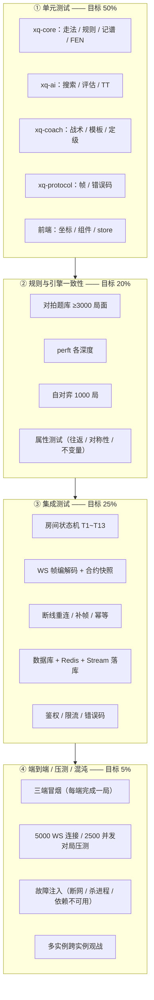
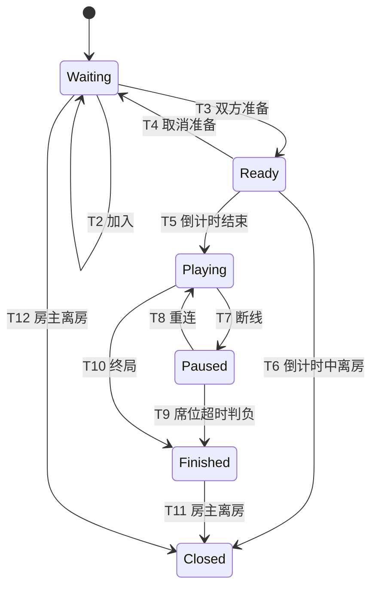
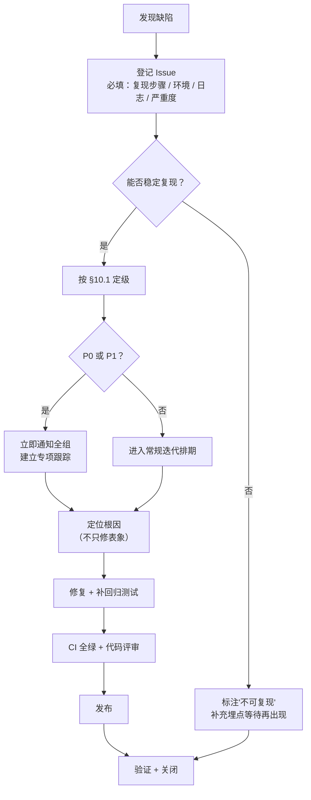

# 12 · 测试策略与质量保障

| 项 | 值 |
|---|---|
| 项目代号 | 弈道 / chinese-chess-rs |
| 文档版本 | v1.0 |
| 状态 | 设计基线（Design Baseline） |
| 编制日期 | 2026-09-23 |
| 目标读者 | 开发、测试、运维、产品 |
| 关联文档 | [docs/01 §8 验收标准](01-需求规格说明书.md) · [docs/01 §9 追踪矩阵](01-需求规格说明书.md) · [docs/02 §2.1 不变量](02-系统架构设计.md) · [docs/03 §11 测试策略](03-规则引擎与领域模型.md) · [docs/03 §11.2 perft](03-规则引擎与领域模型.md) · [docs/03 §12 性能门禁](03-规则引擎与领域模型.md) · [docs/04 §8 测试与标定](04-AI引擎设计.md) · [docs/04 §8.3 性能基准](04-AI引擎设计.md) · [docs/05 §9 质量保障](05-战法讲解引擎设计.md) · [docs/06 §14 协议测试要点](06-联网对战与实时通信协议.md) · [docs/08 §18 前端测试](08-客户端设计.md) · [docs/11 CI 流水线](11-工程规范与CI-CD.md) |

> **本文的定位**：回答「测什么、测到什么程度算够、怎么判定没够、失败怎么办」。
>
> **与 [docs/03 §11](03-规则引擎与领域模型.md) 的关系**：docs/03 §11 是 `xq-core` 的**测试内容清单**（"测什么"）；本文是**测试体系**（分层比例、题库工程化、门禁判定、缺陷流程）。二者不重复，本文给出发动机与判定标准。
>
> **硬约束**：本文所有**规模数字、覆盖率、阈值**均有来源标注；无来源者一律标注为「设计初始值，待实测/校准」，**不得作为验收结论或对外承诺**。

---

## 1. 测试金字塔

### 1.1 分层与比例目标



| 层 | 目标占比 | 为什么是这个比例 |
|---|---|---|
| ① 单元 | **~50%** | 领域层是纯函数，单测成本极低、收益极高。这是唯一能在**秒级**反馈循环中运行的一层，必须承载最大的用例量 |
| ② 规则 / 引擎一致性 | **~20%** | 本项目的**特殊层**。对拍题库、perft、自对弈在传统分类里属"集成"，但它们其实只跑纯计算，只是**数据量驱动**而已。单独成层是因为它承担了「M0 唯一准入条件」的重量（[docs/03 §11.2](03-规则引擎与领域模型.md)） |
| ③ 集成 | **~25%** | 联网对战是本产品的核心价值，其正确性**无法**在任何单元测试中验证（涉及 DB + Redis + 状态机 + 并发）。占比高是刻意的 |
| ④ E2E / 压测 / 混沌 | **~5%** | 成本最高（需真实环境、耗时长、稳定性差），但承担**唯一**能验证 NFR-P.06 / NFR-R.02 / FR-05.05 的任务，不可删减 |

> ⚠️ **比例是"目标"而非"必须"**：实际比例随开发推进自然变化（M0 阶段②占比会远高于 20%）。用比例来**发现失衡**（如"集成测试只有 2%"说明在自欺欺人），而不是用来硬性凑数。

### 1.2 分层与 crate / 需求映射

| 测试层 | 主要 crate | 覆盖的需求组 | 在 CI 中的阶段（见 [docs/11 §5.2](11-工程规范与CI-CD.md)） |
|---|---|---|---|
| 单元 | 全部 | FR-01 / FR-02 / FR-03 / FR-04 / NFR-M.02 | 阶段 5 |
| 规则一致性 | `xq-core`、`xq-ai` | FR-01.02 / FR-01.06 / FR-01.07 | 阶段 5（小样本）+ 阶段 12（全量） |
| 集成 | `xq-server`、`xq-protocol` | FR-05 / FR-06 / FR-08 / NFR-R / NFR-S.01 | 阶段 6 |
| 前端 | `frontend/` | FR-02 / FR-03.12 / NFR-P.01 / NFR-U | 阶段 8 |
| 性能 / 基准 | `xq-core`、`xq-ai` | NFR-P.02 / NFR-P.04 / NFR-P.05 / NFR-P.07 | 阶段 11 |
| 压测 / 混沌 | `xq-server` + 基础设施 | NFR-P.06 / NFR-R.01~03 / FR-05.05 / FR-05.06 | 手动 + 阶段 12 |
| 安全 | `xq-server`、`xq-client` | NFR-S.01~S.10 | 阶段 6 子集 + 独立渗透 |

### 1.3 测试命名与可追溯规范

**用例 ID 规范**：`T-<层>-<模块>-<序号>`，例 `T-CORE-MOVEGEN-014`、`T-INT-ROOM-T08`、`T-E2E-RECONNECT-002`。

**Rust 测试函数命名**：`should_<expected>_when_<condition>`（见 [docs/11 §2.2](11-工程规范与CI-CD.md)）。

**可追溯要求**：每个用例在注释中标注它守护的**需求编号 + 设计文档章节**：

```rust
/// T-CORE-MOVEGEN-014
/// 守护：FR-01.02（蹩马腿）、docs/03 §4.2 马
#[test]
fn should_reject_horse_move_when_leg_blocked_by_own_piece() { /* ... */ }
```

这样做的直接收益：当 [docs/01 §9 追踪矩阵](01-需求规格说明书.md) 中的某条需求变更时，可以用 `grep` 一次性找出所有相关用例。

---

## 2. 分层测试内容

### 2.1 `xq-core` —— 规则内核

> 本节与 [docs/03 §11](03-规则引擎与领域模型.md) 对齐。docs/03 规定"测什么"，本节补充"怎么测、判定标准是什么"。

#### 2.1.1 用例规模目标（来自 [docs/03 §11.1](03-规则引擎与领域模型.md)）

| 层次 | 内容 | 数量目标（docs/03 §11.1） | 判定标准 |
|---|---|---|---|
| 单元测试 | 七种棋子的走法生成、蹩马腿、塞象眼、炮架、九宫限制、河界限制 | ≥ 120 | 全通过 |
| 边界测试 | 棋盘四角、边线、底线、兵到底线、将帅贴脸 | ≥ 40 | 全通过 |
| 规则测试 | 将军、将死、困毙、白脸将、子力不足、60 回合 | ≥ 60 | 全通过 |
| 重复局面 | 长将、长捉、双方长将、一将一捉 | ≥ 25 | 全通过 |
| 记谱往返 | 七种棋子 × 进/退/平 × 前后消歧 | ≥ 80 | 全通过 |
| FEN 往返 | 标准局面 + 随机局面 | `proptest` 10000 次 | 零反例 |
| perft | 各深度节点数 | 5 个深度 | 与项目实测基线一致（见 §2.1.4） |
| 对拍题库 | 公开残局 + 手写边界局面的最佳着法一致性 | ≥ 3000 局面 | 100%（[docs/01 §8.1](01-需求规格说明书.md)） |

#### 2.1.2 走法生成测试点清单

| # | 测试点 | 关键断言 | 易错陷阱 |
|---|---|---|---|
| 1 | 车四方向延伸 | 遇第一个子即止；敌方子可吃 | 穿子（未在遇到第一个子时终止） |
| 2 | 车在棋盘边缘 | 不越界 | 索引回绕（`col-1` 变 255） |
| 3 | 马八方向 | 目标在盘内且非己方子 | 边界上的马（`a0` 仅有 2 个目标） |
| 4 | 马蹩腿 | **蹩腿点必须是空**，与目标点是什么子无关 | 误加"蹩腿点非己方子"条件 |
| 5 | 马蹩腿的四个方向 | 每个方向独立判定（一个方向被蹩不影响其他方向） | 用单一位表示蹩腿 |
| 6 | 相/象四方向 | 田字中心点必须空（塞象眼） | 与马腿混淆 |
| 7 | 相/象不过河 | 红相目标 `row ∈ [0,4]`；黑象 `row ∈ [5,9]` | 用同一套 `row` 判断 |
| 8 | 相/象可达点 | 红相恰好 7 个点：`(2,0)(6,0)(0,2)(4,2)(8,2)(2,4)(6,4)` | — |
| 9 | 仕/士 | 斜一步且目标在**己方**九宫内 | 用对方九宫判定 |
| 10 | 帅/将 | 直一步且目标在**己方**九宫内 | 同上 |
| 11 | 炮移动 | 遇第一个子前的空格都可走 | 与吃子规则混淆 |
| 12 | 炮吃子 | 起点与目标间**恰好一个**棋子（炮架，任意方） | "至少一个"（多子时仍可吃）或"必须是敌方炮架" |
| 13 | 炮隔着两个子 | 不可吃 | 数错中间子数 |
| 14 | 兵未过河 | 仅可前进 | 错误允许横走 |
| 15 | 兵过河 | 前进 + 左右横走 | 边界：`row = 5` 的红兵已过河 |
| 16 | 兵永不后退 | 任何情况都不生成向后的着法 | — |
| 17 | 老兵（到底线） | 保留横走能力，不消失 | 误判为"不能动" |
| 18 | 白脸将 | 走完后将帅同列且中间无子 → 非法 | 未把照面统一进攻击检测 |
| 19 | 自杀着法过滤 | 走完后己方被将军 → 非法 | 漏掉"用别的子挡将"的合法着法 |
| 20 | 将帅吃对方将 | 能生成且被判为合法（对方已被将死前一瞬） | 特殊处理导致死循环 |

#### 2.1.3 终局与重复局面测试点

| # | 测试点 | 关键断言 | 来源 |
|---|---|---|---|
| 21 | 将死 | `GameStatus::Checkmate { loser: 走子方 }` | [docs/03 §5.1](03-规则引擎与领域模型.md) |
| 22 | **困毙判负** | 无合法着法且未被将军 → `Stalemate { loser: 走子方 }`（**判负**，非和棋） | FR-01.06、[docs/03 §5.1](03-规则引擎与领域模型.md) |
| 23 | 60 回合自然限着 | `halfmove_clock >= 120` → `Draw { SixtyMoveRule }` | FR-01.06 |
| 24 | 自然限着遇将军延后 | 已达 120 但正在被将军 → 不判和，继续 | [docs/03 §6.4](03-规则引擎与领域模型.md) |
| 25 | 子力不足：单帅 vs 单将 | 判和 | [docs/03 §5.2](03-规则引擎与领域模型.md) |
| 26 | 子力不足：单帅 vs 单将+士象 | 判和 | 同上 |
| 27 | 子力不足：双方各带士象 | 判和 | 同上 |
| 28 | **子力充足**：仅剩一个未过河兵 | **不判和**（保守策略） | [docs/03 §5.3](03-规则引擎与领域模型.md) |
| 29 | 长将 | 一方每着均将军，第 3 次重复 → 该方判负 | FR-01.07 |
| 30 | 双方长将 | 判和 | [docs/03 §6.3](03-规则引擎与领域模型.md) |
| 31 | 长捉 | 一方每着均捉同一子 → 该方判负 | FR-01.07 |
| 32 | 一将一捉（不同方） | 长将方判负 | 同上 |
| 33 | 一将一杀等复合情形 | 判和 | 同上裁决表的兜底行 |
| 34 | 三次重复的哈希碰撞防护 | 哈希命中后逐格二次比对 | [docs/03 §6.2](03-规则引擎与领域模型.md) |
| 35 | 重复检测不误伤 | 单纯来回走子的普通重复 → 判和而非判负 | — |

#### 2.1.4 perft（与 [docs/03 §11.2](03-规则引擎与领域模型.md) 严格对齐）

perft 是**走法生成正确性的最强守门人**：任何一处走法规则偏差都会导致节点数不符。

| 深度 | docs/03 §11.2 记录值 | 可信度（docs/03 原文） | 本项目判定方式 |
|---|---|---|---|
| 1 | **44** | ✅ **已手工推导验证** | **硬断言**：`assert_eq!(perft(1), 44)`。不通过即规则实现有 bug，可用 [docs/03 §11.2](03-规则引擎与领域模型.md) 的分项表逐类定位 |
| 2 | 1920 | ⚠️ 公开资料值，**未独立验证** | **实测后记录为项目基线**，再作为断言。首次运行前只做 `--nocapture` 打印 |
| 3 | 79666 | ⚠️ 同上 | 同上 |
| 4 | 3290240 | ⚠️ 同上 | 同上（同时兼作性能基准） |
| 5 | 133312995 | ⚠️ 同上 | 同上；**仅在 release 构建 + nightly job 中运行** |

> ⚠️ **诚实声明（与 [docs/03 §11.2](03-规则引擎与领域模型.md) 完全一致）**：除 depth 1 外，上表数值来自公开资料，本项目**未独立验证**。不同实现可能因以下差异导致节点数不同：
> ① 是否将"吃将帅"计入合法着法；② 白脸将的判定时机；③ 是否在第一阶段就过滤自杀着法。
>
> **因此：实现完成后必须自行运行 perft，将实测值记录为项目基线，不得直接引用上表作为验收依据。** 若实测值与上表不符，**先确认是否是上述三点差异造成的合理性分歧**，再判定为自己的 bug。该过程必须写成一段简短记录（存放于 `crates/xq-core/testdata/perft-baseline.md`）。

**perft 实现要点**（避免测出"假的正确"）：

```rust
/// perft 驱动：必须与生产代码共享同一套 make/unmake 与合法着法生成。
/// 任何"测试专用路径"都会让 perft 失去意义。
fn perft(pos: &mut Position, depth: u8) -> u64 {
    if depth == 0 {
        return 1;
    }
    let moves = pos.legal_moves();   // 注意：必须用 legal_moves，不是伪合法
    if depth == 1 {
        return moves.len() as u64;
    }
    let mut nodes = 0;
    for mv in moves {
        pos.make_move(mv).expect("legal_moves 产生的着法必然合法");
        nodes += perft(pos, depth - 1);
        pos.unmake_move();
    }
    nodes
}

/// 附带校验：perft 过程中棋盘状态必须始终一致（debug 构建下）
/// 这能捕获 make/unmake 不对称的隐蔽 bug（比节点数错更危险）。
#[test]
fn perft_depth_1_is_44() {
    let mut pos = Position::startpos();
    assert_eq!(perft(&mut pos, 1), 44, "见 docs/03 §11.2 的 44 项手工推导");
    assert_consistent(&pos, "perft 结束后棋盘应与初始状态完全一致");
}
```

**perft 的附加价值**：perft(1)=44 不通过时，可按 [docs/03 §11.2](03-规则引擎与领域模型.md) 的分项表**分类定位**：

| 分项 | 期望 | 若不符说明 |
|---|---|---|
| 车 × 2 | 4 | 车的射线延伸或阻挡判定有问题 |
| 马 × 2 | 4 | 蹩腿判定有问题（最常见） |
| 相 × 2 | 4 | 塞象眼或"不过河"判定有问题 |
| 仕 × 2 | 2 | 九宫限制有问题 |
| 帅 × 1 | 1 | 九宫限制或"同列照面"有问题 |
| 炮 × 2 | 24 | 炮架计数有问题（最常见：误算成"至少一子"） |
| 兵 × 5 | 5 | 兵的前进方向有问题 |

> **建议实现**：提供 `perft_divide`（按起点分别输出节点数），或 `--features perft-detail`。这样 perft 失败时能直接定位到具体棋子。

#### 2.1.5 记谱与 FEN 往返（属性测试）

| # | 测试点 | 断言 | 规模 |
|---|---|---|---|
| 36 | FEN 往返 | `from_fen(to_fen(pos)) == pos`（含 `halfmove_clock` / 走子方） | `proptest` ≥ 10000 次 |
| 37 | 初始 FEN 字面量 | `Position::startpos().to_fen() == "rnbakabnr/9/1c5c1/p1p1p1p1p/9/9/P1P1P1P1P/1C5C1/9/RNBAKABNR w - - 0 1"` | 硬断言（[docs/03 §8.3](03-规则引擎与领域模型.md)） |
| 38 | 中文记谱往返 | `parse(to_notation(mv)) == mv` | `proptest` ≥ 10000 次 |
| 39 | 七种棋子 × 进/退/平 | 每种棋子的三种动作全覆盖 | ≥ 80 显式用例 |
| 40 | **"进/退"数字语义** | 车/炮/兵 → **步数**；马/相/仕/帅 → **目标路数** | [docs/03 §9.4](03-规则引擎与领域模型.md)，**必须有专门用例集** |
| 41 | 前后消歧：2 子 | 「前 X」/「后 X」省略路数 | [docs/03 §9.3](03-规则引擎与领域模型.md) |
| 42 | 前后消歧：3 子 | 「前 / 中 / 后 X」 | 同上 |
| 43 | 前后消歧：4+ 子 | 「前 / 二 / 三 / … / 后 X」 | 同上 |
| 44 | 前后方向的红黑差异 | 红方「前」= `row` 大；黑方「前」= `row` 小 | **易错点** |
| 45 | 路数换算 | 红 `9-col`；黑 `col+1` | 用"炮二平五 ↔ h2e2"、"炮8平5 ↔ h7e7"双向验证 |
| 46 | 特殊构造局面 | 双车同列、双马同列、三兵同列、五兵同列 | 显式用例（[docs/03 §9.5](03-规则引擎与领域模型.md)） |
| 47 | ICCS 往返 | 90 格全覆盖 | `proptest` + 显式 90 格循环 |
| 48 | 非法记谱 | `"炮二平六"`（无此着法）→ `Err(NotationError)` 而非 panic | 错误路径覆盖 |

#### 2.1.6 一致性不变量（`debug_assertions` 下的常驻校验）

```rust
/// 在 #[cfg(debug_assertions)] 下，每次 make_move / unmake_move 后调用。
/// release 构建中零开销。
pub fn assert_consistent(pos: &Position, ctx: &str) {
    // ① squares 与占据位图一致
    let (red, black) = recompute_occ(&pos.squares);
    assert_eq!(pos.red_occ, red, "{ctx}: 红方位图与棋盘不一致");
    assert_eq!(pos.black_occ, black, "{ctx}: 黑方位图与棋盘不一致");

    // ② king 缓存与实际位置一致
    assert_eq!(find_king(&pos.squares, Color::Red), pos.red_king_sq, "{ctx}: 红帅缓存失效");
    assert_eq!(find_king(&pos.squares, Color::Black), pos.black_king_sq, "{ctx}: 黑将缓存失效");

    // ③ hash 与重算值一致（Zobrist 增量更新正确性）
    assert_eq!(recompute_hash(pos), pos.hash, "{ctx}: Zobrist 增量更新错误");

    // ④ history / move_stack 长度关系正确
    assert_eq!(pos.history.len(), pos.move_stack.len() + 1, "{ctx}: 历史栈长度不匹配");
}
```

> **为什么这是最高性价比的测试**：AI 搜索每秒执行数百万次 make/unmake。位图与棋盘不一致这类 bug 在**单步测试中完全看不出来**（因为单步是自洽的），只会在搜索到第 7 层的某一步突然产生"幽灵棋子"。把 `assert_consistent` 挂进 `make_move` 的 debug 路径，能让这类 bug 在**第一次出现的时刻**就爆炸。

---

### 2.2 `xq-ai` —— 搜索引擎

> 与 [docs/04 §8](04-AI引擎设计.md) 对齐。

#### 2.2.1 正确性测试

| # | 测试点 | 方法 | 判定标准 | 来源 |
|---|---|---|---|---|
| 1 | **不产生非法着法** | 自对弈 1000 局，每步 `make_move` 若返回 `Err` 即失败 | 零非法着法 | [docs/04 §8.1](04-AI引擎设计.md) |
| 2 | **不产生非法局面** | 自对弈中每步调用 `assert_consistent` | 零断言失败 | 同上 |
| 3 | **搜索确定性** | 相同 `StdRng` 种子 + `NodeLimitedStop(n)` → 相同 `SearchResult`（含 `best_move` / `score` / `nodes` / `pv`） | 跑 100 次完全一致 | [docs/04 §8.1](04-AI引擎设计.md)、[ADR-005](14-决策记录ADR.md#adr-005) |
| 4 | 将杀识别 | 构造 N 个"一步杀"局面，断言引擎找到杀着 | 100% 命中 | 同上 |
| 5 | 将杀识别（两步杀） | 构造 N 个"两步杀"局面 | 100% 命中 | 同上 |
| 6 | 将杀分数编码 | 找到杀棋时分数在 `MATE_SCORE` 附近，且"杀的距离"更短者分数更高 | 单调性断言 | 见下方说明 |
| 7 | **TT 正确性（同局面不同路径）** | 同一局面经由不同着法顺序到达，断言评分一致 | 完全一致 | [docs/04 §8.1](04-AI引擎设计.md) |
| 8 | **TT 杀棋分数调整** | 构造中间节点命中 TT 且含 `MATE ± n` 的用例 | 距根距离调整正确 | [docs/04 §3.4「关键陷阱」](04-AI引擎设计.md) |
| 9 | TT 替换策略 | 同槽位冲突时，`depth` 更深者保留 | 命中率符合设计 | [docs/04 §3.4](04-AI引擎设计.md) |
| 10 | TT 键校验 | 索引相同但 `key` 不同 → 视为未命中（不返回错误数据） | 不出现"张冠李戴" | [docs/04 §3.4](04-AI引擎设计.md) |
| 11 | **`root_moves` 完整性** | 断言 `root_moves.len() == legal_moves().len()` | 完全相等 | [docs/04 §9「root_moves 不是可选字段」](04-AI引擎设计.md) |
| 12 | 评估视角约定 | 红优时 `eval(pos) > 0` | 符号正确 | [docs/04 §4.1](04-AI引擎设计.md) |
| 13 | 搜索视角转换 | 走子方为黑时，`SearchResult.score` 仍为**走子方视角** | 符号正确 | [docs/04 §9](04-AI引擎设计.md) |
| 14 | 静态搜索不回退 | 非 beta 截断时，`quiescence` 结果不差于 `stand_pat` | 单调性 | [docs/04 §3.3](04-AI引擎设计.md) |
| 15 | 空着剪枝禁用条件 | 被将军时禁用；残局（攻击子力 ≤ 2）禁用；不连续空着 | 用插桩计数验证 | [docs/04 §3.6](04-AI引擎设计.md) |
| 16 | 开局库命中 | 给定库中局面 → `SearchResult.from_book == true` | — | [docs/04 §7](04-AI引擎设计.md) |
| 17 | 开局库不返回非法着法 | 遍历库中所有 `BookMove`，断言在当前局面合法 | 100% | — |
| 18 | 难度随机化在容差内 | L1/L2/L3 的着法分差 ≤ `tolerance`（80/40/20） | 100% | [docs/04 §6.3](04-AI引擎设计.md) |
| 19 | 失误率统计 | L1 跑 1000 次决策，非最优着法比例 ≈ 30%（±5 个百分点） | 统计区间 | [docs/04 §6.2](04-AI引擎设计.md) |
| 20 | `StopSignal` 响应 | 设置 `NodeLimitedStop(1024)`，断言搜索在 ≤ 2048 节点内停止 | ≤ 2 倍检查间隔 | [docs/04 §5.1](04-AI引擎设计.md) |

**#6 将杀分数编码说明**：杀棋分数必须保证"更快的杀"分数更高、且不与其他分数混淆。推荐 `MATE_SCORE = 30000`、`score = MATE_SCORE - distance_to_mate`。这样 ① 更短的杀 → 分数更高；② 所有杀棋分数 > 任何常规评估值（`±10000` 量级）；③ 被将死时用 `-MATE_SCORE + distance`。
**必须有用例断言"distance 更短者分数更高"**，否则引擎会"找到了杀却拖延"。

#### 2.2.2 镜像对称性测试（**最高性价比的 bug 探测器**）

> 来源：[docs/04 §8.1](04-AI引擎设计.md)「评估对称性：`eval(pos) == -eval(mirror(pos))`」

```rust
/// T-AI-EVAL-MIRROR
/// 镜像断言：把棋盘上下翻转（row → 9 - row）、交换双方颜色，
/// 得到的新局面在交换视角后，评估值必须精确取反。
///
/// 这一个测试能同时捕获：
///   ① PST 表不对称（写了红方专用表却忘了镜像）
///   ② 阶段系数计算错误（只用了一方的子力统计）
///   ③ 子力价值遗漏（某种棋子未计入）
///   ④ 兵/卒方向处理错误（"过河"判定只写了一个方向）
///   ⑤ 将帅安全评估的左右不对称
#[test]
fn eval_should_be_negated_under_mirror() {
    let positions = load_test_positions("testdata/eval_symmetry/*.fen");
    assert!(positions.len() >= 200, "对称性测试的局面集应覆盖各阶段");

    for fen in positions {
        let pos = Position::from_fen(&fen).expect("题库中的 FEN 必须合法");
        let mirrored = mirror_position(&pos);   // row 翻转 + 红黑互换

        let e1 = eval_red_perspective(&pos);
        let e2 = eval_red_perspective(&mirrored);

        assert_eq!(
            e1, -e2,
            "镜像对称性被破坏\n  原局面: {fen}\n  eval = {e1}\n  镜像后: {}\n  eval = {e2}",
            mirrored.to_fen()
        );
    }
}

/// 镜像函数自身的往返性（防止"镜像函数写错所以测试假通过"）
#[test]
fn should_restore_original_after_double_mirror() {
    for fen in load_test_positions("testdata/eval_symmetry/*.fen") {
        let pos = Position::from_fen(&fen).unwrap();
        assert_eq!(mirror_position(&mirror_position(&pos)), pos);
    }
}
```

**局面集要求**：`testdata/eval_symmetry/` 至少 200 个局面，覆盖：开局 / 中局 / 残局各 ≥ 40；车炮马仕相兵各只剩 1 种的局面各 ≥ 10；兵已过河 / 未过河各 ≥ 20；将帅在九宫不同位置的局面 ≥ 20。

**为什么用 `assert_eq!` 而非容差比较**：评估函数的分档阈值与子力价值都是**整数**（[docs/04 §4.2](04-AI引擎设计.md)）。若出现浮点误差，说明阶段权重混合（[docs/04 §4.4](04-AI引擎设计.md) 的 `phase_factor` 用 `f32`）泄漏进了最终分数——**这本身就是一个需要修的设计问题**。因此对称性必须精确相等。

#### 2.2.3 性能基准测试

目标值来自 [docs/04 §8.3](04-AI引擎设计.md) 与 [docs/03 §12](03-规则引擎与领域模型.md)，**均为设计目标，须实测回填**。

| 基准 | 目标（来源） | 测试方法 | 劣化告警线 |
|---|---|---|---|
| NPS（每秒节点数） | ≥ 1M 单核（[docs/04 §8.3](04-AI引擎设计.md)） | 固定中局局面，固定节点数计时 | **> 20%**（[docs/04 §8.3](04-AI引擎设计.md) 原文） |
| L3 档单步耗时 | < 1 s（[docs/04 §8.3](04-AI引擎设计.md)、[docs/01 §4.4](01-需求规格说明书.md)） | 固定中局局面集 | > 20% |
| `quiescence` 平均深度 | 4~8 层（[docs/04 §8.3](04-AI引擎设计.md)） | 统计 | 超出区间 |
| TT 命中率（中局） | ≥ 25%（[docs/04 §8.3](04-AI引擎设计.md)） | 统计 | 下降 > 20% |
| 迭代加深冗余率 | < 20%（[docs/04 §8.3](04-AI引擎设计.md)） | 统计 | 上升 > 20% |
| L1 / L2 / L4 / L5 档耗时 | < 50 ms / < 200 ms / < 3 s / ≤ 3 s | 固定局面集 | 超目标即失败（[docs/01 §4.4](01-需求规格说明书.md)、[docs/04 §6.2](04-AI引擎设计.md)） |
| `root_moves` 完整输出的代价 | 记录基线 | criterion | > 20%（[docs/04 §9](04-AI引擎设计.md) 明确这是"为讲解功能付出的必要性能代价"） |

**固定的测试局面集**（[docs/04 §8.3](04-AI引擎设计.md) 要求）：

```
crates/xq-ai/benches/positions/
├── middlegame/     # 20 个典型中局（炮马对峙、车炮配合、多兵推进）
├── endgame/        # 20 个典型残局（车兵 vs 士象全、马炮残局、双车残局）
└── tactics/        # 20 个战术局面（含一步杀、两步杀、抽将）
```

**跨版本可比性要求**：① 局面集存仓库，任何修改需在 PR 中说明理由（改了就不再历史可比）；② 基准结果附带**机器规格**（CPU 型号 / 核心数 / 内存），机器更换 = 基线失效；③ 确定性基准（`NodeLimitedStop`）与墙钟基准**分开报告**——前者用于跨机器比较棋力，后者用于体验评估。

#### 2.2.4 棋力标定测试

来源：[docs/04 §8.2](04-AI引擎设计.md)。

| 项 | 方法 | 达标线 |
|---|---|---|
| 相邻档位胜率 | L4 vs L3、L3 vs L2 各 200 局（双方换先） | 胜率落在 **60%~75%** 区间（[docs/04 §8.2](04-AI引擎设计.md)） |
| 人类测试 | 新手 / 业余初段 / 业余中段各 ≥ 30 局 | 记录胜率，用于修订 UI 文案 |
| 横向对比 | 与公开引擎在相同限时下对弈 | 估计 Elo 区间（条件允许时） |

> ⚠️ **标定产出的参数**（子力价值、PST 分量、阶段系数端点、随机化容差与失误率、L5 实际深度）在标定前**全部是设计初始值**，标定后必须回写 [docs/04 §4.2 / §4.3 / §4.4 / §6.3 / §8.2](04-AI引擎设计.md)。
>
> ⚠️ **UI 文案的依赖性**：[docs/04 §6.4](04-AI引擎设计.md) 的"接近业余强手水平"等描述**必须在标定完成后**才可使用。本文重申：**未标定前不得用于任何对外文案**。

---

### 2.3 `xq-coach` —— 战法讲解

> 与 [docs/05 §9](05-战法讲解引擎设计.md) 对齐。

#### 2.3.1 单元测试

| # | 测试点 | 方法 | 判定标准 | 来源 |
|---|---|---|---|---|
| 1 | **占位符完整性** | 遍历模板库**所有**模板，用最大完备上下文渲染，断言结果**不含 `{` 或 `}` 残留** | 零残留 | [docs/05 §5.2 红线](05-战法讲解引擎设计.md)、[docs/05 §9.1](05-战法讲解引擎设计.md) |
| 2 | 占位符白名单 | 模板中出现的所有 `{xxx}` 都在 [docs/05 §5.2](05-战法讲解引擎设计.md) 的允许列表内 | 零未知占位符 | [docs/05 §9.4](05-战法讲解引擎设计.md) |
| 3 | 降级链正确性 | 构造"专用模板缺失"→ 回退到通用战术模板；再缺失 → 通用着法模板；再缺失 → 兜底模板 | 逐级正确回退 | [docs/05 §5.3](05-战法讲解引擎设计.md) |
| 4 | **兜底模板可识别** | 使用兜底模板时，`CoachNote` 必须能被识别为兜底（用于覆盖率统计） | 标记正确 | [docs/05 §5.3 覆盖率口径](05-战法讲解引擎设计.md) |
| 5 | **评价阈值边界** | 逐一验证分差 **9 / 10 / 11**、**49 / 50 / 51**、**149 / 150 / 151**、**399 / 400 / 401** | 档位正确（含边界归属） | [docs/05 §9.1](05-战法讲解引擎设计.md)、[docs/01 §4.3](01-需求规格说明书.md) |
| 6 | 特殊规则：造成将死 | 强制 `Best`（无论分差） | 强制生效 | [docs/05 §4.2](05-战法讲解引擎设计.md) |
| 7 | 特殊规则：错失一步杀 | 强制 `Missed` | 强制生效 | 同上 |
| 8 | 特殊规则：直接送将 | 强制 `Blunder` | 强制生效 | 同上 |
| 9 | 特殊规则：均势局面 | 评分接近 0 时，等级上限为 `Dubious` | 上限生效 | 同上 |
| 10 | 战术识别（L1 结构层） | 每个模式 ≥ 3 正例 + 3 反例 | 全部正确 | [docs/05 §9.1](05-战法讲解引擎设计.md) |
| 11 | 战术识别（L2 关系层） | 捉双 / 牵制 / 闪击 / 抽将 等，各 ≥ 3 正例 + 3 反例 | 全部正确 | 同上 |
| 12 | 战术识别（L3 棋形层） | 24 条棋形库条目，各 ≥ 3 正例 + 3 反例 | 全部正确 | [docs/05 §3.5](05-战法讲解引擎设计.md) |
| 13 | `confidence` 字段 | `Formation` 类（L3）置信度计算正确，< 0.7 时可被 UI 识别为弱样式 | 区间正确 | [docs/05 §7 注](05-战法讲解引擎设计.md) |
| 14 | 开局定式匹配 | 按 `sequence_iccs` **前缀最长匹配**；超过 `max_ply` 后不再匹配 | 匹配正确 | [docs/05 §5.4](05-战法讲解引擎设计.md) |
| 15 | 语体档位 | `concise` / `standard` / `verbose` 三档均能渲染 | 三档可用 | [docs/05 §5.1](05-战法讲解引擎设计.md) |
| 16 | 中日韩字符渲染 | 讲解文本 UTF-8 完整性（无乱码、无截断） | 零乱码（FR-03.12） | [docs/01 FR-03.12](01-需求规格说明书.md) |
| 17 | 素材 schema 校验 | `assets/knowledge/*.json`：id 唯一、占位符在白名单、模板引用存在、谓词存在 | **构建期硬失败** | [docs/05 §9.4](05-战法讲解引擎设计.md) |
| 18 | 覆盖率统计 | 1000 局棋谱的兜底模板占比 | 兜底率 ≤ 5%（即覆盖率 ≥ 95%） | [docs/05 §9.3](05-战法讲解引擎设计.md)、[docs/01 §8.1](01-需求规格说明书.md) |

#### 2.3.2 「`analyze` 永不失败」契约测试（**红线**）

> [docs/05 §7.1](05-战法讲解引擎设计.md)：`analyze` **永不失败**（返回兜底讲解而非 `Result`）。
> [docs/05 §9.1](05-战法讲解引擎设计.md)：用随机局面 + 随机着法调用 10000 次，断言**永不 panic**。

```rust
/// T-COACH-NEVERFAIL
/// 契约：analyze 永不 panic、永不返回空内容、永不泄漏未替换占位符。
/// 这是保证"讲解绝不成为对局单点故障"的唯一验证手段（docs/05 §7.1）。
#[test]
fn analyze_should_never_panic_and_always_produce_note() {
    let coach = Coach::with_default_knowledge();
    let mut rng = StdRng::seed_from_u64(0x5EED_C0AC_1234_5678);   // ADR-005：显式种子

    // ① 随机合法对局轨迹中的每一步（100 局 × 最多 200 步）
    for _game_idx in 0..100 {
        let mut pos = Position::startpos();
        let mut ctx = GameContext::new();
        for _ply in 0..200 {
            let moves = pos.legal_moves();
            if moves.is_empty() { break; }

            let mv = moves[rng.random_range(0..moves.len())];
            let search = SearchResult::synthetic_for_test(&pos, moves.clone());

            let note = coach.analyze(&pos, mv, &search, &ctx);

            // 断言 1：不 panic（由测试自身不崩体现）
            // 断言 2：结构完整
            assert!(!note.headline.trim().is_empty(), "headline 不得为空");
            assert!(!note.detail.trim().is_empty(),   "detail 不得为空");
            // 断言 3：不得有未替换的占位符（docs/05 §5.2 红线）
            assert!(!note.headline.contains('{') && !note.headline.contains('}'),
                    "headline 含未替换占位符: {}", note.headline);
            assert!(!note.detail.contains('{') && !note.detail.contains('}'),
                    "detail 含未替换占位符: {}", note.detail);
            // 断言 4：等级必须是五个合法值之一
            assert!(matches!(note.level,
                Level::Best | Level::Good | Level::Dubious | Level::Blunder | Level::Missed));

            pos.make_move(mv).expect("来自 legal_moves，必然合法");
            ctx.push(mv);
        }
    }

    // ② 退化输入：故意构造边界与异常场景
    for (name, search) in degenerate_search_results() {
        let pos = Position::startpos();
        let mv = pos.legal_moves()[0];
        let note = coach.analyze(&pos, mv, &search, &GameContext::new());
        assert!(!note.detail.is_empty(), "退化场景 [{name}] 应产出兜底讲解");
    }
}
```

**退化输入清单**（必须全部覆盖）：空 `root_moves`、评分全为 0、分差极大（`i32::MAX / 2`）、仅剩双方将帅的局面、无着法可用（终局）、将军状态、战术库为空、无开局匹配、规则版本异常。

**必配套的实现约束**：

| 约束 | 检查手段 |
|---|---|
| `xq-coach` 源码中零 `unwrap` / `expect` / `panic!` | clippy deny（见 [docs/11 §1.4](11-工程规范与CI-CD.md)） |
| 内部函数返回 `Option` / `Result` 时，**调用处必须有兜底分支** | 评审 + 覆盖率（兜底分支必须被测试覆盖） |
| 模板渲染失败必须回退，**不得向前传播** | 用例 3（降级链） |

#### 2.3.3 LLM 幻觉拦截测试

> 来源：[docs/05 §6.3](05-战法讲解引擎设计.md)「幻觉抑制的三道防线」、[docs/05 §9.1](05-战法讲解引擎设计.md)「构造含幻觉的模拟 LLM 响应，验证被正确拦截」。

| # | 测试点 | 构造的恶意/异常响应 | 期望行为 |
|---|---|---|---|
| 1 | **编造棋子坐标** | 返回"红车从 a9 走到 e5"（原始输入中不存在该着法） | 校验失败 → 丢弃 → 回退本地模板 |
| 2 | **编造战法名** | 返回"这是经典的'飞天炮'战术"（战术库中不存在） | 校验失败 → 回退 |
| 3 | 编造不符的评价 | 本地事实是 `Blunder`，LLM 说"这是绝佳的一步" | 校验失败 → 回退 |
| 4 | 编造不存在的开局名 | 返回不在开局库中的名称 | 校验失败 → 回退 |
| 5 | 返回超长内容 | 返回 10000 字符 | 截断或回退（有长度上限） |
| 6 | 返回空内容 | 返回空字符串 | 回退 |
| 7 | 返回非法控制字符 | 返回包含控制字符的字符串 | 清洗或回退 |
| 8 | 返回含注入载荷 | 返回 `<script>` / `` / markdown 注入 | **前端渲染必须转义**（见 §2.6 综合用例） |
| 9 | 混入 prompt 内容 | 返回 system prompt 片段 | 校验失败 → 回退 |
| 10 | 返回正确的润色结果 | 与本地事实完全一致的措辞优化 | **接受**（正向用例，防止"过度拦截"使 LLM 增强形同虚设） |

**降级链的完整验证矩阵**（覆盖 [docs/01 §8.3](01-需求规格说明书.md)「LLM 讲解降级测试：断网 / 服务超时 / 返回异常时均正确降级」）：

| 场景 | 注入方式 | 期望结果 |
|---|---|---|
| LLM 未配置 | `llm_enabled = false` | 只用本地模板，无错误日志污染 |
| 网络不可达 | `LlmClient` 实现返回 `Err(LlmError::Network)` | 静默回退本地（`WARN` 级日志） |
| 请求超时 | 实现内部等待超过 `timeout_ms`（默认 3000 ms） | 静默回退本地 |
| 返回非法 JSON | 返回无法解析的响应体 | 回退本地 |
| 触发日预算熔断 | 把预算计数器打到上限 | 回退本地，且**不再发起新请求**（验证熔断真的短路） |
| 服务返回 5xx | 返回错误码 | 回退本地 + 记录失败计数 |
| 返回幻觉内容 | 上表 1~9 | 回退本地 |
| 正常返回 | 合规内容 | 使用增强结果，且保留本地事实字段 |

**降级成功率的判定**（[FR-03.08](01-需求规格说明书.md) 要求「降级成功率 100%」）：上表**全部场景**必须有用户可感知的、**结构完整**的讲解输出——即降级后讲解的字段完备性与本地路径完全一致，只是表达丰富度下降。

---

### 2.4 `xq-server` —— 服务端

> 与 [docs/06 §14 协议测试要点](06-联网对战与实时通信协议.md) 对齐。**该节共 70 条用例，是本 crate 的测试基线**，本文不重复枚举，只补充分层归属与判定标准。

#### 2.4.1 接口测试（REST）

| # | 测试点 | 判定标准 | 来源 |
|---|---|---|---|
| 1 | 端点合约 | 每个端点的请求/响应字段与 [docs/10 §3](10-API接口规范.md) 一致（用 `insta` 快照锁定） | [docs/10 §12 C-07](10-API接口规范.md) |
| 2 | 错误码契约 | 46 项错误码在 `xq-protocol::ApiError` 中一一实现；`retryable` 由服务端计算 | [docs/10 §12 C-06](10-API接口规范.md) |
| 3 | ID 字段类型 | 所有对外 ID 字段为 `String`，**禁止 `i64`** | [docs/10 §12 C-05](10-API接口规范.md) |
| 4 | 分页规范 | 各列表端点的分页参数与游标语义一致 | [docs/10 §5](10-API接口规范.md) |
| 5 | 幂等性 | 相同 `Idempotency-Key` 重复请求返回同一结果 | [docs/10 §8](10-API接口规范.md) |
| 6 | 错误消息不含内部细节 | 断言响应体中不含 SQL 关键字 / 文件路径 / `Debug` 结构 | [docs/02 §10 原则 1](02-系统架构设计.md)、[docs/11 §5.3](11-工程规范与CI-CD.md) |
| 7 | 排序稳定性 | 大厅列表、排行榜在数据不变时多次查询顺序一致 | — |
| 8 | 边界值 | 分页超上限、时间范围跨度过大、排序字段非法 → 明确错误码而非 500 | — |
| 9 | 请求体上限 | 超过 64 KiB 的请求体被拒（[docs/10 §12 L-15](10-API接口规范.md)） | — |

#### 2.4.2 房间状态机测试（T1~T13）

状态定义与转移见 [docs/06 §4](06-联网对战与实时通信协议.md)。**每条转移至少 1 个正例 + 1 个非法转移反例**。



| 转移 | 正例断言 | 反例断言 | 守卫条件 |
|---|---|---|---|
| T1 建房 | `RoomCreated` + 6 位房间号 + Redis 归属键 TTL = 7200 | 未鉴权 → 拒绝；已在其他房间 → `ROOM005`；配置非法 → `ROOM008`；超限流 → `RATE001` | 4 个守卫 |
| T2 加入 | 分配空座 + 广播 `RoomState` | 满员 → `ROOM002`；已开局 → `ROOM003`；自身在其他房间 → `ROOM005`；房间不存在 → `ROOM001` | 4 个守卫 |
| T3 准备 → Ready | `Countdown{starts_in_ms: 3000}` | 只有一方准备 → 不进入 `Ready` | 两座满 + 双 ready |
| T4 取消准备 | 3 秒后**不**出现 `GameStart` | 倒计时已结束 → 不可回退 | 处于倒计时阶段 |
| T5 开局 | `GameStart` + 颜色分配 + `seq == 0` | `rules_version` 不一致 → `SESS004` 并回退 `Waiting` | 两座满 + rules_version 一致 + 双方在线 |
| T6 倒计时中离房 | 另一方收 `ROOM004`，房间销毁 | 倒计时已到期 → 走 T5 | 倒计时未到期 |
| T7 断线 → Paused | 另一方收提示；`games` 记录未标记结束；**局时继续流逝、步时暂停** | 对局已终局 → 不进入 `Paused` | 对局未终局 |
| T8 重连 | 快照 + 补帧，时钟与连接前连续 | `session_token` 过期 → `SESS002`；身份不符 → 拒绝；席位超时 → 拒绝 | 3 个守卫 |
| T9 席位超时 | `DisconnectForfeit` 判负 + 双方收 `GameOver` + 棋谱落库（含断线标记） | 在 120 s 内恢复 → 走 T8 | 计时到期 |
| T10 终局 | 战绩 + 积分 + 流水在**同一 PG 事务**内；排行榜 ZSet 更新 | `Finished` 后发 `MoveRequest` → `GAME003` 且状态不变 | 对局在 `Playing` |
| T11 终局→关闭 | 通知观战者 `ROOM004`；删除快照键；释放归属键 | 有观战者且非房主显式关闭 → 不关闭 | 守卫条件 |
| T12 空房关闭 | 释放归属键与快照键 | 房间还有其他玩家 → 不关闭 | — |
| T13 空闲超时 | 900 s 后房间回收，Redis 键消失（[docs/06 §4.3 T13](06-联网对战与实时通信协议.md)） | 有活跃连接 → 不回收 | 无活跃连接且未在对局中 |

> **`Paused` 的两个非对称规则**（[docs/06 §4.1 注](06-联网对战与实时通信协议.md)）：**断线时局时继续、步时暂停**。两条都**必须有专门用例**，因为它们是防"断线拖延"与防"弱网误伤"的平衡点。
>
> ⚠️ [docs/06 §4.1](06-联网对战与实时通信协议.md) 已标注该规则是**设计初始值，待实测/校准**（需评估 ① 主动拔网线规避步时压力、② 弱网用户被误伤 两类滥用）。因此本文额外要求两组**滥用场景用例**：① 连续断线-重连 20 次的行为统计；② 高丢包（30%）网络下的误判率统计。**这两组用例的判定标准待校准后确立**（[docs/06 §4.1](06-联网对战与实时通信协议.md) 给出的备选方案是"每局断线时暂停步时的累计上限 60 秒"）。

#### 2.4.3 断线重连测试

| # | 测试点 | 判定标准 | 编号来源 |
|---|---|---|---|
| 1 | **随机杀进程 50 次**（对局中） | 恢复成功率 **100%** | [docs/01 §8.2](01-需求规格说明书.md)、[docs/06 §14.5 #50](06-联网对战与实时通信协议.md) |
| 2 | 断线期间对方走 10 步后恢复 | 补帧 10 条，全部 `replay: true`，最终 FEN 一致 | #51 |
| 3 | 断线期间对局已终局 | 收到 `SessionResumed` + 终局快照 | #52 |
| 4 | 断线超过 120 s | `SESS002`，提示已判负 | #53 |
| 5 | 伪造 `last_seq`（大于服务端值） | 服务端以自身值为准，不补帧，客户端自我纠正 | #54 |
| 6 | `last_seq = 0` | 完整快照 + 全部补帧（上界 1000） | #55 |
| 7 | 补帧超 1000 条 | 降级为仅全量快照 | #56 |
| 8 | 重复 `Resume` | 幂等，服务端状态不变 | #57 |
| 9 | 退避参数 | 1~10 次尝试的延迟均落在 ±20% 区间 | #58 |
| 10 | 网络抖动（丢包 30%、延迟 200ms±100ms）下重连 100 次 | 成功率 **≥ 99%**，恢复耗时 P95 ≤ 5 s | #59 |
| 11 | 多实例下重连到非归属实例 | 回 `SESS008`，重新建连后成功 | #60 |
| 12 | **恢复状态完整性（6 项）** | 对局元信息 / 完整着法历史 / 双方剩余局时 + 步时 / 轮次 + 将军态 / 讲解历史 / 待决请求 —— **缺一即失败** | [docs/01 FR-05.06](01-需求规格说明书.md) |

> **口径说明（重要，避免与已有文档矛盾）**：
> [docs/01 FR-05.06](01-需求规格说明书.md) 与 [docs/01 §8.2](01-需求规格说明书.md) 要求「30 秒内重连成功率 **100%**」（50 次杀进程的验收口径）；[NFR-R.02](01-需求规格说明书.md) 要求「断线重连成功率 **≥ 99.9%**（30 秒窗口内）」。
> 二者**不是矛盾，而是口径不同**：
> - **100% / 50 次** —— **里程碑准入的离散验收口径**。受控测试环境下必须成立（[docs/01 §8.2](01-需求规格说明书.md)、[docs/06 §14.5 #50](06-联网对战与实时通信协议.md)）。
> - **≥ 99.9%** —— **生产运行的长期 SLO 口径**。真实网络的丢包、机房故障等不可控因素被计入（[NFR-R.02](01-需求规格说明书.md)）。
>
> **本文的判定规则：M2 准入按 100%（50 次）判定；压测与长期监控按 ≥ 99.9% 判定。两个数字不得混用。**

#### 2.4.4 并发测试

| # | 测试点 | 方法 | 判定标准 |
|---|---|---|---|
| 1 | 房间 Actor 串行性 | 对同一房间并发投递 100 个命令（不同玩家/相同玩家混合） | 状态最终一致，无死锁，`seq` 无重号 |
| 2 | 并发加入竞争 | 10 个连接同时加入只有 1 个空座的房间 | 恰好 1 个成功，9 个收 `ROOM002` |
| 3 | 并发准备 + 离开 | 一方准备的同时另一方离开 | 不进入 `Playing`；不出现 `GameStart` 后立即 `GameOver` 的怪异序列 |
| 4 | 计时器与走子竞争 | 在超时边界（±50 ms）并发发送合法走子 | 判定**唯一且可解释**（要么吃步、要么超时），**不得两个都生效** |
| 5 | 观战广播隔离 | 50 个观战者订阅时，走子广播延迟不受影响 | 帧延迟 P99 不因观战者增加而恶化 |
| 6 | **跨房间崩溃隔离** | 人为注入单房间 panic | 其他房间继续正常运行（[ADR-006](14-决策记录ADR.md#adr-006) 崩溃隔离） |
| 7 | 匹配队列并发抢占 | 多 worker 同时抢占同一匹配任务 | 同一对玩家不会被匹配两次 |
| 8 | 共享状态审查 | 全局房间索引的读写 | 无锁顺序问题（[ADR-006](14-决策记录ADR.md#adr-006) 明确不用共享锁模型） |

#### 2.4.5 鉴权测试

| # | 测试点 | 判定标准 |
|---|---|---|
| 1 | 无 token 访问受保护端点 | `AUTH001` |
| 2 | 过期 token | `AUTH002` |
| 3 | 篡改签名 | `AUTH001`，且**不得**因解析异常返回 500 |
| 4 | refresh token 轮换 | 旧 token 使用后失效；重复使用 → 拒绝（防重放） |
| 5 | 登出后 token 失效 | `users.token_version` / refresh 白名单生效（[docs/10 §12 C-01](10-API接口规范.md)） |
| 6 | 越权访问他人资源 | 访问他人棋谱 / 资料 / 战绩 → 明确拒绝，不返回他人数据 |
| 7 | WS 未 `Hello` 直接发 `Auth` | `SESS003` 并关闭（[docs/06 §14.2 #11](06-联网对战与实时通信协议.md)） |
| 8 | 同账号二次连接 | 旧连接收 `SESS005` 被关闭 |
| 9 | 客户端伪造玩家身份走子 | 服务端以会话身份为准（而非帧中声称的身份） |
| 10 | 伪造观战者身份订阅未授权房间 | 拒绝 |

#### 2.4.6 服务端权威裁决测试（**NFR-S.01 的验证**）

| # | 测试点 | 判定标准 | 编号来源 |
|---|---|---|---|
| 1 | **篡改着法：一步吃对面将** | 被 `GAME001` 拒绝，对局状态**不变** | [docs/06 §14.4 #45](06-联网对战与实时通信协议.md) |
| 2 | 蹩马腿的非法着法 | `GAME001` | #42 |
| 3 | 走对方棋子 | `GAME005` | #43 |
| 4 | 非本方回合走子 | `GAME002` | #44 |
| 5 | 提交伪造的 FEN | 服务端**忽略**客户端 FEN，以自身 `Position` 为准 | [NFR-S.01](01-需求规格说明书.md) |
| 6 | 提交伪造的剩余时间 | 服务端以自身时钟为准（[ADR-014](14-决策记录ADR.md#adr-014)） | [NFR-S.02](01-需求规格说明书.md) |
| 7 | 客户端本地与服务端不一致 | 收 `GAME007` + `snapshot`，整盘替换后恢复 | #47 |
| 8 | 连续 100 步随机合法对局 | 全程无 `MoveRejected`，`seq` 连续无跳号 | #46 |
| 9 | 重放攻击：重发历史合法着法 | `client_move_no` 校验 → `GAME008` 或幂等重发 | #39 / #40 |

---

### 2.5 `xq-client` —— 客户端 Rust 侧

| # | 测试点 | 方法 | 判定标准 |
|---|---|---|---|
| 1 | **命令层测试** | 每个 `#[tauri::command]` 直接调用（不经过 WebView），验证入参校验与出参结构 | 与前端期望的结构一致（与 TS 类型定义比对） |
| 2 | 命令层不阻塞 | 断言耗时 > 16 ms 的命令是 `async` 且投递到引擎线程池（[docs/02 §4.3](02-系统架构设计.md)） | 严格符合 |
| 3 | **本地引擎结果一致** | 同一局面 + 相同 `SearchLimits` + `NodeLimitedStop`，客户端引擎与服务端引擎结果**完全一致**（同一份 `xq-ai`） | 逐位一致 |
| 4 | 本地引擎不阻塞主线程 | 主线程发起 AI 思考，同时测量主线程事件循环延迟 | 主线程无卡顿（[FR-04.08](01-需求规格说明书.md)） |
| 5 | AI 思考可中断 | 发起搜索后立即取消 | 1 ms 内响应停止（[docs/04 §1](04-AI引擎设计.md)、[FR-04.04](01-需求规格说明书.md)） |
| 6 | **离线路径完整** | 断网状态下：走子校验 + 提示 + 本地讲解 + 人机对局全部可用 | 全部可用（[NFR-R.06](01-需求规格说明书.md)、[FR-03.06](01-需求规格说明书.md)） |
| 7 | WS 重连状态机 | 指数退避 1s→2s→4s→…→30s，带 ±20% 抖动；服务端 `Restart` 关闭码 → **立即重连不等退避** | 符合 [docs/06 §6](06-联网对战与实时通信协议.md)、[docs/06 §14.2 #21](06-联网对战与实时通信协议.md) |
| 8 | 帧应用幂等 | 重复收到同一 `seq` 帧 → 第二次被丢弃 | [docs/06 §14.4 #49](06-联网对战与实时通信协议.md) |
| 9 | 乱序帧处理 | 构造 `seq+2` → 触发 `Resume` 补帧 | #48 |
| 10 | **客户端无密钥** | 断言客户端二进制中**不含**任何 API Key / 服务端密钥 | [NFR-S.09](01-需求规格说明书.md) |
| 11 | 本地持久化 | 棋谱保存 / 读取往返无损；配置文件损坏不导致启动失败 | 无损 + 容错 |
| 12 | 回滚状态机 | 收 `MoveRejected` → 回滚棋盘 + 全量同步 + 提示，与重放后的服务端状态一致 | [ADR-003](14-决策记录ADR.md#adr-003) |
| 13 | 规则版本协商 | 与服务端 `rules_version` 不一致时拒绝开局 | [ADR-003](14-决策记录ADR.md#adr-003) 后果条款 |
| 14 | 时钟插值 | 客户端只做本地插值显示，`ClockSync` 到达后校正；改系统时间不影响显示 | [ADR-014](14-决策记录ADR.md#adr-014)、[docs/06 §14.6 #65](06-联网对战与实时通信协议.md) |

---

### 2.6 前端（React + Vite + TS）

> 与 [docs/08 §18](08-客户端设计.md) 对齐。

#### 2.6.1 工具与分工

| 层次 | 工具 | 覆盖内容 |
|---|---|---|
| 单元测试 | Vitest | 坐标换算、store、纯函数、工具 |
| 组件测试 | Vitest + Testing Library | 棋盘渲染、讲解卡片、评价徽标、对话框 |
| 快照测试 | Vitest snapshot | 棋盘 DOM 结构、讲解卡片结构 |
| 交互测试 | Playwright | 点击落子、拖拽落子、非法回弹、历史浏览、键盘操作 |
| 视觉回归 | Playwright + 截图比对 | 三端渲染一致性（[ADR-002](14-决策记录ADR.md#adr-002) 权衡条款） |
| 性能测试 | Playwright trace + 手动基准 | 拖拽帧率、启动耗时、内存 |

#### 2.6.2 坐标换算测试（**90 格全覆盖，硬要求**）

> 依据：[ADR-008](14-决策记录ADR.md#adr-008) 后果条款「前端需要一个纯粹的坐标换算模块（ICCS ↔ 像素），并有对应测试」、[docs/11 §2.4](11-工程规范与CI-CD.md)。

```typescript
// src/coords/coords.test.ts
import { describe, expect, it } from 'vitest';
import { iccsToPixel, pixelToIccs, iccsToSquare, squareToIccs, mirrorRow } from './index';

describe('坐标换算', () => {
  // ---- 1. 90 格全覆盖往返（不能只抽样！）----
  it('should round-trip all 90 squares from ICCS to pixel and back', () => {
    const cols = 'abcdefghi';
    let checked = 0;

    for (let row = 0; row < 10; row++) {
      for (let col = 0; col < 9; col++) {
        const iccs = `${cols[col]}${row}`;
        const sq = iccsToSquare(iccs);
        const px = iccsToPixel(sq);
        const back = pixelToIccs(px);
        expect(back, `ICCS ${iccs} 往返失败`).toBe(iccs);
        expect(squareToIccs(sq)).toBe(iccs);
        checked++;
      }
    }

    expect(checked).toBe(90); // 断言确实覆盖了全部 90 格
  });

  // ---- 2. 行列单调性（防止 x/y 互调）----
  it('should keep pixel growth monotonic in col and row', () => {
    expect(iccsToPixel(iccsToSquare('b0')).x).toBeGreaterThan(iccsToPixel(iccsToSquare('a0')).x);
    expect(iccsToPixel(iccsToSquare('a1')).y).toBeGreaterThan(iccsToPixel(iccsToSquare('a0')).y);
  });

  // ---- 3. 边界（棋盘四角）----
  it.each([
    ['a0', '左下角（红方底线最左）'],
    ['i0', '右下角'],
    ['a9', '左上角（黑方底线最左）'],
    ['i9', '右上角'],
  ])('should handle corner %s (%s)', (iccs) => {
    const px = iccsToPixel(iccsToSquare(iccs));
    expect(px.x).toBeGreaterThanOrEqual(0);
    expect(px.y).toBeGreaterThanOrEqual(0);
    expect(Number.isFinite(px.x) && Number.isFinite(px.y)).toBe(true);
  });

  // ---- 4. 行镜像往返（供黑方 PST 与渲染复用）----
  it('should be an involution under row mirror', () => {
    for (let row = 0; row < 10; row++) {
      expect(mirrorRow(mirrorRow(row))).toBe(row);
    }
  });

  // ---- 5. 缩放无关性：任何棋盘尺寸下比例一致 ----
  it.each([320, 480, 640, 960])('should scale proportionally at board width %i', (w) => {
    const a = iccsToPixel(iccsToSquare('a0'), { boardWidth: w });
    const b = iccsToPixel(iccsToSquare('i0'), { boardWidth: w });
    expect(b.x - a.x).toBeCloseTo(w - a.x * 2, 5); // 左右留白对称
  });
});
```

**判定标准**：`src/coords/` 的**语句覆盖率必须为 100%**，且必须包含上述 5 类断言。这一项**不允许降级**——它是 [docs/08 §16](08-客户端设计.md)「棋子错位」「缩放错位」这两类高频 UI 问题的唯一自动化防线。

#### 2.6.3 组件与快照测试

| # | 测试点 | 断言 |
|---|---|---|
| 1 | 棋盘渲染 32 枚棋子 | 初始局面下渲染出 32 个棋子节点；红黑各 16 |
| 2 | 棋子 DOM 结构 | 每枚棋子有 `role` / `aria-label="七路 三行 红兵"`（[docs/08 §17](08-客户端设计.md)） |
| 3 | 选中高亮 | 选中后合法落点数量与 `invoke` 返回的 `legal_moves` 一致（FR-02.01） |
| 4 | 区分"移动"与"吃子"样式 | 空点与可吃子点的样式不同（FR-02.02） |
| 5 | 上一步标记 | 显示起点与终点（FR-02.05） |
| 6 | 危险提示 | 悬停时显示"会被吃"/"会致将军"（FR-02.06） |
| 7 | 推荐着法箭头 | 点击提示后渲染箭头 + 评分（FR-02.07） |
| 8 | 讲解卡片字段完整 | 着法名称 / 战术标签 / 意图 / 评价等级 齐全（FR-03.02） |
| 9 | 五档等级色阶 | `Best/Good/Dubious/Blunder/Missed` 使用 design-tokens 的对应色（[docs/01 §4.3](01-需求规格说明书.md)） |
| 10 | **等级不只靠颜色** | 每档有文字或图标区分（[NFR-U.03](01-需求规格说明书.md)「状态色不得作为唯一区分手段」） |
| 11 | 讲解历史滚动 | 超过 100 条启用虚拟滚动（[docs/08 §16](08-客户端设计.md)） |
| 12 | 讲解增强的渐进状态 | "增强中 → 已增强"状态正确切换（[ADR-004](14-决策记录ADR.md#adr-004)） |
| 13 | 连接状态指示 | 在线 / 重连中 / 断开 三态可见（[NFR-U.02](01-需求规格说明书.md)） |
| 14 | **讲解文本转义** | LLM 返回含 `<script>` 时被转义渲染（XSS 防护） |
| 15 | 快照：棋盘结构 | `insta` 快照，任何无意的 DOM 变更都被捕获 |
| 16 | 快照：讲解卡片 | 同上 |
| 17 | 快照：CJK 渲染 | 讲解文本含中文/日文/韩文时不乱码（FR-03.12） |

#### 2.6.4 交互测试（Playwright）

| # | 场景 | 断言 |
|---|---|---|
| 1 | 点击落子 | 棋子移动，动画执行，`MoveRequest` 已发出 |
| 2 | 拖拽落子 | 拖拽轨迹跟手，落点正确 |
| 3 | **非法走法回弹** | 棋子回弹动画 + 轻提示，且**未发出任何请求**（FR-02.04） |
| 4 | 键盘走子 | 方向键移动焦点、回车落子、Esc 取消（[NFR-U.04](01-需求规格说明书.md)） |
| 5 | 历史浏览 | 点击讲解卡片跳转到对应局面（FR-03.09） |
| 6 | 断线提示 | 断线时显示明确文案，**不暴露堆栈**（[NFR-U.05](01-需求规格说明书.md)） |
| 7 | 悔棋 | 状态回退且棋盘一致 |
| 8 | `prefers-reduced-motion` | 开启后动画被禁用/简化（[docs/08 §17](08-客户端设计.md)） |
| 9 | 字号缩放 | 100% / 125% / 150% 下布局不错位 |
| 10 | 高 DPI | `deviceScaleFactor: 2` 下棋盘与文字清晰（[NFR-C.04](01-需求规格说明书.md)） |
| 11 | 窗口缩放 | 棋盘等比缩放，比例不失真（[NFR-C.05](01-需求规格说明书.md)） |
| 12 | 三端冒烟 | 每端完成一局人机对战（[docs/08 §18](08-客户端设计.md)） |

#### 2.6.5 视觉回归与性能门禁

| 项 | 方法 | 门禁 |
|---|---|---|
| 视觉回归 | Playwright 截图比对（Win / Linux / macOS 三端） | 像素差异比例超阈值即告警，需人工确认（[ADR-002](14-决策记录ADR.md#adr-002)） |
| 拖拽帧率 | Playwright 采集拖拽场景 FPS | **P95 ≥ 55 FPS 告警**（[docs/08 §18](08-客户端设计.md)）；目标 ≥ 60 FPS（[NFR-P.01](01-需求规格说明书.md)） |
| 冷启动 | 从进程启动到可交互 | ≤ 2 s（[NFR-P.08](01-需求规格说明书.md)） |
| 内存 | 对局中稳态 RSS | ≤ 300 MB（[NFR-P.10](01-需求规格说明书.md)） |
| 安装包体积 | 三端产物 | ≤ 30 MB（[NFR-P.09](01-需求规格说明书.md)） |

---

## 3. 对拍题库设计

> 「对拍题库」是本项目**规则正确性的最终裁判**。它回答一个单元测试答不了的问题：「给定一个真实局面，正确的着法到底是什么？」

### 3.1 来源（对齐 [docs/03 §11.3](03-规则引擎与领域模型.md)）

| 来源 | 用途 | 占比目标（设计初始值） | 授权要求 |
|---|---|---|---|
| 公开棋谱库（残局题集） | 验证"给定局面下的最佳着法" | ~50% | **必须核实许可条款**允许在本产品中分发（[docs/04 §7.3](04-AI引擎设计.md) 对棋谱数据的授权要求同样适用） |
| 手工构造边界局面 | 覆盖极端情况（单仕、老兵、贴脸将、闷宫、双将） | ~30% | 自研，无授权问题 |
| 随机对局自对弈 | 用 `xq-ai` 自动对弈生成轨迹，验证全程无非法着法、无 panic | ~20% | 自研生成 |

> ⚠️ **授权前置条件**：在数据来源确定之前，题库以「手工构造 + 自对弈生成」作为冷启动方案（与 [docs/04 §7.3](04-AI引擎设计.md) 的开局库冷启动策略一致）。**不得使用授权不明的数据**。授权确认后按上表占比逐步补充。

### 3.2 规模目标

| 项 | 目标 | 来源 |
|---|---|---|
| 总局面数 | **≥ 3000** | [docs/01 §1.3](01-需求规格说明书.md)、[docs/01 §8.1](01-需求规格说明书.md)、[docs/03 §11.1](03-规则引擎与领域模型.md) |
| 通过率 | **100%** | [docs/01 §8.1](01-需求规格说明书.md)（M1 准入） |
| 来源多样性 | ≥ 3 类来源，每类 ≥ 300 局面 | 设计初始值 |
| 阶段覆盖 | 开局 / 中局 / 残局各 ≥ 800 | 设计初始值 |
| 规则覆盖 | 每条 FR-01 子需求至少 50 个局面命中 | 设计初始值 |

**规模理由**：3000 是 [docs/01 §1.3 成功判据](01-需求规格说明书.md) 中「规则裁决正确率 100%（对拍题库 ≥3000 局面全通过）」的**验收口径下限**。规模再大边际收益递减，规模小于 3000 则无法通过验收。

### 3.3 题库结构

**存储格式**：JSON Lines（`.jsonl`），每行一个局面。理由：① 便于 `git diff` 逐行审查；② 追加新用例不产生大 diff；③ 流式读取，3000 条无需一次性载入。

```
crates/xq-core/testdata/golden/
├── openings.jsonl        # 开局题库（开局着法正确性）
├── middlegame.jsonl      # 中局题库
├── endgames.jsonl        # 残局题库（公开残局题集）
├── boundaries.jsonl      # 手工边界局面
├── repetition.jsonl      # 长将 / 长捉 / 循环局面
├── notation.jsonl        # 记谱往返专项（前后消歧等）
└── selfplay.jsonl        # 自对弈生成
```

**单条记录结构**：

```jsonc
{
  "id": "GOLDEN-ENDGAME-0042",          // 全局唯一
  "source": "public_endgame_set",        // public_endgame_set | handcrafted | selfplay
  "license": "CC0-1.0",                  // 必须填写；unknown 的记录不得入库
  "fen": "3k5/9/9/9/9/9/9/4B4/9/3AK4 w - - 0 1",
  "expected": {
    "kind": "best_move",                 // best_move | legal_move_count | status | notation
    "moves": ["e1e2"],                   // 预期着法（ICCS）
    "tolerance": 0                       // 允许的等价着法数量（0 = 唯一）
  },
  "tags": ["endgame", "advisor", "mate_in_1"],
  "note": "单仕对单将；此局面预期红方可保仕求和",
  "added_at": "2026-09-23",
  "added_by": "m0-rule-baseline"
}
```

**`expected.kind` 的四种形态**（覆盖不同验证维度）：

| kind | 含义 | 适用场景 |
|---|---|---|
| `best_move` | 给定局面下**必须**走出（或等价于）某个着法 | 残局题集、杀法题 |
| `legal_move_count` | 合法着法数量必须等于 N | **perft 的轻量版**，覆盖走法生成 |
| `status` | 局面状态必须为指定值（`Checkmate` / `Stalemate` / `Draw{reason}` / `Check`） | 终局判定、重复局面 |
| `notation` | 该着法的中文记谱 / ICCS 必须为指定字符串 | 记谱模块 |

> **`legal_move_count` 的价值**：它把 perft 的"全局节点数"下沉为"单局面的落点数"，**定位精度高得多**——perft 失败时你只知道总数错了；`legal_move_count` 失败时你直接知道是哪个局面、哪个棋子。

**等价着法（`tolerance`）的处理原则**：
① 若题库给出唯一着法 → `tolerance = 0`，必须精确匹配；
② 若存在等价着法 → `tolerance = N`，允许 `expected.moves` 中的**任意一个**被走出；
③ **绝不**用"分数不低于 X"这类模糊判据——那会让题库失去判定力。

### 3.4 维护方式

| 活动 | 规则 |
|---|---|
| **新增** | 必须填 `source` / `license` / `note` / `added_at` / `added_by`。缺少 `license` 或 `license = "unknown"` 的记录由 CI 拒绝 |
| **修改** | 修改已有记录的 `expected` **必须在 PR 描述中论证**：为什么原期望是错的？是否发现了实现 bug？ |
| **删除** | 只允许在"该局面本身非法/自相矛盾"的理由下删除，且必须说明 |
| **唯一性** | `id` 全局唯一，由 CI 校验 |
| **合法性** | 每条记录的 `fen` 由 Rust 侧校验（能解析、将帅数正确、无照面） |
| **文件划分** | 按类别划分，单文件 ≤ 2000 行；超过则拆分（避免 diff 噪音） |
| **格式** | 由统一脚本格式化，禁止手工对齐全文件 |

**CI 中的结构校验脚本**：

```bash
#!/usr/bin/env bash
# scripts/ci/validate_golden_set.sh
# 只做结构性检查（规模 / 唯一性 / 授权 / JSON 合法性）。
# 语义校验（FEN 是否合法、期望着法是否合法）由 tests/golden_positions.rs 完成，
# 因为只有 xq-core 才知道什么 FEN 是合法的。
set -euo pipefail

GOLDEN_DIR="crates/xq-core/testdata/golden"

# 1) 规模
total="$(cat "${GOLDEN_DIR}"/*.jsonl | grep -c '"id"' || true)"
echo "题库总局面数：${total}"
if [ "${total}" -lt 3000 ]; then
  echo "[失败] 题库规模不足 3000（当前 ${total}）—— 见 docs/12 §3.2 与 docs/01 §8.1"
  exit 1
fi

# 2) id 唯一性
dups="$(grep -oh '"id"[[:space:]]*:[[:space:]]*"[^"]*"' "${GOLDEN_DIR}"/*.jsonl \
        | sed 's/.*"\([^"]*\)"$/\1/' | sort | uniq -d || true)"
if [ -n "${dups}" ]; then
  echo "[失败] 存在重复 id:"; printf '%s\n' "${dups}"; exit 1
fi

# 3) license 必填且不得为 unknown
if grep -n '"license"[[:space:]]*:[[:space:]]*"unknown"' "${GOLDEN_DIR}"/*.jsonl; then
  echo "[失败] 存在 license = unknown 的记录（授权必须明确）"; exit 1
fi

# 4) 每行必须是合法 JSON
if command -v jq >/dev/null 2>&1; then
  for f in "${GOLDEN_DIR}"/*.jsonl; do
    jq -e . "${f}" >/dev/null || { echo "[失败] ${f} 含非法 JSON 行"; exit 1; }
  done
fi

echo "题库结构校验通过"
```

### 3.5 CI 中如何运行

| 运行时机 | 范围 | 命令 | 时长（估算） |
|---|---|---|---|
| **每次 PR**（[docs/11 §5.2 阶段 5](11-工程规范与CI-CD.md)） | 抽样 300 条（快速反馈） | `cargo test -p xq-core --test golden_positions -- --sample 300` | ~30 s |
| **每次 push 到 main** | 全量 3000+ 条 | `cargo test --release -p xq-core --test golden_positions` | ~2 min |
| **nightly / `run-heavy` 标签**（[docs/11 §5.2 阶段 12](11-工程规范与CI-CD.md)） | 全量 + 详细报告 + 失败分类归因 | 同上 + `--nocapture --report failures.jsonl` | ~5 min |
| **M0 / M1 里程碑准入** | 全量，**通过率必须是 100%** | 同上 | ~5 min |

**失败报告格式**（便于归因）：

```
[FAIL] GOLDEN-ENDGAME-0042  source=handcrafted  tags=[endgame,advisor]
  FEN:      3k5/9/9/9/9/9/9/4B4/9/3AK4 w - - 0 1
  期望:     best_move = e1e2 (tolerance=0)
  实际:     找到 3 个合法着法，最佳着法 = e0e1（分差 0）
  推测:     该局面存在多个等价着法 / 或评估函数在残局阶段的权重有问题
  参见:     docs/03 §5.2 子力不足判定
```

> **PR 抽样运行的必要性**：全量 3000 条在 release 下约 2 分钟。PR 中跑抽样（300 条）是为了给开发者**秒级反馈**；若抽样通过但全量失败，main 分支的 CI 会捕获。这是**速度与覆盖的折中**，不是省略验证。

---

## 4. 自对弈压力测试

> 来源：[docs/03 §11.3](03-规则引擎与领域模型.md)「自对弈压力测试：跑 1000 局 AI 自对弈，任一步出现 panic、非法着法、或终局状态矛盾即判定失败」、[docs/04 §8.1](04-AI引擎设计.md)。

### 4.1 测试目标

自对弈是**覆盖面最广的回归手段**：它用真实的搜索压力（数百万次 make/unmake）驱动规则内核，能在几分钟内跑完单元测试跑几个月的路径组合。

### 4.2 规模与配置

| 项 | 值 | 来源 / 说明 |
|---|---|---|
| 局数 | **1000** | [docs/03 §11.3](03-规则引擎与领域模型.md) |
| 单局最大步数 | 400 步（超出即判异常终止并记录） | 设计初始值；正常对局 60~160 步 |
| 搜索档位 | L3（深度 6）——**兼顾深度与耗时** | 设计初始值 |
| 搜索限制 | 优先用 `NodeLimitedStop`（确定性） | [ADR-005](14-决策记录ADR.md#adr-005)：逻辑节点上限而非墙钟 |
| 随机种子 | **显式 `StdRng::seed_from_u64`**，每局种子记录并打印 | [ADR-005](14-决策记录ADR.md#adr-005)、[docs/07 §10.1](07-匹配排行榜与反作弊.md) 同类要求 |
| 并行度 | 可并行，但**每局必须可独立复现** | 设计初始值 |
| 运行时机 | nightly / `run-heavy` 标签 | [docs/11 §5.2 阶段 12](11-工程规范与CI-CD.md) |

### 4.3 检查项与失败判定

| # | 检查项 | 失败判定 | 严重度 |
|---|---|---|---|
| 1 | **无 panic** | 任何线程 panic | **P0** |
| 2 | **无非法着法** | `make_move` 返回 `Err` | **P0** |
| 3 | **无非法局面** | `assert_consistent` 断言失败（位图 / king 缓存 / Zobrist 不一致） | **P0** |
| 4 | 终局状态矛盾 | 例：`status()` 报 `Checkmate` 但 `legal_moves()` 非空；或报 `Ongoing` 但无合法着法 | **P0** |
| 5 | 步数超限 | 单局 > 400 步未终局 | **P1**（记录并归类，可能是引擎水平问题而非规则 bug） |
| 6 | 重复局面无限循环 | 同一 `hash` 出现 > 5 次而未被裁决 | **P1** |
| 7 | 时钟未推进 | `halfmove_clock` 在不被吃子时未递增 | **P0** |
| 8 | 子力守恒 | 不吃子时双方子力数量不变 | **P0** |
| 9 | **着法可逆性** | `make_move` 后 `unmake_move`，局面必须**逐位还原**（含 `hash`） | **P0** |
| 10 | 对局结果分布 | 统计红胜 / 黑胜 / 和各占比；极端偏斜（如某方 > 95%）说明评估函数有系统性偏差 | **P2**（统计告警） |
| 11 | 开局多样性 | 统计前 10 步的着法分布；过窄说明开局库/随机化失效 | **P2**（统计告警） |
| 12 | **重复性** | 同一种子重跑必须得到**完全相同的棋谱** | **P0** |

### 4.4 实现要点

```rust
/// T-CORE-SELFPLAY
/// 1000 局自对弈压力测试。任一项检查失败即 panic（由 assert 实现）。
#[test]
#[ignore = "重型测试，仅在 nightly / run-heavy 中运行，见 docs/11 §5.2 阶段 12"]
fn should_complete_1000_selfplay_games_without_rule_violation() {
    const GAMES: u64 = 1000;
    const MAX_PLIES: usize = 400;

    let mut stats = SelfPlayStats::default();

    for game_idx in 0..GAMES {
        // 每局固定种子，保证可复现。种子写入日志，失败时可直接重跑单局。
        let seed = 0xA5A5_0000_0000_0000u64 + game_idx;
        let mut rng = StdRng::seed_from_u64(seed);
        let mut engine = Engine::new(EngineConfig::difficulty(Difficulty::L3).with_rng(rng.clone()));

        let mut pos = Position::startpos();
        let mut plies = 0usize;

        loop {
            // ---- 检查 4：终局状态与合法着法必须自洽 ----
            let status = pos.status();
            let has_move = pos.has_legal_move();
            assert!(
                has_move || !matches!(status, GameStatus::Ongoing | GameStatus::Check { .. }),
                "局面状态矛盾（game={game_idx} plies={plies}）：status={status:?} 但无合法着法"
            );
            if !matches!(status, GameStatus::Ongoing | GameStatus::Check { .. }) {
                stats.record(game_idx, &status, plies);
                break;
            }
            assert!(plies < MAX_PLIES, "对局超过 {MAX_PLIES} 步（game={game_idx}）—— 疑似循环");

            // ---- 检查 12：着法可逆性（抽样验证，避免 1000 局 × 400 步全做太慢）----
            let before = pos.clone();
            let before_hash = pos.hash();

            let search = engine.search(
                &mut pos,
                SearchLimits::depth(6),
                &NodeLimitedStop::new(200_000),
            );
            let mv = search.best_move.expect("有合法着法时引擎必须给出着法");

            // engine.search 内部使用 make/unmake，结束时局面必须还原
            assert_eq!(pos.hash(), before_hash, "搜索结束后局面 hash 被破坏（game={game_idx}）");
            assert_consistent(&pos, "搜索结束后");

            // ---- 检查 2：合法着法 ----
            pos.make_move(mv)
                .unwrap_or_else(|e| panic!("自对弈产生非法着法 {mv:?}：{e}（game={game_idx}）"));

            // ---- 检查 3：局面一致性 ----
            assert_consistent(&pos, "make_move 之后");

            // ---- 检查 9：可逆性（抽样）----
            if game_idx % 10 == 0 {
                let after = pos.clone();
                pos.unmake_move().expect("有 move_stack 即应可 unmake");
                assert_eq!(pos.to_fen(), before.to_fen(), "unmake 未还原局面");
                assert_eq!(pos.hash(), before_hash, "unmake 未还原 hash");
                pos.make_move(mv).expect("重放同一着法必须成功");
                assert_eq!(pos.to_fen(), after.to_fen());
            }

            plies += 1;
        }
    }

    // ---- 检查 10 / 11：统计分布 ----
    stats.print_report();
    stats.assert_reasonable_win_rate_distribution(); // 单方胜率 > 95% 时告警
}
```

**报告格式**（每次运行必须打印，用于长期趋势观察）：

```
自对弈压力测试报告
  局数:            1000
  平均步数:        94.7
  最长步数:        287
  结果分布:        红胜 412 (41.2%) / 黑胜 386 (38.6%) / 和 202 (20.2%)
  规则违规:        0
  一致性断言失败:  0
  耗时:            4m 12s
```

**失败时的可复现性**：失败局必须打印 `game_idx` 与种子，允许用 `--exact <test_name> -- --seed <seed>` 或单独的 `#[test]` 重跑单局。

### 4.5 为什么这是「M0 准入条件」的一部分

[docs/03 开头](03-规则引擎与领域模型.md) 明确：「规则实现只要有一处偏差，就会导致 AI 走出非法着法、服务端误判胜负、讲解内容错误」。而 [ADR-001](14-决策记录ADR.md#adr-001) 的后果条款写：「必须有独立的规则测试套件，且其通过与否是 M0 里程碑的唯一准入条件」。

自对弈是这套测试里**唯一**能同时验证：
- 走法生成在**真实搜索压力**下正确；
- make/unmake 在**数百万次操作**后不漂移；
- 终局判定在**自然形成的局面**下自洽（而非只在你构造的局面下自洽）。

因此它是 [docs/13 §M0](13-路线图与里程碑.md) 退出条件中不可省略的一项。

---

## 5. 性能测试与门禁

### 5.1 各模块基准指标表

> **全部目标值均引自 [docs/03 §12](03-规则引擎与领域模型.md) 与 [docs/04 §8.3](04-AI引擎设计.md)，本文不新增目标值。**
> ⚠️ **所有这些数值都是设计目标，尚未实测。首次实测完成后必须以实测值为基线，并回写来源文档。**

#### `xq-core`（来源：[docs/03 §12](03-规则引擎与领域模型.md)）

| 基准 | 目标 | 监控方式 | 劣化告警 |
|---|---|---|---|
| 走法生成 | ≥ 10M positions/s | criterion，初始局面重复生成 | > 15% |
| `perft(4)` | < 1 s | criterion | > 15% |
| `legal_moves()`（初始局面） | < 1 µs | criterion | > 15% |
| `is_attacked()` | < 100 ns | criterion | > 15% |
| `make_move` + `unmake_move` 往返 | < 200 ns | criterion | > 15% |
| 中文记谱转换（单着） | < 500 ns | criterion | > 15% |
| FEN 往返（单次） | 无目标，记录基线 | criterion | > 20% |
| 单 `Position` 内存（裸结构） | < 1 KB（[docs/03 §3.2](03-规则引擎与领域模型.md) 核算约 140 B） | `size_of` 断言 | 超 1 KB 即失败 |

#### `xq-ai`（来源：[docs/04 §8.3](04-AI引擎设计.md)、[docs/04 §6.2](04-AI引擎设计.md)）

| 基准 | 目标 | 监控方式 | 劣化告警 |
|---|---|---|---|
| NPS | ≥ 1M 单核 | criterion | **> 20%**（[docs/04 §8.3](04-AI引擎设计.md) 原文） |
| L3 档单步耗时（典型中局） | < 1 s | 固定局面集 | > 20% |
| `quiescence` 平均深度 | 4~8 层 | 统计 | 超出区间 |
| TT 命中率（中局） | ≥ 25% | 统计 | 下降 > 20% |
| 迭代加深冗余率 | < 20% | 统计 | 上升 > 20% |
| L1 / L2 / L4 / L5 档耗时 | < 50 ms / < 200 ms / < 3 s / ≤ 3 s | 固定局面集 | 超目标即失败（[docs/01 §4.4](01-需求规格说明书.md)） |
| `root_moves` 完整输出对性能的影响 | 记录基线 | criterion | > 20%（[docs/04 §9](04-AI引擎设计.md) 已声明这是为讲解功能付出的必要代价） |

#### `xq-coach`（来源：[docs/05 §8](05-战法讲解引擎设计.md)）

| 基准 | 目标 | 监控方式 | 降级策略 |
|---|---|---|---|
| 本地讲解生成（`analyze`） | ≤ 5 ms | criterion | 超 **20 ms** 时**跳过棋形层识别**，只输出结构层与关系层（[docs/05 §8](05-战法讲解引擎设计.md)） |
| 战术识别（`TacticDetector`） | 记录基线 | criterion | 同上 |
| 模板渲染 | 记录基线 | criterion | — |
| LLM 端到端（含网络） | ≤ 3000 ms（`llm_timeout_ms`） | 服务端指标 | 超时即降级（[docs/02 §8](02-系统架构设计.md) 配置） |

#### `xq-server`（来源：[docs/01 NFR-P](01-需求规格说明书.md)）

| 指标 | 目标 | 监控方式 |
|---|---|---|
| 房间操作延迟（创建/加入/走子） | ≤ 100 ms（**P99**） | 服务端指标 + 压测 |
| 联网走棋端到端延迟 | ≤ 150 ms（P95，同区域） | 客户端埋点 + 压测 |
| 服务端裁决耗时 | 记录基线 | `game.move.validate_duration` |
| 帧端到端延迟 | 记录基线 | `ws.frame.latency` 直方图 |

#### 客户端与前端（来源：[docs/01 NFR-P](01-需求规格说明书.md)、[docs/08 §18](08-客户端设计.md)）

| 指标 | 目标 | 监控方式 |
|---|---|---|
| 走棋本地响应 | ≤ 16 ms（P95） | 客户端埋点 |
| 提示计算延迟 | ≤ 50 ms（P95） | 客户端埋点 |
| 棋盘渲染帧率 | ≥ 60 FPS（门禁 P95 ≥ 55 FPS 告警） | Playwright trace |
| 冷启动 | ≤ 2 s | 手动 + CI |
| 内存（对局中稳态） | ≤ 300 MB RSS | 手动 + CI |
| 安装包体积 | ≤ 30 MB | 发布流水线 |

### 5.2 CI 中的劣化检测

**机制**（实现细节见 [docs/11 §5.7](11-工程规范与CI-CD.md)）：

```
main 分支 push
    → 运行全量 bench，criterion 结果保存为 artifact "criterion-baseline"

PR
    → 下载 main 的 criterion-baseline
    → 运行全量 bench，保存为 "candidate"
    → critcmp baseline candidate
    → 逐项比对阈值，超阈值则失败
```

**阈值分层**：

| 基准类别 | 阻塞阈值 | 告警阈值 | 依据 |
|---|---|---|---|
| `xq-core` 走法生成 / perft | 15% | 10% | 与正确性高度相关，收紧（设计初始值） |
| `xq-ai` 搜索 / 评估 | **20%** | 10% | [docs/04 §8.3](04-AI引擎设计.md)「劣化 > 20% 告警」 |
| 其他 | 10% | — | 设计初始值 |

**告警策略**：

| 严重度 | 条件 | 动作 |
|---|---|---|
| 正常 | 变化 ∈ [-10%, +10%] | 无动作（噪声范围内） |
| 告警 | 劣化 ∈ (10%, 阻塞阈值] | PR 评论标注；不阻塞合并，但要求作者说明 |
| **阻塞** | 劣化 > 阻塞阈值 | PR 不可合并；要求优化或**显式论证并更新基线** |
| 改善 | 改善 > 10% | 记录在 PR 中（可能是真实优化，也可能是基准不稳定） |

> **"显式更新基线"的规范**：若劣化是**为正确性/功能付出的必要代价**，允许更新基线，但必须：
> ① 在 PR 描述中给出**理由**（如"为支持 `root_moves` 完整输出，根节点不再剪枝，搜索耗时增加 12%"——[docs/04 §9](04-AI引擎设计.md) 已声明的已知代价）；
> ② 在基准记录文件中**追加一行**（新基线 + 日期 + 理由）；
> ③ 若劣化影响到任何 NFR 目标（如 L3 档耗时从 0.8 s 变 1.2 s，超了 [docs/01 §4.4](01-需求规格说明书.md) 的 1 s），则**不允许只更新基线**——必须优化或调整需求。

### 5.3 基准测试工程规范

| 规范 | 说明 |
|---|---|
| 使用 `criterion` 0.8.2（[README §3.2](../README.md)） | 已定 |
| `[profile.bench]` 继承 release，开 `debug = true`、`panic = "unwind"` | [docs/02 §11](02-系统架构设计.md) 已定义（benchmark 需要 unwind） |
| 每个基准必须使用**固定输入** | 局面集 / 种子固定，不接受随机局面（否则跨运行不可比） |
| 基准函数中禁止 IO | 与 [ADR-005](14-决策记录ADR.md#adr-005) 一致 |
| 文件与命名 | `crates/<crate>/benches/<topic>_bench.rs`；基准组命名 `<crate>/<模块>/<操作>`（如 `core/movegen/legal_moves`、`ai/search/depth6`） |
| 结果产物 | criterion 的 HTML 报告 + `raw.csv`，artifact 保留 90 天 |
| 机器规格记录 | 每次基线更新必须记录 CPU 型号与核心数（机器更换 = 基线失效） |

**示例基准骨架**：

```rust
// crates/xq-core/benches/core_bench.rs
use criterion::{black_box, criterion_group, criterion_main, Criterion, Throughput};
use xq_core::{Move, Position};

fn bench_movegen(c: &mut Criterion) {
    let positions = load_bench_positions("benches/positions/middlegame/");
    let mut group = c.benchmark_group("core/movegen");
    group.throughput(Throughput::Elements(positions.len() as u64));

    group.bench_function("legal_moves", |b| {
        b.iter(|| {
            for p in &positions {
                black_box(p.legal_moves());
            }
        });
    });

    group.bench_function("has_legal_move", |b| {
        b.iter(|| {
            for p in &positions {
                black_box(p.has_legal_move());
            }
        });
    });
    group.finish();
}

fn bench_make_unmake(c: &mut Criterion) {
    let mut group = c.benchmark_group("core/position");

    group.bench_function("make_unmake_roundtrip", |b| {
        let mut pos = Position::startpos();
        let mvs: Vec<Move> = pos.legal_moves();
        b.iter(|| {
            for &mv in &mvs {
                pos.make_move(mv).unwrap();
                pos.unmake_move();
            }
            black_box(&pos);
        });
    });
    group.finish();
}

criterion_group!(benches, bench_movegen, bench_make_unmake);
criterion_main!(benches);
```

---

## 6. 压测方案

### 6.1 目标（对齐 [docs/01 NFR-P.06](01-需求规格说明书.md)）

| 指标 | 目标 | 来源 |
|---|---|---|
| 单机并发 WS 连接 | **5000** | [docs/01 NFR-P.06](01-需求规格说明书.md) |
| 单机并发对局 | **2500 局** | [docs/01 NFR-P.06](01-需求规格说明书.md) |
| 房间操作延迟 | ≤ 100 ms（**P99**） | [docs/01 NFR-P.07](01-需求规格说明书.md)、[docs/01 §8.2](01-需求规格说明书.md) |
| 联网走棋端到端延迟 | ≤ 150 ms（P95，同区域） | [docs/01 NFR-P.05](01-需求规格说明书.md) |
| 服务端规格 | 8 核 / 16 GB | [docs/02 §7.2](02-系统架构设计.md) |

**容量核算依据**（[docs/02 §4.1](02-系统架构设计.md)、[docs/02 §5.2](02-系统架构设计.md)、[ADR-006](14-决策记录ADR.md#adr-006)）：

- 2500 房间 × ~8 KB task 开销 ≈ **20 MB**（内存无压力）；
- 帧速率 ≈ 2500 ÷ 10 s = **250 帧/秒**；出站带宽 ≈ **75 KB/s**（含观战广播仍 < 1 MB/s）；
- 单局数据量 ≈ **106 KB**（走棋帧 42 KB + 讲解帧 64 KB）。

**结论：容量瓶颈不在内存与带宽，而在 ① Tokio 任务调度、② Redis 单点吞吐、③ PostgreSQL 异步落库消费者 这三处。** 压测的观测重点应放在这三处。

### 6.2 压测工具选择

| 用途 | 工具 | 理由 |
|---|---|---|
| **对局级压测**（主） | **自研 Rust 压测客户端**（`scripts/loadtest/`，使用 `tokio-tungstenite` 0.30.0 + `tokio` 1.53.1） | 必须模拟真实协议流程（`Hello` → `Auth` → `RoomCreate/Join` → `RoomReady` → 走子），且要产生**合法着法**。通用工具难以在 5000 连接下同时维护 2500 局合法棋局状态。Rust 自研可直接复用 `xq-core` 生成合法着法，且**不引入新依赖**（`tokio-tungstenite` 已在 [README §3.2](../README.md) / [docs/02 §11](02-系统架构设计.md) 中） |
| 连接容量基线 | `k6`（websockets 模块） | **交叉验证**：纯连接数、纯帧吞吐。当自研工具结果异常时用它排除是工具问题还是服务端问题 |
| HTTP 接口压测 | `k6` 或 `hey` | REST 端点（登录、大厅、战绩）独立压测 |
| 数据库压测 | `pgbench` | 单独验证 PostgreSQL 侧（迁移、索引、落库消费者） |
| 资源采集 | `docker stats` / `pidstat` / `perf` | CPU / 内存 / 上下文切换 / 锁竞争 |

> ⚠️ **不引入新依赖的说明**：压测客户端放在 `scripts/loadtest/`，是一个**独立的** cargo 工程（不在 workspace members 中），可自由使用 `tokio-tungstenite` / `tokio` / `serde_json` / `rand`——**这些依赖全部已在 [README §3.2](../README.md) 与 [docs/02 §11](02-系统架构设计.md) 中出现**。它的依赖**不会**进入任何生产 crate 的依赖树，因此不违反 [ADR-005](14-决策记录ADR.md#adr-005) 的依赖断言（断言只检查 `xq-core` / `xq-ai` / `xq-coach`）。

### 6.3 场景设计

| 场景 | 描述 | 目的 | 判定指标 |
|---|---|---|---|
| **S1 纯连接** | 5000 个 WS 连接，只做 `Hello` + `Auth` + 心跳，不进房间 | 验证连接层容量与内存 | 连接成功率 100%；服务端 RSS 与 fd 在预期内；关闭后 fd 回收（无泄漏） |
| **S2 满负荷对局** | 2500 局（5000 玩家连接）。另测一轮"2500 局 + 每局满观战" | **主场景**，对齐 NFR-P.06 | P99 房间操作 ≤ 100 ms；P95 端到端 ≤ 150 ms；零丢帧；零非预期拒绝 |
| **S3 走子风暴** | 2500 局以**极限速率**走子（每步间隔 100 ms，远快于人类） | 找出服务端吞吐上限与瓶颈点 | 记录崩溃/降级阈值；找出 P99 超过 100 ms 的临界并发数 |
| **S4 观战广播** | 250 局 × 50 观战者 = 12500 个观战连接（**超出** NFR-P.06，用于找上限） | 验证观战广播与 3 秒延迟分片队列的成本 | 观战帧延迟 ∈ [3000, 4000) ms；对局方帧延迟不受观战者数量影响 |
| **S5 重连风暴** | 2500 局中随机 500 个连接每 10 秒断开重连一次 | 验证重连路径（快照 + 补帧）在压力下的表现 | 重连成功率 **≥ 99.9%**（长期 SLO 口径，[NFR-R.02](01-需求规格说明书.md)）；补帧正确性 100% |
| **S6 落库压力** | S2 的流量 + 人为让 PostgreSQL 慢 10 倍（`pg_sleep` 注入） | 验证 Redis Stream 缓冲与削峰（[ADR-011](14-决策记录ADR.md#adr-011)） | 对局延迟**不受影响**（走棋路径零 DB 依赖）；Stream 长度受 `MAXLEN` 约束不无限增长 |
| **S7 混合** | 60% 对局 + 20% 观战 + 10% 大厅轮询 + 10% 登录/资料 | 最接近真实流量的组合 | 各端点 P99 均达标；无相互饥饿 |

**走子来源要求**：压测客户端的走子**必须来自 `xq-core` 的合法性校验**（复用同一份规则），否则会产生大量 `GAME001` 而把压测变成"异常路径压测"。同时**故意混入 5% 非法着法**（设计初始值），以验证服务端在拒绝路径上的性能——拒绝同样要走一次 `xq-core` 裁决。

### 6.4 观测指标

| 类别 | 指标 | 采集方式 | 目标 |
|---|---|---|---|
| **延迟** | `ws.frame.latency`（P50/P95/P99/max） | 服务端指标 + 客户端埋点 | P95 ≤ 150 ms（[NFR-P.05](01-需求规格说明书.md)） |
| | `game.move.validate_duration`（P99） | 服务端指标 | 记录基线 |
| | 房间操作（创建/加入/走子）P99 | 服务端指标 | ≤ 100 ms（[NFR-P.07](01-需求规格说明书.md)） |
| | 重连恢复耗时（P95） | 服务端指标 | ≤ 5 s（[docs/06 §14.5 #59](06-联网对战与实时通信协议.md)） |
| **吞吐** | 帧/秒（入站 / 出站） | 服务端指标 | 理论 250 帧/秒（[docs/02 §5.2](02-系统架构设计.md)） |
| | 走子裁决次数/秒 | 服务端指标 | 记录基线 |
| | Redis 命令数/秒 | Redis `INFO` | 记录基线 |
| | PostgreSQL 批量写入/秒 | `pg_stat_statements` | 记录基线 |
| **资源** | 服务端 CPU 使用率 | `docker stats` / `pidstat` | 目标 < 70%（留 30% 余量，设计初始值） |
| | 服务端 RSS | 同上 | 与容量核算（20 MB 房间开销）一致，无异常增长 |
| | 文件描述符数 | `/proc/<pid>/fd` | 与连接数线性相关，无泄漏 |
| | 上下文切换 / 中断 | `pidstat -w` | 无异常尖峰 |
| | Redis 内存与 `MAXLEN` 裁剪 | Redis `INFO memory` | 无界增长即失败 |
| | PostgreSQL 连接数 | `pg_stat_activity` | 不超 `max_connections`（[docs/02 §8](02-系统架构设计.md) 配 20） |
| **正确性** | 丢帧数 | 客户端 `seq` 连续性校验 | **零丢帧** |
| | 非法拒绝数 | `GAME00x` 错误计数 | 只应等于压测客户端故意注入的 5% |
| | 状态不一致数 | 客户端收尾快照比对 | **零不一致** |
| | 观战延迟实测 | 时间戳对比 | ∈ [3000, 4000) ms（[docs/06 §14.7 #68](06-联网对战与实时通信协议.md)） |
| **稳定性** | 错误率 | 5xx / 连接异常关闭率 | 目标 < 0.1%（设计初始值） |
| | 内存曲线 | RSS 随时间变化 | 平稳（无缓慢泄漏） |

### 6.5 判定标准

**达标（对齐 [docs/01 §8.2](01-需求规格说明书.md) M2 准入）**：

| # | 判定项 | 标准 | 依据 |
|---|---|---|---|
| 1 | 5000 WS 连接建立 | 成功率 100% | [docs/01 §8.2](01-需求规格说明书.md) |
| 2 | 2500 并发对局稳定运行 ≥ 10 分钟 | 无崩溃、无连接泄漏、无内存增长 | 同上 |
| 3 | 房间操作延迟 | P99 ≤ 100 ms | 同上 |
| 4 | 走棋端到端延迟 | P95 ≤ 150 ms | [NFR-P.05](01-需求规格说明书.md) |
| 5 | **观战延迟** | 实测 ≥ 3 秒（∈ [3000, 4000) ms） | [docs/01 §8.2](01-需求规格说明书.md)、[NFR-S.03](01-需求规格说明书.md) |
| 6 | 帧完整性 | 零丢帧、`seq` 连续 | — |
| 7 | 权威裁决 | 只拒绝故意注入的非法着法 | [NFR-S.01](01-需求规格说明书.md) |
| 8 | 重连风暴（S5）成功率 | ≥ 99.9% | [NFR-R.02](01-需求规格说明书.md)（长期 SLO 口径） |
| 9 | 资源使用 | CPU < 70%、RSS 平稳、fd 无泄漏、Redis 内存不无限增长 | 设计初始值 |
| 10 | 计时准确性 | 服务端时钟与真实时间偏差 ≤ 50 ms/局 | [docs/01 §8.2](01-需求规格说明书.md) |

**不达标时的处理流程**：

```
1. 先排除压测工具问题（用 k6 交叉验证连接数）
2. 定位瓶颈层：
   ├── CPU 饱和         → perf 采样，看是裁决 / 序列化 / 广播哪一环
   ├── Redis 成为瓶颈   → 检查命令数与单命令耗时，考虑 pipeline 或减少往返
   ├── PG 成为瓶颈      → 检查消费者批量参数与索引（不应影响对局路径）
   ├── 锁竞争           → 检查是否违反了 ADR-006 的 Actor 模型
   └── 连接层瓶颈       → 检查 fd 上限、TCP backlog、tower 中间件配置
3. 记录结论 → 若需要架构调整，新增 ADR
4. 参数或架构调整后重新压测，并把新数据写入本文档与 docs/02 §7
```

---

## 7. 故障注入与混沌测试

> 目的：验证系统在**依赖不可用、进程被杀、时钟异常**时的行为是**可预期的降级**而非**静默错误**。

### 7.1 场景清单

| # | 注入项 | 注入方式 | 预期行为 | 判定标准 |
|---|---|---|---|---|
| 1 | **客户端断网** | `tc netem` 模拟 100% 丢包 / `docker network disconnect` | ① 棋盘可继续操作（乐观更新，[ADR-003](14-决策记录ADR.md#adr-003)）；② 走子请求进入重试/等待；③ 进入重连循环（1s→2s→4s→…→30s，±20% 抖动）；④ UI 显示"重连中" | 重连成功后状态与服务端完全一致；无本地"幽灵着法"被提交 |
| 2 | **服务端杀进程（`kill -9`）** | 对局中强杀 | ① 客户端进入重连；② 服务端重启后从 Redis 恢复房间状态（[NFR-R.03](01-需求规格说明书.md)）；③ 双方重连成功 | 恢复后棋盘 / 计时 / 轮次正确；**着法最多丢 1 步**（[NFR-R.04](01-需求规格说明书.md)，因走棋路径只 `XADD`，落库异步） |
| 3 | **Redis 不可用（短时）** | `docker pause redis` 10 秒后恢复 | ① 走棋路径受影响（`XADD` 失败）；② 服务端**必须**返回明确错误而非静默吞掉；③ 恢复后自动重连 | 对局不产生状态分裂；恢复后 Redis 连接自动重建；未 ACK 的 Stream 消息仍在 |
| 4 | **Redis 不可用（长时）** | 持续 5 分钟 | ① 房间操作明确失败（返回可重试错误码）；② 服务端不崩溃；③ 已有连接不断开但不能走子 | 服务进程存活；错误码正确；恢复后功能自动恢复 |
| 5 | **PostgreSQL 不可用** | `docker pause postgres` | ① **对局路径不受影响**（[ADR-011](14-决策记录ADR.md#adr-011)：走棋路径零 DB 依赖）；② 落库消费者积压，Stream 长度受 `MAXLEN ~ 10000` 约束；③ 登录/资料类接口明确失败 | 对局延迟 P99 **不劣化**；恢复后消费者追上积压；`(game_id, seq)` 幂等有效（无重复行） |
| 6 | **数据库慢查询** | 注入 `pg_sleep` / 用 `pg_stat_statements` 定位 | ① 慢查询所在端点延迟劣化但**不阻塞对局**；② 连接池不被打满 | 对局路径不受影响；DB 端点有超时保护；连接池有上限与获取超时 |
| 7 | **时钟漂移（服务端）** | 容器内操纵时间（`libfaketime`，**可选工具**） | ① 服务端时钟为唯一权威（[ADR-014](14-决策记录ADR.md#adr-014)）；② 服务端自身时钟跳变需有防护（超时判定不得因跳变误杀） | 计时准确性：服务端时钟与真实时间偏差 ≤ 50 ms/局（[docs/01 §8.2](01-需求规格说明书.md)） |
| 8 | **客户端改系统时间** | 客户端机器改时间 | 显示不受影响（用单调时钟）；服务端判定不受影响 | [docs/06 §14.6 #65](06-联网对战与实时通信协议.md) |
| 9 | **LLM 服务不可用** | 把 `llm_base_url` 指向不可达 / 返回 5xx / 返回超时 | 静默降级为本地模板；用户无感知；只有 `WARN` 日志 | **降级成功率 100%**（[FR-03.08](01-需求规格说明书.md)、[docs/01 §8.3](01-需求规格说明书.md)） |
| 10 | **LLM 预算熔断** | 把日预算打到上限 | 后续请求**不再发起**（短路），直接走本地模板 | 熔断生效；不产生无谓调用成本 |
| 11 | **网络抖动（高丢包）** | 丢包 30%、延迟 200ms±100ms | 重连循环正常工作；补帧正确 | 重连 100 次成功率 ≥ 99%，恢复耗时 P95 ≤ 5 s（[docs/06 §14.5 #59](06-联网对战与实时通信协议.md)） |
| 12 | **多实例下实例崩溃** | 3 实例中杀掉持有某房间的实例 | ① 归属键 TTL 到期后可被接管；② 未完成对局按断线超时处理 | 房间可被重新接管；对局按 `DisconnectForfeit` 结束并保留棋谱（[docs/02 §7.3](02-系统架构设计.md)） |
| 13 | **客户端磁盘满** | 让本地棋谱写入失败 | ① 不崩溃；② 明确提示；③ 对局可继续（棋谱不落盘但内存状态正常） | 无崩溃；用户可见提示 |
| 14 | **WS 帧超大 / 非法 JSON** | 发送 > 64 KiB 帧 / 非 UTF-8 / 非法 JSON | 回 `SESS006`（超大）或 `SESS007`（非法）；非法 JSON 场景**不断连** | [docs/06 §14.1 #8/#9](06-联网对战与实时通信协议.md) |
| 15 | **客户端不回 Pong** | 45 秒不发任何帧 | 服务端关闭连接，房间进入 `Paused`，席位保留 120 s | [docs/06 §14.2 #18](06-联网对战与实时通信协议.md) |
| 16 | **非法状态转移** | 在 `Finished` 后发 `MoveRequest` | 回 `GAME003`，**不改变状态** | [docs/06 §14.3 #36](06-联网对战与实时通信协议.md) |

### 7.2 三项重点验证（**必须单独列出并实测**）

> 这三项对应本产品最核心的三个可靠性承诺，必须在 M2 准入前完成实测并留下记录。

#### ① 断线重连成功率

| 项 | 内容 |
|---|---|
| **验证目标** | 恢复成功率与**状态完整性** |
| **方法** | ① `kill -9` 客户端进程 50 次（对局中，随机时刻）→ 计成功率（**离散验收口径：必须是 100%**，[docs/01 §8.2](01-需求规格说明书.md) / [docs/06 §14.5 #50](06-联网对战与实时通信协议.md)）；② 网络抖动环境下重连 100 次 → 计成功率（**≥ 99%**，[docs/06 §14.5 #59](06-联网对战与实时通信协议.md)）；③ 长期监控按 **≥ 99.9%**（[NFR-R.02](01-需求规格说明书.md)） |
| **状态完整性检查清单**（[FR-05.06](01-需求规格说明书.md) 六项，**缺一即失败**） | 1. 对局元信息（房间号、双方身份、执子颜色）<br>2. 完整着法历史（重放后棋盘逐格一致）<br>3. 双方剩余局时、当前步时剩余毫秒<br>4. 当前轮到谁走、是否处于将军状态<br>5. 已产生的讲解历史（用于讲解面板）<br>6. 悔棋/求和请求的待决状态 |
| **必须额外验证的边界** | ① 断线期间对方走了 10 步 → 补帧 10 条全部 `replay: true`（#51）<br>② 断线期间对局已终局 → 收到终局快照（#52）<br>③ 断线超 120 s → `SESS002` 并提示已判负（#53）<br>④ 伪造 `last_seq` → 服务端以自身值为准（#54）<br>⑤ 补帧超 1000 条 → 降级为全量快照（#56）<br>⑥ 重复 `Resume` → 幂等（#57） |
| **记录产出** | 成功率、恢复耗时分布、每次失败的场景与日志 |

#### ② 讲解降级

| 项 | 内容 |
|---|---|
| **验证目标** | LLM 完全不可用时，**讲解功能不缺失、表达质量下降但不影响对局** |
| **方法** | 逐一注入 §7.1 #9 / #10 的所有 LLM 故障场景，以及 §2.3.3 的全部幻觉场景 |
| **判定（逐条可判定）** | 1. **降级成功率 100%**：每个场景下用户都能看到一条**结构完整**的讲解（`headline` + `detail` + `level` + `tactics` 均非空）——[FR-03.08](01-需求规格说明书.md)、[docs/01 §8.3](01-需求规格说明书.md)<br>2. **不阻塞对局**：注入 LLM 故障后，走棋端到端延迟 P95 **不劣化**（讲解是独立异步帧，[docs/02 §6.1](02-系统架构设计.md)、[FR-03.07](01-需求规格说明书.md)）<br>3. **不产生错误日志污染**：降级只记 `WARN`，不记 `ERROR`（[docs/11 §9.1](11-工程规范与CI-CD.md)：能自愈的不算 ERROR）<br>4. **无幻觉外泄**：注入的 9 类幻觉响应全部被拦截，**零**幻觉内容到达 UI<br>5. **预算熔断真的短路**：熔断后不再发起任何 LLM 请求（用调用计数断言） |
| **记录产出** | 每个场景的降级耗时、UI 展示样例、拦截日志 |

#### ③ 服务端权威裁决

| 项 | 内容 |
|---|---|
| **验证目标** | 客户端**任何**篡改都无法影响对局结果（[NFR-S.01](01-需求规格说明书.md)） |
| **方法** | 构造"恶意客户端"：直接构造原始 WS 帧绕过 UI，注入以下篡改 |
| **篡改清单** | 1. **非法着法**：一步吃对面将 / 蹩马腿走马 / 走对方棋子 / 非本方回合走子 → `GAME001` / `GAME005` / `GAME002`<br>2. **伪造局面**：帧中携带自造的 FEN 或棋盘快照 → 服务端**完全忽略**，以自身 `Position` 为准<br>3. **伪造时钟**：帧中携带"我还剩 300 秒" → 服务端以自身时钟为准（[ADR-014](14-决策记录ADR.md#adr-014)）<br>4. **重放历史着法**：重发一个曾经合法但已过期的着法 → `GAME008` 或幂等重发，局面不变<br>5. **`client_move_no` 跳跃/回退** → `GAME007` + 携带 `snapshot`<br>6. **伪造观战者身份**订阅未授权房间 → 拒绝<br>7. **伪造他人身份走子** → 以会话身份为准，拒绝 |
| **判定（逐条可判定）** | 1. 全部篡改被拒绝，**对局状态零变化**（用篡改前后的 FEN + `seq` 比对断言）<br>2. 客户端本地状态与服务端不一致时，收到 `MoveRejected` + 全量快照，**强制同步后逐格一致**<br>3. 篡改行为被记录（供反作弊，[docs/07 §7](07-匹配排行榜与反作弊.md)）<br>4. 服务端不因异常输入崩溃或产生 5xx<br>5. 正常玩家不受影响（恶意客户端的注入不污染同一房间对手的状态） |
| **记录产出** | 每条篡改的请求帧 / 响应帧 / 服务端日志 |

### 7.3 混沌测试的实施方式

| 项 | 做法 |
|---|---|
| 运行环境 | 本地 Docker Compose 或临时 staging 环境。**禁止在生产环境做混沌测试** |
| 工具 | 网络：`tc` / `iptables` / `docker network disconnect`；进程：`kill -9` / `docker pause` / `docker stop`；DB：`pg_sleep` / `pg_terminate_backend`；时间：`libfaketime`（可选） |
| 频率 | M2 前完成全量场景一次；M3 / M4 每次里程碑前回归 |
| 自动化程度 | #1 / #11 / #14 / #15 / #16 可自动化（脚本驱动）；#2 / #3 / #5 / #12 建议半自动（脚本注入 + 人工观察指标） |
| 记录 | 每个场景必须有：注入方式、观测到的行为、是否与"预期行为"一致、发现的缺陷链接 |

---

## 8. 安全测试

> 覆盖 [NFR-S.01~S.10](01-需求规格说明书.md)。所有用例均为**攻击者视角**——站在"如何绕过"而不是"是否实现了"的角度设计。

### 8.1 鉴权绕过

| # | 用例 | 攻击手法 | 期望行为 | 关联 |
|---|---|---|---|---|
| 1 | 无 token | 直接请求受保护端点 | `AUTH001` | [NFR-S.06](01-需求规格说明书.md) |
| 2 | 过期 token | 使用已过期的 access token | `AUTH002` | — |
| 3 | 篡改签名 | 修改 payload 后保留原签名 | `AUTH001`，**不得**返回 500 或泄露解析异常细节 | — |
| 4 | `alg: none` 攻击 | 构造 `{"alg":"none"}` 的 JWT | 拒绝 | — |
| 5 | 密钥混淆（HMAC vs RSA） | 用公钥当 HMAC 密钥签名 | 拒绝 | [NFR-S.06](01-需求规格说明书.md) |
| 6 | `kid` 注入 | 构造恶意 `kid`（路径穿越 / SQL 注入载荷） | 拒绝，不产生文件读取或 SQL 执行 | — |
| 7 | refresh token 重放 | 已使用过的 refresh token 再次使用 | 拒绝（轮换生效） | — |
| 8 | 登出后复用 | 登出后使用原 access token | 拒绝（`token_version` 生效，[docs/10 §12 C-01](10-API接口规范.md)） | — |
| 9 | 弱密码 | 注册时使用弱密码 | `AUTH003` 密码强度不足 | — |
| 10 | 密码哈希强度 | 检查数据库中的 `password_hash` | 必须是 Argon2id PHC 格式；**绝不是**明文/MD5/SHA1 | [NFR-S.05](01-需求规格说明书.md) |
| 11 | Argon2 参数实测 | 实测单次哈希耗时 | 目标 50~100 ms（[docs/10 §12 L-05](10-API接口规范.md)，**该值待实测校准**） | — |
| 12 | 时序攻击（账号枚举） | 对比"用户不存在"与"密码错误"的响应时间差异 | 时序差异不显著（或返回同一错误码与提示） | [docs/10 §12 D-09](10-API接口规范.md) |
| 13 | 登录失败锁定 | 连续错误密码 | 5 次后锁定 15 分钟（[docs/10 §12 L-08](10-API接口规范.md)，**待校准**） | — |
| 14 | 密码长度极限 | 提交 64 字符密码、超长密码（>64） | 按上限拒绝；**不得**因超长输入导致 Argon2id 耗时爆炸（[docs/10 §12 L-06](10-API接口规范.md)） | — |

### 8.2 越权（IDOR / 权限提升）

| # | 用例 | 期望行为 |
|---|---|---|
| 1 | 访问他人棋谱 | 拒绝（或按棋谱可见性规则只返回公开部分） |
| 2 | 访问他人资料 / 战绩 | 只返回公开字段 |
| 3 | 修改他人资料 | 拒绝 |
| 4 | 以他人身份发走子 | 以会话身份为准，拒绝 |
| 5 | 进入未授权的房间（私有房 / 已满） | 拒绝并给出对应错误码 |
| 6 | 观战者发送影响对局的指令 | 拒绝（[FR-06.06](01-需求规格说明书.md)） |
| 7 | **观战者绕过 3 秒延迟** | **无法绕过**（延迟在服务端实现，[NFR-S.03](01-需求规格说明书.md)、[ADR-012](14-决策记录ADR.md#adr-012)） |
| 8 | 普通用户执行管理员操作（举报处理、封禁、赛季配置） | 拒绝 |
| 9 | 篡改 URL / body 中的 `user_id` | 以会话身份为准 |
| 10 | 操作不属于自己的 `game_id`（悔棋 / 求和） | 拒绝 |
| 11 | 通过 `GET /users/{id}` 枚举用户 | 本期只依赖 IP 限流（[docs/10 §12 D-09](10-API接口规范.md) 已标注未做专门防护），**记录为已知缺口** |

### 8.3 非法着法注入与输入校验

| # | 用例 | 输入 | 期望行为 |
|---|---|---|---|
| 1 | 一步吃对面将 | 非法 `MoveRequest` | `GAME001`，状态不变（[docs/06 §14.4 #45](06-联网对战与实时通信协议.md)） |
| 2 | 蹩马腿走马 | 非法 `MoveRequest` | `GAME001` |
| 3 | 坐标越界 | `{"from":"z9"}`、`{"to":"a10"}`、空字符串 | `GAME004`（[docs/06 §14.1 #6](06-联网对战与实时通信协议.md)） |
| 4 | 超大帧 | > 64 KiB 的帧 | `SESS006` 并关闭（#8） |
| 5 | 非 UTF-8 字节序列 | 非法字节流 | `SESS007`，**不断连**（#9） |
| 6 | 非法 JSON | 语法错误的 JSON | `SESS007`，**不断连** |
| 7 | 未知帧类型 | `{"type":"__future_frame"}` | 解析为 `Unknown`，**不报错**（前向兼容，#3） |
| 8 | 未知字段注入 | 帧中夹带未定义字段 | 解析成功且字段被忽略（#4） |
| 9 | 缺少所有可选字段 | 精简帧 | 解析成功，取缺省值（#5） |
| 10 | **超长字符串** | 昵称 10000 字符 / 聊天 100000 字符 / 房间号 10000 字符 | 明确校验错误（长度上限）；**不得**写入数据库、不得进日志原文 |
| 11 | **特殊字符** | 昵称含 `<script>`、SQL 关键字（`'; DROP TABLE`）、控制字符、emoji、零宽字符、RTL 覆写字符（U+202E） | ① 存储与展示安全（无 XSS、无 SQL 注入）；② 展示层做适当过滤或转义；③ 零宽/RTL 字符应被规范化或拒绝 |
| 12 | Unicode 规范化攻击 | 用不同规范形式的同名（视觉相同）注册两个账号 | 规范化后再做唯一性判断（防止冒充） |
| 13 | 房间号格式 | 非数字、超长、全零、不存在 | 明确错误码，不产生信息泄露（不区分"不存在"与"无权限"） |
| 14 | `Idempotency-Key` 注入 | 超长 / 特殊字符的幂等键 | 校验或哈希后使用，不直接用作 Redis 键 |
| 15 | 棋谱导入注入 | 导入含非法着法序列的棋谱 | 拒绝；注意 [docs/10 §12 D-07](10-API接口规范.md) 标注的 `validation_legality=false` 选项**可能成为绕过权威裁决的入口**——**必须复查其是否只在客户端本地场景使用** |

### 8.4 限流绕过

| # | 用例 | 攻击手法 | 期望行为 |
|---|---|---|---|
| 1 | 绕过账号限流 | 更换账号、并发请求 | 账号维度 + IP 维度 + 端点点维度叠加限流（[docs/10 §12 C-10](10-API接口规范.md) 要求"同一端点多维度叠加"） |
| 2 | 绕过 IP 限流 | 用 `X-Forwarded-For` 伪造来源 | 取正确的客户端 IP（[docs/10 §12 D-10](10-API接口规范.md) 标注**取错会让所有用户共享一个桶**——部署阶段必须确认取值来源） |
| 3 | 绕过 WS 帧限流 | 高频发送走子帧 | 走子 20/10s 限制生效（[docs/10 §12 L-13](10-API接口规范.md)，**待按真实速率分布校准**） |
| 4 | 固定窗口边界突发 | 在窗口边界瞬间发 2 倍配额 | 当前用固定窗口，**已知会有边界突发**（[docs/10 §12 L-12](10-API接口规范.md)，待评估是否改滑动窗口） |
| 5 | 限流组件故障 | 让 Redis 不可用 | 按 `fail-open` 语义放行（[docs/10 §12 C-10](10-API接口规范.md) 明确要求支持 fail-open），**不得**因限流组件故障导致全站不可用 |
| 6 | 限流误伤 | 同一 NAT 出口的正常用户 | 统计 429 比率（目标 < 0.1%，[docs/10 §12 L-11](10-API接口规范.md)），评估误伤 |
| 7 | 建房限流 | 短时间创建大量房间 | `RATE001` |

### 8.5 客户端与供应链安全

| # | 用例 | 期望行为 |
|---|---|---|
| 1 | **客户端无密钥** | 客户端二进制中不含任何服务端凭证 / LLM API Key（[NFR-S.09](01-需求规格说明书.md)）；LLM 增强必须经自家服务端代理（[docs/05 §6.1](05-战法讲解引擎设计.md)） |
| 2 | 客户端规则可被替换吗 | 客户端可被完全篡改，但**不影响服务端裁决**（[NFR-S.01](01-需求规格说明书.md)）——这一点由 §8.3 用例 1~3 与 §7.2 ③ 共同验证 |
| 3 | 依赖漏洞扫描 | 用 `cargo audit` + `pnpm audit` 在 CI 中扫描已知漏洞（高危须修复，中低危登记） |
| 4 | 依赖来源审查 | 所有依赖来自 crates.io / npm 官方源；新增依赖需评审（[docs/11 §10.7](11-工程规范与CI-CD.md)） |
| 5 | 密钥入库 | `gitleaks` 扫描（[docs/11 §8.3](11-工程规范与CI-CD.md)） |
| 6 | 日志脱敏 | 断言日志中无密码 / token / 完整手机号（[NFR-S.10](01-需求规格说明书.md)、[docs/11 §9.3](11-工程规范与CI-CD.md)） |
| 7 | 反作弊 | 异常着法速度、引擎指纹检测（[docs/07 §7](07-匹配排行榜与反作弊.md)）——**测试重点**：① 构造 100% 命中开局库的"疑似引擎"行为能否被识别；② 构造人类随机失误的对照样本，验证低误报 |

---

## 9. 质量门禁

> 门禁的全部意义在于**可判定**。以下是 CI 必须通过的条件，每条都能用一条命令判定。

### 9.1 阻塞门禁（不通过即不可合并）

| # | 门禁 | 判定命令 | 阈值 / 条件 | 依据 |
|---|---|---|---|---|
| G1 | Rust 格式 | `cargo fmt --all -- --check` | 零差异 | [docs/11 §1.2](11-工程规范与CI-CD.md) |
| G2 | Clippy | `cargo clippy --workspace --all-targets --all-features -- -D warnings` | 零 warning | [docs/11 §1.4](11-工程规范与CI-CD.md) |
| G3 | 编译 | `cargo build --workspace --all-targets` | 成功 | — |
| G4 | **ADR-005 依赖断言** | `bash scripts/ci/assert_no_io_deps.sh` | 退出码 0 | [ADR-005](14-决策记录ADR.md#adr-005)、[docs/02 §2.1](02-系统架构设计.md) |
| G5 | 依赖预算 | `bash scripts/ci/assert_dep_budget.sh` | 未超上限 | [docs/11 §5.3](11-工程规范与CI-CD.md)（**阈值为设计初始值**） |
| G6 | 单元测试 | `cargo nextest run --workspace --lib` | 全绿 | — |
| G7 | 文档测试 | `cargo test --doc --workspace` | 全绿 | — |
| G8 | 集成测试 | `cargo nextest run --workspace --test '*'` | 全绿 | [docs/06 §14](06-联网对战与实时通信协议.md) |
| G9 | **perft(1) = 44** | `cargo test -p xq-core --test perft` | 精确等于 44 | [docs/03 §11.2](03-规则引擎与领域模型.md)（**唯一已手工验证的 perft 值**） |
| G10 | perft 深度 2~4 | 同上（对实测基线断言） | 与项目基线一致 | [docs/03 §11.2](03-规则引擎与领域模型.md)（**基线需首次实测后建立**） |
| G11 | 对拍题库（抽样 300） | `cargo test -p xq-core --test golden_positions -- --sample 300` | 100% 通过 | [docs/12 §3.5](12-测试策略与质量保障.md) |
| G12 | FEN / 记谱往返属性测试 | `cargo test -p xq-core --test properties` | 零反例（≥10000 次） | [docs/03 §8.3 / §9.5](03-规则引擎与领域模型.md)、[docs/01 §8.1](01-需求规格说明书.md) |
| G13 | 镜像对称性 | `cargo test -p xq-ai --test eval_symmetry` | 零反例（≥200 局面） | [docs/04 §8.1](04-AI引擎设计.md) |
| G14 | 搜索确定性 | `cargo test -p xq-ai --test determinism` | 跑 100 次结果一致 | [docs/04 §8.1](04-AI引擎设计.md) |
| G15 | **`analyze` 永不 panic** | `cargo test -p xq-coach --test never_fail` | 10000 次零 panic | [docs/05 §7.1 / §9.1](05-战法讲解引擎设计.md) |
| G16 | 模板占位符完整性 | `cargo test -p xq-coach` | 零 `{` `}` 残留 | [docs/05 §5.2](05-战法讲解引擎设计.md) |
| G17 | 素材 schema 校验 | `cargo run -p xq-coach --bin validate_assets` | 校验通过 | [docs/05 §9.4](05-战法讲解引擎设计.md) |
| G18 | 题库结构校验 | `bash scripts/ci/validate_golden_set.sh` | 通过（含 ≥3000 规模、license 非 unknown） | [docs/12 §3.4](12-测试策略与质量保障.md) |
| G19 | **覆盖率（crate 级）** | `bash scripts/ci/coverage_gate.sh` | `xq-core` / `xq-ai` / `xq-coach` ≥ **85%**；`xq-protocol` ≥ 90% | [NFR-M.02](01-需求规格说明书.md) |
| G20 | **覆盖率（规则模块逐文件）** | 同上 | `movegen.rs` / `rules.rs` / `repetition.rs` / `fen.rs` / `notation.rs` ≥ **95%** | [NFR-M.02](01-需求规格说明书.md) |
| G21 | 覆盖率**不下降** | 同上 | 相对 main 不下降超过 1 个百分点 | [docs/11 §5.6](11-工程规范与CI-CD.md) |
| G22 | 前端 ESLint | `pnpm exec eslint . --max-warnings 0` | 零 warning | [docs/11 §1.5](11-工程规范与CI-CD.md) |
| G23 | 前端类型检查 | `pnpm exec tsc --noEmit` | 零错误 | — |
| G24 | 前端格式 | `pnpm exec prettier --check .` | 零差异 | — |
| G25 | 前端单测 + 覆盖率 | `pnpm exec vitest run --coverage` | 全绿；`src/coords/` 覆盖率 **100%** | [ADR-008](14-决策记录ADR.md#adr-008)、[docs/12 §2.6.2](12-测试策略与质量保障.md) |
| G26 | 前端构建 | `pnpm build` | 成功 + 体积预算内 | [docs/11 §5.5](11-工程规范与CI-CD.md)（**预算值为设计初始值**） |
| G27 | 公开 API 快照 | `bash scripts/ci/check_public_api.sh` | 与基线一致（否则需显式更新基线） | [docs/02 §2.1 不变量 I-2](02-系统架构设计.md) |
| G28 | 三端编译检查 | `cargo check --workspace --all-targets`（三端矩阵） | 三端均成功 | [docs/01 NFR-C](01-需求规格说明书.md) |
| G29 | 错误消息红线 | `bash scripts/ci/assert_no_io_deps.sh`（检查 4） | 通过 | [docs/10 §12 C-07](10-API接口规范.md)、[docs/02 §10](02-系统架构设计.md) |
| G30 | 密钥扫描 | `gitleaks` | 零泄露 | [NFR-S.09](01-需求规格说明书.md)、[docs/11 §8.3](11-工程规范与CI-CD.md) |
| G31 | 提交规范 | `commitlint` | 全部提交合规 | [docs/11 §3](11-工程规范与CI-CD.md) |
| G32 | 依赖漏洞扫描 | `cargo audit` | 无**高危**漏洞 | 设计初始值（分级阈值待定） |

### 9.2 非阻塞门禁（告警，需在 PR 中说明）

| # | 门禁 | 阈值 | 说明 |
|---|---|---|---|
| W1 | 性能基准回归 | `xq-core` 15% / `xq-ai` 20% / 其他 10% | 超阈值阻塞，10%~阈值区间告警（[docs/11 §5.7](11-工程规范与CI-CD.md)） |
| W2 | 前端帧率 | P95 < 55 FPS | [docs/08 §18](08-客户端设计.md) |
| W3 | 视觉回归 | 像素差异比例超阈值 | 需人工确认（[ADR-002](14-决策记录ADR.md#adr-002)） |
| W4 | 二方/三方重复依赖 | `multiple_crate_versions` | clippy warn（[docs/11 §1.4](11-工程规范与CI-CD.md)） |
| W5 | 依赖预算接近上限 | 达到上限的 90% | 提示性 |
| W6 | 未使用依赖 | `cargo udeps`（可选） | 提示性 |

### 9.3 里程碑专属门禁

> 这些门禁**不在每次 PR 中运行**，而是里程碑评审时**必须全部满足**一次。

| 里程碑 | 专属门禁 | 依据 |
|---|---|---|
| **M0** | G9 + G10（perft 基线建立）+ G11（对拍题库全量 100%）+ 自对弈 1000 局零违规 | [ADR-001](14-决策记录ADR.md#adr-001)、[docs/03 §11.3](03-规则引擎与领域模型.md) |
| **M1** | [docs/01 §8.1](01-需求规格说明书.md) 全部 7 条 + G13 镜像对称性 + G15 analyze 永不 panic | [docs/01 §8.1](01-需求规格说明书.md) |
| **M2** | [docs/01 §8.2](01-需求规格说明书.md) 全部 6 条 + §6 压测达标 + §7.2 ①③ 实测记录 | [docs/01 §8.2](01-需求规格说明书.md) |
| **M3** | [docs/01 §8.3](01-需求规格说明书.md) 全部 4 条 + §7.2 ② 实测记录 + 阈值回测校准完成（[docs/05 §9.2](05-战法讲解引擎设计.md)） | [docs/01 §8.3](01-需求规格说明书.md) |
| **M4** | 安全测试全通过 + 混沌测试全场景通过 + 上线准备清单完成（[docs/13 §8](13-路线图与里程碑.md)） | [docs/01 §8](01-需求规格说明书.md) 无 M4 条款，见下文说明 |

> ⚠️ **M4 说明**：[docs/01 §8](01-需求规格说明书.md) 只定义了 M1 / M2 / M3 的准入标准，**没有 M4 条款**。因此 M4 的门禁为**本文与 [docs/13 §M4](13-路线图与里程碑.md) 的建议值**，需在产品评审中确认后回写 [docs/01 §8](01-需求规格说明书.md)。**不得把本文的建议当作已批准的验收标准。**

### 9.4 门禁的本地预跑

开发者应在提交前本地跑一遍阻塞门禁（避免 CI 来回）：

```bash
#!/usr/bin/env bash
# scripts/dev/preflight.sh —— 本地预跑所有阻塞门禁
set -euo pipefail

echo "==> 1/9 格式"
cargo fmt --all -- --check
pnpm -C frontend exec prettier --check .

echo "==> 2/9 Clippy"
cargo clippy --workspace --all-targets --all-features -- -D warnings

echo "==> 3/9 依赖与约束断言（ADR-005）"
bash scripts/ci/assert_no_io_deps.sh
bash scripts/ci/assert_dep_budget.sh

echo "==> 4/9 单元测试"
cargo nextest run --workspace --lib

echo "==> 5/9 规则测试（perft + 题库抽样）"
cargo test -p xq-core --test perft
cargo test -p xq-core --test golden_positions -- --sample 300

echo "==> 6/9 契约测试"
cargo test -p xq-ai --test eval_symmetry
cargo test -p xq-coach --test never_fail

echo "==> 7/9 覆盖率门禁"
bash scripts/ci/coverage_gate.sh

echo "==> 8/9 前端"
pnpm -C frontend exec eslint . --max-warnings 0
pnpm -C frontend exec tsc --noEmit
pnpm -C frontend exec vitest run --coverage

echo "==> 9/9 公开 API 快照"
bash scripts/ci/check_public_api.sh

echo "全部阻塞门禁通过"
```

---

## 10. 缺陷分级与处理流程

> ⚠️ **本节全部响应时限为团队约定初始值，非已有文档中的承诺**，需与团队成员及运营确认后固化。

### 10.1 分级定义

| 级别 | 定义 | 典型例子 | 判定要点 |
|---|---|---|---|
| **P0 致命** | 阻断核心流程 / 数据正确性受损 / 安全漏洞可利用 | ① 服务端误判胜负（规则裁决错误）；② 服务端崩溃导致进行中对局全部丢失；③ 客户端无法启动；④ 可越权访问他人数据；⑤ 密钥泄露；⑥ 服务端权威被绕过（客户端可决定胜负） | **"对局结果错了"或"数据/安全出事了"** |
| **P1 严重** | 核心功能不可用，但有绕行方案 / 影响面大 | ① 断线重连失败（不满足 100%）；② LLM 降级失败导致讲解缺失；③ 人数较多的对局无法终局结算；④ 计时错判；⑤ 日志泄露敏感信息（NFR-S.10 违规） | **"核心功能坏了"或"合规红线被踩"** |
| **P2 一般** | 非核心功能异常 / 体验明显受损 | ① 某个战术识别不准确；② 排行榜显示延迟；③ 某个 UI 元素错位；④ 讲解模板偶发机械（但内容正确）；⑤ 观战延迟略超 4 秒 | **"能用但不好用"** |
| **P3 轻微** | 不影响功能的小问题 | ① 文案错别字；② 图标像素级偏移；③ 非关键日志级别不当；④ 内部代码可读性问题 | **"改了更好，不改也能上线"** |

**分级判断的三个反常识点**：

1. **规则裁决错误永远是 P0**，哪怕只影响极端局面。它是产品信任底线（[ADR-001](14-决策记录ADR.md#adr-001) 理由 3）。
2. **"断线重连失败"是 P1 而非 P0**——虽然 [docs/01 FR-05.06](01-需求规格说明书.md) 要求 100%，但失败时用户可通过重开对局继续使用产品。**不过**若失败率高到影响 > 5% 的对局，则升级为 P0（此时它实际上等于"联网对战不可用"）。
3. **"讲解不准确"是 P2 而非 P1**——讲解是**增强功能**（[ADR-004](14-决策记录ADR.md#adr-004)），错误不阻断对局。但若讲解**宣称了错误的胜负结论**，则升级为 P0（错误的棋理指导会伤害用户信任）。

### 10.2 响应时限与处理要求

| 级别 | 首次响应 | 修复时限 | 回归要求 | 发布方式 |
|---|---|---|---|---|
| **P0** | 立即（工作时间 30 分钟内，其余时间 2 小时内） | 24 小时内 | 必须补**回归测试用例**（锁定该缺陷） | 紧急发布（hotfix 分支 → 打 patch tag） |
| **P1** | 4 小时内 | 3 个工作日 | 必须补回归测试用例 | 随下一版本发布；若影响面大则紧急发布 |
| **P2** | 1 个工作日内 | 下一个迭代 | 建议补测试用例 | 随下一版本发布 |
| **P3** | 不强制 | 有富余工时处理 | 不要求 | 积压至技术债清理 |

> 上述时限为**团队约定初始值，待与实际人力配置对齐后确认**。若团队规模小于 3 人，"首次响应"的时间应放宽并明确写出——**承诺做不到的 SLA 比不承诺更糟**。

### 10.3 处理流程



**根因要求**：修复必须**锁定根因**而非绕过表象。例如"某局面裁决错误"不能只针对该局面打补丁，而要回答：① 是哪条规则实现错了？② 还有多少类似局面会受影响？③ 是否需要对拍题库补充一族用例？

**P0 / P1 的事后复盘**（强制）：

| 复盘项 | 要求 |
|---|---|
| 时间线 | 引入时间 → 发现时间 → 定位时间 → 修复时间 → 发布验证时间 |
| 根因 | 直接原因 + 深层原因（为什么测试/评审没拦住？） |
| 影响范围 | 受影响的用户数 / 对局数 / 数据是否需修复 |
| 改进项 | 至少一条**可判定的**改进（如"对拍题库新增 XX 类局面 ≥ 50 条"），并指定负责人 |
| 是否需新增 ADR | 若涉及架构性缺陷（如某处违反了 ADR-006 的 Actor 模型），需新增 ADR |

### 10.4 缺陷与测试的闭环

每个 P0 / P1 缺陷修复后，**必须在同一 PR 内**：
1. 添加一个**能在修复前失败**的回归用例（这是判定"真的修好了"的唯一硬标准）；
2. 若该缺陷暴露了测试盲区，补充对应的测试层（如"这是集成测试应覆盖的，但之前只在单元层测过"）；
3. 若该缺陷暴露了**门禁的缺口**（如"本应被 ADR-005 断言拦住"），则改进 CI 脚本并更新 [docs/11 §5](11-工程规范与CI-CD.md)。

---

## 11. 测试数据管理

### 11.1 测试数据库

| 项 | 做法 |
|---|---|
| **库分离** | 独立测试库 `yidao_test`（由 `scripts/dev/init-test-db.sql` 创建，见 [docs/11 §7.2](11-工程规范与CI-CD.md)）；**绝不**在开发库 `yidao` 上跑测试 |
| 环境变量 | 集成测试读取 `XQ__DATABASE__URL`，CI 中指向 `yidao_test`；测试启动时断言 URL 以 `_test` 结尾，**否则直接 panic**（防止误清开发数据） |
| Schema 管理 | 测试启动时跑 `sea-orm-migration` 的 `up`（**不用** `schema-sync`，因为要同时验证迁移脚本本身） |
| 并行策略 | 使用 `cargo-nextest` 的**进程级并行**；每个测试用独立 schema 或独立事务，避免相互干扰 |
| 事务回滚 | 单测试用例内部用事务包裹 + 回滚（快）；跨事务场景（如验证 ADR-011 的批量落库）用独立 schema + 显式清理 |

**测试库断言（防止误伤的护栏）**：

```rust
/// 所有集成测试的 setup 必须经过此检查。
/// 这是防止"测试把开发库/生产库清空"的最后一道防线。
fn assert_test_database(url: &str) {
    let db_name = url.rsplit('/').next().unwrap_or_default();
    assert!(
        db_name.starts_with("yidao_test") || db_name.ends_with("_test"),
        "集成测试只允许连接测试库，当前库名 = {db_name}（完整 URL 见环境变量 XQ__DATABASE__URL）"
    );
}
```

### 11.2 Seed 数据

| 类型 | 内容 | 位置 |
|---|---|---|
| 固定种子 RNG | 所有涉及随机的测试必须用 `StdRng::seed_from_u64(<固定常量>)` | 各测试文件（[ADR-005](14-决策记录ADR.md#adr-005) 要求） |
| 用户种子 | 测试用户（普通用户 / 管理员 / 被封禁用户），固定 UUID | `tests/fixtures/users.json` |
| 对局种子 | 若干完整对局记录（含着法 + 讲解），用于复盘与排行榜测试 | `tests/fixtures/games/*.jsonl` |
| 局面种子 | 对拍题库（3000+）、镜像对称局面集（200+）、基准局面集（60） | 见 §2.2.2 / §3.3 / §2.2.3 |
| 开局库 / 模板库种子 | 素材文件本身即种子数据 | `assets/knowledge/` |
| 时间种子 | **禁止**使用真实当前时间作为测试输入。需要时间时用注入的固定时刻 | 各测试文件 |

**种子数据的三条规则**：
1. **确定性**：任何测试的输入都必须完全确定（固定 UUID、固定种子、固定时刻）。**禁止** `Uuid::new_v4()`（[README §3.2](../README.md) 中 `uuid` 的 v7 时间有序正是为了避免不确定的 ID 影响测试）；
2. **最小化**：每个用例只造它自己需要的数据，不依赖"全局预置的大量数据"（否则用例之间会隐式耦合）；
3. **可读性**：seed 数据用 JSON/JSONL 明文存放，便于人工审查与修改。

### 11.3 清理策略

| 场景 | 策略 |
|---|---|
| 单元测试 | 无需清理（纯内存） |
| 集成测试（单用例） | 事务包裹 + 自动回滚 |
| 集成测试（跨事务，如落库消费者） | 独立 schema，`teardown` 时 `DROP SCHEMA ... CASCADE` |
| Redis | 测试用**独立 DB index**（如 `redis://127.0.0.1:6379/15`），teardown 时 `FLUSHDB`；**禁止** `FLUSHALL`（会清掉别人的 DB） |
| 测试间隔离 | `cargo-nextest` 的进程隔离 + 独立 schema/DB index |
| CI 结束后 | 服务容器随 job 销毁；本地开发用 `docker compose down -v` 彻底清库 |
| **禁止** | ① 清理非测试库；② 使用生产数据的副本作为测试数据；③ 测试代码中出现 `truncate` 整个数据库的调用 |

### 11.4 生产数据的使用（红线）

| 规则 | 说明 |
|---|---|
| **禁止用生产数据做测试** | 涉及用户隐私（手机号、邮箱、对局行为、聊天记录） |
| 需要真实分布时 | 只使用**聚合统计**（如"分差分布的直方图"），不导出个体记录 |
| 需要真实棋谱时 | 只使用**脱敏后的**棋谱（去掉用户标识与时间），且须确认授权 |
| 敏感字段 | 测试数据中一律使用虚构值，不使用看起来真实的手机号 / 邮箱 |
| 日志与快照 | 测试产生的失败截图 / 日志中不得含真实用户数据（CI 中的测试环境本身就没有真实数据） |

---

## 附录 A：本文档中的「估算值 / 待校准项」清单

> 按硬约束要求，以下均为**设计初始值**或**估算**，未经实测/校准前不得作为验收结论或对外承诺。

| 编号 | 项 | 本文取值 | 性质 | 校准方式 |
|---|---|---|---|---|
| T-01 | 测试金字塔各层比例 | 50 / 20 / 25 / 5 | 设计初始值 | 首个里程碑结束后统计实际比例 |
| T-02 | perft(1) | **44** | ✅ **已手工验证**（[docs/03 §11.2](03-规则引擎与领域模型.md)） | 无需校准 |
| T-03 | perft(2)~(5) | 1920 / 79666 / 3290240 / 133312995 | ⚠️ **公开资料值，未独立验证** | **必须实测后建立项目基线**（[docs/03 §11.2](03-规则引擎与领域模型.md) 要求） |
| T-04 | 所有性能基准目标 | 见 §5.1 | ⚠️ 引自 [docs/03 §12](03-规则引擎与领域模型.md) / [docs/04 §8.3](04-AI引擎设计.md)，**均为设计目标，未实测** | 首次 `cargo bench` 后以实测值为基线 |
| T-05 | 基准劣化阈值 | core 15% / ai 20% / 其他 10% | ai 20% 有依据（[docs/04 §8.3](04-AI引擎设计.md)）；core 15% 为设计初始值 | 基线稳定后校准 |
| T-06 | 题库规模 | ≥ 3000 | 有依据（[docs/01 §1.3 / §8.1](01-需求规格说明书.md)） | 无需校准 |
| T-07 | 题库来源占比 | 50% / 30% / 20% | 设计初始值 | 授权确认后按实际补充分配 |
| T-08 | 题库「每条 FR-01 子需求 ≥50 局面」 | 50 | 设计初始值 | 题库构建后按实际覆盖校准 |
| T-09 | 自对弈局数 | 1000 | 有依据（[docs/03 §11.3](03-规则引擎与领域模型.md)） | 无需校准 |
| T-10 | 自对弈单局步数上限 | 400 | 设计初始值 | 统计正常对局步数分布后校准 |
| T-11 | 自对弈搜索档位 | L3（深度 6） | 设计初始值 | 按耗时与覆盖效果校准 |
| T-12 | 压测故意注入非法着法比例 | 5% | 设计初始值 | 按真实异常率统计校准 |
| T-13 | 压测 CPU 目标 | < 70% | 设计初始值 | 首次压测后校准 |
| T-14 | 压测错误率目标 | < 0.1% | 设计初始值 | 首次压测后校准 |
| T-15 | 压测稳定运行时长 | ≥ 10 分钟 | 设计初始值 | 首次压测后校准 |
| T-16 | 前端体积预算（dist / 首屏） | 2.5 MB / 400 KB gzip | 设计初始值 | 首次构建后实测（对齐 [NFR-P.08/P.09](01-需求规格说明书.md)） |
| T-17 | `Paused` 断线时"局时继续 / 步时暂停" | 见 [docs/06 §4.1](06-联网对战与实时通信协议.md) | ⚠️ **该文档已标注为设计初始值，待实测/校准** | 需评估"主动拔网线规避步时"与"弱网误伤"两类滥用；备选方案为累计上限 60 s |
| T-18 | 断线重连的两个口径 | 100%（50 次）/ ≥ 99.9%（长期 SLO） | ✅ 均有依据（[docs/01 §8.2](01-需求规格说明书.md) / [NFR-R.02](01-需求规格说明书.md)） | 需明确区分使用场景（见 §2.4.3 口径说明） |
| T-19 | 缺陷响应时限（P0~P3） | 30 分钟 / 4 小时 / 1 天 / 无 | ⚠️ **团队约定初始值，非已有文档中的承诺** | 与人力配置和运营对齐后确认 |
| T-20 | P0"升级"条件 | 断线失败率 > 5% | 设计初始值 | 按实际影响评估校准 |
| T-21 | 覆盖率不下降幅度 | 1 个百分点 | 设计初始值 | 按团队节奏校准 |
| T-22 | `cargo audit` 高危漏洞阻塞 | 高危阻塞 | 设计初始值 | 分级阈值待定 |
| T-23 | 视觉回归像素差异阈值 | 未给出（待定） | ⚠️ **待定** | 首次三端截图比对后确立 |
| T-24 | 覆盖率门禁 | crate 85% / 规则模块 95% | 有依据（[NFR-M.02](01-需求规格说明书.md)） | 首次覆盖率报告后确认可达性 |

## 附录 B：与其他文档的接口

| 本文的约定 | 消费方 / 来源 |
|---|---|
| perft 数值与可信度声明 | [docs/03 §11.2](03-规则引擎与领域模型.md)（**唯一来源，本文不新增数值**） |
| `xq-core` 测试内容清单 | [docs/03 §11.1](03-规则引擎与领域模型.md) |
| 走法生成 / 攻击检测性能目标 | [docs/03 §12](03-规则引擎与领域模型.md) |
| 引擎正确性 / 对称性 / 标定方法 | [docs/04 §8](04-AI引擎设计.md) |
| 引擎性能目标与告警线 | [docs/04 §8.3](04-AI引擎设计.md) |
| 讲解测试点与达标线 | [docs/05 §9](05-战法讲解引擎设计.md) |
| 素材构建期校验 | [docs/05 §9.4](05-战法讲解引擎设计.md) |
| 协议测试要点（70 条） | [docs/06 §14](06-联网对战与实时通信协议.md) |
| 房间状态机 T1~T13 | [docs/06 §4](06-联网对战与实时通信协议.md) |
| 断线重连协议与退避参数 | [docs/06 §6](06-联网对战与实时通信协议.md) |
| 前端测试层次与门禁 | [docs/08 §18](08-客户端设计.md) |
| 压测目标（5000 / 2500 / P99 100 ms） | [docs/01 NFR-P.06/P.07](01-需求规格说明书.md)、[docs/01 §8.2](01-需求规格说明书.md) |
| 覆盖率门禁 | [docs/01 NFR-M.02](01-需求规格说明书.md) |
| 安全需求 | [docs/01 NFR-S](01-需求规格说明书.md) |
| ELO 单元测试用例与仿真方法 | [docs/07 §10](07-匹配排行榜与反作弊.md) |
| 限流与待校准参数（L 系列） | [docs/10 §6 / §12](10-API接口规范.md) |
| 测试数据与存储的关系 | [docs/09 §9 备份 / §11 追踪矩阵](09-数据模型与存储设计.md) |
| 门禁与 CI 阶段的对应 | [docs/11 §5](11-工程规范与CI-CD.md) |
| 里程碑专属门禁 | [docs/13](13-路线图与里程碑.md) |

