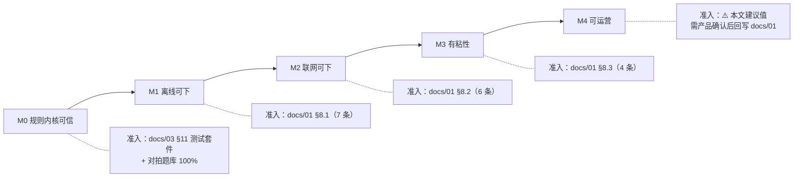
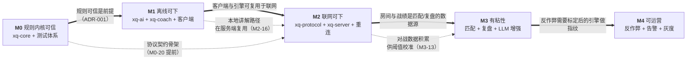
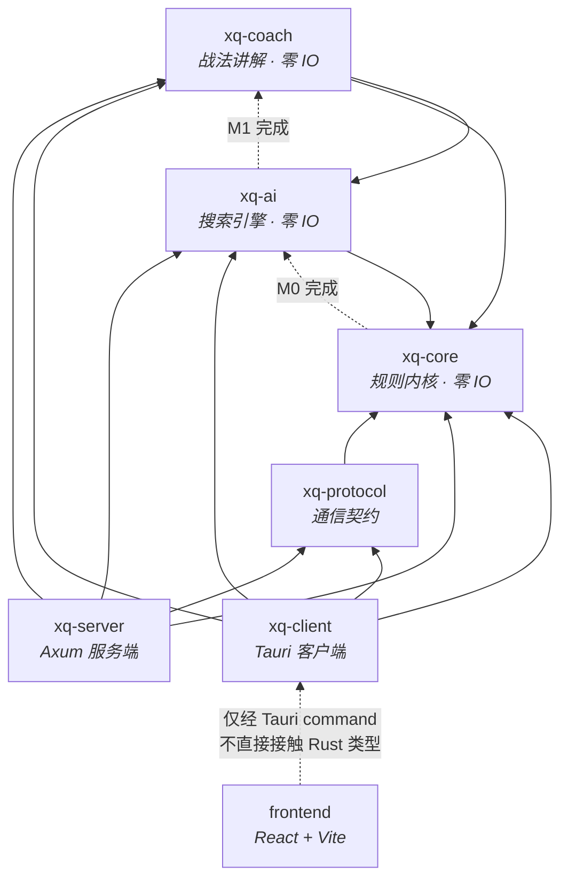
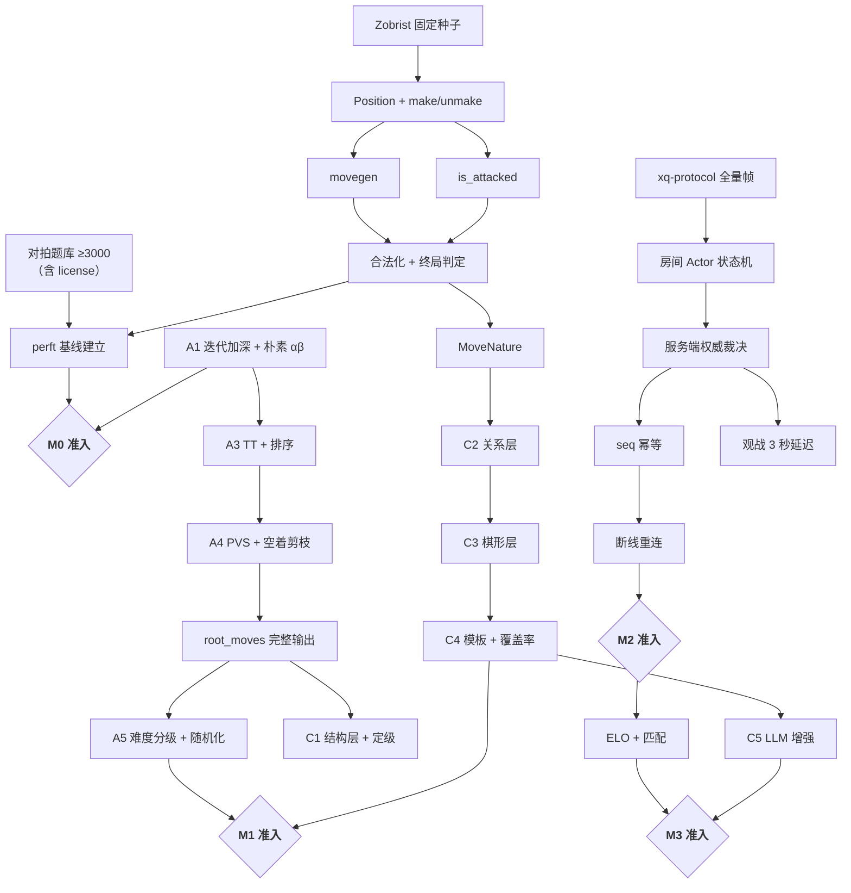
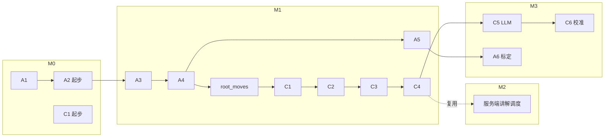

# 13 · 路线图与里程碑

| 项 | 值 |
|---|---|
| 项目代号 | 弈道 / chinese-chess-rs |
| 文档版本 | v1.0 |
| 状态 | 设计基线（Design Baseline） |
| 编制日期 | 2026-09-23 |
| 目标读者 | 产品、开发、测试、运维 |
| 关联文档 | [README §8 里程碑概览](../README.md) · [docs/01 §8 验收标准](01-需求规格说明书.md) · [docs/01 §9 追踪矩阵](01-需求规格说明书.md) · [docs/02 §3 Crate 划分](02-系统架构设计.md) · [docs/03 §11 测试策略](03-规则引擎与领域模型.md) · [docs/04 §10 实现顺序 A1~A6](04-AI引擎设计.md) · [docs/05 §11 实现顺序 C1~C6](05-战法讲解引擎设计.md) · [docs/11 CI/CD](11-工程规范与CI-CD.md) · [docs/12 测试策略](12-测试策略与质量保障.md) · [ADR-001](14-决策记录ADR.md#adr-001) |

> **本文的三条硬约束**：
>
> 1. **准入条件不自造**。M1 / M2 / M3 的 Exit Criteria **逐条引用** [docs/01 §8](01-需求规格说明书.md)，原文照搬，不做增删改写。M0 的准入条件来自 [README §8](../README.md) + [docs/03 开篇声明](03-规则引擎与领域模型.md) + [ADR-001 后果条款](14-决策记录ADR.md#adr-001)。M4 **在 [docs/01 §8](01-需求规格说明书.md) 中无对应条款**，本文给出的只是**建议值**，须经产品评审确认后回写 docs/01。
> 2. **估算不是承诺**。第 6 节所有工作量均为**人周区间估算**，用于排期与资源规划，**不构成交付承诺**。第 5 节风险登记册中的"概率"同样是主观估计。
> 3. **上游数字不复制**。凡涉及 perft、性能基准、覆盖率、规模数字，本文一律**引用**而非重述（如 [docs/03 §11.2](03-规则引擎与领域模型.md)、[docs/04 §8.3](04-AI引擎设计.md)、[NFR-M.02](01-需求规格说明书.md)），避免多处漂移。

---

## 1. 总体节奏

### 1.1 里程碑概览（与 [README §8](../README.md) 一致）

| 阶段 | 目标 | 关键交付 | 对应 AI/讲解阶段 | 核心准入依据 |
|---|---|---|---|---|
| **M0** | 规则内核可信 | `xq-core` 走法生成 100% 通过对拍题库，FEN/记谱往返无损 | A1、A2（起步）；C1（起步） | [README §8](../README.md)、[docs/03 §11](03-规则引擎与领域模型.md)、[ADR-001](14-决策记录ADR.md#adr-001) |
| **M1** | 离线可下 | 客户端跑通人机对战 + 走棋提示 + 本地战法讲解 | A3~A5；C1~C4 | [docs/01 §8.1](01-需求规格说明书.md) |
| **M2** | 联网可下 | 房间对战、观战、断线重连、服务端权威裁决 | （引擎侧冻结，仅修缺陷） | [docs/01 §8.2](01-需求规格说明书.md) |
| **M3** | 有粘性 | 天梯匹配、排行榜、复盘分析、LLM 讲解增强 | A6；C5~C6 | [docs/01 §8.3](01-需求规格说明书.md) |
| **M4** | 可运营 | 反作弊、举报、赛季、监控告警、灰度发布 | （引擎侧进入维护） | ⚠️ [docs/01 §8](01-需求规格说明书.md) **无 M4 条款**；见 §2.5 的说明 |

### 1.2 里程碑与需求优先级的对应

需求优先级定义见 [docs/01 §4](01-需求规格说明书.md)（P0 = 首个可用版本必须交付 / P1 = 第二版本 / P2 = 后续迭代）。

| 优先级 | 主要落点 | 说明 |
|---|---|---|
| **P0** | M0 / M1 / M2 | FR-01 对局核心、FR-02 走棋提示、FR-03 讲解（本地路径）、FR-04 人机、FR-05 联网、FR-06 观战、FR-08.01 游客模式 |
| **P1** | M2 / M3 | 走棋提示进阶（推荐箭头）、讲解 LLM 增强、天梯匹配、排行榜、复盘、账号体系、棋谱导入导出、让子开局 |
| **P2** | M3 / M4 及之后 | 残局挑战、聊天举报、赛季、AI 托管、详细程度切换、全局复盘报告 |

### 1.3 里程碑与验收标准的总览图



---

## 2. 里程碑详细内容

### 2.1 M0 —— 规则内核可信

#### 2.1.1 目标与范围

**目标**：让 `xq-core` 成为**可以被信任的正确性基石**。这是整个项目风险最高、依赖最深的一步——[docs/03 开篇](03-规则引擎与领域模型.md) 明确「规则实现只要有一处偏差，就会导致 AI 走出非法着法、服务端误判胜负、讲解内容错误」。

**范围内**：

| 项 | 内容 |
|---|---|
| 坐标与棋盘表示 | ICCS 坐标、`[u8; 90]` + 双 `u128` 占据位图、Zobrist（[docs/03 §2~§3](03-规则引擎与领域模型.md)） |
| 走法生成 | 七种棋子的伪合法着法 + 合法化过滤（[docs/03 §4](03-规则引擎与领域模型.md)） |
| 规则判定 | 将军 / 将死 / **困毙判负** / 白脸将 / 子力不足 / 60 回合（[docs/03 §5~§6](03-规则引擎与领域模型.md)） |
| make / unmake | 严格顺序 + debug 一致性断言（[docs/03 §7](03-规则引擎与领域模型.md)） |
| FEN | 解析 / 序列化 / 往返无损（[docs/03 §8](03-规则引擎与领域模型.md)） |
| 中文记谱 | 双向转换 + 前后消歧 + 进/退语义区分（[docs/03 §9](03-规则引擎与领域模型.md)） |
| 测试体系 | perft、对拍题库（≥3000）、属性测试、自对弈 1000 局（[docs/03 §11](03-规则引擎与领域模型.md)、[docs/12](12-测试策略与质量保障.md)） |
| 着法性质 | `MoveNature` 分类（为 `xq-coach` 预备，[docs/03 §6.3](03-规则引擎与领域模型.md)） |

**范围外（明确不做）**：

| 不做 | 原因 |
|---|---|
| 高级走法生成优化（12×11 哨兵边界） | [docs/03 §12](03-规则引擎与领域模型.md) 明确"进阶优化，首版不引入，避免复杂度" |
| 增量评估 | [docs/04 §4.5](04-AI引擎设计.md) 明确"首版决策：不做增量评估" |
| 长捉的完整规则 | 采用"可实现的简化判定表"（[docs/03 §6.1](03-规则引擎与领域模型.md)、[docs/01 §10](01-需求规格说明书.md)） |
| 任何 UI | M0 只交付 crate 与其测试 |

#### 2.1.2 任务分解

| # | 工作项 | 对应 crate / 模块 | 依赖 | 备注 |
|---|---|---|---|---|
| M0-01 | CI 骨架：fmt / clippy / 编译 / 单测 + **ADR-005 依赖断言脚本** | 仓库基础设施、`scripts/ci/` | — | 必须最先做——它保证后续所有代码一开始就守住零 IO 约束（[docs/11 §5.3](11-工程规范与CI-CD.md)、[docs/02 §2.1 不变量 I-1](02-系统架构设计.md)） |
| M0-02 | workspace 骨架 + `rust-toolchain.toml` + `rustfmt.toml` + `clippy.toml` | 根配置 | M0-01 | 配置内容见 [docs/11 §1.2 / §1.3](11-工程规范与CI-CD.md) |
| M0-03 | 坐标系统：`Color` / `PieceKind` / `Square` 编解码 / ICCS 字符串 | `xq-core::color/piece/square` | M0-02 | [docs/03 §2](03-规则引擎与领域模型.md)；**ADR-013 的坐标基准**必须先锁定 |
| M0-04 | Zobrist 表（固定种子） | `xq-core::zobrist` | M0-03 | [docs/03 §7.4](03-规则引擎与领域模型.md)：**绝不能用 `thread_rng`** |
| M0-05 | `Position` 结构 + `make_move` / `unmake_move` + `assert_consistent` | `xq-core::position` | M0-03、M0-04 | [docs/03 §3.2 / §7.3](03-规则引擎与领域模型.md)；步骤顺序必须严格遵循 |
| M0-06 | 攻击检测 `is_attacked`（反向探测，含白脸将统一模型） | `xq-core::position` | M0-05 | [docs/03 §4.4](03-规则引擎与领域模型.md) |
| M0-07 | 伪合法着法生成（七种棋子） | `xq-core::movegen` | M0-05 | [docs/03 §4.2](03-规则引擎与领域模型.md)；**蹩马腿/塞象眼/炮架**是三个高发 bug 点 |
| M0-08 | 合法化过滤 + 终局判定 | `xq-core::rules` | M0-06、M0-07 | [docs/03 §5](03-规则引擎与领域模型.md)；困毙判负是中西规则差异点 |
| M0-09 | **perft 驱动 + perft(1)=44 硬断言** | `xq-core/tests/perft.rs` | M0-07、M0-08 | [docs/03 §11.2](03-规则引擎与领域模型.md)：44 是**唯一已手工验证**的值，必须精确通过 |
| M0-10 | perft(2)~(5) 实测并记录项目基线 | `xq-core/testdata/perft-baseline.md` | M0-09 | ⚠️ [docs/03 §11.2](03-规则引擎与领域模型.md) 明确要求：**实测后记录为基线，不得直接引用公开值** |
| M0-11 | FEN 解析与序列化 | `xq-core::fen` | M0-05 | [docs/03 §8](03-规则引擎与领域模型.md)；初始 FEN 字面量必须逐字一致 |
| M0-12 | 中文记谱双向转换（含前后消歧、进退语义） | `xq-core::notation` | M0-08、M0-11 | [docs/03 §9](03-规则引擎与领域模型.md)；**"进退后跟步数还是路数"是本模块最容易错的地方** |
| M0-13 | 重复局面检测 + 简化裁决表 | `xq-core::repetition` | M0-05、M0-08 | [docs/03 §6](03-规则引擎与领域模型.md)；"捉"的判定需收敛 |
| M0-14 | 着法性质分类 `MoveNature` | `xq-core::nature` | M0-08、M0-13 | [docs/03 §6.3](03-规则引擎与领域模型.md)；供 `xq-coach` 复用 |
| M0-15 | **对拍题库建设**（≥3000 局面，含 license 字段） | `xq-core/testdata/golden/` | M0-11、M0-12 | [docs/12 §3](12-测试策略与质量保障.md)；**授权核实是前置条件**，未确认前先用"手工 + 自对弈"冷启动 |
| M0-16 | 属性测试：FEN 往返、记谱往返、ICCS 往返 | `xq-core/tests/properties.rs` | M0-11、M0-12 | ≥10000 次（[docs/03 §8.3 / §9.5](03-规则引擎与领域模型.md)） |
| M0-17 | 自对弈压力测试（1000 局） | `xq-ai`（最小可用搜索）+ `xq-core/tests` | M0-08、A1 | [docs/03 §11.3](03-规则引擎与领域模型.md)、[docs/12 §4](12-测试策略与质量保障.md)；需要 A1 的最小引擎 |
| M0-18 | 覆盖率门禁接入（crate 85% / 规则模块 95%） | CI、`scripts/ci/coverage_gate.sh` | M0-16 | [NFR-M.02](01-需求规格说明书.md)、[docs/11 §5.6](11-工程规范与CI-CD.md) |
| M0-19 | 性能基准建立（criterion + 基线记录） | `xq-core/benches/` | M0-09 | [docs/03 §12](03-规则引擎与领域模型.md)；**首次实测值即基线** |
| M0-20 | `xq-protocol` 骨架：`MoveDto` / `GameStatusDto` / 错误码常量 | `xq-protocol` | M0-05、M0-08 | [docs/02 §3.2](02-系统架构设计.md)；ADT-007 要求所有帧带 `type` 判别标签 |
| M0-21 | **A1：迭代加深 + 朴素 Alpha-Beta + 仅子力评估** | `xq-ai::search/eval` | M0-05 | [docs/04 §10](04-AI引擎设计.md)：**A1 必须最先跑通**，它验证 make/unmake 在搜索场景下正确 |

#### 2.1.3 准入条件（Exit Criteria）

M0 在 [docs/01 §8](01-需求规格说明书.md) 中**没有独立条款**。其准入条件来自以下三处已有文档，本文只做**归集**，不新增：

**来源 A —— [README §8](../README.md) 的 M0 关键交付**

- [ ] `xq-core` 走法生成 **100% 通过对拍题库**
- [ ] **FEN/记谱往返无损**

**来源 B —— [docs/03 开篇](03-规则引擎与领域模型.md) 与 [ADR-001 后果条款](14-决策记录ADR.md#adr-001)**

- [ ] **独立的规则测试套件通过** —— 文档原文："测试通过与否是 M0 里程碑的**唯一准入条件**"（[docs/03 开篇](03-规则引擎与领域模型.md)、[ADR-001](14-决策记录ADR.md#adr-001)）
- [ ] perft 各深度与**本项目实测基线**一致；其中 **perft(1) = 44** 为硬断言（[docs/03 §11.2](03-规则引擎与领域模型.md)）
- [ ] 对拍题库 **≥ 3000 局面 100% 通过**（[docs/03 §11.1](03-规则引擎与领域模型.md)）
- [ ] 自对弈 1000 局：零 panic、零非法着法、零终局状态矛盾（[docs/03 §11.3](03-规则引擎与领域模型.md)）

**来源 C —— [docs/01 §8.1](01-需求规格说明书.md) 中属于规则内核的两条**

> [docs/01 §8.1](01-需求规格说明书.md) 标注的是「M1（离线版）准入」，共 7 条。其中**前两条只依赖规则内核**，因此可作为 M0 的准入条件；其余 5 条依赖客户端与引擎，归属 M1。这一划分**不改动 docs/01 的文本**，只是把它的条款按依赖关系前置到 M0。

- [ ] `cargo test -p xq-core` 全绿，**对拍题库 ≥ 3000 局面 100% 通过**（[docs/01 §8.1](01-需求规格说明书.md) 第 1 条）
- [ ] **FEN 与中文记谱往返转换无损（属性测试 10000 次通过）**（[docs/01 §8.1](01-需求规格说明书.md) 第 2 条）

**来源 D —— [docs/02 §2.1 不变量 I-1](02-系统架构设计.md) 与 [docs/11 §5.3](11-工程规范与CI-CD.md)（工程约束）**

- [ ] **ADR-005 依赖断言在 CI 中生效且通过**：`xq-core` / `xq-ai` / `xq-coach` 的依赖树中不含 `tokio` / `axum` / `sqlx` / `sea-orm` / `redis` / `reqwest` / `hyper`（[ADR-005](14-决策记录ADR.md#adr-005)、[docs/02 §2.1](02-系统架构设计.md)）

#### 2.1.4 交付物清单

| 交付物 | 形态 | 验收方式 |
|---|---|---|
| `xq-core` crate | 代码 | 上述全部准入条件通过 |
| `xq-ai` crate（最小可用） | 代码 | A1 完成，能下完整局不崩溃 |
| `xq-protocol` crate（骨架） | 代码 | 帧类型可序列化 + 错误码常量表 |
| 对拍题库 | `crates/xq-core/testdata/golden/*.jsonl` | ≥3000 条，license 字段完整 |
| perft 基线记录 | `crates/xq-core/testdata/perft-baseline.md` | 含实测值 + 机器规格 + 与公开值的差异说明 |
| 性能基线记录 | `docs/bench-baseline.md` 或等价文件 | criterion 实测值（[docs/03 §12](03-规则引擎与领域模型.md) 的目标值 vs 实测值） |
| CI 流水线（阶段 1~12） | `.github/workflows/` + `scripts/ci/` | 见 [docs/11 §5.2](11-工程规范与CI-CD.md) |
| 覆盖率报告 | CI artifact | crate ≥85%、规则模块 ≥95%（[NFR-M.02](01-需求规格说明书.md)） |

#### 2.1.5 风险与缓解

| 风险 | 影响 | 缓解措施 |
|---|---|---|
| **对拍题库授权未落实** | 题库无法达到 3000，M0 无法通过 | 冷启动用"手工构造（~30%）+ 自对弈生成（~20%）"先把规模做起来；同时并行推进公开棋谱集授权核实（[docs/12 §3.1](12-测试策略与质量保障.md)、[docs/04 §7.3](04-AI引擎设计.md) 同样要求授权核实） |
| **perft 实测值与公开资料不符** | 无法判断是自己错还是口径差异 | 按 [docs/03 §11.2](03-规则引擎与领域模型.md) 列出的三个差异点（吃将帅是否计入、白脸将判定时机、是否预过滤自杀着法）逐项排查，并把结论写成记录。**不要为了"对上数字"而改实现** |
| **"捉"的判定反复收敛不了** | 重复局面模块阻塞 M0 | [docs/03 §6.3](03-规则引擎与领域模型.md) 已明确"宁可保守（少判'捉'）也不要误判"；用 `MoveNature` 的枚举先跑通，判定精度在 M1 用讲解质量反馈迭代 |
| 中文记谱的进退语义实现错 | 大范围用例失败 | [docs/03 §9.4](03-规则引擎与领域模型.md) 已把"车炮兵 = 步数，马相仕帅 = 目标路数"写成"实现基准"，且要求全七种棋子的专门用例集 |
| 长捉等复杂规则被质疑 | 用户投诉裁决不公 | 采用"简化判定表 + UI 展示裁决依据 + 保留申诉入口"（[docs/02 §12](02-系统架构设计.md)、[docs/03 §6.1](03-规则引擎与领域模型.md)） |
| A1 未先跑通就上优化 | bug 被优化掩盖，极难定位 | [docs/04 §10](04-AI引擎设计.md) 明确"A1 跑通前不要引入任何高级优化"——**作为 M0 的排期硬约束** |

---

### 2.2 M1 —— 离线可下

#### 2.2.1 目标与范围

**目标**：用户能**完全离线**地完成一局人机对战，并享受到「战法讲解」这一核心差异点。

**范围内**：

| 项 | 内容 |
|---|---|
| 引擎完整化 | A3（TT + 着法排序）、A4（PVS + 空着剪枝）、A5（难度分级 + 随机化 + 开局库）（[docs/04 §10](04-AI引擎设计.md)） |
| 讲解完整化 | C1（结构层）、C2（关系层）、C3（棋形层）、C4（模板扩充 + 覆盖率达标）（[docs/05 §11](05-战法讲解引擎设计.md)） |
| 客户端 Rust 侧 | Tauri commands、引擎线程池、离线对局编排（[docs/02 §3.2](02-系统架构设计.md)、[docs/08 §3](08-客户端设计.md)） |
| 前端 | 棋盘渲染、走棋交互、提示 UI、讲解面板、人机对战页面（[docs/08 §5~§11](08-客户端设计.md)） |
| 素材 | 棋盘 / 棋子 SVG、design-tokens、战术库、讲解模板、开局定式（[README §7](../README.md)） |
| 三端打包 | Win / Linux / macOS 产物（[docs/08 §15](08-客户端设计.md)） |

**范围外**：

| 不做 | 归属 |
|---|---|
| 联网对战、房间、观战 | M2 |
| 账号体系、天梯、排行榜 | M2 / M3 |
| LLM 增强（C5） | M3 |
| 复盘分析 | M3 |
| 反作弊、举报、赛季 | M4 |

#### 2.2.2 任务分解

| # | 工作项 | 对应 crate / 模块 | 依赖 | 备注 |
|---|---|---|---|---|
| M1-01 | **A3：置换表 + 着法排序（MVV-LVA + 历史启发）** | `xq-ai::tt/ordering` | M0-21 | [docs/04 §3.4 / §3.5](04-AI引擎设计.md)；⚠️ TT 杀棋分数调整是最常见隐蔽 bug |
| M1-02 | **A4：PVS + 空着剪枝** | `xq-ai::search` | M1-01 | [docs/04 §3.2 / §3.6](04-AI引擎设计.md)；中国象棋的空着剪枝限制需逐条实现 |
| M1-03 | **A5：难度分级 + 随机化 + 开局库** | `xq-ai::difficulty/book` | M1-02 | [docs/04 §6 / §7](04-AI引擎设计.md)；五档难度的"弱不等于浅搜索"原则 |
| M1-04 | `root_moves` 完整输出 | `xq-ai::search` | M1-02 | [docs/04 §9](04-AI引擎设计.md)：**不是可选字段**——它同时服务难度随机化、走棋提示、讲解定级 |
| M1-05 | 镜像对称性测试（≥200 局面） | `xq-ai/tests/eval_symmetry.rs` | M1-03 | [docs/04 §8.1](04-AI引擎设计.md)、[docs/12 §2.2.2](12-测试策略与质量保障.md) |
| M1-06 | 搜索确定性测试 | `xq-ai/tests/determinism.rs` | M1-02 | 相同种子 + `NodeLimitedStop` → 100 次结果一致 |
| M1-07 | 开局库数据构建 | `scripts/build_opening_book.rs`、`assets/knowledge/opening-book.json` | M1-03 | [docs/04 §7.3](04-AI引擎设计.md)：≥5000 局面、≥200 命名开局；**授权必须核实** |
| M1-08 | **C1：结构层识别 + 基础模板 + 评价定级** | `xq-coach::tactics/explain` | M0-14、M1-04 | [docs/05 §11](05-战法讲解引擎设计.md)：完成标志是"每步能输出'炮二平五，最佳着法'级别的讲解" |
| M1-09 | **C2：关系层识别（捉双、牵制、闪击、抽将…）** | `xq-coach::tactics` | M1-08 | [docs/05 §3.3](05-战法讲解引擎设计.md) |
| M1-10 | **C3：棋形层 + 棋形库（≥24 条）** | `xq-coach::tactics`、`assets/knowledge/tactics.json` | M1-09 | [docs/05 §3.4 / §3.5](05-战法讲解引擎设计.md)；命名杀法识别，置信度 < 0.7 时弱样式展示 |
| M1-11 | **C4：模板库扩充（≥120 条）+ 降级链 + 覆盖率达标** | `xq-coach::explain`、`assets/knowledge/coach-templates.json` | M1-10 | [docs/05 §5 / §11](05-战法讲解引擎设计.md)；**覆盖率 ≥95% 意味着兜底率 ≤5%** |
| M1-12 | 素材构建期校验（schema） | `xq-coach` bin、CI | M1-11 | [docs/05 §9.4](05-战法讲解引擎设计.md)：把配置错误从运行时静默降级提前到编译期硬失败 |
| M1-13 | `analyze` 永不 panic 测试 | `xq-coach/tests/never_fail.rs` | M1-08 | [docs/05 §7.1](05-战法讲解引擎设计.md)：10000 次随机输入 |
| M1-14 | Tauri commands 层 | `xq-client::commands` | M0-20、M1-04、M1-11 | [docs/02 §3.2](02-系统架构设计.md)、[docs/08 §14](08-客户端设计.md) |
| M1-15 | 引擎线程池（不阻塞主线程） | `xq-client::engine_pool` | M1-14 | [docs/02 §4.3](02-系统架构设计.md)：**耗时 > 16 ms 必须投递到线程池** |
| M1-16 | 前端：坐标换算模块（90 格全覆盖） | `frontend/src/coords/` | — | [ADR-008](14-决策记录ADR.md#adr-008)；**覆盖率必须 100%** |
| M1-17 | 前端：棋盘渲染（SVG + DOM + CSS transform） | `frontend/src/components/board/` | M1-16 | [ADR-008](14-决策记录ADR.md#adr-008)；60 FPS 是硬门禁 |
| M1-18 | 前端：走棋交互（点击 / 拖拽 / 非法回弹） | `frontend/src/components/board/` | M1-17、M1-14 | FR-02.03 / FR-02.04 |
| M1-19 | 前端：走棋提示 UI（合法落点 / 危险提示 / 推荐箭头 / 评估条） | `frontend/src/components/board/` | M1-17 | FR-02.01~02.10 |
| M1-20 | 前端：讲解面板（卡片 / 历史 / 等级色阶 / 详细度） | `frontend/src/components/coach/` | M1-18 | [docs/08 §10](08-客户端设计.md)；色阶取自 design-tokens |
| M1-21 | 前端：人机对战页面 + Zustand 状态机 | `frontend/src/stores/`、`frontend/src/features/` | M1-19、M1-20 | [docs/08 §6 / §12](08-客户端设计.md) |
| M1-22 | 前端：无障碍与键盘操作 | `frontend/src/` | M1-21 | [NFR-U.04](01-需求规格说明书.md)、[docs/08 §17](08-客户端设计.md) |
| M1-23 | 素材校验：四元组齐全 + WCAG AA 对比度 | `assets/` | — | [NFR-U.03](01-需求规格说明书.md)；与 M1-20 并行 |
| M1-24 | 三端打包流水线（含 macOS 签名公证） | CI、`deploy/` | M1-21 | [docs/11 §6.4 / §6.5](11-工程规范与CI-CD.md)；[docs/08 §15](08-客户端设计.md) |
| M1-25 | 三端冒烟（每端完成一局人机） | 手动 + CI | M1-24 | [docs/08 §18](08-客户端设计.md) |
| M1-26 | 音量/动画等体验打磨 | `frontend/`、`assets/tokens/` | M1-25 | FR-01.05 提示音 |

#### 2.2.3 准入条件（Exit Criteria）

> **全部逐条引用 [docs/01 §8.1](01-需求规格说明书.md)（M1 离线版准入），原文照搬，不增删。**

- [ ] `cargo test -p xq-core` 全绿，对拍题库 ≥ 3000 局面 100% 通过
- [ ] FEN 与中文记谱往返转换无损（属性测试 10000 次通过）
- [ ] 人机 5 档难度均可完整下完一局，无崩溃
- [ ] 走棋提示与引擎走法生成结果 100% 一致
- [ ] 战法讲解在 1000 局样本中覆盖率 ≥ 95%
- [ ] 客户端在 Win / Linux / macOS 三端均可启动并完成一局
- [ ] 冷启动 ≤ 2 s，对局中内存 ≤ 300 MB

**M1 附带的工程门禁**（不属 docs/01 §8.1，但由 [docs/12 §9.3](12-测试策略与质量保障.md) 与 [docs/11 §5.6](11-工程规范与CI-CD.md) 要求）：

- [ ] 镜像对称性测试零反例（[docs/04 §8.1](04-AI引擎设计.md)）
- [ ] `analyze` 永不 panic 测试通过（[docs/05 §7.1](05-战法讲解引擎设计.md)）
- [ ] 前端 `src/coords/` 覆盖率 100%（[ADR-008](14-决策记录ADR.md#adr-008)）
- [ ] 覆盖率门禁通过（crate ≥85%、规则模块 ≥95%，[NFR-M.02](01-需求规格说明书.md)）
- [ ] **A6（参数调优与棋力标定）尚未完成时的诚实约束**：[docs/04 §6.4](04-AI引擎设计.md) 明确"上表的棋力描述必须在胜率标定完成后依据实测数据修订，标定前不得在正式宣传材料中使用'业余强手'等具体棋力量级描述"。M1 交付的客户端 UI 文案**必须使用 [docs/04 §6.4](04-AI引擎设计.md) 的档位名（入门/初级/中级/高级/大师）+ 副标题，不得宣称具体棋力量级**。

#### 2.2.4 交付物清单

| 交付物 | 形态 | 备注 |
|---|---|---|
| `xq-ai` 完整实现 | 代码 | A1~A5 完成；A6 在 M3 |
| `xq-coach` 本地路径完整实现 | 代码 | C1~C4 完成；C5~C6 在 M3 |
| `xq-client`（Tauri Rust 侧） | 代码 | commands + engine_pool + persist |
| 前端可运行应用 | 代码 + 构建产物 | 人机对战 + 提示 + 讲解 |
| 三端安装包 | `.msi` / `.exe` / `.AppImage` / `.deb` / `.rpm` / `.dmg` | [docs/08 §15.1](08-客户端设计.md)；体积 ≤ 30 MB（[NFR-P.09](01-需求规格说明书.md)） |
| 素材包 | `assets/` | 棋盘、28 个棋子 SVG、tokens、战术库、模板库、开局定式 |
| 讲解覆盖率报告 | 统计报告 | 1000 局样本，兜底率 ≤5% |

#### 2.2.5 风险与缓解

| 风险 | 影响 | 缓解措施 |
|---|---|---|
| **`root_moves` 完整输出拖慢搜索** | L3 档耗时超 1 s，违反 [docs/01 §4.4](01-需求规格说明书.md) | [docs/04 §9](04-AI引擎设计.md) 已确认这是为讲解功能付出的必要代价。缓解：① 在基准中单独记录该影响；② 若超目标，考虑"根节点分层搜索"（先全估、后深搜 top-N）；③ 作为 M1 的关键性能观测项 |
| **讲解覆盖率达不到 95%** | M1 准入不通过 | [docs/05 §5.3](05-战法讲解引擎设计.md) 明确覆盖率口径（兜底模板不计入），意味着需要 ≥120 条模板覆盖足够多的战术组合。缓解：① 先用 1000 局棋谱统计"未命中的着法类型分布"，按频次补模板；② 模板库扩充是纯工作量，可在开发中持续进行 |
| **TT 杀棋分数调整错误** | 引擎"找到杀却拖延"或误判杀棋距离 | [docs/04 §3.4](04-AI引擎设计.md) 已点名为"最常见的隐蔽 bug 之一"。缓解：专门用例（[docs/12 §2.2.1 #8](12-测试策略与质量保障.md)）+ 用"一步杀/两步杀"局面集做端到端验证 |
| **Tauri 前端阻塞主线程** | UI 卡死，违反 [NFR-P.01](01-需求规格说明书.md) | [docs/02 §4.3](02-系统架构设计.md) 的硬约束 + [docs/12 §2.5 #2/#4](12-测试策略与质量保障.md) 的测试 |
| **Linux 打包依赖问题** | 三端准入不通过 | [docs/08 §15.2](08-客户端设计.md) 已列出各发行版安装命令；AppImage 打包内置依赖 |
| **macOS 签名/公证失败** | 无法分发 macOS 版本 | [docs/11 §6.5](11-工程规范与CI-CD.md) 已列出完整要点与排查顺序；**尽早（M1 一开始）就打通公证流程**，不要留到最后 |
| **安装包超 30 MB** | 违反 [NFR-P.09](01-需求规格说明书.md) | [docs/08 §15.3](08-客户端设计.md) 已列出体积控制手段；关键在于**不内嵌中文字体**（用矢量路径渲染棋子文字） |

---

### 2.3 M2 —— 联网可下

#### 2.3.1 目标与范围

**目标**：两个真实用户能通过联网完成一局对局，包含观战与断线重连，且**服务端是唯一权威**。

**范围内**：

| 项 | 内容 |
|---|---|
| 协议层 | `xq-protocol` 完整帧定义、错误码全表、版本协商（[docs/06 §3 / §11 / §13](06-联网对战与实时通信协议.md)） |
| 服务端 | 连接生命周期、帧分发、房间 Actor 状态机、走棋裁决、计时、观战延迟队列（[docs/06](06-联网对战与实时通信协议.md)） |
| 存储 | SeaORM 实体与迁移、Redis 键规范、Redis Stream 异步落库消费者（[docs/09](09-数据模型与存储设计.md)、[ADR-011](14-决策记录ADR.md#adr-011)） |
| 账号 | 注册 / 登录 / JWT 鉴权 / 刷新轮换（[docs/10 §2](10-API接口规范.md)、[FR-08](01-需求规格说明书.md)） |
| 客户端联网 | WS 客户端、重连状态机、乐观更新与回滚（[docs/08 §13](08-客户端设计.md)、[ADR-003](14-决策记录ADR.md#adr-003)） |
| 前端联网 | 大厅、房间、观战、战绩页面（[docs/08 §5](08-客户端设计.md)） |
| 部署 | Docker 化、反向代理、健康检查、指标暴露（[docs/02 §7](02-系统架构设计.md)） |

**范围外**：

| 不做 | 归属 |
|---|---|
| 天梯匹配、排行榜、赛季 | M3 / M4 |
| LLM 讲解增强 | M3 |
| 复盘分析 | M3 |
| 反作弊、举报 | M4 |
| 聊天（P2） | M4 之后 |

#### 2.3.2 任务分解

| # | 工作项 | 对应 crate / 模块 | 依赖 | 备注 |
|---|---|---|---|---|
| M2-01 | `xq-protocol` 全量帧定义（`ClientFrame` / `ServerFrame`） | `xq-protocol` | M0-20 | [docs/06 §3](06-联网对战与实时通信协议.md)；`#[serde(tag = "type")]` + 未知帧可忽略 |
| M2-02 | 错误码全表（46 项） | `xq-protocol::error` | M2-01 | [docs/10 §4](10-API接口规范.md)、[docs/10 §12 C-06](10-API接口规范.md)；`retryable` 由服务端计算 |
| M2-03 | ID 字段类型约束（全部 `String`） | `xq-protocol` | M2-01 | [docs/10 §12 C-05](10-API接口规范.md)：**需单元测试锁定**，避免 JS Number 精度问题（[ADR-007](14-决策记录ADR.md#adr-007)） |
| M2-04 | 帧编解码测试 + 合约快照（`insta`） | `xq-protocol/tests` | M2-01 | [docs/06 §14.1](06-联网对战与实时通信协议.md) 的 10 条用例 + 防文档漂移 |
| M2-05 | 数据库迁移（`users` / `user_profiles` / `games` / `game_moves` / `game_coach_notes` …） | `migrations/`、`xq-server::store` | M2-01 | [docs/09 §3](09-数据模型与存储设计.md)；⚠️ [docs/10 §12 C-01](10-API接口规范.md) 要求 `users.token_version` 列需同步回写 [docs/09 §3.1](09-数据模型与存储设计.md) |
| M2-06 | Redis 键规范 + 客户端封装 | `xq-server::store` | M2-01 | [docs/09 §5](09-数据模型与存储设计.md)、[ADR-010](14-决策记录ADR.md#adr-010)：所有键必须有 TTL（Stream 用 MAXLEN） |
| M2-07 | WS 连接生命周期（`Hello` → `Auth` → 心跳 → 关闭） | `xq-server::ws` | M2-01 | [docs/06 §2](06-联网对战与实时通信协议.md)、[docs/06 §14.2](06-联网对战与实时通信协议.md) 的 11 条用例 |
| M2-08 | **房间 Actor + 状态机 T1~T13** | `xq-server::room` | M2-07、M2-05 | [docs/06 §4](06-联网对战与实时通信协议.md)、[ADR-006](14-决策记录ADR.md#adr-006)；13 条转移各需正反例（[docs/12 §2.4.2](12-测试策略与质量保障.md)） |
| M2-09 | 服务端权威走棋裁决（复用 `xq-core`） | `xq-server::room` | M2-08 | [NFR-S.01](01-需求规格说明书.md)、[ADR-003](14-决策记录ADR.md#adr-003)；验证用例 [docs/06 §14.4 #45](06-联网对战与实时通信协议.md) |
| M2-10 | `seq` 顺序与幂等保证 | `xq-server::room` | M2-09 | [docs/06 §5 / §12](06-联网对战与实时通信协议.md)；客户端只应用 `seq > last_seq` |
| M2-11 | 计时（服务端权威）+ `ClockSync` | `xq-server::room` | M2-09 | [ADR-014](14-决策记录ADR.md#adr-014)、[docs/06 §7](06-联网对战与实时通信协议.md)；周期 5 s |
| M2-12 | **断线重连（全量快照 + 增量补帧）** | `xq-server::room/ws`、`xq-client::net` | M2-10、M2-11 | [docs/02 §6.2](02-系统架构设计.md)、[docs/06 §6](06-联网对战与实时通信协议.md)、[FR-05.06](01-需求规格说明书.md)；**M2 最复杂的一块** |
| M2-13 | 观战 + 3 秒延迟（分片定时推送） | `xq-server::room` | M2-09 | [ADR-012](14-决策记录ADR.md#adr-012)：**不用"每消息各起 sleep task"**，用 1 秒分片 |
| M2-14 | 悔棋 / 求和 / 认输 | `xq-server::room` | M2-09 | [docs/06 §9](06-联网对战与实时通信协议.md)；悔棋每局限 3 次 |
| M2-15 | **Redis Stream 异步落库消费者** | `xq-server::store` | M2-06 | [ADR-011](14-决策记录ADR.md#adr-011)、[docs/09 §6](09-数据模型与存储设计.md)；`(game_id, seq)` 唯一索引 + `ON CONFLICT DO NOTHING` 幂等 |
| M2-16 | 讲解调度（服务端侧本地路径） | `xq-server::coach_svc` | M2-09、M1-11 | [docs/05 §8](05-战法讲解引擎设计.md)；讲解为**独立异步帧**，绝不阻塞走棋（[docs/02 §6.1](02-系统架构设计.md)） |
| M2-17 | REST 端点（账号 / 资料 / 战绩 / 大厅 / 棋谱） | `xq-server::routes` | M2-05 | [docs/10 §3](10-API接口规范.md) |
| M2-18 | 鉴权中间件（JWT + 刷新轮换） | `xq-server::routes` | M2-05 | [docs/10 §2](10-API接口规范.md)、[NFR-S.06](01-需求规格说明书.md)；Argon2id 强哈希（[NFR-S.05](01-需求规格说明书.md)） |
| M2-19 | 限流中间件（多维叠加 + `fail-open`） | `xq-server` | M2-18 | [docs/10 §6](10-API接口规范.md)、[docs/10 §12 C-10](10-API接口规范.md) |
| M2-20 | 输入校验（长度 / 范围 / 格式） | `xq-server`、`validator` | M2-17 | [NFR-S.07](01-需求规格说明书.md)、[docs/12 §8.3](12-测试策略与质量保障.md) 的特殊字符用例 |
| M2-21 | 客户端 WS 层 + 重连退避 | `xq-client::net` | M2-01 | [docs/08 §13](08-客户端设计.md)；退避 1s→2s→…→30s，±20% 抖动；`Restart` 关闭码立即重连 |
| M2-22 | 客户端乐观更新 + 回滚状态机 | `xq-client::commands`、`frontend/src/stores/` | M2-21、M1-17 | [ADR-003](14-决策记录ADR.md#adr-003)；回滚要播放"棋子退回"动画而非瞬间跳变 |
| M2-23 | 前端：大厅 / 房间 / 观战页面 | `frontend/src/features/` | M2-21、M2-22 | [docs/08 §5](08-客户端设计.md) |
| M2-24 | 前端：连接状态与异常提示 | `frontend/` | M2-23 | [NFR-U.02](01-需求规格说明书.md)、[NFR-U.05](01-需求规格说明书.md)：**不暴露堆栈** |
| M2-25 | 可观测性（日志 / 指标 / 健康检查） | `xq-server::observability` | M2-07 | [docs/02 §9](02-系统架构设计.md)、[NFR-M.04 / M.05](01-需求规格说明书.md)；必带 `request_id` / `room_id` / `game_id` / `player_id` |
| M2-26 | 部署：容器化 + 反向代理 + `docker-compose` | `deploy/` | M2-25 | [docs/02 §7](02-系统架构设计.md) |
| M2-27 | **压测工具与场景 S1~S7** | `scripts/loadtest/` | M2-26 | [docs/12 §6](12-测试策略与质量保障.md)；目标 5000 WS / 2500 并发对局 |
| M2-28 | **故障注入（16 个场景）** | 脚本 + 手动 | M2-27 | [docs/12 §7](12-测试策略与质量保障.md)；重点验证断线重连 / 讲解降级 / 服务端权威 |
| M2-29 | 安全测试（鉴权 / 越权 / 非法着法 / 限流） | 测试用例 | M2-20 | [docs/12 §8](12-测试策略与质量保障.md) |

#### 2.3.3 准入条件（Exit Criteria）

> **全部逐条引用 [docs/01 §8.2](01-需求规格说明书.md)（M2 联网版准入），原文照搬，不增删。**

- [ ] 房间创建/加入/走子/终局全流程无阻断
- [ ] 服务端篡改防护验证：构造非法着法请求一律被拒
- [ ] 断线重连测试：随机杀进程 50 次，恢复成功率 100%
- [ ] 压测：单机 5000 WS 连接 / 2500 并发对局，P99 房间操作 ≤ 100 ms
- [ ] 观战延迟实测 ≥ 3 秒
- [ ] 计时准确性：服务端时钟与真实时间偏差 ≤ 50 ms/局

**M2 附带的工程门禁**（[docs/12 §9.3](12-测试策略与质量保障.md) 要求）：

- [ ] [docs/12 §7.2 ①](12-测试策略与质量保障.md) 断线重连的**状态完整性六项**全部通过
- [ ] [docs/12 §7.2 ③](12-测试策略与质量保障.md) 服务端权威裁决的 7 类篡改全部被拒且状态零变化
- [ ] [docs/12 §8](12-测试策略与质量保障.md) 安全测试用例全通过
- [ ] [docs/06 §14](06-联网对战与实时通信协议.md) 的 70 条协议测试要点全部覆盖并通过

> ⚠️ **口径提醒**：M2 准入的"恢复成功率 100%"是**离散验收口径**（50 次杀进程），与 [NFR-R.02](01-需求规格说明书.md) 的长期 SLO「≥ 99.9%」是**两个不同场景的数字，不得混用**。详见 [docs/12 §2.4.3 口径说明](12-测试策略与质量保障.md)。

#### 2.3.4 交付物清单

| 交付物 | 形态 | 备注 |
|---|---|---|
| `xq-protocol` 完整契约 | 代码 | 帧定义 + 错误码全表 + 版本协商 |
| `xq-server` | 代码 + 容器镜像 | 房间 / WS / 匹配（骨架）/ 存储 / 讲解调度 / 可观测 |
| 数据库迁移 | `migrations/` | 通过 `sea-orm-migration` 版本化 |
| 客户端联网能力 | 代码 | WS + 重连 + 乐观更新回滚 |
| 前端联网页面 | 代码 | 大厅 / 房间 / 观战 / 战绩 |
| 部署方案 | `deploy/`、文档 | 单实例 + 多实例扩展方案（[docs/02 §7](02-系统架构设计.md)） |
| 压测报告 | 报告 | 5000 WS / 2500 局的实测数据（对齐 [docs/01 §8.2](01-需求规格说明书.md)） |
| 故障注入报告 | 报告 | 16 个场景的实测记录 |
| 安全测试报告 | 报告 | 鉴权 / 越权 / 注入 / 限流四类 |

#### 2.3.5 风险与缓解

| 风险 | 影响 | 缓解措施 |
|---|---|---|
| **断线重连的 6 项状态恢复不完整** | M2 准入不通过，用户体验割裂 | [FR-05.06](01-需求规格说明书.md) 已列出 6 项清单，逐项写测试；[docs/12 §2.4.3](12-测试策略与质量保障.md) 的用例 12 专门断言"缺一即失败" |
| **Redis 成为单点** | 服务不可用 | [ADR-010](14-决策记录ADR.md#adr-010) 限定 Redis 只存"丢了可重建"的数据；Redis 不可用时的行为已在 [docs/12 §7.1 #3/#4](12-测试策略与质量保障.md) 定义（明确报错，不静默） |
| **压测达不到 2500 局** | M2 准入不通过 | [docs/02 §4.1](02-系统架构设计.md) 已核算内存不是瓶颈；真正的瓶颈是 Redis 吞吐与 PG 消费者。[docs/12 §6.5](12-测试策略与质量保障.md) 已给出定位流程 |
| **`Paused` 断线规则被滥用** | 用户投诉（主动拔网线规避步时 / 弱网误伤） | [docs/06 §4.1](06-联网对战与实时通信协议.md) 已标注为**设计初始值待校准**，并给出备选方案（累计上限 60 s）。缓解：M2 阶段增加两组滥用场景用例（[docs/12 §2.4.2](12-测试策略与质量保障.md)），用数据决定最终规则 |
| **观战延迟被绕过** | 作弊通道 | [ADR-012](14-决策记录ADR.md#adr-012)：延迟在**服务端**实现，客户端无法绕过；测试用例 [docs/06 §14.7 #68](06-联网对战与实时通信协议.md) 实测验证 |
| **`rules_version` 不一致导致两端判定分歧** | 回滚频繁，体验差 | [ADR-003](14-决策记录ADR.md#adr-003)：握手时协商 `protocol_version` + `rules_version`，不匹配则拒绝开局（[docs/06 §4.3 T5](06-联网对战与实时通信协议.md)） |
| **权威裁决被绕过（新增 `validation_legality=false` 之类入口）** | 安全底线被破 | [docs/10 §12 D-07](10-API接口规范.md) 已标注该风险；**M2 必须复查该选项是否只在客户端本地场景使用**（[docs/12 §8.3 #15](12-测试策略与质量保障.md) 列为必查项） |
| **多实例房间归属脑裂** | 对局数据损坏 | [docs/02 §7.3](02-系统架构设计.md)：Redis 归属键 + TTL + 单写者原则。**M2 单实例上线，多实例在 M3/M4 按需开启**，但归属键机制从 M2 就要写入 |

---

### 2.4 M3 —— 有粘性

#### 2.4.1 目标与范围

**目标**：让用户**愿意留下来反复玩**——通过天梯匹配、排行榜、复盘分析和更自然的讲解。

**范围内**：

| 项 | 内容 |
|---|---|
| 天梯匹配 | ELO 算法、匹配队列、匹配 worker（[docs/07 §1~§3](07-匹配排行榜与反作弊.md)） |
| 排行榜与赛季（骨架） | 总榜 / 周榜 / 好友榜、段位体系（[docs/07 §4~§5](07-匹配排行榜与反作弊.md)） |
| 复盘分析 | 逐着回放、评价标注、关键转折、失误统计、导出（[FR-09](01-需求规格说明书.md)） |
| 讲解增强 | C5（LLM 增强 + 校验 + 缓存 + 预算）、C6（阈值回测校准 + 人工质量评估）（[docs/05 §11](05-战法讲解引擎设计.md)） |
| 引擎收尾 | A6（参数调优与棋力标定）（[docs/04 §10](04-AI引擎设计.md)） |
| 需求补全 | 走棋提示进阶（FR-02.07~02.10）、棋谱导入导出（FR-01.13）、让子开局（FR-01.12）、提和次数限制（FR-01.10）、悔棋同意（FR-05.11） |

**范围外**：

| 不做 | 归属 |
|---|---|
| 反作弊（引擎指纹、异常速度检测） | M4 |
| 举报与处罚 | M4 |
| 赛季完整机制（重置与荣誉） | M4 |
| 聊天与敏感词（P2） | M4 |
| 残局挑战模式（P2） | M4 之后 |
| AI 托管（P2） | M4 之后（天梯禁用，[docs/04 §6.3](04-AI引擎设计.md)） |

#### 2.4.2 任务分解

| # | 工作项 | 对应 crate / 模块 | 依赖 | 备注 |
|---|---|---|---|---|
| M3-01 | ELO 算法实现 | `xq-server::matchmaking::elo` | M2-05 | [docs/07 §1](07-匹配排行榜与反作弊.md)；**19 条单元测试用例见 [docs/07 §10.1](07-匹配排行榜与反作弊.md)**，产出数值须与文档演算逐位一致 |
| M3-02 | 段位映射 `tier_of()` | `xq-server::matchmaking` | M3-01 | [docs/07 §4](07-匹配排行榜与反作弊.md)：覆盖 `[800, 3000]` 全域、无空档无重叠、单调 |
| M3-03 | 匹配队列（Redis Sorted Set）+ 窗口扩张 | `xq-server::matchmaking` | M3-01 | [docs/07 §2](07-匹配排行榜与反作弊.md)；等待越久放宽范围 |
| M3-04 | 匹配 worker 与并发控制 | `xq-server::matchmaking` | M3-03 | [docs/07 §3](07-匹配排行榜与反作弊.md)；同一对玩家不得被匹配两次 |
| M3-05 | ELO 收敛仿真验证 | `xq-server/tests` | M3-01 | [docs/07 §10.2](07-匹配排行榜与反作弊.md)；用 Bradley–Terry 模型生成结果，验证收敛到反解公式的期望值 |
| M3-06 | 排行榜（总榜 / 周榜 / 好友榜） | `xq-server::routes`、Redis ZSet | M3-01 | [docs/07 §5](07-匹配排行榜与反作弊.md)、[docs/10 §3.7](10-API接口规范.md)；⚠️ 周榜时区与排序依据待产品确认（[docs/10 §12 D-02 / D-03](10-API接口规范.md)） |
| M3-07 | 战绩页与统计 | `xq-server::routes`、`frontend/` | M2-17 | FR-07.07 |
| M3-08 | 复盘：逐着回放 + 评价标注 | `frontend/src/features/`、`xq-coach` | M2-16 | [FR-09.01/02](01-需求规格说明书.md)；**评价必须与实时对局一致**（[docs/01 §8.3](01-需求规格说明书.md) 第 3 条） |
| M3-09 | 复盘：关键转折点 + 失误统计 | `xq-coach`、`xq-server` | M3-08 | FR-09.03/04；评估分大幅波动处高亮 |
| M3-10 | 复盘：导出棋谱（ICCS / 中文 / 图片） | `xq-server::routes`、`frontend/` | M3-08 | FR-09.05、FR-01.13 |
| M3-11 | **C5：LLM 增强 + 幻觉校验 + 缓存 + 预算熔断** | `xq-coach::llm`、`xq-server::coach_svc` | M1-11 | [docs/05 §6 / §11](05-战法讲解引擎设计.md)、[ADR-004](14-决策记录ADR.md#adr-004)；三道防线抑制幻觉；日预算熔断 |
| M3-12 | LLM 降级链完整测试 | `xq-coach/tests`、`xq-server/tests` | M3-11 | [docs/12 §2.3.3 / §7.2 ②](12-测试策略与质量保障.md)；**降级成功率 100%** |
| M3-13 | **C6：评价阈值回测校准** | `assets/knowledge/`、`docs/01 §4.3` | M3-08 | [docs/05 §9.2](05-战法讲解引擎设计.md)；用 L4 自对弈 200 局（约 32000 着）统计分差分布，按分位点定阈值 |
| M3-14 | **C6：人工质量评估** | 人工 + 报告 | M3-13 | [docs/05 §9.3](05-战法讲解引擎设计.md)：事实准确性 ≥90%、语言自然度 ≥3.5、有用性 ≥70%、覆盖率兜底率 ≤5%、战术准确率 ≥85% |
| M3-15 | **A6：引擎参数调优与棋力标定** | `xq-ai::eval`、`docs/04` | M1-03 | [docs/04 §8.2](04-AI引擎设计.md)：相邻档位胜率 60%~75%；标定完成后**必须回写 [docs/04 §4.2/§4.3/§4.4/§6.3/§8.2](04-AI引擎设计.md)** 并修订 [docs/04 §6.4](04-AI引擎设计.md) 的 UI 文案依据 |
| M3-16 | 走棋提示进阶（推荐箭头 / 评估条 / 次数限制 / 新手高手模式） | `frontend/`、`xq-client` | M1-19、M3-15 | FR-02.07~02.10；提示次数联网模式每局 3 次 |
| M3-17 | 让子开局 | `xq-core`（FEN 起始局面）、`frontend/` | M1-21 | FR-01.12；用 `games.initial_fen` 承载（[docs/09 §11](09-数据模型与存储设计.md)） |
| M3-18 | 悔棋同意 / 提和次数限制 | `xq-server::room` | M2-14 | FR-05.11、FR-01.10 |
| M3-19 | 任务与成就（如有） | — | — | **产品未确认，列为待决** |
| M3-20 | 多实例部署验证（跨实例观战/重连） | `deploy/` | M2-12、M2-13 | [docs/02 §7.3](02-系统架构设计.md)；跨实例重连需回 `SESS008` 并重连（[docs/06 §14.5 #60](06-联网对战与实时通信协议.md)） |

#### 2.4.3 准入条件（Exit Criteria）

> **全部逐条引用 [docs/01 §8.3](01-需求规格说明书.md)（M3 完整版准入），原文照搬，不增删。**

- [ ] 天梯匹配：1500±200 分段匹配成功率 ≥ 95%（60 秒内）
- [ ] 排行榜数据准确，与数据库统计一致
- [ ] 复盘分析逐着评价与实时对局评价一致
- [ ] LLM 讲解降级测试：断网 / 服务超时 / 返回异常时均正确降级

**M3 附带的工程门禁**（[docs/12 §9.3](12-测试策略与质量保障.md) 要求）：

- [ ] ELO 的 19 条单元测试用例全部通过，产出数值与 [docs/07 §10.1](07-匹配排行榜与反作弊.md) 的演算逐位一致
- [ ] 段位映射的全域覆盖与单调性属性测试通过（[docs/07 §4.2](07-匹配排行榜与反作弊.md)）
- [ ] [docs/05 §9.3](05-战法讲解引擎设计.md) 的五项人工质量达标线全部满足（C6 完成标志）
- [ ] [docs/05 §9.2](05-战法讲解引擎设计.md) 的阈值校准完成，**最终阈值已回写 [docs/01 §4.3](01-需求规格说明书.md) 与 [docs/05 §4.2](05-战法讲解引擎设计.md)**
- [ ] LLM 的 9 类幻觉场景全部被拦截（[docs/12 §2.3.3](12-测试策略与质量保障.md)）

> ⚠️ **关于"标定前不得宣称棋力"的约束**：[docs/04 §6.4](04-AI引擎设计.md) 与 [docs/04 §8.2](04-AI引擎设计.md) 均明确要求，**标定完成（A6 / M3-15）之前，任何材料（含客户端 UI 文案）不得使用"业余强手"等具体棋力量级描述**。M3 完成后解除该约束，但引用时须以**实测胜率数据**为依据，不得凭感觉表述。

#### 2.4.4 交付物清单

| 交付物 | 形态 | 备注 |
|---|---|---|
| ELO 与匹配模块 | 代码 | 含 19 条用例 + 收敛仿真 |
| 排行榜与段位 | 代码 + 前端页面 | 总榜 / 周榜 / 好友榜 |
| 复盘分析 | 代码 + 前端页面 | 逐着回放 / 评价 / 转折点 / 失误统计 / 导出 |
| LLM 讲解增强 | 代码 + 服务端代理 | 含幻觉拦截、缓存、预算熔断 |
| 校准后的评价阈值 | 回写 [docs/01 §4.3](01-需求规格说明书.md) + [docs/05 §4.2](05-战法讲解引擎设计.md) | **必须回写，否则文档与实现漂移** |
| 标定后的引擎参数 | 回写 [docs/04 §4.2/§4.3/§4.4/§6.3/§8.2](04-AI引擎设计.md) | 同上 |
| 人工质量评估报告 | 报告 | 对齐 [docs/05 §9.3](05-战法讲解引擎设计.md) 五项达标线 |
| 多实例部署方案验证记录 | 报告 | 跨实例观战 / 重连 |

#### 2.4.5 风险与缓解

| 风险 | 影响 | 缓解措施 |
|---|---|---|
| **ELO 参数未经校准** | 分数分布畸形，匹配体验差 | [docs/07 开篇](07-匹配排行榜与反作弊.md) 已明确区分"数学定义（确定性正确）"与"策略参数（需校准）"。缓解：① 用仿真（[docs/07 §10.2](07-匹配排行榜与反作弊.md)）先验证收敛性；② K 值与段位线在真实流量下校准（[docs/07 §1.3](07-匹配排行榜与反作弊.md)、[docs/07 §5](07-匹配排行榜与反作弊.md) 已标注为设计初始值） |
| **LLM 成本失控** | 费用超支 | [ADR-004](14-决策记录ADR.md#adr-004)：日预算熔断 + 按局面哈希缓存 + **仅对"关键着法"（分档为疑/劣/漏，或用户主动请求）调用**（[docs/02 §12](02-系统架构设计.md) 同样列出该风险） |
| **LLM 幻觉外泄** | 损害产品信任（"会讲课"变成"会瞎编"） | [ADR-004](14-决策记录ADR.md#adr-004)：LLM 只做**语言润色**，事实由 `xq-core` / `xq-ai` 锚定；输出经事实校验，不通过即丢弃并回退本地 |
| **人工质量评估耗时且主观** | C6 阻塞 M3 | 提前（M2 后期）就开始积累抽检样本；[docs/05 §9.3](05-战法讲解引擎设计.md) 已给出可量化的五项达标线，避免"凭感觉验收" |
| **阈值校准结果与 [docs/01 §4.3](01-需求规格说明书.md) 现有分档不符** | 文档矛盾 | [docs/01 §4.3](01-需求规格说明书.md) 与 [docs/05 §4.2](05-战法讲解引擎设计.md) 都已声明阈值需回测校准。**校准确认后必须同步回写这两处**，并在 PR 中说明调整理由（[docs/11 §4.4](11-工程规范与CI-CD.md)「文档同步是硬要求」） |
| **复盘评价与实时评价不一致** | [docs/01 §8.3](01-需求规格说明书.md) 第 3 条不通过 | 根因通常是复盘用了不同的搜索档位/限制。缓解：复盘必须复用实时对局保存的 `root_moves` 评分，或在两者都使用确定性 `NodeLimitedStop` 时验证一致性 |
| **多实例引入的新问题** | 房间归属/观战转发延迟 | [docs/02 §7.3](02-系统架构设计.md) 已给出完整机制。M3 阶段先做**双实例灰度**，不直接全量多实例 |

---

### 2.5 M4 —— 可运营

#### 2.5.1 目标与范围

**目标**：产品可以**对外运营**——有反作弊与举报处理能力，有监控告警，能安全地灰度与回滚。

**范围内**：

| 项 | 内容 |
|---|---|
| 反作弊 | 异常着法速度检测、引擎着法指纹比对、异常行为记录（[docs/07 §7](07-匹配排行榜与反作弊.md)、[NFR-S.08](01-需求规格说明书.md)） |
| 举报与处罚 | 举报工单、去重防刷、运营处理流程（[docs/07 §8](07-匹配排行榜与反作弊.md)、[FR-10](01-需求规格说明书.md)） |
| 赛季 | 赛季重置与荣誉保留（[docs/07 §6](07-匹配排行榜与反作弊.md)、FR-07.06） |
| 运营后台 | 举报处理、封禁、赛季配置、监控查看（[docs/01 §3 管理员角色](01-需求规格说明书.md)） |
| 可观测与告警 | 指标看板、SLO 监控、告警规则（[docs/02 §9](02-系统架构设计.md)） |
| 灰度与回滚 | 发布策略、回滚预案、数据备份恢复（[docs/09 §9](09-数据模型与存储设计.md)） |
| 聊天与敏感词（P2） | 房间内文字聊天 + 过滤（FR-05.09、[docs/06 §10](06-联网对战与实时通信协议.md)） |
| 审计 | 关键动作审计日志（登录、建房、封禁、赛季重置）（[docs/02 §9](02-系统架构设计.md)） |

**范围外（明确不做，见 [docs/01 §7](01-需求规格说明书.md)）**：

| 不做 | 文档依据 |
|---|---|
| 移动端 App | [docs/01 §7](01-需求规格说明书.md) |
| 直播推流 / 视频解说 | 同上 |
| 支付、道具商城、会员 | 同上 |
| AI 模型训练平台（NNUE） | 同上 |
| 象棋变体（揭棋、暗棋） | 同上 |
| 第三方登录（微信 / QQ） | FR-08.06 为 P2，**本期不排期** |
| 残局挑战（FR-01.14 / FR-04.07） | P2，见 §9 演进方向 |

#### 2.5.2 任务分解

| # | 工作项 | 对应 crate / 模块 | 依赖 | 备注 |
|---|---|---|---|---|
| M4-01 | 异常着法速度检测 | `xq-server::anticheat` | M2-05、M3-01 | [docs/07 §7](07-匹配排行榜与反作弊.md)、[NFR-S.08](01-需求规格说明书.md)；`game_moves.think_ms` 是数据源（[docs/09 §11](09-数据模型与存储设计.md)） |
| M4-02 | 引擎着法指纹比对 | `xq-server::anticheat`、`xq-ai` | M3-15 | 用 L5 引擎比对可疑对局；⚠️ **必须控制误报**（[docs/12 §8.5 #7](12-测试策略与质量保障.md) 要求构造人类对照样本验证低误报） |
| M4-03 | 异常行为记录与轨迹 | `xq-server`、`user_profiles.aborted_games` | M4-01 | [docs/09 §11](09-数据模型与存储设计.md) |
| M4-04 | 举报工单（含去重防刷） | `xq-server::routes`、`reports` 表 | M2-05 | [docs/07 §8](07-匹配排行榜与反作弊.md)；`reports_dedup_idx` 防刷 |
| M4-05 | 处罚（警告 / 封禁 / 封设备）与申诉入口 | `xq-server`、`frontend/` | M4-04 | [docs/01 §3 管理员](01-需求规格说明书.md)；⚠️ 举报处理时效"3 个工作日"待运营确认（[docs/10 §12 D-04](10-API接口规范.md)） |
| M4-06 | 赛季机制（重置与荣誉保留） | `xq-server`、`seasons` / `user_season_stats` | M3-01 | [docs/07 §6](07-匹配排行榜与反作弊.md)；`.honor` 长期保留 |
| M4-07 | 运营后台 | `frontend/` 独立入口 | M4-04、M4-06 | [docs/01 §3](01-需求规格说明书.md)；**必须与玩家端权限严格隔离**（[docs/12 §8.2 #8](12-测试策略与质量保障.md)） |
| M4-08 | 聊天 + 敏感词过滤 | `xq-server::room`、`chat_messages` 表 | M2-14 | FR-05.09、[docs/06 §10](06-联网对战与实时通信协议.md)；`body` / `body_filtered` / `is_filtered` 三字段（[docs/09 §11](09-数据模型与存储设计.md)） |
| M4-09 | 指标看板与 SLO 监控 | `xq-server::observability` + 监控系统 | M2-25 | [docs/02 §9](02-系统架构设计.md)；关键指标：`ws.frame.latency`、`game.move.validate_duration`、`coach.generate.duration`、`ai.search.*` |
| M4-10 | 告警规则（连接数 / 错误率 / 延迟 / 资源 / 依赖健康） | 监控系统 | M4-09 | 阈值均为**设计初始值**，需按真实基线校准 |
| M4-11 | 审计日志 | `xq-server`、`audit_logs` 表 | M2-05 | [docs/02 §9](02-系统架构设计.md)；`request_id` 与 tracing 关联（[docs/09 §11](09-数据模型与存储设计.md)） |
| M4-12 | 灰度发布流程 | CI + 部署 | M2-26 | 见 §8.1 |
| M4-13 | 回滚预案演练 | 部署 | M2-26 | 见 §8.3；**必须实际演练一次**，不能只写在文档里 |
| M4-14 | 数据备份与恢复演练 | `deploy/` | M2-05 | [docs/09 §9](09-数据模型与存储设计.md)；**恢复演练必须实际做过** |
| M4-15 | 容量与成本复核 | 报告 | M2-27 | 复核 [docs/02 §5.2](02-系统架构设计.md) 的带宽核算与 [docs/09 §10](09-数据模型与存储设计.md) 的容量估算 |
| M4-16 | 安全加固审查 | 报告 | M2-29 | 复查 [docs/10 §12](10-API接口规范.md) 的 D-07（`validation_legality`）/ D-09（用户枚举）/ D-10（限流 IP 取值）/ D-15（`/metrics` 暴露） |
| M4-17 | 上线准备清单执行（§8） | 全组 | M4-01~M4-16 | — |

#### 2.5.3 准入条件（Exit Criteria）

> ⚠️ **重要说明**：[docs/01 §8](01-需求规格说明书.md) 只定义了 **M1（§8.1）/ M2（§8.2）/ M3（§8.3）** 三组准入标准，**[没有 M4 条款](01-需求规格说明书.md)**。
>
> 因此下表是**本文的建议值**，**不是**已批准的验收标准。使用前必须经产品评审确认，并**回写 [docs/01 §8](01-需求规格说明书.md) 新增 §8.4**。

| # | 建议准入项 | 依据 / 来源 |
|---|---|---|
| 1 | 反作弊策略上线并经过误报率验证（人类对照样本误报率在可接受区间） | [NFR-S.08](01-需求规格说明书.md)、[docs/07 §7](07-匹配排行榜与反作弊.md)；**具体阈值待产品与运营确认** |
| 2 | 举报工单全流程可用，且处理时效与公示文案一致 | [docs/07 §8](07-匹配排行榜与反作弊.md)；[docs/10 §12 D-04](10-API接口规范.md) 的"3 个工作日"**待运营确认** |
| 3 | 赛季重置与荣誉保留按预期执行（可在预生产演练一次完整赛季） | [FR-07.06](01-需求规格说明书.md)、[docs/07 §6](07-匹配排行榜与反作弊.md) |
| 4 | 关键指标看板可用，核心 SLO 有告警且**告警曾经被真实触发并验证过**（不允许"只有规则没验证过"） | [docs/02 §9](02-系统架构设计.md)、[NFR-M.05](01-需求规格说明书.md) |
| 5 | 灰度发布与回滚流程各演练一次并成功 | 本文 §8.1 / §8.3 |
| 6 | 数据备份恢复演练成功，且 RPO/RTO 满足业务要求 | [docs/09 §9](09-数据模型与存储设计.md)；**RPO/RTO 目标值待确认** |
| 7 | [docs/12 §7](12-测试策略与质量保障.md) 的 16 个故障注入场景全部通过 | 本文 §2.5.2 M4-17 |
| 8 | [docs/12 §8](12-测试策略与质量保障.md) 的安全测试全部通过，且 [docs/10 §12](10-API接口规范.md) 的 D 系列待决项全部有结论 | 同上 |
| 9 | 可用性达到 [NFR-R.05](01-需求规格说明书.md) 的 **≥ 99.5%**（该文档已注明"非 SLA 承诺，为设计目标"） | [NFR-R.05](01-需求规格说明书.md) |

> **回写要求**：M4 完成后（或评审通过时），必须把上表**经产品确认后的版本**写入 [docs/01 §8](01-需求规格说明书.md) 作为 §8.4，并在 [docs/01 §9 追踪矩阵](01-需求规格说明书.md) 中补充对应行。

#### 2.5.4 交付物清单

| 交付物 | 形态 | 备注 |
|---|---|---|
| 反作弊模块 | 代码 + 策略文档 | 含可调阈值与误报评估 |
| 举报与处罚流程 | 代码 + 运营流程文档 | 含申诉入口 |
| 运营后台 | Web 应用 | 权限与玩家端隔离 |
| 赛季机制 | 代码 + 运营配置 | 排期见 [docs/07 §6](07-匹配排行榜与反作弊.md) |
| 监控看板 + 告警规则 | 监控系统配置 | 阈值基于真实基线 |
| 灰度 / 回滚 / 备份恢复预案 | 文档 + 演练记录 | **必须有演练记录** |
| 审计日志 | 数据表 + 查询接口 | — |
| 上线准备清单完成确认 | Checklist | §8 |
| 回写后的 [docs/01 §8.4](01-需求规格说明书.md) | 文档 | M4 准入的正式依据 |

#### 2.5.5 风险与缓解

| 风险 | 影响 | 缓解措施 |
|---|---|---|
| **反作弊误报** | 冤枉正常玩家，口碑受损 | [docs/12 §8.5 #7](12-测试策略与质量保障.md) 要求同时构造"疑似引擎"与"人类随机失误"对照样本；[docs/07 §7](07-匹配排行榜与反作弊.md) 的策略需先以"记录 + 观察"模式运行一段时间再启用处罚 |
| **举报被滥用（恶意举报）** | 运营负担 + 误封 | [docs/07 §8](07-匹配排行榜与反作弊.md) 的 `reports_dedup_idx` 防刷；处罚需人工复核 |
| **告警阈值拍脑袋** | 要么天天误报（被忽略），要么从不触发（形同虚设） | 阈值基于 M2/M3 的真实基线设定；**且要求"告警曾经被真实触发并验证过"作为 M4 准入项** |
| **回滚预案没演练** | 真出事时手忙脚乱 | M4-13 要求**实际演练**，产出演练记录 |
| **数据丢失** | 不可逆损失 | [ADR-010](14-决策记录ADR.md#adr-010)：权威数据只落 PostgreSQL；[docs/09 §9](09-数据模型与存储设计.md) 定义备份策略；M4-14 要求恢复演练 |
| **M4 无正式验收标准** | 评审时无据可依，容易变成"感觉差不多了" | 这是本文**已识别的流程缺陷**。缓解：§2.5.3 给出建议值 + 明确"必须回写 docs/01 §8.4"的待办 |
| **运营后台权限泄露** | 高危（可封禁、可改赛季） | [docs/12 §8.2 #8](12-测试策略与质量保障.md) 的越权测试；后台与玩家端使用不同鉴权域 |

---

## 3. 依赖关系图

### 3.1 里程碑之间的依赖



**为什么是严格串行**（而不是并行推进两个里程碑）：

| 依赖 | 原因 |
|---|---|
| M0 → M1 | [ADR-001](14-决策记录ADR.md#adr-001) 后果条款：规则测试套件通过是 M0 的**唯一**准入条件。规则不可信时，引擎会走出非法着法、客户端会渲染错误局面——后续所有工作都建立在流沙上 |
| M1 → M2 | 联网对战的**走棋裁决复用同一份 `xq-core`**（[docs/02 §2.1 不变量 I-1](02-系统架构设计.md)）；客户端重连后的状态恢复依赖客户端已具备完整的本地规则能力（重放补帧、逐格比对），而这是 M1 的成果 |
| M2 → M3 | 匹配需要战绩数据、复盘需要真实对局记录、阈值校准需要真实分差分布（[docs/05 §9.2](05-战法讲解引擎设计.md) 明确用 L4 自对弈 200 局，但那是在真实对局样本可用前的替代方案） |
| M3 → M4 | 反作弊的引擎指纹比对需要 A6 标定完成的引擎（[docs/07 §7](07-匹配排行榜与反作弊.md)）；告警阈值需要 M2/M3 的真实基线

> **可以提前的部分**（图中虚线）：`xq-protocol` 的骨架可以在 M0 就建立（M0-20），因为它只依赖 `xq-core` 的类型（[docs/02 §3.1 规则 R4](02-系统架构设计.md)：协议层不携带引擎内部类型）；本地讲解路径在 M1 完成后即可被服务端复用（M2-16）。

### 3.2 crate 之间的依赖（与 [docs/02 §3.1](02-系统架构设计.md) 一致）



**关键依赖规则**（[docs/02 §3.1](02-系统架构设计.md)，本文只重申不作为新约束）：

| 规则 | 内容 | 排期含义 |
|---|---|---|
| R1 | `xq-core` 不依赖任何内部 crate | 它是唯一可以**独立开发与验收**的 crate（M0 的全部工作） |
| R2 | `xq-ai` 只依赖 `xq-core`，**不得**依赖 `xq-coach` | 引擎可独立开发与标定，不被讲解拖累 |
| R3 | `xq-coach` 可依赖 `xq-ai` | 讲解需要 `root_moves` 评分做定级基准（[docs/04 §9](04-AI引擎设计.md)）→ **`root_moves` 必须先于讲解定级完成** |
| R4 | `xq-protocol` 只依赖 `xq-core` | 协议层可提前开发（M0-20） |
| R5 | `xq-server` / `xq-client` 是叶子节点 | 它们是集成点，所有集成风险在此汇聚 → **必须留足联调时间** |

### 3.3 关键工作项的前置依赖



---

## 4. AI 引擎与讲解引擎的分阶段计划

### 4.1 引擎实现顺序（[docs/04 §10](04-AI引擎设计.md) 的 A1~A6）

> **原文顺序，不得调换**。[docs/04 §10](04-AI引擎设计.md) 结尾明确：「A1 必须最先跑通，因为它验证了 `xq-core` 的 make/unmake 与走法生成在搜索场景下的正确性。在 A1 跑通前不要引入任何高级优化——否则 bug 会被优化掩盖，极难定位。」

| 阶段 | 内容（[docs/04 §10](04-AI引擎设计.md) 原文） | 完成标志（原文） | 编入里程碑 | 对应工作项 | 备注 |
|---|---|---|---|---|---|
| **A1** | 迭代加深 + 朴素 Alpha-Beta + 简单评估（仅子力） | 能下完整局，不崩溃 | **M0** | M0-21 | ⚠️ **必须最先跑通**，且是 M0 自对弈测试（M0-17）的前置 |
| **A2** | 加入 PST + 静态搜索 | 不再走出明显的"看错"着法 | **M0 尾 ~ M1 初** | M1-02 的前置 | PST 引入后**立即**需要镜像对称性测试（M1-05）——这是 PST 表不对称 bug 的唯一防线 |
| **A3** | 加入置换表 + 着法排序（MVV-LVA + 历史） | NPS 与棋力显著提升，bench 达标 | **M1** | M1-01 | ⚠️ TT 杀棋分数调整是"最常见的隐蔽 bug 之一"（[docs/04 §3.4](04-AI引擎设计.md)） |
| **A4** | 加入 PVS + 空着剪枝 | 达到目标深度 | **M1** | M1-02 | 中国象棋的空着剪枝有 4 条特殊限制（[docs/04 §3.6](04-AI引擎设计.md)），需逐条实现并测试 |
| **A5** | 难度分级 + 随机化 + 开局库 | 五档难度可用 | **M1** | M1-03、M1-07 | [docs/01 §8.1](01-需求规格说明书.md) 的"人机 5 档难度均可完整下完一局"是 M1 准入项 |
| **A6** | 参数调优与棋力标定 | 各档胜率分布符合预期 | **M3** | M3-15 | 标定后**必须回写 [docs/04](04-AI引擎设计.md)**；标定前不得宣称棋力量级（[docs/04 §6.4](04-AI引擎设计.md)） |

**A1~A6 与 M1 准入的对应**：

| [docs/01 §8.1](01-需求规格说明书.md) 准入项 | 要求的引擎阶段 |
|---|---|
| 人机 5 档难度均可完整下完一局，无崩溃 | A1 + A5（**至少**：能下完且五档可区分） |
| 走棋提示与引擎走法生成结果 100% 一致 | A1（提示用的是 `xq-core::legal_moves`，与引擎共享） |
| 战法讲解覆盖率 ≥ 95% | A4 完成后的 `root_moves`（讲解定级依赖它，[docs/04 §9](04-AI引擎设计.md)） |

> **A6 为什么放在 M3 而不是 M1**：A6 是**参数调优与标定**，其前置是「有足够的对局样本与人类测试反馈」。M1 阶段没有联网对局数据、人工评估成本高；M3 阶段已有真实流量与复盘数据，标定效率最高。这与 [docs/04 §8.2](04-AI引擎设计.md) 的标定方法（自对弈 + 人类测试 + 横向对比）相符。
>
> **代价**：M1 交付的难度档位**只是"A5 的初始参数"**，其棋力未经标定。因此 M1 客户端 UI 文案必须克制（见 §2.2.3 的说明）。

### 4.2 讲解实现顺序（[docs/05 §11](05-战法讲解引擎设计.md) 的 C1~C6）

| 阶段 | 内容（[docs/05 §11](05-战法讲解引擎设计.md) 原文） | 完成标志（原文） | 编入里程碑 | 对应工作项 | 备注 |
|---|---|---|---|---|---|
| **C1** | 结构层（L1）识别 + 基础模板 + 评价定级 | 每步能输出"炮二平五，最佳着法"级别的讲解 | **M0 尾 ~ M1** | M1-08 | 依赖 `MoveNature`（M0-14）与 `root_moves`（M1-04） |
| **C2** | 关系层（L2）识别（捉双、牵制、闪击） | 能识别基本战术 | **M1** | M1-09 | [docs/05 §3.3](05-战法讲解引擎设计.md) 的关系层模式 |
| **C3** | 棋形层（L3）+ 棋形库 | 能识别命名杀法 | **M1** | M1-10 | ≥24 条棋形库（[docs/05 §3.5](05-战法讲解引擎设计.md)）；置信度 < 0.7 时弱样式展示 |
| **C4** | 模板库扩充 + 降级链 + 覆盖率达标 | 覆盖率 ≥ 95% | **M1** | M1-11 | **这是 M1 准入项**（[docs/01 §8.1](01-需求规格说明书.md) 第 5 条）；降级链见 [docs/05 §5.3](05-战法讲解引擎设计.md) |
| **C5** | LLM 增强 + 校验 + 缓存 + 预算 | 增强可用且可降级 | **M3** | M3-11、M3-12 | [ADR-004](14-决策记录ADR.md#adr-004)；**降级成功 100%** 是 M3 准入项（[docs/01 §8.3](01-需求规格说明书.md) 第 4 条） |
| **C6** | 阈值回测校准 + 人工质量评估 | 通过 [docs/05 §9.3](05-战法讲解引擎设计.md) 全部达标线 | **M3** | M3-13、M3-14 | 校准结果**必须回写 [docs/01 §4.3](01-需求规格说明书.md) 与 [docs/05 §4.2](05-战法讲解引擎设计.md) |

### 4.3 A / C 两线的时间关系



**关键交接点**：`root_moves`（M1-04）是引擎与讲解之间的**唯一硬接口**。它必须在 A4 完成后**立即**提供，否则 C1 无法开始。这也是 [docs/04 §9](04-AI引擎设计.md) 强调"`root_moves` 不是可选字段，而是核心输出"的排期含义。

**A6 与 C6 的相互依赖**：

| 依赖方向 | 内容 |
|---|---|
| C6 依赖 A6？ | **不直接依赖**。C6 的阈值校准用的是 L4 引擎的 `root_moves` 评分分布（[docs/05 §9.2](05-战法讲解引擎设计.md)），不要求 A6 的棋力标定完成 |
| A6 依赖 C6？ | **弱依赖**。A6 的"人类测试"环节需要玩家能看懂对局，而讲解质量会影响测试者的判断。但这不是硬阻塞 |
| **共同前置** | 两者都需要**足够的对局样本**。因此建议在 M3 中**先跑数据采集、再并行校准与标定**，而不是串行 |

---

## 5. 风险登记册

> **说明**：
> - 「概率」与「影响」为**主观估计**（高 / 中 / 低），非统计结果。
> - 「责任人角色」指**角色**而非人名——具体人员由团队按实际配置指派。
> - 上游文档已识别的风险（如 [docs/02 §12](02-系统架构设计.md)、[docs/03 §11.2 诚实声明](03-规则引擎与领域模型.md)、[docs/04 §7.3 授权](04-AI引擎设计.md)）已纳入本表并标注来源。

### 5.1 技术风险

| # | 风险描述 | 概率 | 影响 | 缓解措施 | 责任人角色 | 触发信号 |
|---|---|---|---|---|---|---|
| R-01 | **规则实现细节偏差**（蹩马腿 / 炮架计数 / 记谱进退语义 / 白脸将判定时机） | 高 | 高 | 对拍题库（≥3000）+ perft + 属性测试 + 自对弈 1000 局四重防线；[docs/03 §11](03-规则引擎与领域模型.md) 要求规则行为与测试用例**一一对应** | Rust 引擎 | perft(1) ≠ 44；对拍题库通过率 < 100% |
| R-02 | **长捉等复杂禁手裁决被用户质疑** | 中 | 中 | 采用"可实现的简化判定表 + UI 展示裁决依据 + 保留申诉入口"（[docs/03 §6.1](03-规则引擎与领域模型.md)、[docs/02 §12](02-系统架构设计.md)） | 产品 + Rust 引擎 | 用户投诉中出现"判罚争议"关键词 |
| R-03 | **perft 实测值与公开资料不符，无法判断对错** | 中 | 中 | 按 [docs/03 §11.2](03-规则引擎与领域模型.md) 列出的三个差异点逐项排查；**以自测基线为准，不为对齐数字而改实现** | Rust 引擎 | perft(2) 实测 ≠ 1920 且无法用三个差异点解释 |
| R-04 | **TT 杀棋分数调整错误**（引擎"找到杀却拖延"） | 中 | 中 | 专项目例（[docs/12 §2.2.1 #8](12-测试策略与质量保障.md)）+ 一步杀/两步杀局面集端到端验证 | Rust 引擎 | 一步杀局面中引擎未选杀着；杀棋距离非单调 |
| R-05 | **`root_moves` 完整输出导致搜索性能不达标** | 中 | 中 | [docs/04 §9](04-AI引擎设计.md) 已声明这是必要代价；在基准中单独记录该影响；若超目标则考虑根节点分层搜索 | Rust 引擎 | L3 档单步耗时 > 1 s（[docs/01 §4.4](01-需求规格说明书.md)） |
| R-06 | 评估函数镜像不对称 | 中 | 中 | 镜像对称性测试（≥200 局面）作为 M1 门禁（[docs/04 §8.1](04-AI引擎设计.md)） | Rust 引擎 | `eval(pos) != -eval(mirror(pos))` |
| R-07 | **Tauri 前端阻塞主线程导致 UI 卡死** | 中 | 高 | [docs/02 §4.3](02-系统架构设计.md) 的硬约束（> 16 ms 必须投递线程池）+ 主线程延迟测试（[docs/12 §2.5 #4](12-测试策略与质量保障.md)） | 前端 | 拖拽 FPS P95 < 55；用户反馈"界面卡住" |
| R-08 | **断线重连的 6 项状态恢复不完整** | 中 | 高 | [FR-05.06](01-需求规格说明书.md) 的 6 项清单逐项测试；[docs/12 §2.4.3 #12](12-测试策略与质量保障.md) 断言"缺一即失败" | Rust 后端 + 测试 | 重连后棋盘/计时/讲解历史任一项与断线前不一致 |
| R-09 | **压测达不到 2500 并发对局** | 中 | 高 | [docs/02 §4.1](02-系统架构设计.md) 已核算内存非瓶颈；按 [docs/12 §6.5](12-测试策略与质量保障.md) 的流程定位瓶颈（Redis / PG 消费者 / Tokio 调度） | Rust 后端 + 测试 | P99 房间操作 > 100 ms |
| R-10 | **TT / Zobrist 跨会话不稳定** | 低 | 高 | Zobrist 用**编译期固定种子**（[docs/03 §7.4](03-规则引擎与领域模型.md)）；CI 中加入哈希稳定性断言 | Rust 引擎 | 相同局面的 FEN 在不同运行中产生不同 hash |
| R-11 | 多实例房间归属脑裂 | 低 | 高 | Redis 归属键 + TTL + 单写者原则（[docs/02 §7.3](02-系统架构设计.md)）；M3 先双实例灰度 | Rust 后端 | 同一房间在两个实例上同时存在 |
| R-12 | 前端三端渲染不一致（WebView 版本差异） | 中 | 中 | 三端视觉快照测试（[ADR-002](14-决策记录ADR.md#adr-002)、[docs/08 §18](08-客户端设计.md)） | 前端 + 测试 | 视觉回归在三端出现分歧 |

### 5.2 数据与合规风险

| # | 风险描述 | 概率 | 影响 | 缓解措施 | 责任人角色 | 触发信号 |
|---|---|---|---|---|---|---|
| R-13 | **对拍题库 / 开局库的棋谱授权未落实** | 高 | 高 | 冷启动用"手工构造 + 自对弈生成"（[docs/12 §3.1](12-测试策略与质量保障.md)、[docs/04 §7.3](04-AI引擎设计.md)）；**不得使用授权不明的数据**；TCI 校验 `license != unknown` | 产品 + Rust 引擎 | 题库规模 < 3000；或存在 `license = unknown` 的记录 |
| R-14 | **弱密码字典 / 第三方数据授权未确认** | 中 | 中 | [docs/10 §12 L-07](10-API接口规范.md) 已标注"需确认许可"；未确认前弱密码表规模受限 | Rust 后端 | 弱密码表规模 < 10000 |
| R-15 | 用户隐私数据泄露（手机号 / 邮箱 / 行为数据） | 中 | 高 | 日志脱敏类型（[docs/11 §9.3](11-工程规范与CI-CD.md)）；**禁止用生产数据做测试**（[docs/12 §11.4](12-测试策略与质量保障.md)） | Rust 后端 + 测试 | 日志或测试数据中出现真实手机号/邮箱 |
| R-16 | 密钥入库 | 中 | 高 | `gitleaks` 双层扫描（[docs/11 §8.3](11-工程规范与CI-CD.md)）；K-7 泄露响应流程（**先轮换再清历史**） | 全组 | `gitleaks` 告警 |
| R-17 | **客户端内置服务端密钥** | 低 | 高 | [NFR-S.09](01-需求规格说明书.md)：客户端如需 LLM 必须经自家服务端代理（[docs/05 §6.1](05-战法讲解引擎设计.md)）；CI 断言客户端二进制无密钥（[docs/12 §2.5 #10](12-测试策略与质量保障.md)） | 前端 + Rust 后端 | 客户端包中出现 API Key 字符串 |

### 5.3 产品与运营风险

| # | 风险描述 | 概率 | 影响 | 缓解措施 | 责任人角色 | 触发信号 |
|---|---|---|---|---|---|---|
| R-18 | **LLM 成本失控** | 中 | 中 | 日预算熔断 + 按局面哈希缓存 + 仅对"关键着法"调用（[ADR-004](14-决策记录ADR.md#adr-004)、[docs/02 §12](02-系统架构设计.md)） | Rust 后端 + 产品 | LLM 日调用量或费用接近预算上限 |
| R-19 | **LLM 幻觉损害产品信任** | 中 | 高 | LLM 只做**语言润色**，事实由 core/ai 锚定；输出经事实校验，不通过即丢弃（[ADR-004](14-决策记录ADR.md#adr-004)、[docs/05 §6.3](05-战法讲解引擎设计.md)） | Rust 引擎 + 产品 | 人工抽检发现事实错误；用户反馈"讲解在胡说" |
| R-20 | **讲解覆盖率达不到 95%** | 中 | 中 | [docs/05 §5.3](05-战法讲解引擎设计.md) 明确了覆盖率口径；用 1000 局棋谱统计未命中类型并按频次补模板 | Rust 引擎 | 兜底模板占比 > 5% |
| R-21 | **评价阈值未经校准即上线** | 中 | 中 | [docs/01 §4.3](01-需求规格说明书.md) 与 [docs/05 §4.2](05-战法讲解引擎设计.md) 均已声明阈值需回测校准；C6（M3-13）落实；**校准前不得对外宣称等级准确性** | Rust 引擎 + 产品 | 人工抽检的等级标注一致率 < 85% |
| R-22 | **ELO 参数未校准导致分数分布畸形** | 中 | 中 | [docs/07](07-匹配排行榜与反作弊.md) 区分"数学定义（确定）"与"策略参数（待校准）"；仿真验证收敛（[docs/07 §10.2](07-匹配排行榜与反作弊.md)） | Rust 后端 | 段位分布严重偏离 [docs/07 §4](07-匹配排行榜与反作弊.md) 的目标占比 |
| R-23 | **反作弊误报伤及正常玩家** | 中 | 高 | 先以"记录 + 观察"模式运行再启用处罚；构造人类对照样本验证低误报（[docs/12 §8.5 #7](12-测试策略与质量保障.md)） | Rust 后端 + 运营 | 申诉量激增；被封禁用户中申诉成功率异常高 |
| R-24 | **举报处理时效承诺做不到** | 中 | 中 | [docs/10 §12 D-04](10-API接口规范.md) 已标注"3 个工作日"**待运营确认**；确认前不得公示具体时效 | 运营 | 举报积压量持续增长 |
| R-25 | 观战 3 秒延迟影响体验被投诉 | 低 | 低 | [ADR-012](14-决策记录ADR.md#adr-012) 已论证影响可接受；UI 明确标注"观战延迟 3 秒" | 产品 + 前端 | 用户反馈中出现"观战卡"类描述 |
| R-26 | 难度档位的用户感知与设计不符（如"中级"被新手认为太难） | 中 | 中 | A6 标定（M3-15）后用实测数据修订 UI 文案（[docs/04 §6.4](04-AI引擎设计.md)） | 产品 + Rust 引擎 | 各档位的人类测试胜率严重偏离 [docs/04 §8.2](04-AI引擎设计.md) 的预期 |

### 5.4 流程与工程风险

| # | 风险描述 | 概率 | 影响 | 缓解措施 | 责任人角色 | 触发信号 |
|---|---|---|---|---|---|---|
| R-27 | **ADR-005 零 IO 约束被无声破坏** | 中 | 高 | CI 的 `assert_no_io_deps.sh` 作为唯一强制点（[docs/11 §5.3](11-工程规范与CI-CD.md)）；依赖预算上限防渐进膨胀 | Rust 后端 | CI 依赖断言阶段失败 |
| R-28 | **文档与实现漂移**（改了阈值/契约但没回写文档） | 高 | 中 | [docs/11 §4.4](11-工程规范与CI-CD.md) 明确"文档同步是硬要求"；PR 检查清单含"设计文档数值被改动是否同 PR 更新" | 全组 | 出现"文档说 A、代码做 B"的分歧 |
| R-29 | **M4 无正式验收标准** | 高 | 中 | 本文 §2.5.3 给出建议值，并明确要求**回写 [docs/01 §8.4](01-需求规格说明书.md)** | 产品 | M4 评审时无法逐条判定 |
| R-30 | 测试用例"假通过"（断言无意义 / 测试不能在实现错误时失败） | 中 | 高 | 评审要点 P1 明确检查测试质量（[docs/11 §4.4](11-工程规范与CI-CD.md)）；新测试必须"在修复前失败"（[docs/12 §10.4](12-测试策略与质量保障.md)） | 测试 + 全组 | 覆盖率上升但缺陷仍逃逸到生产 |
| R-31 | 三端打包与 macOS 公证持续失败 | 中 | 中 | [docs/11 §6.5](11-工程规范与CI-CD.md) 给出完整要点与排查顺序；**M1 一开始就打通公证**，不留到最后 | 前端 + 运维 | 发布流水线的 macOS job 反复失败 |
| R-32 | 关键人依赖（某人独占某模块知识） | 中 | 中 | 模块化 crate 划分天然降低耦合；关键模块（`xq-core` 规则、`room` 状态机）需**至少两人**能改 | 团队负责人 | 某模块的 PR 只有一个人能评审 |
| R-33 | 工作量估算严重偏离（见 §6） | 高 | 中 | §6 全部标注为**估算区间**；按里程碑滚动复核；一旦偏差 > 30% 需重新排期并更新本文 | 团队负责人 | 里程碑实际耗时超出估算区间上界 |

---

## 6. 人力与工作量估算

> ⚠️ **免责声明（请务必阅读）**
>
> **本节所有数字均为「人周区间估算」，用于资源规划与相对比较，不是交付承诺。**
>
> 依据：
> 1. 项目目前处于 [README §10](../README.md) 所述「文档与素材阶段」，**尚无任何业务代码**，因此无法基于历史速率（velocity）推算，只能基于设计文档的复杂度做**主观估计**；
> 2. 估算**不含**需求变更、返工、会议、评审、环境搭建等非开发开销（这些通常占 20%~40%）；
> 3. 估算**不含** A6/C6 的棋力调优与人工质量评估的迭代轮次（这类工作"做到达标为止"，工期不可预测）；
> 4. [ADR-001](14-决策记录ADR.md#adr-001) 已给出 `xq-core` 的估计为「**3~4 人周**」，本节的引擎侧估算与之对齐。
>
> **使用方式**：用区间做**相对比较**（哪块更重）与**粗排期**（大致几个迭代），不要用于对外承诺。

### 6.1 按角色与里程碑的估算矩阵

单位：**人周（估算区间）**

| 角色 | M0 | M1 | M2 | M3 | M4 | 合计（估算） |
|---|---|---|---|---|---|---|
| **Rust 引擎**（`xq-core` / `xq-ai` / `xq-coach`） | 6~9 | 5~7 | 1~2 | 3~5 | 0.5~1 | **15.5~24** |
| **Rust 后端**（`xq-protocol` / `xq-server` / 部署 / 可观测） | 1~2 | 1~2 | 9~13 | 5~8 | 5~7 | **21~32** |
| **前端**（`xq-client` / `frontend` / 素材） | 0.5~1 | 6~9 | 4~6 | 4~6 | 2~3 | **16.5~25** |
| **测试**（测试体系 / 题库 / 压测 / 混沌 / 安全） | 3~4 | 2~3 | 3~4 | 3~4 | 3~4 | **14~19** |
| **合计（估算）** | **10.5~16** | **14~21** | **17~25** | **15~23** | **10.5~15** | **67~100** |

> 合计范围较大是因为各分项区间的上下界独立累加（最悲观 / 最乐观）。**实际期望值约在中位偏上**，即 **约 80~85 人周**。⚠️ 这仍是估算。

### 6.2 引擎侧估算的拆分（与 [ADR-001](14-决策记录ADR.md#adr-001) 对齐）

| 模块 | 估算（人周） | 依据 / 说明 |
|---|---|---|
| `xq-core` 规则内核 | **3~4** | ✅ **与 [ADR-001](14-决策记录ADR.md#adr-001) 权衡表的"预计 3~4 人周"一致**。ADR-001 已论证该工作量的合理性（"规则本身是有限且确定的领域，无需求变更风险"） |
| `xq-core` 测试体系（perft / 属性测试 / 一致性断言） | 1.5~2.5 | 属 M0，但测试体系本身是独立工作量 |
| 对拍题库建设（≥3000 局面 + 授权协调） | 1.5~2.5 | 含数据获取、清洗、合法性与期望值标注；**授权协调的时间不可控** |
| `xq-ai` A1~A5 | 3.5~5 | 搜索引擎完整实现（TT / PVS / 静态搜索 / 空着剪枝 / 难度分级 / 开局库） |
| `xq-ai` A6 参数调优与标定 | 1.5~3 | 迭代轮次不可预测（⚠️ 上限可能更高） |
| `xq-coach` C1~C4 | 3~4.5 | 战术三层识别 + 模板体系 + 覆盖率达标 |
| `xq-coach` C5~C6（LLM + 校准） | 1.5~2.5 | LLM 接入 + 幻觉拦截 + 缓存 + 预算 + 阈值回测 |

### 6.3 估算的不确定性说明

| 模块 | 不确定性 | 说明 |
|---|---|---|
| 对拍题库 | **高** | 授权协调（涉及外部）的时长无法估算；数据清洗与期望值标注的工作量随数据质量变化 |
| A6 / C6 | **高** | "调到达标"是收敛过程，轮次不可预测 |
| `xq-coach` 战术识别 | 中 | [docs/03 §6.3](03-规则引擎与领域模型.md) 已指出「捉」的判定是"整个规则模块中最复杂的部分" |
| `xq-server` 房间与重连 | 中 | 状态机与重连逻辑复杂度高（[docs/06 §4 / §6](06-联网对战与实时通信协议.md) 篇幅最长），但设计已足够详细 → 不确定性主要在执行质量 |
| 前端 | 中 | 棋盘渲染与动画的实现难度中等（[ADR-008](14-决策记录ADR.md#adr-008) 已论证技术路径清晰），但体验打磨耗时不确定 |
| 压测与混沌 | 中 | 首次压测发现问题后的优化轮次不可预测 |
| 三端打包与公证 | 中 | macOS 公证的失败排查可能反复 |

### 6.4 人力配置的建议形态（**仅供参考**）

| 配置 | 说明 | 特点 |
|---|---|---|
| **A. 单人全栈** | 1 人承担全部角色 | 总时长 = 全部人周（约 80 人周）；但**串行执行**且无评审，质量风险高（[docs/11 §4.2](11-工程规范与CI-CD.md) 要求规则改动需 2 名 Reviewer，单人无法满足） |
| **B. 双人（引擎 + 全栈）** | 1 人专攻引擎（core/ai/coach），1 人负责后端 + 前端 | 可部分并行；M0 由引擎手主导，M2 由全栈手主导，M1/M3 共同推进。**这是本项目最现实的最小配置** |
| **C. 四人（引擎 / 后端 / 前端 / 测试）** | 与 §6.1 的角色划分一一对应 | 可充分并行（M1 时引擎与前端并行、M2 时后端与前端并行）；总时长 ≈ 最大角色耗时（约 25~32 人周），但依赖管理与沟通成本上升 |

> ⚠️ **无论哪种配置**，[docs/11 §4.2](11-工程规范与CI-CD.md) 的"规则改动需 2 名 Reviewer"、"[docs/12 §10.4](12-测试策略与质量保障.md) 的 P0/P1 缺陷修复必须补回归用例"等流程要求**都不能省**——它们与人数无关。

---

## 7. 关键路径

### 7.1 关键路径分析

**关键路径**（决定项目总时长的最长任务链）：

```
M0-01 CI 骨架
  → M0-03/04/05 坐标 + Zobrist + Position（make/unmake）
  → M0-07 movegen
  → M0-08 合法化 + 终局判定
  → M0-09 perft(1)=44 + M0-10 基线
  → M0-15 对拍题库 ≥3000
  → M0-17 自对弈 1000 局
  → 【M0 准入】

  → M1-01 A3 TT + 排序
  → M1-02 A4 PVS + 空着剪枝
  → M1-04 root_moves 完整输出  ★ 引擎与讲解的唯一硬接口
  → M1-08 C1 结构层 + 定级
  → M1-11 C4 模板 + 覆盖率
  → 【M1 准入】

  → M2-07 WS 生命周期
  → M2-08 房间 Actor 状态机 T1~T13
  → M2-09 服务端权威裁决
  → M2-10 seq 幂等
  → M2-12 断线重连  ★ M2 最复杂
  → M2-27/28 压测 + 故障注入
  → 【M2 准入】

  → M3-13 阈值回测校准
  → M3-14 人工质量评估
  → 【M3 准入】
```

### 7.2 关键节点（不可延迟的交接）

| 节点 | 不可延迟的原因 | 若延迟的后果 |
|---|---|---|
| **perft(1) = 44 通过** | 它是「走法生成正确」的第一个可信信号 | 后续所有规则测试的失败都无法定位是"生成错"还是"判定错" |
| **对拍题库 ≥3000** | 它是 M0 的唯一准入硬指标 | M0 无法结束，M1 无法开始 |
| **`root_moves` 完整输出** | 引擎与讲解的唯一硬接口（[docs/04 §9](04-AI引擎设计.md)） | C1 无法开始 → 讲解整条链阻塞 → M1 准入（覆盖率 ≥95%）不可能达成 |
| **`xq-protocol` 全量帧定义** | 服务端与客户端的唯一契约（[docs/02 §2.1 不变量 I-2](02-系统架构设计.md)） | 两端无法并行开发，联调变成串行 |
| **房间状态机 T1~T13** | 所有联网功能的地基 | 重连 / 观战 / 悔棋全部无法开发 |
| **断线重连（快照 + 补帧）** | M2 准入的关键项，且是 M2 中最复杂的一块 | 压测与故障注入无法完成 → M2 无法结束 |
| **A6 标定 / C6 校准** | M3 准入的依据；且解除"不得宣称棋力"的约束 | M3 无法结束；UI 文案无法定稿 |

### 7.3 不可并行的任务对

| 任务 A | 任务 B | 为什么不可并行 |
|---|---|---|
| A1 跑通 | A2~A6 及任何优化 | [docs/04 §10](04-AI引擎设计.md)：「在 A1 跑通前不要引入任何高级优化——否则 bug 会被优化掩盖，极难定位」 |
| `movegen` 定稿 | 对拍题库的期望值标注 | 题库期望值依赖"什么着法是合法的"这一前提；前提未定则标注会返工 |
| `xq-protocol` 帧定义定稿 | 服务端 `ws/` 与客户端 `net` 的实质开发 | 契约未定 → 两端帧结构反复改动 → 大量返工 |
| 房间状态机定稿 | 断线重连实现 | 重连是状态机上的两条转移（T7/T8）；状态机未定则重连无从谈起 |
| A6 标定完成 | 客户端难度文案定稿 + 对外宣传材料 | [docs/04 §6.4](04-AI引擎设计.md)：「标定前不得在正式宣传材料中使用"业余强手"等具体棋力量级描述」 |
| 题库授权确认 | 题库规模达标 | [docs/12 §3.1](12-测试策略与质量保障.md)：不得使用授权不明的数据 |

### 7.4 可并行的工作对（用于优化排期）

| 可并行组 | 说明 |
|---|---|
| 引擎（core/ai/coach） ‖ 前端坐标换算 + 棋盘渲染 | 前端在 M1 早期需要的是**坐标与渲染**，不依赖引擎逻辑（可用 mock 数据） |
| 服务端 `store/`（DB + Redis） ‖ 客户端 `net.rs`（WS 重连） | 两者都以 `xq-protocol` 为接口，契约定稿后可并行 |
| 测试体系 ‖ 题库建设 ‖ 压测工具 | 属测试角色内部可并行的三条线 |
| A6 标定 ‖ C6 校准 | 见 §4.3：两者共享"对局样本"前置，但主体工作可并行 |
| 反作弊 ‖ 举报流程 ‖ 监控告警 | M4 的三条独立线，且不互相阻塞 |

---

## 8. 上线准备清单

> 本节内容对应 M4 的工作项 M4-12~M4-16，也可在 M2 联网版上线时**部分适用**（见每项的适用范围标注）。

### 8.1 灰度策略

| 项 | 内容 | 适用 |
|---|---|---|
| **灰度维度** | 按**客户端版本**灰度（不按用户分组）。原因：客户端的规则版本与服务端需要匹配（[ADR-003](14-决策记录ADR.md#adr-003) 的版本协商），按版本灰度能同时控制"新旧客户端并存"的复杂度 | M2+ |
| **灰度阶段** | ① 内部（团队自用）→ ② 小范围邀请 → ③ 全量 | M2+ |
| **版本协商兜底** | 服务端保留 **1 个版本**的向后兼容窗口（[docs/06 §13](06-联网对战与实时通信协议.md)）；不匹配的客户端在握手时收到 `SESS003` / `SESS004` 并给出升级提示 | M2+ |
| **服务端灰度** | 服务端以实例为粒度：先起 1 个新版本实例 + N-1 个旧版本，用**房间归属**机制（[docs/02 §7.3](02-系统架构设计.md)）保证同一房间不跨版本。旧实例排空后下线 | M3+（多实例） |
| **数据库变更** | ⚠️ **迁移必须先做"向后兼容的加列/加表"**，新代码上线后再做"清理旧数据/删列"。**禁止**在同一次发布中同时改代码与破坏性改 schema | M2+ |
| **Feature Flag** | LLM 讲解增强、AI 托管等**非核心路径**功能必须可独立开关（`XQ__COACH__LLM_ENABLED` 已是配置项，[docs/02 §8](02-系统架构设计.md)） | M3+ |
| **发布窗口** | 避开用户活跃高峰；**不在周五下午发布**（除非是 P0 热修） | 全部 |
| **回滚触发条件**（预先约定，避免临场争论） | ① 核心流程失败率 > 1%；② P99 房间操作延迟 > 200 ms（是 [NFR-P.07](01-需求规格说明书.md) 目标的 2 倍）；③ 出现规则裁决错误（P0）；④ 出现数据损坏 | 全部 |

### 8.2 监控告警

**必备看板**（数据来源 [docs/02 §9](02-系统架构设计.md) 的关键 SLO 埋点）：

| 看板 | 关键指标 | 告警阈值（⚠️ **设计初始值，需按真实基线校准**） |
|---|---|---|
| **连接与容量** | 在线 WS 连接数、并发房间数、并发对局数 | 连接数 > 规格的 80%（[docs/02 §7.2](02-系统架构设计.md) 的 8 核 16 GB 规格） |
| **延迟** | `ws.frame.latency` P95/P99、`game.move.validate_duration` P99、房间操作 P99 | P99 房间操作 > 100 ms（[NFR-P.07](01-需求规格说明书.md)）；P95 端到端 > 150 ms（[NFR-P.05](01-需求规格说明书.md)） |
| **错误** | 5xx 比率、WS 异常关闭率、`GAME00x` 错误码分布、`AUTH00x` 分布 | 5xx > 1%；WS 异常关闭率 > 1% |
| **依赖健康** | PostgreSQL 连接数 / 慢查询数、Redis 内存 / 命令延迟 / Stream 长度、LLM 成功率与延迟 | PG 连接数接近上限；Redis Stream 长度接近 `MAXLEN`；LLM 失败率 > 10% |
| **业务** | `coach.generate.duration`（分本地/LLM）、LLM 调用量与费用、`ai.search.nodes` / `duration`、断线重连成功率、观战延迟实测值 | 重连成功率 < 99.9%（[NFR-R.02](01-需求规格说明书.md)）；观战延迟 < 3000 ms（**这是安全告警**，见 [NFR-S.03](01-需求规格说明书.md)） |
| **资源** | CPU / 内存 / fd / 磁盘 | CPU > 70% 持续 5 分钟；磁盘 > 80% |

**告警分级与去向**：

| 级别 | 触发条件 | 去向 | 响应 |
|---|---|---|---|
| **P1 立即** | 服务不可用 / 错误率突增 / 规则裁决错误 / 观战延迟被突破（安全问题） | 即时通知（电话 / 强提醒） | 立即介入 |
| **P2 工作时段** | 延迟劣化 / 依赖健康异常 / 资源接近阈值 | 工作群通知 | 工作时段内处理 |
| **P3 汇总** | 趋势性指标（缓慢增长的延迟 / 内存） | 日报汇总 | 排入迭代 |

**告警的强制要求**（[docs/13 §2.5.3](13-路线图与里程碑.md) M4 准入第 4 项）：

> **所有告警规则必须曾经被真实触发并验证过。** "只有规则、从未触发"的告警在真出事时大概率是哑的（阈值写错、指标未上报、通知渠道不通）。验证方式：在预生产环境人为制造对应异常，确认告警真的发到了该去的地方。

### 8.3 回滚预案

| 项 | 内容 |
|---|---|
| **回滚粒度** | ① 客户端版本回滚（用户侧，通过发新版本覆盖）；② 服务端实例回滚（按实例逐个替换）；③ 配置回滚（`config` 分层，[docs/02 §8](02-系统架构设计.md)）；④ 数据库迁移回滚（`sea-orm-migration` 的 `down`） |
| **回滚优先级** | **配置 > 服务端实例 > 客户端 > 数据库**。原因：前三者的影响面可控且可快速生效；数据库回滚有数据丢失风险，是最后手段 |
| **数据库回滚策略** | ① **优先向前修复**（发一个补丁迁移），而非回退；② 若必须回退，需评估"回退期间产生的数据是否会丢失"；③ **破坏性变更（删列/删表）必须与代码变更分离到两次发布**，使回滚不需要动 schema（见 §8.1 的数据库变更说明） |
| **回滚耗时目标** | 配置回滚 < 5 分钟；服务端实例回滚 < 15 分钟；客户端回滚 = 用户升级耗时（不可控） |
| **常用回滚开关** | `XQ__COACH__LLM_ENABLED=false`（关闭 LLM 增强，退回本地模板）；观战开关；AI 托管开关（若实现） |
| **演练要求** | **M4 准入第 5 项要求：灰度发布与回滚流程各演练一次并成功**（[docs/13 §2.5.3](13-路线图与里程碑.md)） |
| **回滚后的数据一致性检查** | ① 进行中对局是否受影响（房间状态在 Redis，[NFR-R.03](01-需求规格说明书.md)）；② 战绩与积分是否出现重复或遗漏（[ADR-011](14-决策记录ADR.md#adr-011) 的幂等落库应能防止重复）；③ 排行榜是否需要重建 |

### 8.4 数据备份

| 项 | 内容 | 来源 |
|---|---|---|
| **备份对象** | ① PostgreSQL（权威数据：用户、战绩、棋谱、讲解、积分流水）；② Redis（**只备份"可重建"的数据**，房间快照本身也不保证持久——[ADR-010](14-决策记录ADR.md#adr-010)） | [docs/09 §9](09-数据模型与存储设计.md) |
| **备份策略** | 全量 + 增量（具体频率见 [docs/09 §9](09-数据模型与存储设计.md)）；备份保留期限需产品与合规确认 | [docs/09 §9](09-数据模型与存储设计.md) |
| **RPO / RTO 目标** | ⚠️ **待确认**。[docs/09 §9](09-数据模型与存储设计.md) 已给出备份策略，但 RPO/RTO 目标尚未在已有文档中定义 → 本文 §2.5.3 建议准入项第 6 条要求明确该目标 | 待确认 |
| **恢复演练** | **M4 准入第 6 项要求：数据备份恢复演练成功**。演练必须包含"从备份恢复到可用状态 + 验证数据完整性"两个环节 | [docs/13 §2.5.3](13-路线图与里程碑.md) |
| **明确不备份的** | Redis 中的房间实时状态（[ADR-010](14-决策记录ADR.md#adr-010)：丢了可重建）；未落库的最后 1 步着法（[NFR-R.04](01-需求规格说明书.md) 已允许最多丢 1 步） | — |

### 8.5 上线前最终检查清单

```
□ 该里程碑的全部 Exit Criteria 逐条打勾（引用 docs/01 §8，不得自造）
□ docs/12 §9.1 的全部阻塞门禁在最新 main 上通过
□ 该里程碑的专属门禁（docs/12 §9.3）通过
□ 压测报告归档，指标达标
□ 故障注入报告归档，16 个场景全部符合预期行为
□ 安全测试报告归档，无未修复的高危项
□ 监控看板可用，且每条告警规则都被真实触发验证过
□ 灰度与回滚流程演练记录归档
□ 数据备份恢复演练记录归档
□ 回滚触发条件已书面约定（§8.1）
□ 已知问题清单已梳理，并有明确的"接受/修复/延期"结论
□ 所有"待校准/待实测"项清单已更新（本文附录 A + docs/10 §12 + docs/12 附录 A）
□ 设计文档与实现的一致性已复核（尤其是数值、阈值、契约）
□ 该里程碑交付的文档已更新（README §10 的"当前状态"、docs/01 §9 追踪矩阵）
```

---

## 9. 里程碑后的演进方向

> ⚠️ **以下全部标注为「未排期」。** 它们**不在 M0~M4 的范围内**，也**不在 [docs/01 §7](01-需求规格说明书.md) 的"本期不做"清单与"P2 需求"之间做任何承诺**。列出它们只为了：
> ① 说明现有架构**为何**为它们留了路径；
> ② 避免在 M0~M4 期间做与这些方向冲突的设计决策。

### 9.1 WASM Web 版（未排期）

| 项 | 内容 |
|---|---|
| **架构支撑（已验证的设计意图）** | [docs/02 §2.1](02-系统架构设计.md) 明确列出零 IO 的收益之一是「**可 WASM 化**：零 IO 的 crate 编译 WASM 几乎无痛，未来 Web 版直接复用」；[ADR-005](14-决策记录ADR.md#adr-005) 理由 3 同样提到「为未来 Web 版留出路径」 |
| **可直接复用的部分** | `xq-core` / `xq-ai` / `xq-coach` / `xq-protocol`（四个零 IO 或近零 IO 的 crate） |
| **需要新增的部分** | 前端与 Rust 的连接方式（`wasm-bindgen` 或 WASM Component）；浏览器侧的持久化（IndexedDB）；WS 客户端改为浏览器原生 WebSocket |
| **主要不确定性** | ① WASM 中 `xq-ai` 的性能（NPS 目标 ≥1M 是原生单核指标，WASM 通常有明显损耗 —— **需实测，本文不给数字**）；② 多线程 WASM 的浏览器支持与部署要求（COOP/COEP 头）；③ 前端体积预算（[NFR-P.09](01-需求规格说明书.md) 的 30 MB 是桌面安装包口径，Web 版不适用） |
| **为什么现在不做** | [docs/01 §7](01-需求规格说明书.md) 明确"移动端 App"范围外并提及"WASM 可复用为后续 Web 版基础"；[docs/01 §10](01-需求规格说明书.md) 的约束是"本期聚焦桌面三端" |
| **启动前需先做的事** | ① 用现有 `xq-ai` 做一个 WASM 性能基准原型；② 重新评估前端体积与首屏目标；③ 新增 ADR 记录 Web 版的架构决策 |

### 9.2 NNUE 引擎（未排期）

| 项 | 内容 |
|---|---|
| **架构支撑** | [docs/04 §4.1](04-AI引擎设计.md) 的评估函数是**可替换的分层结构**（子力 + PST + 兵型 + 机动性 + 将帅安全 + 阶段混合）；`Searcher` 与 `Evaluator` 在 [docs/02 §3.2](02-系统架构设计.md) 中是独立的公开 API。这意味着引入 NNUE 只需替换评估实现，搜索框架不用动 |
| **需要新增的部分** | ① 训练数据管线（自对弈生成 + 标注）；② 网络结构设计与训练；③ 增量累加器（NNUE 的核心性能特征）；④ 训练平台与算力 |
| **主要不确定性** | ① 算力与时间成本（**未评估**）；② 推理速度能否维持 [docs/04 §8.3](04-AI引擎设计.md) 的 NPS 目标；③ 中国象棋的公开训练数据规模是否足够 |
| **为什么现在不做** | [docs/01 §7](01-需求规格说明书.md) 明确：「AI 模型训练平台 —— 本期使用经典搜索 + 手工评估；NNUE 训练另立项」 |
| **与 ADR-005 的关系** | NNUE 的权重必须**编译期内嵌**（`include_bytes!`，与 [docs/04 §7.2](04-AI引擎设计.md) 开局库的做法一致），否则会引入运行时文件 IO，违反零 IO 约束 |

### 9.3 移动端（未排期）

| 项 | 内容 |
|---|---|
| **架构支撑** | 领域层零 IO（[ADR-005](14-决策记录ADR.md#adr-005)）意味着 `xq-core` / `xq-ai` / `xq-coach` 可以在 iOS / Android 上直接编译（Rust 对两端都有一等支持）。Tauri 2 本身也支持移动端目标 |
| **需要新增的部分** | ① 移动端 UI 适配（触控交互、小屏布局、安全区）；② 移动端的打包与分发（App Store / 应用商店审核）；③ AI 搜索的移动端性能适配（低端机上的搜索深度与耗时）；④ 移动端的省电与发热优化 |
| **主要不确定性** | ① AI 在移动端的 NPS 与发热（**需实测**）；② 商店审核对"联网对战 + 用户生成内容（聊天）"的合规要求；③ 前端体积（移动端对包体更敏感） |
| **为什么现在不做** | [docs/01 §7](01-需求规格说明书.md) 明确：「移动端 App（iOS / Android）—— 本期聚焦桌面三端；WASM 可复用为后续 Web 版基础」 |
| **需提前注意的约束** | 客户端"不得内置任何服务端凭证或密钥"（[NFR-S.09](01-需求规格说明书.md)）在移动端同样适用——移动端**不能**为了降低延迟而在 App 内放 LLM Key |

### 9.4 残局题库与每日一题（未排期）

| 项 | 内容 |
|---|---|
| **架构支撑** | ① [docs/03 §8](03-规则引擎与领域模型.md) 的 FEN 支持任意局面加载，天然适配残局模式；② [FR-01.14](01-需求规格说明书.md)「支持残局局面加载（FEN）与挑战模式」与 [FR-04.07](01-需求规格说明书.md)「支持残局挑战模式」均为 **P2**；③ 对拍题库（[docs/12 §3](12-测试策略与质量保障.md)）本身就包含大量残局局面，可直接复用为题库基础 |
| **需要新增的部分** | ① 残局题目的元数据（难度、最佳着法、解法树）；② 每日一题的排期与推送；③ 残局模式的 UI 与进度追踪 |
| **主要不确定性** | ① 残局内容的质量与数量（人工编排成本）；② "最佳着法"的判定标准（是唯一解还是评分最优？**需产品定义**） |
| **为什么现在不做** | P2 优先级，[docs/01 §4](01-需求规格说明书.md) 明确"P2 = 后续迭代" |
| **与对拍题库的关系** | ⚠️ **注意职责区分**：对拍题库是**测试资产**（验证规则正确性），残局挑战是**产品内容**（给用户玩）。两者可以共享局面数据，但**不得**因为"题库里有残局"就认为残局模式已经实现 |

### 9.5 其他 P2 需求（未排期）

| 需求 | 编号 | 现有架构支撑 |
|---|---|---|
| 讲解详细程度切换（简洁/标准/详细） | [FR-03.10](01-需求规格说明书.md) | [docs/05 §5.1](05-战法讲解引擎设计.md) 的三档语体（`concise` / `standard` / `verbose`）**模板结构已预留**，只需 UI 提供切换入口 |
| 全局复盘报告（转折点/失误统计/本局主题） | [FR-03.11](01-需求规格说明书.md) | [docs/09 §11](09-数据模型与存储设计.md) 的 `games.move_stats` 归档后可展示 |
| 聊天与举报 | [FR-05.09](01-需求规格说明书.md) | M4 已包含举报流程；聊天在 M4 范围内（见 §2.5.1） |
| AI 托管 / 代打 | [FR-05.05 相关](01-需求规格说明书.md) | [docs/02 §4.2](02-系统架构设计.md) 已说明"服务端的 AI 只用于讲解生成 / AI 托管（P2）/ 反作弊指纹"；⚠️ **天梯模式必须完全禁用**（[docs/04 §6.3](04-AI引擎设计.md)） |
| 第三方登录（微信 / QQ） | FR-08.06 | [docs/10](10-API接口规范.md) 的账号体系需扩展；⚠️ 涉及外部依赖与合规评估 |
| 段位体系细化 / 赛季荣誉展示 | FR-07.05 / FR-07.06 | [docs/07 §4 / §6](07-匹配排行榜与反作弊.md) 已有设计；M4 实现赛季骨架 |
| 用户成就 / 任务系统 | — | **产品未定义**，本文不臆测 |

### 9.6 演进方向的共同前提

无论走哪个方向，以下三条都**不能破**：

| 前提 | 依据 |
|---|---|
| **领域层保持零 IO** | [ADR-005](14-决策记录ADR.md#adr-005)。这是 WASM、移动端、服务端复用同一份规则实现的**唯一**基础。CI 的依赖断言（[docs/11 §5.3](11-工程规范与CI-CD.md)）必须持续生效 |
| **规则只有一份实现** | [docs/02 §2.1 不变量 I-1](02-系统架构设计.md)、[NFR-M.01](01-需求规格说明书.md)。任何"为某个平台单独实现规则"的提议都必须被否决——[ADR-001](14-决策记录ADR.md#adr-001) 理由 3 已论证这是产品信任底线 |
| **协议是唯一契约** | [docs/02 §2.1 不变量 I-2](02-系统架构设计.md)。新增端（Web / 移动端）必须复用 `xq-protocol`，不得各自定义帧格式 |

---

## 附录 A：本文档中的「估算值 / 待确认项」清单

> 按硬约束要求逐项登记。**以下内容均不得作为验收结论或对外承诺。**

| 编号 | 项 | 本文取值 | 性质 | 处置方式 |
|---|---|---|---|---|
| R-01 | 各角色工作量估算 | 见 §6.1 矩阵（合计 67~100 人周） | ⚠️ **估算，非承诺** | 按里程碑滚动复核；偏差 > 30% 时更新本文 |
| R-02 | 期望总工作量 | 约 80~85 人周 | ⚠️ **估算** | 同上 |
| R-03 | `xq-core` 估算 | 3~4 人周 | ✅ 与 [ADR-001](14-决策记录ADR.md#adr-001) 一致 | 无需校准 |
| R-04 | A6 / C6 的迭代轮次 | 未给出（不可预测） | ⚠️ **不可估算** | 做到达标为止 |
| R-05 | 各模块估算的不确定性分级 | 高 / 中 | ⚠️ 主观判断 | 随进展修正 |
| R-06 | 风险登记册的概率与影响 | 高 / 中 / 低 | ⚠️ **主观估计，非统计结果** | 定期复核并更新状态 |
| R-07 | **M4 准入条件（§2.5.3 全部 9 条）** | 本文建议值 | ⚠️ **docs/01 §8 无 M4 条款** | **必须经产品评审确认后回写 [docs/01 §8.4](01-需求规格说明书.md)** |
| R-08 | M0 准入条件的归集方式 | 由 README / docs/03 / ADR-001 / docs/01 §8.1 前两条归集 | ✅ 均有来源 | 若产品希望 M0 有独立条款，应新增 [docs/01 §8.0](01-需求规格说明书.md) |
| R-09 | 里程碑 → 版本号映射 | M1→0.2.0 等 | ⚠️ 建议值 | 产品确认（[docs/11 §6.1](11-工程规范与CI-CD.md) 同样标注） |
| R-10 | 告警阈值（§8.2） | 部分引自 NFR，部分为设计初始值 | ⚠️ 混合 | 按真实基线校准 |
| R-11 | 回滚耗时目标（§8.3） | 配置 <5 min / 实例 <15 min | ⚠️ 设计初始值 | 演练后校准 |
| R-12 | RPO / RTO 目标 | **未定义** | ⚠️ **待确认** | 产品 + 运维确认后回写 [docs/09 §9](09-数据模型与存储设计.md) |
| R-13 | 灰度阶段划分与失败率阈值 | 内部 → 邀请 → 全量；失败率 >1% 回滚 | ⚠️ 设计初始值 | 首次上线后校准 |
| R-14 | M3→M4 之间是否需要独立小版本 | 未定义 | ⚠️ **待决** | 产品按运营节奏决定 |
| R-15 | §9 演进方向全部内容 | 未排期 | ⚠️ **明确未排期，无任何承诺** | 立项时须新增 ADR |
| R-16 | 反作弊误报率阈值 | 未给出 | ⚠️ **待实测定义** | 用人类对照样本建立基线后确定 |
| R-17 | 人工质量评估的样本量与工时 | 未给出 | ⚠️ 待评估 | 与 [docs/05 §9.3](05-战法讲解引擎设计.md) 的达标线对齐 |

## 附录 B：与其他文档的接口

| 本文的约定 | 来源 / 消费方 |
|---|---|
| 五个里程碑的名称与目标 | [README §8](../README.md)（**同名同目标，本文不新增**） |
| M1 / M2 / M3 的 Exit Criteria | [docs/01 §8.1 / §8.2 / §8.3](01-需求规格说明书.md)（**逐条引用，不增删**） |
| M0 的 Exit Criteria | [README §8](../README.md) + [docs/03 开篇](03-规则引擎与领域模型.md) + [ADR-001](14-决策记录ADR.md#adr-001) + [docs/01 §8.1](01-需求规格说明书.md) 前两条 |
| M4 的 Exit Criteria | ⚠️ 本文建议值 → **待回写 [docs/01 §8.4](01-需求规格说明书.md)** |
| 需求优先级 | [docs/01 §4](01-需求规格说明书.md) |
| crate 依赖规则 R1~R5 | [docs/02 §3.1](02-系统架构设计.md) |
| 零 IO 不变量与断言脚本 | [docs/02 §2.1](02-系统架构设计.md)、[ADR-005](14-决策记录ADR.md#adr-005)、[docs/11 §5.3](11-工程规范与CI-CD.md) |
| perft 与规则测试要求 | [docs/03 §11](03-规则引擎与领域模型.md)（**本文不复制数值**） |
| A1~A6 实现顺序 | [docs/04 §10](04-AI引擎设计.md) |
| 标定方法与"标定前不得宣称棋力" | [docs/04 §8.2 / §6.4](04-AI引擎设计.md) |
| C1~C6 实现顺序 | [docs/05 §11](05-战法讲解引擎设计.md) |
| 覆盖率 / 阈值校准方法 | [docs/05 §9.2 / §9.3](05-战法讲解引擎设计.md) |
| 房间状态机 T1~T13 / 重连协议 | [docs/06 §4 / §6](06-联网对战与实时通信协议.md) |
| ELO 与反作弊 | [docs/07 §1 / §7 / §8](07-匹配排行榜与反作弊.md) |
| 客户端打包与三端要求 | [docs/08 §15](08-客户端设计.md) |
| 备份策略 | [docs/09 §9](09-数据模型与存储设计.md) |
| 待校准项清单（L / D / C 系列） | [docs/10 §12](10-API接口规范.md) |
| CI 流水线与发布流水线 | [docs/11 §5 / §6](11-工程规范与CI-CD.md) |
| 测试分层与质量门禁 | [docs/12 §9](12-测试策略与质量保障.md) |
| 压测目标与故障注入场景 | [docs/12 §6 / §7](12-测试策略与质量保障.md) |


